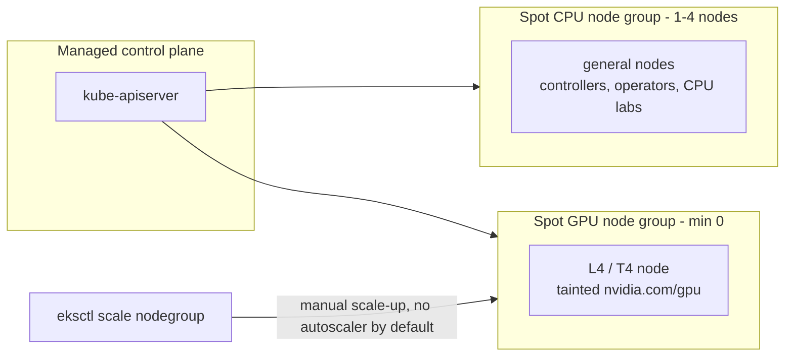

# 00 · Prerequisites and Cluster Setup

> Tools, a spot-first cluster on EKS, GPU quota, cost guardrails, and a fake-GPU trick so you can
> practise GPU scheduling before any GPU quota is approved.

## Before you start

This is the first chapter — there's no prior chapter output required. You do need, before you begin:

- Admin/owner-level access to an AWS account you're allowed to spend money on — cluster and
  GPU-quota changes need elevated IAM.
- Nothing installed yet is assumed; Step 1 installs the CLI toolchain for you.
- A `env.sh.example` → `env.sh` copy filled in with your AWS account/region before running any command
  below (every step sources `env.sh` + `versions.env`).

Everything chapters 01+ build on (the spot CPU/GPU node groups, the cluster itself, `versions.env`)
comes from this chapter's Step 4 (Cluster) — do that before starting chapter 01.

## 1. Why this matters

GPU work on Kubernetes goes wrong in boring ways before it goes wrong in interesting ones: the
quota is 0, the region has no G/VT spot capacity, the node group never scales down and you get a
surprise bill, or the spot pool can't get capacity. This chapter handles that up front:

- **Quota is a lead-time problem.** GPU quota requests can take hours to days. File them on day 1.
- **Spot first changes the cluster layout.** Spot nodes can be reclaimed with ~2 min notice on EKS.
  Make GPU pools **scale to zero**.
- **Budgets are your circuit breaker.** A single forgotten `g6.xlarge` running on-demand costs roughly
  as much as a month of a small CPU cluster. Budgets alert you; cleanup commands stop the spend.

## 2. Learning objectives and time plan (~3 h)

By the end you can:

1. Install and check the CLI toolchain (kubectl, helm, kustomize, aws/eksctl, k9s).
2. Explain which EC2 quotas limit **spot** GPUs and file increase requests.
3. Create a spot-first EKS cluster: a spot CPU node group plus a spot GPU node group at 0 nodes.
4. Set up an AWS Budget alert.
5. Advertise a fake `nvidia.com/gpu` on a CPU node and explain what the scheduler does with it and
   what it can't do.

| Time | Activity |
|---|---|
| 0:00–0:30 | Read sections 3–4. Install and verify tools (Step 1) |
| 0:30–1:00 | Quota check + request (do this first; it takes time to approve) |
| 1:00–1:15 | Budget (Step 3) |
| 1:15–2:15 | Create the cluster, then run the spot smoke test |
| 2:15–2:45 | Fake-GPU lab (`cpu-lab/`) |
| 2:45–3:00 | Checkpoint questions, cleanup |

## 3. Concepts

### 3.1 The cluster we build



| | EKS (eksctl managed node groups) |
|---|---|
| CPU node group | `spot-cpu`, 6 instance types, `spot: true`, 1–4 |
| GPU node group | `spot-gpu`, `g6.xlarge` / `g4dn.xlarge`, `spot: true`, **0–1** |
| Scale-from-zero | **No autoscaler by default**: scale manually or use Karpenter (`13-node-autoscaling-and-cost`) |
| Spot taint added automatically | No (we add `nvidia.com/gpu` taint on the GPU group ourselves) |
| GPU taint added automatically | No (set in `cluster.yaml`) |

### 3.2 Quotas that block spot GPUs

| Quota you need for **spot** GPUs | Unit | Also check |
|---|---|---|
| **All G and VT Spot Instance Requests** (`L-3819A6DF`) | vCPUs | `L-DB2E81BA` on-demand G/VT (fallback), `L-34B43A08` standard spot (CPU pool) |

A `g6.xlarge`/`g4dn.xlarge` is **4 vCPUs**, so a spot vCPU quota of 4 gives you exactly one GPU node.
Ask for 8.

### 3.3 Spot in one paragraph

**EC2 Spot (managed node groups)**: 2-minute interruption notice; EKS managed node groups turn on
Capacity Rebalancing and drain nodes. Label `eks.amazonaws.com/capacityType=SPOT`.

## 4. Lab

Setup (from repo root):

```bash
cp env.sh.example env.sh   # fill in values
source env.sh && source versions.env
```

### Step 1: Tools

What you're about to do: install the CLI toolchain and confirm every tool is on `PATH` before you
touch a cloud API.

macOS (Homebrew):
```bash
brew install kubernetes-cli helm kustomize k9s jq yq awscli eksctl
```
Linux: follow the official installers —
[kubectl](https://kubernetes.io/docs/tasks/tools/), [helm](https://helm.sh/docs/intro/install/),
[kustomize](https://kubectl.docs.kubernetes.io/installation/kustomize/),
[AWS CLI v2](https://docs.aws.amazon.com/cli/latest/userguide/getting-started-install.html),
[eksctl](https://eksctl.io/installation/), [k9s](https://k9scli.io/topics/install/) (optional).

```bash
for t in kubectl helm kustomize aws eksctl k9s jq; do
  command -v "$t" >/dev/null 2>&1 && printf "%-10s OK   %s\n" "$t" "$(command -v "$t")" \
                                   || printf "%-10s MISSING\n" "$t"
done
```
Expected:
```
kubectl    OK   /opt/homebrew/bin/kubectl
helm       OK   /opt/homebrew/bin/helm
...
eksctl     OK   /opt/homebrew/bin/eksctl
```
How to tell this worked: every tool prints `OK` with a path — none say `MISSING`.

Log in: `aws configure sso` (or `aws configure`).

### Step 2: Quota (start now, it takes time)

What you're about to do: run a read-only quota check, then file the increase request if it shows 0 —
approval can take hours, so kick it off before you need the GPU node group.

```bash
: "${AWS_REGION:?}"
for q in L-3819A6DF L-DB2E81BA L-34B43A08; do
  aws service-quotas get-service-quota --region "$AWS_REGION" --service-code ec2 --quota-code "$q" \
    --query 'Quota.[QuotaCode,QuotaName,Value]' --output text
done
```
Expected output:
```
L-3819A6DF  All G and VT Spot Instance Requests   0.0
L-DB2E81BA  Running On-Demand G and VT instances  0.0
L-34B43A08  All Standard (A, C, D, H, I, M, R, T, Z) Spot Instance Requests  5.0
```
How to tell this worked: `L-3819A6DF` (spot G/VT vCPUs) shows a nonzero limit before you try to
create the GPU node group, otherwise cluster creation will succeed but the GPU group will never get
capacity. Quotas are in vCPUs: one `g6.xlarge`/`g4dn.xlarge` = 4 vCPUs, so request at least 8:
```bash
aws service-quotas request-service-quota-increase --region "$AWS_REGION" \
  --service-code ec2 --quota-code L-3819A6DF --desired-value 8
```
Track it:
```bash
aws service-quotas list-requested-service-quota-change-history-by-quota --region "$AWS_REGION" \
  --service-code ec2 --quota-code L-3819A6DF
```

### Step 3: Budget (cost guardrail)

What you're about to do: create a monthly AWS Budget with email alerts at 50%/90% actual and 100%
forecast. Budgets **don't stop resources** — the real guardrails are: GPU node groups at min 0,
running cleanup after every session, and deleting clusters you aren't using.

```bash
ALERT_EMAIL="you@example.com"   # required
BUDGET_USD="${BUDGET_USD:-50}"
ACCOUNT_ID="${AWS_ACCOUNT_ID:-$(aws sts get-caller-identity --query Account --output text)}"
TMP="$(mktemp -d)"

cat > "$TMP/budget.json" <<JSON
{
  "BudgetName": "k8s-ai-lab-monthly",
  "BudgetLimit": {"Amount": "${BUDGET_USD}", "Unit": "USD"},
  "TimeUnit": "MONTHLY",
  "BudgetType": "COST"
}
JSON
notif() { printf '{"Notification":{"NotificationType":"%s","ComparisonOperator":"GREATER_THAN","Threshold":%s,"ThresholdType":"PERCENTAGE"},"Subscribers":[{"SubscriptionType":"EMAIL","Address":"%s"}]}' "$1" "$2" "$ALERT_EMAIL"; }
echo "[$(notif ACTUAL 50),$(notif ACTUAL 90),$(notif FORECASTED 100)]" > "$TMP/notifications.json"

aws budgets create-budget --account-id "$ACCOUNT_ID" \
  --budget "file://$TMP/budget.json" \
  --notifications-with-subscribers "file://$TMP/notifications.json"
aws budgets describe-budgets --account-id "$ACCOUNT_ID" --query 'Budgets[].BudgetName'
rm -rf "$TMP"
```
How to tell this worked: `describe-budgets` lists `k8s-ai-lab-monthly`.

### Step 4: Cluster

What you're about to do: create the spot-first EKS cluster that every later chapter runs on
(~15–20 min). [`eks/cluster.yaml`](eks/cluster.yaml) defines a `spot-cpu` managed node group (1–4
nodes) and a `spot-gpu` node group (0–1 nodes, tainted `nvidia.com/gpu=present:NoSchedule`).
`--install-nvidia-plugin=false` is intentional — chapter 01 installs a pinned device plugin instead
of eksctl's unpinned default DaemonSet.

```bash
: "${AWS_REGION:?}" "${EKS_CLUSTER:?}"
export AWS_REGION EKS_CLUSTER
command -v envsubst >/dev/null || { echo "envsubst missing: brew install gettext"; exit 1; }
envsubst '${EKS_CLUSTER} ${AWS_REGION}' < 00-prerequisites-and-cluster-setup/eks/cluster.yaml \
  > 00-prerequisites-and-cluster-setup/eks/.cluster.rendered.yaml
eksctl create cluster -f 00-prerequisites-and-cluster-setup/eks/.cluster.rendered.yaml \
  --install-nvidia-plugin=false
kubectl get nodes -L eks.amazonaws.com/nodegroup,eks.amazonaws.com/capacityType,node.kubernetes.io/instance-type
```
Expected output:
```
NAME                          STATUS  NODEGROUP  CAPACITYTYPE  INSTANCE-TYPE
ip-192-168-12-34.ec2.internal Ready   spot-cpu   SPOT          m5.large
ip-192-168-55-10.ec2.internal Ready   spot-cpu   SPOT          t3a.large
```
How to tell this worked: `eksctl get cluster` shows `ACTIVE`, and `kubectl get nodes` shows 1-2
`spot-cpu` nodes Ready.

### Step 5: Spot smoke test

```bash
kubectl apply -k 00-prerequisites-and-cluster-setup/eks
kubectl -n ch00-setup get pods -o wide
kubectl -n ch00-setup scale deploy/spot-smoke --replicas=12
kubectl get nodes -w
```
The deployment won't grow past the node group's `desiredCapacity` because nothing autoscales it —
that's expected on EKS without Cluster Autoscaler/Karpenter (chapter 13).

### Step 6: Fake-GPU scheduling lab (works on any cluster, even kind/minikube)

Based on the official task [Advertise Extended Resources for a Node](https://kubernetes.io/docs/tasks/administer-cluster/extended-resource-node/).
Extended resources are **opaque integers** to the scheduler. The device plugin (chapter 01) normally
reports `nvidia.com/gpu` through the kubelet; here we write it to node status by hand.

What you're about to do: patch a CPU node's status to advertise a fake `nvidia.com/gpu: 2`, label and
taint it like a real GPU node, then schedule pods against it.

```bash
NODE=$(kubectl get nodes -o jsonpath='{.items[0].metadata.name}')
COUNT=2
RESOURCE=nvidia.com/gpu
ESCAPED="${RESOURCE//\//~1}"   # JSON Pointer escaping: "/" -> "~1"

# Safety: refuse to touch a node that already looks like a real GPU node.
kubectl get node "$NODE" -o jsonpath='{.metadata.labels}' | grep -qE 'nvidia.com/gpu.present|workload":"gpu' \
  && { echo "Refusing: $NODE looks like a real GPU node."; exit 1; }

kubectl patch node "$NODE" --subresource=status --type=json \
  -p "[{\"op\":\"add\",\"path\":\"/status/capacity/${ESCAPED}\",\"value\":\"${COUNT}\"}]"
kubectl label node "$NODE" fake-gpu=true --overwrite
kubectl taint node "$NODE" nvidia.com/gpu=present:NoSchedule --overwrite
kubectl get node "$NODE" -o jsonpath="{.status.capacity}{'\n'}{.status.allocatable}{'\n'}"
```
```
{"cpu":"4","ephemeral-storage":"...","memory":"...","nvidia.com/gpu":"2","pods":"110"}
{"cpu":"3920m",...,"nvidia.com/gpu":"2",...}
```
```bash
kubectl apply -k 00-prerequisites-and-cluster-setup/cpu-lab
kubectl -n ch00-setup get pods -l app=fake-gpu-consumer
kubectl -n ch00-setup describe pod -l app=fake-gpu-consumer | grep -A3 Events
kubectl describe node "$NODE" | grep -A8 "Allocated resources"
```
```
fake-gpu-consumer-7c9d8-2x4mz   1/1   Running
fake-gpu-consumer-7c9d8-8kq2n   1/1   Running
fake-gpu-consumer-7c9d8-tl5vw   0/1   Pending
  Warning  FailedScheduling  0/3 nodes are available: 1 Insufficient nvidia.com/gpu, 2 node(s) didn't match Pod's node affinity/selector.
  nvidia.com/gpu     2          2
```
Things to try: delete the toleration (the pod is rejected by the taint), request `nvidia.com/gpu: 0.5`
(the API server rejects it because extended resources must be integers), set `requests` ≠ `limits`
(rejected: no overcommit).

Cleanup (always run this when finished):
```bash
kubectl delete -k 00-prerequisites-and-cluster-setup/cpu-lab
kubectl patch node "$NODE" --subresource=status --type=json \
  -p "[{\"op\":\"remove\",\"path\":\"/status/capacity/${ESCAPED}\"}]" || true
kubectl label node "$NODE" fake-gpu- || true
kubectl taint node "$NODE" nvidia.com/gpu=present:NoSchedule- || true
```

**Caveats: what doesn't carry over**
- No device is injected. `nvidia-smi` and CUDA fail. Only the scheduling mechanics (requests, taints, Pending reasons, bin-packing) carry over.
- The patch lives in node status only. Replacing a node (spot preemption, autoscaler scale-down, upgrade, node
  re-registration) loses it. A kubelet restart may zero extended resources it doesn't own.
- Don't use this on a node that runs a real device plugin. The kubelet will overwrite it, and you'd corrupt accounting.
- The autoscaler doesn't know the "GPU" exists, so a Pending fake-GPU pod **won't** trigger a scale-up.
  On a managed cluster, prefer a custom name such as `RESOURCE=example.com/fake-gpu` if you don't want
  any tool (e.g. cost dashboards) to treat the node as a GPU node.

## 5. Spot considerations for this chapter

- **Capacity, not only price.** Spot GPU pools can sit at 0 because the region has no G/VT spot
  capacity. Mitigate with several instance types (already the case in `cluster.yaml`) or another
  region. Chapter 13 covers diversification further.
- **Keep control-plane-like workloads off GPU spot nodes.** Operators and controllers belong on the CPU pool. The GPU taint enforces this.
- **Scale-to-zero means cold starts.** First GPU pod: node boot + driver (already on the AL2023 NVIDIA AMI) + image pull takes about 3–10 min. Budget for it in labs.
- **On-demand fallback**: remove `spot: true` (capacity type `ON_DEMAND`) in `cluster.yaml`. Chapter 01's commands take `ON_DEMAND=true`.

## 6. Troubleshooting

| Symptom | Cause | Fix |
|---|---|---|
| Nodegroup `CREATE_FAILED` `MaxSpotInstanceCountExceeded` / `VcpuLimitExceeded` | `L-3819A6DF` quota | Request increase; meanwhile keep GPU group at 0 |
| Spot group stuck `desired 1 / 0 running`, `InsufficientInstanceCapacity` | No spot capacity for those types/AZs | Add types (`g6.2xlarge`, `g5.xlarge`), other AZs, or on-demand |
| Fake GPU vanished | Node replaced or kubelet reconciled status | Re-run the fake-GPU patch (Step 6) |

## 7. Cleanup and cost notes

```bash
kubectl delete -k 00-prerequisites-and-cluster-setup/eks --ignore-not-found
eksctl scale nodegroup --cluster "$EKS_CLUSTER" --region "$AWS_REGION" --name spot-gpu --nodes 0 --nodes-min 0
```
Full teardown (control plane costs ~USD 0.10/h even with zero nodes):
```bash
eksctl delete cluster --name "$EKS_CLUSTER" --region "$AWS_REGION" --wait
```
Check for leftover EBS volumes / load balancers in `$AWS_REGION` after deleting the cluster.
- Rough spot prices (vary by region and time; always check): `g6.xlarge`/`g4dn.xlarge` spot are usually **tens of cents per hour**. On-demand is 2–4× more.
- Orphans that keep billing after cluster deletion: EBS volumes, load balancers.

## 8. Checkpoint questions

1. Why is a spot GPU node group configured with min 0, and what latency does that add?
2. Which EC2 quota must be ≥1 to start one spot G/VT GPU node, and what unit is it measured in?
3. EKS: the GPU node group has `minSize: 0`. What scales it up when a GPU pod is Pending in this chapter's setup?
4. What exactly does the fake-GPU patch change, and which component normally writes that field?
5. Name two things that silently remove a fake extended resource.
6. Why must `nvidia.com/gpu` requests equal limits and be integers?

<details>
<summary>Answers</summary>

1. Idle GPUs are the biggest cost. Min 0 means you pay nothing when idle. The cost is a cold start: node provisioning, driver load (baked into the AMI) and image pull, often 3–10 minutes.
2. `L-3819A6DF` (All G and VT Spot Instance Requests), measured in vCPUs — one `g6.xlarge`/`g4dn.xlarge` is 4 vCPUs.
3. Nothing. EKS has no autoscaler by default. You scale the managed node group (`eksctl scale nodegroup`) or install Cluster Autoscaler/Karpenter (chapter 13).
4. It adds `nvidia.com/gpu: N` to `.status.capacity` (and so to allocatable). Normally the kubelet sets it from what a device plugin registered.
5. Node replacement (spot preemption, scale-down, upgrade) and kubelet re-registration/reconciliation. A real device plugin on the node would also overwrite it.
6. Extended resources can't be overcommitted or split. The scheduler counts whole devices, so request must equal limit (or limit only) and be an integer.
</details>

## 9. Further reading and versions tested

- EKS: [eksctl spot](https://docs.aws.amazon.com/eks/latest/eksctl/spot-instances.html), [eksctl GPU support](https://docs.aws.amazon.com/eks/latest/eksctl/gpu-support.html), [Spot Instance quotas](https://docs.aws.amazon.com/AWSEC2/latest/UserGuide/using-spot-limits.html), [AWS Budgets](https://docs.aws.amazon.com/cost-management/latest/userguide/budgets-create.html)
- Kubernetes: [Advertise Extended Resources for a Node](https://kubernetes.io/docs/tasks/administer-cluster/extended-resource-node/)

**Versions tested** (2026-09-16): Kubernetes 1.35 (EKS `version: "1.35"`), eksctl v0.230.0 schema, kubectl 1.36 client / kustomize v5.8.1, images `registry.k8s.io/pause:3.10.1`, `busybox:1.37.0`.
