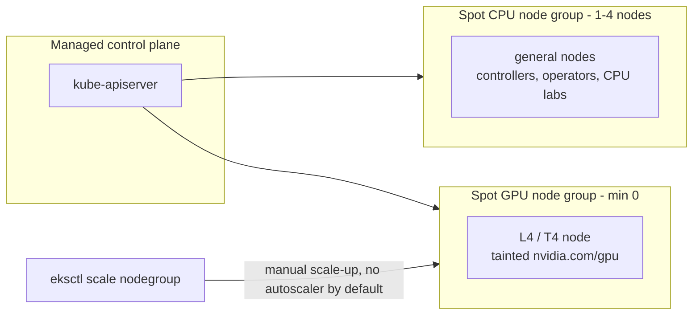

# 00 · Prerequisites and Cluster Setup

> Tools, a spot-first cluster on EKS, GPU quota, cost guardrails, and a fake-GPU trick so you can
> practise GPU scheduling before any GPU quota is approved.

**New to Kubernetes and GPU infrastructure?** This chapter is written for you. Every new term is
explained in plain English the first time it shows up, and every command block says what it does and
*why* before you run it. You don't need any prior Kubernetes or AWS experience — you do need an AWS
account and a willingness to read before you paste.

## 0. Before you start

This is the first chapter — there's no prior chapter output required. You do need, before you begin:

- Admin/owner-level access to an AWS account you're allowed to spend money on — cluster and
  GPU-quota changes need elevated IAM (AWS's permission system; think of it as the set of locks and
  keys that decide who can create/delete things in your account). If this is a personal account, your
  everyday login is probably already an admin. If it's a company account, ask whoever manages AWS
  access for a role that can create EKS clusters, EC2 instances, and IAM roles.
- Nothing installed yet is assumed; Step 1 installs the CLI toolchain for you.
- A `env.sh.example` → `env.sh` copy filled in with your AWS account/region before running any command
  below (every step sources `env.sh` + `versions.env`).

> **What is a "cluster", exactly?** Throughout this chapter you'll create a Kubernetes *cluster* — a
> group of machines (called **nodes**) that are managed as one unit by Kubernetes software so you can
> deploy containerized applications without manually deciding "which specific computer runs this." One
> node runs the "brain" (the **control plane**, explained in section 3), and the rest run your actual
> workloads. On EKS ("Elastic Kubernetes Service"), AWS manages the control plane for you; you only
> manage the worker nodes.

Everything chapters 01+ build on (the spot CPU/GPU node groups, the cluster itself, `versions.env`)
comes from this chapter's Step 4 (Cluster) — do that before starting chapter 01.

## 1. Why this matters

GPU work on Kubernetes goes wrong in boring ways before it goes wrong in interesting ones: the
quota is 0, the region has no G/VT spot capacity, the node group never scales down and you get a
surprise bill, or the spot pool can't get capacity. This chapter handles that up front:

- **Quota is a lead-time problem.** Every AWS account has a limit ("quota") on how many GPU instances
  it's allowed to run, and by default that limit is often **zero** for the cheap "spot" GPU capacity
  this course uses. GPU quota requests can take hours to days for AWS to approve. File them on day 1,
  before you need them, or you'll be stuck waiting mid-lab in a later chapter.
- **Spot first changes the cluster layout.** "Spot" is a way of renting AWS compute at a steep discount
  (often 60–90% off) in exchange for AWS being able to take the machine back with only about 2 minutes'
  notice, if it needs the capacity for someone paying full price. That trade-off is worth it for a
  learning environment, but it means your GPU node pool must be designed to **scale to zero** (run no
  machines, and therefore cost nothing, when you're not actively using it) and to tolerate a node
  disappearing without warning.
- **Budgets are your circuit breaker.** A single forgotten `g6.xlarge` GPU instance running on-demand
  (i.e., at full, non-discounted price, left running by accident) costs roughly as much as a month of a
  small CPU cluster. AWS **does not stop spending on its own** — nothing in AWS automatically shuts
  things down for you. Budgets alert you by email; the cleanup commands in this chapter are what
  actually stop the spend. Treat "set up the budget alert" as mandatory, not optional, especially if
  this is a personal account with a card attached to it.

## 2. Learning objectives and time plan (~3 h)

By the end you can:

1. Install and check the CLI toolchain (kubectl, helm, kustomize, aws/eksctl, k9s).
2. Explain which EC2 quotas limit **spot** GPUs and file increase requests.
3. Create a spot-first EKS cluster: a spot CPU node group plus a spot GPU node group at 0 nodes.
4. Set up an AWS Budget alert.
5. Advertise a fake `nvidia.com/gpu` on a CPU node and explain what the scheduler does with it and
   what it can't do.

| Time | Activity |
|---|---|
| 0:00–0:30 | Read sections 3–4. Install and verify tools (Step 1) |
| 0:30–1:00 | Quota check + request (do this first; it takes time to approve) |
| 1:00–1:15 | Budget (Step 3) |
| 1:15–2:15 | Create the cluster, then run the spot smoke test |
| 2:15–2:45 | Fake-GPU lab (`cpu-lab/`) |
| 2:45–3:00 | Checkpoint questions, cleanup |

## 3. Concepts

If you've never seen a Kubernetes diagram before, read this section slowly — it introduces the
vocabulary every later chapter assumes you already know.

### 3.0 The words you'll see everywhere

- **Node** — a single machine (a virtual machine, in AWS's case an EC2 instance) that's part of the
  cluster. Some nodes are "worker" nodes that run your actual applications.
- **Pod** — the smallest unit Kubernetes schedules. Usually one Pod = one running instance of your
  application (technically a Pod can hold more than one tightly-coupled container, but "one container"
  is the common case). You don't place Pods on nodes yourself — you describe what you want, and
  Kubernetes's **scheduler** decides which node runs it.
- **Node group** (AWS/EKS term: "managed node group") — a set of nodes that all share the same
  configuration (instance type, whether they're spot or on-demand, labels, taints) and that AWS scales
  up/down together, like an autoscaling group in plain EC2 (because that's literally what it's built
  on). This chapter creates two node groups: one for ordinary CPU work, one for GPU work.
  "Node group" and "managed node group" are used interchangeably here — EKS also supports
  self-managed/unmanaged node groups you provision yourself, but we don't use those in this course.
- **Taint** and **toleration** — a **taint** is a marker you put on a node that says "don't schedule
  Pods here unless they explicitly say they're okay with this." A **toleration** is what a Pod adds to
  say "I'm okay with that taint." Think of a taint as a locked door and a toleration as the matching
  key — without the key (toleration), a Pod is simply never placed on that node. We taint the GPU node
  group so that ordinary (non-GPU) Pods don't accidentally land on your expensive GPU machines.
- **Label** — a free-form key/value tag you attach to a node or Pod (e.g. `workload: gpu`). Unlike a
  taint, a label doesn't block anything by itself — it's used for *selecting* things, e.g. "only run
  this Pod on nodes labeled `workload: gpu`."
- **Spot instance** — see section 3.3 below; it gets its own section because getting this wrong is the
  single most common way people either waste money or get confused why their Pods won't schedule.
- **IAM** ("Identity and Access Management") — AWS's system for who/what is allowed to do what. OIDC
  ("OpenID Connect") is a way for Kubernetes service accounts to get temporary AWS IAM credentials
  without you managing long-lived secret keys. You'll see `iam.withOIDC: true` in the cluster config —
  this course doesn't use it directly in this chapter, but later chapters (autoscaling, storage,
  observability) need it, so we turn it on now rather than having to reconfigure the cluster later.
- **kubeconfig** — a file (by default `~/.kube/config`) that tells `kubectl` which cluster to talk to
  and how to authenticate. `eksctl create cluster` writes/updates this file for you automatically, which
  is why `kubectl` commands "just work" right after cluster creation without any extra login step.

### 3.1 The cluster we build



Reading this diagram box by box, for anyone who hasn't seen one of these before:

- **`CP` — Managed control plane.** This is the "brain" of Kubernetes: the components that store
  cluster state and decide what should run where. On EKS, AWS runs and patches this for you on its own
  infrastructure — you never SSH into it, and it isn't one of "your" EC2 instances. Inside it,
  `kube-apiserver` is the single front door every tool (`kubectl`, `eksctl`, Helm, the scheduler, the
  nodes themselves) talks to. When you run `kubectl get nodes`, your laptop is making an HTTPS request
  to this API server, not to the nodes directly.
- **`CPU` — Spot CPU node group (1–4 nodes).** These are ordinary EC2 instances that run everything
  that isn't GPU work: Kubernetes system components, any operators/controllers this course installs in
  later chapters, and the "fake GPU" lab you'll run at the end of this chapter. It always has at least
  1 node running (it never scales to zero) because something has to be available to run the cluster's
  own housekeeping Pods.
- **`GPU` — Spot GPU node group (min 0).** These would be actual GPU-equipped EC2 instances (an
  `g6.xlarge` has an NVIDIA L4 GPU; a `g4dn.xlarge` has an NVIDIA T4). "min 0" means AWS is allowed to
  run **zero** of these machines most of the time — you only pay for one when you explicitly scale the
  group up (or, starting in chapter 13, when an autoscaler does it for you because a Pod needs a GPU).
  It's tainted so nothing lands on it by accident.
- **The two arrows from `API`** show that the control plane is aware of, and can schedule Pods onto,
  both node groups — it's one cluster, just with two differently-configured pools of machines inside
  it.
- **The `eksctl scale nodegroup` arrow into `GPU`** is the important asterisk: EKS, out of the box,
  does **not** include software that watches for "a Pod wants a GPU and none is available" and reacts by
  turning on a machine. You do that manually with `eksctl scale nodegroup` in this chapter. Chapter 13
  installs an autoscaler (Karpenter) that automates this arrow — until then, if the GPU group is at 0
  nodes, GPU Pods just sit in `Pending` state forever, waiting for you to scale the group up by hand.

| | EKS (eksctl managed node groups) |
|---|---|
| CPU node group | `spot-cpu`, 6 instance types, `spot: true`, 1–4 |
| GPU node group | `spot-gpu`, `g6.xlarge` / `g4dn.xlarge`, `spot: true`, **0–1** |
| Scale-from-zero | **No autoscaler by default**: scale manually or use Karpenter (`13-node-autoscaling-and-cost`) |
| Spot taint added automatically | No (we add `nvidia.com/gpu` taint on the GPU group ourselves) |
| GPU taint added automatically | No (set in `cluster.yaml`) |

### 3.2 Quotas that block spot GPUs

Every AWS account has service quotas — hard ceilings on how much of a given resource you're allowed
to provision at once, measured per region. They exist so that, among other things, a compromised or
buggy account can't accidentally (or maliciously) spin up unlimited expensive hardware. New accounts
typically start with the **spot GPU quota at zero**, which means `eksctl create cluster` will happily
create the *node group configuration*, but AWS will refuse to actually launch any GPU instances into
it until the quota is raised.

| Quota you need for **spot** GPUs | Unit | Also check |
|---|---|---|
| **All G and VT Spot Instance Requests** (`L-3819A6DF`) | vCPUs | `L-DB2E81BA` on-demand G/VT (fallback), `L-34B43A08` standard spot (CPU pool) |

A `g6.xlarge`/`g4dn.xlarge` is **4 vCPUs**, so a spot vCPU quota of 4 gives you exactly one GPU node.
Ask for 8.

### 3.3 Spot in one paragraph

**EC2 Spot (managed node groups)**: AWS sells unused EC2 capacity at a discount as "Spot Instances."
The catch: if AWS needs that capacity back (for a customer paying on-demand price, or because the spot
pool for that instance type/AZ dries up), your instance gets a **2-minute interruption notice** before
it's reclaimed — there is no way to "keep" it past that. EKS managed node groups turn on **Capacity
Rebalancing**, which watches for an early signal that a spot instance is at elevated risk of
interruption and proactively starts draining/replacing it *before* the hard 2-minute notice, so your
workloads get a bit more warning than the bare minimum. Every spot node in this course carries the
label `eks.amazonaws.com/capacityType=SPOT`, which is how you (and Kubernetes tooling) can tell a spot
node apart from an on-demand one at a glance with `kubectl get nodes -L eks.amazonaws.com/capacityType`.
The practical upshot for anyone new to this: **never assume a spot node, or anything running only on
it, will still exist a minute from now** — design/test workloads (and your expectations while running
labs) accordingly.

## 4. Lab

Setup (from repo root):

```bash
# env.sh holds account-specific values (AWS account ID, region, cluster name) that every command
# in this course reads instead of hardcoding — this is the one file you edit before anything else.
# versions.env pins every tool/chart/image version this course was tested against, so commands behave
# the same for you as they did when this chapter was written.
cp env.sh.example env.sh   # fill in values
source env.sh && source versions.env
```

### Step 1: Tools

What you're about to do: install the CLI toolchain and confirm every tool is on `PATH` before you
touch a cloud API. A quick who's-who, since none of these names are self-explanatory if you're new:

- **`kubectl`** — the command-line tool you use to talk to a Kubernetes cluster's API server (create,
  inspect, delete resources). This is the tool you'll type most often in this entire course.
- **`helm`** — a package manager for Kubernetes, similar in spirit to `apt`/`brew` but for Kubernetes
  applications ("charts"). Later chapters install things like monitoring stacks via Helm.
- **`kustomize`** — a way to compose/patch plain Kubernetes YAML files without templating (this repo
  uses it for every chapter's manifests, including this one's `eks/` and `cpu-lab/` folders).
- **`aws` (AWS CLI v2)** — the general-purpose command line for AWS itself (IAM, quotas, budgets, EC2
  — anything that isn't specifically Kubernetes).
- **`eksctl`** — a higher-level CLI, maintained by AWS, specifically for creating/managing EKS
  clusters and their node groups. It wraps a lot of underlying AWS API calls (VPC creation, IAM role
  creation, CloudFormation stacks) into one command.
- **`k9s`** — an optional terminal UI for browsing a running cluster interactively; handy once you
  have a cluster, not required to complete this chapter.

macOS (Homebrew):
```bash
brew install kubernetes-cli helm kustomize k9s jq yq awscli eksctl
```
Linux: follow the official installers —
[kubectl](https://kubernetes.io/docs/tasks/tools/), [helm](https://helm.sh/docs/intro/install/),
[kustomize](https://kubectl.docs.kubernetes.io/installation/kustomize/),
[AWS CLI v2](https://docs.aws.amazon.com/cli/latest/userguide/getting-started-install.html),
[eksctl](https://eksctl.io/installation/), [k9s](https://k9scli.io/topics/install/) (optional).

Now verify every tool actually landed on your shell's `PATH` (the list of directories your shell
searches when you type a command name) — it's much cheaper to catch a missing/misnamed tool here than
three steps into cluster creation:

```bash
for t in kubectl helm kustomize aws eksctl k9s jq; do
  command -v "$t" >/dev/null 2>&1 && printf "%-10s OK   %s\n" "$t" "$(command -v "$t")" \
                                   || printf "%-10s MISSING\n" "$t"
done
```
Expected:
```
kubectl    OK   /opt/homebrew/bin/kubectl
helm       OK   /opt/homebrew/bin/helm
...
eksctl     OK   /opt/homebrew/bin/eksctl
```
How to tell this worked: every tool prints `OK` with a path — none say `MISSING`.

Log in: `aws configure sso` (or `aws configure`). Either command asks you for AWS credentials
interactively and stores them locally so every later `aws`/`eksctl` command in this course is
automatically authenticated — `aws configure sso` is the modern flow if your organization uses AWS SSO
/ IAM Identity Center; `aws configure` is the simpler flow for a personal account with a long-lived
access key.

### Step 2: Quota (start now, it takes time)

What you're about to do: run a read-only quota check, then file the increase request if it shows 0 —
approval can take hours, so kick it off before you need the GPU node group. Doing this step *now*,
before the cluster even exists, is the single highest-leverage thing in this chapter: everything else
here takes minutes, this can take hours to days, and it silently blocks Step 4 if you skip it.

```bash
: "${AWS_REGION:?}"
# For each quota code, print its current numeric limit for this account+region.
# 0.0 means "you currently cannot launch any instances against this quota" — not "unlimited".
for q in L-3819A6DF L-DB2E81BA L-34B43A08; do
  aws service-quotas get-service-quota --region "$AWS_REGION" --service-code ec2 --quota-code "$q" \
    --query 'Quota.[QuotaCode,QuotaName,Value]' --output text
done
```
Expected output:
```
L-3819A6DF  All G and VT Spot Instance Requests   0.0
L-DB2E81BA  Running On-Demand G and VT instances  0.0
L-34B43A08  All Standard (A, C, D, H, I, M, R, T, Z) Spot Instance Requests  5.0
```
How to tell this worked: `L-3819A6DF` (spot G/VT vCPUs) shows a nonzero limit before you try to
create the GPU node group, otherwise cluster creation will succeed but the GPU group will never get
capacity. Quotas are in vCPUs: one `g6.xlarge`/`g4dn.xlarge` = 4 vCPUs, so request at least 8 (giving
yourself headroom for two nodes, or one node plus a bit of margin for AWS rounding/timing quirks):
```bash
# Files an increase request; AWS reviews it asynchronously (often auto-approved for small increases,
# but can take hours). This does not create any billable resource by itself.
aws service-quotas request-service-quota-increase --region "$AWS_REGION" \
  --service-code ec2 --quota-code L-3819A6DF --desired-value 8
```
Track it (re-run this anytime to check whether AWS has approved the request yet):
```bash
aws service-quotas list-requested-service-quota-change-history-by-quota --region "$AWS_REGION" \
  --service-code ec2 --quota-code L-3819A6DF
```

### Step 3: Budget (cost guardrail)

What you're about to do: create a monthly AWS Budget with email alerts at 50%/90% actual and 100%
forecast. This is your safety net for the most common way people new to cloud infrastructure get an
unpleasant bill: forgetting a resource is running. **Budgets don't stop resources** — an AWS Budget can
only *notify* you (there is no built-in "auto-shutdown" here) — the real guardrails are: GPU node
groups at min 0 (so idle time costs nothing), running cleanup after every session, and deleting
clusters you aren't using. Set this up now, before you create anything billable, not after.

```bash
ALERT_EMAIL="you@example.com"   # required — replace with an address you actually check
BUDGET_USD="${BUDGET_USD:-50}"  # monthly ceiling in USD; raise/lower to match what you're comfortable risking
# Look up your 12-digit AWS account ID automatically if you haven't already exported AWS_ACCOUNT_ID.
ACCOUNT_ID="${AWS_ACCOUNT_ID:-$(aws sts get-caller-identity --query Account --output text)}"
TMP="$(mktemp -d)"   # scratch directory for the JSON files the AWS CLI needs as input; cleaned up below

cat > "$TMP/budget.json" <<JSON
{
  "BudgetName": "k8s-ai-lab-monthly",
  "BudgetLimit": {"Amount": "${BUDGET_USD}", "Unit": "USD"},
  "TimeUnit": "MONTHLY",
  "BudgetType": "COST"
}
JSON
# notif() builds one "when spend crosses this % threshold, email this address" rule.
# We create three: two based on ACTUAL spend so far (50%, 90%), one based on AWS's
# end-of-month FORECAST (100%) so you get warned even before you've actually spent it all.
notif() { printf '{"Notification":{"NotificationType":"%s","ComparisonOperator":"GREATER_THAN","Threshold":%s,"ThresholdType":"PERCENTAGE"},"Subscribers":[{"SubscriptionType":"EMAIL","Address":"%s"}]}' "$1" "$2" "$ALERT_EMAIL"; }
echo "[$(notif ACTUAL 50),$(notif ACTUAL 90),$(notif FORECASTED 100)]" > "$TMP/notifications.json"

aws budgets create-budget --account-id "$ACCOUNT_ID" \
  --budget "file://$TMP/budget.json" \
  --notifications-with-subscribers "file://$TMP/notifications.json"
aws budgets describe-budgets --account-id "$ACCOUNT_ID" --query 'Budgets[].BudgetName'
rm -rf "$TMP"   # delete the scratch JSON files; the budget itself now lives in AWS, not on disk
```
How to tell this worked: `describe-budgets` lists `k8s-ai-lab-monthly`. Check your inbox (and spam
folder) for a confirmation — AWS Budgets emails can be easy to miss the first time.

### Step 4: Cluster

What you're about to do: create the spot-first EKS cluster that every later chapter runs on
(~15–20 min). This is the biggest, most consequential command in this chapter — it provisions real,
billable AWS infrastructure (a VPC, IAM roles, the EKS control plane, and the node groups), so make
sure Steps 2 (quota) and 3 (budget) are done first.

[`eks/cluster.yaml`](eks/cluster.yaml) is an `eksctl` **ClusterConfig** — a YAML file that describes,
declaratively, everything about the cluster you want (instead of you typing dozens of individual
`eksctl create nodegroup` flags). Reading through what it defines:

- A `spot-cpu` managed node group (1–4 nodes, six different instance types, `spot: true`) — see
  section 3.1 for what this is for.
- A `spot-gpu` node group (0–1 nodes, tainted `nvidia.com/gpu=present:NoSchedule`) — created but kept
  at zero running instances until you explicitly scale it up, exactly like the diagram in section 3.1.
- `iam.withOIDC: true` — turns on the IAM/OIDC integration mentioned in section 3.0. Nothing in this
  chapter uses it yet, but retrofitting it onto an existing cluster later is more painful than turning
  it on now.
- `--install-nvidia-plugin=false` is intentional — chapter 01 installs a pinned NVIDIA device plugin
  (the software that actually reports each GPU to Kubernetes so Pods can request it) instead of
  eksctl's unpinned default DaemonSet, so this course keeps a known-good, reproducible version instead
  of "whatever eksctl currently defaults to."

```bash
: "${AWS_REGION:?}" "${EKS_CLUSTER:?}"
export AWS_REGION EKS_CLUSTER
# envsubst substitutes the ${EKS_CLUSTER} / ${AWS_REGION} placeholders in cluster.yaml with your
# actual values from env.sh, without needing a templating engine. It ships with `gettext`.
command -v envsubst >/dev/null || { echo "envsubst missing: brew install gettext"; exit 1; }
envsubst '${EKS_CLUSTER} ${AWS_REGION}' < 00-prerequisites-and-cluster-setup/eks/cluster.yaml \
  > 00-prerequisites-and-cluster-setup/eks/.cluster.rendered.yaml
# This is the actual cluster-creation call. Under the hood, eksctl creates a VPC and subnets (unless
# you point it at existing ones), an EKS control plane, IAM roles for the control plane and each node
# group, and then an EC2 Auto Scaling Group per node group — all via CloudFormation stacks it manages
# for you. Expect this to take 15-20 minutes; most of that time is AWS provisioning the control plane.
eksctl create cluster -f 00-prerequisites-and-cluster-setup/eks/.cluster.rendered.yaml \
  --install-nvidia-plugin=false
# eksctl also writes/updates your local kubeconfig (see section 3.0) so kubectl immediately points at
# this new cluster — no separate login step needed.
kubectl get nodes -L eks.amazonaws.com/nodegroup,eks.amazonaws.com/capacityType,node.kubernetes.io/instance-type
```
Expected output:
```
NAME                          STATUS  NODEGROUP  CAPACITYTYPE  INSTANCE-TYPE
ip-192-168-12-34.ec2.internal Ready   spot-cpu   SPOT          m5.large
ip-192-168-55-10.ec2.internal Ready   spot-cpu   SPOT          t3a.large
```
How to tell this worked: `eksctl get cluster` shows `ACTIVE`, and `kubectl get nodes` shows 1-2
`spot-cpu` nodes Ready. Notice there are **no GPU nodes listed yet** — that's expected, the `spot-gpu`
group is still at 0 nodes on purpose (see section 3.1).

### Step 5: Spot smoke test

What you're about to do: deploy a trivial workload and try to scale it past what the CPU node group
can hold, to see with your own eyes what "no autoscaler" actually looks like before you rely on that
fact in later chapters. `kubectl apply -k <dir>` means "apply the kustomize-built manifests in this
directory" — `-k` tells `kubectl` to run them through `kustomize` first (see section 4, Step 1, tool
list).

```bash
kubectl apply -k 00-prerequisites-and-cluster-setup/eks
kubectl -n ch00-setup get pods -o wide
# Ask for 12 copies of the same tiny Pod - far more than the 1-4 node CPU pool can actually fit.
kubectl -n ch00-setup scale deploy/spot-smoke --replicas=12
kubectl get nodes -w   # -w "watches" (streams) changes live; Ctrl-C to stop watching
```
The deployment won't grow past the node group's `desiredCapacity` because nothing autoscales it —
that's expected on EKS without Cluster Autoscaler/Karpenter (chapter 13). In other words: extra Pods
beyond what already-running nodes can fit will sit in `Pending` state indefinitely, and no new EC2
instances will appear on their own. That's the exact mechanism you'll rely on being *fixed* once you
install an autoscaler in chapter 13 — for now, seeing it *not* happen is the point of this smoke test.

### Step 6: Fake-GPU scheduling lab (works on any cluster, even kind/minikube)

Based on the official task [Advertise Extended Resources for a Node](https://kubernetes.io/docs/tasks/administer-cluster/extended-resource-node/).
Extended resources are **opaque integers** to the scheduler — Kubernetes doesn't know or care that
`nvidia.com/gpu` means "a GPU"; it just treats it as a countable thing a node has some quantity of, and
matches Pod requests against it, the same way it matches `cpu`/`memory` requests. The device plugin
(chapter 01) normally reports `nvidia.com/gpu` through the kubelet automatically; here we write it into
node status **by hand**, so you can practice GPU scheduling mechanics (taints, requests, `Pending`
reasons) today, on a plain CPU node, without waiting for GPU quota approval or paying for a GPU
instance.

What you're about to do: patch a CPU node's status to advertise a fake `nvidia.com/gpu: 2`, label and
taint it like a real GPU node, then schedule pods against it.

```bash
NODE=$(kubectl get nodes -o jsonpath='{.items[0].metadata.name}')
COUNT=2
RESOURCE=nvidia.com/gpu
ESCAPED="${RESOURCE//\//~1}"   # JSON Pointer escaping: "/" -> "~1"

# Safety: refuse to touch a node that already looks like a real GPU node.
kubectl get node "$NODE" -o jsonpath='{.metadata.labels}' | grep -qE 'nvidia.com/gpu.present|workload":"gpu' \
  && { echo "Refusing: $NODE looks like a real GPU node."; exit 1; }

# --subresource=status: node "status" (what capacity/condition a node reports) is a separate
# sub-resource from node "spec" (what it's configured to be). Normally only the kubelet is allowed
# to write status; we're impersonating it here for the sake of the exercise.
# --type=json with an "add" op is a JSON Patch: a precise, surgical edit to one field, as opposed to
# replacing the whole object.
kubectl patch node "$NODE" --subresource=status --type=json \
  -p "[{\"op\":\"add\",\"path\":\"/status/capacity/${ESCAPED}\",\"value\":\"${COUNT}\"}]"
kubectl label node "$NODE" fake-gpu=true --overwrite
# Add the same taint a real GPU node group carries (section 3.1), so scheduling behaves the same way
# a real GPU node would: only Pods with a matching toleration are allowed onto it.
kubectl taint node "$NODE" nvidia.com/gpu=present:NoSchedule --overwrite
kubectl get node "$NODE" -o jsonpath="{.status.capacity}{'\n'}{.status.allocatable}{'\n'}"
```
```
{"cpu":"4","ephemeral-storage":"...","memory":"...","nvidia.com/gpu":"2","pods":"110"}
{"cpu":"3920m",...,"nvidia.com/gpu":"2",...}
```
```bash
kubectl apply -k 00-prerequisites-and-cluster-setup/cpu-lab
kubectl -n ch00-setup get pods -l app=fake-gpu-consumer
kubectl -n ch00-setup describe pod -l app=fake-gpu-consumer | grep -A3 Events
kubectl describe node "$NODE" | grep -A8 "Allocated resources"
```
```
fake-gpu-consumer-7c9d8-2x4mz   1/1   Running
fake-gpu-consumer-7c9d8-8kq2n   1/1   Running
fake-gpu-consumer-7c9d8-tl5vw   0/1   Pending
  Warning  FailedScheduling  0/3 nodes are available: 1 Insufficient nvidia.com/gpu, 2 node(s) didn't match Pod's node affinity/selector.
  nvidia.com/gpu     2          2
```
Two Pods land (you advertised `nvidia.com/gpu: 2`, and this manifest's Pods each request 1), the third
is `Pending` for exactly the reason a real over-subscribed GPU node would reject it: not enough of the
resource left. This is the scheduler's normal bin-packing behavior — nothing here is fake except the
resource itself.

Things to try: delete the toleration (the pod is rejected by the taint), request `nvidia.com/gpu: 0.5`
(the API server rejects it because extended resources must be integers), set `requests` ≠ `limits`
(rejected: no overcommit).

Cleanup (always run this when finished):
```bash
kubectl delete -k 00-prerequisites-and-cluster-setup/cpu-lab
# Remove the fake capacity/label/taint so the node goes back to being an ordinary CPU node — otherwise
# it stays marked as a "GPU" node indefinitely and later chapters' scheduling could get confused by it.
kubectl patch node "$NODE" --subresource=status --type=json \
  -p "[{\"op\":\"remove\",\"path\":\"/status/capacity/${ESCAPED}\"}]" || true
kubectl label node "$NODE" fake-gpu- || true
kubectl taint node "$NODE" nvidia.com/gpu=present:NoSchedule- || true
```

**Caveats: what doesn't carry over**
- No device is injected. `nvidia-smi` and CUDA fail. Only the scheduling mechanics (requests, taints, Pending reasons, bin-packing) carry over.
- The patch lives in node status only. Replacing a node (spot preemption, autoscaler scale-down, upgrade, node
  re-registration) loses it. A kubelet restart may zero extended resources it doesn't own.
- Don't use this on a node that runs a real device plugin. The kubelet will overwrite it, and you'd corrupt accounting.
- The autoscaler doesn't know the "GPU" exists, so a Pending fake-GPU pod **won't** trigger a scale-up.
  On a managed cluster, prefer a custom name such as `RESOURCE=example.com/fake-gpu` if you don't want
  any tool (e.g. cost dashboards) to treat the node as a GPU node.

## 5. Spot considerations for this chapter

- **Capacity, not only price.** Spot GPU pools can sit at 0 because the region has no G/VT spot
  capacity — this is different from a quota problem (section 3.2): even with plenty of quota, AWS
  simply may not have a spare `g6.xlarge`/`g4dn.xlarge` to spare in your region/AZ at that moment.
  Mitigate with several instance types (already the case in `cluster.yaml`) or another
  region. Chapter 13 covers diversification further.
- **Keep control-plane-like workloads off GPU spot nodes.** Operators and controllers belong on the CPU pool, both because GPU capacity is scarcer/pricier and because spot GPU nodes can vanish with 2 minutes' notice — you don't want cluster-critical components riding on that. The GPU taint enforces this.
- **Scale-to-zero means cold starts.** First GPU pod: node boot + driver (already on the AL2023 NVIDIA AMI, so no separate driver-install step is needed) + image pull takes about 3–10 min. Budget for it in labs — if a GPU Pod looks stuck right after you scale the node group up, this is normal, not a bug.
- **On-demand fallback**: remove `spot: true` (capacity type `ON_DEMAND`) in `cluster.yaml`. Chapter 01's commands take `ON_DEMAND=true`. Use this if spot capacity is unavailable and you need the lab to work *now* — just remember on-demand costs 2-4x more (section 7), so switch back to spot when you're done experimenting.

## 6. Troubleshooting

| Symptom | Cause | Fix |
|---|---|---|
| Nodegroup `CREATE_FAILED` `MaxSpotInstanceCountExceeded` / `VcpuLimitExceeded` | Your account's `L-3819A6DF` spot G/VT vCPU quota (section 3.2) is lower than what the GPU node group is trying to launch — most commonly it's still the default `0`. | Request an increase (Step 2); meanwhile keep GPU group at 0 so cluster creation itself still succeeds |
| Spot group stuck `desired 1 / 0 running`, `InsufficientInstanceCapacity` | Quota is fine, but AWS currently has no spare spot capacity for those instance types in your AZs — this is a supply problem, not a permissions problem, and can resolve itself minutes later or persist for hours. | Add more instance types (`g6.2xlarge`, `g5.xlarge`), try other AZs/regions, or fall back to on-demand (section 5) |
| Fake GPU vanished | The node it was patched onto was replaced (spot interruption, upgrade) or the kubelet reconciled/overwrote node status on restart — the patch in Step 6 was never persistent, by design. | Re-run the fake-GPU patch (Step 6) |
| `eksctl create cluster` fails with an IAM/permissions error | The AWS identity you're using doesn't have enough IAM permission to create the VPC/IAM roles/EKS resources eksctl needs. | Use an admin/owner role, or ask whoever manages the account for the missing permissions; re-run once granted (eksctl is safe to re-run — it picks up where CloudFormation left off) |
| `kubectl` commands hang or say "Unable to connect to the server" | Your local kubeconfig (section 3.0) doesn't point at this cluster, or your AWS credentials used to authenticate have expired. | Re-run `aws eks update-kubeconfig --name "$EKS_CLUSTER" --region "$AWS_REGION"`, and re-authenticate (`aws configure sso login` or re-run `aws configure`) if your session token expired |

## 7. Cleanup and cost notes

> **This is not optional busywork — read it even if you're in a hurry.** Every resource this chapter
> creates keeps billing until you explicitly delete it, spot discount or not. The commands below are
> the actual mechanism that stops the meter; skipping them because "I'll do it later" is the single
> most common way a learning account ends up with a surprise charge.

```bash
kubectl delete -k 00-prerequisites-and-cluster-setup/eks --ignore-not-found
# Belt-and-suspenders: explicitly force the GPU node group back to 0 running nodes even if it already
# should be, in case you scaled it up manually while experimenting.
eksctl scale nodegroup --cluster "$EKS_CLUSTER" --region "$AWS_REGION" --name spot-gpu --nodes 0 --nodes-min 0
```
Full teardown (control plane costs ~USD 0.10/h even with zero nodes — that's a small but real,
continuous charge for as long as the cluster object exists, independent of whether any nodes are
running):
```bash
eksctl delete cluster --name "$EKS_CLUSTER" --region "$AWS_REGION" --wait
```
Check for leftover EBS volumes / load balancers in `$AWS_REGION` after deleting the cluster — these are
**not** automatically deleted in every case (e.g. a `LoadBalancer`-type Service or a manually created
volume can outlive the cluster that created it) and will keep billing on their own until you remove
them by hand in the AWS console or CLI.
- Rough spot prices (vary by region and time; always check the [EC2 Spot pricing
  page](https://aws.amazon.com/ec2/spot/pricing/) for current numbers): `g6.xlarge`/`g4dn.xlarge` spot
  are usually **tens of cents per hour**. On-demand is 2–4× more.
- Orphans that keep billing after cluster deletion: EBS volumes, load balancers.

## 8. Checkpoint questions

1. Why is a spot GPU node group configured with min 0, and what latency does that add?
2. Which EC2 quota must be ≥1 to start one spot G/VT GPU node, and what unit is it measured in?
3. EKS: the GPU node group has `minSize: 0`. What scales it up when a GPU pod is Pending in this chapter's setup?
4. What exactly does the fake-GPU patch change, and which component normally writes that field?
5. Name two things that silently remove a fake extended resource.
6. Why must `nvidia.com/gpu` requests equal limits and be integers?

<details>
<summary>Answers</summary>

1. Idle GPUs are the biggest cost. Min 0 means you pay nothing when idle. The cost is a cold start: node provisioning, driver load (baked into the AMI) and image pull, often 3–10 minutes.
2. `L-3819A6DF` (All G and VT Spot Instance Requests), measured in vCPUs — one `g6.xlarge`/`g4dn.xlarge` is 4 vCPUs.
3. Nothing. EKS has no autoscaler by default. You scale the managed node group (`eksctl scale nodegroup`) or install Cluster Autoscaler/Karpenter (chapter 13).
4. It adds `nvidia.com/gpu: N` to `.status.capacity` (and so to allocatable). Normally the kubelet sets it from what a device plugin registered.
5. Node replacement (spot preemption, scale-down, upgrade) and kubelet re-registration/reconciliation. A real device plugin on the node would also overwrite it.
6. Extended resources can't be overcommitted or split. The scheduler counts whole devices, so request must equal limit (or limit only) and be an integer.
</details>

## 9. Further reading and versions tested

- EKS: [eksctl spot](https://docs.aws.amazon.com/eks/latest/eksctl/spot-instances.html), [eksctl GPU support](https://docs.aws.amazon.com/eks/latest/eksctl/gpu-support.html), [Spot Instance quotas](https://docs.aws.amazon.com/AWSEC2/latest/UserGuide/using-spot-limits.html), [AWS Budgets](https://docs.aws.amazon.com/cost-management/latest/userguide/budgets-create.html)
- Kubernetes: [Advertise Extended Resources for a Node](https://kubernetes.io/docs/tasks/administer-cluster/extended-resource-node/)
- New to Kubernetes entirely? The official [Kubernetes Basics tutorial](https://kubernetes.io/docs/tutorials/kubernetes-basics/) and [Concepts overview](https://kubernetes.io/docs/concepts/overview/) are good, vendor-neutral background before or alongside this course.

**Versions tested** (2026-09-16): Kubernetes 1.35 (EKS `version: "1.35"`), eksctl v0.230.0 schema, kubectl 1.36 client / kustomize v5.8.1, images `registry.k8s.io/pause:3.10.1`, `busybox:1.37.0`.

---

[Course Map](../README.md) | [Next: 01-gpu-nodes-and-scheduling →](../01-gpu-nodes-and-scheduling)