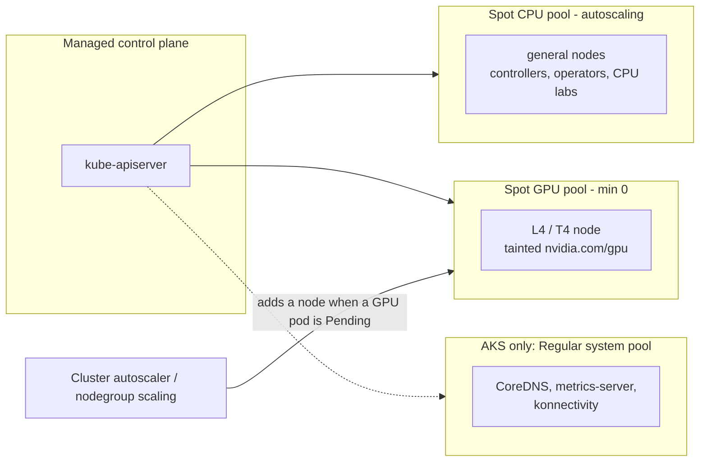

# 00 · Prerequisites and Cluster Setup

> Tools, spot-first clusters on GKE / EKS / AKS, GPU quota, cost guardrails, and a fake-GPU trick so
> you can practise GPU scheduling before any GPU quota is approved.

## Before you start

This is the first chapter — there's no prior chapter output required. You do need, before you begin:

- Admin/owner-level access to at least one cloud account you're allowed to spend money on (GCP project,
  AWS account, or Azure subscription) — cluster and GPU-quota changes need elevated IAM.
- Nothing installed yet is assumed; Step 1 installs the CLI toolchain for you.
- A `env.sh.example` → `env.sh` copy filled in with your project ID / AWS account / Azure subscription
  before running any script (every script in this chapter sources `env.sh` + `versions.env`).

Everything chapters 01+ build on (the spot CPU/GPU node pools, the cluster itself, `versions.env`) comes
from this chapter's Step 4 (Cluster) — do that before starting chapter 01.

## 1. Why this matters

GPU work on Kubernetes goes wrong in boring ways before it goes wrong in interesting ones: the
quota is 0, the region has no L4s, the node pool never scales down and you get a surprise bill, or
the spot pool can't get capacity. This chapter handles that up front:

- **Quota is a lead-time problem.** GPU quota requests can take hours to days. File them on day 1.
- **Spot first changes the cluster layout.** Spot nodes can be reclaimed with ~30 s notice. Keep the
  critical bits (on AKS, the system pool) on nodes you can rely on, and make GPU pools **scale to zero**.
- **Budgets are your circuit breaker.** A single forgotten `g6.xlarge` running on-demand costs roughly
  as much as a month of a small CPU cluster. Budgets alert you; cleanup scripts stop the spend.

## 2. Learning objectives and time plan (~3 h)

By the end you can:

1. Install and check the CLI toolchain (kubectl, helm, kustomize, gcloud, aws/eksctl, az, k9s).
2. Explain which quotas limit **spot** GPUs on each cloud and file increase requests.
3. Create a spot-first cluster on at least one cloud: a spot CPU pool plus a spot GPU pool at 0 nodes.
4. Add a bigger spot CPU pool to an **existing** GKE cluster whose small nodes are full.
5. Set up a budget alert on each cloud you use.
6. Advertise a fake `nvidia.com/gpu` on a CPU node and explain what the scheduler does with it and what it can't do.

| Time | Activity |
|---|---|
| 0:00–0:30 | Read sections 3–4. Install tools (`install-tools-macos.sh`, `verify-tools.sh`) |
| 0:30–1:00 | Quota checks + requests on every cloud you plan to use (do this first; it takes time to approve) |
| 1:00–1:15 | Budgets (`*/budget.sh`) |
| 1:15–2:15 | Create a cluster **or** add a spot pool to your existing GKE cluster, then run the spot smoke test |
| 2:15–2:45 | Fake-GPU lab (`cpu-lab/`) |
| 2:45–3:00 | Checkpoint questions, cleanup |

## 3. Concepts

### 3.1 The cluster we build on every cloud



| | GKE (Standard, zonal) | EKS (eksctl managed node groups) | AKS |
|---|---|---|---|
| CPU pool | `spot-cpu` e2-standard-4, `--spot`, 1–3 | `spot-cpu` 6 instance types, `spot: true`, 1–4 | `system` D2s_v5 **Regular** (1–2) + `spotcpu` D4s_v5 Spot (0–3) |
| GPU pool | `spot-gpu` g2-standard-4 + 1×L4, `--spot`, **0–1** | `spot-gpu` g6.xlarge / g4dn.xlarge, `spot: true`, **0–1** | `gpuspot` NC4as_T4_v3, `--priority Spot`, **0–1** |
| Scale-from-zero | Built in (per-pool cluster autoscaler) | **No autoscaler by default**: scale manually or use Karpenter (`13-node-autoscaling-and-cost`) | Built in (`--enable-cluster-autoscaler`) |
| Spot taint added automatically | No | No (we add `nvidia.com/gpu` taint on the GPU group) | **Yes** `kubernetes.azure.com/scalesetpriority=spot:NoSchedule` |
| GPU taint added automatically | **Yes** `nvidia.com/gpu=present:NoSchedule` | No (set in `cluster.yaml`) | No (set with `--node-taints`) |

Why AKS has a Regular pool: AKS doesn't allow a Spot pool as the default/system pool
([AKS spot limitations](https://learn.microsoft.com/azure/aks/spot-node-pool#limitations)). Keep it
small (one D2s_v5).

### 3.2 Quotas that block spot GPUs

| Cloud | Quota you need for **spot** GPUs | Unit | Also check |
|---|---|---|---|
| GKE / GCE | `PREEMPTIBLE_NVIDIA_L4_GPUS` / `PREEMPTIBLE_NVIDIA_T4_GPUS` (regional) | GPUs | `GPUS_ALL_REGIONS` (global, often 0 on new projects). If preemptible quota is 0, Spot VMs use the on-demand `NVIDIA_*_GPUS` quota instead |
| EKS / EC2 | **All G and VT Spot Instance Requests** (`L-3819A6DF`) | vCPUs | `L-DB2E81BA` on-demand G/VT (fallback), `L-34B43A08` standard spot (CPU pool) |
| AKS | **Total Regional Spot vCPUs** (low-priority vCPUs) | vCPUs | Per-family `Standard NCASv3_T4 Family vCPUs` for on-demand fallback. Free-trial subscriptions can't get GPU quota |

A `g6.xlarge`/`g4dn.xlarge`/`NC4as_T4_v3` is **4 vCPUs**, so a spot vCPU quota of 4 gives you exactly one GPU node. Ask for 8.

### 3.3 Spot in one paragraph per cloud

- **GKE Spot VMs**: no max runtime, ~30 s preemption notice, the node gets `cloud.google.com/gke-spot=true`. GKE does
  graceful node shutdown so pods get part of the notice window.
- **EC2 Spot (managed node groups)**: 2-minute interruption notice; EKS managed node groups turn on Capacity Rebalancing and
  drain nodes. Label `eks.amazonaws.com/capacityType=SPOT`.
- **Azure Spot**: ~30 s notice via Scheduled Events; `--eviction-policy Delete` avoids paying for deallocated disks and
  quota; `--spot-max-price -1` means "never evict because of price, pay up to the on-demand price".

## 4. Lab

Setup (from repo root):

```bash
cp env.sh.example env.sh   # fill in values
source env.sh && source versions.env
```

### Step 1: Tools

macOS: `./00-prerequisites-and-cluster-setup/install-tools-macos.sh`. Linux: follow the official installers:
[kubectl](https://kubernetes.io/docs/tasks/tools/), [helm](https://helm.sh/docs/intro/install/),
[kustomize](https://kubectl.docs.kubernetes.io/installation/kustomize/),
[gcloud](https://cloud.google.com/sdk/docs/install) + `gke-gcloud-auth-plugin`,
[AWS CLI v2](https://docs.aws.amazon.com/cli/latest/userguide/getting-started-install.html),
[eksctl](https://eksctl.io/installation/), [az](https://learn.microsoft.com/cli/azure/install-azure-cli),
[k9s](https://k9scli.io/topics/install/) (optional). AKS managed-GPU preview features also need `az extension add --name aks-preview`.

```bash
./00-prerequisites-and-cluster-setup/verify-tools.sh
```
Expected:
```
kubectl                  OK   /opt/homebrew/bin/kubectl
helm                     OK   /opt/homebrew/bin/helm
...
eksctl                   OK   /opt/homebrew/bin/eksctl
```

Log in: `gcloud auth login && gcloud auth application-default login`, `aws configure sso` (or `aws configure`), `az login`.

### Step 2: Quota (start now, it takes time)

What you're about to do: run a read-only quota check per cloud, then file the increase request for
the ones showing 0 — these approvals can take hours, so kick them off before you need the GPU pool.

<details><summary>GKE</summary>

```bash
./00-prerequisites-and-cluster-setup/gke/quota-check.sh
```
Expected output:
```
== Regional GPU quotas in us-east1 ==
NVIDIA_L4_GPUS               limit=1   usage=0
PREEMPTIBLE_NVIDIA_L4_GPUS   limit=0   usage=0     <- request 1-2
NVIDIA_T4_GPUS               limit=1   usage=0
== Global GPUS_ALL_REGIONS ==
GPUS_ALL_REGIONS             limit=0   usage=0     <- request 1-2
```
How to tell this worked: the script exits 0 and prints both the regional and global quota tables
(an auth error means `gcloud auth login`/`application-default login` wasn't run in Step 1).
Request in the Console (IAM & Admin → Quotas & System Limits) or with `gcloud quotas preferences create`
(the script prints the exact form).

</details>

<details><summary>EKS</summary>

```bash
./00-prerequisites-and-cluster-setup/eks/quota-check.sh
```
Expected output:
```
L-3819A6DF  All G and VT Spot Instance Requests   0.0
L-DB2E81BA  Running On-Demand G and VT instances  0.0
L-34B43A08  All Standard (A, C, D, H, I, M, R, T, Z) Spot Instance Requests  5.0
```
How to tell this worked: `L-3819A6DF` (spot G/VT vCPUs) shows a nonzero limit before you try to
create the GPU node group, otherwise `create-cluster.sh` will succeed but the GPU group will never
get capacity.
```bash
aws service-quotas request-service-quota-increase --region "$AWS_REGION" \
  --service-code ec2 --quota-code L-3819A6DF --desired-value 8
```

</details>

<details><summary>AKS</summary>

```bash
./00-prerequisites-and-cluster-setup/aks/quota-check.sh
```
How to tell this worked: the script lists your subscription's current `LowPriorityCores` (Spot vCPU)
usage/limit without erroring. Request **Total Regional Spot vCPUs ≥ 8** in the portal
(Subscriptions → Usage + quotas) if the limit is below 8.

</details>

### Step 3: Budgets (cost guardrails)

| Cloud | Script | What it creates |
|---|---|---|
| GKE | `gke/budget.sh` (`BUDGET_USD=50`) | Cloud Billing budget filtered to the project; 50 %, 90 % actual, 100 % forecast |
| EKS | `ALERT_EMAIL=you@x.com eks/budget.sh` | AWS Budget (monthly cost) with email alerts 50/90/100 %-forecast |
| AKS | `aks/budget.sh` | Consumption budget on the lab RG + `MC_*` node RG. Add alert emails in the portal (see `# VERIFY` in script) |

Budgets **don't stop resources**. The real guardrails are: GPU pools with min 0, `cleanup.sh` after
every session, and deleting clusters you aren't using.

### Step 4: Cluster

What you're about to do: create the spot-first cluster (or extend your existing one) that every later
chapter runs on. Pick **one** path per cloud.

<details><summary>GKE</summary>

Path A, new cluster:
```bash
./00-prerequisites-and-cluster-setup/gke/create-cluster.sh
```
Expected output (the GPU pool is at 0, so no GPU node yet):
```
NAME                                         STATUS   GKE-NODEPOOL   GKE-SPOT
gke-gke-ai-lab-spot-cpu-3f1c2a7e-k2lq        Ready    spot-cpu       true
```
How to tell this worked: `kubectl get nodes` shows at least one `spot-cpu` node with `GKE-SPOT=true`,
and `gcloud container node-pools list` shows `spot-gpu` at 0 nodes (not missing).

Path B, your existing Standard zonal cluster (2× e2-medium spot, nearly full): e2-medium has 2 shared
vCPUs and 4 GiB, and after system pods there is little left. Add a 4 vCPU / 16 GiB spot pool that
scales to zero:
```bash
POOL=spot-cpu-4 MACHINE=e2-standard-4 MAX_NODES=3 \
  ./00-prerequisites-and-cluster-setup/gke/add-spot-cpu-pool-existing-cluster.sh
```
How to tell this worked: `kubectl get nodes -L cloud.google.com/gke-nodepool` lists `spot-cpu-4`
once a workload lands on it (the pool starts at 1 node). Then add the spot GPU pool with
`01-gpu-nodes-and-scheduling/gke/create-gpu-nodepool.sh` when quota arrives. Optional:
`--autoscaling-profile optimize-utilization` (commented in the script) scales idle nodes down faster.

</details>

<details><summary>EKS</summary>

```bash
./00-prerequisites-and-cluster-setup/eks/create-cluster.sh    # ~15-20 min
```
Expected output:
```
NAME                          STATUS  NODEGROUP  CAPACITYTYPE  INSTANCE-TYPE
ip-192-168-12-34.ec2.internal Ready   spot-cpu   SPOT          m5.large
ip-192-168-55-10.ec2.internal Ready   spot-cpu   SPOT          t3a.large
```
How to tell this worked: `eksctl get cluster` shows `ACTIVE`, and `kubectl get nodes` shows 1-2
`spot-cpu` nodes Ready. `--install-nvidia-plugin=false` is intentional — chapter 01 installs a
pinned device plugin instead of the eksctl default.

</details>

<details><summary>AKS</summary>

```bash
./00-prerequisites-and-cluster-setup/aks/create-cluster.sh
```
Expected output:
```
NAME                              STATUS  AGENTPOOL  SCALESETPRIORITY
aks-system-12345678-vmss000000    Ready   system
aks-spotcpu-12345678-vmss000000   Ready   spotcpu    spot
```
How to tell this worked: `az aks show` reports `provisioningState: Succeeded`, and `kubectl get
nodes -L kubernetes.azure.com/scalesetpriority` shows one `system` node with no priority label and
one `spotcpu` node labeled `spot`.

</details>

### Step 5: Spot smoke test

```bash
kubectl apply -k 00-prerequisites-and-cluster-setup/gke   # or eks / aks
kubectl -n ch00-setup get pods -o wide
kubectl -n ch00-setup scale deploy/spot-smoke --replicas=12   # forces a scale-up on GKE/AKS
kubectl get nodes -w
```
Look at the overlays. AKS **needs** the toleration; without it the pods stay `Pending` with
`untolerated taint {kubernetes.azure.com/scalesetpriority: spot}`. On EKS the deployment won't grow
past the node group's `desiredCapacity` because nothing autoscales it (this is expected).

### Step 6: Fake-GPU scheduling lab (works on any cluster, even kind/minikube)

Based on the official task [Advertise Extended Resources for a Node](https://kubernetes.io/docs/tasks/administer-cluster/extended-resource-node/).
Extended resources are **opaque integers** to the scheduler. The device plugin (chapter 01) normally reports
`nvidia.com/gpu` through the kubelet, and here we write it to node status by hand.

```bash
NODE=$(kubectl get nodes -o jsonpath='{.items[0].metadata.name}')
NODE=$NODE COUNT=2 ./00-prerequisites-and-cluster-setup/cpu-lab/advertise-fake-gpu.sh
```
```
{"cpu":"4","ephemeral-storage":"...","memory":"...","nvidia.com/gpu":"2","pods":"110"}
{"cpu":"3920m",...,"nvidia.com/gpu":"2",...}
```
```bash
kubectl apply -k 00-prerequisites-and-cluster-setup/cpu-lab
kubectl -n ch00-setup get pods -l app=fake-gpu-consumer
kubectl -n ch00-setup describe pod -l app=fake-gpu-consumer | grep -A3 Events
kubectl describe node $NODE | grep -A8 "Allocated resources"
```
```
fake-gpu-consumer-7c9d8-2x4mz   1/1   Running
fake-gpu-consumer-7c9d8-8kq2n   1/1   Running
fake-gpu-consumer-7c9d8-tl5vw   0/1   Pending
  Warning  FailedScheduling  0/3 nodes are available: 1 Insufficient nvidia.com/gpu, 2 node(s) didn't match Pod's node affinity/selector.
  nvidia.com/gpu     2          2
```
Things to try: delete the toleration (the pod is rejected by the taint), request `nvidia.com/gpu: 0.5` (the API
server rejects it because extended resources must be integers), set `requests` ≠ `limits` (rejected: no overcommit).

Cleanup: `kubectl delete -k 00-prerequisites-and-cluster-setup/cpu-lab && NODE=$NODE ./00-prerequisites-and-cluster-setup/cpu-lab/remove-fake-gpu.sh`

**Caveats: what doesn't carry over**
- No device is injected. `nvidia-smi` and CUDA fail. Only the scheduling mechanics (requests, taints, Pending reasons, bin-packing) carry over.
- The patch lives in node status only. Replacing a node (spot preemption, autoscaler scale-down, upgrade, node
  re-registration) loses it. A kubelet restart may zero extended resources it doesn't own.
- Don't use this on a node that runs a real device plugin. The kubelet will overwrite it, and you'd corrupt accounting.
- On GKE/AKS, the autoscaler doesn't know the "GPU" exists, so a Pending fake-GPU pod **won't** trigger a scale-up.
  Its template nodes don't have the resource. On managed clusters, prefer a custom name such as `RESOURCE=example.com/fake-gpu`
  if you don't want any tool (e.g. cost dashboards) to treat the node as a GPU node.

## 5. Spot considerations for this chapter

- **Capacity, not only price.** Spot GPU pools can sit at 0 because the zone has no spot L4/T4. Mitigate: several instance
  types (EKS), several zones (`--node-locations` on GKE regional clusters), or another region. Chapter 13 covers diversification.
- **Keep control-plane-like workloads off GPU spot nodes.** Operators and controllers belong on the CPU pool. The GPU taint enforces this.
- **Scale-to-zero means cold starts.** First GPU pod: node boot + driver (+ image pull) takes about 3–10 min. Budget for it in labs.
- **On-demand fallback**: GKE: drop `--spot`. EKS: remove `spot: true` (capacity type ON_DEMAND). AKS: omit `--priority Spot`
  (needs per-family quota). Chapter 01 scripts take `ON_DEMAND=true`.

## 6. Troubleshooting

| Symptom | Cause | Fix |
|---|---|---|
| GKE: `Quota 'PREEMPTIBLE_NVIDIA_L4_GPUS' exceeded` or `GPUS_ALL_REGIONS` | Quota 0 | Step 2; request both regional preemptible and global quota |
| GKE: `Accelerator type "nvidia-l4" does not exist in zone` | Zone has no L4 | `gcloud compute accelerator-types list --filter=name:nvidia-l4`; change `ZONE` or use T4 (`GPU_TYPE=nvidia-tesla-t4 GPU_MACHINE=n1-standard-4`) |
| EKS nodegroup `CREATE_FAILED` `MaxSpotInstanceCountExceeded` / `VcpuLimitExceeded` | `L-3819A6DF` quota | Request increase; meanwhile keep GPU group at 0 |
| EKS spot group stuck `desired 1 / 0 running`, `InsufficientInstanceCapacity` | No spot capacity for those types/AZs | Add types (`g6.2xlarge`, `g5.xlarge`), other AZs, or on-demand |
| AKS: `Operation could not be completed as it results in exceeding approved LowPriorityCores quota` | Spot vCPU quota | Request Total Regional Spot vCPUs |
| AKS: `The VM size of Standard_NC4as_T4_v3 is not allowed in your subscription in location` | SKU restricted for subscription/region | `az vm list-skus --size ... --query restrictions`; open support request or try another region |
| AKS pods Pending `untolerated taint ... scalesetpriority: spot` | Missing toleration | Use the `aks` overlay |
| `gke-gcloud-auth-plugin not found` | Plugin not installed | `gcloud components install gke-gcloud-auth-plugin` |
| Fake GPU vanished | Node replaced or kubelet reconciled status | Re-run `advertise-fake-gpu.sh` |

## 7. Cleanup and cost notes

```bash
./00-prerequisites-and-cluster-setup/gke/cleanup.sh                       # workloads + GPU pool to 0
DELETE_CLUSTER=true ./00-prerequisites-and-cluster-setup/eks/cleanup.sh   # whole cluster
```
- Control planes aren't free: EKS about $0.10/h per cluster. GKE gives one zonal cluster's management fee
  free per billing account. AKS Free tier has no control-plane fee. Check current pricing pages.
- Rough spot prices (vary by region and time; always check): g2-standard-4+L4 spot, g6.xlarge spot, and NC4as_T4_v3
  spot are usually **tens of cents per hour**. On-demand is 2–4× more.
- Orphans that keep billing after cluster deletion: GCE PDs, EBS volumes, load balancers, AKS `MC_*` disks
  (removed with the cluster), public IPs.

## 8. Checkpoint questions

1. Why is a spot GPU node pool configured with min 0, and what latency does that add?
2. On GCP, which two quotas must both be ≥1 to start one spot L4 node, and what happens if the preemptible quota is 0?
3. Why can't the AKS system pool be spot, and why does the AKS smoke test need a toleration that GKE doesn't?
4. EKS: the GPU node group has `minSize: 0`. What scales it up when a GPU pod is Pending in this chapter's setup?
5. What exactly does the fake-GPU patch change, and which component normally writes that field?
6. Name two things that silently remove a fake extended resource.
7. Why must `nvidia.com/gpu` requests equal limits and be integers?

<details>
<summary>Answers</summary>

1. Idle GPUs are the biggest cost. Min 0 means you pay nothing when idle. The cost is a cold start: node provisioning, driver load and image pull, often 3–10 minutes.
2. `PREEMPTIBLE_NVIDIA_L4_GPUS` in the region and global `GPUS_ALL_REGIONS`. If preemptible quota is 0, Spot VMs draw from the on-demand `NVIDIA_L4_GPUS` quota.
3. AKS requires the default/system pool to be Regular because system add-ons need stable nodes. AKS auto-taints spot pools with `kubernetes.azure.com/scalesetpriority=spot:NoSchedule`. GKE doesn't taint spot nodes by default.
4. Nothing. EKS has no autoscaler by default. You scale the managed node group (`eksctl scale nodegroup`) or install Cluster Autoscaler/Karpenter (chapter 13).
5. It adds `nvidia.com/gpu: N` to `.status.capacity` (and so to allocatable). Normally the kubelet sets it from what a device plugin registered.
6. Node replacement (spot preemption, scale-down, upgrade) and kubelet re-registration/reconciliation. A real device plugin on the node would also overwrite it.
7. Extended resources can't be overcommitted or split. The scheduler counts whole devices, so request must equal limit (or limit only) and be an integer.
</details>

## 9. Further reading and versions tested

- GKE: [Spot VMs on GKE](https://cloud.google.com/kubernetes-engine/docs/how-to/spot-vms), [GPU quotas](https://cloud.google.com/compute/resource-usage#gpu_quota), [Cloud Billing budgets CLI](https://cloud.google.com/sdk/gcloud/reference/billing/budgets/create)
- EKS: [eksctl spot](https://docs.aws.amazon.com/eks/latest/eksctl/spot-instances.html), [eksctl GPU support](https://docs.aws.amazon.com/eks/latest/eksctl/gpu-support.html), [Spot Instance quotas](https://docs.aws.amazon.com/AWSEC2/latest/UserGuide/using-spot-limits.html), [AWS Budgets](https://docs.aws.amazon.com/cost-management/latest/userguide/budgets-create.html)
- AKS: [Spot node pools](https://learn.microsoft.com/azure/aks/spot-node-pool), [Azure Spot VMs](https://learn.microsoft.com/azure/virtual-machines/spot-vms), [Per-VM quota requests](https://learn.microsoft.com/azure/quotas/per-vm-quota-requests)
- Kubernetes: [Advertise Extended Resources for a Node](https://kubernetes.io/docs/tasks/administer-cluster/extended-resource-node/)

**Versions tested** (2026-09-16): Kubernetes 1.35 (EKS `version: "1.35"`; GKE regular channel; AKS default), gcloud 579, azure-cli 2.88, eksctl v0.230.0 schema, kubectl 1.36 client / kustomize v5.8.1, images `registry.k8s.io/pause:3.10.1`, `busybox:1.37.0`.
