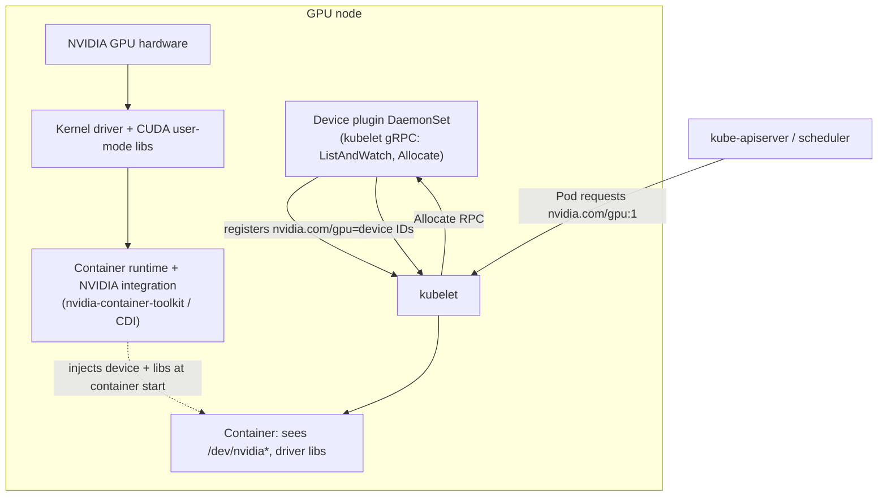

# 01 · GPU Nodes and Scheduling

> How a GPU actually reaches a Pod: node images, drivers, the device plugin, extended resources, and
> the labels/taints/tolerations you need on GKE, EKS and AKS. Ends with a real CUDA job on spot GPU
> nodes on each cloud.

## Before you start

Needs from [`00-prerequisites-and-cluster-setup`](../00-prerequisites-and-cluster-setup): a cluster
with a spot CPU pool up (Step 4), tools verified (Step 1), `env.sh`/`versions.env` sourced, and GPU
quota approved on at least one cloud (Step 2) — this chapter creates the first real GPU node pool, so
without quota the pool stays at 0 nodes forever. If you only did the fake-GPU drill in chapter 00,
this chapter's Step 2 (cpu-lab) works without any of that.

## 1. Why this matters

`nvidia.com/gpu: 1` in a pod spec looks like any other resource request, but nothing about it is
built into Kubernetes. The scheduler only knows about **extended resources**: opaque integer
counters a **device plugin** registers with the kubelet. Get any link in this chain wrong — no
driver, no plugin, wrong taint, missing toleration — and a pod sits `Pending` or `CrashLoopBackOff`
with an error that doesn't mention the real cause. This chapter builds the chain up one link at a
time, on real (spot) GPU nodes, so when it breaks later in the course you know exactly where to look.

## 2. Learning objectives and time plan (~3 h)

By the end you can:

1. Explain the four things a GPU node needs before a pod can use `nvidia.com/gpu`: driver, container
   runtime/toolkit integration, device plugin, and scheduler-visible labels/taints.
2. Read `kubectl describe node` and explain every GPU-related label, taint, and allocatable field.
3. Create a spot GPU node pool/nodegroup on at least one cloud and run a real CUDA job on it.
4. Explain why GKE, EKS and AKS each ship the driver differently, and what that means for chapter 02.
5. Debug the four or five most common "GPU pod stuck" failure modes without guessing.

| Time | Activity |
|---|---|
| 0:00–0:30 | Read section 3 (concepts). Skim `common/` manifests |
| 0:30–1:15 | Create a GPU node pool on your cloud (`<cloud>/create-gpu-node*.sh`), install the device plugin where needed |
| 1:15–1:45 | Run `nvidia-smi-pod` and `cuda-vectoradd-job`, read `kubectl describe node` |
| 1:45–2:15 | `cpu-lab/scheduling-drills.yaml` — predict-then-run the taint/toleration/nodeSelector drills |
| 2:15–2:45 | Break things on purpose (remove a toleration, request 0.5 GPU, scale to 2 replicas on a 1-GPU pool) |
| 2:45–3:00 | Checkpoint questions, cleanup |

## 3. Concepts

### 3.1 The chain from silicon to Pod



- **Driver**: kernel module + CUDA user-mode libraries. Installed differently per cloud (3.2).
- **Container runtime integration**: makes `/dev/nvidia*` and driver libraries appear inside the
  container. Modern stacks use **CDI** (Container Device Interface, the current default in the
  NVIDIA Container Toolkit); older ones use the legacy `nvidia-container-runtime` hook.
- **Device plugin**: a DaemonSet that talks to the kubelet over a Unix-socket gRPC API
  (`ListAndWatch` reports available devices, `Allocate` is called when a pod using the resource is
  admitted). This is what turns physical GPUs into the extended resource `nvidia.com/gpu`.
- **Extended resource**: the scheduler treats `nvidia.com/gpu` exactly like `cpu`/`memory` counting
  — it is **opaque and integer-only**, can't be overcommitted, and `requests` must equal `limits`
  (Kubernetes rejects anything else for extended resources; see `00-prerequisites-and-cluster-setup`
  fake-GPU lab for the same rule with a fake resource).

### 3.2 Who installs the driver, per cloud

| | GKE | EKS | AKS |
|---|---|---|---|
| Driver install | GKE-managed DaemonSet on Container-Optimized OS / Ubuntu, chosen by `--accelerator gpu-driver-version=...` at node-pool create time | Baked into the **AL2023 NVIDIA-accelerated AMI** (`amiFamily: AmazonLinux2023` + a GPU instance type); driver, CUDA libs, nvidia-container-toolkit preinstalled by `nodeadm` | AKS's own **AKSGPUDriver** installer, default on NVIDIA VM sizes (`--gpu-driver Install`, the default) |
| Container toolkit | Preinstalled with the driver | Preinstalled on the AL2023 NVIDIA AMI | Not installed by AKS — you install the device plugin yourself; the plugin's runtime hook needs the toolkit, which ships with the driver-enabled image |
| Device plugin | GKE installs its own by default | **Not installed** (this chapter installs a pinned one) | **Not installed** (this chapter installs a pinned one) |
| Skip the cloud's driver (for chapter 02, GPU Operator) | `gpu-driver-version=disabled` | N/A — the AMI always has one; Operator installs on top with `driver.enabled=false` | `--gpu-driver none` (az CLI ≥ 2.72.2) |

This chapter uses each cloud's own driver path. Chapter 02 (NVIDIA GPU Operator) replaces parts of
this stack with a single cross-cloud Helm chart — useful when you want the same DCGM/GFD/MIG story
everywhere, at the cost of managing the driver yourself on GKE/AKS.

### 3.3 Labels, taints, tolerations per cloud

| | GKE (`spot-gpu` pool, this chapter's script) | EKS (`spot-gpu` nodegroup) | AKS (`gpuspot` pool) |
|---|---|---|---|
| GPU taint | `nvidia.com/gpu=present:NoSchedule` (**GKE adds this automatically**) | `nvidia.com/gpu=present:NoSchedule` (set explicitly in `gpu-nodegroups.yaml`) | `nvidia.com/gpu=present:NoSchedule` (set explicitly with `--node-taints`) |
| GPU label | `cloud.google.com/gke-accelerator=nvidia-l4` (automatic) | `nvidia.com/gpu.present=true` (set at boot by `nodeadm` on the AL2023 NVIDIA AMI) | `nvidia.com/gpu.present=true` (we set it with `--labels`; AKS has no NFD to set it for us) |
| Spot label | `cloud.google.com/gke-spot=true` | `eks.amazonaws.com/capacityType=SPOT` | `kubernetes.azure.com/scalesetpriority=spot` |
| Spot taint (automatic?) | No | No | **Yes** — every AKS spot pool is auto-tainted |

Every pod in `common/` requests `nvidia.com/gpu: 1` with no cloud-specific fields; each cloud's
`kustomization.yaml` applies a JSON6902 patch (`patch-pod.yaml`, `patch-job.yaml`) adding the right
`nodeSelector` and `tolerations`. This mirrors how you'd do it for real workloads later in the course
(vLLM Deployments, Kueue-managed Jobs, …) — cloud differences live in a thin overlay, not the base.

## 4. Lab

```bash
cp env.sh.example env.sh   # if not already done in chapter 00
source env.sh && source versions.env
```

### Step 1: What's in `common/`

- `namespace.yaml` — `ch01-gpu`
- `nvidia-smi-pod.yaml` — proves the whole chain: scheduler → device-plugin allocation → driver libs
  and `/dev/nvidia*` visible in the container. `nvidia-smi` is **not baked into the image**; it comes
  from the host driver, injected by the container runtime/CDI.
- `cuda-vectoradd-job.yaml` — a real CUDA kernel (vector add) as a `Job` (`backoffLimit: 3`), so a
  spot preemption mid-run gets retried automatically.

Read them before applying anything — this is the entire cloud-agnostic surface.

What you're about to do next: create a real GPU node pool on your cloud, install a device plugin
where the cloud doesn't ship one, then run `nvidia-smi-pod` and `cuda-vectoradd-job` to prove the
whole chain works end to end.

<details><summary>GKE</summary>

```bash
./01-gpu-nodes-and-scheduling/gke/create-gpu-nodepool.sh   # spot-gpu, g2-standard-4 + 1x L4, min 0 max 1
```
Expected output:
```
config.accelerators:
- acceleratorCount: '1'
  acceleratorType: nvidia-l4
  gpuDriverInstallationConfig: {gpuDriverVersion: LATEST}
config.spot: true
autoscaling: {enabled: true, maxNodeCount: 1}
```
How to tell this worked: the pool shows up in `gcloud container node-pools list`. The driver and
GKE's own device plugin come with the pool — nothing else to install.
```bash
NODES=1 ./01-gpu-nodes-and-scheduling/gke/scale-gpu-pool.sh   # pre-warm; or let a Pending pod trigger it
kubectl apply -k 01-gpu-nodes-and-scheduling/gke
kubectl -n ch01-gpu get pods -w
```
Expected output (after node boot + driver load, ~3–5 min from 0 nodes):
```
nvidia-smi   1/1   Running
cuda-vectoradd   0/1   Completed
```
How to tell this worked:
```bash
kubectl -n ch01-gpu logs nvidia-smi | head -15
kubectl describe node -l cloud.google.com/gke-nodepool=spot-gpu | grep -A6 "Allocated resources"
```
```
Allocated resources:
  Resource           Requests   Limits
  nvidia.com/gpu     1          1
```
`nvidia-smi` logs show a real GPU (model, driver/CUDA version) and `cuda-vectoradd` reaches `Completed`.

</details>

<details><summary>EKS</summary>

```bash
./01-gpu-nodes-and-scheduling/eks/create-gpu-nodegroup.sh   # spot-gpu, g6.xlarge/g4dn.xlarge, min 0 max 1
./01-gpu-nodes-and-scheduling/eks/install-device-plugin.sh  # pinned nvdp Helm chart (${DEVICE_PLUGIN_VERSION})
```
The AL2023 NVIDIA AMI ships the driver and toolkit; `--install-nvidia-plugin=false` (chapter 00's
`create-cluster.sh` and this chapter's nodegroup script) is intentional — we install a **pinned**
plugin instead of eksctl's unpinned default DaemonSet.
```bash
NODES=1 ./01-gpu-nodes-and-scheduling/eks/scale-gpu-nodegroup.sh   # EKS has no autoscaler by default
kubectl apply -k 01-gpu-nodes-and-scheduling/eks
kubectl -n ch01-gpu get pods -w
```
Expected output:
```
NAME          READY   STATUS      RESTARTS
nvidia-smi    1/1     Running     0
cuda-vectoradd-xxxxx   0/1   Completed   0
```
How to tell this worked:
```bash
kubectl -n nvidia-device-plugin get ds
kubectl get nodes -l eks.amazonaws.com/nodegroup=spot-gpu -L nvidia.com/gpu.present,eks.amazonaws.com/capacityType
```
The `nvdp` DaemonSet shows `DESIRED == READY == 1`, and the node is labeled
`nvidia.com/gpu.present=true` and `eks.amazonaws.com/capacityType=SPOT`.

</details>

<details><summary>AKS</summary>

```bash
./01-gpu-nodes-and-scheduling/aks/create-gpu-nodepool.sh    # gpuspot, Standard_NC4as_T4_v3, min 0 max 1
./01-gpu-nodes-and-scheduling/aks/install-device-plugin.sh  # pinned nvdp Helm chart (${DEVICE_PLUGIN_VERSION})
```
`--gpu-driver Install` (the default) makes AKS install the driver; AKS installs **no** device plugin,
which is why we run `install-device-plugin.sh`.
```bash
MIN=1 ./01-gpu-nodes-and-scheduling/aks/scale-gpu-pool.sh
kubectl apply -k 01-gpu-nodes-and-scheduling/aks
kubectl -n ch01-gpu get pods -w
```
Expected output:
```
nvidia-smi        1/1     Running
cuda-vectoradd-xxxxx   0/1   Completed
```
How to tell this worked:
```bash
kubectl -n nvidia-device-plugin get ds
kubectl get nodes -l agentpool=gpuspot -L kubernetes.azure.com/scalesetpriority,nvidia.com/gpu.present
```
The `nvdp` DaemonSet is `1/1` Ready on the `gpuspot` node, and the node carries both the
`scalesetpriority=spot` and `nvidia.com/gpu.present=true` labels.

</details>

### Step 2: Fake-GPU scheduling drills (no GPU needed, any cluster)

What you're about to do: run five pods with different taint/toleration/selector combinations against
a fake `nvidia.com/gpu` node, and predict each one's fate before you look at the answer — this builds
scheduling intuition without spending on a real GPU. Run this whether or not your cloud GPU pool is
up. Prereq: `00-prerequisites-and-cluster-setup/cpu-lab/advertise-fake-gpu.sh` (patches a CPU node
to `nvidia.com/gpu: 2` + taint + `fake-gpu=true` label).

```bash
NODE=$(kubectl get nodes -o jsonpath='{.items[0].metadata.name}')
NODE=$NODE COUNT=2 00-prerequisites-and-cluster-setup/cpu-lab/advertise-fake-gpu.sh
kubectl apply -k 01-gpu-nodes-and-scheduling/cpu-lab
kubectl -n ch01-gpu get pods -l drill=gpu-scheduling
```
Expected output (after a few seconds):
```
NAME                          READY   STATUS    RESTARTS
a-no-toleration-xxxxx         0/1     Pending   0
b-wrong-model-xxxxx           0/1     Pending   0
c-correct-xxxxx                1/1     Running   0
d-cpu-pod-on-gpu-node-xxxxx    1/1     Running   0
```
How to tell this worked: `c-correct` and `d-cpu-pod-on-gpu-node` are `Running`, `a-no-toleration` and
`b-wrong-model` stay `Pending` (`kubectl -n ch01-gpu describe pod a-no-toleration-xxxxx | grep -A2
Events` shows the taint/selector reason). **Before** applying, predict each pod's fate — the file's
comments have the answer:
- `a-no-toleration` — `Pending`, untolerated taint
- `b-wrong-model` — `Pending`, nodeSelector doesn't match (simulates a GFD label from chapter 02)
- `c-correct` — `Running`
- `d-cpu-pod-on-gpu-node` — `Running`, **on the fake-GPU node**, without ever requesting a GPU: a
  toleration is *permission* to schedule there, not a request for the resource
- `e-overcommit` (commented out) — uncomment it: the API server rejects `requests != limits` for
  `nvidia.com/gpu` at admission time, before the scheduler ever sees it

```bash
kubectl delete -k 01-gpu-nodes-and-scheduling/cpu-lab
NODE=$NODE 00-prerequisites-and-cluster-setup/cpu-lab/remove-fake-gpu.sh
```

## 5. Spot considerations

- **A cold spot GPU node takes minutes, not seconds.** From 0 nodes: instance boot + driver
  attach/load (GKE/AKS) or AMI boot (EKS, driver already baked in) + image pull is commonly 3–8 min.
  Don't confuse this with a broken device plugin when a pod sits `Pending` right after scale-up.
- **The `Job` matters more than the `Pod` here.** `cuda-vectoradd-job.yaml` has `backoffLimit: 3`
  specifically so a spot reclaim mid-run gets retried instead of failing the whole workload.
  `nvidia-smi-pod.yaml` is a bare Pod — spot preemption just kills it, no retry. Use Jobs (or higher
  controllers) for anything that must survive a reclaim.
- **The device plugin must tolerate the spot taint too**, not just your workload. On AKS specifically,
  the auto-added `kubernetes.azure.com/scalesetpriority=spot:NoSchedule` taint is in
  `values-device-plugin.yaml`'s `tolerations` — miss it and the plugin DaemonSet itself never
  schedules onto the spot GPU pool, so `nvidia.com/gpu` never shows up as allocatable at all.
- **On-demand fallback**: every `create-gpu-node*.sh` script takes `ON_DEMAND=true` (GKE: no
  `--spot`; AKS: pool named `gpuod`, no `--priority Spot`; EKS: `INCLUDE=ondemand-gpu` creates the
  second nodegroup in `gpu-nodegroups.yaml`).

## 6. Troubleshooting

| Symptom | Cause | Fix |
|---|---|---|
| Pod `Pending`: `0/N nodes are available: 1 Insufficient nvidia.com/gpu` | No node has an allocatable GPU yet — pool at 0, or device plugin not running | Scale the pool up; `kubectl -n nvidia-device-plugin get ds` (EKS/AKS) |
| Pod `Pending`: `node(s) had untolerated taint {nvidia.com/gpu: present}` | Missing toleration | Use the cloud overlay (`kubectl apply -k .../gke` etc.), not `common/` directly |
| Pod `Pending`: `didn't match Pod's node affinity/selector` | `nodeSelector` doesn't match this cloud's label (e.g. applied the GKE overlay on an EKS cluster) | Apply the matching cloud overlay |
| `nvidia-smi` pod: `command not found` or empty GPU list | Container runtime isn't injecting the device/driver (toolkit misconfigured, or driver not finished installing) | `kubectl describe node` → check `Allocatable`; wait for driver DaemonSet/AMI init; re-check taints |
| EKS: two device-plugin DaemonSets running, GPUs double-counted or flapping | `eksctl create nodegroup` ran without `--install-nvidia-plugin=false` | `kubectl -n kube-system delete ds nvidia-device-plugin-daemonset`, keep only the pinned `nvdp` one |
| AKS: device plugin `CrashLoopBackOff` / `Pending` on the GPU pool | Missing the `kubernetes.azure.com/scalesetpriority=spot` toleration in `values-device-plugin.yaml`, or `nvidia.com/gpu.present` label missing (chart's default affinity needs it — AKS has no NFD) | Confirm `--labels nvidia.com/gpu.present=true` was set on the pool; reinstall the plugin |
| Pod requesting `nvidia.com/gpu: 0.5` rejected at `kubectl apply` | Extended resources are integer-only | Request whole GPUs; see chapter 03 for MPS/time-slicing/MIG fractional sharing |
| `nvidia.com/gpu` request accepted with `limits != requests` | It isn't — the API server always rejects this for extended resources | N/A, this is expected; see `cpu-lab` drill `e-overcommit` |
| GKE: accelerator not available in zone | Wrong `ZONE` for that GPU type | `gcloud compute accelerator-types list --filter=name:nvidia-l4`, or switch `GPU_TYPE=nvidia-tesla-t4 MACHINE=n1-standard-4` |

## 7. Cleanup and cost notes

```bash
./01-gpu-nodes-and-scheduling/gke/cleanup.sh                 # DELETE_POOL=true also removes the node pool
DELETE_POOL=true ./01-gpu-nodes-and-scheduling/eks/cleanup.sh   # UNINSTALL_PLUGIN=true also removes nvdp
DELETE_POOL=true ./01-gpu-nodes-and-scheduling/aks/cleanup.sh
```
- A single L4/T4 spot node is usually tens of cents/hour; on-demand is 2–4× that. Scale-to-zero pools
  (`min 0`) mean idle time between lab sessions costs nothing on GKE/AKS. **EKS does not autoscale** —
  a forgotten `desiredCapacity: 1` GPU node keeps billing until you run `scale-gpu-nodegroup.sh NODES=0`.
- If you'll use the NVIDIA GPU Operator next chapter on the **same** nodes, uninstall this chapter's
  device plugin first (`UNINSTALL_PLUGIN=true` on EKS/AKS cleanup) — never run two device plugins.

## 8. Checkpoint questions

<details>
<summary>1. Why is <code>nvidia.com/gpu</code> called an "extended resource," and what two constraints does the API server enforce on it that don't apply to <code>cpu</code>/<code>memory</code>?</summary>

It's opaque (the scheduler just counts it, it doesn't understand "GPU") and comes from a device
plugin rather than being built into kubelet. The API server requires it to be an **integer** and
requires **`requests == limits`** (no overcommit, no fractional requests) — `cpu`/`memory` allow
fractional values and `requests < limits`.
</details>

<details>
<summary>2. Which two components does the device plugin sit between, and which gRPC call actually assigns device IDs to a pod?</summary>

Between the **kubelet** and the **container runtime's device injection**. `ListAndWatch` reports
available devices to the kubelet continuously; **`Allocate`** is called when a pod requesting the
resource is being admitted, and returns the actual device IDs/mounts for that pod.
</details>

<details>
<summary>3. On EKS, why does <code>create-cluster.sh</code> (chapter 00) and <code>create-gpu-nodegroup.sh</code> (this chapter) pass <code>--install-nvidia-plugin=false</code>?</summary>

`eksctl` auto-installs an **unpinned** device-plugin DaemonSet on GPU nodegroups by default. This
repo pins every component's version (`versions.env`), so we disable that and install a specific
`DEVICE_PLUGIN_VERSION` via Helm instead. Leaving both on double-registers GPUs.
</details>

<details>
<summary>4. Why does AKS need an explicit <code>nvidia.com/gpu.present=true</code> label on the node pool, when GKE and EKS don't need us to set the equivalent by hand?</summary>

The device-plugin chart's default node affinity looks for an NFD label or `nvidia.com/gpu.present`.
GKE sets its own accelerator label automatically and EKS's AL2023 NVIDIA AMI sets
`nvidia.com/gpu.present=true` at boot via `nodeadm`. AKS has neither an automatic label nor NFD by
default, so `create-gpu-nodepool.sh` sets the label explicitly with `--labels`.
</details>

<details>
<summary>5. A pod tolerates the GPU taint, sets no <code>resources.limits</code>, and gets scheduled onto your one spot GPU node. What happened, and why is this dangerous?</summary>

A toleration only removes a scheduling **restriction** — it does not request the resource. The pod
never asked for `nvidia.com/gpu`, so nothing stopped it from landing on the (otherwise idle-looking)
GPU node and consuming CPU/memory there, on your most expensive node type, silently. See
`cpu-lab/scheduling-drills.yaml` pod `d-cpu-pod-on-gpu-node`. Guard against it later with
admission policy (chapter 14) rather than trusting every pod author.
</details>

<details>
<summary>6. Why does <code>cuda-vectoradd-job.yaml</code> use a <code>Job</code> with <code>backoffLimit: 3</code> instead of a bare <code>Pod</code>, specifically because of spot?</summary>

A spot reclaim kills the pod. A bare Pod just dies. A Job with retries re-creates the pod (up to
`backoffLimit`) so a mid-run preemption doesn't fail the whole workload — the comment in the manifest
also notes `podFailurePolicy` could exclude `DisruptionTarget` from counting against the limit at
all, covered properly in chapter 06 (Kueue).
</details>

<details>
<summary>7. What's the practical difference between GKE's driver install and AKS's/EKS's, that becomes relevant again in chapter 02?</summary>

GKE and AKS install the driver via a cloud-managed mechanism you can disable at node-pool create time
(`gpu-driver-version=disabled` / `--gpu-driver none`) so the GPU Operator can take over. EKS's driver
is baked into the AMI at boot — you don't "disable" it, you just also don't let the Operator try to
manage it (`driver.enabled=false` in chapter 02's EKS values).
</details>

<details>
<summary>8. You requested <code>nvidia.com/gpu: 0.5</code> in a pod spec. What happens and why?</summary>

The API server rejects the pod at admission — extended resources must be whole integers, there is no
fractional GPU at the Kubernetes resource-accounting layer. Fractional/shared GPU access (time-slicing,
MPS, MIG) is a device-plugin/driver-level feature layered on top, covered in chapter 03.
</details>

## 9. Further reading and versions tested

- Kubernetes: [Device Plugins](https://kubernetes.io/docs/concepts/extend-kubernetes/compute-storage-net/device-plugins/), [Extended Resources](https://kubernetes.io/docs/tasks/administer-cluster/extended-resource-node/), [Schedule GPUs](https://kubernetes.io/docs/tasks/manage-gpus/scheduling-gpus/)
- NVIDIA: [k8s-device-plugin](https://github.com/NVIDIA/k8s-device-plugin), [Container Toolkit / CDI](https://docs.nvidia.com/datacenter/cloud-native/container-toolkit/latest/index.html)
- GKE: [Run GPUs in GKE Standard node pools](https://cloud.google.com/kubernetes-engine/docs/how-to/gpus), [GPU driver install options](https://cloud.google.com/kubernetes-engine/docs/how-to/gpu-driver-installation)
- EKS: [EKS-optimized accelerated AMIs](https://docs.aws.amazon.com/eks/latest/userguide/eks-optimized-ami.html), [eksctl GPU support](https://docs.aws.amazon.com/eks/latest/eksctl/gpu-support.html)
- AKS: [Use GPUs on AKS](https://learn.microsoft.com/azure/aks/use-nvidia-gpu), [AKS-managed GPU node pools](https://learn.microsoft.com/azure/aks/aks-managed-gpu-nodes)
- Next: [`02-nvidia-gpu-operator`](../02-nvidia-gpu-operator) (the alternative, cross-cloud way to manage this whole stack), [`03-gpu-sharing-and-dra`](../03-gpu-sharing-and-dra) (fractional/shared GPU access)

**Versions tested** (2026-09-16): Kubernetes 1.35, `DEVICE_PLUGIN_VERSION=v0.20.0` (NVIDIA/k8s-device-plugin,
Helm chart `nvdp/nvidia-device-plugin`), images `nvcr.io/nvidia/k8s/cuda-sample:vectoradd-cuda12.5.0`,
`nvidia/cuda:12.9.1-base-ubuntu24.04`, `busybox:1.37.0`, gcloud 579, eksctl v0.230.0 schema, azure-cli 2.88.
