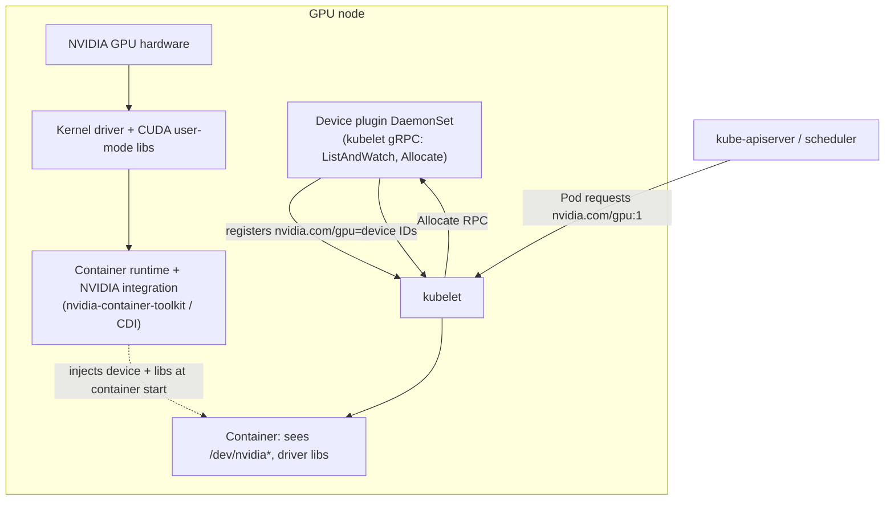

# 01 · GPU Nodes and Scheduling

> How a GPU actually reaches a Pod: node images, drivers, the device plugin, extended resources, and
> the labels/taints/tolerations you need on EKS. Ends with a real CUDA job on a spot GPU node.

**New to Kubernetes, or new to GPUs on Kubernetes, or both?** This chapter is written for you. Section
3 below spends real time on the vocabulary (extended resources, taints/tolerations, node groups, spot,
the device plugin, `nvidia-smi`) before asking you to run anything. If a term in the Lab feels
unfamiliar, it was almost certainly defined in section 3 — jump back there rather than guessing.

## 0. Before you start

Needs from [`00-prerequisites-and-cluster-setup`](../00-prerequisites-and-cluster-setup): a cluster
with a spot CPU pool up (Step 4), tools verified (Step 1), `env.sh`/`versions.env` sourced, and GPU
quota approved (Step 2) — this chapter creates the first real GPU node pool, so without quota the pool
stays at 0 nodes forever.

If any of those terms are new — "cluster", "node group", "quota" — that's expected. This chapter
assumes you have *done* chapter 00's steps, not that you already understand every Kubernetes concept;
the concepts you specifically need for GPUs are explained from scratch below.

## 1. Why this matters

`nvidia.com/gpu: 1` in a pod spec looks like any other resource request, but nothing about it is
built into Kubernetes. The scheduler only knows about **extended resources**: opaque integer
counters a **device plugin** registers with the kubelet. Get any link in this chain wrong — no
driver, no plugin, wrong taint, missing toleration — and a pod sits `Pending` or `CrashLoopBackOff`
with an error that doesn't mention the real cause. This chapter builds the chain up one link at a
time, on real (spot) GPU nodes, so when it breaks later in the course you know exactly where to look.

In plain terms: a GPU is expensive, physical hardware bolted onto a small number of your cluster's
nodes. Kubernetes' whole job is to decide *which pod runs on which node*, and by default it has no
idea GPUs exist — it would happily schedule a plain CPU workload onto your one $1/hour GPU node and
leave a GPU-hungry pod `Pending` forever on a node with no GPU. Everything in this chapter exists to
teach the scheduler about GPUs (so it counts them correctly) and to steer pods onto the right nodes
(so GPU workloads land on GPU nodes, and only GPU workloads land there). If you've never operated
Kubernetes before, this is also your first hands-on encounter with three ideas you'll use in every
later chapter: extended resources, taints/tolerations, and node selection — GPUs just make the stakes
(and the cost of getting it wrong) obvious immediately.

## 2. Learning objectives and time plan (~3 h)

By the end you can:

1. Explain the four things a GPU node needs before a pod can use `nvidia.com/gpu`: driver, container
   runtime/toolkit integration, device plugin, and scheduler-visible labels/taints.
2. Read `kubectl describe node` and explain every GPU-related label, taint, and allocatable field.
3. Create a spot GPU managed node group on EKS and run a real CUDA job on it.
4. Explain how EKS ships the driver (baked into the AMI), and what that means for chapter 02.
5. Debug the four or five most common "GPU pod stuck" failure modes without guessing.

| Time | Activity |
|---|---|
| 0:00–0:30 | Read section 3 (concepts). Skim the `eks/` manifests |
| 0:30–1:15 | Create a GPU node group, install the device plugin |
| 1:15–2:00 | Run `nvidia-smi-pod` and `cuda-vectoradd-job`, read `kubectl describe node` |
| 2:00–2:30 | Break things on purpose (remove a toleration, request 0.5 GPU, scale to 2 replicas on a 1-GPU pool) |
| 2:30–3:00 | Checkpoint questions, cleanup |

Don't skip the first 30 minutes even if you're eager to type commands. Every failure mode in section 6
(Troubleshooting) traces back to one of the concepts in section 3 — 30 minutes of reading now saves you
from staring at a `Pending` pod later with no idea which of five possible causes it is.

## 3. Concepts

### 3.0 Vocabulary first: the building blocks, explained from zero

If you already know Kubernetes scheduling basics, skim this and go to 3.1. If any of these are new,
read them in order — each one builds on the last.

**What a GPU is to Kubernetes — the "extended resource".** Kubernetes ships with built-in
understanding of exactly two resource types: `cpu` (fractional, measured in "millicores") and `memory`
(fractional, measured in bytes). It has zero built-in understanding of GPUs, disks, or anything else.
So Kubernetes lets something else — here, a **device plugin** (defined below) — tell the kubelet
"this node has N of a resource called `nvidia.com/gpu`". That is an **extended resource**: an
arbitrary, cluster-defined resource name with a count attached. The scheduler treats it exactly like
`cpu`/`memory` for bin-packing purposes (does this node have enough left to satisfy the pod's
`requests`?), but with two important differences the API server enforces only for extended resources:
it must be a **whole integer** (no `0.5` GPUs — see Troubleshooting) and **`requests` must equal
`limits`** (no GPU overcommit, unlike CPU/memory where a pod can request less than its limit). The
scheduler has no idea what a GPU actually *is* — it's just counting a number on the node's status
object, the same way it counts CPU cores.

**Taints and tolerations — why GPU nodes are "poisoned" by default.** A **taint** is a label
Kubernetes puts *on a node* that means "don't schedule pods here unless they explicitly say they're
okay with this." A **toleration** is a matching statement *on a pod* that says "yes, I'm okay with
that taint." Without a taint, any pod that fits (leaves enough allocatable CPU/memory) can land on any
node — including, by pure luck of scheduling, your expensive GPU node, wasting the GPU on a workload
that never asked for one. Taints exist specifically to prevent this: a GPU node in this chapter is
tainted `nvidia.com/gpu=present:NoSchedule` on creation, so *only* pods that carry a matching
toleration will even be considered for that node. Critically — and this trips up almost everyone the
first time — **a toleration is permission, not a request**. Tolerating the taint does not make
Kubernetes give the pod a GPU; it only removes the "keep out" sign. A pod can tolerate the taint,
request zero GPUs, and still land on your GPU node and quietly consume its CPU/memory. You'll
reproduce exactly this in the Step 2 drill (`d-cpu-pod-on-gpu-node`) so it's not just a warning on a
page — you'll watch it happen.

**nodeSelector and affinity — how a pod chooses (not just permits) a node.** Tolerations only clear
a taint's restriction; something else has to actually make the pod *want* a particular node.
`nodeSelector` is the simple form: an exact-match key/value pair a node's labels must have, or the pod
is never scheduled there at all (hard requirement). `affinity`/`nodeAffinity` is the more expressive
form: it can express "must" rules (`requiredDuringSchedulingIgnoredDuringExecution`, functionally like
`nodeSelector` but with `In`/`NotIn`/etc. operators) and "prefer" rules
(`preferredDuringSchedulingIgnoredDuringExecution`, a weighted hint the scheduler tries to honor but
won't refuse to schedule over). This chapter uses the simple form: both `eks/nvidia-smi-pod.yaml` and
`eks/cuda-vectoradd-job.yaml` carry a plain `nodeSelector` and matching `tolerations` directly in the
manifest, so they land only on real GPU nodes.

**Animate the basics first — no GPUs yet, just the two mechanisms.** Before applying any of this to
GPUs, watch each mechanism on its own with plain, generic nodes. This is the core mental model the
GPU-specific walkthrough below builds on: **taints push pods away, tolerations don't pull them toward
anything; nodeSelector/affinity is the only thing that actually pulls.** (Animation plays on the
[docs site](../website); GitHub strips `<style>` tags, so this renders as a static snapshot there.)

<div align="center">

<!-- prettier-ignore -->
<style>
.ch01-basics{--ok:#2e9e4d;--bad:#d64545;--plain:#4a90d9;font-family:inherit}
.ch01-basics .panel{border:1px solid #ddd;border-radius:12px;padding:14px 16px;margin:14px 0;text-align:left}
.ch01-basics .panel h4{margin:0 0 10px 0;font-size:14px}
.ch01-basics .lane{display:flex;align-items:center;gap:14px;margin:10px 0;flex-wrap:wrap}
.ch01-basics .nodebox{border:2px dashed #999;border-radius:10px;padding:8px 12px;min-width:120px;text-align:center;font-size:12px;position:relative}
.ch01-basics .nodebox.tainted{border-color:var(--bad);border-style:solid}
.ch01-basics .nodebox.labeled{border-color:var(--plain);border-style:solid}
.ch01-basics .nodebox .flag{position:absolute;top:-10px;right:-10px;font-size:14px}
.ch01-basics .podchip{border-radius:16px;padding:5px 10px;font-size:11px;color:#fff;min-width:120px;text-align:center}
.ch01-basics .podchip.notol{background:var(--bad)}
.ch01-basics .podchip.tol{background:var(--ok)}
.ch01-basics .podchip.nosel{background:#999}
.ch01-basics .podchip.sel{background:var(--ok)}
.ch01-basics .track{flex:1;min-width:160px;height:2px;background:#ccc;position:relative}
.ch01-basics .mover{position:absolute;top:-9px;font-size:16px;animation:ch01b-move 3s ease-in-out infinite}
.ch01-basics .mover.reject{animation-name:ch01b-reject}
.ch01-basics .mover.accept{animation-name:ch01b-accept}
.ch01-basics .mover.pick{animation-name:ch01b-pick}
@keyframes ch01b-reject{0%,10%{left:0}45%{left:70%}60%{left:35%}90%,100%{left:0}}
@keyframes ch01b-accept{0%,10%{left:0}55%,90%{left:88%}100%{left:88%;opacity:0}}
@keyframes ch01b-move{0%,10%{left:0}55%,90%{left:88%}100%{left:0}}
@keyframes ch01b-pick{0%,10%{left:0}55%,100%{left:88%}}
.ch01-basics .result{font-size:12px;font-weight:600;margin-left:6px}
</style>

<div class="ch01-basics">

<div class="panel">
<h4>1. Taints &amp; tolerations — a taint only <u>repels</u>, it never attracts</h4>
<div class="lane">
<span class="podchip notol">Pod (no toleration)</span>
<div class="track"><span class="mover reject">🚀</span></div>
<div class="nodebox tainted">Node 1<span class="flag">🚫</span><br/><small>taint: dedicated=true:NoSchedule</small></div>
<span class="result">❌ repelled → reroutes to any untainted node</span>
</div>
<div class="lane">
<span class="podchip tol">Pod (has toleration)</span>
<div class="track"><span class="mover pick">🚀</span></div>
<div class="nodebox tainted">Node 1<span class="flag">🚫</span><br/><small>taint: dedicated=true:NoSchedule</small></div>
<span class="result">✅ allowed here <i>and</i> everywhere else — toleration ≠ preference</span>
</div>
</div>

<div class="panel">
<h4>2. nodeSelector / affinity — the only mechanism that actually <u>chooses</u></h4>
<div class="lane">
<span class="podchip nosel">Pod (no selector)</span>
<div class="track"><span class="mover move">🚀</span></div>
<div class="nodebox labeled">Node 1<span class="flag">🏷️</span><br/><small>label: disktype=ssd</small></div>
<span class="result">➖ indifferent — could land on this node or any other</span>
</div>
<div class="lane">
<span class="podchip sel">Pod (nodeSelector: disktype=ssd)</span>
<div class="track"><span class="mover accept">🚀</span></div>
<div class="nodebox labeled">Node 1<span class="flag">🏷️</span><br/><small>label: disktype=ssd</small></div>
<span class="result">✅ pulled straight here — no match anywhere else = Pending</span>
</div>
</div>

</div>
</div>

Put the two together and you get the GPU case below: the taint is what keeps *random* pods off the
GPU node, and the label + `nodeSelector` pair is what makes a *GPU* pod actually land there instead of
just being allowed to.

**Animated walkthrough — four pods, one GPU node, two independent gates.** Taints/tolerations and
nodeSelector/affinity are *two separate gates* a pod must pass, not one — this is the single most
common source of confusion for newcomers, so watch all four combinations play out. Every pod and node
card below shows the **actual key/value** involved (the real taint and label from `gpu-nodegroups.yaml`,
Step 1's `nodeadm` boot config), not just a generic "yes/no" — a green chip is what's required and
present, a red chip is what's required and missing. (Animation plays on the [docs site](../website);
GitHub strips `<style>` tags from rendered READMEs, so this section shows as a static snapshot there —
read the outcome table below it either way.)

<div align="center">

<!-- prettier-ignore -->
<style>
.ch01-anim{--gpu:#76b900;--cpu:#4a90d9;--bad:#d64545;--good:#2e9e4d;font-family:inherit}
.ch01-anim .row{display:flex;align-items:center;gap:16px;margin:16px 0;flex-wrap:wrap}
.ch01-anim .card{border:2px solid #999;border-radius:10px;padding:8px 12px;min-width:230px;text-align:left;font-size:12px;position:relative;background:#fff;color:#222}
.ch01-anim .card.node{border-color:var(--gpu)}
.ch01-anim .card .title{font-weight:700;font-size:13px;margin-bottom:4px}
.ch01-anim .chip{display:inline-block;border-radius:5px;padding:2px 6px;margin:2px 3px 0 0;font-size:11px;font-family:monospace;color:#fff}
.ch01-anim .chip.ok{background:var(--good)}
.ch01-anim .chip.no{background:var(--bad);text-decoration:line-through}
.ch01-anim .chip.fixed{background:#555}
.ch01-anim .pod{animation:ch01-approach 2.6s ease-in-out infinite}
.ch01-anim .row.p1 .pod{animation-name:ch01-bounce}
.ch01-anim .row.p2 .pod{animation-name:ch01-drift}
.ch01-anim .verdict{font-weight:700;font-size:14px;min-width:150px}
@keyframes ch01-approach{0%,15%{transform:translateX(0)}45%,70%{transform:translateX(22px)}100%{transform:translateX(0)}}
@keyframes ch01-bounce{0%,15%{transform:translateX(0)}40%{transform:translateX(16px)}55%{transform:translateX(2px)}70%{transform:translateX(16px)}85%,100%{transform:translateX(0)}}
@keyframes ch01-drift{0%,15%{transform:translateX(0)}45%,100%{transform:translateX(22px)}}
.ch01-anim .row.p1 .verdict,.ch01-anim .row.p2 .verdict{animation:ch01-flash 2.6s ease-in-out infinite}
.ch01-anim .row.p3 .verdict,.ch01-anim .row.p4 .verdict{animation:ch01-flashgood 2.6s ease-in-out infinite}
@keyframes ch01-flash{0%,40%{opacity:0}55%,100%{opacity:1}}
@keyframes ch01-flashgood{0%,40%{opacity:0}45%,100%{opacity:1}}
</style>

<div class="ch01-anim">

<div class="row p1">
<div class="card pod"><div class="title">Pod A</div>
<span class="chip no">toleration: nvidia.com/gpu=present:NoSchedule</span><br/>
<span class="chip no">nodeSelector: nvidia.com/gpu.present=true</span></div>
<span>→</span>
<div class="card node"><div class="title">GPU node</div>
<span class="chip fixed">taint: nvidia.com/gpu=present:NoSchedule</span><br/>
<span class="chip fixed">label: nvidia.com/gpu.present=true</span></div>
<span class="verdict">❌ Pending — taint blocks it, nothing pulls it here either</span></div>

<div class="row p2">
<div class="card pod"><div class="title">Pod B</div>
<span class="chip ok">toleration: nvidia.com/gpu=present:NoSchedule</span><br/>
<span class="chip no">nodeSelector: nvidia.com/gpu.present=true</span></div>
<span>→</span>
<div class="card node"><div class="title">GPU node</div>
<span class="chip fixed">taint: nvidia.com/gpu=present:NoSchedule</span><br/>
<span class="chip fixed">label: nvidia.com/gpu.present=true</span></div>
<span class="verdict">⚠️ Scheduled — but anywhere untainted, GPU node included by luck, GPU wasted</span></div>

<div class="row p3">
<div class="card pod"><div class="title">Pod C</div>
<span class="chip no">toleration: nvidia.com/gpu=present:NoSchedule</span><br/>
<span class="chip ok">nodeSelector: nvidia.com/gpu.present=true</span></div>
<span>→</span>
<div class="card node"><div class="title">GPU node</div>
<span class="chip fixed">taint: nvidia.com/gpu=present:NoSchedule</span><br/>
<span class="chip fixed">label: nvidia.com/gpu.present=true</span></div>
<span class="verdict">❌ Pending — selector *demands* this node, taint still refuses it, no fallback</span></div>

<div class="row p4">
<div class="card pod"><div class="title">Pod D (= <code>nvidia-smi-pod.yaml</code>)</div>
<span class="chip ok">toleration: nvidia.com/gpu=present:NoSchedule</span><br/>
<span class="chip ok">nodeSelector: nvidia.com/gpu.present=true</span></div>
<span>→</span>
<div class="card node"><div class="title">GPU node</div>
<span class="chip fixed">taint: nvidia.com/gpu=present:NoSchedule</span><br/>
<span class="chip fixed">label: nvidia.com/gpu.present=true</span></div>
<span class="verdict">✅ Scheduled on the GPU node, exactly as intended</span></div>

</div>
</div>

| Pod | Toleration for the GPU taint? | `nodeSelector` matches GPU label? | Result |
|---|---|---|---|
| A | No | No | **Pending forever** — the taint alone keeps it off the GPU node; it schedules on some *other* untainted node instead |
| B | Yes | No | **Schedules somewhere** — tolerating the taint only removes the "keep out" sign, it doesn't pull the pod toward the GPU node. It can land on the GPU node (wasting the GPU on CPU-only work) or on any other untainted node; nothing here targets it |
| C | No | Yes | **Pending forever** — the selector *wants* the GPU node, but the missing toleration means the taint still rejects it there; since it's a hard `nodeSelector`, it won't fall back to another node either |
| D | Yes | Yes | **Scheduled on the GPU node, correctly** — toleration clears the taint, selector chooses the node. This is the only combination the manifests in `eks/` actually use |

The failure you'll reproduce hands-on in Step 2 (`d-cpu-pod-on-gpu-node`) is row **B**: a toleration
without a selector doesn't request the GPU node, it just stops being *refused* from it.

**Managed node group — what "creating GPU nodes" actually means on EKS.** You never hand-provision an
EC2 instance and join it to the cluster yourself in this course. An EKS **managed node group** is
AWS's abstraction over an Auto Scaling Group of EC2 instances that are automatically bootstrapped,
joined to your cluster, labeled, and (per this chapter) tainted, all from one declarative
`ClusterConfig` file (`eks/gpu-nodegroups.yaml`) applied via `eksctl`. "Creating a GPU node group"
means: define the instance type(s), min/max/desired size, AMI family, taints and labels once, and let
AWS manage the underlying Auto Scaling Group's lifecycle (including, per the `spot: true` field,
sourcing that capacity from the EC2 Spot market).

**Spot vs on-demand** — see chapter 00 section 1 for the general tradeoff. Here it means the CUDA
workload can be killed mid-run with almost no notice, which is why this chapter runs it as a **Job**
(retries a killed run) rather than a bare Pod (just dies, no retry) — section 5 below covers the
chapter-specific handling.

**The NVIDIA device plugin — the thing that actually creates the `nvidia.com/gpu` resource.** A
"device plugin" is Kubernetes' official extension point (a small gRPC server, run as a DaemonSet pod
on every GPU node) for exposing hardware the kubelet doesn't understand natively. The NVIDIA device
plugin watches the node's physical GPUs and speaks two calls to the kubelet: `ListAndWatch` continually
reports "here are the GPU device IDs I see, alive or gone" (this is what makes `nvidia.com/gpu` show
up under the node's `Allocatable`, and what makes it disappear if the plugin pod dies), and `Allocate`
fires when the kubelet is actually admitting a pod that requested `nvidia.com/gpu` — the plugin
returns which physical device(s) and driver library mounts that pod's container should get. Without
this plugin running and healthy on a node, `nvidia.com/gpu` never appears as an allocatable resource
on that node at all, and every GPU pod targeting it stays `Pending`.

**`nvidia-smi` — your one diagnostic window into the physical GPU.** `nvidia-smi` ("System Management
Interface") is NVIDIA's command-line tool for querying driver version, CUDA version, GPU utilization,
memory usage, temperature, and running processes on the physical card. It ships with the NVIDIA driver
itself, **not** with any container image — which is why `nvidia-smi-pod.yaml`'s container doesn't
install it; the binary and its shared libraries are injected into the container at start time by the
container runtime's NVIDIA integration (CDI, see 3.1), reading them off the host. If `nvidia-smi`
inside a pod comes back empty, times out, or says "command not found," that's diagnostic gold — it
means the device/driver injection step of the chain (3.1) didn't happen, and you should look at the
container runtime/toolkit layer, not the Kubernetes YAML.

### 3.1 The chain from silicon to Pod



**How to read this diagram if you've never read a Kubernetes scheduling diagram before:** it reads
top-to-bottom for "what exists on a node" (the box labeled `Node`), and the arrows on the outside show
the request/response flow that happens once, per pod, at scheduling time. Concretely, in order:

1. **Solid arrows inside the `Node` box (`HW --> DRV --> RT`)** are a one-time, boot-time dependency
   chain — the physical card, then the kernel driver sitting on top of it, then the container runtime's
   NVIDIA integration sitting on top of that. Nothing here is pod-specific; it's true of the node
   whether or not anything is scheduled on it yet.
2. **The `DP` (device plugin) box registering `nvidia.com/gpu=N` with `KUBELET`** is also ongoing, not
   one-time: the device plugin continuously tells the kubelet how many GPUs are healthy right now via
   `ListAndWatch`. This is *why* `kubectl describe node` shows a GPU count under `Allocatable` even
   before any pod asks for one.
3. **The arrows outside the box** are the actual per-pod request path, left to right: you `kubectl
   apply` a pod that asks for `nvidia.com/gpu: 1`; the scheduler picks a node with enough allocatable
   GPUs and hands it to that node's `KUBELET`; the kubelet calls `Allocate` on the device plugin (`DP`)
   asking "give me the device IDs for this pod"; the plugin replies with specific device IDs; the
   kubelet starts the container, and the container runtime (`RT`, the dotted arrow) injects the actual
   `/dev/nvidia*` device files and driver libraries into that specific container at start time.
4. The dotted arrow (`RT -.injects...-> POD`) is drawn dotted deliberately: it's the one step that
   happens *inside a single container's startup*, not as a network/API call like the others — this is
   why a container that gets no GPU device but no error either (rare, but see Troubleshooting) points
   you at the runtime layer specifically.

The upshot: getting a working GPU pod requires *all four* of driver, runtime integration, device
plugin, and a scheduler-visible taint/label/allocatable count to be correct simultaneously. If you're
new to Kubernetes, the natural instinct when a pod fails is "the YAML must be wrong" — with GPUs, the
YAML is very often fine and the failure is somewhere in this chain instead, which is why section 6
(Troubleshooting) is organized around this same chain.

- **Driver**: kernel module + CUDA user-mode libraries. Installed differently per cloud (3.2).
- **Container runtime integration**: makes `/dev/nvidia*` and driver libraries appear inside the
  container. Modern stacks use **CDI** (Container Device Interface, the current default in the
  NVIDIA Container Toolkit); older ones use the legacy `nvidia-container-runtime` hook.
- **Device plugin**: a DaemonSet that talks to the kubelet over a Unix-socket gRPC API
  (`ListAndWatch` reports available devices, `Allocate` is called when a pod using the resource is
  admitted). This is what turns physical GPUs into the extended resource `nvidia.com/gpu`.
- **Extended resource**: the scheduler treats `nvidia.com/gpu` exactly like `cpu`/`memory` counting
  — it is **opaque and integer-only**, can't be overcommitted, and `requests` must equal `limits`
  (Kubernetes rejects anything else for extended resources; see `00-prerequisites-and-cluster-setup`
  fake-GPU lab for the same rule with a fake resource).

### 3.2 Who installs the driver

| | EKS |
|---|---|
| Driver install | Baked into the **AL2023 NVIDIA-accelerated AMI** (`amiFamily: AmazonLinux2023` + a GPU instance type); driver, CUDA libs, nvidia-container-toolkit preinstalled by `nodeadm` |
| Container toolkit | Preinstalled on the AL2023 NVIDIA AMI |
| Device plugin | **Not installed** (this chapter installs a pinned one) |
| Skip the driver (for chapter 02, GPU Operator) | N/A — the AMI always has one; the Operator installs on top with `driver.enabled=false` |

This chapter uses EKS's own driver path (baked into the AMI). Chapter 02 (NVIDIA GPU Operator)
replaces parts of this stack with a single Helm chart — useful when you want the same DCGM/GFD/MIG
story managed by one component instead of the AMI.

Why this table matters before you type anything: it's the answer to "wait, do I need to install a
GPU driver myself?" No — on EKS, picking the right AMI family (`AmazonLinux2023`) and a GPU instance
type is what gets you the driver, for free, already running by the time the node joins the cluster.
The only thing *not* included is the device plugin (row 3), which is why this chapter's Lab installs
one explicitly via Helm instead of relying on `eksctl`'s own auto-install (more on why in Step 1 of
the Lab and checkpoint question 3).

### 3.3 Labels, taints, tolerations

| | EKS (`spot-gpu` nodegroup) |
|---|---|
| GPU taint | `nvidia.com/gpu=present:NoSchedule` (set explicitly in `gpu-nodegroups.yaml`) |
| GPU label | `nvidia.com/gpu.present=true` (set at boot by `nodeadm` on the AL2023 NVIDIA AMI) |
| Spot label | `eks.amazonaws.com/capacityType=SPOT` |
| Spot taint (automatic?) | No |

Every workload manifest under `eks/` requests `nvidia.com/gpu: 1` and carries the EKS-specific
`nodeSelector` (`eks.amazonaws.com/capacityType: SPOT`, `nvidia.com/gpu.present: "true"`) and matching
`tolerations` directly inline — each file is a complete, standalone manifest you can `kubectl apply -f`
on its own, no templating or overlay tool involved.

Tying this back to 3.0: the **taint** row is what makes a random CPU pod unable to accidentally land
on this node; the **GPU label** row is what a pod's `nodeSelector` matches against to *positively*
choose this node (recall: tolerating a taint alone doesn't do that); and the **spot label**, notably,
carries **no automatic taint** — EKS will happily schedule any untainted pod onto a spot node whether
or not that pod is spot-tolerant, which is exactly the gap Repo Convention flags in the table at the
top of `CONVENTIONS.md` ("Spot taint (added automatically?) — No (add yourself)"). This chapter's GPU
taint incidentally also protects the spot GPU node from stray CPU pods, but if you ever want to
protect a spot *CPU* pool the same way, you'd need to add that taint yourself — nothing here does it
for you.

## 4. Lab

```bash
cp env.sh.example env.sh   # if not already done in chapter 00
source env.sh && source versions.env
```
This loads two things into your shell: `env.sh` supplies your AWS account-specific values
(`EKS_CLUSTER`, `AWS_REGION`, etc. — gitignored, per-user) and `versions.env` supplies every pinned
component version used below (e.g. `DEVICE_PLUGIN_VERSION`). Every command in this Lab reads from
these environment variables rather than hardcoding values, so if either `source` fails or a variable
comes back empty, every step after it will fail in confusing ways — run this first, always, in a fresh
shell.

### Step 1: What's in `eks/`

- `namespace.yaml` — `ch01-gpu`
- `nvidia-smi-pod.yaml` — proves the whole chain: scheduler → device-plugin allocation → driver libs
  and `/dev/nvidia*` visible in the container. `nvidia-smi` is **not baked into the image**; it comes
  from the host driver, injected by the container runtime/CDI.
- `cuda-vectoradd-job.yaml` — a real CUDA kernel (vector add) as a `Job` (`backoffLimit: 3`), so a
  spot preemption mid-run gets retried automatically.
- `gpu-nodegroups.yaml` — the `eksctl` `ClusterConfig` for the GPU node group(s), plus a small
  `ch01-cpu-spot` spot CPU group (not included by default — `INCLUDE=ch01-cpu-spot` to create it)
  for non-GPU scaffolding if you'd rather not borrow capacity from ch00's cluster-wide `spot-cpu`.
- `values-device-plugin.yaml` — Helm values for the pinned NVIDIA device plugin chart.

Both workload manifests already carry the EKS-specific `nodeSelector`/`tolerations` inline (section
3.3) — read them before applying anything, this is the entire workload surface for this chapter.

These two workloads exist to exercise the whole chain from 3.1 in two different ways: `nvidia-smi-pod`
is the simplest possible proof that a GPU is visible inside a container at all (if this doesn't work,
nothing GPU-related in this course will); `cuda-vectoradd-job` is the first workload in this course
that actually *computes something on the GPU* rather than just reporting on it, and — because it's a
real CUDA program, not a shell script — it also proves the CUDA user-mode libraries the driver
installed are compatible with what the container expects.

What you're about to do next: create a real GPU node group on EKS, install a device plugin (the AMI
doesn't ship one), then run `nvidia-smi-pod` and `cuda-vectoradd-job` to prove the whole chain works
end to end.

Create the spot GPU managed node group (`INCLUDE=ondemand-gpu` also creates the on-demand fallback
defined in [`eks/gpu-nodegroups.yaml`](eks/gpu-nodegroups.yaml); existing groups are skipped):
```bash
: "${AWS_REGION:?}" "${EKS_CLUSTER:?}"
INCLUDE="${INCLUDE:-spot-gpu}"
envsubst '${EKS_CLUSTER} ${AWS_REGION}' < 01-gpu-nodes-and-scheduling/eks/gpu-nodegroups.yaml \
  > 01-gpu-nodes-and-scheduling/eks/.gpu-nodegroups.rendered.yaml
eksctl create nodegroup -f 01-gpu-nodes-and-scheduling/eks/.gpu-nodegroups.rendered.yaml \
  --include "$INCLUDE" --install-nvidia-plugin=false
eksctl get nodegroup --cluster "$EKS_CLUSTER" --region "$AWS_REGION"
```
Walking through what each line does: `: "${AWS_REGION:?}" "${EKS_CLUSTER:?}"` is a defensive check —
the `:?` syntax makes the shell exit with an error immediately if either variable is unset, instead of
silently proceeding with an empty region/cluster name and producing a confusing `eksctl` error later.
`INCLUDE="${INCLUDE:-spot-gpu}"` defaults to creating only the `spot-gpu` node group defined in
`gpu-nodegroups.yaml` unless you override it (`INCLUDE=ondemand-gpu ...` or
`INCLUDE=spot-gpu,ondemand-gpu ...`) to also create the on-demand fallback. `envsubst` is a small
utility that substitutes `${VAR}` placeholders in a text file with your shell's current environment
values — `gpu-nodegroups.yaml` is a template with `${EKS_CLUSTER}`/`${AWS_REGION}` placeholders in its
`metadata`, and this line renders a real, cluster-specific copy (the rendered file is gitignored —
see `eks/.gitignore` — so it never gets committed with your account's values baked in). `eksctl create
nodegroup -f ...` then reads that rendered `ClusterConfig` and asks AWS to build the managed node
group(s) it describes: this provisions the underlying Auto Scaling Group, the EC2 launch template
(AL2023 NVIDIA AMI, per 3.2), IAM role, and joins any resulting nodes to your existing cluster
automatically — no manual `kubeadm join` or SSH involved, which is the entire point of "managed" node
groups. The AL2023 NVIDIA AMI ships the driver and toolkit; `--install-nvidia-plugin=false` (chapter
00's cluster create and this node group) is intentional — we install a **pinned** plugin instead of
eksctl's unpinned default DaemonSet.

Install the pinned NVIDIA device plugin via Helm (do not combine with the GPU Operator, chapter 02,
or the DRA driver on the same nodes):
```bash
CHART_VERSION="${DEVICE_PLUGIN_VERSION#v}"
# If a nodegroup was ever created without --install-nvidia-plugin=false, remove eksctl's auto-installed
# static DaemonSet first: kubectl -n kube-system delete ds nvidia-device-plugin-daemonset
helm repo add nvdp https://nvidia.github.io/k8s-device-plugin --force-update
helm repo update nvdp
helm upgrade --install nvdp nvdp/nvidia-device-plugin \
  --namespace nvidia-device-plugin --create-namespace \
  --version "$CHART_VERSION" \
  -f 01-gpu-nodes-and-scheduling/eks/values-device-plugin.yaml
kubectl -n nvidia-device-plugin get ds
```
This is where the box labeled `DP` in the 3.1 diagram actually comes into existence. `CHART_VERSION="${DEVICE_PLUGIN_VERSION#v}"`
strips a leading `v` from the pinned version string in `versions.env` (Helm chart versions in this
repo are unprefixed, e.g. `0.20.0`, while the underlying image tag is `v0.20.0` — this line reconciles
that difference). `helm repo add`/`helm repo update` register and refresh NVIDIA's official chart
repository so Helm knows what `nvdp/nvidia-device-plugin@$CHART_VERSION` refers to. `helm upgrade
--install` is the idiomatic "install if absent, upgrade if present" Helm invocation — it creates the
`nvidia-device-plugin` namespace (`--create-namespace`) and deploys the plugin as a DaemonSet (one pod
per matching node) at the exact pinned version, with `values-device-plugin.yaml` supplying the
tolerations that let this DaemonSet's own pods actually schedule onto the tainted GPU nodes (a device
plugin pod is a pod too — it needs to tolerate the very taint from 3.3 to reach the node it's supposed
to manage). `kubectl -n nvidia-device-plugin get ds` afterward just lists the DaemonSet so you can see
its rollout status. Note that until a GPU node actually exists and is `Ready`, this DaemonSet will show
`DESIRED 0` — that's expected and gets fixed by the next step.

Scale the GPU group up (EKS has no autoscaler by default: `--nodes 0` later stops paying) and run
the workloads:
```bash
NG="${NG:-spot-gpu}"; NODES=1
eksctl scale nodegroup --cluster "$EKS_CLUSTER" --region "$AWS_REGION" --name "$NG" \
  --nodes "$NODES" --nodes-min 0 --nodes-max 1
kubectl get nodes -l eks.amazonaws.com/nodegroup="$NG" -L node.kubernetes.io/instance-type,eks.amazonaws.com/capacityType
kubectl apply -f 01-gpu-nodes-and-scheduling/eks/namespace.yaml
kubectl apply -f 01-gpu-nodes-and-scheduling/eks/nvidia-smi-pod.yaml
kubectl apply -f 01-gpu-nodes-and-scheduling/eks/cuda-vectoradd-job.yaml
kubectl -n ch01-gpu get pods -w
```
The node group was created with `desiredCapacity: 0` (see `gpu-nodegroups.yaml`) — on purpose, so
defining the group doesn't immediately start billing you. `eksctl scale nodegroup --nodes 1` is the
step that actually asks AWS to launch a real (billed) GPU instance and wait for it to join the
cluster; `--nodes-min 0 --nodes-max 1` caps it so nothing can silently scale beyond one node. This is
the single most important cost lever in this chapter — remember the mirror-image command (`--nodes 0`)
lives in section 7 and you will use it every time you stop working. `kubectl get nodes -l ... -L ...`
lists only nodes in this node group and adds two extra label columns to the output (`-L` = "also show
this label's value per node") so you can see the instance type and spot/on-demand status at a glance
without a separate `describe`. The three `kubectl apply -f` calls are where the actual workloads get
created — the namespace first, then the two plain, self-contained manifests from `eks/`, each already
carrying the EKS-specific `nodeSelector`/`tolerations` inline (3.3) — this is also the first point at
which an incorrect toleration or nodeSelector would surface as a `Pending` pod. `kubectl
-n ch01-gpu get pods -w` watches the namespace's pods update live; `-w` ("watch") keeps the command
running and streaming new lines rather than exiting after one snapshot, so you can see a pod go from
nothing to `Pending` (waiting on the node/scheduler) to `Running`/`Completed` in real time. Press
Ctrl-C once you see the expected output below; `-w` does not exit on its own.
Expected output:
```
NAME          READY   STATUS      RESTARTS
nvidia-smi    1/1     Running     0
cuda-vectoradd-xxxxx   0/1   Completed   0
```
How to tell this worked:
```bash
kubectl -n nvidia-device-plugin get ds
kubectl get nodes -l eks.amazonaws.com/nodegroup=spot-gpu -L nvidia.com/gpu.present,eks.amazonaws.com/capacityType
```
The `nvdp` DaemonSet shows `DESIRED == READY == 1`, and the node is labeled
`nvidia.com/gpu.present=true` and `eks.amazonaws.com/capacityType=SPOT`.

If you want to see the whole chain from 3.1 confirmed on the node itself, this is also a good moment
to run `kubectl describe node <node-name>` and look at the `Labels`, `Taints`, and `Allocatable`
sections — you should see the GPU taint, the `nvidia.com/gpu.present=true` label, the
`eks.amazonaws.com/capacityType=SPOT` label, and `nvidia.com/gpu: 1` under `Allocatable`, all matching
what 3.2 and 3.3 described in the abstract.

### Step 2: Break things on purpose, on the real GPU node

What you're about to do: with the real `spot-gpu` node still up from Step 1, deliberately break each
of the three independent mechanisms from 3.0 (toleration, nodeSelector, resource request) one at a
time and watch the real scheduler react — this builds the same intuition the old CPU-only drill did,
but against actual hardware instead of a faked node, since this course targets real GPU clusters
throughout.

```bash
# 1. Remove the toleration -> untolerated taint, Pending.
kubectl -n ch01-gpu run no-toleration --image=busybox:1.37.0 --restart=Never \
  --overrides='{"spec":{"containers":[{"name":"c","image":"busybox:1.37.0","command":["sleep","3600"],
  "resources":{"limits":{"nvidia.com/gpu":"1","memory":"16Mi"},"requests":{"cpu":"10m","memory":"16Mi"}}}]}}'
kubectl -n ch01-gpu get pod no-toleration
kubectl -n ch01-gpu describe pod no-toleration | grep -A2 Events

# 2. Request a fractional GPU -> rejected at admission, not even Pending.
kubectl -n ch01-gpu run half-gpu --image=busybox:1.37.0 --restart=Never --dry-run=client -o yaml \
  --overrides='{"spec":{"tolerations":[{"key":"nvidia.com/gpu","operator":"Exists","effect":"NoSchedule"}],
  "containers":[{"name":"c","image":"busybox:1.37.0","command":["sleep","3600"],
  "resources":{"limits":{"nvidia.com/gpu":"0.5","memory":"16Mi"},"requests":{"cpu":"10m","memory":"16Mi"}}}]}}' \
  | kubectl apply -f - 2>&1 | tail -5

# 3. Ask for 2 replicas on a 1-GPU pool -> the second stays Pending, no autoscaler (chapter 13).
kubectl -n ch01-gpu scale job/cuda-vectoradd --replicas=1 2>/dev/null || true
kubectl -n ch01-gpu get pods -o wide

kubectl -n ch01-gpu delete pod no-toleration --ignore-not-found
```
Each of these three reproduces one row of section 6 (Troubleshooting) live: (1) is the "untolerated
taint" row — the pod never gets past the toleration check because it's missing the `tolerations` block
`eks/nvidia-smi-pod.yaml` carries inline; (2) is the "integer-only" rule from 3.0 — the API server
rejects `nvidia.com/gpu: 0.5` before the scheduler is ever involved; (3) shows the same "no autoscaler"
lesson from chapter 00 §3.1, now with a real GPU resource instead of a generic CPU pod — a second GPU
consumer has nowhere to go while the node group sits at one node, and stays `Pending` until you scale
the node group up (costing more) or free the GPU that's already in use.

If you predicted each outcome correctly before running it, you've internalized the single most
important distinction in this chapter: **taint/toleration controls where a pod is *allowed*;
nodeSelector/affinity controls where a pod is *chosen*; a resource `request` controls what a pod
actually *consumes*.** These are three independent mechanisms, and a pod's outcome depends on the
combination of all three, not any one alone.

## 5. Spot considerations

> **Read this before you scale anything up.** Every GPU instance this chapter creates costs real
> money per hour it exists, whether or not a pod is using it. Spot pricing lowers that cost but does
> not remove the responsibility to scale back down — see section 7.

- **A cold spot GPU node takes minutes, not seconds.** From 0 nodes: AMI boot (driver already baked
  in) + image pull is commonly 3–8 min. Don't confuse this with a broken device plugin when a pod
  sits `Pending` right after scale-up.
- **The `Job` matters more than the `Pod` here.** `cuda-vectoradd-job.yaml` has `backoffLimit: 3`
  specifically so a spot reclaim mid-run gets retried instead of failing the whole workload.
  `nvidia-smi-pod.yaml` is a bare Pod — spot preemption just kills it, no retry. Use Jobs (or higher
  controllers) for anything that must survive a reclaim.
- **The device plugin must tolerate the spot taint too**, not just your workload — check
  `values-device-plugin.yaml`'s `tolerations` if the plugin DaemonSet never schedules onto the spot
  GPU pool (`nvidia.com/gpu` never shows up as allocatable at all).
- **On-demand fallback**: `INCLUDE=ondemand-gpu` when creating the node group creates the second,
  non-spot nodegroup defined in `gpu-nodegroups.yaml`. Costs 2–4× more (section 7) but won't be
  reclaimed mid-demo.

## 6. Troubleshooting

| Symptom | Cause | Fix |
|---|---|---|
| Pod `Pending`: `0/N nodes are available: 1 Insufficient nvidia.com/gpu` | No node has an allocatable GPU yet — node group at 0, or device plugin not running | Scale the node group up; `kubectl -n nvidia-device-plugin get ds` |
| Pod `Pending`: `node(s) had untolerated taint {nvidia.com/gpu: present}` | Missing toleration | Use `eks/nvidia-smi-pod.yaml`/`eks/cuda-vectoradd-job.yaml` as-is — they carry the toleration inline — rather than stripping it out |
| `nvidia-smi` pod: `command not found` or empty GPU list | Container runtime isn't injecting the device/driver (toolkit misconfigured, or driver not finished installing) | `kubectl describe node` → check `Allocatable`; wait for AMI init; re-check taints |
| Two device-plugin DaemonSets running, GPUs double-counted or flapping | `eksctl create nodegroup` ran without `--install-nvidia-plugin=false` | `kubectl -n kube-system delete ds nvidia-device-plugin-daemonset`, keep only the pinned `nvdp` one |
| Pod requesting `nvidia.com/gpu: 0.5` rejected at `kubectl apply` | Extended resources are integer-only | Request whole GPUs; see chapter 03 for MPS/time-slicing/MIG fractional sharing |
| `nvidia.com/gpu` request accepted with `limits != requests` | It isn't — the API server always rejects this for extended resources | N/A, this is expected; see Step 2's fractional-GPU drill |

Why these happen, mapped back to the 3.1 chain, so you can reason about a *new* failure that isn't in
this table too:

- **Row 1** ("Insufficient nvidia.com/gpu") means the scheduler looked at every node and found zero
  with enough allocatable GPUs — either because the node group literally has 0 nodes (you forgot to
  scale up, or the previous session's cleanup left it at 0), or because a node exists but its device
  plugin (the `DP` box in 3.1) isn't running/healthy, so that node never reports any allocatable GPUs
  at all no matter how many are physically installed.
- **Row 2** ("untolerated taint") is a pure scheduling-restriction failure — nothing to do with drivers
  or plugins at all. It means you applied a pod spec that's missing the `nodeSelector`/`tolerations`
  block that `eks/nvidia-smi-pod.yaml` and `eks/cuda-vectoradd-job.yaml` already carry inline (3.3),
  most commonly because you hand-rolled a pod spec without copying that block over — see Step 2.
- **Row 3** is the one failure that happens *after* scheduling succeeds — the pod got a node, but
  something in the driver/runtime layer (the bottom of the 3.1 chain, below the device plugin) didn't
  finish or is misconfigured, so no device/library injection happened at container start.
  `kubectl describe node`'s `Allocatable` section tells you whether the node-level part of the chain
  is healthy; if it is and the pod still can't see the GPU, the container runtime's NVIDIA integration
  is the remaining suspect.
- **Row 4** happens because `eksctl` has its own opinionated, unpinned default device-plugin install
  it will add automatically unless told not to (`--install-nvidia-plugin=false`) — if that flag was
  ever skipped on a node group, you end up with two independent device plugins both claiming to manage
  the same physical GPUs, which manifests as flapping/double-counted allocatable GPU numbers.
- **Row 5** is the "integer-only" rule from 3.0 being enforced by the API server at admission time —
  this is not a bug or a misconfiguration, it's Kubernetes correctly rejecting a request extended
  resources structurally cannot satisfy.
- **Row 6** is the "requests must equal limits" rule from 3.0, same enforcement point (API server
  admission, before the scheduler is ever involved) — included in the table specifically because
  people expect it to behave like CPU/memory (where `requests < limits` is normal) and are surprised
  when it doesn't.

If you hit something not in this table, the general debugging method this chapter wants you to walk
away with is: **work up the 3.1 chain from the bottom.** Check `kubectl describe node` for
labels/taints/`Allocatable` first (is the node even correctly configured?), then the device plugin
DaemonSet's status (is it running, and did it register the GPU?), then the pod's own `Events` via
`kubectl describe pod` (what did the scheduler/kubelet actually say?), rather than guessing at the
YAML.

## 7. Cleanup and cost notes

> **Do this every time you stop working on this chapter**, not just at the end of the course. A
> forgotten GPU node group left scaled up bills you continuously — see the cost note below.

```bash
kubectl delete -f 01-gpu-nodes-and-scheduling/eks/cuda-vectoradd-job.yaml --ignore-not-found
kubectl delete -f 01-gpu-nodes-and-scheduling/eks/nvidia-smi-pod.yaml --ignore-not-found
kubectl delete -f 01-gpu-nodes-and-scheduling/eks/namespace.yaml --ignore-not-found
for ng in spot-gpu ondemand-gpu ch01-cpu-spot; do
  eksctl scale nodegroup --cluster "$EKS_CLUSTER" --region "$AWS_REGION" --name "$ng" --nodes 0 --nodes-min 0 2>/dev/null || true
done
helm -n nvidia-device-plugin uninstall nvdp   # if you'll let the GPU Operator (ch02) manage the same nodes
```
In order: the three `kubectl delete -f --ignore-not-found` calls remove the workloads (Job, Pod,
namespace) created by the Lab's plain `kubectl apply -f` calls — `--ignore-not-found` means this is
safe to run even if you already deleted them or never created them, so it's safe to run defensively.
The `for ng in
spot-gpu ondemand-gpu ch01-cpu-spot` loop scales **all** possible node groups back to 0 desired nodes
regardless of which one(s) you actually created (`--include` earlier may have created only
`spot-gpu`) — scaling to
`--nodes 0` is what actually stops billing, since EKS does not automatically scale idle node groups
down for you (there is no cluster autoscaler configured in this chapter); the `2>/dev/null || true`
suppresses and ignores the error if a given node group was never created in the first place. The final
`helm uninstall` removes the device plugin — commented as conditional because if you're about to do
chapter 02 (NVIDIA GPU Operator) on the *same* physical nodes, the Operator installs its own device
plugin and having two running simultaneously double-registers GPUs (Troubleshooting row 4). If you're
tearing down for good rather than moving to chapter 02 immediately, run this uninstall unconditionally
too.

- A single G4dn/G6 spot node is usually tens of cents/hour; on-demand is 2–4× that. **EKS does not
  autoscale** — a forgotten `desiredCapacity: 1` GPU node keeps billing until you scale it to 0.
- If you'll use the NVIDIA GPU Operator next chapter on the **same** nodes, uninstall this chapter's
  device plugin first — never run two device plugins.

**The single most expensive mistake in this chapter** is leaving the node group scaled up after you
close your laptop. Nothing in EKS notices an idle GPU node and scales it down on your behalf — that is
what a cluster autoscaler or Karpenter (chapter 13) does, and neither is set up yet at this point in
the course. Get in the habit of running the `eksctl scale nodegroup ... --nodes 0` loop above at the
end of every session with this chapter, not just once at the very end of the course.

## 8. Checkpoint questions

<details>
<summary>1. Why is <code>nvidia.com/gpu</code> called an "extended resource," and what two constraints does the API server enforce on it that don't apply to <code>cpu</code>/<code>memory</code>?</summary>

It's opaque (the scheduler just counts it, it doesn't understand "GPU") and comes from a device
plugin rather than being built into kubelet. The API server requires it to be an **integer** and
requires **`requests == limits`** (no overcommit, no fractional requests) — `cpu`/`memory` allow
fractional values and `requests < limits`.
</details>

<details>
<summary>2. Which two components does the device plugin sit between, and which gRPC call actually assigns device IDs to a pod?</summary>

Between the **kubelet** and the **container runtime's device injection**. `ListAndWatch` reports
available devices to the kubelet continuously; **`Allocate`** is called when a pod requesting the
resource is being admitted, and returns the actual device IDs/mounts for that pod.
</details>

<details>
<summary>3. Why does chapter 00's cluster create and this chapter's node-group create both pass <code>--install-nvidia-plugin=false</code>?</summary>

`eksctl` auto-installs an **unpinned** device-plugin DaemonSet on GPU nodegroups by default. This
repo pins every component's version (`versions.env`), so we disable that and install a specific
`DEVICE_PLUGIN_VERSION` via Helm instead. Leaving both on double-registers GPUs.
</details>

<details>
<summary>4. Why doesn't this chapter need to set <code>nvidia.com/gpu.present</code> by hand, the way an AKS-style setup would?</summary>

The device-plugin chart's default node affinity looks for an NFD label or `nvidia.com/gpu.present`.
EKS's AL2023 NVIDIA AMI sets `nvidia.com/gpu.present=true` at boot via `nodeadm`, automatically — no
cloud with an NFD-less driver install (like AKS) can rely on that and has to set the label explicitly.
</details>

<details>
<summary>5. A pod tolerates the GPU taint, sets no <code>resources.limits</code>, and gets scheduled onto your one spot GPU node. What happened, and why is this dangerous?</summary>

A toleration only removes a scheduling **restriction** — it does not request the resource. The pod
never asked for `nvidia.com/gpu`, so nothing stopped it from landing on the (otherwise idle-looking)
GPU node and consuming CPU/memory there, on your most expensive node type, silently. Guard against it
later with admission policy (chapter 14) rather than trusting every pod author.
</details>

<details>
<summary>6. Why does <code>cuda-vectoradd-job.yaml</code> use a <code>Job</code> with <code>backoffLimit: 3</code> instead of a bare <code>Pod</code>, specifically because of spot?</summary>

A spot reclaim kills the pod. A bare Pod just dies. A Job with retries re-creates the pod (up to
`backoffLimit`) so a mid-run preemption doesn't fail the whole workload — the comment in the manifest
also notes `podFailurePolicy` could exclude `DisruptionTarget` from counting against the limit at
all, covered properly in chapter 06 (Kueue).
</details>

<details>
<summary>7. EKS's driver comes baked into the AMI, not installed by a controllable mechanism. What does that mean for chapter 02's GPU Operator?</summary>

You can't "disable" a driver that's already on the AMI at boot the way you'd flip a create-time flag
on a cloud with a managed driver installer. Instead you just don't let the Operator try to manage the
driver on top of it (`driver.enabled=false` in chapter 02's EKS values).
</details>

<details>
<summary>8. You requested <code>nvidia.com/gpu: 0.5</code> in a pod spec. What happens and why?</summary>

The API server rejects the pod at admission — extended resources must be whole integers, there is no
fractional GPU at the Kubernetes resource-accounting layer. Fractional/shared GPU access (time-slicing,
MPS, MIG) is a device-plugin/driver-level feature layered on top, covered in chapter 03.
</details>

## 9. Further reading and versions tested

- Kubernetes: [Device Plugins](https://kubernetes.io/docs/concepts/extend-kubernetes/compute-storage-net/device-plugins/), [Extended Resources](https://kubernetes.io/docs/tasks/administer-cluster/extended-resource-node/), [Schedule GPUs](https://kubernetes.io/docs/tasks/manage-gpus/scheduling-gpus/)
- NVIDIA: [k8s-device-plugin](https://github.com/NVIDIA/k8s-device-plugin), [Container Toolkit / CDI](https://docs.nvidia.com/datacenter/cloud-native/container-toolkit/latest/index.html)
- EKS: [EKS-optimized accelerated AMIs](https://docs.aws.amazon.com/eks/latest/userguide/eks-optimized-ami.html), [eksctl GPU support](https://docs.aws.amazon.com/eks/latest/eksctl/gpu-support.html)
- Next: [`02-nvidia-gpu-operator`](../02-nvidia-gpu-operator) (the alternative way to manage this whole stack), [`03-gpu-sharing-and-dra`](../03-gpu-sharing-and-dra) (fractional/shared GPU access)

**Versions tested** (2026-09-16): Kubernetes 1.35, `DEVICE_PLUGIN_VERSION=v0.20.0` (NVIDIA/k8s-device-plugin,
Helm chart `nvdp/nvidia-device-plugin`), images `nvcr.io/nvidia/k8s/cuda-sample:vectoradd-cuda12.5.0`,
`nvidia/cuda:12.9.1-base-ubuntu24.04`, `busybox:1.37.0`, eksctl v0.230.0 schema.
</content>

---

[← Prev: 00-prerequisites-and-cluster-setup](../00-prerequisites-and-cluster-setup) | [Course Map](../README.md) | [Next: 02-nvidia-gpu-operator →](../02-nvidia-gpu-operator)