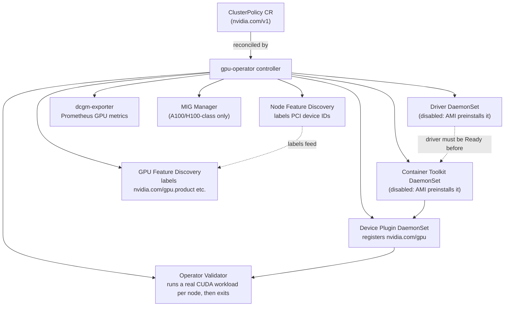

# 02 · NVIDIA GPU Operator

> One Helm chart, one `ClusterPolicy` custom resource: driver, container toolkit, device plugin,
> DCGM, GPU Feature Discovery and Node Feature Discovery, managed as a single reconciled install on
> EKS — and when that's worth it over chapter 01's manual driver-plus-`nvdp` path.

**New to Kubernetes and GPU infrastructure?** This chapter assumes you've done chapter 01, but it
still throws a lot of new vocabulary at you at once (Operator, DaemonSet, driver, CUDA toolkit,
container toolkit, GFD, DCGM...). Section 3.0 below defines every one of those terms in plain
language *before* you touch a command. Read it first if any of them are new — the lab will make a
lot more sense.

## Before you start

Needs from [`01-gpu-nodes-and-scheduling`](../01-gpu-nodes-and-scheduling): a spot GPU node group up
on EKS. EKS's AL2023 NVIDIA-accelerated AMI bakes the driver and container toolkit in at boot, so
there's nothing to disable at node-group create time — the Operator just needs to be told not to
reinstall what's already there (Step 2 below). If chapter 01's standalone `nvdp` device plugin is
running on the cluster, uninstall it first (Step 1 below) — two device plugins double-register GPUs.

If you're not yet comfortable with what a GPU node group, a taint/toleration, or `nvidia.com/gpu` as
an allocatable resource mean, go back and finish chapter 01 first — this chapter builds directly on
top of that vocabulary instead of re-explaining it.

## 1. Why this matters

Chapter 01 used EKS's baked-in AMI driver and manually installed a pinned device plugin on top.
That's fine for one cluster. It stops being fine once you also want DCGM GPU metrics, node labels
describing exactly which GPU model/memory/CUDA version each node has (GPU Feature Discovery), MIG
partitioning, and a single, repeatable upgrade process instead of hand-managing a Helm release plus
whatever the AMI happens to ship. The **NVIDIA GPU Operator** packages all of that as one
Kubernetes-native install: a `ClusterPolicy` CR describes what you want, an operator reconciles it
into DaemonSets and Deployments, and `kubectl get clusterpolicy` tells you if it's healthy.

The trade-off: it's more moving parts for a single CUDA job, and on EKS you're disabling half of it
because the AMI already did that part. Know when to reach for it.

**Why a course teaches you the "more complex" option right after the simple one:** in a real fleet
you rarely run exactly one GPU job on exactly one node forever. The moment you have more than a
handful of GPU nodes, you want the same guarantees Kubernetes gives you for everything else —
declare the desired state once, let a controller keep it that way, and get a single place to check
health — instead of a pile of `helm install`/`kubectl apply` commands you ran once and have to
remember. The Operator is that pattern applied to "get a GPU driver stack safely onto every node."

## 2. Learning objectives and time plan (~3 h)

By the end you can:

1. Name every component the GPU Operator manages and what each one does (driver, toolkit, device
   plugin, GFD, NFD, DCGM, validator).
2. Explain which components stay disabled on EKS and why (the AMI already provides them — chapter
   01's driver situation, again).
3. Read and edit a `ClusterPolicy` CR and `values-eks.yaml`.
4. Install the Operator on EKS, validate it came up healthy, and read GFD's node labels.
5. State the upgrade strategy and what to check before bumping `${GPU_OPERATOR_VERSION}`.
6. Decide, for a given cluster, whether the Operator or chapter 01's manual path is the better fit.

| Time | Activity |
|---|---|
| 0:00–0:30 | Read section 3 (glossary, concepts, component table). Read `common/clusterpolicy.yaml` |
| 0:30–1:00 | Decide: Operator vs. the AMI's baked-in driver (section 3.3) |
| 1:00–1:45 | Install the Operator, watch operands come up |
| 1:45–2:15 | `common/validate.sh`, read GFD labels, rerun chapter 01's CUDA job against the Operator-managed nodes |
| 2:15–2:45 | Break it: disable a component that's actually needed, watch `ClusterPolicy` status; read the upgrade-strategy section |
| 2:45–3:00 | Checkpoint questions, cleanup |

## 3. Concepts

### 3.0 First-timer glossary — read this before anything else

If you already know these terms from other Kubernetes/GPU work, skip ahead to 3.1. If any of them
are new, read this section slowly — the rest of the chapter uses all of it without re-explaining.

- **Operator (the Kubernetes pattern, not just "the NVIDIA one").** A normal Kubernetes controller
  watches built-in objects (Pods, Deployments) and reconciles them toward a desired state. An
  *Operator* is the same idea extended to a **custom resource** the vendor defines for their own
  domain — here, `ClusterPolicy`. You write down *what you want* ("GPU driver present, DCGM metrics
  on, MIG manager on") in that one YAML object, and a controller NVIDIA ships (the "gpu-operator"
  Pod) continuously watches it and creates/updates/deletes the underlying DaemonSets and Deployments
  to match. NVIDIA ships an Operator instead of a plain install script because a driver install on a
  live cluster is not a one-shot task — nodes join and leave (especially on spot capacity), get
  replaced, and reboot, and every new node needs the same driver/toolkit/plugin stack applied again,
  correctly, without you SSH-ing in. The Operator's whole job is making that ongoing process
  self-healing instead of a checklist you run by hand.
- **DaemonSet.** A Kubernetes workload type that runs exactly one copy of a Pod on every node that
  matches its selector/tolerations (as opposed to a Deployment, which runs a fixed number of
  replicas wherever the scheduler decides). GPU software is naturally a DaemonSet's job: you want the
  driver, the container toolkit, the device plugin, and the metrics exporter running on *every* GPU
  node, automatically, including new ones that join later — nobody manually schedules "install the
  driver on this specific node." Every component in the table in 3.1 except the operator controller
  itself and the validator is a DaemonSet for exactly this reason.
- **The GPU driver.** The NVIDIA kernel module (`nvidia.ko`) plus its matching user-mode CUDA
  libraries. This is the same category of thing as any device driver — without it, the Linux kernel
  doesn't know the PCIe card is a GPU it can talk to, and no CUDA program can run. It is
  version-sensitive: a container's CUDA runtime must be compatible with the *host's* driver version,
  which is why driver version shows up in the "versions tested" table at the bottom of this README
  and in every chart release's notes.
- **The container toolkit (`nvidia-container-toolkit` / CDI).** Docker/containerd don't expose host
  devices to containers by default — that's a deliberate isolation boundary. The container toolkit is
  what punches a GPU-shaped hole through that boundary: it hooks into the container runtime so that
  when a Pod requests `nvidia.com/gpu`, the runtime bind-mounts the right device nodes and driver
  libraries into the container at start time. CDI (Container Device Interface) is the newer,
  standardized way this handoff happens; `values-eks.yaml` turns it on (`cdi.enabled: true`).
- **Why driver + toolkit "normally" have to be installed on every node.** Outside of a cloud that
  bakes them into the node image, a brand-new GPU node is just a Linux box with a PCIe card in it —
  nothing about Kubernetes or containerd knows it's a GPU yet. Someone (a human, a bootstrap script,
  or the Operator) has to install the matching kernel driver and the container toolkit on *that exact
  node* before any GPU Pod can schedule there successfully. Do this by hand across a fleet that scales
  up and down (especially with spot nodes churning) and you will eventually get drift: a node with the
  wrong driver version, a missed toolkit install, or a manual step that silently didn't run. That
  fleet-wide consistency problem is the entire reason the Operator exists.
- **GPU Feature Discovery (GFD).** A small tool that runs on each GPU node, queries the GPU hardware
  through the driver, and turns what it finds into Kubernetes node labels — `nvidia.com/gpu.product`,
  `nvidia.com/gpu.memory`, `nvidia.com/gpu.count`, `nvidia.com/cuda.driver.major`, and more. Those
  labels matter because raw Kubernetes scheduling only knows "this node has N `nvidia.com/gpu`
  allocatable" — it has no idea if that GPU is an L4, an A100, or an H100, or how much memory it has.
  GFD's labels are what let you write a `nodeSelector`/`nodeAffinity` targeting a specific GPU model
  or minimum memory, and what chapter 03's sharing strategies and chapter 13's autoscaling both key
  off of.
- **`dcgm-exporter`.** NVIDIA's Data Center GPU Manager, wrapped as a Prometheus exporter. It scrapes
  live GPU telemetry — utilization percentage, memory used, temperature, power draw, ECC memory
  errors, NVLink errors — directly from the driver, and exposes it as Prometheus metrics on each GPU
  node. Without it, Kubernetes only tells you a Pod is `Running`; it tells you nothing about whether
  the GPU inside that Pod is actually busy, overheating, or throwing memory errors. Chapter 04 builds
  Grafana dashboards on top of exactly these metrics.
- **Why EKS's AL2023 NVIDIA AMI changes the calculus.** On a generic Linux node (or a bare EC2 GPU
  instance with a plain AMI), *nothing* provides the driver or toolkit — the Operator has to install
  and manage the full stack itself, which is the scenario the Operator was originally designed for.
  EKS's AL2023 NVIDIA-accelerated AMI is different: AWS bakes the matching driver and
  `nvidia-container-toolkit` directly into the AMI and installs them via `nodeadm` before the node
  ever joins the cluster. That means two of the Operator's biggest jobs (driver install, toolkit
  install) are already done by the time `gpu-operator` sees the node. This chapter's `values-eks.yaml`
  reflects that: `driver.enabled: false` and `toolkit.enabled: false`, while everything the AMI
  *doesn't* give you for free — the device plugin, GFD, NFD, DCGM, MIG manager — stays enabled. This
  is also why a fresh spot GPU node becomes useful about as fast under the Operator as it did with
  chapter 01's manual `nvdp` install (checkpoint question 4): there's no driver-install phase for the
  Operator to run through first.

### 3.1 What the Operator actually deploys



**How to read this diagram if you've never seen one like it before:** every box below `CP` is a
piece of software the Operator can turn on or off, laid out roughly in the order it comes up on a
node. Start at the top:

1. **`ClusterPolicy CR`** is the single YAML object you (or, in this chapter's normal flow, Helm on
   your behalf) write down. It's not running software — it's a *desired-state record*, the same way a
   Deployment spec is a record of "I want 3 replicas," not a process itself.
2. **`gpu-operator controller`** is the one thing that actually reads that record. It's a normal
   Kubernetes controller Pod, running a reconcile loop: watch `ClusterPolicy`, compare it to what
   DaemonSets/Deployments currently exist, create/update/delete the difference. Every solid arrow
   going down from it (`-->`) means "the controller creates/manages this."
3. The dotted arrows (`-.->`) are *not* things the controller creates — they show a real dependency
   between components once they're running. `NFD -. labels feed .-> GFD` means GFD needs NFD's PCI
   device labels to know which nodes even have an NVIDIA card before it tries to query them in more
   detail. `DRV -. driver must be Ready before .-> TK --> DP --> VAL` is the **boot order**: on a
   cluster where the Operator manages the full stack, the container toolkit can't do anything until
   the driver is loaded, the device plugin can't register a GPU until the toolkit can expose it to
   containers, and the validator can't declare success until the device plugin actually works. On
   EKS, the first two boxes in that chain (`DRV`, `TK`) are disabled — the AMI already satisfied them
   before the node joined — so in practice the chain you watch start on EKS is just device plugin →
   validator, which is why it's fast (see 3.0's last bullet).
4. The parenthetical text in the `DRV` and `TK` boxes ("disabled: AMI preinstalls it") is telling you
   in advance what section 3.3 explains in full: those two boxes exist in every install of this chart,
   but `values-eks.yaml` turns them off for this specific cloud/AMI combination.

| Component | What it does | On by default |
|---|---|---|
| **Driver** | Installs/manages the NVIDIA kernel driver + CUDA user-mode libs via a DaemonSet | Yes |
| **Container Toolkit** | `nvidia-container-toolkit` + CDI, makes the runtime inject GPUs into containers | Yes |
| **Device Plugin** | Registers `nvidia.com/gpu` with the kubelet (same role as chapter 01's `nvdp` chart) | Yes |
| **GFD** (GPU Feature Discovery) | Labels nodes `nvidia.com/gpu.product`, `.memory`, `.count`, `nvidia.com/cuda.driver.major`, etc. | Yes |
| **NFD** (Node Feature Discovery) | Labels nodes by PCI device (`feature.node.kubernetes.io/pci-10de.present`) so GFD/toolkit selectors work | Yes (bundled subchart) |
| **DCGM / dcgm-exporter** | GPU telemetry (utilization, memory, ECC errors, thermals) as Prometheus metrics — chapter 04 builds dashboards on this | dcgm-exporter yes, standalone `dcgm` hostengine no (exporter embeds its own) |
| **MIG Manager** | Applies/reconfigures Multi-Instance GPU partitions on A100/H100-class GPUs | Yes (no-op without MIG-capable GPUs) |
| **Validator** | Runs a real workload on each component (driver, toolkit, CUDA, plugin) as it comes up, then exits `Completed` | Always runs |

### 3.2 The `ClusterPolicy` custom resource

`ClusterPolicy` (`apiVersion: nvidia.com/v1`, cluster-scoped, singleton named `cluster-policy`) is
the one CR you edit; the operator's controller reconciles every component in the table above from
its `spec`. In the normal install path (this chapter's Step 2), you don't write the CR by hand — Helm
renders it from `values-eks.yaml`, the same file that configures the chart. See
`common/clusterpolicy.yaml` for a fully-commented copy of what the chart renders, verified against
the `${GPU_OPERATOR_VERSION}` chart's actual `helm template` output and CRD schema — useful for
reading/diffing without a cluster (`kubectl kustomize eks`), not for applying directly.

### 3.3 Operator vs. the AMI's baked-in driver

EKS's AL2023 NVIDIA-accelerated AMI (the one chapter 01's node group uses) bakes the driver and
container toolkit in at boot via `nodeadm`. `values-eks.yaml` disables the Operator's `driver` and
`toolkit` components accordingly — reinstalling them on top of what the AMI already provides would
fight over the kernel module — but leaves `devicePlugin` **enabled**: the Operator's device plugin
replaces chapter 01's standalone `nvdp` Helm release, and GFD, NFD, DCGM, and the MIG manager are all
new capability the AMI doesn't give you on its own.

Rule of thumb: reach for the Operator when you need DCGM metrics, GFD labels, or MIG management on
top of the AMI's driver. If all you need is `nvidia.com/gpu` to show up, chapter 01's manual `nvdp`
install is simpler and has fewer moving parts to reconcile. The only case where the Operator would
need to manage the **full** stack (driver + toolkit too) is a GPU node with no vendor driver
preinstalled at all — not this repo's EKS path, but worth knowing if you ever point this chart at a
bare EC2 GPU instance outside EKS's managed node group tooling, or on-prem/bare-metal.

## 4. Lab

```bash
source env.sh && source versions.env   # GPU_OPERATOR_VERSION=v26.7.0, DEVICE_PLUGIN_VERSION, DCGM_EXPORTER_CHART_VERSION
```
Why this matters before anything else: every Helm command below is version-pinned
(`--version "${GPU_OPERATOR_VERSION}"`), not "latest". Pinning is deliberate — an unpinned GPU
Operator upgrade can silently bump the default driver version on your next `helm upgrade`, and a
driver bump is exactly the kind of change you want to control on purpose (see the upgrade-strategy
checkpoint question at the end). Sourcing `versions.env` is what makes these variables exist in your
shell for every command that follows.

### Step 1: Remove chapter 01's standalone device plugin (if present)

What you're about to do and why: the Operator installs its own device plugin; leaving chapter 01's
`nvdp` release running alongside it double-registers `nvidia.com/gpu`. Concretely: both DaemonSets
would independently tell the kubelet "I am providing N `nvidia.com/gpu` devices," the kubelet's count
becomes unreliable, and which plugin actually answers an `Allocate` call for a given Pod is a race —
so this step has to happen *before* Step 2, not after.
```bash
helm -n nvidia-device-plugin uninstall nvdp || true
```
The trailing `|| true` is there so this step is safe to run even if chapter 01's plugin was never
installed on this cluster (a fresh cluster, or one that started at this chapter) — `helm uninstall`
on a release that doesn't exist would otherwise exit non-zero and (depending on how you're running
this) stop the rest of the script.

How to tell this worked: `helm -n nvidia-device-plugin list` returns no `nvdp` release (or the
namespace never existed — that's fine too).

### Step 2: Install the Operator on EKS

What you're about to do: install the GPU Operator via Helm, pinned to `${GPU_OPERATOR_VERSION}`, with
`values-eks.yaml` disabling `driver`/`toolkit` (preinstalled on the AL2023 NVIDIA AMI) but leaving
`devicePlugin`, GFD, NFD, DCGM and the MIG manager enabled. Prereq: the spot GPU node group from
chapter 01 §4 Step 1 is up. This is the step that actually creates the `ClusterPolicy` object
described in 3.2 and hands control of the components in 3.1's table to the operator controller —
everything before this point was preparation.
```bash
helm repo add nvidia https://helm.ngc.nvidia.com/nvidia --force-update
helm repo update nvidia
```
Adding NVIDIA's chart repository is a one-time bookkeeping step so Helm knows where to fetch the
`gpu-operator` chart from; `--force-update` just makes it safe to re-run if the repo was already
added under a different URL. `helm repo update` refreshes the local index of available chart
versions so the `--version` pin below is checked against current data, not a stale cache.
```bash
helm upgrade --install gpu-operator nvidia/gpu-operator \
  --namespace gpu-operator --create-namespace \
  --version "${GPU_OPERATOR_VERSION}" \
  -f 02-nvidia-gpu-operator/eks/values-eks.yaml \
  --wait --timeout 15m

kubectl -n gpu-operator get pods
echo "--- ClusterPolicy status (Ready when all operands come up) ---"
kubectl get clusterpolicy cluster-policy -o jsonpath='{.status.state}{"\n"}'
```
Why `helm upgrade --install` instead of `helm install`: it's idempotent — the same command installs
the chart the first time and safely re-applies changes to `values-eks.yaml` on every subsequent run,
so you never need a separate "is this already installed?" check. `--create-namespace` saves a
`kubectl create namespace gpu-operator` step. `--wait --timeout 15m` makes Helm block until every
resource it created reports ready (or fail loudly after 15 minutes) instead of returning immediately
while DaemonSets are still starting — that's what turns a silent hang into a command you can actually
debug (see the troubleshooting table below for what a hang usually means).

How to tell this worked: the `helm upgrade --install` exits 0 (it runs `--wait --timeout 15m`, so a
hang means a DaemonSet couldn't schedule — check `kubectl -n gpu-operator get pods` for anything not
`Running`) and `ClusterPolicy` reports state `ready`.

Expected output:
```bash
kubectl -n gpu-operator get pods
```
```
NAME                                                          READY   STATUS      RESTARTS
gpu-feature-discovery-xxxxx                                   1/1     Running     0
gpu-operator-xxxxxxxxxx-xxxxx                                 1/1     Running     0
nvidia-dcgm-exporter-xxxxx                                     1/1     Running     0
nvidia-device-plugin-daemonset-xxxxx                           1/1     Running     0
nvidia-operator-validator-xxxxx                                1/1     Running     0
node-feature-discovery-worker-xxxxx                            1/1     Running     0
...
```
```bash
kubectl get clusterpolicy cluster-policy -o jsonpath='{.status.state}'
```
```
ready
```

### Step 3: Validate

What you're about to do: confirm every operand is healthy and GFD's labels landed on the GPU node,
then re-run chapter 01's CUDA smoke test against the same node with the Operator now doing the work.
This step exists because "the Helm command exited 0" and "every Pod says `Running`" are necessary but
not sufficient — the point of the validator component (table in 3.1) and this script is to prove GPUs
are actually schedulable and usable, not just that some Pods started.
```bash
./02-nvidia-gpu-operator/common/validate.sh
```
This script (real file, cloud-agnostic, checked into `common/`) runs five read-only checks in order:
`ClusterPolicy` status, every `gpu-operator` Pod, each node's allocatable `nvidia.com/gpu` count
(proof the device plugin registered it with the kubelet), the GFD labels described in 3.0, and the
Operator's own validator Pods. Reading it top to bottom mirrors the dependency order from the diagram
in 3.1.

Expected output — GFD labels on the GPU node:
```
NAME                        GPU-PRODUCT   GPU-MEMORY   GPU-COUNT
ip-10-0-1-23.ec2.internal   NVIDIA-L4     23034MiB     1
```
How to tell this worked: every pod listed by `validate.sh` is `Running` (validators `Completed`), and
the GFD columns are non-empty for your GPU node. Re-run chapter 01's smoke test against the
Operator-managed node — same manifests, same result, different plumbing underneath:
```bash
kubectl apply -k 01-gpu-nodes-and-scheduling/eks
kubectl -n ch01-gpu logs job/cuda-vectoradd
```
The point of reusing chapter 01's exact Job manifest here (nothing rewritten) is that it's the
cleanest possible proof that the Operator's driver/toolkit/plugin chain is a drop-in replacement for
chapter 01's manual install — if anything in that chain were subtly broken, this unmodified CUDA job
would fail the same way any real GPU workload would.

How to tell this worked: the job reaches `Completed` and its log shows the vector-add result, exactly
like chapter 01 — proving the Operator's driver/toolkit/plugin chain is a drop-in replacement.

### Step 4: cpu-lab (what doesn't carry over)

**There is no meaningful GPU-Operator lab on CPU-only nodes.** The Operator's entire purpose is
installing and reconciling a real driver, container toolkit and DCGM stack against physical GPU
hardware — none of that exists without a GPU node, and unlike chapter 00/01's fake-`nvidia.com/gpu`
trick, faking node status doesn't get you anything: the Operator's own components (driver DaemonSet,
toolkit, validator) would still try to talk to real hardware and fail, which teaches you nothing
useful about the Operator itself.

What you *can* do without a cluster, cloud account, or GPU — all read-only/local:
```bash
./02-nvidia-gpu-operator/cpu-lab/validate-dry-run.sh
```
This runs `helm template` against `values-eks.yaml` and the pinned chart (renders the `ClusterPolicy`
the real install would create, entirely client-side) and `kubectl kustomize` on every overlay in this
chapter, to confirm the CR schema and our toggles are self-consistent before you ever touch a real
cluster. `helm template` and `kubectl kustomize` never open a network connection to a cluster or make
an AWS API call — they only render YAML locally — which is exactly why this script is safe to run
with no AWS account, no `kubeconfig`, and no GPU, and is the same kind of dry-run validation
`CLAUDE.md`'s repo-wide "no test suite" convention relies on. Use this to review the diff between
`values-eks.yaml` and `common/clusterpolicy.yaml` — the disabled/enabled component list you're
reading right now is the whole point of section 3.3.

## 5. Spot considerations

> **Spot capacity is the default in this repo, and it costs real money the moment a GPU node group
> scales above zero.** Everything below assumes you understand that a spot GPU instance can be
> reclaimed by AWS at any time with a two-minute warning — read this section before you walk away
> from a running lab.

- **The device plugin, GFD, DCGM-exporter, and MIG-manager DaemonSets all need the spot taint
  toleration**, not just your workload — same lesson as chapter 01, now for every Operator-managed
  DaemonSet at once. `daemonsets.tolerations` in `values-eks.yaml` is the one place this is set
  centrally (versus per-manifest in chapter 01). Get this wrong and these DaemonSets simply never
  schedule onto the tainted spot node — with no error, just Pods stuck `Pending` forever, which is
  the "hang past `--timeout`" failure mode in the troubleshooting table below.
- **Driver and toolkit are disabled here**, so a spot reclaim mid-scheduling only affects the
  Operator's own components (device plugin, GFD, DCGM) — there's no driver-install phase to interrupt,
  because the AMI's driver is already baked in before the node ever joins the cluster. That's a real
  advantage over a cloud where the Operator has to install the driver itself: less that can go wrong
  during a spot reclaim.
- **Validator pods re-run on every node (re)join.** A spot node that gets reclaimed and replaced pays
  the device-plugin + validator cost again on the replacement node — there's no way to skip
  re-validation for a "new" node, by design.
- **This chapter does not spin up a new GPU node group** — it installs software onto the one from
  chapter 01. If you scaled that node group to 0 at the end of chapter 01's cleanup, scale it back up
  before Step 2, and remember to scale it back down again (§7 below) when you're done here — the GPU
  operator's own control-plane Pods are cheap, but an idle GPU node is not.

## 6. Troubleshooting

| Symptom | Cause | Why this happens | Fix |
|---|---|---|---|
| `ClusterPolicy` status stuck `notReady` | One operand's DaemonSet/Deployment not yet `Ready`, or a validator pod failing | The controller only reports `ready` once *every enabled* component in 3.1's table reports healthy — one slow or broken operand blocks the whole status, by design, so you get one place to look instead of checking each component separately | `kubectl -n gpu-operator get pods`; `kubectl -n gpu-operator describe pod <failing-one>` |
| `nvidia-driver-daemonset` `CrashLoopBackOff` | `driver.enabled` wasn't set to `false` — the AMI's driver and the Operator's driver DaemonSet fight over the kernel module | A Linux kernel can only have one copy of the NVIDIA kernel module loaded at a time; the Operator's driver container tries to load its own, collides with the one the AMI already loaded at boot, and the container keeps failing and restarting | Confirm `driver.enabled: false` in `values-eks.yaml` (already set); reinstall |
| Two device plugins registering the same GPU (`nvidia.com/gpu` count wrong, flapping) | Chapter 01's standalone `nvdp` Helm release still installed alongside the Operator's | Each device plugin independently tells the kubelet how many GPUs it's providing; with two plugins on the same node the kubelet's view of `nvidia.com/gpu` capacity oscillates between their competing reports, and it's a race which plugin's socket actually serves an `Allocate` call | `helm -n nvidia-device-plugin uninstall nvdp` before installing this chapter |
| `nvidia-operator-validator` pod stuck `Init` | Waiting on an earlier stage (driver → toolkit → device plugin → CUDA) that hasn't finished | The validator's init containers run in the same dependency order shown by the dotted arrows in 3.1's diagram — it deliberately won't validate a later stage until the stage before it has proven itself, so a stuck earlier stage always shows up here first | Check pods in dependency order; a stuck earlier stage blocks everything after it |
| GFD labels missing | GFD or NFD pod not scheduled (taint/toleration mismatch) or still starting | GFD depends on NFD's PCI-device labels to even know a node has an NVIDIA card (the dotted `NFD -. labels feed .-> GFD` arrow in 3.1); if either Pod never scheduled because of a toleration mismatch, no labels get written and there's nothing to see with `kubectl get nodes -L ...` | `kubectl -n gpu-operator get pods -l app=gpu-feature-discovery`; check `daemonsets.tolerations` in `values-eks.yaml` covers the spot taint |
| `helm upgrade --install` hangs past `--timeout` | A DaemonSet can't schedule anywhere (wrong node selector/taint) so it never reports `Ready` | `--wait` makes Helm block on every created resource reaching `Ready`; a DaemonSet with zero eligible nodes (usually a toleration that doesn't match the spot taint) never will, so Helm just waits out the full `--timeout` before failing instead of erroring immediately | `kubectl -n gpu-operator get ds`; check `desired` vs `ready`; look for `Pending` pods and their scheduling events |

## 7. Cleanup and cost notes

> **Tear this down when you're done with the chapter.** The Operator's own Pods are cheap, but they
> are not the expensive part — the GPU node underneath them is, whether or not anything is installed
> on it. Leaving a spot GPU node group scaled above zero overnight is the single most common way to
> get an unwanted AWS bill from this course.

What you're about to do: remove the Helm release and the `ClusterPolicy` CR.
```bash
helm -n gpu-operator uninstall gpu-operator || true
kubectl delete clusterpolicy cluster-policy --ignore-not-found
echo "CRDs are left in place by 'helm uninstall'; delete manually only if you're done with the chart:"
echo "  kubectl get crd -o name | grep nvidia.com"
```
`helm uninstall` removes the release's Deployments/DaemonSets/Services but deliberately leaves CRDs
behind (standard Helm behavior, to avoid silently deleting custom resources other tools might still
reference) — the `echo` lines above are a reminder of the manual command, not something the script
runs for you, precisely so you don't delete a CRD you still need without thinking about it first.

This deliberately leaves the chart's CRDs installed (`helm uninstall` behavior) and does **not**
touch the GPU node group — use chapter 01 §7 (`eksctl scale nodegroup ... --nodes 0`) or
`00-prerequisites-and-cluster-setup` to stop paying for nodes.
- The Operator's own pods (controller, NFD, GFD, dcgm-exporter, validators) are small and run on
  cheap CPU nodes — they add negligible cost. The GPU node itself is still the expensive part; the
  same spot-pricing guidance from chapters 00–01 applies unchanged.
- If you switch a cluster from chapter 01's manual device plugin to this chapter's Operator (or back),
  clean up the one you're abandoning — leftover DaemonSets on the GPU node waste a pod slot and can
  cause the double-registration issue in the troubleshooting table.

## 8. Checkpoint questions

<details>
<summary>1. Name the seven components the GPU Operator can manage, and which two stay disabled on EKS in this chapter's values file.</summary>

Driver, Container Toolkit, Device Plugin, GPU Feature Discovery (GFD), Node Feature Discovery (NFD),
DCGM/dcgm-exporter, MIG Manager (plus the Validator, which always runs). On EKS, **driver** and
**toolkit** stay disabled because the AL2023 NVIDIA-accelerated AMI already provides them.
</details>

<details>
<summary>2. Suppose you pointed this chart at a bare EC2 GPU instance joined to the cluster outside EKS's managed node group tooling, with no AMI-baked driver. How would <code>values-eks.yaml</code> need to change?</summary>

Set `driver.enabled: true` and `toolkit.enabled: true` (in addition to the already-enabled
`devicePlugin`, GFD, NFD, DCGM, MIG manager) — with nothing preinstalling a driver, the Operator has
to run the full stack, the same reasoning that governs GKE/toolkit decisions on any cloud whose node
image doesn't already ship one.
</details>

<details>
<summary>3. What is <code>ClusterPolicy</code>, and how do you normally create/change one in this chapter's lab?</summary>

A cluster-scoped custom resource (`nvidia.com/v1`, singleton name `cluster-policy`) that the
operator's controller reconciles into every component's DaemonSet/Deployment. You don't hand-edit it
in the normal flow — Helm renders it from `values-eks.yaml` on `helm upgrade --install`. The
`common/clusterpolicy.yaml` kustomize copy is for offline reading/diffing only.
</details>

<details>
<summary>4. A node just joined a spot GPU pool that was empty a minute ago. Why does it become useful for GPU workloads about as fast here as it did in chapter 01's manual device-plugin install?</summary>

Because `driver.enabled` and `toolkit.enabled` are both `false` on EKS — the AMI already installed
the driver and toolkit before the node ever joined the cluster, so the Operator only has to bring up
the device plugin (and GFD/DCGM/MIG manager) once the node is `Ready`, the same single fast step
chapter 01's manual `nvdp` install did. A cloud where the Operator has to install the driver itself
would take meaningfully longer, since toolkit/device-plugin/validator all wait on that stage first.
</details>

<details>
<summary>5. What does the Operator's own validator do, and why does it matter for debugging?</summary>

It runs a real small workload against each enabled component (driver, toolkit, CUDA, device plugin)
as that component comes up, and only exits `Completed` if it actually worked — not just "the pod
started." A stuck or `CrashLoopBackOff` validator pod tells you exactly which stage of the chain is
broken, faster than guessing from a generic `Pending` GPU workload pod.
</details>

<details>
<summary>6. Why must chapter 01's standalone device plugin be uninstalled before installing the GPU Operator on the same nodes?</summary>

Two device plugins both register `nvidia.com/gpu` with the kubelet independently; the count becomes
wrong or flaps as they race, and `Allocate` calls can go to whichever plugin's DaemonSet claimed the
socket path, so pods might get device IDs from either registration inconsistently. Only one device
plugin may own the resource per node.
</details>

<details>
<summary>7. When would you pick chapter 01's manual <code>nvdp</code> approach over the GPU Operator, even though it means managing that Helm release yourself?</summary>

When you just need `nvidia.com/gpu` to work and don't need DCGM metrics, GFD labels, or MIG
management — the Operator adds reconciliation overhead (an extra controller, more DaemonSets, its own
CRDs and upgrade lifecycle) for capability you're not using. It's most worth it once you want the
observability/MIG story managed by one component instead of a hand-picked chart version.
</details>

<details>
<summary>8. What should you check before bumping <code>GPU_OPERATOR_VERSION</code> to a new release?</summary>

Read the chart's release notes for driver-version bumps (a new default driver version ships with
almost every Operator release) and any minimum-toolchain changes (e.g. this release raised the
minimum supported containerd version) that could break your cluster's container runtime; then test
with `helm template`/`cpu-lab/validate-dry-run.sh` before touching a real cluster, and roll out to a
single node group first — the Operator restarts driver pods in place on an upgrade, which briefly
interrupts GPU workloads on that node.
</details>

## 9. Further reading and versions tested

- [NVIDIA GPU Operator docs](https://docs.nvidia.com/datacenter/cloud-native/gpu-operator/latest/index.html), [ClusterPolicy CRD reference](https://docs.nvidia.com/datacenter/cloud-native/gpu-operator/latest/gpu-operator-helm-chart.html), [Release notes](https://docs.nvidia.com/datacenter/cloud-native/gpu-operator/latest/release-notes.html), [Upgrading the Operator](https://docs.nvidia.com/datacenter/cloud-native/gpu-operator/latest/upgrade.html)
- [NVIDIA GPU Operator with Amazon EKS](https://docs.nvidia.com/datacenter/cloud-native/gpu-operator/latest/amazon-eks.html)
- For the Kubernetes-native concepts this chapter assumes (Operators/CRDs, DaemonSets): the
  [Kubernetes Operator pattern](https://kubernetes.io/docs/concepts/extend-kubernetes/operator/) and
  [DaemonSet](https://kubernetes.io/docs/concepts/workloads/controllers/daemonset/) docs are good
  general-purpose background if section 3.0 wasn't enough.
- Previous: [`01-gpu-nodes-and-scheduling`](../01-gpu-nodes-and-scheduling) (the manual per-cloud path this chapter automates). Next: [`03-gpu-sharing-and-dra`](../03-gpu-sharing-and-dra) (time-slicing, MPS, MIG in depth, and Dynamic Resource Allocation — MIG Manager here is the prerequisite plumbing)

**Versions tested** (2026-09-16): Kubernetes 1.35, `GPU_OPERATOR_VERSION=v26.7.0` (`helm/nvidia/gpu-operator`,
verified current/latest via `helm search repo nvidia/gpu-operator --versions` and chart release notes),
chart-pinned defaults observed via `helm show values`/`helm template`: driver `595.91.07`,
toolkit `v1.20.0`, `DEVICE_PLUGIN_VERSION=v0.20.0` (matches `versions.env`), gfd `v0.20.0`,
dcgm-exporter `4.6.0-4.8.3-distroless` (DCGM 4.6.0 + exporter `DCGM_EXPORTER_CHART_VERSION=4.8.3`,
matches `versions.env`), migManager `v0.15.0`.
</content>
