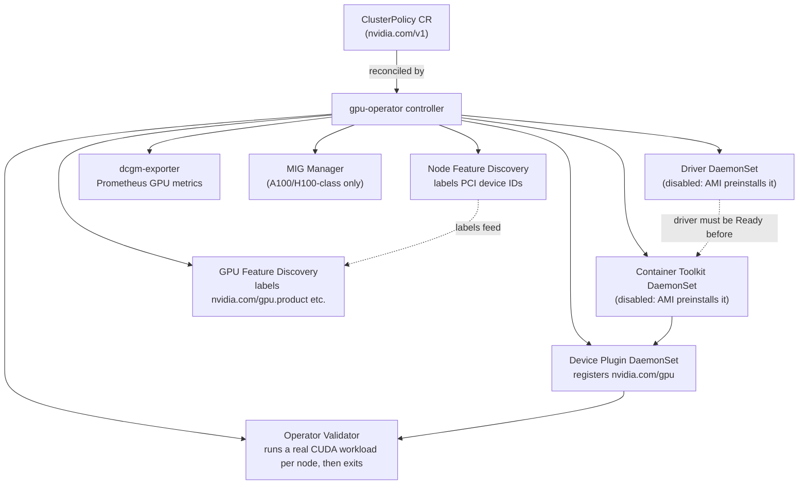

# 02 · NVIDIA GPU Operator

> One Helm chart, one `ClusterPolicy` custom resource: driver, container toolkit, device plugin,
> DCGM, GPU Feature Discovery and Node Feature Discovery, managed as a single reconciled install on
> EKS — and when that's worth it over chapter 01's manual driver-plus-`nvdp` path.

## Before you start

Needs from [`01-gpu-nodes-and-scheduling`](../01-gpu-nodes-and-scheduling): a spot GPU node group up
on EKS. EKS's AL2023 NVIDIA-accelerated AMI bakes the driver and container toolkit in at boot, so
there's nothing to disable at node-group create time — the Operator just needs to be told not to
reinstall what's already there (Step 2 below). If chapter 01's standalone `nvdp` device plugin is
running on the cluster, uninstall it first (Step 1 below) — two device plugins double-register GPUs.

## 1. Why this matters

Chapter 01 used EKS's baked-in AMI driver and manually installed a pinned device plugin on top.
That's fine for one cluster. It stops being fine once you also want DCGM GPU metrics, node labels
describing exactly which GPU model/memory/CUDA version each node has (GPU Feature Discovery), MIG
partitioning, and a single, repeatable upgrade process instead of hand-managing a Helm release plus
whatever the AMI happens to ship. The **NVIDIA GPU Operator** packages all of that as one
Kubernetes-native install: a `ClusterPolicy` CR describes what you want, an operator reconciles it
into DaemonSets and Deployments, and `kubectl get clusterpolicy` tells you if it's healthy.

The trade-off: it's more moving parts for a single CUDA job, and on EKS you're disabling half of it
because the AMI already did that part. Know when to reach for it.

## 2. Learning objectives and time plan (~3 h)

By the end you can:

1. Name every component the GPU Operator manages and what each one does (driver, toolkit, device
   plugin, GFD, NFD, DCGM, validator).
2. Explain which components stay disabled on EKS and why (the AMI already provides them — chapter
   01's driver situation, again).
3. Read and edit a `ClusterPolicy` CR and `values-eks.yaml`.
4. Install the Operator on EKS, validate it came up healthy, and read GFD's node labels.
5. State the upgrade strategy and what to check before bumping `${GPU_OPERATOR_VERSION}`.
6. Decide, for a given cluster, whether the Operator or chapter 01's manual path is the better fit.

| Time | Activity |
|---|---|
| 0:00–0:30 | Read section 3 (concepts + component table). Read `common/clusterpolicy.yaml` |
| 0:30–1:00 | Decide: Operator vs. the AMI's baked-in driver (section 3.3) |
| 1:00–1:45 | Install the Operator, watch operands come up |
| 1:45–2:15 | `common/validate.sh`, read GFD labels, rerun chapter 01's CUDA job against the Operator-managed nodes |
| 2:15–2:45 | Break it: disable a component that's actually needed, watch `ClusterPolicy` status; read the upgrade-strategy section |
| 2:45–3:00 | Checkpoint questions, cleanup |

## 3. Concepts

### 3.1 What the Operator actually deploys



| Component | What it does | On by default |
|---|---|---|
| **Driver** | Installs/manages the NVIDIA kernel driver + CUDA user-mode libs via a DaemonSet | Yes |
| **Container Toolkit** | `nvidia-container-toolkit` + CDI, makes the runtime inject GPUs into containers | Yes |
| **Device Plugin** | Registers `nvidia.com/gpu` with the kubelet (same role as chapter 01's `nvdp` chart) | Yes |
| **GFD** (GPU Feature Discovery) | Labels nodes `nvidia.com/gpu.product`, `.memory`, `.count`, `nvidia.com/cuda.driver.major`, etc. | Yes |
| **NFD** (Node Feature Discovery) | Labels nodes by PCI device (`feature.node.kubernetes.io/pci-10de.present`) so GFD/toolkit selectors work | Yes (bundled subchart) |
| **DCGM / dcgm-exporter** | GPU telemetry (utilization, memory, ECC errors, thermals) as Prometheus metrics — chapter 04 builds dashboards on this | dcgm-exporter yes, standalone `dcgm` hostengine no (exporter embeds its own) |
| **MIG Manager** | Applies/reconfigures Multi-Instance GPU partitions on A100/H100-class GPUs | Yes (no-op without MIG-capable GPUs) |
| **Validator** | Runs a real workload on each component (driver, toolkit, CUDA, plugin) as it comes up, then exits `Completed` | Always runs |

### 3.2 The `ClusterPolicy` custom resource

`ClusterPolicy` (`apiVersion: nvidia.com/v1`, cluster-scoped, singleton named `cluster-policy`) is
the one CR you edit; the operator's controller reconciles every component in the table above from
its `spec`. In the normal install path (this chapter's Step 2), you don't write the CR by hand — Helm
renders it from `values-eks.yaml`, the same file that configures the chart. See
`common/clusterpolicy.yaml` for a fully-commented copy of what the chart renders, verified against
the `${GPU_OPERATOR_VERSION}` chart's actual `helm template` output and CRD schema — useful for
reading/diffing without a cluster (`kubectl kustomize eks`), not for applying directly.

### 3.3 Operator vs. the AMI's baked-in driver

EKS's AL2023 NVIDIA-accelerated AMI (the one chapter 01's node group uses) bakes the driver and
container toolkit in at boot via `nodeadm`. `values-eks.yaml` disables the Operator's `driver` and
`toolkit` components accordingly — reinstalling them on top of what the AMI already provides would
fight over the kernel module — but leaves `devicePlugin` **enabled**: the Operator's device plugin
replaces chapter 01's standalone `nvdp` Helm release, and GFD, NFD, DCGM, and the MIG manager are all
new capability the AMI doesn't give you on its own.

Rule of thumb: reach for the Operator when you need DCGM metrics, GFD labels, or MIG management on
top of the AMI's driver. If all you need is `nvidia.com/gpu` to show up, chapter 01's manual `nvdp`
install is simpler and has fewer moving parts to reconcile. The only case where the Operator would
need to manage the **full** stack (driver + toolkit too) is a GPU node with no vendor driver
preinstalled at all — not this repo's EKS path, but worth knowing if you ever point this chart at a
bare EC2 GPU instance outside EKS's managed node group tooling, or on-prem/bare-metal.

## 4. Lab

```bash
source env.sh && source versions.env   # GPU_OPERATOR_VERSION=v26.7.0, DEVICE_PLUGIN_VERSION, DCGM_EXPORTER_CHART_VERSION
```

### Step 1: Remove chapter 01's standalone device plugin (if present)

What you're about to do and why: the Operator installs its own device plugin; leaving chapter 01's
`nvdp` release running alongside it double-registers `nvidia.com/gpu`.
```bash
helm -n nvidia-device-plugin uninstall nvdp || true
```
How to tell this worked: `helm -n nvidia-device-plugin list` returns no `nvdp` release (or the
namespace never existed — that's fine too).

### Step 2: Install the Operator on EKS

What you're about to do: install the GPU Operator via Helm, pinned to `${GPU_OPERATOR_VERSION}`, with
`values-eks.yaml` disabling `driver`/`toolkit` (preinstalled on the AL2023 NVIDIA AMI) but leaving
`devicePlugin`, GFD, NFD, DCGM and the MIG manager enabled. Prereq: the spot GPU node group from
chapter 01 §4 Step 1 is up.
```bash
helm repo add nvidia https://helm.ngc.nvidia.com/nvidia --force-update
helm repo update nvidia

helm upgrade --install gpu-operator nvidia/gpu-operator \
  --namespace gpu-operator --create-namespace \
  --version "${GPU_OPERATOR_VERSION}" \
  -f 02-nvidia-gpu-operator/eks/values-eks.yaml \
  --wait --timeout 15m

kubectl -n gpu-operator get pods
echo "--- ClusterPolicy status (Ready when all operands come up) ---"
kubectl get clusterpolicy cluster-policy -o jsonpath='{.status.state}{"\n"}'
```
How to tell this worked: the `helm upgrade --install` exits 0 (it runs `--wait --timeout 15m`, so a
hang means a DaemonSet couldn't schedule — check `kubectl -n gpu-operator get pods` for anything not
`Running`) and `ClusterPolicy` reports state `ready`.

Expected output:
```bash
kubectl -n gpu-operator get pods
```
```
NAME                                                          READY   STATUS      RESTARTS
gpu-feature-discovery-xxxxx                                   1/1     Running     0
gpu-operator-xxxxxxxxxx-xxxxx                                 1/1     Running     0
nvidia-dcgm-exporter-xxxxx                                     1/1     Running     0
nvidia-device-plugin-daemonset-xxxxx                           1/1     Running     0
nvidia-operator-validator-xxxxx                                1/1     Running     0
node-feature-discovery-worker-xxxxx                            1/1     Running     0
...
```
```bash
kubectl get clusterpolicy cluster-policy -o jsonpath='{.status.state}'
```
```
ready
```

### Step 3: Validate

What you're about to do: confirm every operand is healthy and GFD's labels landed on the GPU node,
then re-run chapter 01's CUDA smoke test against the same node with the Operator now doing the work.
```bash
./02-nvidia-gpu-operator/common/validate.sh
```
Expected output — GFD labels on the GPU node:
```
NAME                        GPU-PRODUCT   GPU-MEMORY   GPU-COUNT
ip-10-0-1-23.ec2.internal   NVIDIA-L4     23034MiB     1
```
How to tell this worked: every pod listed by `validate.sh` is `Running` (validators `Completed`), and
the GFD columns are non-empty for your GPU node. Re-run chapter 01's smoke test against the
Operator-managed node — same manifests, same result, different plumbing underneath:
```bash
kubectl apply -k 01-gpu-nodes-and-scheduling/eks
kubectl -n ch01-gpu logs job/cuda-vectoradd
```
How to tell this worked: the job reaches `Completed` and its log shows the vector-add result, exactly
like chapter 01 — proving the Operator's driver/toolkit/plugin chain is a drop-in replacement.

### Step 4: cpu-lab (what doesn't carry over)

**There is no meaningful GPU-Operator lab on CPU-only nodes.** The Operator's entire purpose is
installing and reconciling a real driver, container toolkit and DCGM stack against physical GPU
hardware — none of that exists without a GPU node, and unlike chapter 00/01's fake-`nvidia.com/gpu`
trick, faking node status doesn't get you anything: the Operator's own components (driver DaemonSet,
toolkit, validator) would still try to talk to real hardware and fail, which teaches you nothing
useful about the Operator itself.

What you *can* do without a cluster, cloud account, or GPU — all read-only/local:
```bash
./02-nvidia-gpu-operator/cpu-lab/validate-dry-run.sh
```
This runs `helm template` against `values-eks.yaml` and the pinned chart (renders the `ClusterPolicy`
the real install would create, entirely client-side) and `kubectl kustomize` on every overlay in this
chapter, to confirm the CR schema and our toggles are self-consistent before you ever touch a real
cluster. Use this to review the diff between `values-eks.yaml` and `common/clusterpolicy.yaml` — the
disabled/enabled component list you're reading right now is the whole point of section 3.3.

## 5. Spot considerations

- **The device plugin, GFD, DCGM-exporter, and MIG-manager DaemonSets all need the spot taint
  toleration**, not just your workload — same lesson as chapter 01, now for every Operator-managed
  DaemonSet at once. `daemonsets.tolerations` in `values-eks.yaml` is the one place this is set
  centrally (versus per-manifest in chapter 01).
- **Driver and toolkit are disabled here**, so a spot reclaim mid-scheduling only affects the
  Operator's own components (device plugin, GFD, DCGM) — there's no driver-install phase to interrupt,
  because the AMI's driver is already baked in before the node ever joins the cluster. That's a real
  advantage over a cloud where the Operator has to install the driver itself: less that can go wrong
  during a spot reclaim.
- **Validator pods re-run on every node (re)join.** A spot node that gets reclaimed and replaced pays
  the device-plugin + validator cost again on the replacement node — there's no way to skip
  re-validation for a "new" node, by design.

## 6. Troubleshooting

| Symptom | Cause | Fix |
|---|---|---|
| `ClusterPolicy` status stuck `notReady` | One operand's DaemonSet/Deployment not yet `Ready`, or a validator pod failing | `kubectl -n gpu-operator get pods`; `kubectl -n gpu-operator describe pod <failing-one>` |
| `nvidia-driver-daemonset` `CrashLoopBackOff` | `driver.enabled` wasn't set to `false` — the AMI's driver and the Operator's driver DaemonSet fight over the kernel module | Confirm `driver.enabled: false` in `values-eks.yaml` (already set); reinstall |
| Two device plugins registering the same GPU (`nvidia.com/gpu` count wrong, flapping) | Chapter 01's standalone `nvdp` Helm release still installed alongside the Operator's | `helm -n nvidia-device-plugin uninstall nvdp` before installing this chapter |
| `nvidia-operator-validator` pod stuck `Init` | Waiting on an earlier stage (driver → toolkit → device plugin → CUDA) that hasn't finished | Check pods in dependency order; a stuck earlier stage blocks everything after it |
| GFD labels missing | GFD or NFD pod not scheduled (taint/toleration mismatch) or still starting | `kubectl -n gpu-operator get pods -l app=gpu-feature-discovery`; check `daemonsets.tolerations` in `values-eks.yaml` covers the spot taint |
| `helm upgrade --install` hangs past `--timeout` | A DaemonSet can't schedule anywhere (wrong node selector/taint) so it never reports `Ready` | `kubectl -n gpu-operator get ds`; check `desired` vs `ready`; look for `Pending` pods and their scheduling events |

## 7. Cleanup and cost notes

What you're about to do: remove the Helm release and the `ClusterPolicy` CR.
```bash
helm -n gpu-operator uninstall gpu-operator || true
kubectl delete clusterpolicy cluster-policy --ignore-not-found
echo "CRDs are left in place by 'helm uninstall'; delete manually only if you're done with the chart:"
echo "  kubectl get crd -o name | grep nvidia.com"
```
This deliberately leaves the chart's CRDs installed (`helm uninstall` behavior) and does **not**
touch the GPU node group — use chapter 01 §7 (`eksctl scale nodegroup ... --nodes 0`) or
`00-prerequisites-and-cluster-setup` to stop paying for nodes.
- The Operator's own pods (controller, NFD, GFD, dcgm-exporter, validators) are small and run on
  cheap CPU nodes — they add negligible cost. The GPU node itself is still the expensive part; the
  same spot-pricing guidance from chapters 00–01 applies unchanged.
- If you switch a cluster from chapter 01's manual device plugin to this chapter's Operator (or back),
  clean up the one you're abandoning — leftover DaemonSets on the GPU node waste a pod slot and can
  cause the double-registration issue in the troubleshooting table.

## 8. Checkpoint questions

<details>
<summary>1. Name the seven components the GPU Operator can manage, and which two stay disabled on EKS in this chapter's values file.</summary>

Driver, Container Toolkit, Device Plugin, GPU Feature Discovery (GFD), Node Feature Discovery (NFD),
DCGM/dcgm-exporter, MIG Manager (plus the Validator, which always runs). On EKS, **driver** and
**toolkit** stay disabled because the AL2023 NVIDIA-accelerated AMI already provides them.
</details>

<details>
<summary>2. Suppose you pointed this chart at a bare EC2 GPU instance joined to the cluster outside EKS's managed node group tooling, with no AMI-baked driver. How would <code>values-eks.yaml</code> need to change?</summary>

Set `driver.enabled: true` and `toolkit.enabled: true` (in addition to the already-enabled
`devicePlugin`, GFD, NFD, DCGM, MIG manager) — with nothing preinstalling a driver, the Operator has
to run the full stack, the same reasoning that governs GKE/toolkit decisions on any cloud whose node
image doesn't already ship one.
</details>

<details>
<summary>3. What is <code>ClusterPolicy</code>, and how do you normally create/change one in this chapter's lab?</summary>

A cluster-scoped custom resource (`nvidia.com/v1`, singleton name `cluster-policy`) that the
operator's controller reconciles into every component's DaemonSet/Deployment. You don't hand-edit it
in the normal flow — Helm renders it from `values-eks.yaml` on `helm upgrade --install`. The
`common/clusterpolicy.yaml` kustomize copy is for offline reading/diffing only.
</details>

<details>
<summary>4. A node just joined a spot GPU pool that was empty a minute ago. Why does it become useful for GPU workloads about as fast here as it did in chapter 01's manual device-plugin install?</summary>

Because `driver.enabled` and `toolkit.enabled` are both `false` on EKS — the AMI already installed
the driver and toolkit before the node ever joined the cluster, so the Operator only has to bring up
the device plugin (and GFD/DCGM/MIG manager) once the node is `Ready`, the same single fast step
chapter 01's manual `nvdp` install did. A cloud where the Operator has to install the driver itself
would take meaningfully longer, since toolkit/device-plugin/validator all wait on that stage first.
</details>

<details>
<summary>5. What does the Operator's own validator do, and why does it matter for debugging?</summary>

It runs a real small workload against each enabled component (driver, toolkit, CUDA, device plugin)
as that component comes up, and only exits `Completed` if it actually worked — not just "the pod
started." A stuck or `CrashLoopBackOff` validator pod tells you exactly which stage of the chain is
broken, faster than guessing from a generic `Pending` GPU workload pod.
</details>

<details>
<summary>6. Why must chapter 01's standalone device plugin be uninstalled before installing the GPU Operator on the same nodes?</summary>

Two device plugins both register `nvidia.com/gpu` with the kubelet independently; the count becomes
wrong or flaps as they race, and `Allocate` calls can go to whichever plugin's DaemonSet claimed the
socket path, so pods might get device IDs from either registration inconsistently. Only one device
plugin may own the resource per node.
</details>

<details>
<summary>7. When would you pick chapter 01's manual <code>nvdp</code> approach over the GPU Operator, even though it means managing that Helm release yourself?</summary>

When you just need `nvidia.com/gpu` to work and don't need DCGM metrics, GFD labels, or MIG
management — the Operator adds reconciliation overhead (an extra controller, more DaemonSets, its own
CRDs and upgrade lifecycle) for capability you're not using. It's most worth it once you want the
observability/MIG story managed by one component instead of a hand-picked chart version.
</details>

<details>
<summary>8. What should you check before bumping <code>GPU_OPERATOR_VERSION</code> to a new release?</summary>

Read the chart's release notes for driver-version bumps (a new default driver version ships with
almost every Operator release) and any minimum-toolchain changes (e.g. this release raised the
minimum supported containerd version) that could break your cluster's container runtime; then test
with `helm template`/`cpu-lab/validate-dry-run.sh` before touching a real cluster, and roll out to a
single node group first — the Operator restarts driver pods in place on an upgrade, which briefly
interrupts GPU workloads on that node.
</details>

## 9. Further reading and versions tested

- [NVIDIA GPU Operator docs](https://docs.nvidia.com/datacenter/cloud-native/gpu-operator/latest/index.html), [ClusterPolicy CRD reference](https://docs.nvidia.com/datacenter/cloud-native/gpu-operator/latest/gpu-operator-helm-chart.html), [Release notes](https://docs.nvidia.com/datacenter/cloud-native/gpu-operator/latest/release-notes.html), [Upgrading the Operator](https://docs.nvidia.com/datacenter/cloud-native/gpu-operator/latest/upgrade.html)
- [NVIDIA GPU Operator with Amazon EKS](https://docs.nvidia.com/datacenter/cloud-native/gpu-operator/latest/amazon-eks.html)
- Previous: [`01-gpu-nodes-and-scheduling`](../01-gpu-nodes-and-scheduling) (the manual per-cloud path this chapter automates). Next: [`03-gpu-sharing-and-dra`](../03-gpu-sharing-and-dra) (time-slicing, MPS, MIG in depth, and Dynamic Resource Allocation — MIG Manager here is the prerequisite plumbing)

**Versions tested** (2026-09-16): Kubernetes 1.35, `GPU_OPERATOR_VERSION=v26.7.0` (`helm/nvidia/gpu-operator`,
verified current/latest via `helm search repo nvidia/gpu-operator --versions` and chart release notes),
chart-pinned defaults observed via `helm show values`/`helm template`: driver `595.91.07`,
toolkit `v1.20.0`, `DEVICE_PLUGIN_VERSION=v0.20.0` (matches `versions.env`), gfd `v0.20.0`,
dcgm-exporter `4.6.0-4.8.3-distroless` (DCGM 4.6.0 + exporter `DCGM_EXPORTER_CHART_VERSION=4.8.3`,
matches `versions.env`), migManager `v0.15.0`.
