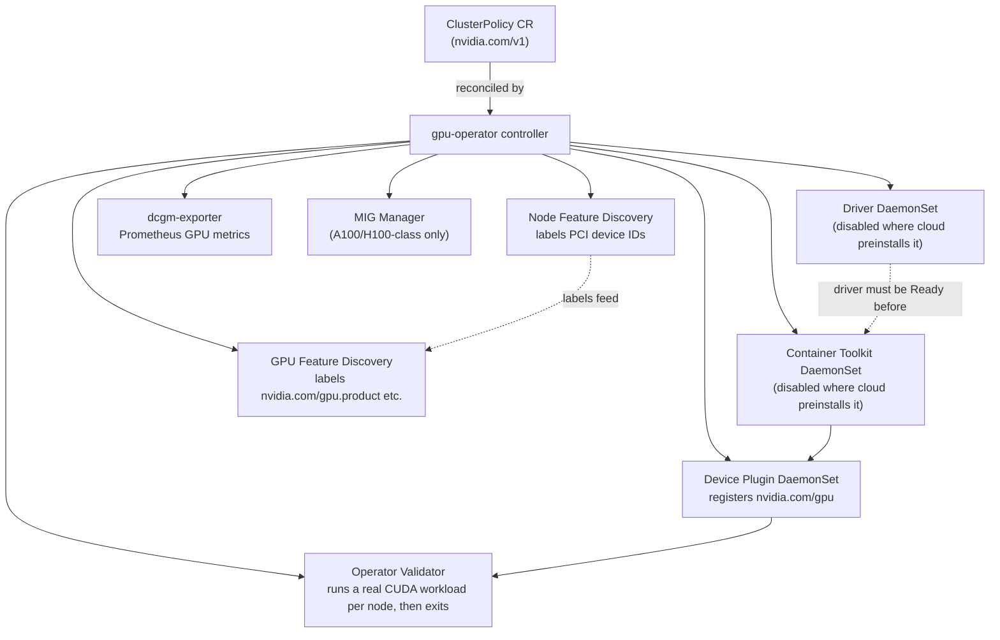

# 02 · NVIDIA GPU Operator

> One Helm chart, cross-cloud: driver, container toolkit, device plugin, DCGM, GPU Feature Discovery
> and Node Feature Discovery, managed as a single `ClusterPolicy` custom resource — and when that's
> worth it over the per-cloud driver paths chapter 01 used.

## Before you start

Needs from [`01-gpu-nodes-and-scheduling`](../01-gpu-nodes-and-scheduling): a spot GPU node pool up
on your cloud, and its driver disabled/skipped at create time for the cloud you're using (GKE:
`GPU_DRIVER_VERSION=disabled`, AKS: `GPU_DRIVER=none` — EKS keeps its baked-in AMI driver as-is). If
chapter 01's standalone `nvdp` device plugin is running on the cluster, uninstall it first (Step 4
below) — two device plugins double-register GPUs. Read section 3.3 before you install anything: which
components you disable is different per cloud.

## 1. Why this matters

Chapter 01 used three different driver installers (GKE's DaemonSet, EKS's baked-in AMI, AKS's
AKSGPUDriver) and manually installed a pinned device plugin on two of them. That's fine for one
cluster. It stops being fine once you also want DCGM GPU metrics, node labels describing exactly
which GPU model/memory/CUDA version each node has (GPU Feature Discovery), MIG partitioning, and the
same upgrade process on every cloud. The **NVIDIA GPU Operator** packages all of that as one
Kubernetes-native install: a `ClusterPolicy` CR describes what you want, an operator reconciles it
into DaemonSets and Deployments, and `kubectl get clusterpolicy` tells you if it's healthy.

The trade-off: it's more moving parts for a single CUDA job, and on GKE/EKS you're often disabling
half of it because the cloud already did that part. Know when to reach for it.

## 2. Learning objectives and time plan (~3 h)

By the end you can:

1. Name every component the GPU Operator manages and what each one does (driver, toolkit, device
   plugin, GFD, NFD, DCGM, validator).
2. Explain, per cloud, which components you disable and why (chapter 01's driver situation, again).
3. Read and edit a `ClusterPolicy` CR and a `values-<cloud>.yaml` Helm values file.
4. Install the Operator on one cloud, validate it came up healthy, and read GFD's node labels.
5. State the upgrade strategy and what to check before bumping `${GPU_OPERATOR_VERSION}`.
6. Decide, for a given cluster, whether the Operator or chapter 01's manual path is the better fit.

| Time | Activity |
|---|---|
| 0:00–0:30 | Read section 3 (concepts + component table). Read `common/clusterpolicy.yaml` |
| 0:30–1:00 | Decide: Operator vs. cloud-managed driver, for your cloud (section 3.3) |
| 1:00–1:45 | `install.sh` on your cloud, watch operands come up |
| 1:45–2:15 | `common/validate.sh`, read GFD labels, rerun chapter 01's CUDA job against the Operator-managed nodes |
| 2:15–2:45 | Break it: disable a component that's actually needed, watch `ClusterPolicy` status; read the upgrade-strategy section |
| 2:45–3:00 | Checkpoint questions, cleanup |

## 3. Concepts

### 3.1 What the Operator actually deploys



| Component | What it does | On by default |
|---|---|---|
| **Driver** | Installs/manages the NVIDIA kernel driver + CUDA user-mode libs via a DaemonSet | Yes |
| **Container Toolkit** | `nvidia-container-toolkit` + CDI, makes the runtime inject GPUs into containers | Yes |
| **Device Plugin** | Registers `nvidia.com/gpu` with the kubelet (same role as chapter 01's `nvdp` chart) | Yes |
| **GFD** (GPU Feature Discovery) | Labels nodes `nvidia.com/gpu.product`, `.memory`, `.count`, `nvidia.com/cuda.driver.major`, etc. | Yes |
| **NFD** (Node Feature Discovery) | Labels nodes by PCI device (`feature.node.kubernetes.io/pci-10de.present`) so GFD/toolkit selectors work | Yes (bundled subchart) |
| **DCGM / dcgm-exporter** | GPU telemetry (utilization, memory, ECC errors, thermals) as Prometheus metrics — chapter 04 builds dashboards on this | dcgm-exporter yes, standalone `dcgm` hostengine no (exporter embeds its own) |
| **MIG Manager** | Applies/reconfigures Multi-Instance GPU partitions on A100/H100-class GPUs | Yes (no-op without MIG-capable GPUs) |
| **Validator** | Runs a real workload on each component (driver, toolkit, CUDA, plugin) as it comes up, then exits `Completed` | Always runs |

### 3.2 The `ClusterPolicy` custom resource

`ClusterPolicy` (`apiVersion: nvidia.com/v1`, cluster-scoped, singleton named `cluster-policy`) is
the one CR you edit; the operator's controller reconciles every component in the table above from
its `spec`. In the normal install path (this chapter's `install.sh`), you don't write the CR by
hand — Helm renders it from your `values-<cloud>.yaml`, the same file that configures the chart. See
`common/clusterpolicy.yaml` for a fully-commented copy of what the chart renders, verified against
the `${GPU_OPERATOR_VERSION}` chart's actual `helm template` output and CRD schema — useful for
reading/diffing without a cluster (`kubectl kustomize gke`, etc.), not for applying directly.

### 3.3 Operator vs. cloud-managed driver — decide per cloud

| Cloud | Cloud's own driver path (chapter 01) | Use the Operator when... |
|---|---|---|
| **GKE** | GKE-managed DaemonSet on COS/Ubuntu, chosen at node-pool create time | You want DCGM metrics, GFD labels, or MIG management in the same way as your other clouds. Driver/toolkit/device-plugin **stay disabled** in the Operator (COS can't take a foreign driver) — the Operator only adds what GKE doesn't give you. |
| **EKS** | Baked into the AL2023 NVIDIA-accelerated AMI at boot | Same as GKE: driver/toolkit **stay disabled**, Operator adds device plugin + DCGM + GFD + MIG with one chart instead of a separate `nvdp` Helm release. |
| **AKS** | AKSGPUDriver, default on NVIDIA VM sizes | This is the one cloud where the Operator commonly runs the **full stack**: create the node pool with `--gpu-driver none` (Azure CLI ≥ 2.72.2) so AKS skips its own driver, then let the Operator install driver + toolkit + device plugin + DCGM + GFD together. |
| Any cloud, no preinstalled driver (e.g. a generic Ubuntu node group, on-prem, bare metal) | N/A | Always — the Operator is the only piece managing the driver at all. |

Rule of thumb from the brief: reach for the Operator when you need the **full stack** (DCGM + GFD +
MIG management) uniformly across clouds, or when the node image has no vendor driver preinstalled.
If all you need is `nvidia.com/gpu` to show up, chapter 01's per-cloud path is simpler and has fewer
moving parts to reconcile.

## 4. Lab

```bash
source env.sh && source versions.env   # GPU_OPERATOR_VERSION=v26.7.0, DEVICE_PLUGIN_VERSION, DCGM_EXPORTER_CHART_VERSION
```

### Step 1: Remove chapter 01's standalone device plugin (any cloud, if present)

What you're about to do and why: the Operator installs its own device plugin; leaving chapter 01's
`nvdp` release running alongside it double-registers `nvidia.com/gpu`.
```bash
helm -n nvidia-device-plugin uninstall nvdp || true
```
How to tell this worked: `helm -n nvidia-device-plugin list` returns no `nvdp` release (or the
namespace never existed — that's fine too).

### Step 2: Install the Operator on your cloud

<details><summary>GKE</summary>

```bash
GPU_DRIVER_VERSION=disabled ./01-gpu-nodes-and-scheduling/gke/create-gpu-nodepool.sh   # skip GKE's driver
./02-nvidia-gpu-operator/gke/install.sh
```
`values-gke.yaml` disables `driver`, `toolkit` and `devicePlugin` (COS already has all three) and
keeps GFD, DCGM, NFD, MIG manager, node-status-exporter on — the Operator only adds what GKE doesn't.
How to tell this worked: `install.sh` exits 0 (it runs `--wait --timeout 15m`, so a hang means a
DaemonSet couldn't schedule) and prints `clusterpolicy cluster-policy` state `ready`.

</details>

<details><summary>EKS</summary>

```bash
./01-gpu-nodes-and-scheduling/eks/create-gpu-nodegroup.sh   # AL2023 NVIDIA AMI already has driver+toolkit
./02-nvidia-gpu-operator/eks/install.sh
```
`values-eks.yaml` disables `driver` and `toolkit` (preinstalled on the AMI) but leaves `devicePlugin`
**enabled** — the Operator's plugin replaces chapter 01's standalone `nvdp` release. How to tell this
worked: same as GKE — `install.sh` completes and `ClusterPolicy` reports `ready`.

</details>

<details><summary>AKS</summary>

```bash
GPU_DRIVER=none ./01-gpu-nodes-and-scheduling/aks/create-gpu-nodepool.sh   # skip AKS's own driver
./02-nvidia-gpu-operator/aks/install.sh
```
`values-aks.yaml` leaves `driver`, `toolkit`, `devicePlugin` **all enabled** (chart defaults) — the
full stack, because we told AKS not to install its own driver. It also adds a toleration for AKS's
auto-added spot taint (`kubernetes.azure.com/scalesetpriority=spot`) so every Operator DaemonSet can
actually land on the `gpuspot` pool. How to tell this worked: `install.sh` completes and
`ClusterPolicy` reports `ready` — if it hangs, check `kubectl -n gpu-operator get pods` for a driver
DaemonSet stuck `Init` (the slowest stage on AKS, see section 5).

</details>

Expected output (any cloud):
```bash
kubectl -n gpu-operator get pods
```
```
NAME                                                          READY   STATUS      RESTARTS
gpu-feature-discovery-xxxxx                                   1/1     Running     0
gpu-operator-xxxxxxxxxx-xxxxx                                 1/1     Running     0
nvidia-dcgm-exporter-xxxxx                                     1/1     Running     0
nvidia-device-plugin-daemonset-xxxxx                           1/1     Running     0
nvidia-operator-validator-xxxxx                                1/1     Running     0
node-feature-discovery-worker-xxxxx                            1/1     Running     0
...
```
```bash
kubectl get clusterpolicy cluster-policy -o jsonpath='{.status.state}'
```
```
ready
```

### Step 3: Validate

What you're about to do: confirm every operand is healthy and GFD's labels landed on the GPU node,
then re-run chapter 01's CUDA smoke test against the same node with the Operator now doing the work.
```bash
./02-nvidia-gpu-operator/common/validate.sh
```
Expected output — GFD labels on the GPU node:
```
NAME              GPU-PRODUCT            GPU-MEMORY   GPU-COUNT
gke-...-spot-gpu   NVIDIA-L4              23034MiB     1
```
How to tell this worked: every pod listed by `validate.sh` is `Running` (validators `Completed`), and
the GFD columns are non-empty for your GPU node. Re-run chapter 01's smoke test against the
Operator-managed node — same manifests, same result, different plumbing underneath:
```bash
kubectl apply -k 01-gpu-nodes-and-scheduling/<cloud>
kubectl -n ch01-gpu logs job/cuda-vectoradd
```
How to tell this worked: the job reaches `Completed` and its log shows the vector-add result, exactly
like chapter 01 — proving the Operator's driver/toolkit/plugin chain is a drop-in replacement.

### Step 4: cpu-lab (what doesn't carry over)

**There is no meaningful GPU-Operator lab on CPU-only nodes.** The Operator's entire purpose is
installing and reconciling a real driver, container toolkit and DCGM stack against physical GPU
hardware — none of that exists without a GPU node, and unlike chapter 00/01's fake-`nvidia.com/gpu`
trick, faking node status doesn't get you anything: the Operator's own components (driver DaemonSet,
toolkit, validator) would still try to talk to real hardware and fail, which teaches you nothing
useful about the Operator itself.

What you *can* do without a cluster, cloud account, or GPU — all read-only/local:
```bash
./02-nvidia-gpu-operator/cpu-lab/validate-dry-run.sh
```
This runs `helm template` for each cloud's `values-<cloud>.yaml` against the pinned chart (renders
the `ClusterPolicy` the real install would create, entirely client-side) and `kubectl kustomize` on
every overlay in this chapter, to confirm the CR schema and our per-cloud toggles are self-consistent
before you ever touch a real cluster. Use this to review the diffs between `values-gke.yaml`,
`values-eks.yaml` and `values-aks.yaml` — the differences you're reading right now are the whole
point of section 3.3.

## 5. Spot considerations

- **Driver DaemonSet + spot preemption is the riskiest combination in this chapter.** On AKS (the
  full-stack cloud here), a spot reclaim mid-driver-install can leave a node stuck initializing. The
  Operator's driver DaemonSet retries, but a node that flaps between "provisioning" and "reclaimed"
  before the driver ever finishes loading never becomes `Ready` for GPU workloads — budget extra time
  versus chapter 01's baked-in-AMI (EKS) or preinstalled (GKE) drivers, which don't have this problem.
- **Every Operator DaemonSet needs the spot taint toleration**, not just your workload — same lesson
  as chapter 01, now for `driver`, `toolkit`, `devicePlugin`, `gfd`, `dcgm-exporter` DaemonSets all at
  once. `daemonsets.tolerations` in each `values-<cloud>.yaml` is the one place this is set centrally
  (versus per-manifest in chapter 01).
- **Validator pods re-run on every node (re)join.** A spot node that gets reclaimed and replaced pays
  the full driver-install + validator cost again on the replacement node — there's no way to skip
  re-validation for a "new" node, by design.

## 6. Troubleshooting

| Symptom | Cause | Fix |
|---|---|---|
| `ClusterPolicy` status stuck `notReady` | One operand's DaemonSet/Deployment not yet `Ready`, or a validator pod failing | `kubectl -n gpu-operator get pods`; `kubectl -n gpu-operator describe pod <failing-one>` |
| `nvidia-driver-daemonset` `CrashLoopBackOff` on GKE/EKS | `driver.enabled` wasn't set to `false` for a cloud that already installs its own driver — two drivers fight over the kernel module | Set `driver.enabled: false` in that cloud's values (already done in `values-gke.yaml`/`values-eks.yaml`); reinstall |
| `nvidia-container-toolkit-daemonset` fails on GKE COS | Toolkit tries to write outside COS's writable path | Keep `toolkit.enabled: false` on GKE (COS already has the toolkit at `/home/kubernetes/bin/nvidia`) |
| Two device plugins registering the same GPU (`nvidia.com/gpu` count wrong, flapping) | Chapter 01's standalone `nvdp` Helm release still installed alongside the Operator's | `helm -n nvidia-device-plugin uninstall nvdp` before installing this chapter |
| AKS: driver DaemonSet never starts | Node pool was created with the default `--gpu-driver Install` (AKS's own driver), which conflicts with the Operator's | Recreate the pool with `GPU_DRIVER=none` (needs az CLI ≥ 2.72.2), or set `driver.enabled: false` and rely on AKS's driver like GKE/EKS |
| `nvidia-operator-validator` pod stuck `Init` | Waiting on an earlier stage (driver → toolkit → device plugin → CUDA) that hasn't finished | Check pods in dependency order; a stuck driver blocks everything after it |
| GFD labels missing | GFD or NFD pod not scheduled (taint/toleration mismatch) or still starting | `kubectl -n gpu-operator get pods -l app=gpu-feature-discovery`; check `daemonsets.tolerations` covers this cloud's taints |
| `helm upgrade --install` hangs past `--timeout` | A DaemonSet can't schedule anywhere (wrong node selector/taint) so it never reports `Ready` | `kubectl -n gpu-operator get ds`; check `desired` vs `ready`; look for `Pending` pods and their scheduling events |

## 7. Cleanup and cost notes

```bash
./02-nvidia-gpu-operator/gke/cleanup.sh
./02-nvidia-gpu-operator/eks/cleanup.sh
./02-nvidia-gpu-operator/aks/cleanup.sh
```
Each removes the Helm release and the `ClusterPolicy` CR, but deliberately leaves the chart's CRDs
installed (`helm uninstall` behavior) and does **not** touch the GPU node pool — use chapter 01's
`scale-gpu-pool.sh`/`cleanup.sh` (or `00-prerequisites-and-cluster-setup`) to stop paying for nodes.
- The Operator's own pods (controller, NFD, GFD, dcgm-exporter, validators) are small and run on
  cheap CPU nodes — they add negligible cost. The GPU node itself is still the expensive part; the
  same spot-pricing guidance from chapters 00–01 applies unchanged.
- If you switch a cluster from chapter 01's manual device plugin to this chapter's Operator (or back),
  clean up the one you're abandoning — leftover DaemonSets on the GPU node waste a pod slot and can
  cause the double-registration issue in the troubleshooting table.

## 8. Checkpoint questions

<details>
<summary>1. Name the seven components the GPU Operator can manage, and which two are always disabled on GKE and EKS in this chapter's values files.</summary>

Driver, Container Toolkit, Device Plugin, GPU Feature Discovery (GFD), Node Feature Discovery (NFD),
DCGM/dcgm-exporter, MIG Manager (plus the Validator, which always runs). On GKE and EKS,
**driver** and **toolkit** stay disabled because the cloud's own node image already provides them.
</details>

<details>
<summary>2. Why does the AKS values file enable <em>everything</em>, while GKE and EKS disable driver/toolkit?</summary>

Because the AKS GPU node pool was created with `--gpu-driver none`, explicitly telling AKS not to
install its own driver — so nothing else on the node provides driver/toolkit/plugin, and the Operator
has to run the full stack. GKE (COS) and EKS (AL2023 NVIDIA AMI) always have a driver+toolkit from
the node image itself, so the Operator would conflict with it if left enabled.
</details>

<details>
<summary>3. What is <code>ClusterPolicy</code>, and how do you normally create/change one in this chapter's lab?</summary>

A cluster-scoped custom resource (`nvidia.com/v1`, singleton name `cluster-policy`) that the
operator's controller reconciles into every component's DaemonSet/Deployment. You don't hand-edit it
in the normal flow — Helm renders it from `values-<cloud>.yaml` on `helm upgrade --install`. The
`common/clusterpolicy.yaml` kustomize copy is for offline reading/diffing only.
</details>

<details>
<summary>4. A node just joined a spot GPU pool that was empty a minute ago. Why does it take longer to become useful here than it did in chapter 01's manual device-plugin install?</summary>

The Operator's driver DaemonSet (where enabled, e.g. AKS) has to finish installing the kernel driver
before the toolkit, device plugin and validator can even start — each stage depends on the previous
one finishing. Chapter 01's manual path either had the driver already baked into the node image (EKS)
or installed by the cloud in parallel with cluster bring-up (GKE/AKS default), and only added the
plugin, a single fast step.
</details>

<details>
<summary>5. What does the Operator's own validator do, and why does it matter for debugging?</summary>

It runs a real small workload against each enabled component (driver, toolkit, CUDA, device plugin)
as that component comes up, and only exits `Completed` if it actually worked — not just "the pod
started." A stuck or `CrashLoopBackOff` validator pod tells you exactly which stage of the chain is
broken, faster than guessing from a generic `Pending` GPU workload pod.
</details>

<details>
<summary>6. Why must chapter 01's standalone device plugin be uninstalled before installing the GPU Operator on the same nodes?</summary>

Two device plugins both register `nvidia.com/gpu` with the kubelet independently; the count becomes
wrong or flaps as they race, and `Allocate` calls can go to whichever plugin's DaemonSet claimed the
socket path, so pods might get device IDs from either registration inconsistently. Only one device
plugin may own the resource per node.
</details>

<details>
<summary>7. In the decision table (3.3), when would you pick chapter 01's manual per-cloud approach over the GPU Operator, even though it means more per-cloud scripts?</summary>

When you just need `nvidia.com/gpu` to work and don't need DCGM metrics, GFD labels, or MIG
management — the Operator adds reconciliation overhead (an extra controller, more DaemonSets, its own
CRDs and upgrade lifecycle) for capability you're not using. It's most worth it once you want the same
observability/MIG story across GKE, EKS and AKS uniformly.
</details>

<details>
<summary>8. What should you check before bumping <code>GPU_OPERATOR_VERSION</code> to a new release?</summary>

Read the chart's release notes for driver-version bumps (a new default driver version ships with
almost every Operator release) and any minimum-toolchain changes (e.g. this release raised the
minimum supported containerd version) that could break your cluster's container runtime; then test
with `helm template`/`cpu-lab/validate-dry-run.sh` before touching a real cluster, and roll out to a
single node pool first — the Operator restarts driver pods in place on an upgrade, which briefly
interrupts GPU workloads on that node.
</details>

## 9. Further reading and versions tested

- [NVIDIA GPU Operator docs](https://docs.nvidia.com/datacenter/cloud-native/gpu-operator/latest/index.html), [ClusterPolicy CRD reference](https://docs.nvidia.com/datacenter/cloud-native/gpu-operator/latest/gpu-operator-helm-chart.html), [Release notes](https://docs.nvidia.com/datacenter/cloud-native/gpu-operator/latest/release-notes.html), [Upgrading the Operator](https://docs.nvidia.com/datacenter/cloud-native/gpu-operator/latest/upgrade.html)
- [NVIDIA GPU Operator with Google GKE](https://docs.nvidia.com/datacenter/cloud-native/gpu-operator/latest/google-gke.html), [NVIDIA GPU Operator with Amazon EKS](https://docs.nvidia.com/datacenter/cloud-native/gpu-operator/latest/amazon-eks.html)
- AKS: [Use NVIDIA GPU Operator on AKS](https://learn.microsoft.com/azure/aks/nvidia-gpu-operator), [AKS-managed GPU node pools](https://learn.microsoft.com/azure/aks/aks-managed-gpu-nodes) (the lighter-weight alternative Microsoft points to if you don't need the full Operator)
- Previous: [`01-gpu-nodes-and-scheduling`](../01-gpu-nodes-and-scheduling) (the manual per-cloud path this chapter automates). Next: [`03-gpu-sharing-and-dra`](../03-gpu-sharing-and-dra) (time-slicing, MPS, MIG in depth, and Dynamic Resource Allocation — MIG Manager here is the prerequisite plumbing)

**Versions tested** (2026-09-16): Kubernetes 1.35, `GPU_OPERATOR_VERSION=v26.7.0` (`helm/nvidia/gpu-operator`,
verified current/latest via `helm search repo nvidia/gpu-operator --versions` and chart release notes),
chart-pinned defaults observed via `helm show values`/`helm template`: driver `595.91.07`,
toolkit `v1.20.0`, `DEVICE_PLUGIN_VERSION=v0.20.0` (matches `versions.env`), gfd `v0.20.0`,
dcgm-exporter `4.6.0-4.8.3-distroless` (DCGM 4.6.0 + exporter `DCGM_EXPORTER_CHART_VERSION=4.8.3`,
matches `versions.env`), migManager `v0.15.0`.
