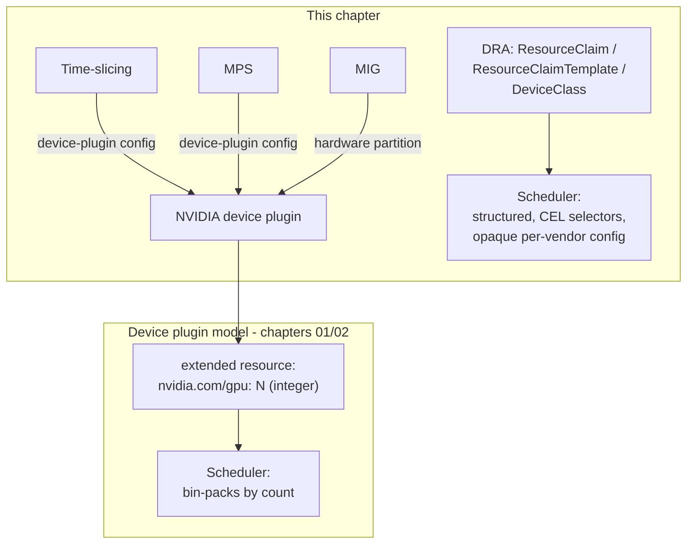

# 03 · GPU Sharing and Dynamic Resource Allocation

> Time-slicing, MPS and MIG on EKS, and Dynamic Resource Allocation (`resource.k8s.io/v1`, GA in
> Kubernetes 1.35) as the newer, more expressive way to hand out GPUs.

**If you're new to Kubernetes and to GPUs:** everything in this chapter answers one question —
*"a physical GPU costs a lot, so how do I let more than one thing use it at once, and what could
go wrong?"* Read section 1 and 3 slowly before touching a command; the labs will make a lot more
sense once you know what a "device plugin", a "claim", and "isolation" actually mean.

## 0. Before you start

Needs from [`01-gpu-nodes-and-scheduling`](../01-gpu-nodes-and-scheduling) or
[`02-nvidia-gpu-operator`](../02-nvidia-gpu-operator): a device plugin (either chapter's) already
running on the node groups you point the time-slicing/MPS configs at — this chapter reconfigures the
plugin, it doesn't install one fresh. DRA (Step 3) is the exception: it installs its own driver on a
dedicated node group and needs no prior device plugin. GPU quota from chapter 00 applies; MIG (Step 4)
additionally needs A100/H100/H200 quota, which is rarer and slower to get approved — request it early
if you plan to do the hands-on MIG lab.

**What's a "device plugin"?** If you skipped chapters 01/02: Kubernetes has no built-in idea of what
a GPU is. A *device plugin* is a small program (a DaemonSet, one pod per node) that runs on each GPU
node, talks to the kubelet over a local gRPC socket, and tells it "this node has N of a thing called
`nvidia.com/gpu`". That's the only thing that lets you write `resources.limits: {nvidia.com/gpu: 1}`
in a pod spec — without a device plugin registered, that resource name simply doesn't exist and pods
requesting it stay `Pending` forever. Chapters 01/02 installed one (NVIDIA's own, or the one bundled
in the GPU Operator). This chapter doesn't replace it — it *reconfigures* it so one physical GPU can
be advertised as more than "1".

## 1. Why this matters

Chapter 01 gave every pod its own whole GPU (`nvidia.com/gpu: 1`). That's simple and safe, but
most inference and dev workloads use a fraction of a GPU's compute or memory, so a whole-GPU-per-pod
policy leaves expensive hardware idle. This chapter is about **safely putting more than one
workload on one physical GPU**, and about DRA, the newer scheduling API built to express things
the device-plugin model (extended resources) structurally cannot: "any GPU with ≥20Gi memory",
richer per-claim config, and claims shared by name across pods.

**Why this is worth doing at all — and why it's risky.** A single datacenter GPU (an L4, A100,
H100) is expensive and, once claimed by a pod, sits there whether the workload is using 5% of its
compute or 100%. Most real workloads — a small inference server, a Jupyter notebook, a batch job
that spikes then idles — don't need a whole GPU all the time. Sharing lets you run several of
these on one card and pay for one piece of hardware instead of four. The risk is exactly what
you'd expect from making multiple tenants share one resource: depending on *how* you share it, one
noisy or crashing workload can slow down, OOM, or take down its neighbors. The four mechanisms
below (time-slicing, MPS, MIG, DRA) are different answers to "how much do we let workloads step on
each other, and what do we get in exchange." None of them is strictly "the best" — they trade
isolation, hardware requirements, and flexibility against each other, and picking the right one for
a workload is the actual skill this chapter teaches.

- **Time-slicing** is oversubscription with no isolation: N pods share one GPU's compute via
  fast context switching (like a CPU scheduler swapping processes in and out — except there's no
  memory protection between them). No memory limit per pod — one pod can OOM the others.
  Think of it as four people using the same desk in shifts that are too short to notice: fast, free,
  but nothing stops one of them from leaving the desk a mess for the next.
- **MPS** (Multi-Process Service) shares one GPU through a single CUDA context with configurable
  compute/memory quotas per client — better isolation, still one fault domain (an MPS daemon
  crash takes down every client). This is closer to four people at the same desk, but now each has
  their own drawer with a lock (a memory/compute quota) — better, but if the desk itself breaks
  (the MPS daemon crashes), everyone loses their spot at once.
- **MIG** (Multi-Instance GPU, A100/H100/H200-class only) physically partitions the GPU into
  independent instances with their own SM, memory and fault isolation — the strongest isolation,
  but fixed at node-creation time and unavailable on cheap GPUs (L4, T4). This is four separate
  desks that happen to be built into the same piece of furniture — genuinely independent, but you
  had to decide how many desks and how big each one is *before* anyone sat down, and only certain
  (expensive) GPU models can be cut up this way.
- **DRA** doesn't compete with the three above — it's a different scheduling API. The NVIDIA DRA
  driver can *express* time-slicing and MPS as claim config, plus things the extended-resource
  model can't: CEL attribute selectors, and one `ResourceClaim` referenced by name from several
  pods. DRA is not "a fourth sharing strategy" — it's a new, more expressive *language* for asking
  Kubernetes for a device, and that language happens to be able to describe time-slicing or MPS
  as configuration instead of a hardcoded ConfigMap key.



**Reading the diagram, for a first-timer.** There are two entirely separate boxes here because
there are two entirely separate ways Kubernetes learns "a GPU exists and someone can have it":

- **Top box (chapters 01/02, the model you already know):** the device plugin counts GPUs and
  tells the kubelet "this node has `N` of `nvidia.com/gpu`". The scheduler's job is trivial —
  it just bin-packs pods by that integer count, the same way it does for CPU or memory requests.
  Time-slicing, MPS, and MIG all live *inside* this box: they don't change what the scheduler sees
  (still a plain integer), they change what one unit of `nvidia.com/gpu` *means underneath* — one
  real GPU sliced 4 ways, or 4 MPS clients, or 7 MIG instances. That's why all three arrows from
  TS/MPS/MIG point at the same device plugin box: they're all just different *config* fed to the
  same plugin, not different pieces of infrastructure.
- **Bottom box (DRA):** instead of a plain count, a pod asks for a `ResourceClaim` — a structured
  object that can say things like "any device of this class with at least 20Gi memory" (a CEL
  expression) or carry opaque, driver-specific configuration. The scheduler now has to actually
  reason about claims and devices instead of just counting, which is why it needs a separate,
  richer allocation path (`SCHED2`) instead of reusing the plain bin-packer (`SCHED1`).

The two boxes don't talk to each other, and — the single most important operational rule in this
chapter, repeated below because it causes real outages — **they must never both manage the same
physical GPU on the same node.** Both believe they own the GPU's inventory; if both are active,
you can get the same GPU double-allocated to two pods, or the scheduler's bookkeeping silently
drifting from what's actually free on the card.

## 2. Learning objectives and time plan (~3 h)

By the end you can:

1. Explain the isolation/perf trade-offs of time-slicing vs MPS vs MIG and pick one for a workload.
2. Configure GPU sharing on EKS the portable way: the NVIDIA device plugin's `sharing:` config,
   delivered through the GPU Operator.
3. Read and write DRA `DeviceClass`, `ResourceClaim`, `ResourceClaimTemplate`, and a CEL device
   selector.
4. Explain why a DRA driver and a device plugin must never manage the same node.
5. Install the NVIDIA DRA driver on a dedicated EKS node group and confirm it publishes
   `ResourceSlice`s for real GPUs.

| Time      | Activity                                                                             |
| --------- | ------------------------------------------------------------------------------------ |
| 0:00–0:35 | Read section 3 (concepts). Skim `eks/device-plugin-config.yaml` and `eks/dra/*.yaml` |
| 0:35–1:00 | Time-slicing lab on EKS                                                              |
| 1:00–1:20 | MPS lab                                                                              |
| 1:20–1:55 | DRA lab (single claim, shared claim, CEL selector, opaque sharing config)            |
| 1:55–2:25 | MIG (read-through if you don't have A100/H100 quota; hands-on if you do)             |
| 2:25–2:40 | Checkpoint questions, cleanup                                                        |

## 3. Concepts

### 3.1 Time-slicing vs MPS vs MIG vs DRA

|              | Isolation                                                           | Memory limit per client | GPUs it works on        | Configured via                                                                            |
| ------------ | ------------------------------------------------------------------- | ----------------------- | ----------------------- | ----------------------------------------------------------------------------------------- |
| Time-slicing | None (context-switch only)                                          | No                      | Any                     | Device plugin `sharing.timeSlicing` config                                                |
| MPS          | Process-level, shared fault domain                                  | Yes (per-client quota)  | Any (full GPU, not MIG) | Device plugin `sharing.mps` config                                                        |
| MIG          | Hardware (own SM + memory)                                          | Yes (fixed by profile)  | A100 / H100 / H200 only | MIG Manager (GPU Operator) partitions after node join, node label `nvidia.com/mig.config` |
| DRA          | Depends on driver's claim config (can express time-slicing/MPS/MIG) | Depends on config       | Any, driver-defined     | `ResourceClaim`/`ResourceClaimTemplate` + `DeviceClass`, GA API                           |

**"Isolation" means:** can a bug, crash, or resource hog in one pod's use of the GPU affect
another pod sharing the same card? "None" means yes, freely — a memory leak in one pod's process
can starve or crash everyone else's. "Hardware" means no — the physical silicon is partitioned, so
one instance crashing or filling its memory has zero effect on the others. This is the single axis
that should drive your choice: multi-tenant production inference wants MIG or careful MPS quotas;
your own dev/test pods sharing a GPU with each other are usually fine with time-slicing.

### 3.2 GPU sharing on EKS

EKS has no native node-group flag for GPU sharing (unlike GKE's `gpu-sharing-strategy` on
`gcloud container node-pools create`), so this chapter leans on the portable mechanism: the
NVIDIA device plugin's `sharing:` block, delivered as a `nvidia.com/device-plugin.config`
ConfigMap key and selected per node with a label (`eks/device-plugin-config.yaml`).
The GPU Operator's config-manager sidecar watches that label and restarts the plugin whenever it
changes — no manual DaemonSet restart needed.

**What's actually in that ConfigMap, concretely.** Open
`eks/device-plugin-config.yaml`: it's one ConfigMap with several *keys*, each key
holding a small YAML document the device plugin understands (`time-sliced-4`, `mps-4`,
`mig-single`, `mig-mixed`, and a no-op `any`). A node doesn't get all of these at once — you pick
*one* key per node with the label `nvidia.com/device-plugin.config: <key>`, and the plugin running
on that node reads only its own key. That's the whole mechanism: one ConfigMap holding several
named "profiles", one label per node choosing which profile applies. Relabeling a node
(`kubectl label node ... --overwrite`) is how you switch a node from, say, time-slicing to MPS
without recreating it — the GPU Operator's config-manager sidecar notices the label change and
restarts the plugin pod for you.

|     | Time-slicing                                                          | MPS                                | MIG                                                                                             | Resource name (single strategy) | Resource name (mixed strategy) |
| --- | --------------------------------------------------------------------- | ---------------------------------- | ----------------------------------------------------------------------------------------------- | ------------------------------- | ------------------------------ |
| EKS | Device plugin `sharing.timeSlicing` config (GPU Operator, chapter 02) | Device plugin `sharing.mps` config | MIG Manager (GPU Operator) partitions after node join, label `nvidia.com/mig.config=all-1g.5gb` | `nvidia.com/gpu`                | `nvidia.com/mig-<profile>`     |

### 3.3 DRA in one paragraph

DRA replaces "count of an opaque integer resource" with a **claim**: a pod (or several pods)
references a `ResourceClaim` (or gets one generated per-pod from a `ResourceClaimTemplate`), the
claim's `spec.devices.requests` says what it needs (`deviceClassName`, optionally a CEL
`selectors` expression over device attributes/capacity published in `ResourceSlice` objects by
the driver), and the scheduler allocates matching devices at bind time. A `DeviceClass`
(`gpu.nvidia.com` here) is a cluster-scoped, admin-defined "kind of device" claims can request.
Config attached to a claim (`config[].opaque`) is passed through to the driver verbatim — this is
how the NVIDIA DRA driver implements time-slicing/MPS as claim-time config instead of node-time
config. See `eks/dra/*.yaml` for four patterns: exclusive claim, claim shared by name across
pods, CEL attribute selector, and opaque time-slicing config across two containers in one pod.

**Unpacking those four DRA objects one at a time, since they're new vocabulary even if you know
Kubernetes well:**

- **`DeviceClass`** — a cluster-scoped object an *admin* creates (here, the NVIDIA DRA driver's
  Helm chart creates it for you) that says "here is a category of device — e.g. `gpu.nvidia.com`
  — that claims are allowed to ask for." It's the DRA equivalent of a `StorageClass`: you don't
  create one per workload, you point workloads at an existing one.
- **`ResourceClaim`** — a namespaced object that says "I need one device matching this
  `DeviceClass` (optionally matching this selector)." It's a *request for allocation*, not the
  device itself. One `ResourceClaim` gets resolved to one specific physical device once the
  scheduler places a pod that uses it. Look at `eks/dra/02-shared-claim.yaml`: it's a single
  `ResourceClaim` named `shared-gpu` that a `Deployment` with 2 replicas both reference by name —
  because it's one claim, not a template, both pods end up bound to the *same* allocated GPU.
- **`ResourceClaimTemplate`** — a stamp for `ResourceClaim`s: instead of you writing one
  `ResourceClaim` per pod, you write a template once and reference it from a pod spec's
  `resourceClaims`, and Kubernetes creates (and later garbage-collects) a fresh, private
  `ResourceClaim` for every pod that uses it. `eks/dra/01-single-gpu.yaml` uses this pattern —
  every pod created from that template gets its *own* exclusive claim, the DRA equivalent of
  `resources.limits: {nvidia.com/gpu: 1}`. The difference between this and the shared-claim example
  above is entirely "did you reference a `ResourceClaimTemplateName` (each pod gets its own) or a
  `ResourceClaimName` (every pod referencing it shares one)" — same YAML shape, opposite sharing
  behavior, easy to get backwards.
- **`ResourceSlice`** — published by the *driver* (not something you write), one or more per node,
  advertising the actual devices present and their attributes/capacity (e.g. `memory: 24Gi`). This
  is what a CEL `selectors` expression is evaluated against — `kubectl get resourceslices -o yaml`
  is how you find out what attribute names and values are actually available to select on.

**A DRA driver and the device plugin must never run on the same node** — both would try to
account for and hand out the same physical GPU, and pods could get double-allocated or the
scheduler's view could silently desync from reality. This chapter's EKS node groups keep DRA on
its own node group, labeled `gpu-mode: dra` with `nvidia.com/gpu.deploy.device-plugin: "false"`
(`eks/nodegroups.yaml`) so the GPU Operator's device-plugin DaemonSet skips it.

## 4. Lab

```bash
cp env.sh.example env.sh && source env.sh && source versions.env   # if not already
```

Prerequisite: chapter 01 (device plugin) or chapter 02 (GPU Operator) already running on the
node groups you point sharing configs at — this chapter reconfigures the plugin, it doesn't
install it fresh, except for DRA which installs its own separate driver.

### Step 1: Time-slicing

What you're about to do: create the `gpu-share-spot` node group (labeled `time-sliced-4` by
default), point the GPU Operator's device plugin at the sharing ConfigMap, and confirm 4 replicas
land on one physical GPU node.

Create the node group. `--install-nvidia-plugin=false` because the GPU Operator (chapter 02) owns
the device plugin — a second static plugin would double-advertise GPUs. The `sed` step below fills
the cluster name/region placeholders into `eks/nodegroups.yaml` (this repo keeps that file
generic/reusable rather than hardcoding your account's values into it), then `eksctl create
nodegroup -f` reads the rendered file and creates only the `gpu-share-spot` group from it
(`--include`), leaving the other groups defined in the same file untouched:
```bash
: "${EKS_CLUSTER:?source env.sh}" "${AWS_REGION:?source env.sh}"
sed -e "s/__EKS_CLUSTER__/${EKS_CLUSTER}/" -e "s/__AWS_REGION__/${AWS_REGION}/" \
  03-gpu-sharing-and-dra/eks/nodegroups.yaml > 03-gpu-sharing-and-dra/eks/.nodegroups.rendered.yaml

eksctl create nodegroup -f 03-gpu-sharing-and-dra/eks/.nodegroups.rendered.yaml \
  --include gpu-share-spot \
  --install-nvidia-plugin=false
```

Point the GPU Operator's device plugin at the sharing ConfigMap (assumes the operator from
chapter 02 is installed as release `gpu-operator` in namespace `gpu-operator`). Applying the
ConfigMap just makes the sharing profiles available; the `helm upgrade` call is what actually
tells the device plugin's Helm-managed config *which* ConfigMap and key to read by default:
```bash
kubectl apply -f 03-gpu-sharing-and-dra/eks/device-plugin-config.yaml

helm upgrade gpu-operator nvidia/gpu-operator \
  --namespace gpu-operator \
  --version "${GPU_OPERATOR_VERSION}" \
  --reuse-values \
  --set devicePlugin.config.name=device-plugin-sharing \
  --set devicePlugin.config.default=any \
  --set mig.strategy=single

# The operator's config-manager sidecar watches the node label and restarts the plugin itself.
# Change a node's profile at any time:
#   kubectl label node <node> nvidia.com/device-plugin.config=mps-4 --overwrite
kubectl get nodes -l course-chapter=03 \
  -o custom-columns='NAME:.metadata.name,CONFIG:.metadata.labels.nvidia\.com/device-plugin\.config,SHARING:.metadata.labels.nvidia\.com/gpu\.sharing-strategy,GPU:.status.allocatable.nvidia\.com/gpu'
```
`--reuse-values` matters here: without it, this `helm upgrade` would reset every other value on
the existing GPU Operator release back to chart defaults, potentially undoing configuration from
chapter 02. `devicePlugin.config.default=any` sets the *cluster-wide fallback* profile (the
harmless no-op key from the ConfigMap) for any node that isn't explicitly labeled — so an
unlabeled GPU node never accidentally inherits a sharing profile meant for a different node.

Apply the demo and check the pods:
```bash
kubectl apply -f 03-gpu-sharing-and-dra/eks/namespace.yaml
kubectl apply -f 03-gpu-sharing-and-dra/eks/timeslicing/deployment.yaml
kubectl -n ch03-gpu-sharing get pods -o wide
kubectl -n ch03-gpu-sharing exec deploy/timeslice-demo -- nvidia-smi -L
```
Expected: 4 replicas of `timeslice-demo`, all `Running` on **one** physical GPU node.
```
NAME                              READY   STATUS    NODE
timeslice-demo-7c9d8-2x4mz        1/1     Running   ip-...-gpu-share-spot...
timeslice-demo-7c9d8-8kq2n        1/1     Running   ip-...-gpu-share-spot...
timeslice-demo-7c9d8-tl5vw        1/1     Running   ip-...-gpu-share-spot...
timeslice-demo-7c9d8-x9k2q        1/1     Running   ip-...-gpu-share-spot...
```
`nvidia-smi -L` in any pod shows the same GPU UUID from all four — confirm it with
`kubectl -n ch03-gpu-sharing get pods -o wide | grep timeslice` then `nvidia-smi` in two
different pods. Seeing the *same* UUID from four different pods is the actual proof that sharing
is working: it means the device plugin advertised one physical card as four allocatable units,
and the scheduler happily bin-packed all four pods onto it, believing it had four separate GPUs.

### Step 2: MPS

What you're about to do: create a GPU node group with MPS sharing enabled, point 4 pods at the same
physical GPU through a shared CUDA context, and confirm the plugin injects `CUDA_MPS_*` env vars —
proof each pod is going through MPS, not a private GPU.

`eks/nodegroups.yaml` ships `gpu-share-spot` labeled `time-sliced-4` by default. If Step 1 already
created it, reuse that same node group — just relabel it `mps-4`; the operator's config-manager
sidecar (already pointed at the `device-plugin-sharing` ConfigMap in Step 1) picks up the new label
and restarts the plugin on its own, no re-install needed. Relabeling instead of recreating the node
group is the whole point of putting the sharing strategy in a *node label* rather than baking it
into the node group definition — switching strategies costs one `kubectl label`, not a node replace:
```bash
: "${EKS_CLUSTER:?source env.sh}" "${AWS_REGION:?source env.sh}"

# Only if Step 1 was skipped: create the node group (same rendered file, different --include).
[ -f 03-gpu-sharing-and-dra/eks/.nodegroups.rendered.yaml ] || \
  sed -e "s/__EKS_CLUSTER__/${EKS_CLUSTER}/" -e "s/__AWS_REGION__/${AWS_REGION}/" \
    03-gpu-sharing-and-dra/eks/nodegroups.yaml > 03-gpu-sharing-and-dra/eks/.nodegroups.rendered.yaml
eksctl create nodegroup -f 03-gpu-sharing-and-dra/eks/.nodegroups.rendered.yaml \
  --include gpu-share-spot --install-nvidia-plugin=false   # no-op if it already exists

kubectl label node -l course-chapter=03,eks.amazonaws.com/nodegroup=gpu-share-spot \
  nvidia.com/device-plugin.config=mps-4 --overwrite
kubectl apply -f 03-gpu-sharing-and-dra/eks/namespace.yaml
kubectl apply -f 03-gpu-sharing-and-dra/eks/mps/deployment.yaml
kubectl -n ch03-gpu-sharing get pods -o wide
```
Expected output:
```
NAME                         READY   STATUS    NODE
mps-demo-7c9d8-2x4mz         1/1     Running   ip-...-gpu-share-spot...
mps-demo-7c9d8-8kq2n         1/1     Running   ip-...-gpu-share-spot...
mps-demo-7c9d8-tl5vw         1/1     Running   ip-...-gpu-share-spot...
mps-demo-7c9d8-x9k2q         1/1     Running   ip-...-gpu-share-spot...
```
How to tell this worked:
`kubectl get nodes -o custom-columns=NAME:.metadata.name,CFG:.metadata.labels.nvidia\.com/device-plugin\.config`
shows `mps-4` on that node, not `time-sliced-4`.

Verify — each pod sees `CUDA_MPS_*` env vars injected by the plugin, proof it's going through MPS
and not a private full GPU. Unlike time-slicing (where `nvidia-smi -L` showing the same UUID is
your only external evidence of sharing), MPS leaves a visible fingerprint in the pod's environment
because the plugin's MPS control daemon has to tell each client process where to find the shared
MPS pipe/log directories:
```bash
kubectl -n ch03-gpu-sharing logs deploy/mps-demo | grep CUDA_MPS
```
Expected output:
```
CUDA_MPS_PIPE_DIRECTORY=/tmp/nvidia-mps
CUDA_MPS_LOG_DIRECTORY=/tmp/nvidia-log
```

### Step 3: DRA

What you're about to do: install the NVIDIA DRA driver on its own node group (never mixed with a
device plugin), apply the four claim patterns from `eks/dra/`, and confirm the scheduler allocated
real devices through `ResourceClaim`/`ResourceSlice` objects instead of extended-resource counting.

Create the `gpu-dra-spot` node group (labeled `gpu-mode: dra`, `nvidia.com/gpu.deploy.device-plugin:
"false"` so the GPU Operator's device plugin skips it) — this label is what enforces the
"never on the same node" rule from section 3.3 at the infrastructure level, rather than relying on
you remembering it every time:
```bash
: "${EKS_CLUSTER:?source env.sh}" "${AWS_REGION:?source env.sh}"
[ -f 03-gpu-sharing-and-dra/eks/.nodegroups.rendered.yaml ] || \
  sed -e "s/__EKS_CLUSTER__/${EKS_CLUSTER}/" -e "s/__AWS_REGION__/${AWS_REGION}/" \
    03-gpu-sharing-and-dra/eks/nodegroups.yaml > 03-gpu-sharing-and-dra/eks/.nodegroups.rendered.yaml
eksctl create nodegroup -f 03-gpu-sharing-and-dra/eks/.nodegroups.rendered.yaml \
  --include gpu-dra-spot --install-nvidia-plugin=false
```

Install the DRA driver. This targets EKS on Kubernetes 1.34+ with managed node groups /
self-managed / Karpenter static capacity — **not** EKS Auto Mode. The AL2023 NVIDIA AMI installs
the driver on the host, hence `nvidiaDriverRoot=/`. The two `featureGates` flags below are what
turn on the opaque config used in Step 3's CEL/time-slicing claim patterns — without them, claims
that carry that config fail to prepare (see the troubleshooting table):
```bash
DRA_DRIVER_NVIDIA_VERSION="${DRA_DRIVER_NVIDIA_VERSION:-0.5.0}"   # not in versions.env yet

helm upgrade --install nvidia-dra-driver-gpu \
  oci://registry.k8s.io/dra-driver-nvidia/charts/dra-driver-nvidia-gpu \
  --version "${DRA_DRIVER_NVIDIA_VERSION}" \
  --namespace nvidia-dra-driver-gpu --create-namespace \
  --set gpuResourcesEnabledOverride=true \
  --set resources.computeDomains.enabled=false \
  --set nvidiaDriverRoot=/ \
  --set featureGates.TimeSlicingSettings=true \
  --set featureGates.MPSSupport=true \
  --set-json 'kubeletPlugin.nodeSelector={"gpu-mode":"dra"}'
# The nodeSelector keeps the DRA kubelet plugin OFF the device-plugin node groups
# (label set in eks/nodegroups.yaml). Never let DRA driver and device plugin share a node.

kubectl get deviceclass
kubectl get resourceslices -o wide
```
`kubectl get deviceclass` should list `gpu.nvidia.com` — the DRA driver's Helm chart creates this
`DeviceClass` for you as part of install, the same way the device plugin registers
`nvidia.com/gpu`, just via a different API. `kubectl get resourceslices -o wide` should show one
`ResourceSlice` per DRA-managed GPU node, with `DRIVER gpu.nvidia.com` — this is the driver telling
Kubernetes "here are the real, physical devices I control and their attributes," the input the
scheduler and any CEL selectors will match against.

Apply the claim patterns and check allocation:
```bash
kubectl apply -f 03-gpu-sharing-and-dra/eks/namespace.yaml
kubectl apply -f 03-gpu-sharing-and-dra/eks/dra/01-single-gpu.yaml
kubectl apply -f 03-gpu-sharing-and-dra/eks/dra/02-shared-claim.yaml
kubectl apply -f 03-gpu-sharing-and-dra/eks/dra/03-cel-selector.yaml
kubectl apply -f 03-gpu-sharing-and-dra/eks/dra/04-timeslicing-config.yaml
kubectl get resourceclaims -n ch03-gpu-sharing
kubectl get resourceslices -o wide
```
This applies all four patterns from `eks/dra/`: `01-single-gpu.yaml` (one claim per pod,
exclusive), `02-shared-claim.yaml` (one named claim, two pods share the same GPU), `03-cel-selector.yaml`
(a claim that only matches GPUs with ≥20Gi memory), and `04-timeslicing-config.yaml` (opaque
per-claim time-slicing config across two containers in one pod).

Expected output: every claim shows `allocated,reserved`, and a `ResourceSlice` with `DRIVER
gpu.nvidia.com` on the `gpu-dra-spot` node.
How to tell this worked: `kubectl get ds -n gpu-operator -o wide` shows **no** device-plugin
DaemonSet pod on the `gpu-dra-spot` node (label `gpu-mode=dra` keeps it off), only the DRA
kubelet plugin.

Inspect what the driver published: `kubectl get resourceslice -o yaml | less` — attribute names
(e.g. `memory`) are what `03-cel-selector.yaml`'s CEL expression matches against. If you're
unfamiliar with CEL (Common Expression Language): it's the small expression language Kubernetes
uses elsewhere too (admission policies, validation rules). `03-cel-selector.yaml`'s expression —
`device.capacity['gpu.nvidia.com'].memory.compareTo(quantity('20Gi')) >= 0` — reads as "look at
this candidate device's `memory` capacity value, compare it to the quantity 20Gi, and only match
if it's greater than or equal." The scheduler evaluates that expression against every device in
every `ResourceSlice` until it finds one that satisfies it.

### Step 4: MIG (advanced, needs A100/H100/H200 quota)

```bash
: "${EKS_CLUSTER:?source env.sh}" "${AWS_REGION:?source env.sh}"
[ -f 03-gpu-sharing-and-dra/eks/.nodegroups.rendered.yaml ] || \
  sed -e "s/__EKS_CLUSTER__/${EKS_CLUSTER}/" -e "s/__AWS_REGION__/${AWS_REGION}/" \
    03-gpu-sharing-and-dra/eks/nodegroups.yaml > 03-gpu-sharing-and-dra/eks/.nodegroups.rendered.yaml
eksctl create nodegroup -f 03-gpu-sharing-and-dra/eks/.nodegroups.rendered.yaml \
  --include gpu-mig-spot --install-nvidia-plugin=false
# MIG Manager (part of the GPU Operator) reads the nvidia.com/mig.config label and partitions
# the GPU after the node joins; wait for it before scheduling:
kubectl get pods -n gpu-operator -l app=nvidia-mig-manager -w
kubectl apply -f 03-gpu-sharing-and-dra/eks/namespace.yaml
kubectl apply -f 03-gpu-sharing-and-dra/eks/mig/deployment.yaml
```
The wait matters because MIG partitioning is not instantaneous or automatic on node join: the MIG
Manager DaemonSet has to notice the new node's `nvidia.com/mig.config` label, then actually
reconfigure the physical GPU into instances (which briefly drains/resets it). Scheduling pods
before that finishes means they land on a GPU that isn't partitioned yet and the allocatable count
won't match what you expect.

Expected: `kubectl describe node <mig-node> | grep -A3 Allocatable` shows `nvidia.com/gpu: 7`
(1g.5gb on a 40GB A100). `nvidia-smi -L` inside a pod shows the parent GPU plus exactly one MIG
device — every pod gets a different one, verified isolation, not oversubscription. "1g.5gb" is
NVIDIA's MIG profile naming: 1 GPU compute slice (of 7 total on an A100) and 5GB of memory —
`all-1g.5gb` on the node label carves the whole card into 7 equal instances of that size.

## 5. Spot considerations

- **Sharing amplifies spot's blast radius.** One preemption now interrupts 4 (time-slicing/MPS)
  or 7 (MIG 1g.5gb) workloads instead of 1. Keep replicas/retries per workload, not just per node.
  This is the single most important thing to internalize before you share GPUs on spot capacity:
  when a spot instance is reclaimed, *every* pod sharing that card goes down at once, not just one.
  A retry/replica strategy that was "good enough" for one workload per node is not automatically
  good enough once you've quadrupled (or 7x'd, for MIG) how much work sits on that node.
- **MIG spot capacity is scarce.** A100/H100 spot availability is far lower than L4/T4 — expect
  longer waits or fall back to on-demand and delete the node group immediately after the lab.
- **DRA node groups scale like any other spot group** — `minSize: 0`/`desiredCapacity: 0` in
  `eks/nodegroups.yaml`. A pending `ResourceClaim` doesn't autoscale the group on EKS by default —
  scale it manually (`eksctl scale nodegroup ...`) or wait for chapter 13 (Karpenter).
- **On-demand fallback**: `eks/nodegroups.yaml` groups are all `spot: true`; create an on-demand
  copy with a different name and `spot: false` removed if spot capacity isn't available.

## 6. Troubleshooting

| Symptom                                                                         | Cause                                                                                                                                                                                                                                                                                                                                    | Fix                                                                                                                                                                                                                                                                                 |
| ------------------------------------------------------------------------------- | ---------------------------------------------------------------------------------------------------------------------------------------------------------------------------------------------------------------------------------------------------------------------------------------------------------------------------------------- | ----------------------------------------------------------------------------------------------------------------------------------------------------------------------------------------------------------------------------------------------------------------------------------- |
| Pod `FailedPrepareDynamicResources` / stuck `ContainerCreating` (DRA)           | DRA driver feature gate not enabled (e.g. `TimeSlicingSettings`) or driver/device-plugin both on the node. This happens because a claim's opaque `config[]` block asks the driver to do something (apply a sharing strategy) that the driver was installed without permission to do — the driver silently can't satisfy the claim.       | Check `helm get values nvidia-dra-driver-gpu -n nvidia-dra-driver-gpu`; confirm no device plugin DaemonSet on that node (`kubectl get ds -n gpu-operator -o wide`)                                                                                                                  |
| `0/1 nodes are available: 1 Insufficient nvidia.com/gpu` after enabling sharing | Node still labeled with the old / no `nvidia.com/device-plugin.config`, plugin didn't restart. The scheduler is still seeing the old (smaller) advertised GPU count because the plugin pod on that node never picked up the new config — labels only take effect once the plugin actually restarts and re-registers with the kubelet.    | `kubectl label node <node> nvidia.com/device-plugin.config=time-sliced-4 --overwrite`; GPU Operator's config-manager restarts the plugin automatically, static installs need a manual `kubectl rollout restart ds/nvidia-device-plugin`                                             |
| MPS pod never sees `CUDA_MPS_*` env                                             | Plugin's MPS control daemon not running. The device plugin only injects those env vars when it has successfully started the MPS control daemon on the node — if that daemon crashed or never started, clients get scheduled as if MPS worked but never actually get quota-managed access.                                                | `kubectl -n gpu-operator logs -l app=nvidia-device-plugin-mps-control-daemon`                                                                                                                                                                                                       |
| `ResourceClaim` stuck `pending` forever (no error)                              | No node in range advertises a matching `ResourceSlice`, or CEL selector too strict. Unlike a `Pending` pod from ordinary scheduling (which usually gets an event explaining why), an over-strict or typo'd CEL expression can just quietly match nothing, with no obvious error pointing at the expression itself.                       | `kubectl get resourceslices -o yaml`, check `device.capacity` names/units match the CEL expression exactly                                                                                                                                                                          |
| Device plugin ConfigMap change has no effect                                    | Wrong `devicePlugin.config.name`/`default` on the Helm release, or node missing the label. The ConfigMap can be perfectly correct and applied, but if the Helm release's `devicePlugin.config.name` doesn't point at it (or the node lacks the label selecting a key inside it), the plugin keeps reading whatever it was already using. | Re-run the `helm upgrade gpu-operator ...` from Step 1 (`--set devicePlugin.config.name=device-plugin-sharing --set devicePlugin.config.default=any`); verify with `kubectl get nodes -o custom-columns=NAME:.metadata.name,CFG:.metadata.labels.nvidia\.com/device-plugin\.config` |
| `no matches for kind "ResourceClaimTemplate"`                                   | Cluster too old (pre-1.34) or `resource.k8s.io/v1` not yet GA on this control plane. DRA objects only exist as API types on clusters new enough to have the GA API compiled in — applying one before the API exists behaves exactly like applying a CRD-backed resource before the CRD is installed.                                     | Confirm the cluster is on Kubernetes 1.36+ (`kubectl version`); recreate the EKS cluster on `version: "1.36"` per chapter 00 if not                                                                                                                                                 |

## 7. Cleanup and cost notes

Remove the demo workloads and DRA driver, revert the device-plugin config, and delete the node
groups:
```bash
: "${EKS_CLUSTER:?source env.sh}" "${AWS_REGION:?source env.sh}"

kubectl delete -f 03-gpu-sharing-and-dra/eks/timeslicing/deployment.yaml --ignore-not-found --wait=false || true
kubectl delete -f 03-gpu-sharing-and-dra/eks/mps/deployment.yaml --ignore-not-found --wait=false || true
kubectl delete -f 03-gpu-sharing-and-dra/eks/mig/deployment.yaml --ignore-not-found --wait=false || true
kubectl delete -f 03-gpu-sharing-and-dra/eks/dra/01-single-gpu.yaml --ignore-not-found --wait=false || true
kubectl delete -f 03-gpu-sharing-and-dra/eks/dra/02-shared-claim.yaml --ignore-not-found --wait=false || true
kubectl delete -f 03-gpu-sharing-and-dra/eks/dra/03-cel-selector.yaml --ignore-not-found --wait=false || true
kubectl delete -f 03-gpu-sharing-and-dra/eks/dra/04-timeslicing-config.yaml --ignore-not-found --wait=false || true
kubectl delete -f 03-gpu-sharing-and-dra/eks/namespace.yaml --ignore-not-found --wait=false || true
helm uninstall nvidia-dra-driver-gpu -n nvidia-dra-driver-gpu 2>/dev/null || true
kubectl delete namespace nvidia-dra-driver-gpu --ignore-not-found --wait=false
kubectl delete -f 03-gpu-sharing-and-dra/eks/device-plugin-config.yaml --ignore-not-found || true
# Revert the operator to its default (no sharing config):
#   helm upgrade gpu-operator nvidia/gpu-operator -n gpu-operator --reuse-values \
#     --set devicePlugin.config.name="" --set devicePlugin.config.default=""

for ng in gpu-share-spot gpu-dra-spot gpu-mig-spot ch03-cpu-spot; do
  eksctl delete nodegroup --cluster "$EKS_CLUSTER" --region "$AWS_REGION" --name "$ng" --wait=false 2>/dev/null || true
done
rm -f 03-gpu-sharing-and-dra/eks/.nodegroups.rendered.yaml
```
- Sharing doesn't change the node's hourly price — 4 time-sliced pods on one spot L4 still cost
  exactly what the node costs, split across more work. The saving is utilization, not the bill.
  In other words: sharing is a way to get more value out of a GPU you're already paying for, not a
  way to reduce the hourly bill for that GPU — don't expect your AWS invoice line for the node
  itself to shrink just because you turned on time-slicing or MPS.
- MIG on A100/H100 spot, when available, is still several×  an L4/T4's price. Delete the group the
  moment the lab is done; don't leave `desiredCapacity` above 0 overnight.

## 8. Checkpoint questions

1. Why does MIG give the strongest isolation of the three sharing modes, and what's the cost of that?
2. Why does EKS have no native flag for GPU sharing, and what mechanism does this chapter use instead?
3. What single rule must always hold between a DRA driver and a device plugin, and why?
4. What can a DRA `ResourceClaim`'s CEL selector express that a plain `nvidia.com/gpu: 1` request cannot?
5. What happens if two pods reference the same `ResourceClaim` by name (not a template)?
6. Why is MIG's partition size immutable after node-group creation?
7. Why must the `gpu-dra-spot` node group be labeled `nvidia.com/gpu.deploy.device-plugin: "false"`?

<details>
<summary>Answers</summary>

1. It physically partitions the GPU's SMs and memory into independent instances with their own
   fault domain — a crash or memory overrun in one MIG slice can't affect another. The cost:
   fixed partition sizes chosen at node creation, and it only exists on A100/H100/H200-class GPUs.
2. `eksctl`/the EKS API has no `gcloud`-style flag for GPU sharing on node-group create, so this
   chapter relies on the portable mechanism instead: the NVIDIA device plugin's `sharing:`
   ConfigMap, delivered through the GPU Operator and selected per node with a label.
3. They must never run on the same node — both hand out and account for the same physical GPU(s),
   and running both risks double-allocation or the scheduler's view of GPU capacity going out of
   sync with what's actually free.
4. Attribute/capacity-based matching, e.g. "any GPU with ≥20Gi memory" — something the
   extended-resource model can't express because `nvidia.com/gpu` is just an opaque count with no
   attached attributes the scheduler can filter on.
5. All pods referencing that claim by name land on the node holding the allocated device and share
   the same underlying GPU — "user-mediated" sharing, with no isolation between them (same as
   time-slicing but explicit and claim-based, not device-plugin-config-based).
6. The GPU's physical SM/memory partitioning happens once, when the driver configures the card
   for that profile; changing it requires the GPU to be reset/reconfigured, so you delete and
   recreate the node group instead of live-editing it.
7. So the GPU Operator's device-plugin DaemonSet skips that node entirely — this is the
   infrastructure-level enforcement of the "DRA driver and device plugin must never manage the
   same node" rule from section 3.3, rather than relying on remembering it by hand.
</details>

## 9. Further reading and versions tested

- [NVIDIA GPU sharing docs](https://docs.nvidia.com/datacenter/cloud-native/gpu-operator/latest/gpu-sharing.html), [NVIDIA MPS](https://docs.nvidia.com/deploy/mps/index.html), [Kubernetes DRA tutorial](https://kubernetes.io/docs/tutorials/cluster-management/install-use-dra/), [Kubernetes DRA concepts](https://kubernetes.io/docs/concepts/scheduling-eviction/dynamic-resource-allocation/)
- EKS: [Amazon EKS GPU nodes](https://docs.aws.amazon.com/eks/latest/userguide/eks-optimized-ami.html), [NVIDIA GPU Operator on EKS](https://docs.aws.amazon.com/eks/latest/userguide/eks-add-ons.html)
- [`kubernetes-sigs/dra-driver-nvidia-gpu`](https://github.com/NVIDIA/k8s-dra-driver-gpu) (moved from `NVIDIA/` org; chart now under `registry.k8s.io/dra-driver-nvidia`)

**Versions tested** (2026-09-16): Kubernetes 1.35 (`resource.k8s.io/v1` GA), GPU Operator
`${GPU_OPERATOR_VERSION}` (v26.7.0), NVIDIA device plugin `${DEVICE_PLUGIN_VERSION}` (v0.20.0),
`dra-driver-nvidia-gpu` chart `0.5.0` (`registry.k8s.io/dra-driver-nvidia`, not pinned in
`versions.env` yet — see `# VERIFY` items below), images `nvidia/cuda:12.9.1-base-ubuntu24.04`,
`nvcr.io/nvidia/k8s/cuda-sample:nbody-cuda11.7.1-ubuntu18.04`.

---

[← Prev: 02-nvidia-gpu-operator](../02-nvidia-gpu-operator) | [Course Map](../README.md) | [Next: 04-gpu-observability →](../04-gpu-observability)