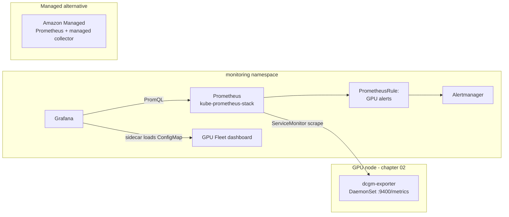
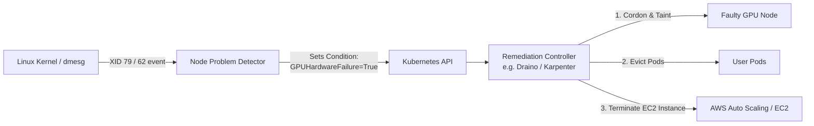

# 04 · GPU Observability

> DCGM exporter, kube-prometheus-stack, a Grafana dashboard, Prometheus alerting rules, and EKS's
> managed-observability alternative — so you can see what your GPUs are doing before something
> expensive goes idle or something hot goes unnoticed.

**If you're brand new to both Kubernetes and GPU/AI infra**: this chapter assumes you know roughly
what a Pod, DaemonSet, Service, and namespace are (from earlier chapters), but it does **not**
assume you've used Prometheus, Grafana, or a GPU driver before. Section 3 below explains all of
those from scratch — read it before the lab, not after.

## 0. Before you start

Needs from [`02-nvidia-gpu-operator`](../02-nvidia-gpu-operator): a running GPU Operator install
with `dcgmExporter.enabled: true` (the chart default) — this chapter scrapes that exporter, it
doesn't install it. This course targets real GPU hardware throughout, so there's no CPU-only
fallback lab here either — every step below runs against the actual EKS cluster and GPU node
from chapters 00–02.

## 1. Why this matters

A GPU node with no monitoring is a black box that bills you by the second. Chapter 02's GPU
Operator already runs `dcgm-exporter` (DCGM = NVIDIA Data Center GPU Manager) on every GPU node,
but a running exporter nobody scrapes is not observability — it's a `/metrics` endpoint no one
looks at. This chapter wires that exporter into Prometheus + Grafana + alerting so you can answer,
in seconds: is this GPU actually being used, is it about to overheat or run out of memory, did a
driver fault (XID error) just happen, and is that expensive on-demand GPU node sitting idle right
now.

If you've never worked with GPUs before, the core problem to internalize is this: **a GPU is a
piece of hardware you're renting by the hour (or the second), and unlike a CPU, most tools you
already know — `top`, `kubectl top`, standard Kubernetes metrics — cannot see inside it.**
`kubectl top node` will happily tell you a GPU node's *CPU and RAM* are barely used while the GPU
itself sits fully idle burning $2–$30+/hour, or conversely looks "fine" from the outside while the
GPU is thermal-throttling or throwing hardware faults. You need a GPU-specific agent (dcgm-exporter)
reporting GPU-specific metrics, and a system to collect, alert on, and visualize them. That system
is what this chapter builds.

- **Utilization is the metric that justifies chapters 03 and 13.** You can't decide "should this
  workload use MIG, time-slicing, or a bigger node pool" without first seeing `DCGM_FI_DEV_GPU_UTIL`.
- **XID errors are the GPU's own fault signal.** A rising XID counter (chapter 03's shared-GPU
  workloads especially) usually means "drain this node," not "restart the pod and hope."
- **Idle on-demand GPU nodes are the single most avoidable line item** in an AI infra bill — this
  chapter's alert catches them; chapter 13 fixes them with autoscaling.



**Reading this diagram if you've never seen a metrics-scraping architecture before**: arrows point
in the direction data (or a request for data) flows, not the direction of "control." The important
thing to notice is that **Prometheus is the one doing the reaching-out** — it's a "pull" system.
`dcgm-exporter` doesn't push its numbers anywhere; it just sits on the GPU node exposing a plain
HTTP endpoint (`:9400/metrics`) that prints the current metric values as text whenever something
asks. Prometheus periodically asks — that's the "ServiceMonitor scrape" arrow. Once Prometheus has
the numbers stored in its own time-series database, two things read from that database: a
`PrometheusRule` (which is just a saved query plus a threshold — "if this query's result stays
true for N minutes, fire an alert") that hands firing alerts to Alertmanager for
routing/notification, and Grafana, which runs its own queries against Prometheus to draw graphs.
The dashboard's *definition* (which panels, which queries, how they're laid out) is loaded into
Grafana separately, as a Kubernetes ConfigMap that a Grafana "sidecar" container watches for — more
on that in 3.2. The box on the right, AMP, is a completely separate, alternative path covered in
3.3 — it's not part of the main pipeline, it replaces most of it.

## 2. Learning objectives and time plan (~2.5 h)

By the end you can:

1. Explain what dcgm-exporter measures and where those metric names come from.
2. Wire a `ServiceMonitor` and `PrometheusRule` into a kube-prometheus-stack release so GPU
   metrics and alerts are picked up automatically.
3. Read a GPU fleet Grafana dashboard and know which panel answers which operational question.
4. Compare self-hosted kube-prometheus-stack vs. Amazon Managed Service for Prometheus (AMP) for
   this use case.
5. Verify the whole pipeline — exporter, scrape, alert, dashboard — end to end against a real
   GPU node, including triggering a real alert on purpose.

| Time | Activity |
|---|---|
| 0:00–0:25 | Read section 3. Skim `eks/prometheusrule.yaml` and `eks/dashboard-configmap.yaml` |
| 0:25–1:05 | Install kube-prometheus-stack on EKS, wire up the real dcgm-exporter (Step 1) |
| 1:05–1:35 | Grafana walkthrough + trigger an alert on purpose (Steps 2–3) |
| 1:35–2:05 | Read/skim the AMP managed-observability alternative (Step 4) |
| 2:05–2:20 | Checkpoint questions, cleanup |

## 3. Concepts

### 3.0 The pieces, in plain language (read this first if any of these are new to you)

If you already know Prometheus/Grafana, skip to 3.1. Otherwise, here's what each moving part is
and why the pipeline needs it:

- **Prometheus** is a database and query engine purpose-built for "metrics over time" — numbers
  like CPU%, memory, GPU temperature, request counts, sampled repeatedly (every 30s here) and
  timestamped. It doesn't render pretty graphs itself; it stores the numbers and answers queries
  written in its own query language, PromQL (e.g. `DCGM_FI_DEV_GPU_UTIL > 90`). It works by
  **pulling**: you tell it a list of HTTP endpoints ("targets") to poll, and it polls them on a
  schedule. This is the opposite of, say, sending logs to a central server — nothing is pushed to
  Prometheus, it goes and fetches.
- **Grafana** is the visualization layer. It doesn't store metrics itself (in this setup) — it
  runs PromQL queries against Prometheus and draws the result as graphs, gauges, and tables,
  arranged into "dashboards." A dashboard is really just a JSON document describing which queries
  to run and how to plot them; `eks/dashboard-configmap.yaml` in this chapter is exactly that.
- **Alertmanager** is a separate, smaller service that Prometheus hands "this condition has been
  true long enough, fire an alert" events to. Alertmanager's job is routing and deduplication —
  deciding who gets notified, how (Slack/email/PagerDuty), and not spamming the same alert
  repeatedly. This lab doesn't configure a real notification receiver (see the troubleshooting
  table), so alerts will show up in the Alertmanager UI but won't page anyone.
- **"The whole observability stack"** in this chapter means these four pieces running together —
  Prometheus (collects + stores + evaluates alert rules), Grafana (visualizes), Alertmanager
  (routes alerts to humans), plus the **Prometheus Operator**, a Kubernetes controller that lets
  you configure all of the above by creating Kubernetes objects (`ServiceMonitor`,
  `PrometheusRule`) instead of hand-editing Prometheus's config file. The Helm chart that installs
  all of this in one shot is called **kube-prometheus-stack** — one chart, five-ish
  Deployments/StatefulSets, this is what Step 1 installs.
- **`ServiceMonitor` and `PrometheusRule` are Kubernetes Custom Resources (CRDs)** — they don't
  exist in vanilla Kubernetes; the Prometheus Operator defines them and watches for them. A
  `ServiceMonitor` says "here's a Kubernetes Service whose Pods I want scraped, and which port/path
  to scrape." A `PrometheusRule` says "here are PromQL queries to evaluate on a schedule, and what
  to call the alert when one comes back true for long enough." Instead of you manually appending to
  Prometheus's scrape/alerting config and restarting it (the old, painful way), you `kubectl apply`
  a small YAML object and the Operator handles wiring it into Prometheus's live config for you.
  **How the Operator finds *your* objects among everyone else's in the cluster**: it doesn't watch
  every `ServiceMonitor` in the cluster by default — it watches for ones matching a *label
  selector* configured on the Prometheus custom resource (by default, driven by the Helm release
  name — see 3.2's "one gotcha"). This is exactly like how a Kubernetes Service finds its Pods via
  a label selector, just one layer up: Service → Pods by label, Prometheus → ServiceMonitors by
  label.
- **`dcgm-exporter`** is the agent, already running from chapter 02, that turns raw NVIDIA driver
  telemetry into the Prometheus text format Prometheus knows how to scrape. Without it, Prometheus
  has no way to ask a GPU anything — Prometheus only speaks HTTP + a specific text format, and the
  GPU driver doesn't speak that natively.
- **Amazon Managed Service for Prometheus (AMP)** is AWS running the "Prometheus that stores and
  queries your metrics" part *for* you, as a managed service, so you don't operate a Prometheus
  StatefulSet, its disk, or its upgrades yourself. You still need something to *collect* metrics and
  ship them to AMP (an AWS-managed collector, covered in Step 4, instead of the in-cluster
  Prometheus this chapter installs by default). People pick AMP over self-hosted for a production
  fleet because: no PVC/storage to size or grow, no Prometheus version upgrades, and it survives a
  node — even the *whole cluster* — disappearing, since the data isn't stored on anything the
  cluster controls. The trade-off, covered in 3.3 and the cost notes, is that **AMP bills per
  metric sample ingested**, not a flat "server cost" — high-cardinality label sets (like a
  `gpu`+`Hostname`+`UUID` label combo on every one of hundreds of GPUs) can get expensive in a way
  a self-hosted Prometheus's disk usage does not directly translate to a bill.

### 3.1 What dcgm-exporter actually measures

DCGM polls the GPU driver/NVML and exposes a curated metric set as Prometheus text format on
`:9400/metrics`. The metrics this chapter uses:

| Metric | What it means | Why it matters | Used by |
|---|---|---|---|
| `DCGM_FI_DEV_GPU_UTIL` | SM (compute) utilization %, 1-second sampled | The single best "is this GPU doing anything" number. Near 0% for a long stretch on an expensive on-demand node means you're paying for nothing; sustained near 100% with work queued means you're compute-bound and may need more GPUs or sharing. | Dashboard, idle-node alert |
| `DCGM_FI_DEV_FB_USED` / `_FB_FREE` | Framebuffer (VRAM) used/free, MiB | GPUs run out of *memory* long before they run out of compute — an LLM or training job that exceeds VRAM crashes outright (OOM), it doesn't just slow down like a CPU process might. Watching headroom here catches "about to OOM" before it happens. | Dashboard, memory-pressure alert |
| `DCGM_FI_DEV_POWER_USAGE` | Instantaneous power draw, W | A rough proxy for "how hard is this GPU actually working" independent of the utilization metric, and useful for spotting power-capped throttling. | Dashboard |
| `DCGM_FI_DEV_GPU_TEMP` | Die temperature, °C | Datacenter GPUs throttle (silently reduce clock speed, hurting your job's performance) or shut down well before they'd be damaged — by the time you *notice* a job running slower, thermal throttling may already have been happening for a while. Alerting on temperature catches it earlier. | Dashboard, thermal alert |
| `DCGM_FI_DEV_SM_CLOCK` | SM clock, MHz (drops under thermal/power throttling) | The clock speed dropping *without* a change in workload is usually the first hard evidence of throttling — pairs with the temperature/power metrics to confirm cause. | Dashboard |
| `DCGM_FI_DEV_XID_ERRORS` | Last XID error code seen (0 = none) | "Xid" is NVIDIA's name for a driver-reported hardware/driver fault code (think of it like a kernel panic code, but for the GPU). A nonzero, *increasing* count means something is actually wrong with the silicon or driver — not something a pod restart fixes. | Dashboard, XID alert |

**Utilization vs. memory vs. power vs. ECC/XID errors, in one sentence each**: utilization tells
you if the GPU's compute cores are busy; memory (framebuffer) tells you if you're about to run out
of the resource that crashes jobs outright; power tells you how hard it's working electrically
(and hints at throttling); XID/ECC errors tell you if the hardware or driver itself is unhealthy,
independent of what workload is running. All four answer different questions — a GPU can be at
0% utilization and still overheating from a stuck fan, or at 100% utilization with plenty of free
memory and no errors at all (healthy and simply busy).

Every series carries a `gpu` label (index) and `Hostname`/`UUID`/`device` labels — that's how one
`ServiceMonitor` target on a multi-GPU node becomes per-GPU panels and alerts. Concretely: if a
node has 8 GPUs, dcgm-exporter's single `/metrics` endpoint returns 8 separate values for
`DCGM_FI_DEV_GPU_UTIL`, one per `gpu` label (0–7) — Prometheus stores all 8 as distinct time
series, and PromQL/Grafana can filter, average, or break them out individually.

### 3.2 The scrape path

Chapter 02's `ClusterPolicy` (`dcgmExporter.enabled: true`) makes the GPU Operator's controller
create a `nvidia-dcgm-exporter` **DaemonSet + Service** in the `gpu-operator` namespace — the
Service, not a chart you install here. ("DaemonSet" means one Pod per matching node automatically
— every GPU node gets its own dcgm-exporter Pod without you scheduling it explicitly.) This
chapter adds:

1. A `ServiceMonitor` (`eks/servicemonitor.yaml`) telling Prometheus Operator to scrape that
   Service on its `gpu-metrics` port. Concretely, `eks/servicemonitor.yaml`
   selects Service Pods labeled `app: nvidia-dcgm-exporter` in the `gpu-operator` namespace and
   scrapes them every 30s on the port named `gpu-metrics`.
2. A `PrometheusRule` (`eks/prometheusrule.yaml`) with GPU-specific alerting rules —
   five rules covering temperature, XID errors, memory pressure, idle on-demand nodes, and the
   exporter itself going dark (`DCGMExporterDown`).
3. A Grafana dashboard `ConfigMap` (`eks/dashboard-configmap.yaml`), picked up by kube-prometheus-stack's
   Grafana **sidecar** — a small helper container running alongside Grafana in the same Pod, whose
   only job is to watch the Kubernetes API for ConfigMaps carrying the label
   `grafana_dashboard: "1"`, and when it finds one, write that ConfigMap's JSON contents to a
   volume Grafana reads dashboards from and tell Grafana to reload. This is why "add a dashboard"
   in this repo is just "apply a labeled ConfigMap" rather than logging into Grafana's UI and
   clicking through an import wizard.

**The one gotcha that breaks this silently**: kube-prometheus-stack's Prometheus custom resource
only auto-discovers `ServiceMonitor`/`PrometheusRule` objects carrying the label
`release: <helm release name>` (`serviceMonitorSelectorNilUsesHelmValues`/`ruleSelectorNilUsesHelmValues:
true`, the chart default). Every manifest under `eks/` is pre-labeled `release: kube-prometheus-stack`
— **install the chart under that exact release name**, or relabel. Why this design exists: without
a selector, a Prometheus in namespace A could accidentally start scraping every `ServiceMonitor`
created by every team/chart in the whole cluster, including ones meant for a completely different
Prometheus instance. The label scopes "which ServiceMonitors belong to *this* Prometheus" the same
way a Service's `selector` scopes "which Pods belong to *this* Service" — and just like a Service
silently matching zero Pods, a mismatched label here fails with no error message at all: the
target simply never appears, which is exactly the first troubleshooting row below.

### 3.3 Self-hosted vs. managed (AMP)

| | Self-hosted (this chapter's default) | Amazon Managed Service for Prometheus (AMP) |
|---|---|---|
| What | kube-prometheus-stack (Prometheus Operator + Prometheus + Alertmanager + Grafana) | AMP + AWS-managed collector |
| Enabled by | Step 1 below (`helm upgrade --install kube-prometheus-stack ...`) | `aws amp create-workspace` + `aws amp create-scraper` (Step 4 below) — creates billed resources, read before running |
| Alerting | Alertmanager, in-cluster | Amazon Managed Grafana alerting / CloudWatch alarms on AMP-sourced metrics |
| Dashboards | Grafana, in-cluster, PV-backed | Amazon Managed Grafana (separate resource) |
| You manage | Prometheus storage, upgrades, HA | The scraper config; not the collector infra |
| Billing model | Cluster compute/storage you already pay for (CPU pool nodes + EBS volumes) | **Per-sample ingested** — see cost notes; can exceed self-hosted cost fast at high cardinality/fleet size |
| Best for this course | Consistent, portable dashboards/alerts as code | Production EKS, want zero ops, already using AMP |

This course defaults to self-hosted kube-prometheus-stack so the same `ServiceMonitor`/
`PrometheusRule`/dashboard work as code — AMP is a read-through alternative you'd pick for a real
production fleet. **Why you'd actually choose one over the other in practice**: self-hosted means
*you* own upgrading Prometheus, sizing its disk, and keeping it highly available (if the one
Prometheus Pod goes down, you lose alerting and dashboards until it's back) — cheap in raw dollars
but real operational burden. AMP removes that burden and is inherently resilient to node/cluster
loss (nothing about AMP lives on a node your cluster can preempt), but you pay per sample ingested
regardless of whether you ever look at it, and it's a second AWS service to understand and secure
(IAM permissions, VPC networking for the collector — see Step 4's `# VERIFY` on subnet/security
group flags).

### 3.3 Production reliability: Critical XID Error taxonomy, Silent Data Corruption (SDC), and Automated Remediation

In large-scale AI infrastructure, GPUs are consumer-density silicon pushed to maximum thermal and electrical limits. In a cluster with 500+ GPUs, **hardware faults are daily occurrences, not exceptional incidents**.

#### The production XID taxonomy: fatal vs transient

When an NVIDIA GPU encounters a fault, the kernel driver emits an **Xid message** to `dmesg` and increments `DCGM_FI_DEV_XID_ERRORS`. Not all XIDs are equal:

| XID Code | Description | Root Cause | Can a Pod Restart Fix It? | Automated Action Required |
|---|---|---|---|---|
| **31** | GPU memory page fault | User container illegal memory access or corrupt pointer | **Yes** (workload bug) | Restart pod; alert developer if recurring |
| **48 / 64** | Uncorrectable double-bit ECC error / Page retirement failed | Physical DRAM defect on the GPU die (flipped bit that ECC cannot heal) | **No** (hardware degradation) | Cordon node, retire memory page, reboot or RMA |
| **62** | Internal micro-controller halt | Firmware or GSP micro-controller crash inside the GPU | **No** (GPU is frozen) | Node reboot / warm reset |
| **79** | **GPU has fallen off the bus** | PCIe bus link drop, severe power rail sag, or silicon thermal shutdown | **No** (GPU completely disappeared from OS) | **Fatal**: Cordon immediately, terminate EC2 instance |

> [!CAUTION]
> **The XID 79 Trap**: When XID 79 occurs, `nvidia-smi` hangs or returns `Unable to determine the device handle for GPU...`. Pods fail with `CUDA error: all CUDA-capable devices are busy or unavailable`. 
> Kubernetes' default behavior is to restart the container, which fails repeatedly, landing in `CrashLoopBackOff`. Meanwhile, the rest of the node's healthy GPUs sit idle and blocked. **A container restart can never recover a fallen-off-the-bus GPU**.

#### Silent Data Corruption (SDC)

Silent Data Corruption occurs when a hardware defect or cosmic ray flips a bit inside an arithmetic unit (ALU), tensor core, or internal cache **without triggering an ECC error or XID exception**.

- **How it manifests**: The GPU happily continues calculating, but its mathematical calculations are subtly wrong.
  - In training: Loss suddenly explodes to `NaN` or spikes erratically after thousands of steps.
  - In inference: The LLM outputs gibberish, hallucinated characters, or fails safety filters.
- **Detection**: Production platforms run lightweight, periodic diagnostic canary jobs (e.g. running an exact GEMM matrix multiply verification on idle cards) or monitor loss gradient norms across all training ranks. If one node consistently produces diverging gradients, it is cordoned for hardware diagnostics (`dcgmproftester`).

#### Automated node remediation with Node Problem Detector (NPD)

Production teams cannot rely on manual pager alerts to cordon broken GPU nodes at 3 AM. Instead, they run an automated self-healing loop:



1. **Detection**: **Node Problem Detector (NPD)** runs as a DaemonSet with a custom system log monitor watching `/dev/kmsg` for `NVRM: Xid (PCI:...): 79`.
2. **Flagging**: NPD posts a Node Condition to the Kubernetes API: `GPUHardwareFailure: True`.
3. **Cordon & Taint**: The node is immediately tainted `node.kubernetes.io/unschedulable:NoSchedule` so no new training or serving pods can land on the broken hardware.
4. **Drain & Replace**: A remediation controller (such as Draino, Medkit, or Karpenter's automated health checks) drains existing workloads to healthy nodes and instructs AWS to terminate the underlying EC2 instance, triggering the launch of a fresh, verified replacement.

## 4. Lab

```bash
cp env.sh.example env.sh && source env.sh && source versions.env   # if not already
```
This sources two files: `env.sh` holds your personal AWS account ID/region (gitignored — you fill
it in once per clone), and `versions.env` pins every chart/image version this whole course uses
(e.g. `${KUBE_PROMETHEUS_STACK_VERSION}`) so the commands below install exactly the version this
chapter was tested against, not "whatever is latest today."

Prerequisite: chapter 02 (GPU Operator, `dcgmExporter.enabled: true`) running on the cloud you're
using — this chapter scrapes it, it doesn't install it.

### Step 1: Real dcgm-exporter on EKS

What you're about to do: install kube-prometheus-stack (pinned to `${KUBE_PROMETHEUS_STACK_VERSION}`)
on the CPU spot pool, then wire this chapter's `ServiceMonitor`/`PrometheusRule`/dashboard on top of
it so it picks up chapter 02's `dcgm-exporter`.

Prereq: the EBS CSI driver add-on — Prometheus/Alertmanager PVCs need it. Why: Prometheus and
Alertmanager both write their data to disk (a time-series database and an alert-state log,
respectively) so a Pod restart doesn't wipe your history — that disk is backed by an EBS volume,
and EBS volumes on EKS are provisioned through the EBS CSI driver add-on, not built into the
cluster by default. Chapter 00's `eksctl create cluster` step provisions the cluster but does not
install this add-on for you, so add it explicitly if it isn't already present:
```bash
eksctl get addon --cluster "${EKS_CLUSTER}" --region "${AWS_REGION}" | grep aws-ebs-csi-driver || \
  eksctl create addon --name aws-ebs-csi-driver --cluster "${EKS_CLUSTER}" --region "${AWS_REGION}" \
    --force
```
This checks whether the add-on is already installed (`eksctl get addon ... | grep`) and only
creates it if the `grep` finds nothing (`||`) — safe to re-run. `--force` lets `eksctl` proceed even
if it detects a conflicting existing configuration for the add-on, which is fine here since we want
it installed either way.

Installing the add-on only gets you the CSI driver's controller/node Pods — it does **not** create a
`gp3` `StorageClass` for you, even though `gp3` is the driver's own default volume type. Without one,
Prometheus/Alertmanager/Grafana's PVCs (which all request `storageClassName: gp3`, see below) stay
`Pending` forever with `storageclass.storage.k8s.io "gp3" not found`. Create it explicitly and make it
the cluster default:
```bash
kubectl apply -f 04-gpu-observability/eks/storageclass-gp3.yaml
```

```bash
helm repo add prometheus-community https://prometheus-community.github.io/helm-charts --force-update
helm repo update prometheus-community

helm upgrade --install kube-prometheus-stack prometheus-community/kube-prometheus-stack \
  --namespace monitoring --create-namespace \
  --version "${KUBE_PROMETHEUS_STACK_VERSION}" \
  -f 04-gpu-observability/eks/values-kube-prometheus-stack.yaml \
  --wait --timeout 15m

kubectl apply -f 04-gpu-observability/eks/namespace.yaml
kubectl apply -f 04-gpu-observability/eks/servicemonitor.yaml
kubectl apply -f 04-gpu-observability/eks/prometheusrule.yaml
kubectl apply -f 04-gpu-observability/eks/dashboard-configmap.yaml

kubectl -n gpu-operator get svc nvidia-dcgm-exporter   # confirm chapter 02 created it
```
Walking through this block: `helm repo add`/`update` register and refresh the chart repository
(Helm's equivalent of `apt update` for a package source) so `helm upgrade --install` can find the
`kube-prometheus-stack` chart by name. `helm upgrade --install <name> <chart>` is the standard
"install if it's not there, upgrade in place if it is" pattern — the `<name>` you give it
(`kube-prometheus-stack`) becomes the Helm *release name*, which is exactly the value the
`release:` label on this chapter's `ServiceMonitor`/`PrometheusRule` must match (3.2's gotcha) —
**don't rename this without also relabeling the manifests under `eks/`**. `--namespace monitoring
--create-namespace` puts the whole stack in its own namespace, created if missing. `--version`
pins the exact chart version from `versions.env` rather than "whatever's newest," so this lab
behaves the same months from now. `-f eks/values-kube-prometheus-stack.yaml` supplies this
chapter's EKS-specific overrides (CPU-pool node selector/tolerations, storage class, retention —
see 5). `--wait --timeout 15m` makes Helm block until every resource it created reports healthy,
instead of returning immediately and leaving you to guess whether the install actually finished.
The four `kubectl apply -f` commands then layer this chapter's own objects (the namespace, the
`ServiceMonitor`, the `PrometheusRule`, the dashboard `ConfigMap`) on top of the chart's install —
each is a complete, standalone manifest with its `namespace` set in `metadata`, so the namespace
file only needs to be applied once, before the objects that live in it. The final `kubectl get svc`
is just a sanity check that chapter 02 actually created the Service this chapter is about to
scrape — if it's missing, stop and go fix chapter 02 first.

Expected:
```
kubectl -n monitoring get pods
NAME                                                     READY   STATUS
kube-prometheus-stack-grafana-...                        3/3     Running
kube-prometheus-stack-kube-state-metrics-...              1/1     Running
kube-prometheus-stack-operator-...                        1/1     Running
kube-prometheus-stack-prometheus-node-exporter-...         1/1     Running
prometheus-kube-prometheus-stack-prometheus-0              2/2     Running
alertmanager-kube-prometheus-stack-alertmanager-0          2/2     Running
```
```bash
kubectl -n monitoring port-forward svc/kube-prometheus-stack-prometheus 9090:9090
# http://localhost:9090/targets -> dcgm-exporter target UP, labeled gpu-operator/nvidia-dcgm-exporter
```

### Step 2: Grafana walkthrough

What you're about to do: open the pre-loaded GPU Fleet dashboard, drive real GPU load, and watch the
panels move — this is the "does the whole pipeline actually show me something useful" check.
```bash
kubectl -n monitoring port-forward svc/kube-prometheus-stack-grafana 3000:80
```
Open **GPU Fleet (DCGM)**. Run something GPU-heavy from chapter 01/03 (e.g. the nbody benchmark
Deployments) and watch **GPU Utilization %** and **Power Usage** climb in near-real-time (30s
scrape interval — meaning it can take up to ~30 seconds for a change on the GPU to show up as a
new data point, since that's how often Prometheus polls). Cross-reference with **GPUs Allocatable
vs Allocated** to see scheduling pressure vs. actual usage — a common gap when device-plugin
sharing (chapter 03) is misconfigured (Kubernetes thinks a GPU is "allocated" to a Pod the moment
it's scheduled, which says nothing about whether that Pod is actually *using* it — that's what
`DCGM_FI_DEV_GPU_UTIL` is for).
How to tell this worked: **GPU Utilization %** rises above its idle baseline within ~1-2 scrape
intervals of starting the workload, and drops back down within ~1-2 intervals of it finishing.

### Step 3: Trigger an alert for real

What you're about to do: force a real alert to fire so you see the
full path — metric crosses threshold, `PrometheusRule` evaluates, Alertmanager shows it — end to end.
```bash
# Push GPU memory near the ceiling to fire GPUMemoryNearFull (needs a real GPU workload that
# allocates most of the framebuffer - e.g. a larger batch size on chapter 09's vLLM, or just
# watch it fire naturally on a MIG/time-sliced node from chapter 03).
kubectl -n monitoring port-forward svc/kube-prometheus-stack-alertmanager 9093:9093
# http://localhost:9093 -> Alerts, or query ALERTS{alertname=~"GPU.*"} in Prometheus.
```
An alert doesn't fire the instant a threshold is crossed — every rule has a `for:` duration (e.g.
`GPUMemoryNearFull` requires the condition to hold for 10 minutes straight) specifically so a
brief, harmless spike doesn't page anyone; Prometheus shows it as `pending` during that window and
only promotes it to `firing` once the duration elapses. That's why the "how to tell this worked"
check below explicitly calls out `firing`, not `pending`.

How to tell this worked: the alert shows state `firing` (not just `pending`) in either the
Alertmanager UI or `ALERTS{alertname=~"GPU.*"}` in Prometheus, with the `for:` duration from
`eks/prometheusrule.yaml` elapsed.

### Step 4: Read the AMP managed alternative

What you're about to do: read (don't necessarily run — this creates billed AWS resources) the
Amazon Managed Service for Prometheus path, so you can compare it against the self-hosted stack you
just built (section 3.3). This is not run by the course; run it yourself only if you want the
managed path instead of, or alongside, kube-prometheus-stack.

ALTERNATIVE to kube-prometheus-stack: AMP, scraped by an AWS-managed collector (no ADOT
DaemonSet/Deployment to run or upgrade yourself). Trade-off: no bundled Alertmanager/Grafana (pair
with Amazon Managed Grafana or your own), and the managed collector needs ENIs in your VPC subnets
(extra IPs/cost) — read the pricing page before fleet use.

> **Cost warning, read before running anything below**: unlike the self-hosted path (where your
> cost is the CPU-pool compute/storage you already have), **AMP bills per metric sample
> ingested** — every individual data point, for every time series, every scrape. A modest GPU
> fleet scraped every 30s across several dozen metrics × GPUs × nodes adds up to real per-sample
> volume fast, and it's billed whether or not you ever open a dashboard. `# VERIFY`: check the
> [current AMP pricing page](https://aws.amazon.com/prometheus/pricing/) for the exact per-sample
> rate before pointing this at anything beyond this lab's single dcgm-exporter target.

```bash
: "${AWS_REGION:?}" "${EKS_CLUSTER:?}"
WORKSPACE_ALIAS="${WORKSPACE_ALIAS:-ch04-gpu-observability}"

WORKSPACE_ID=$(aws amp create-workspace --alias "$WORKSPACE_ALIAS" --region "$AWS_REGION" \
  --query workspaceId --output text)
echo "AMP workspace: $WORKSPACE_ID"
```
`: "${VAR:?}"` is a shell idiom that aborts the script immediately with an error if `VAR` is unset
or empty, instead of silently continuing with a blank value into an AWS API call — a guardrail
against, say, accidentally creating a workspace in the wrong region because `$AWS_REGION` wasn't
sourced. `aws amp create-workspace` creates the actual AMP resource (a managed, isolated
Prometheus-compatible storage/query backend) — this is the first billed resource in this section.
The `--query`/`--output text` flags just extract the new workspace's ID from the JSON response so
it can be reused in the next command, rather than you copy-pasting it by hand.

Minimal scrape config: same target as `eks/servicemonitor.yaml`, translated to a plain Prometheus
`scrape_config` (the managed collector doesn't consume `ServiceMonitor` CRs, it consumes this):
```bash
cat > /tmp/amp-scrape-config.yaml <<'EOF'
global:
  scrape_interval: 30s
scrape_configs:
  - job_name: dcgm-exporter
    kubernetes_sd_configs:
      - role: pod
        namespaces: { names: ["gpu-operator"] }
    relabel_configs:
      - source_labels: [__meta_kubernetes_pod_label_app]
        regex: nvidia-dcgm-exporter
        action: keep
      - source_labels: [__meta_kubernetes_pod_container_port_name]
        regex: gpu-metrics
        action: keep
EOF
SCRAPE_CONFIG_B64=$(base64 < /tmp/amp-scrape-config.yaml | tr -d '\n')
```
This matters because it's the *same intent* as `eks/servicemonitor.yaml` (scrape
Pods labeled `app: nvidia-dcgm-exporter` in `gpu-operator`, on the `gpu-metrics` port), just
expressed differently: the AWS-managed collector isn't a Prometheus Operator, so it can't read a
`ServiceMonitor` CRD — it reads a plain Prometheus `scrape_config` block instead, using
Kubernetes's own service-discovery API (`kubernetes_sd_configs`) directly rather than through the
Operator's abstraction. AMP's `create-scraper` API expects this config base64-encoded as a single
string, hence the `base64 | tr -d '\n'` at the end (stripping newlines that `base64`'s default
line-wrapping would otherwise introduce into the encoded string).

`# VERIFY`: `--source-eks` requires `clusterArn` + `subnetIds` (private subnets with connectivity to
the EKS API endpoint and to the pod network) and `securityGroupIds`; get exact current syntax with
`aws amp create-scraper help` before running — this API is newer than this course's training data
cutoff and flags may have changed. See [Set up managed collectors](https://docs.aws.amazon.com/prometheus/latest/userguide/AMP-collector-how-to.html).
```bash
aws amp create-scraper \
  --region "$AWS_REGION" \
  --scrape-configuration "configurationBlob=${SCRAPE_CONFIG_B64}" \
  --destination "ampConfiguration={workspaceArn=arn:aws:aps:${AWS_REGION}:$(aws sts get-caller-identity --query Account --output text):workspace/${WORKSPACE_ID}}" \
  --alias "ch04-dcgm-scraper"
```
This is the command that actually deploys AWS's managed collector fleet against your cluster and
points it at the workspace created above — it's the second (and ongoing, metered) billed resource
in this section, distinct from the one-time workspace creation. `$(aws sts get-caller-identity
--query Account --output text)` just resolves your AWS account ID inline to build the workspace's
full ARN, rather than requiring you to hardcode or look it up separately.

How to tell you understood it: you can answer checkpoint question 4 without looking at the answer.

## 5. Spot considerations

- **Monitoring must outlive the workloads it watches.** Prometheus/Grafana/Alertmanager run on
  the **spot CPU pool**, not GPU nodes — a GPU node preemption should never take monitoring down
  with it (this is why every `values-kube-prometheus-stack.yaml` pins `nodeSelector`/`tolerations`
  to the CPU spot pool, not the GPU pool). Put another way: the thing watching for GPU node loss
  can't itself live on a GPU node, or it goes blind at the exact moment it matters most.
- **A scrape gap looks like an outage.** When a GPU spot node is preempted, its dcgm-exporter
  target goes `down` for the ~30–120s eviction window — expect `DCGMExporterDown` (10m `for:`)
  to stay quiet through a normal preemption but fire on a stuck/misconfigured node. This is exactly
  why that rule has a 10-minute `for:` duration rather than firing the instant a scrape fails —
  a routine spot reclaim shouldn't page anyone, only a target that's *stayed* down.
- **7-day retention (`prometheus.prometheusSpec.retention`) is deliberately short** for a lab —
  spot nodes churn, cardinality from `gpu`/`Hostname` labels grows with fleet size, and this is a
  learning cluster, not a production one. Size retention/storage for your real fleet. (Higher
  cardinality — more distinct label combinations — means more disk and memory for the same
  wall-clock retention window, since Prometheus stores each unique series separately.)
- **Managed observability (3.3) removes the "who watches the watcher" question** — AMP storage
  isn't on a node that can be preempted at all, so there's no equivalent "monitoring's own node got
  reclaimed" failure mode to design around.

## 6. Troubleshooting

| Symptom | Cause | Why this happens | Fix |
|---|---|---|---|
| Prometheus target for dcgm-exporter missing entirely | `ServiceMonitor` not labeled `release: kube-prometheus-stack`, or wrong namespace/label match | The Prometheus Operator only watches `ServiceMonitor` objects matching its configured label selector (3.2) — an unlabeled or mislabeled one isn't rejected with an error, it's simply invisible to the Operator, so nothing ever tells you it was ignored. | `kubectl get servicemonitor -A -l release=kube-prometheus-stack`; confirm `kubectl get svc -n gpu-operator -l app=nvidia-dcgm-exporter` exists first (chapter 02 must be installed) |
| Target present but `DOWN` | Port name mismatch, or `gpu-operator`'s dcgm-exporter Service uses a different label/port on your GPU Operator version | The `ServiceMonitor` references a port *by name* (`gpu-metrics`), not by number — if the Service backing it was created with a differently-named port (which can shift across GPU Operator chart versions, since the name isn't a versioned public API), Prometheus knows the target exists but can't find that named port to actually connect to. | `kubectl get endpoints -n gpu-operator nvidia-dcgm-exporter`; update `eks/servicemonitor.yaml`'s `selector`/`endpoints.port` to match (see its `# VERIFY` comment) |
| `GPULowUtilizationOnDemandNode` never fires (or fires on spot nodes too) | `kube_node_labels` doesn't include `eks.amazonaws.com/capacityType`, or your cluster is spot-only | This alert's query joins GPU utilization against a node *label* (capacity type) exposed by kube-state-metrics — but kube-state-metrics only exposes node labels that are explicitly allow-listed (`metricLabelsAllowlist`), for cardinality-control reasons; if that specific label key isn't on the allow-list, the join silently matches nothing rather than erroring. | Check `kube_node_labels.metricLabelsAllowlist` in `eks/values-kube-prometheus-stack.yaml` includes the right label key; on a spot-only lab cluster this alert legitimately never fires |
| Grafana dashboard not appearing | Sidecar not watching this namespace, or ConfigMap missing the `grafana_dashboard: "1"` label | The dashboard sidecar (3.2) discovers dashboards purely by watching for that specific label on ConfigMaps in namespaces it's configured to search — an unlabeled ConfigMap, or one in a namespace outside its search scope, is never noticed, again with no error surfaced anywhere. | `kubectl get cm -A -l grafana_dashboard=1`; confirm `grafana.sidecar.dashboards.searchNamespace: ALL` is set (`eks/values-kube-prometheus-stack.yaml` sets it) |
| PVC `Pending` for Prometheus/Alertmanager/Grafana, event says `storageclass.storage.k8s.io "gp3" not found` | The `gp3` `StorageClass` was never created — installing the `aws-ebs-csi-driver` add-on does not create it for you | A PVC stays `Pending` forever if the `StorageClass` it names doesn't exist or has no provisioner able to satisfy it — Kubernetes doesn't fall back to a different class automatically, it just waits. The add-on only installs the CSI driver's controller/node Pods; the `gp3` class is a separate object you apply yourself. | `kubectl get storageclass`; apply `kubectl apply -f 04-gpu-observability/eks/storageclass-gp3.yaml` (see Step 1's prereq) |
| `GPUXidError` fires constantly | A real, repeating GPU fault | XID codes are the driver's own fault-reporting mechanism; a *repeating* code (as opposed to a one-off) usually points to a specific, persistent hardware or driver condition rather than transient noise, which is why the alert has `for: 0m` (fires immediately, unlike the others) — any occurrence is worth knowing about right away. | Drain and inspect the node (`nvidia-smi -q` for Xid detail, correlate with `dmesg`); see [NVIDIA Xid Errors doc](https://docs.nvidia.com/deploy/xid-errors/index.html) |
| Alerts fire but nothing notifies you | Default Alertmanager has no receiver configured (this lab ships none) | Alertmanager's job is *routing* firing alerts to a notification channel (Slack, email, PagerDuty, etc.) — with zero receivers configured, alerts still show up correctly in its own UI/API, they just have nowhere to be sent, which is why "check the UI" is how you're meant to observe alerts in this lab rather than "wait for a page." | Add `alertmanager.config.receivers` in `eks/values-kube-prometheus-stack.yaml` (Slack/PagerDuty/email) — deliberately left out here since it's account-specific |

## 7. Cleanup and cost notes

What you're about to do: tear down the monitoring stack and this chapter's manifests.
```bash
kubectl delete -f 04-gpu-observability/eks/servicemonitor.yaml --ignore-not-found || true
kubectl delete -f 04-gpu-observability/eks/prometheusrule.yaml --ignore-not-found || true
kubectl delete -f 04-gpu-observability/eks/dashboard-configmap.yaml --ignore-not-found || true
kubectl delete -f 04-gpu-observability/eks/namespace.yaml --ignore-not-found || true
helm uninstall kube-prometheus-stack -n monitoring 2>/dev/null || true
kubectl delete namespace monitoring --ignore-not-found --wait=false
```
`--ignore-not-found` and the `|| true`/`2>/dev/null || true` guards make every line safe to re-run
even if a prior cleanup attempt already removed some of these — none of them error out just
because the object is already gone. Deleting the `monitoring` namespace last is a backstop that
catches anything the more targeted deletes above missed (e.g. PVCs, which Helm's own uninstall
deliberately leaves behind so you don't lose data by accident).

- kube-prometheus-stack's own footprint is CPU-pool-sized (a few hundred mCPU, ~1–2Gi RAM,
  ~25Gi of disk across Prometheus/Alertmanager/Grafana PVCs) — cheap, but not free; delete the
  `monitoring` namespace when you're done with the chapter.
- **AMP bills per sample/metric ingested — this is a fundamentally different cost model than
  self-hosted.** With kube-prometheus-stack, your cost is capped by the compute/storage you
  provisioned (fixed, predictable). With AMP, cost scales directly with how many distinct time
  series you scrape and how often — check current pricing before pointing it at a high-cardinality
  label set (per-pod GPU labels can get expensive fast, since every `gpu`×`Hostname`×`UUID`
  combination across a large fleet is its own billed series). Delete the workspace/scraper from
  Step 4 if you created them: `aws amp delete-scraper`/`aws amp delete-workspace`.
- dcgm-exporter itself is chapter 02's cost, not this chapter's — nothing extra to clean up there.

## 8. Checkpoint questions

1. Why does the `ServiceMonitor` in this chapter need the label `release: kube-prometheus-stack`,
   and what happens if you rename the Helm release without updating it?
2. Which DCGM metric would you check first to decide whether a node needs a bigger GPU sharing
   fan-out (chapter 03), and which to decide whether a spot GPU node pool is oversized (chapter 13)?
3. Why must Prometheus/Grafana run on the CPU pool, never the GPU pool?
4. What's the practical trade-off between self-hosted kube-prometheus-stack and Amazon Managed
   Service for Prometheus (AMP) for this specific use case?
5. A `DCGM_FI_DEV_XID_ERRORS` alert fires. What's the first thing you should check, and why is
   "just restart the pod" usually the wrong first move?
6. Why is the idle-node alert scoped to exclude spot nodes?
7. In your own words, what does it mean that Prometheus is a "pull"-based system, and what has to
   exist on a target (like a GPU node) for Prometheus to be able to scrape it at all?

<details>
<summary>Answers</summary>

1. kube-prometheus-stack's Prometheus CR defaults to `serviceMonitorSelectorNilUsesHelmValues: true` /
   `ruleSelectorNilUsesHelmValues: true`, which makes it select only `ServiceMonitor`/`PrometheusRule`
   objects labeled `release: <helm release name>`. Renaming the release without relabeling means
   Prometheus silently stops discovering these objects — the scrape/alerts just vanish, no error.
2. `DCGM_FI_DEV_GPU_UTIL` sustained near 100% with pods queued/pending suggests you need more
   sharing (chapter 03); `DCGM_FI_DEV_GPU_UTIL` sustained near 0% on an on-demand node (the
   `GPULowUtilizationOnDemandNode` alert) suggests the pool is oversized or should move to spot/
   scale-to-zero (chapter 13).
3. A GPU node can be preempted (spot) or drained for maintenance; if monitoring lived there, the
   moment you most need visibility (a node about to disappear) is exactly when you'd lose it.
4. Self-hosted gives you portable, version-controlled dashboards/alerts as code and full control
   over retention/rules, at the cost of running and storing Prometheus yourself. AMP removes that
   operational burden and survives node loss inherently, at the cost of per-sample billing and a
   separate alerting/dashboarding surface (Amazon Managed Grafana).
5. Check which GPU/node and correlate with `dmesg`/`nvidia-smi -q` for the Xid detail code first —
   many Xid codes indicate a hardware or driver-level fault that a pod restart won't fix and that
   will recur (or corrupt further work) until the node is drained and reset.
6. Idle on-demand nodes are pure waste (you pay whether used or not); idle spot nodes are, by
   design, expected to scale down/be reclaimed rather than alerted on — that's chapter 13's job,
   not an incident.
7. "Pull-based" means Prometheus itself initiates every metrics fetch, on its own schedule (30s
   here), rather than targets pushing data to it whenever they feel like it. For Prometheus to
   scrape anything, the target needs a plain HTTP endpoint that returns the current metric values
   as Prometheus's text format when requested — that's exactly what dcgm-exporter's `:9400/metrics`
   endpoint is; nothing about GPUs or NVML natively speaks that format, which is the whole reason
   dcgm-exporter needs to exist as a translation layer.
</details>

## 9. Further reading and versions tested

- [NVIDIA DCGM Exporter](https://github.com/NVIDIA/dcgm-exporter), [Configure Prometheus for DCGM Exporter](https://docs.nvidia.com/datacenter/dcgm/latest/learn/getting-started-for-system-administrators/configure-prometheus-for-dcgm-exporter.html), [NVIDIA Xid Errors](https://docs.nvidia.com/deploy/xid-errors/index.html)
- [Prometheus: What is Prometheus?](https://prometheus.io/docs/introduction/overview/) and [Grafana fundamentals](https://grafana.com/docs/grafana/latest/fundamentals/) — start here if Prometheus/Grafana concepts in section 3.0 are new to you
- [kube-prometheus-stack chart](https://github.com/prometheus-community/helm-charts/tree/main/charts/kube-prometheus-stack), [Prometheus Operator ServiceMonitor/PrometheusRule](https://prometheus-operator.dev/docs/getting-started/design/)
- EKS: [Amazon Managed Service for Prometheus](https://docs.aws.amazon.com/prometheus/latest/userguide/what-is-Amazon-Managed-Service-for-Prometheus.html), [Set up managed collectors](https://docs.aws.amazon.com/prometheus/latest/userguide/AMP-collector-how-to.html), [AMP pricing](https://aws.amazon.com/prometheus/pricing/)
- Community NVIDIA DCGM Grafana dashboard (import by ID for the full official panel set): [grafana.com dashboard 12239](https://grafana.com/grafana/dashboards/12239-nvidia-dcgm-exporter-dashboard/)

**Versions tested** (2026-09-16): kube-prometheus-stack `${KUBE_PROMETHEUS_STACK_VERSION}` (91.4.1,
chart's own component versions: Prometheus Operator per chart default), dcgm-exporter image
`4.6.0-4.8.3-distroless` (matches `${DCGM_EXPORTER_CHART_VERSION}`=4.8.3, installed by chapter 02's
GPU Operator `${GPU_OPERATOR_VERSION}`=v26.7.0),
Kubernetes 1.35. `values-kube-prometheus-stack.yaml` in this chapter was rendered locally with
`helm template ... --version 91.4.1 -f eks/values-kube-prometheus-stack.yaml` against the pinned
chart to confirm it parses; not applied to a live cluster.

**`# VERIFY` items to re-check before relying on this chapter**:
- `eks/servicemonitor.yaml`: the exact Service/pod label
  (`app: nvidia-dcgm-exporter`) and port name (`gpu-metrics`) that the GPU Operator creates —
  stable across recent releases in community reports, but not documented as a versioned public API;
  confirm with `kubectl get svc -n gpu-operator -l app=nvidia-dcgm-exporter -o yaml`.
- `eks/prometheusrule.yaml`'s `GPULowUtilizationOnDemandNode`: exact `kube_node_labels`
  label keys depend on `kube-state-metrics.metricLabelsAllowlist` and kube-state-metrics version.
- Step 4's `aws amp create-scraper`'s `--source-eks`/subnet/security-group flags — this API is
  newer than this course's training data; re-check `aws amp create-scraper help` before running.
- Step 4 (AMP) is a read-through reference, not exercised by `helm template`
  the way the self-hosted path was.
- AMP's exact per-sample pricing (cost notes and Step 4's cost warning) — check the linked AWS
  pricing page for current rates before running Step 4 against anything beyond this lab.
</content>

---

[← Prev: 03-gpu-sharing-and-dra](../03-gpu-sharing-and-dra) | [Course Map](../README.md) | [Next: 05-model-storage-and-data →](../05-model-storage-and-data)