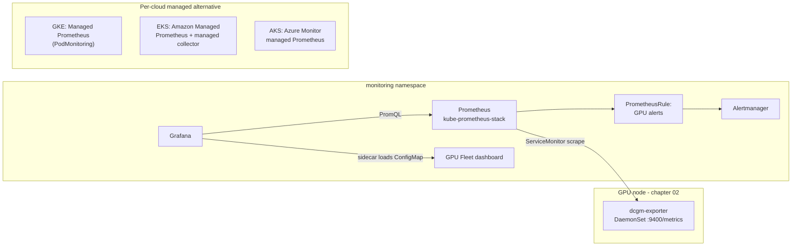

# 04 · GPU Observability

> DCGM exporter, kube-prometheus-stack, a Grafana dashboard, Prometheus alerting rules, and each
> cloud's managed-observability alternative — so you can see what your GPUs are doing before
> something expensive goes idle or something hot goes unnoticed.

## Before you start

Needs from [`02-nvidia-gpu-operator`](../02-nvidia-gpu-operator): a running GPU Operator install
with `dcgmExporter.enabled: true` (the chart default) — this chapter scrapes that exporter, it
doesn't install it. If you're only doing Step 0 (`cpu-lab/`), no prior chapter is needed: it ships
its own fake exporter and needs no GPU or cloud account at all.

## 1. Why this matters

A GPU node with no monitoring is a black box that bills you by the second. Chapter 02's GPU
Operator already runs `dcgm-exporter` (DCGM = NVIDIA Data Center GPU Manager) on every GPU node,
but a running exporter nobody scrapes is not observability — it's a `/metrics` endpoint no one
looks at. This chapter wires that exporter into Prometheus + Grafana + alerting so you can answer,
in seconds: is this GPU actually being used, is it about to overheat or run out of memory, did a
driver fault (XID error) just happen, and is that expensive on-demand GPU node sitting idle right
now.

- **Utilization is the metric that justifies chapters 03 and 13.** You can't decide "should this
  workload use MIG, time-slicing, or a bigger node pool" without first seeing `DCGM_FI_DEV_GPU_UTIL`.
- **XID errors are the GPU's own fault signal.** A rising XID counter (chapter 03's shared-GPU
  workloads especially) usually means "drain this node," not "restart the pod and hope."
- **Idle on-demand GPU nodes are the single most avoidable line item** in an AI infra bill — this
  chapter's alert catches them; chapter 13 fixes them with autoscaling.



## 2. Learning objectives and time plan (~3 h)

By the end you can:

1. Explain what dcgm-exporter measures and where those metric names come from.
2. Wire a `ServiceMonitor` and `PrometheusRule` into a kube-prometheus-stack release so GPU
   metrics and alerts are picked up automatically.
3. Read a GPU fleet Grafana dashboard and know which panel answers which operational question.
4. Compare self-hosted kube-prometheus-stack vs. each cloud's managed Prometheus for this use case.
5. Practice the whole pipeline — exporter, scrape, alert, dashboard — on a CPU-only cluster.

| Time | Activity |
|---|---|
| 0:00–0:25 | Read section 3. Skim `common/alerts/prometheusrule.yaml` and `common/dashboards/dashboard.json` |
| 0:25–1:00 | `cpu-lab/`: full pipeline against a fake exporter, no GPU quota needed |
| 1:00–1:40 | Install kube-prometheus-stack on your cloud, wire up the real dcgm-exporter |
| 1:40–2:10 | Grafana walkthrough + trigger an alert on purpose |
| 2:10–2:40 | Read/skim the managed-observability alternative for your cloud |
| 2:40–3:00 | Checkpoint questions, cleanup |

## 3. Concepts

### 3.1 What dcgm-exporter actually measures

DCGM polls the GPU driver/NVML and exposes a curated metric set as Prometheus text format on
`:9400/metrics`. The metrics this chapter uses:

| Metric | What it means | Used by |
|---|---|---|
| `DCGM_FI_DEV_GPU_UTIL` | SM (compute) utilization %, 1-second sampled | Dashboard, idle-node alert |
| `DCGM_FI_DEV_FB_USED` / `_FB_FREE` | Framebuffer (VRAM) used/free, MiB | Dashboard, memory-pressure alert |
| `DCGM_FI_DEV_POWER_USAGE` | Instantaneous power draw, W | Dashboard |
| `DCGM_FI_DEV_GPU_TEMP` | Die temperature, °C | Dashboard, thermal alert |
| `DCGM_FI_DEV_SM_CLOCK` | SM clock, MHz (drops under thermal/power throttling) | Dashboard |
| `DCGM_FI_DEV_XID_ERRORS` | Last XID error code seen (0 = none) | Dashboard, XID alert |

Every series carries a `gpu` label (index) and `Hostname`/`UUID`/`device` labels — that's how one
`ServiceMonitor` target on a multi-GPU node becomes per-GPU panels and alerts.

### 3.2 The scrape path

Chapter 02's `ClusterPolicy` (`dcgmExporter.enabled: true`) makes the GPU Operator's controller
create a `nvidia-dcgm-exporter` **DaemonSet + Service** in the `gpu-operator` namespace — the
Service, not a chart you install here. This chapter adds:

1. A `ServiceMonitor` (`common/servicemonitor/`) telling Prometheus Operator to scrape that
   Service on its `gpu-metrics` port.
2. A `PrometheusRule` (`common/alerts/`) with GPU-specific alerting rules.
3. A Grafana dashboard `ConfigMap` (`common/dashboards/`), picked up by kube-prometheus-stack's
   Grafana **sidecar** (it watches for ConfigMaps labeled `grafana_dashboard: "1"` and mounts them).

**The one gotcha that breaks this silently**: kube-prometheus-stack's Prometheus custom resource
only auto-discovers `ServiceMonitor`/`PrometheusRule` objects carrying the label
`release: <helm release name>` (`serviceMonitorSelectorNilUsesHelmValues`/`ruleSelectorNilUsesHelmValues:
true`, the chart default). Every manifest in `common/` is pre-labeled `release: kube-prometheus-stack`
— **install the chart under that exact release name**, or relabel.

### 3.3 Self-hosted vs. managed, per cloud

| | Self-hosted (this chapter's default) | GKE | EKS | AKS |
|---|---|---|---|---|
| What | kube-prometheus-stack (Prometheus Operator + Prometheus + Alertmanager + Grafana) | Google Cloud Managed Service for Prometheus (GMP) | Amazon Managed Service for Prometheus (AMP) + AWS-managed collector | Azure Monitor managed Prometheus + Container Insights |
| Enabled by | `install-kube-prometheus-stack.sh` on any cloud | **On by default** (Standard ≥1.27, Autopilot ≥1.25) — `gke/gmp/` just adds a `PodMonitoring` for dcgm-exporter | `eks/amp/create-workspace-and-scraper.sh` (creates billed resources — read before running) | `aks/enable-managed-prometheus.sh` (`az aks update --enable-azure-monitor-metrics`, creates billed resources) |
| Alerting | Alertmanager, in-cluster | Cloud Monitoring alerting policies | Amazon Managed Grafana alerting / CloudWatch alarms on AMP-sourced metrics | Azure Monitor alerts |
| Dashboards | Grafana, in-cluster, PV-backed | Cloud Console Metrics Explorer, or Grafana against the GMP Prometheus-compatible endpoint | Amazon Managed Grafana (separate resource) | Azure Managed Grafana (separate resource, link to the workspace) |
| You manage | Prometheus storage, upgrades, HA | Nothing (fully managed collection + storage) | The scraper config; not the collector infra | The scrape config for custom exporters |
| Best for this course | Consistent GKE/EKS/AKS labs, portable dashboards/alerts as code | Production GKE, want zero ops | Production EKS, want zero ops, already using AMP | Production AKS, want zero ops, already using Azure Monitor |

This course defaults to self-hosted kube-prometheus-stack everywhere so the same `ServiceMonitor`/
`PrometheusRule`/dashboard work unmodified on all three clouds — the managed options are read-through
alternatives you'd pick for a real production fleet.

## 4. Lab

```bash
cp env.sh.example env.sh && source env.sh && source versions.env   # if not already
```

Prerequisite: chapter 02 (GPU Operator, `dcgmExporter.enabled: true`) running on the cloud you're
using — this chapter scrapes it, it doesn't install it.

### Step 0 (no GPU needed): the whole pipeline on a fake exporter

```bash
./04-gpu-observability/cpu-lab/install-kube-prometheus-stack.sh
kubectl -n monitoring port-forward svc/kube-prometheus-stack-prometheus 9090:9090 &
kubectl -n monitoring port-forward svc/kube-prometheus-stack-grafana 3000:80 &
```
Open http://localhost:9090/targets — expect target `serviceMonitor/ch04-observability/dcgm-exporter/0`
**UP**. Open http://localhost:3000 (default admin creds: `kubectl -n monitoring get secret
kube-prometheus-stack-grafana -o jsonpath='{.data.admin-password}' | base64 -d`), find dashboard
**"GPU Fleet (DCGM)"**. Utilization/power/temperature should be gently oscillating fake values.
After ~5 minutes, force an alert: the fake exporter flips `DCGM_FI_DEV_XID_ERRORS` on for a few
seconds every 10 minutes starting at t=300s — watch it in Prometheus → Alerts →
`GPUXidError`.

**What doesn't carry over:** the numbers are synthetic `sin()` curves, not real GPU telemetry —
only the scrape/alert/dashboard wiring transfers to a real cluster.

### Step 1: Real dcgm-exporter on your cloud

<details><summary>GKE</summary>

```bash
./04-gpu-observability/gke/install-kube-prometheus-stack.sh
kubectl -n gpu-operator get svc nvidia-dcgm-exporter   # confirm chapter 02 created it
```
</details>

<details><summary>EKS</summary>

```bash
./04-gpu-observability/eks/install-kube-prometheus-stack.sh
```
</details>

<details><summary>AKS</summary>

```bash
./04-gpu-observability/aks/install-kube-prometheus-stack.sh
```
</details>

Expected:
```
kubectl -n monitoring get pods
NAME                                                     READY   STATUS
kube-prometheus-stack-grafana-...                        3/3     Running
kube-prometheus-stack-kube-state-metrics-...              1/1     Running
kube-prometheus-stack-operator-...                        1/1     Running
kube-prometheus-stack-prometheus-node-exporter-...         1/1     Running
prometheus-kube-prometheus-stack-prometheus-0              2/2     Running
alertmanager-kube-prometheus-stack-alertmanager-0          2/2     Running
```
```bash
kubectl -n monitoring port-forward svc/kube-prometheus-stack-prometheus 9090:9090
# http://localhost:9090/targets -> dcgm-exporter target UP, labeled gpu-operator/nvidia-dcgm-exporter
```

### Step 2: Grafana walkthrough

What you're about to do: open the pre-loaded GPU Fleet dashboard, drive real GPU load, and watch the
panels move — this is the "does the whole pipeline actually show me something useful" check.
```bash
kubectl -n monitoring port-forward svc/kube-prometheus-stack-grafana 3000:80
```
Open **GPU Fleet (DCGM)**. Run something GPU-heavy from chapter 01/03 (e.g. the nbody benchmark
Deployments) and watch **GPU Utilization %** and **Power Usage** climb in near-real-time (30s
scrape interval). Cross-reference with **GPUs Allocatable vs Allocated** to see scheduling
pressure vs. actual usage — a common gap when device-plugin sharing (chapter 03) is misconfigured.
How to tell this worked: **GPU Utilization %** rises above its idle baseline within ~1-2 scrape
intervals of starting the workload, and drops back down within ~1-2 intervals of it finishing.

### Step 3: Trigger an alert for real

What you're about to do: force a real alert to fire (not the cpu-lab's synthetic one) so you see the
full path — metric crosses threshold, `PrometheusRule` evaluates, Alertmanager shows it — end to end.
```bash
# Push GPU memory near the ceiling to fire GPUMemoryNearFull (needs a real GPU workload that
# allocates most of the framebuffer - e.g. a larger batch size on chapter 09's vLLM, or just
# watch it fire naturally on a MIG/time-sliced node from chapter 03).
kubectl -n monitoring port-forward svc/kube-prometheus-stack-alertmanager 9093:9093
# http://localhost:9093 -> Alerts, or query ALERTS{alertname=~"GPU.*"} in Prometheus.
```
How to tell this worked: the alert shows state `firing` (not just `pending`) in either the
Alertmanager UI or `ALERTS{alertname=~"GPU.*"}` in Prometheus, with the `for:` duration from
`common/alerts/prometheusrule.yaml` elapsed.

### Step 4: Read the managed alternative for your cloud

What you're about to do: read (don't necessarily run — these create billed resources) the
managed-Prometheus path for your cloud, so you can compare it against the self-hosted stack you just
built. `gke/gmp/podmonitoring.yaml`, `eks/amp/create-workspace-and-scraper.sh`, or
`aks/enable-managed-prometheus.sh` per section 3.3. How to tell you understood it: you can answer
checkpoint question 4 without looking at the answer.

## 5. Spot considerations

- **Monitoring must outlive the workloads it watches.** Prometheus/Grafana/Alertmanager run on
  the **spot CPU pool**, not GPU nodes — a GPU node preemption should never take monitoring down
  with it (this is why every `values-kube-prometheus-stack.yaml` pins `nodeSelector`/`tolerations`
  to the CPU spot pool, not the GPU pool).
- **A scrape gap looks like an outage.** When a GPU spot node is preempted, its dcgm-exporter
  target goes `down` for the ~30–120s eviction window — expect `DCGMExporterDown` (10m `for:`)
  to stay quiet through a normal preemption but fire on a stuck/misconfigured node.
- **7-day retention (`prometheus.prometheusSpec.retention`) is deliberately short** for a lab —
  spot nodes churn, cardinality from `gpu`/`Hostname` labels grows with fleet size, and this is a
  learning cluster, not a production one. Size retention/storage for your real fleet.
- **Managed observability (3.3) removes the "who watches the watcher" question** — GMP/AMP/Azure
  Monitor storage isn't on a node that can be preempted at all.

## 6. Troubleshooting

| Symptom | Cause | Fix |
|---|---|---|
| Prometheus target for dcgm-exporter missing entirely | `ServiceMonitor` not labeled `release: kube-prometheus-stack`, or wrong namespace/label match | `kubectl get servicemonitor -A -l release=kube-prometheus-stack`; confirm `kubectl get svc -n gpu-operator -l app=nvidia-dcgm-exporter` exists first (chapter 02 must be installed) |
| Target present but `DOWN` | Port name mismatch, or `gpu-operator`'s dcgm-exporter Service uses a different label/port on your GPU Operator version | `kubectl get endpoints -n gpu-operator nvidia-dcgm-exporter`; update `common/servicemonitor/servicemonitor.yaml`'s `selector`/`endpoints.port` to match (see its `# VERIFY` comment) |
| `GPULowUtilizationOnDemandNode` never fires (or fires on spot nodes too) | `kube_node_labels` doesn't include the cloud's spot label, or your cluster is spot-only | Check `kube-state-metrics.metricLabelsAllowlist` in your cloud's values file includes the right label key; on a spot-only lab cluster this alert legitimately never fires |
| Grafana dashboard not appearing | Sidecar not watching this namespace, or ConfigMap missing the `grafana_dashboard: "1"` label | `kubectl get cm -A -l grafana_dashboard=1`; confirm `grafana.sidecar.dashboards.searchNamespace: ALL` is set (all three cloud values files set it) |
| PVC `Pending` for Prometheus/Alertmanager/Grafana | Wrong `storageClassName` for your cluster | `kubectl get storageclass`; update the values file (`standard-rwo`/`gp3`/`managed-csi` are common defaults, not guaranteed) |
| `GPUXidError` fires constantly | A real, repeating GPU fault — or (cpu-lab only) the fake exporter's scripted toggle | On a real cluster: drain and inspect the node (`nvidia-smi -q` for Xid detail, correlate with `dmesg`); see [NVIDIA Xid Errors doc](https://docs.nvidia.com/deploy/xid-errors/index.html) |
| Alerts fire but nothing notifies you | Default Alertmanager has no receiver configured (this lab ships none) | Add `alertmanager.config.receivers` in your cloud's values file (Slack/PagerDuty/email) — deliberately left out here since it's account-specific |

## 7. Cleanup and cost notes

```bash
./04-gpu-observability/gke/cleanup.sh   # or eks / aks / cpu-lab
```
- kube-prometheus-stack's own footprint is CPU-pool-sized (a few hundred mCPU, ~1–2Gi RAM,
  ~25Gi of disk across Prometheus/Alertmanager/Grafana PVCs) — cheap, but not free; delete the
  `monitoring` namespace when you're done with the chapter.
- Managed options (GMP/AMP/Azure Monitor) bill per sample/metric ingested — check current pricing
  before pointing them at a high-cardinality label set (per-pod GPU labels can get expensive fast).
- dcgm-exporter itself is chapter 02's cost, not this chapter's — nothing extra to clean up there.

## 8. Checkpoint questions

1. Why does the `ServiceMonitor` in this chapter need the label `release: kube-prometheus-stack`,
   and what happens if you rename the Helm release without updating it?
2. Which DCGM metric would you check first to decide whether a node needs a bigger GPU sharing
   fan-out (chapter 03), and which to decide whether a spot GPU node pool is oversized (chapter 13)?
3. Why must Prometheus/Grafana run on the CPU pool, never the GPU pool?
4. What's the practical trade-off between self-hosted kube-prometheus-stack and a cloud's managed
   Prometheus for this specific use case?
5. A `DCGM_FI_DEV_XID_ERRORS` alert fires. What's the first thing you should check, and why is
   "just restart the pod" usually the wrong first move?
6. Why is the idle-node alert scoped to exclude spot nodes?
7. What exactly does the cpu-lab's fake exporter validate, and what can it never validate?

<details>
<summary>Answers</summary>

1. kube-prometheus-stack's Prometheus CR defaults to `serviceMonitorSelectorNilUsesHelmValues: true` /
   `ruleSelectorNilUsesHelmValues: true`, which makes it select only `ServiceMonitor`/`PrometheusRule`
   objects labeled `release: <helm release name>`. Renaming the release without relabeling means
   Prometheus silently stops discovering these objects — the scrape/alerts just vanish, no error.
2. `DCGM_FI_DEV_GPU_UTIL` sustained near 100% with pods queued/pending suggests you need more
   sharing (chapter 03); `DCGM_FI_DEV_GPU_UTIL` sustained near 0% on an on-demand node (the
   `GPULowUtilizationOnDemandNode` alert) suggests the pool is oversized or should move to spot/
   scale-to-zero (chapter 13).
3. A GPU node can be preempted (spot) or drained for maintenance; if monitoring lived there, the
   moment you most need visibility (a node about to disappear) is exactly when you'd lose it.
4. Self-hosted gives you portable, version-controlled dashboards/alerts identical across clouds
   and full control over retention/rules, at the cost of running and storing Prometheus yourself.
   Managed removes that operational burden and survives node loss inherently, at the cost of
   per-sample billing and a cloud-specific alerting/dashboarding surface.
5. Check which GPU/node and correlate with `dmesg`/`nvidia-smi -q` for the Xid detail code first —
   many Xid codes indicate a hardware or driver-level fault that a pod restart won't fix and that
   will recur (or corrupt further work) until the node is drained and reset.
6. Idle on-demand nodes are pure waste (you pay whether used or not); idle spot nodes are, by
   design, expected to scale down/be reclaimed rather than alerted on — that's chapter 13's job,
   not an incident.
7. It validates the scrape path, label wiring, alert rule syntax and firing behavior, and the
   Grafana dashboard's queries/panels end-to-end. It can never validate real GPU behavior — actual
   utilization under load, real thermal/power characteristics, or real XID fault conditions.
</details>

## 9. Further reading and versions tested

- [NVIDIA DCGM Exporter](https://github.com/NVIDIA/dcgm-exporter), [Configure Prometheus for DCGM Exporter](https://docs.nvidia.com/datacenter/dcgm/latest/learn/getting-started-for-system-administrators/configure-prometheus-for-dcgm-exporter.html), [NVIDIA Xid Errors](https://docs.nvidia.com/deploy/xid-errors/index.html)
- [kube-prometheus-stack chart](https://github.com/prometheus-community/helm-charts/tree/main/charts/kube-prometheus-stack), [Prometheus Operator ServiceMonitor/PrometheusRule](https://prometheus-operator.dev/docs/getting-started/design/)
- GKE: [Managed Service for Prometheus overview](https://docs.cloud.google.com/stackdriver/docs/managed-prometheus), [PodMonitoring reference](https://cloud.google.com/stackdriver/docs/managed-prometheus/setup-managed)
- EKS: [Amazon Managed Service for Prometheus](https://docs.aws.amazon.com/prometheus/latest/userguide/what-is-Amazon-Managed-Service-for-Prometheus.html), [Set up managed collectors](https://docs.aws.amazon.com/prometheus/latest/userguide/AMP-collector-how-to.html)
- AKS: [Enable monitoring for AKS clusters](https://learn.microsoft.com/azure/azure-monitor/containers/kubernetes-monitoring-enable), [Customize Prometheus scrape config](https://learn.microsoft.com/azure/azure-monitor/containers/prometheus-metrics-scrape-configuration)
- Community NVIDIA DCGM Grafana dashboard (import by ID for the full official panel set): [grafana.com dashboard 12239](https://grafana.com/grafana/dashboards/12239-nvidia-dcgm-exporter-dashboard/)

**Versions tested** (2026-09-16): kube-prometheus-stack `${KUBE_PROMETHEUS_STACK_VERSION}` (91.4.1,
chart's own component versions: Prometheus Operator per chart default), dcgm-exporter image
`4.6.0-4.8.3-distroless` (matches `${DCGM_EXPORTER_CHART_VERSION}`=4.8.3, installed by chapter 02's
GPU Operator `${GPU_OPERATOR_VERSION}`=v26.7.0), `python:3.13-slim` (cpu-lab fake exporter),
Kubernetes 1.35. `values-*.yaml` in this chapter were rendered locally with
`helm template ... --version 91.4.1 -f values-<cloud>.yaml` against the pinned chart to confirm
they parse; not applied to a live cluster.

**`# VERIFY` items to re-check before relying on this chapter**:
- `common/servicemonitor/servicemonitor.yaml` and `gke/gmp/podmonitoring.yaml`: the exact Service/
  pod label (`app: nvidia-dcgm-exporter`) and port name (`gpu-metrics`) that the GPU Operator
  creates — stable across recent releases in community reports, but not documented as a versioned
  public API; confirm with `kubectl get svc -n gpu-operator -l app=nvidia-dcgm-exporter -o yaml`.
- `common/alerts/prometheusrule.yaml`'s `GPULowUtilizationOnDemandNode`: exact `kube_node_labels`
  label keys depend on `kube-state-metrics.metricLabelsAllowlist` and kube-state-metrics version.
- `eks/amp/create-workspace-and-scraper.sh`: `aws amp create-scraper`'s `--source-eks`/subnet/
  security-group flags — this API is newer than this course's training data; re-check
  `aws amp create-scraper help` before running.
- `gke/gmp`, `eks/amp`, `aks/enable-managed-prometheus.sh` are read-through references, not
  exercised by `kubectl kustomize`/`helm template` the way the self-hosted path was.
