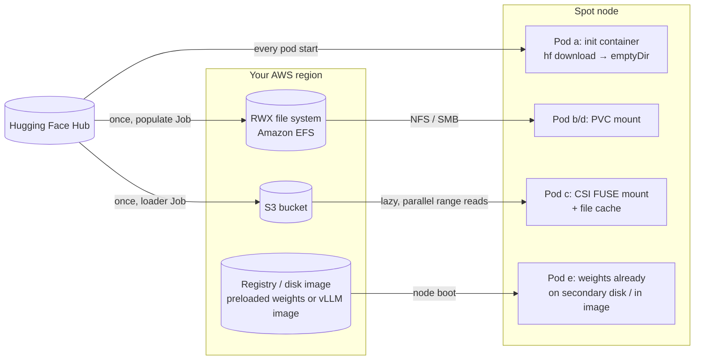
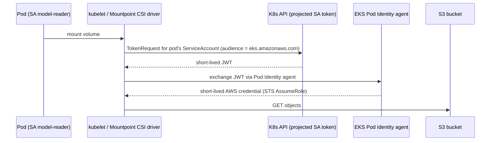

# 05 · Model Storage and Data

> Getting model weights onto a (spot) node quickly, safely and cheaply: init-container downloads,
> PVC caches, object storage mounted with the Mountpoint for S3 CSI driver, a shared file system, and
> preloaded disks and images, on **EKS**, using AWS's keyless EKS Pod Identity.

---

## Before you start

This chapter's labs need **no GPU** (every serving pod uses `vllm/vllm-openai-cpu:v0.29.0`), so it
only needs [`00-prerequisites-and-cluster-setup`](../00-prerequisites-and-cluster-setup)'s cluster
and tools — not chapter 01/02's GPU node pools. Step 2 (object storage) and Step 4 (shared FS) do
need AWS IAM permissions to create buckets/roles/Pod Identity associations and a new CPU node group —
make sure your account has that before starting.

## 1. Why this matters

In a normal microservice, the container image *is* the application: a few hundred MB, pulled in seconds.
An LLM server is different. It is a large image (the `vllm/vllm-openai:v0.29.0` image is ~9.6 GB compressed)
**plus** a separate set of model files that can be 1 GB to over 1 TB. Every time a pod starts, it has to get both onto the node. That happens:

- on every scale-up (chapter `10-autoscaling-inference`),
- on every rollout,
- and, **because we run on spot**, every time a node is reclaimed, which can be several times a day.

If you get this wrong, you get 10-minute cold starts, `ImagePullBackOff`, nodes whose ephemeral storage fills up, surprise egress bills,
Hugging Face rate limits (HTTP 429), and serving replicas that load a half-written model.
In DevOps terms, model delivery is **artifact distribution**. You deal with the same concerns as for any artifact: immutability, versioning, least-privilege access, caching and locality.

## 2. Learning objectives & time plan (~3 h)

By the end you can:

1. Estimate model size and cold-start time from parameter count, precision and storage throughput.
2. Compare five delivery patterns and pick one per use case.
3. Mount a bucket into pods with the Mountpoint for Amazon S3 CSI driver and **keyless** identity:
   EKS Pod Identity.
4. Populate a shared RWX cache (Amazon EFS) with a Job and serve from it.
5. Explain image/disk preloading on EKS (SOCI parallel pull).

| Block | Time | What |
|---|---|---|
| Theory | 45 min | §3 concepts, cold-start math, pattern comparison |
| Lab A (any cluster) | 30 min | cpu-lab: init-container download, then RWO PVC cache |
| Lab B (your cloud) | 60 min | bucket + IAM, upload Job, serve from mount |
| Lab C (optional) | 30 min | RWX shared file system |
| Review | 15 min | spot notes, troubleshooting, checkpoint questions |

## 3. Concepts

### 3.1 How big is a model? Cold-start math

**Weights size ≈ parameters × bytes per parameter**

| Precision | Bytes/param | 0.6B | 8B | 70B |
|---|---|---|---|---|
| FP32 | 4 | 2.4 GB | 32 GB | 280 GB |
| BF16 / FP16 (typical checkpoint) | 2 | 1.2 GB | 16 GB | 140 GB |
| FP8 / INT8 | 1 | 0.6 GB | 8 GB | 70 GB |
| INT4 (AWQ/GPTQ) | ~0.5 | 0.3 GB | 4 GB | 35 GB |

Check against real files: `Qwen/Qwen3-0.6B` has a 1.50 GB `model.safetensors`. The `Qwen/Qwen3-8B` repo is ~16.4 GB
(check with `curl -s "https://huggingface.co/api/models/Qwen/Qwen3-8B?blobs=true" | jq '[.siblings[].size]|add'`).

**Cold start = node provisioning + image pull + weights fetch + weights load to device + warm-up**

`fetch time ≈ size ÷ effective throughput`

| Source → node | Effective throughput (order of magnitude, varies a lot) | 16 GB (8B BF16) |
|---|---|---|
| Hugging Face Hub over internet | 50–250 MB/s, subject to rate limits | 1–5 min |
| Same-region bucket, single stream | ~100–200 MB/s | ~1.5–3 min |
| Same-region bucket, parallel range reads (Mountpoint) | 500 MB/s – 1+ GB/s | 15–30 s |
| NFS (Amazon EFS) | throughput-mode dependent: 100 MB/s – 1+ GB/s | 15 s – 3 min |
| Already on local disk (preloaded / page cache) | 1–4 GB/s (NVMe/PD) | 4–15 s |

The throughput figures are rough planning numbers, not benchmarks. Measure your own: every lab Job prints `time` for each step.

A worked spot example (8B model on an L4 spot node, init-container download from the Hub):
~90 s node boot + GPU driver, ~180 s vLLM image pull, ~120 s download, ~30 s load and CUDA graph capture, so **~7 min**.
With a preloaded image and a parallel bucket mount, the same pod starts in **~2.5 min**. With more replicas and more spot reclaims, those minutes add up.

### 3.2 The five delivery patterns



| Pattern | Cold start | Ops cost | Spot fit | When |
|---|---|---|---|---|
| **(a) init container → emptyDir** | Worst: full download every start | Lowest | Poor. Every reclaim re-downloads, and HF rate limits hit you | Demos, tiny models, CI |
| **(b) RWO PVC cache** (PD / EBS / Managed Disk) | Good after first fill | Medium | Risky. Disks are **zonal** and RWO, so a spot replacement in another zone can't attach | Single replica, single zone |
| **(c) Object storage + CSI FUSE** | Good with file cache and parallel download | Low. The bucket is the source of truth, and the same bucket also holds checkpoints (ch07) | **Best.** Regional, any node, any zone | Default for production |
| **(d) RWX shared FS** | Good; depends on tier | Medium–high ($$ minimums) | Good. Regional/multi-AZ | POSIX semantics needed, many small files, training datasets |
| **(e) Baked image / preloaded disk** | Best | High. Rebuild per model version; images >10 GB are painful | Good. Nodes boot with data | Few hot models, strict latency SLOs |

Rules of thumb:

- **Pin revisions.** `Qwen/Qwen3-0.6B@c1899de…`, not `main`. Store under an immutable path such as `models/<name>/<revision>/`.
- **Write a completion marker last** (`_COMPLETE`). Serving pods wait for it, so a loader that was interrupted mid-copy (spot!) is never served.
- **Separate writer and reader identities.** Only the loader Job can write, and serving pods get read-only access.
- **Keep data in the cluster's region.** Cross-region reads cost egress and time.

### 3.3 The object-storage CSI driver: Mountpoint for Amazon S3

| | EKS: Mountpoint for Amazon S3 CSI (v2) |
|---|---|
| Enable | EKS add-on `aws-mountpoint-s3-csi-driver` |
| CSI driver name | `s3.csi.aws.com` |
| Where FUSE runs | separate Mountpoint pod in `mount-s3` namespace on the same node |
| Identity | EKS Pod Identity (or IRSA); `authenticationSource: pod` for per-pod roles |
| Read-perf knobs | `cache: emptyDir`, `metadata-ttl`, `max-threads` |
| Write semantics | new files only by default; no rename (general-purpose buckets); `allow-overwrite`/`allow-delete` opt-in |

Why does the loader Job download to an **emptyDir first and then `cp`**? `hf download` writes `*.incomplete` temp files and renames them.
Mountpoint doesn't support rename on general-purpose buckets, so a plain sequential `cp` of new files is what works.

### 3.4 Keyless identity on EKS (why no access keys)



Nothing long-lived is stored in the cluster. The IAM Pod Identity association names the **namespace and ServiceAccount**.
That makes RBAC on who can create pods with `serviceAccountName: model-writer` a security boundary (chapter `14-multi-tenancy-and-security`).

## 4. Lab

Layout:

```
05-model-storage-and-data/
├── common/
│   ├── base/             namespace ch05-models, ConfigMap model-coordinates, SAs model-writer/model-reader
│   ├── object-storage/   upload-model Job + qwen-from-bucket Deployment (expects PVC "model-bucket")
│   ├── shared-fs/        model-cache PVC + populate Job + qwen-from-pvc Deployment (2 replicas)
│   └── init-container/   qwen-init-download Deployment
├── eks/                  object-storage overlay + kustomize resources; shared-fs/ sub-overlay
└── cpu-lab/              init-container (default) and pvc-cache/ – any cluster, no IAM
```

All serving pods use `vllm/vllm-openai-cpu:v0.29.0`, so these labs need **no GPU**. The storage path is exactly what a GPU pod
would use. Chapter `09-llm-inference-with-vllm` swaps the image and adds `nvidia.com/gpu`.

```bash
source env.sh && source versions.env
# Optional (only for gated models): the Secret is referenced as optional by every loader.
kubectl create namespace ch05-models --dry-run=client -o yaml | kubectl apply -f -
kubectl -n ch05-models create secret generic hf-token --from-literal=HF_TOKEN="${HF_TOKEN}"
```

### Step 1 · CPU lab: pattern (a), then (b)

```bash
kubectl apply -k 05-model-storage-and-data/cpu-lab
kubectl -n ch05-models logs deploy/qwen-init-download -c fetch-model -f
```

Example output:

```
Fetching 7 files: 100%|██████████| 7/7 [00:21<00:00,  3.02s/it]
real    0m24.310s
1.5G    /models/model
```

```bash
kubectl -n ch05-models rollout status deploy/qwen-init-download --timeout=10m
kubectl -n ch05-models port-forward svc/qwen-init-download 8000:8000 &
curl -s localhost:8000/v1/chat/completions -H 'Content-Type: application/json' \
  -d '{"model":"qwen3-0.6b","messages":[{"role":"user","content":"Say hi in 5 words /no_think"}],"max_tokens":30}' | jq -r '.choices[0].message.content'
```

**Now simulate a spot reclaim:** `kubectl -n ch05-models delete pod -l app=qwen-init-download`. Watch the whole download run again.

Next, pattern (b) with an RWO PVC on the default StorageClass:

```bash
kubectl delete -k 05-model-storage-and-data/cpu-lab
kubectl apply -k 05-model-storage-and-data/cpu-lab/pvc-cache
kubectl -n ch05-models wait --for=condition=complete job/populate-model-cache --timeout=15m
kubectl -n ch05-models delete pod -l app=qwen-from-pvc   # restart: no download, loads from disk
```

### Step 2 · Object storage

What you're about to do: create a bucket, grant your pods keyless read/write access to it via EKS Pod
Identity, upload the model once with a loader Job, then serve it straight from the mount — this is
pattern (c), the "best for production" row from section 3.2.

Create the spot CPU node group for this chapter (Intel instance types with AVX-512, which the vLLM
CPU backend needs; [`eks/nodegroup-ch05.yaml`](eks/nodegroup-ch05.yaml) also defines an on-demand
fallback group at `desiredCapacity: 0` — edit `metadata.name`/`region` to match `env.sh` first):
```bash
eksctl create nodegroup -f 05-model-storage-and-data/eks/nodegroup-ch05.yaml
```

What you're about to do next: create the S3 bucket (same region as the cluster), the EKS add-ons
(Pod Identity agent + Mountpoint for S3 CSI driver), and two IAM roles — a **writer** role
(`ListBucket`/`GetObject`/`PutObject`/`AbortMultipartUpload`) and a **reader** role
(`ListBucket`/`GetObject` only) — each bound via a Pod Identity association to this chapter's
`model-writer`/`model-reader` ServiceAccounts. Separating writer and reader identities means only the
loader Job can write; serving pods get read-only access.
```bash
: "${AWS_REGION:?source env.sh}" "${EKS_CLUSTER:?}" "${AWS_ACCOUNT_ID:?}"
NS=ch05-models
BUCKET="${S3_BUCKET:-${AWS_ACCOUNT_ID}-ch05-models}"
TMP="$(mktemp -d)"

# bucket (same region as the cluster)
if ! aws s3api head-bucket --bucket "${BUCKET}" 2>/dev/null; then
  if [[ "${AWS_REGION}" == "us-east-1" ]]; then
    aws s3api create-bucket --bucket "${BUCKET}" --region "${AWS_REGION}"
  else
    aws s3api create-bucket --bucket "${BUCKET}" --region "${AWS_REGION}" \
      --create-bucket-configuration "LocationConstraint=${AWS_REGION}"
  fi
  aws s3api put-public-access-block --bucket "${BUCKET}" \
    --public-access-block-configuration BlockPublicAcls=true,IgnorePublicAcls=true,BlockPublicPolicy=true,RestrictPublicBuckets=true
fi

# add-ons: Pod Identity agent + Mountpoint for S3 CSI driver
for addon in eks-pod-identity-agent aws-mountpoint-s3-csi-driver; do
  if ! aws eks describe-addon --cluster-name "${EKS_CLUSTER}" --addon-name "${addon}" --region "${AWS_REGION}" >/dev/null 2>&1; then
    aws eks create-addon --cluster-name "${EKS_CLUSTER}" --addon-name "${addon}" --region "${AWS_REGION}"
  fi
done

# trust policy for EKS Pod Identity
cat > "${TMP}/trust.json" <<JSON
{
  "Version": "2012-10-17",
  "Statement": [{
    "Effect": "Allow",
    "Principal": {"Service": "pods.eks.amazonaws.com"},
    "Action": ["sts:AssumeRole", "sts:TagSession"]
  }]
}
JSON

# permission policies (Mountpoint's documented least-privilege actions)
cat > "${TMP}/reader.json" <<JSON
{
  "Version": "2012-10-17",
  "Statement": [
    {"Effect": "Allow", "Action": ["s3:ListBucket"], "Resource": ["arn:aws:s3:::${BUCKET}"]},
    {"Effect": "Allow", "Action": ["s3:GetObject"], "Resource": ["arn:aws:s3:::${BUCKET}/*"]}
  ]
}
JSON
cat > "${TMP}/writer.json" <<JSON
{
  "Version": "2012-10-17",
  "Statement": [
    {"Effect": "Allow", "Action": ["s3:ListBucket"], "Resource": ["arn:aws:s3:::${BUCKET}"]},
    {"Effect": "Allow", "Action": ["s3:GetObject", "s3:PutObject", "s3:AbortMultipartUpload"],
     "Resource": ["arn:aws:s3:::${BUCKET}/*"]}
  ]
}
JSON

for who in reader writer; do
  ROLE="ch05-model-${who}-${EKS_CLUSTER}"
  if ! aws iam get-role --role-name "${ROLE}" >/dev/null 2>&1; then
    aws iam create-role --role-name "${ROLE}" --assume-role-policy-document "file://${TMP}/trust.json"
  fi
  aws iam put-role-policy --role-name "${ROLE}" --policy-name s3-models \
    --policy-document "file://${TMP}/${who}.json"
  ROLE_ARN="$(aws iam get-role --role-name "${ROLE}" --query Role.Arn --output text)"

  EXISTING="$(aws eks list-pod-identity-associations --cluster-name "${EKS_CLUSTER}" --region "${AWS_REGION}" \
    --namespace "${NS}" --service-account "model-${who}" --query 'associations[0].associationId' --output text)"
  if [[ "${EXISTING}" == "None" || -z "${EXISTING}" ]]; then
    aws eks create-pod-identity-association --cluster-name "${EKS_CLUSTER}" --region "${AWS_REGION}" \
      --namespace "${NS}" --service-account "model-${who}" --role-arn "${ROLE_ARN}"
  fi
done

printf '# written by the IAM setup above\nS3_BUCKET=%s\n' "${BUCKET}" > 05-model-storage-and-data/eks/bucket.env
rm -rf "${TMP}"
cat 05-model-storage-and-data/eks/bucket.env
```

Now apply the overlay, upload the model with the loader Job, and let the serving Deployment pick it
up from the mount:
```bash
kubectl kustomize 05-model-storage-and-data/eks | less  # review first
kubectl apply -k 05-model-storage-and-data/eks
kubectl -n mount-s3 get pods -o wide        # Mountpoint pods run beside your workload pods
kubectl -n ch05-models logs job/upload-model -f
aws s3 ls "s3://$(grep S3_BUCKET 05-model-storage-and-data/eks/bucket.env | cut -d= -f2)/models/qwen3-0.6b/" --recursive --human-readable
kubectl -n ch05-models rollout status deploy/qwen-from-bucket --timeout=15m
```
How to tell this worked: `kubectl -n mount-s3 get pods` shows a Mountpoint pod `Running` next to
your workload pod's node, the upload Job log ends with a `_COMPLETE` write, `aws s3 ls` lists the
model files under `models/qwen3-0.6b/`, and `rollout status` reports the deployment available.

Things to notice:
- `authenticationSource: pod` (set in [`eks/pv-pvc-mountpoint.yaml`](eks/pv-pvc-mountpoint.yaml))
  makes the Mountpoint process use **the workload pod's** ServiceAccount credentials. Two pods
  mounting the same PV get different permissions (writer vs reader). With the default (`driver`),
  every pod in the cluster shares the driver's role.
- Mountpoint's defaults (write new files, no overwrite, no delete) suit immutable model paths well.
- Pod Identity trust policy principal: `pods.eks.amazonaws.com`, actions `sts:AssumeRole` + `sts:TagSession`.

### Step 3 · Verify the serving pod reads from the mount

```bash
kubectl -n ch05-models exec deploy/qwen-from-bucket -c vllm -- sh -c 'ls -la /models/models/qwen3-0.6b/*/ && mount | grep -i -E "fuse|models"'
kubectl -n ch05-models logs deploy/qwen-from-bucket -c vllm | grep -i -E "loading|weights|took"
kubectl -n ch05-models port-forward svc/qwen-from-bucket 8000:8000 &
curl -s localhost:8000/v1/models | jq -r '.data[].id'     # qwen3-0.6b
```

Delete the pod and compare startup time with Step 1 (a). Then scale to 2 replicas. A second replica on the same node only benefits from Mountpoint's local cache if it shares the same cache volume — by default each pod has its own `cache: emptyDir`, so think about this before relying on it.

### Step 4 (optional) · Shared RWX file system

EKS uses Amazon EFS, `efs-models` StorageClass (`efs-ap` provisioning mode, one access point per
PVC), billed per GB stored plus elastic throughput.

What you're about to do: create an EFS file system reachable from the cluster (one mount target per
AZ, NFS port 2049 opened from the cluster security group), install the EFS CSI add-on, and give its
controller (`efs-csi-controller-sa`) permission to manage access points via EKS Pod Identity.
```bash
: "${AWS_REGION:?source env.sh}" "${EKS_CLUSTER:?}"
TMP="$(mktemp -d)"

VPC_ID="$(aws eks describe-cluster --name "${EKS_CLUSTER}" --region "${AWS_REGION}" --query cluster.resourcesVpcConfig.vpcId --output text)"
CLUSTER_SG="$(aws eks describe-cluster --name "${EKS_CLUSTER}" --region "${AWS_REGION}" --query cluster.resourcesVpcConfig.clusterSecurityGroupId --output text)"
SUBNETS="$(aws eks describe-cluster --name "${EKS_CLUSTER}" --region "${AWS_REGION}" --query 'cluster.resourcesVpcConfig.subnetIds[]' --output text)"

FS_ID="$(aws efs create-file-system --region "${AWS_REGION}" --encrypted \
  --performance-mode generalPurpose --throughput-mode elastic \
  --tags "Key=Name,Value=${EKS_CLUSTER}-ch05-models" --query FileSystemId --output text)"
echo "created ${FS_ID}; waiting for it to become available"
until [[ "$(aws efs describe-file-systems --file-system-id "${FS_ID}" --region "${AWS_REGION}" --query 'FileSystems[0].LifeCycleState' --output text)" == "available" ]]; do sleep 5; done

# NFS (2049) from the cluster security group
EFS_SG="$(aws ec2 create-security-group --region "${AWS_REGION}" --vpc-id "${VPC_ID}" \
  --group-name "${EKS_CLUSTER}-ch05-efs" --description "EFS for ch05" --query GroupId --output text)"
aws ec2 authorize-security-group-ingress --region "${AWS_REGION}" --group-id "${EFS_SG}" \
  --protocol tcp --port 2049 --source-group "${CLUSTER_SG}"

# one mount target per AZ
SEEN_AZ=" "   # plain string, works with macOS bash 3.2
for s in ${SUBNETS}; do
  az="$(aws ec2 describe-subnets --subnet-ids "${s}" --region "${AWS_REGION}" --query 'Subnets[0].AvailabilityZone' --output text)"
  case "${SEEN_AZ}" in *" ${az} "*) continue ;; esac
  SEEN_AZ="${SEEN_AZ}${az} "
  aws efs create-mount-target --region "${AWS_REGION}" --file-system-id "${FS_ID}" \
    --subnet-id "${s}" --security-groups "${EFS_SG}"
done

# EFS CSI controller identity (Pod Identity) + add-on
cat > "${TMP}/trust.json" <<JSON
{"Version":"2012-10-17","Statement":[{"Effect":"Allow","Principal":{"Service":"pods.eks.amazonaws.com"},"Action":["sts:AssumeRole","sts:TagSession"]}]}
JSON
ROLE="ch05-efs-csi-${EKS_CLUSTER}"
aws iam get-role --role-name "${ROLE}" >/dev/null 2>&1 || \
  aws iam create-role --role-name "${ROLE}" --assume-role-policy-document "file://${TMP}/trust.json"
aws iam attach-role-policy --role-name "${ROLE}" \
  --policy-arn arn:aws:iam::aws:policy/service-role/AmazonEFSCSIDriverPolicy
ROLE_ARN="$(aws iam get-role --role-name "${ROLE}" --query Role.Arn --output text)"

aws eks create-addon --cluster-name "${EKS_CLUSTER}" --region "${AWS_REGION}" \
  --addon-name aws-efs-csi-driver \
  --pod-identity-associations "serviceAccount=efs-csi-controller-sa,roleArn=${ROLE_ARN}" || true

printf '# written by the EFS setup above\nEFS_FILE_SYSTEM_ID=%s\n' "${FS_ID}" > 05-model-storage-and-data/eks/shared-fs/efs.env
rm -rf "${TMP}"
echo "EFS ${FS_ID} ready"
```

Apply the overlay and serve from the shared file system:
```bash
kubectl apply -k 05-model-storage-and-data/eks/shared-fs
kubectl -n ch05-models wait --for=condition=complete job/populate-model-cache --timeout=20m
kubectl -n ch05-models get pods -l app=qwen-from-pvc -o wide   # 2 replicas, possibly on different nodes/zones
```
How to tell this worked: the populate Job reports `condition=complete`, and both `qwen-from-pvc`
replicas are `Running` — including ones scheduled to a different node than the one that populated
the cache, since EFS is regional/multi-AZ.

Another shared-FS option worth knowing: **Amazon FSx for Lustre** (high-throughput training data),
covered conceptually in chapter `13-node-autoscaling-and-cost`.

### Step 5 (read-through) · Pattern (e): preloaded images/disks

- **EKS.** The SOCI snapshotter is bundled in recent EKS-optimized AL2023 and Bottlerocket AMIs. **SOCI parallel pull mode**
  speeds up downloading and unpacking big images (AWS reports ~60% faster on a 10 GB DLC image). It is **not enabled by default** and is switched on through node configuration
  (AL2023 `NodeConfig` / Bottlerocket settings). You can also snapshot an EBS data volume with images pre-pulled and use it in the
  Karpenter `EC2NodeClass` `blockDeviceMappings`. See chapter `13-node-autoscaling-and-cost`.
- **Baking weights into the image** works for small models. For 16 GB+ it doubles registry storage, slows every CI push, and couples
  model and runtime releases. Prefer an OCI artifact or a bucket.

## 5. Spot considerations

- **Reclaim = cold start.** Budget the pattern's cold start × expected reclaims/day. Pattern (a) turns every reclaim into an HF download.
  That is slow, and the Hub may rate-limit a fleet of restarting pods.
- **Loader Jobs must tolerate interruption.** They use `podFailurePolicy` with `DisruptionTarget → Ignore`, so reclaims don't use up
  `backoffLimit` (chapter `06-batch-jobs-and-kueue` goes deep on this). Writes are idempotent (skip if `_COMPLETE`), and `hf download` resumes.
- **Zonal disks vs regional capacity.** Spot capacity moves between zones. RWO PD/EBS/Managed Disk PVCs pin pods to one zone.
  Buckets and regional file systems don't.
- **Ephemeral storage.** emptyDir downloads and FUSE file caches land on the node boot disk. Spot node pools often use small disks,
  so size them for model + cache + images, or the kubelet evicts pods for `ephemeral-storage`.
- **Graceful shutdown.** Mountpoint runs as a separate pod, so it outlives your container during termination.
  AWS's spot interruption notice window is 2 minutes, so don't rely on long `preStop` hooks.

## 6. Troubleshooting

| Symptom | Likely cause | Fix |
|---|---|---|
| Mountpoint pod `mp-…` in `mount-s3` Pending | No room on the node for the Mountpoint pod | Leave CPU/memory headroom; see driver docs `HEADROOM_FOR_MPPOD.md` |
| `Access Denied` on mount | No pod identity association for this namespace/SA, or `eks-pod-identity-agent` add-on missing | `aws eks list-pod-identity-associations --cluster-name ...` |
| `cp: ... Operation not permitted` writing over an existing file | Mountpoint forbids overwrite by default | Use a new revision path, or add `allow-overwrite` |
| Serving pod stuck in `wait-for-model` | Loader not done, or metadata cache hides the new `_COMPLETE` | Check Job logs; lower metadata/negative-cache TTLs |
| `Multi-Attach error for volume` (pvc-cache) | RWO disk already attached on another node | Use RWX (shared-fs) or keep Job and Deployment on one node |
| Pod evicted: `ephemeral-storage` | emptyDir/cache bigger than limits or node disk | Raise `sizeLimit`/limits; bigger boot disks |
| Loader `429 Too Many Requests` from Hugging Face | Unauthenticated / many parallel downloads | Set `HF_TOKEN`; download once to a bucket (pattern c) |
| vLLM CPU crashes with `Illegal instruction` | CPU lacks the instruction set vLLM's CPU build expects | Use AVX-512 instance families (m7i/m6i) |

## 7. Cleanup & cost notes

What you're about to do: delete the CPU-lab resources, then tear down the object-storage/shared-fs
kustomize resources, IAM roles, Pod Identity associations and this chapter's node groups
(`DELETE_BUCKET=true` also empties and deletes the S3 bucket — omit it to keep the model for ch09/ch10).
```bash
kubectl delete -k 05-model-storage-and-data/cpu-lab --ignore-not-found

: "${AWS_REGION:?source env.sh}" "${EKS_CLUSTER:?}"
# shellcheck disable=SC1091
source 05-model-storage-and-data/eks/bucket.env

kubectl delete -k 05-model-storage-and-data/eks/shared-fs --ignore-not-found || true
kubectl delete -k 05-model-storage-and-data/eks --ignore-not-found || true

for id in $(aws eks list-pod-identity-associations --cluster-name "${EKS_CLUSTER}" --region "${AWS_REGION}" \
      --namespace ch05-models --query 'associations[].associationId' --output text); do
  aws eks delete-pod-identity-association --cluster-name "${EKS_CLUSTER}" --region "${AWS_REGION}" --association-id "${id}"
done
for who in reader writer; do
  ROLE="ch05-model-${who}-${EKS_CLUSTER}"
  aws iam delete-role-policy --role-name "${ROLE}" --policy-name s3-models || true
  aws iam delete-role --role-name "${ROLE}" || true
done

if [[ "${DELETE_BUCKET:-false}" == "true" ]]; then
  aws s3 rm "s3://${S3_BUCKET}" --recursive
  aws s3api delete-bucket --bucket "${S3_BUCKET}" --region "${AWS_REGION}"
fi

eksctl delete nodegroup --cluster "${EKS_CLUSTER}" --region "${AWS_REGION}" --name ch05-cpu-spot || true
eksctl delete nodegroup --cluster "${EKS_CLUSTER}" --region "${AWS_REGION}" --name ch05-cpu-ondemand || true
echo "EFS file system (if created in Step 4) is NOT deleted automatically — delete mount targets, then aws efs delete-file-system"
```

- Buckets: a 1.5 GB model costs cents per month. Keep it, because chapters 09–12 can reuse it. Watch **cross-region egress** and request charges; Mountpoint list calls add up on huge buckets.
- **EFS bills per stored GB plus elastic throughput** — no large provisioned minimum, but still not free; delete it when you're done with this chapter's labs.
- EFS file systems, mount targets and the security group are **not** removed by the cleanup above — delete them manually (see Step 4).

## 8. Checkpoint questions

1. A 32B model in BF16: how big are the weights? Roughly how long does fetching them take at 150 MB/s versus 1 GB/s?
2. Why does the loader Job copy from an emptyDir instead of running `hf download` straight into a Mountpoint mount?
3. You run inference on spot across three zones. Why is an RWO PVC model cache a poor fit, and what would you use instead?
4. What does `authenticationSource: pod` change in the Mountpoint CSI driver, and why does it matter for multi-tenant clusters?
5. Why does the EFS StorageClass use `provisioningMode: efs-ap` (one access point per PVC) instead of pointing every PVC at the file system root?
6. Why write a `_COMPLETE` marker, and why must it be written last?
7. Which EKS mechanism shortens the image-pull part of the cold start, and why is it not on by default?

<details>
<summary>Answers</summary>

1. 32B × 2 bytes ≈ 64 GB. At 150 MB/s that is ~7 min; at 1 GB/s ~64 s. That doesn't include image pull or GPU load time.
2. `hf download` writes temp files and renames them. Mountpoint doesn't support rename on general-purpose buckets. A plain sequential `cp` of new files is what actually works.
3. Disks are zonal and RWO. A replacement node in another zone can't attach the disk, and one disk can't serve replicas on several nodes. Use a bucket mount (regional) or an RWX regional file system (EFS).
4. The Mountpoint process uses the workload pod's ServiceAccount (EKS Pod Identity / IRSA) instead of one driver-wide role. Different pods get different S3 permissions from the same PV, which gives you tenant isolation and least privilege.
5. Access points give each PVC its own root directory and POSIX user/group enforcement inside the shared file system, so multiple PVCs (and multiple chapters/tenants) can share one EFS file system without one PVC being able to read another's directory tree.
6. The loader can be interrupted at any time (spot). Readers wait for the marker, so they never load a partial model. If it were written first, a partial upload would look complete.
7. SOCI parallel pull mode on EKS-optimized AL2023/Bottlerocket AMIs. It's opt-in via node configuration because it changes how image layers are pulled and unpacked, and not every image/registry benefits equally.
</details>

## 9. Further reading

- [Mountpoint for S3 CSI driver (GitHub)](https://github.com/awslabs/mountpoint-s3-csi-driver/blob/main/docs/CONFIGURATION.md), [EKS user guide – S3 CSI](https://docs.aws.amazon.com/eks/latest/userguide/s3-csi.html), [EKS Pod Identity](https://docs.aws.amazon.com/eks/latest/userguide/pod-identities.html), [EFS CSI](https://docs.aws.amazon.com/eks/latest/userguide/efs-csi.html), [SOCI parallel pull mode](https://aws.amazon.com/blogs/containers/introducing-seekable-oci-parallel-pull-mode-for-amazon-eks/), [EKS AI/ML performance best practices](https://docs.aws.amazon.com/eks/latest/best-practices/aiml-performance.html)
- [Hugging Face `hf download`](https://huggingface.co/docs/huggingface_hub/guides/cli)

## Versions tested

| Component | Version |
|---|---|
| vLLM CPU image | `vllm/vllm-openai-cpu:v0.29.0` (`VLLM_VERSION`) |
| uv image (loader) | `ghcr.io/astral-sh/uv:0.12.15-python3.12-trixie-slim` *(not in versions.env)* |
| huggingface_hub (`hf` CLI) | `1.31.0` *(not in versions.env)* |
| Model | `Qwen/Qwen3-0.6B` @ `c1899de289a04d12100db370d81485cdf75e47ca` |
| Mountpoint for S3 CSI driver | v2.8.0 (EKS add-on version depends on cluster) *(not in versions.env)* |
| busybox | `1.37` |
