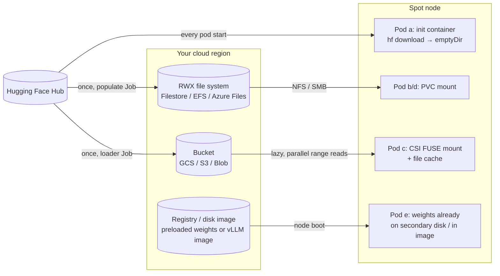
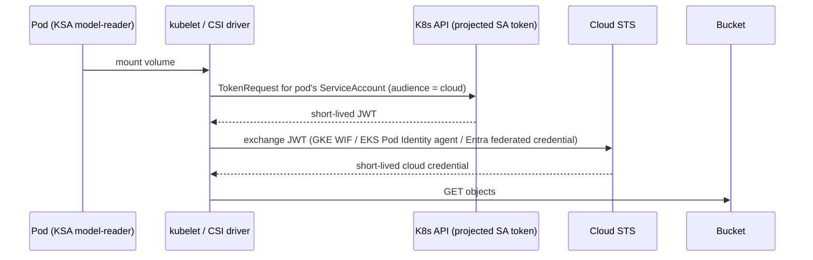

# 05 · Model Storage and Data

> Getting model weights onto a (spot) node quickly, safely and cheaply: init-container downloads,
> PVC caches, object storage mounted with CSI FUSE drivers, shared file systems, and preloaded disks and images,
> on **GKE, EKS and AKS**, using each cloud's keyless workload identity.

---

## Before you start

This chapter's labs need **no GPU** (every serving pod uses `vllm/vllm-openai-cpu:v0.29.0`), so it
only needs [`00-prerequisites-and-cluster-setup`](../00-prerequisites-and-cluster-setup)'s cluster
and tools — not chapter 01/02's GPU node pools. Step 2 (object storage) and Step 4 (shared FS) do
need cloud IAM permissions to create buckets/roles/identities and, on GKE/AKS, a new CPU node pool —
make sure your account has that before starting.

## 1. Why this matters

In a normal microservice, the container image *is* the application: a few hundred MB, pulled in seconds.
An LLM server is different. It is a large image (the `vllm/vllm-openai:v0.29.0` image is ~9.6 GB compressed)
**plus** a separate set of model files that can be 1 GB to over 1 TB. Every time a pod starts, it has to get both onto the node. That happens:

- on every scale-up (chapter `10-autoscaling-inference`),
- on every rollout,
- and, **because we run on spot**, every time a node is reclaimed, which can be several times a day.

If you get this wrong, you get 10-minute cold starts, `ImagePullBackOff`, nodes whose ephemeral storage fills up, surprise egress bills,
Hugging Face rate limits (HTTP 429), and serving replicas that load a half-written model.
In DevOps terms, model delivery is **artifact distribution**. You deal with the same concerns as for any artifact: immutability, versioning, least-privilege access, caching and locality.

## 2. Learning objectives & time plan (~3 h)

By the end you can:

1. Estimate model size and cold-start time from parameter count, precision and storage throughput.
2. Compare five delivery patterns and pick one per use case.
3. Mount a bucket into pods on each cloud with its CSI driver and **keyless** identity:
   GCS FUSE + Workload Identity Federation for GKE, Mountpoint for S3 + EKS Pod Identity, Blob CSI (blobfuse2) + Azure Workload Identity.
4. Populate a shared RWX cache (Filestore / EFS / Azure Files) with a Job and serve from it.
5. Explain image/disk preloading (GKE secondary boot disks, EKS SOCI parallel pull, AKS artifact streaming).

| Block | Time | What |
|---|---|---|
| Theory | 45 min | §3 concepts, cold-start math, pattern comparison |
| Lab A (any cluster) | 30 min | cpu-lab: init-container download, then RWO PVC cache |
| Lab B (your cloud) | 60 min | bucket + IAM, upload Job, serve from mount |
| Lab C (optional) | 30 min | RWX shared file system |
| Review | 15 min | spot notes, troubleshooting, checkpoint questions |

## 3. Concepts

### 3.1 How big is a model? Cold-start math

**Weights size ≈ parameters × bytes per parameter**

| Precision | Bytes/param | 0.6B | 8B | 70B |
|---|---|---|---|---|
| FP32 | 4 | 2.4 GB | 32 GB | 280 GB |
| BF16 / FP16 (typical checkpoint) | 2 | 1.2 GB | 16 GB | 140 GB |
| FP8 / INT8 | 1 | 0.6 GB | 8 GB | 70 GB |
| INT4 (AWQ/GPTQ) | ~0.5 | 0.3 GB | 4 GB | 35 GB |

Check against real files: `Qwen/Qwen3-0.6B` has a 1.50 GB `model.safetensors`. The `Qwen/Qwen3-8B` repo is ~16.4 GB
(check with `curl -s "https://huggingface.co/api/models/Qwen/Qwen3-8B?blobs=true" | jq '[.siblings[].size]|add'`).

**Cold start = node provisioning + image pull + weights fetch + weights load to device + warm-up**

`fetch time ≈ size ÷ effective throughput`

| Source → node | Effective throughput (order of magnitude, varies a lot) | 16 GB (8B BF16) |
|---|---|---|
| Hugging Face Hub over internet | 50–250 MB/s, subject to rate limits | 1–5 min |
| Same-region bucket, single stream | ~100–200 MB/s | ~1.5–3 min |
| Same-region bucket, parallel range reads (GCS FUSE parallel downloads, Mountpoint, blobfuse2 block cache) | 500 MB/s – 1+ GB/s | 15–30 s |
| NFS (Filestore/EFS/Azure Files) | tier/throughput-mode dependent: 100 MB/s – 1+ GB/s | 15 s – 3 min |
| Already on local disk (preloaded / page cache) | 1–4 GB/s (NVMe/PD) | 4–15 s |

The throughput figures are rough planning numbers, not benchmarks. Measure your own: every lab Job prints `time` for each step.

A worked spot example (8B model on an L4 spot node, init-container download from the Hub):
~90 s node boot + GPU driver, ~180 s vLLM image pull, ~120 s download, ~30 s load and CUDA graph capture, so **~7 min**.
With a preloaded image and a parallel bucket mount, the same pod starts in **~2.5 min**. With more replicas and more spot reclaims, those minutes add up.

### 3.2 The five delivery patterns



| Pattern | Cold start | Ops cost | Spot fit | When |
|---|---|---|---|---|
| **(a) init container → emptyDir** | Worst: full download every start | Lowest | Poor. Every reclaim re-downloads, and HF rate limits hit you | Demos, tiny models, CI |
| **(b) RWO PVC cache** (PD / EBS / Managed Disk) | Good after first fill | Medium | Risky. Disks are **zonal** and RWO, so a spot replacement in another zone can't attach | Single replica, single zone |
| **(c) Object storage + CSI FUSE** | Good with file cache and parallel download | Low. The bucket is the source of truth, and the same bucket also holds checkpoints (ch07) | **Best.** Regional, any node, any zone | Default for production |
| **(d) RWX shared FS** | Good; depends on tier | Medium–high ($$ minimums) | Good. Regional/multi-AZ | POSIX semantics needed, many small files, training datasets |
| **(e) Baked image / preloaded disk** | Best | High. Rebuild per model version; images >10 GB are painful | Good. Nodes boot with data | Few hot models, strict latency SLOs |

Rules of thumb:

- **Pin revisions.** `Qwen/Qwen3-0.6B@c1899de…`, not `main`. Store under an immutable path such as `models/<name>/<revision>/`.
- **Write a completion marker last** (`_COMPLETE`). Serving pods wait for it, so a loader that was interrupted mid-copy (spot!) is never served.
- **Separate writer and reader identities.** Only the loader Job can write, and serving pods get read-only access.
- **Keep data in the cluster's region.** Cross-region reads cost egress and time.

### 3.3 Object-storage CSI drivers compared

| | GKE: Cloud Storage FUSE CSI | EKS: Mountpoint for Amazon S3 CSI (v2) | AKS: Azure Blob CSI (blobfuse2) |
|---|---|---|---|
| Enable | add-on `GcsFuseCsiDriver` (default on Autopilot) | EKS add-on `aws-mountpoint-s3-csi-driver` | `az aks update --enable-blob-driver` |
| CSI driver name | `gcsfuse.csi.storage.gke.io` | `s3.csi.aws.com` | `blob.csi.azure.com` |
| Where FUSE runs | sidecar injected into your pod (annotation `gke-gcsfuse/volumes: "true"`) | separate Mountpoint pod in `mount-s3` namespace on the same node | blobfuse2 on the node (via blobfuse-proxy) |
| Identity | Workload Identity Federation for GKE: IAM role granted to `principal://…/subject/ns/NS/sa/KSA` | EKS Pod Identity (or IRSA); `authenticationSource: pod` for per-pod roles | Azure Workload Identity: UAMI + federated credential; `clientID` in PV |
| Read-perf knobs | `file-cache:max-size-mb`, `file-cache:enable-parallel-downloads`, `metadata-cache:*`, `gcsfuseMetadataPrefetchOnMount` | `cache: emptyDir`, `metadata-ttl`, `max-threads` | `--block-cache`/`--file-cache-timeout-in-seconds`, attr cache |
| Write semantics | sequential writes OK; rename = copy+delete (atomic only on HNS buckets) | new files only by default; no rename (general-purpose buckets); `allow-overwrite`/`allow-delete` opt-in | full-ish; rename supported |

Why does the loader Job download to an **emptyDir first and then `cp`**? `hf download` writes `*.incomplete` temp files and renames them.
Renames either aren't supported (Mountpoint on general-purpose buckets) or are non-atomic copies (GCS FUSE on flat buckets). A plain sequential `cp` of new files works everywhere.

### 3.4 Keyless identity on each cloud (why no access keys)



Nothing long-lived is stored in the cluster. The cloud IAM policy names the **namespace and ServiceAccount**.
That makes RBAC on who can create pods with `serviceAccountName: model-writer` a security boundary (chapter `14-multi-tenancy-and-security`).

## 4. Lab

Layout:

```
05-model-storage-and-data/
├── common/
│   ├── base/             namespace ch05-models, ConfigMap model-coordinates, SAs model-writer/model-reader
│   ├── object-storage/   upload-model Job + qwen-from-bucket Deployment (expects PVC "model-bucket")
│   ├── shared-fs/        model-cache PVC + populate Job + qwen-from-pvc Deployment (2 replicas)
│   └── init-container/   qwen-init-download Deployment
├── gke/  eks/  aks/      object-storage overlays + IAM scripts; shared-fs/ sub-overlays
└── cpu-lab/              init-container (default) and pvc-cache/ – any cluster, no IAM
```

All serving pods use `vllm/vllm-openai-cpu:v0.29.0`, so these labs need **no GPU**. The storage path is exactly what a GPU pod
would use. Chapter `09-llm-inference-with-vllm` swaps the image and adds `nvidia.com/gpu`.

```bash
source env.sh && source versions.env
# Optional (only for gated models): the Secret is referenced as optional by every loader.
kubectl create namespace ch05-models --dry-run=client -o yaml | kubectl apply -f -
kubectl -n ch05-models create secret generic hf-token --from-literal=HF_TOKEN="${HF_TOKEN}"
```

### Step 1 · CPU lab: pattern (a), then (b)

```bash
kubectl apply -k 05-model-storage-and-data/cpu-lab
kubectl -n ch05-models logs deploy/qwen-init-download -c fetch-model -f
```

Example output:

```
Fetching 7 files: 100%|██████████| 7/7 [00:21<00:00,  3.02s/it]
real    0m24.310s
1.5G    /models/model
```

```bash
kubectl -n ch05-models rollout status deploy/qwen-init-download --timeout=10m
kubectl -n ch05-models port-forward svc/qwen-init-download 8000:8000 &
curl -s localhost:8000/v1/chat/completions -H 'Content-Type: application/json' \
  -d '{"model":"qwen3-0.6b","messages":[{"role":"user","content":"Say hi in 5 words /no_think"}],"max_tokens":30}' | jq -r '.choices[0].message.content'
```

**Now simulate a spot reclaim:** `kubectl -n ch05-models delete pod -l app=qwen-init-download`. Watch the whole download run again.

Next, pattern (b) with an RWO PVC on the default StorageClass:

```bash
kubectl delete -k 05-model-storage-and-data/cpu-lab
kubectl apply -k 05-model-storage-and-data/cpu-lab/pvc-cache
kubectl -n ch05-models wait --for=condition=complete job/populate-model-cache --timeout=15m
kubectl -n ch05-models delete pod -l app=qwen-from-pvc   # restart: no download, loads from disk
```

### Step 2 · Object storage

What you're about to do: create a bucket, grant your pods keyless read/write access to it via each
cloud's workload identity mechanism, upload the model once with a loader Job, then serve it straight
from the mount — this is pattern (c), the "best for production" row from section 3.2.

<details><summary>GKE (Cloud Storage FUSE + Workload Identity Federation)</summary>

```bash
./05-model-storage-and-data/gke/create-nodepool.sh      # n2-standard-8 --spot pool + GcsFuseCsiDriver add-on
./05-model-storage-and-data/gke/setup-gcs-iam.sh        # bucket + roles/storage.objectUser (writer) / objectViewer (reader)
cat 05-model-storage-and-data/gke/bucket.env
kubectl kustomize 05-model-storage-and-data/gke | less  # review first
kubectl apply -k 05-model-storage-and-data/gke
kubectl -n ch05-models get pod -l app=upload-model -o jsonpath='{.items[0].spec.initContainers[*].name}'; echo
```
Expected output: `gke-gcsfuse-sidecar` is injected as a native sidecar (init container with
`restartPolicy: Always`).
```bash
kubectl -n ch05-models logs job/upload-model -c upload -f
gcloud storage ls -l "gs://$(grep GCS_BUCKET 05-model-storage-and-data/gke/bucket.env | cut -d= -f2)/models/qwen3-0.6b/**"
kubectl -n ch05-models rollout status deploy/qwen-from-bucket --timeout=15m
```
How to tell this worked: the upload Job log ends with a `_COMPLETE` write and `gcloud storage ls`
lists the model files under `models/qwen3-0.6b/`; `rollout status` reports the deployment available.

Things to notice in `gke/pv-pvc-gcsfuse.yaml`:
- `file-cache:max-size-mb:-1` plus `file-cache:enable-parallel-downloads:true`. Parallel downloads **require** the file cache,
  and the cache lives in an emptyDir on node ephemeral storage by default, so `gke-gcsfuse/ephemeral-storage-limit` must be large enough (we use `"0"` = unlimited, Standard clusters only).
- `metadata-cache:ttl-secs:60`. We use a finite TTL so the reader notices `_COMPLETE`. For immutable prefixes in production, `-1` together with `gcsfuseMetadataPrefetchOnMount: "true"` is faster.
- IAM is bound to `principal://iam.googleapis.com/projects/NUMBER/locations/global/workloadIdentityPools/PROJECT.svc.id.goog/subject/ns/ch05-models/sa/model-reader`. No Google service account and no KSA annotation are needed.

</details>

<details><summary>EKS (Mountpoint for S3 + EKS Pod Identity)</summary>

```bash
eksctl create nodegroup -f 05-model-storage-and-data/eks/nodegroup-ch05.yaml   # edit name/region first
./05-model-storage-and-data/eks/setup-s3-iam.sh   # bucket, add-ons, 2 roles, 2 pod identity associations
kubectl apply -k 05-model-storage-and-data/eks
kubectl -n mount-s3 get pods -o wide        # Mountpoint pods run beside your workload pods
kubectl -n ch05-models logs job/upload-model -f
aws s3 ls "s3://$(grep S3_BUCKET 05-model-storage-and-data/eks/bucket.env | cut -d= -f2)/models/qwen3-0.6b/" --recursive --human-readable
```
How to tell this worked: `kubectl -n mount-s3 get pods` shows a Mountpoint pod `Running` next to
your workload pod's node, and `aws s3 ls` lists the uploaded model files.

Things to notice:
- `authenticationSource: pod` makes the Mountpoint process use **the workload pod's** ServiceAccount credentials. Two pods
  mounting the same PV get different permissions (writer vs reader). With the default (`driver`), every pod in the cluster shares the driver's role.
- Mountpoint's defaults (write new files, no overwrite, no delete) suit immutable model paths well.
- Pod Identity trust policy principal: `pods.eks.amazonaws.com`, actions `sts:AssumeRole` + `sts:TagSession`.

</details>

<details><summary>AKS (Blob CSI / blobfuse2 + Azure Workload Identity)</summary>

```bash
./05-model-storage-and-data/aks/create-nodepool.sh      # OIDC + workload identity + blob driver; Spot pool ch05spot
./05-model-storage-and-data/aks/setup-blob-iam.sh       # storage account, container, UAMI, role, 2 federated credentials
kubectl apply -k 05-model-storage-and-data/aks
kubectl -n ch05-models logs job/upload-model -f
az storage blob list --account-name "$(grep AZ_STORAGE_ACCOUNT 05-model-storage-and-data/aks/bucket.env | cut -d= -f2)" \
  -c models --auth-mode login --prefix models/qwen3-0.6b/ -o table   # needs a Blob data role for *you*
```
How to tell this worked: the upload Job log ends clean and `az storage blob list` shows the
`models/qwen3-0.6b/` blobs (your own `az` identity needs a Blob data role to run that command — a
403 there is about *your* access, not the pod's).

Things to notice:
- The spot overlay needs **both** the nodeSelector and the toleration, because AKS taints spot nodes automatically.
- In default workload-identity mode the driver uses the identity to **fetch the storage account key**, so the identity needs
  *Storage Account Contributor* and effectively has full access to the account. The writer/reader split is enforced only by
  `readOnly` mounts here. For least privilege, use `mountWithWorkloadIdentityToken: "true"` (preview) with
  *Storage Blob Data Reader* / *Contributor*, and use separate PVs/identities for reader and writer.

</details>

### Step 3 · Verify the serving pod reads from the mount

```bash
kubectl -n ch05-models exec deploy/qwen-from-bucket -c vllm -- sh -c 'ls -la /models/models/qwen3-0.6b/*/ && mount | grep -i -E "fuse|models"'
kubectl -n ch05-models logs deploy/qwen-from-bucket -c vllm | grep -i -E "loading|weights|took"
kubectl -n ch05-models port-forward svc/qwen-from-bucket 8000:8000 &
curl -s localhost:8000/v1/models | jq -r '.data[].id'     # qwen3-0.6b
```

Delete the pod and compare startup time with Step 1 (a). Then scale to 2 replicas. On GKE the second replica on the same node benefits from the file cache only if it shares the node-level cache volume. By default each pod has its own cache, so think about this before relying on it.

### Step 4 (optional) · Shared RWX file system

| Cloud | Enable | StorageClass | Minimum / billing |
|---|---|---|---|
| GKE | `gke/shared-fs/enable-filestore.sh` | `standard-rwx` (Basic HDD) / `premium-rwx` | 1 TiB minimum on Basic HDD, billed on provisioned size |
| EKS | `eks/shared-fs/setup-efs.sh` (FS, mount targets, SG, add-on + Pod Identity for `efs-csi-controller-sa`) | `efs-models` (efs-ap) | pay per GB stored + elastic throughput |
| AKS | built in | `azurefile-csi-premium` | 100 GiB minimum, provisioned |

```bash
kubectl apply -k 05-model-storage-and-data/<gke|eks|aks>/shared-fs
kubectl -n ch05-models wait --for=condition=complete job/populate-model-cache --timeout=20m
kubectl -n ch05-models get pods -l app=qwen-from-pvc -o wide   # 2 replicas, possibly on different nodes/zones
```

Other shared-FS options worth knowing: GKE **Hyperdisk ML** (a read-only-many block volume built for model weights, attachable to many nodes),
**Amazon FSx for Lustre** (high-throughput training data), and **Azure Managed Lustre**. They are covered conceptually in chapter `13-node-autoscaling-and-cost`.

### Step 5 (read-through) · Pattern (e): preloaded images/disks

- **GKE secondary boot disks.** Build a disk image containing container images (or data) with `gke-disk-image-builder`, then
  create a node pool with `--enable-image-streaming --secondary-boot-disk=disk-image=global/images/IMAGE,mode=CONTAINER_IMAGE_CACHE`.
  In data mode (no `mode=`), the disk is mounted on the node under `/mnt/disks/gke-secondary-disks/gke-IMAGE-disk`, and pods reach it with a hostPath volume.
  See `gke/secondary-boot-disk.sh`. Also look at **Image streaming** (`--enable-image-streaming`), which lazily pulls image layers.
- **EKS.** The SOCI snapshotter is bundled in recent EKS-optimized AL2023 and Bottlerocket AMIs. **SOCI parallel pull mode**
  speeds up downloading and unpacking big images (AWS reports ~60% faster on a 10 GB DLC image). It is **not enabled by default** and is switched on through node configuration
  (AL2023 `NodeConfig` / Bottlerocket settings). You can also snapshot an EBS data volume with images pre-pulled and use it in the
  Karpenter `EC2NodeClass` `blockDeviceMappings`. See chapter `13-node-autoscaling-and-cost`.
- **AKS.** *Artifact streaming* for images in Azure Container Registry (preview) lazily loads layers:
  `az aks nodepool update ... --enable-artifact-streaming` (requires ACR Premium and enabling streaming on the repository).
- **Baking weights into the image** works for small models. For 16 GB+ it doubles registry storage, slows every CI push, and couples
  model and runtime releases. Prefer an OCI artifact or a bucket.

## 5. Spot considerations

- **Reclaim = cold start.** Budget the pattern's cold start × expected reclaims/day. Pattern (a) turns every reclaim into an HF download.
  That is slow, and the Hub may rate-limit a fleet of restarting pods.
- **Loader Jobs must tolerate interruption.** They use `podFailurePolicy` with `DisruptionTarget → Ignore`, so reclaims don't use up
  `backoffLimit` (chapter `06-batch-jobs-and-kueue` goes deep on this). Writes are idempotent (skip if `_COMPLETE`), and `hf download` resumes.
- **Zonal disks vs regional capacity.** Spot capacity moves between zones. RWO PD/EBS/Managed Disk PVCs pin pods to one zone.
  Buckets and regional file systems don't.
- **Ephemeral storage.** emptyDir downloads and FUSE file caches land on the node boot disk. Spot node pools often use small disks,
  so size them for model + cache + images, or the kubelet evicts pods for `ephemeral-storage`.
- **Graceful shutdown.** GCS FUSE runs as a native sidecar and Mountpoint as a separate pod, so both outlive your container during termination.
  Spot notice windows are short (GCP ~30 s, AWS 2 min, Azure ~30 s), so don't rely on long `preStop` hooks.

## 6. Troubleshooting

| Symptom | Likely cause | Fix |
|---|---|---|
| GKE pod stuck `ContainerCreating`, event `MountVolume.SetUp failed ... gcsfuse ... PermissionDenied` | IAM principal typo (project **number**, namespace, KSA), or node pool missing `--workload-metadata GKE_METADATA` | Re-run `setup-gcs-iam.sh`; `gcloud container node-pools describe` → `config.workloadMetadataConfig.mode` |
| GKE: `failed to find the sidecar container in Pod spec` | Missing `gke-gcsfuse/volumes: "true"` pod annotation | Check the overlay patch was applied (`kubectl get pod -o yaml`) |
| GKE: `file cache should be enabled for parallel download support` | parallel downloads without `file-cache:max-size-mb` | Add a file cache size |
| EKS: Mountpoint pod `mp-…` in `mount-s3` Pending | No room on the node for the Mountpoint pod | Leave CPU/memory headroom; see driver docs `HEADROOM_FOR_MPPOD.md` |
| EKS: `Access Denied` on mount | No pod identity association for this namespace/SA, or `eks-pod-identity-agent` add-on missing | `aws eks list-pod-identity-associations --cluster-name ...` |
| EKS: `cp: ... Operation not permitted` writing over an existing file | Mountpoint forbids overwrite by default | Use a new revision path, or add `allow-overwrite` |
| AKS: pod Pending with `untolerated taint {kubernetes.azure.com/scalesetpriority: spot}` | Missing toleration | Apply the overlay, not `common/` directly |
| AKS: `AuthorizationFailed ... listKeys` in blob CSI events | Role assignment not propagated yet (can take minutes) or wrong scope | Wait / check `az role assignment list --assignee <principalId>` |
| Serving pod stuck in `wait-for-model` | Loader not done, or metadata cache hides the new `_COMPLETE` | Check Job logs; lower metadata/negative-cache TTLs |
| `Multi-Attach error for volume` (pvc-cache) | RWO disk already attached on another node | Use RWX (shared-fs) or keep Job and Deployment on one node |
| Pod evicted: `ephemeral-storage` | emptyDir/cache bigger than limits or node disk | Raise `sizeLimit`/limits; bigger boot disks |
| Loader `429 Too Many Requests` from Hugging Face | Unauthenticated / many parallel downloads | Set `HF_TOKEN`; download once to a bucket (pattern c) |
| vLLM CPU crashes with `Illegal instruction` | CPU lacks the instruction set vLLM's CPU build expects | Use AVX-512 instance families (n2/c3, m7i/m6i, Dsv5) |

## 7. Cleanup & cost notes

```bash
kubectl delete -k 05-model-storage-and-data/cpu-lab --ignore-not-found
DELETE_BUCKET=true ./05-model-storage-and-data/<gke|eks|aks>/cleanup.sh   # omit DELETE_BUCKET to keep the model for ch09/ch10
```

- Buckets: a 1.5 GB model costs cents per month. Keep it, because chapters 09–12 can reuse it. Watch **cross-region egress** and request charges;
  GCS FUSE/Mountpoint list calls add up on huge buckets.
- **Filestore Basic HDD has a 1 TiB minimum (~hundreds of USD/month).** Delete it the same day. EFS bills per stored GB, and Azure Files Premium on provisioned size.
- EFS file systems, mount targets and the security group are **not** removed by `cleanup.sh` (see the header of `eks/shared-fs/setup-efs.sh`).
- A GKE secondary boot disk image costs image storage; delete it with `gcloud compute images delete`.

## 8. Checkpoint questions

1. A 32B model in BF16: how big are the weights? Roughly how long does fetching them take at 150 MB/s versus 1 GB/s?
2. Why does the loader Job copy from an emptyDir instead of running `hf download` straight into a GCS FUSE or Mountpoint mount?
3. You run inference on spot across three zones. Why is an RWO PVC model cache a poor fit, and what would you use instead?
4. What does `authenticationSource: pod` change in the Mountpoint CSI driver, and why does it matter for multi-tenant clusters?
5. On GKE, which two things must be true for `file-cache:enable-parallel-downloads:true` to work, and where is the cache stored by default?
6. In AKS's default Blob CSI workload-identity mode, which permission does the managed identity need, and what is the least-privilege alternative?
7. Why write a `_COMPLETE` marker, and why must it be written last?
8. Name one preloading mechanism per cloud that shortens the image-pull part of the cold start.

<details>
<summary>Answers</summary>

1. 32B × 2 bytes ≈ 64 GB. At 150 MB/s that is ~7 min; at 1 GB/s ~64 s. That doesn't include image pull or GPU load time.
2. `hf download` writes temp files and renames them. Mountpoint (general-purpose buckets) doesn't support rename, and GCS FUSE rename on flat buckets is a non-atomic copy+delete. Sequential writes of new files work on all drivers.
3. Disks are zonal and RWO. A replacement node in another zone can't attach the disk, and one disk can't serve replicas on several nodes. Use a bucket mount (regional) or an RWX regional file system.
4. The Mountpoint process uses the workload pod's ServiceAccount (EKS Pod Identity / IRSA) instead of one driver-wide role. Different pods get different S3 permissions from the same PV, which gives you tenant isolation and least privilege.
5. The file cache must be enabled (`file-cache:max-size-mb` ≠ 0) and the sidecar needs enough ephemeral storage (`gke-gcsfuse/ephemeral-storage-limit`). By default the cache is an emptyDir on node boot disk / ephemeral storage. It can be replaced with a volume named `gke-gcsfuse-cache` (e.g. RAM disk or Local SSD).
6. *Storage Account Contributor*, because the driver fetches the account key. Alternative: `mountWithWorkloadIdentityToken: "true"` (preview) with *Storage Blob Data Reader/Contributor*. Note the 24 h token lifetime.
7. The loader can be interrupted at any time (spot). Readers wait for the marker, so they never load a partial model. If it were written first, a partial upload would look complete.
8. GKE: secondary boot disks (`CONTAINER_IMAGE_CACHE`) or image streaming. EKS: SOCI parallel pull mode, or EBS snapshots with pre-pulled images. AKS: artifact streaming (ACR, preview).
</details>

## 9. Further reading

- GKE: [Cloud Storage FUSE CSI driver setup](https://cloud.google.com/kubernetes-engine/docs/how-to/cloud-storage-fuse-csi-driver-setup), [performance tuning](https://cloud.google.com/kubernetes-engine/docs/how-to/cloud-storage-fuse-csi-driver-perf), [secondary boot disks](https://cloud.google.com/kubernetes-engine/docs/how-to/data-container-image-preloading), [Filestore CSI](https://cloud.google.com/kubernetes-engine/docs/how-to/persistent-volumes/filestore-csi-driver), [Hyperdisk ML](https://cloud.google.com/kubernetes-engine/docs/how-to/persistent-volumes/hyperdisk-ml)
- EKS: [Mountpoint for S3 CSI driver (GitHub)](https://github.com/awslabs/mountpoint-s3-csi-driver/blob/main/docs/CONFIGURATION.md), [EKS user guide – S3 CSI](https://docs.aws.amazon.com/eks/latest/userguide/s3-csi.html), [EKS Pod Identity](https://docs.aws.amazon.com/eks/latest/userguide/pod-identities.html), [EFS CSI](https://docs.aws.amazon.com/eks/latest/userguide/efs-csi.html), [SOCI parallel pull mode](https://aws.amazon.com/blogs/containers/introducing-seekable-oci-parallel-pull-mode-for-amazon-eks/), [EKS AI/ML performance best practices](https://docs.aws.amazon.com/eks/latest/best-practices/aiml-performance.html)
- AKS: [Blob CSI driver](https://learn.microsoft.com/azure/aks/azure-blob-csi), [Blob CSI workload identity (static PV)](https://github.com/kubernetes-sigs/blob-csi-driver/blob/master/docs/workload-identity-static-pv-mount.md), [Azure Workload Identity](https://learn.microsoft.com/azure/aks/workload-identity-overview), [Azure Files CSI](https://learn.microsoft.com/azure/aks/azure-files-csi), [Artifact streaming](https://learn.microsoft.com/azure/aks/artifact-streaming)
- [Hugging Face `hf download`](https://huggingface.co/docs/huggingface_hub/guides/cli)

## Versions tested

| Component | Version |
|---|---|
| vLLM CPU image | `vllm/vllm-openai-cpu:v0.29.0` (`VLLM_VERSION`) |
| uv image (loader) | `ghcr.io/astral-sh/uv:0.12.15-python3.12-trixie-slim` *(not in versions.env)* |
| huggingface_hub (`hf` CLI) | `1.31.0` *(not in versions.env)* |
| Model | `Qwen/Qwen3-0.6B` @ `c1899de289a04d12100db370d81485cdf75e47ca` |
| Mountpoint for S3 CSI driver | v2.8.0 (EKS add-on version depends on cluster) *(not in versions.env)* |
| Azure Blob CSI driver | managed by AKS (upstream v1.27.x at time of writing) |
| GCS FUSE CSI driver | managed by GKE |
| busybox | `1.37` |
