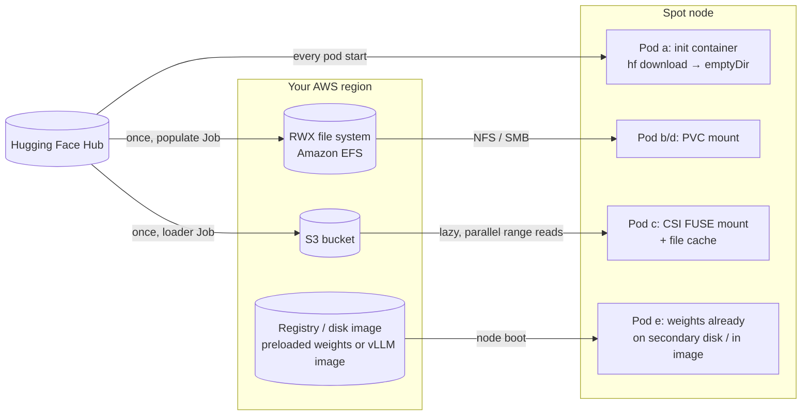
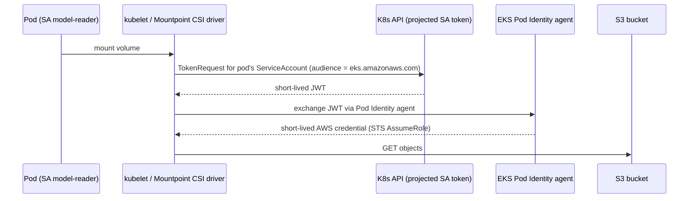

# 05 · Model Storage and Data

> Getting model weights onto a (spot) node quickly, safely and cheaply: init-container downloads,
> PVC caches, object storage mounted with the Mountpoint for S3 CSI driver, a shared file system, and
> preloaded disks and images, on **EKS**, using AWS's keyless EKS Pod Identity.

---

## 0. Before you start

This chapter's labs need **no GPU** (every serving pod uses `vllm/vllm-openai-cpu:v0.29.0`), so it
only needs [`00-prerequisites-and-cluster-setup`](../00-prerequisites-and-cluster-setup)'s cluster
and tools — not chapter 01/02's GPU node pools. Step 2 (object storage) and Step 4 (shared FS) do
need AWS IAM permissions to create buckets/roles/Pod Identity associations and a new CPU node group —
make sure your account has that before starting.

## 1. Why this matters

In a normal microservice, the container image *is* the application: a few hundred MB, pulled in seconds.
An LLM server is different. It is a large image (the `vllm/vllm-openai:v0.29.0` image is ~9.6 GB compressed)
**plus** a separate set of model files that can be 1 GB to over 1 TB. Every time a pod starts, it has to get both onto the node. That happens:

- on every scale-up (chapter `10-autoscaling-inference`),
- on every rollout,
- and, **because we run on spot**, every time a node is reclaimed, which can be several times a day.

If you get this wrong, you get 10-minute cold starts, `ImagePullBackOff`, nodes whose ephemeral storage fills up, surprise egress bills,
Hugging Face rate limits (HTTP 429), and serving replicas that load a half-written model.
In DevOps terms, model delivery is **artifact distribution**. You deal with the same concerns as for any artifact: immutability, versioning, least-privilege access, caching and locality.

## 2. Learning objectives & time plan (~3 h)

By the end you can:

1. Estimate model size and cold-start time from parameter count, precision and storage throughput.
2. Compare five delivery patterns and pick one per use case.
3. Mount a bucket into pods with the Mountpoint for Amazon S3 CSI driver and **keyless** identity:
   EKS Pod Identity.
4. Populate a shared RWX cache (Amazon EFS) with a Job and serve from it.
5. Explain image/disk preloading on EKS (SOCI parallel pull).

| Block | Time | What |
|---|---|---|
| Theory | 45 min | §3 concepts, cold-start math, pattern comparison |
| Lab A (chapter 00 cluster) | 30 min | init-container download, then RWO PVC cache |
| Lab B (your cloud) | 60 min | bucket + IAM, upload Job, serve from mount |
| Lab C (optional) | 30 min | RWX shared file system |
| Review | 15 min | spot notes, troubleshooting, checkpoint questions |

## 3. Concepts

### 3.0 Storage building blocks, for a first-timer

If chapters 00–04 were your first contact with Kubernetes storage, the vocabulary below is worth
reading slowly once — everything else in this chapter builds on it.

**PersistentVolume (PV), PersistentVolumeClaim (PVC), StorageClass — and how they fit together.**
A Pod's own filesystem disappears the moment the Pod is deleted, which is exactly what happens
constantly on spot nodes. If a workload needs storage that outlives the Pod, Kubernetes gives you
three cooperating objects:

- A **PersistentVolume (PV)** is a cluster-wide object that represents one real piece of storage —
  an AWS EBS volume, an EFS access point, or (as you'll see in Step 2) an S3 bucket exposed through
  a CSI driver. A PV knows *where* the data physically lives and *how* to attach/mount it, but it
  doesn't belong to any one namespace or Pod yet.
- A **PersistentVolumeClaim (PVC)** is what a namespaced workload actually asks for: "give me 10Gi
  of storage that supports one reader/writer" (or many). Kubernetes matches the claim to a PV that
  satisfies it — either one that already exists (**static provisioning**, what this chapter mostly
  does — the PV is hand-written YAML) or one created on demand by a provisioner (**dynamic
  provisioning** — you'll see this pattern more in later chapters).
- A **StorageClass** is the template a dynamic provisioner uses when it creates PVs on the fly: it
  says which backend (EBS gp3, EFS, S3) and which parameters (throughput mode, filesystem type,
  encryption) to use. Step 4 uses a StorageClass named `efs-models` for this; Steps 1–3 use
  hand-written PVs instead, because Mountpoint for S3 isn't provisioned "per size" the way a disk is.

In short: **PV = the actual storage resource, PVC = a namespace's claim/request against it,
StorageClass = the recipe for making PVs automatically.** A Pod never talks to a PV directly — it
mounts a PVC, and Kubernetes (via the CSI driver) does the rest.

**What is a CSI driver?** The Container Storage Interface (CSI) is the standard plugin interface
Kubernetes uses to talk to *any* storage backend without the Kubernetes core code needing to know
about that backend. A CSI driver is a piece of software (usually running as Pods itself, via a
DaemonSet/Deployment installed as an EKS add-on) that implements "mount this volume onto this
node" for one specific backend. This chapter uses two CSI drivers: **Mountpoint for Amazon S3**
(makes an S3 bucket appear as a mounted path — §3.3) and the **EFS CSI driver** (mounts an NFS file
system — Step 4). Without a CSI driver, Kubernetes has no idea how to attach an S3 bucket or an EFS
file system to a Pod at all; the driver is what turns an AWS API concept into a Linux mount point
inside the Pod's container.

**What is EKS Pod Identity, and why "keyless"?** Before Pod Identity (and its predecessor IRSA —
IAM Roles for Service Accounts), the common way to give a Pod AWS permissions was to either bake a
static AWS access key + secret into a Kubernetes Secret, or attach a broad IAM role to every EC2
node (so every Pod on that node inherited the same permissions, whether it needed S3 access or
not). Both are risky: a leaked access key is valid until someone manually rotates or revokes it,
and a node-wide role means a compromised Pod can reach anything the node can reach.

EKS Pod Identity removes the static credential entirely. Instead, it lets you say "Pods running as
ServiceAccount `model-reader` in namespace `ch05-models` may assume IAM role
`ch05-model-reader-<cluster>`" — a mapping stored in AWS, not in the cluster. When such a Pod
starts, the kubelet and the **EKS Pod Identity agent** (a small add-on running as a DaemonSet)
automatically exchange the Pod's short-lived, cluster-issued identity token for a short-lived AWS
credential via AWS STS (`AssumeRole`). Nothing is stored on disk, nothing is committed to a YAML
file, and the credential expires in minutes rather than being valid until manually rotated. See
§3.4 for the full exchange, step by step.

**Mountpoint for Amazon S3 — an object store made to look like a filesystem, with real limits.**
S3 is *object storage*: you `PUT` and `GET` whole objects by key, there's no concept of "open this
file and change 10 bytes in the middle." Mountpoint for S3 is a CSI driver + FUSE (Filesystem in
Userspace) program that presents a bucket as a mounted directory so ordinary programs (like vLLM
reading `.safetensors` files) can just open and read paths, without knowing they're talking to S3
underneath. It's excellent for what this chapter needs — write once, read many times, in parallel,
from any node — but it is **not** a real filesystem:
- **No in-place edits and (by default) no overwrite or delete.** Mountpoint only supports creating
  new objects; see the workaround in §3.3 (upload to a fresh path, never edit an existing one).
- **No rename.** That's why the loader Job downloads to a local `emptyDir` first, then `cp`s the
  finished files into the mount (§3.3 explains why `hf download`'s temp-file-then-rename pattern
  doesn't work directly against a Mountpoint mount).
- **Eventual consistency characteristics of S3 apply.** A `PUT` you just made is generally visible
  immediately in S3 today, but Mountpoint's own **metadata cache** (`metadata-ttl`) can still make a
  newly-written file (like the `_COMPLETE` marker) briefly invisible to a *different* Pod that
  already cached the directory listing — see the Troubleshooting table.

**Amazon EFS — when you actually need a shared, writable filesystem.** EFS is a managed NFS
(Network File System) service: multiple Pods, on multiple nodes, in multiple AZs, can all mount the
same file system read-write at the same time, with normal POSIX semantics (in-place edits, renames,
directory locks, file permissions) — the things Mountpoint deliberately doesn't give you. That
makes EFS the right choice when you have many small files that get modified or appended (dataset
preprocessing, shared checkpoints multiple training workers write to concurrently, log
aggregation) rather than a handful of large immutable weight files. The tradeoff is cost and
complexity: EFS bills per GB stored plus throughput, needs a mount target (network endpoint) in
every AZ your nodes might land in, and needs its own CSI driver and IAM setup (Step 4). For this
chapter's read-mostly model-serving use case, object storage (pattern c) is usually the better
default — EFS is here so you know when to reach for it instead.

**The five delivery patterns, one more time in plain language**, before you see the taxonomy table
in §3.2:

1. **(a) Download inside every Pod** — simplest to write, worst at runtime: every Pod start
   re-downloads the whole model from the internet.
2. **(b) Cache on a regular disk (PVC)** — fast after the first download, but the disk is tied to
   one availability zone and one attachment, which fights with spot's node churn.
3. **(c) Mount a bucket (object storage + CSI)** — the model lives once in S3; every Pod, on any
   node, in any zone, mounts it read-only. This is the pattern this chapter recommends by default.
4. **(d) Shared filesystem (EFS)** — like (c) but with real read-write filesystem semantics, at
   higher cost — for workloads that need to *write*, not just read.
5. **(e) Preload onto the node itself** — the model or image is already on the node's disk before
   any Pod starts, for the lowest possible cold start, at the cost of ops complexity (rebuilding
   images/disks per model version).

### 3.1 How big is a model? Cold-start math

**Weights size ≈ parameters × bytes per parameter**

| Precision | Bytes/param | 0.6B | 8B | 70B |
|---|---|---|---|---|
| FP32 | 4 | 2.4 GB | 32 GB | 280 GB |
| BF16 / FP16 (typical checkpoint) | 2 | 1.2 GB | 16 GB | 140 GB |
| FP8 / INT8 | 1 | 0.6 GB | 8 GB | 70 GB |
| INT4 (AWQ/GPTQ) | ~0.5 | 0.3 GB | 4 GB | 35 GB |

Check against real files: `Qwen/Qwen3-0.6B` has a 1.50 GB `model.safetensors`. The `Qwen/Qwen3-8B` repo is ~16.4 GB
(check with `curl -s "https://huggingface.co/api/models/Qwen/Qwen3-8B?blobs=true" | jq '[.siblings[].size]|add'`).

**Cold start = node provisioning + image pull + weights fetch + weights load to device + warm-up**

`fetch time ≈ size ÷ effective throughput`

| Source → node | Effective throughput (order of magnitude, varies a lot) | 16 GB (8B BF16) |
|---|---|---|
| Hugging Face Hub over internet | 50–250 MB/s, subject to rate limits | 1–5 min |
| Same-region bucket, single stream | ~100–200 MB/s | ~1.5–3 min |
| Same-region bucket, parallel range reads (Mountpoint) | 500 MB/s – 1+ GB/s | 15–30 s |
| NFS (Amazon EFS) | throughput-mode dependent: 100 MB/s – 1+ GB/s | 15 s – 3 min |
| Already on local disk (preloaded / page cache) | 1–4 GB/s (NVMe/PD) | 4–15 s |

The throughput figures are rough planning numbers, not benchmarks. Measure your own: every lab Job prints `time` for each step.

A worked spot example (8B model on an L4 spot node, init-container download from the Hub):
~90 s node boot + GPU driver, ~180 s vLLM image pull, ~120 s download, ~30 s load and CUDA graph capture, so **~7 min**.
With a preloaded image and a parallel bucket mount, the same pod starts in **~2.5 min**. With more replicas and more spot reclaims, those minutes add up.

### 3.2 The five delivery patterns



| Pattern | Cold start | Ops cost | Spot fit | When |
|---|---|---|---|---|
| **(a) init container → emptyDir** | Worst: full download every start | Lowest | Poor. Every reclaim re-downloads, and HF rate limits hit you | Demos, tiny models, CI |
| **(b) RWO PVC cache** (PD / EBS / Managed Disk) | Good after first fill | Medium | Risky. Disks are **zonal** and RWO, so a spot replacement in another zone can't attach | Single replica, single zone |
| **(c) Object storage + CSI FUSE** | Good with file cache and parallel download | Low. The bucket is the source of truth, and the same bucket also holds checkpoints (ch07) | **Best.** Regional, any node, any zone | Default for production |
| **(d) RWX shared FS** | Good; depends on tier | Medium–high ($$ minimums) | Good. Regional/multi-AZ | POSIX semantics needed, many small files, training datasets |
| **(e) Baked image / preloaded disk** | Best | High. Rebuild per model version; images >10 GB are painful | Good. Nodes boot with data | Few hot models, strict latency SLOs |

Rules of thumb:

- **Pin revisions.** `Qwen/Qwen3-0.6B@c1899de…`, not `main`. Store under an immutable path such as `models/<name>/<revision>/`.
- **Write a completion marker last** (`_COMPLETE`). Serving pods wait for it, so a loader that was interrupted mid-copy (spot!) is never served.
- **Separate writer and reader identities.** Only the loader Job can write, and serving pods get read-only access.
- **Keep data in the cluster's region.** Cross-region reads cost egress and time.

### 3.3 The object-storage CSI driver: Mountpoint for Amazon S3

| | EKS: Mountpoint for Amazon S3 CSI (v2) |
|---|---|
| Enable | EKS add-on `aws-mountpoint-s3-csi-driver` |
| CSI driver name | `s3.csi.aws.com` |
| Where FUSE runs | separate Mountpoint pod in `mount-s3` namespace on the same node |
| Identity | EKS Pod Identity (or IRSA); `authenticationSource: pod` for per-pod roles |
| Read-perf knobs | `cache: emptyDir`, `metadata-ttl`, `max-threads` |
| Write semantics | new files only by default; no rename (general-purpose buckets); `allow-overwrite`/`allow-delete` opt-in |

Why does the loader Job download to an **emptyDir first and then `cp`**? `hf download` writes `*.incomplete` temp files and renames them.
Mountpoint doesn't support rename on general-purpose buckets, so a plain sequential `cp` of new files is what works.

### 3.4 Keyless identity on EKS (why no access keys)



Reading the diagram, step by step, if you've never seen an OIDC/STS token exchange before:

1. **`Pod->>K: mount volume`** — a Pod is scheduled with `serviceAccountName: model-reader` and a
   volume that uses the Mountpoint CSI driver. Kubernetes needs to actually attach/mount that
   volume before the container can start.
2. **`K->>API: TokenRequest ...`** — the kubelet (via the CSI driver, using the Kubernetes
   `TokenRequest` API, called "projected service account tokens") asks the Kubernetes API server to
   mint a brand-new, short-lived **JWT** (JSON Web Token — a signed, tamper-evident piece of text
   that encodes "this identity is who it claims to be, and expires at time T") for this Pod's
   ServiceAccount. The `audience` field is set to `eks.amazonaws.com`, meaning "this token is only
   valid for proving identity to EKS's Pod Identity system" — it can't be replayed against some
   other service.
3. **`API-->>K: short-lived JWT`** — the API server signs and returns that token. It typically lives
   for well under an hour and is never written to a Secret or to disk outside the Pod's mounted
   token volume.
4. **`K->>IdP: exchange JWT via Pod Identity agent`** — the **EKS Pod Identity agent**, a small
   process running as a DaemonSet Pod on every node, receives that JWT and calls AWS's **STS**
   (Security Token Service) `AssumeRole` API on the Pod's behalf, presenting the JWT as proof of
   identity. STS checks it against the **Pod Identity association** you created in Step 2 (which
   says "namespace `ch05-models` + ServiceAccount `model-reader` ↔ IAM role
   `ch05-model-reader-<cluster>`") and against that role's trust policy (`Principal: {"Service":
   "pods.eks.amazonaws.com"}` — only the Pod Identity service itself is allowed to assume this role,
   nobody else).
5. **`IdP-->>K: short-lived AWS credential`** — STS returns a temporary AWS access key, secret key,
   and session token, valid for a limited window (typically up to an hour, refreshed automatically
   before it expires). This is the same *kind* of credential a long-lived IAM user's static access
   key would produce, but it expires on its own and was never generated by, or stored by, a human.
6. **`K->>S: GET objects`** — the Mountpoint process now has AWS credentials scoped exactly to what
   the `model-reader` role's policy allows (`s3:ListBucket` / `s3:GetObject` on this one bucket —
   see the reader policy JSON in Step 2), and uses them to read from S3 like any AWS SDK call would.

Compare this with the older/manual pattern: create an IAM user, generate a static access key pair,
paste it into a Kubernetes Secret, mount that Secret into every Pod that needs S3 access. That key
works forever until someone remembers to rotate or revoke it, is visible to anyone who can read that
Secret, and isn't scoped to any one namespace/ServiceAccount by Kubernetes RBAC. Pod Identity (and
its predecessor, IRSA, which achieves the same result via each cluster's OIDC provider instead of
the Pod Identity agent) replaces "a secret that has to be protected forever" with "a token that is
minted fresh, used once, and expires" — that's what "keyless" means here: **no static AWS access
keys ever exist**, only automatically-issued, automatically-expiring credentials.

Nothing long-lived is stored in the cluster. The IAM Pod Identity association names the **namespace and ServiceAccount**.
That makes RBAC on who can create pods with `serviceAccountName: model-writer` a security boundary (chapter `14-multi-tenancy-and-security`).

### 3.5 Production storage: Node-local NVMe RAID-0, zero-copy mmap, and distributed caching

While S3 Mountpoint and EFS solve centralized artifact distribution, **tier-1 production inference clusters serving 70B+ models rely on node-local NVMe instance storage and zero-copy memory mapping** to achieve instant pod startups.

#### The I/O throughput hierarchy for model loading

Loading a 70B model quantized to INT4/AWQ requires reading ~35 GB of tensor data. Loading it in BF16 requires reading ~140 GB:

| Storage Tier | Typical Bandwidth | Cold-Start Time (35 GB model) | Cold-Start Time (140 GB model) | Best Used For |
|---|---|---|---|---|
| **EBS gp3 (Default)** | 125 MB/s | ~4.6 minutes | ~18.6 minutes | Generic pod storage, OS boot disk |
| **EBS gp3 (Provisioned)** | 500–1,000 MB/s | ~40–70 seconds | ~2.5–4.5 minutes | Predictable persistent volumes |
| **S3 Mountpoint CSI** | ~1.2 GB/s | ~30 seconds | ~1.9 minutes | Central model registry, write-once datasets |
| **EFS (Shared FS)** | 100–250 MB/s | ~2.3–5.8 minutes | ~9.3–23 minutes | ReadWriteMany shared dev environments |
| **Node-Local NVMe RAID-0** | **15–30 GB/s** | **~1.2–2.5 seconds** | **~5–9 seconds** | **Production LLM serving & warm model caching** |

#### Why GPU instances have local NVMe instance store

AWS GPU instance families (`g5`, `g6e`, `p4d`, `p5`) come with physically attached, ephemeral NVMe SSDs included in the hourly instance price:
- `g5.xlarge` / `g5.2xlarge`: 1x 450 GB NVMe SSD.
- `g5.12xlarge`: 1x 3.8 TB NVMe SSD.
- `p4d.24xlarge` / `p5.48xlarge`: 8x 3.8 TB NVMe SSDs (over 30 TB raw local storage).

Leaving these local SSDs unformatted wastes their massive bus bandwidth. In production, platform teams format these drives on node boot via Karpenter `userData` or an init DaemonSet:

```bash
# Example node initialization script (userData / DaemonSet)
# 1. Strip all local NVMe instance store disks into a RAID-0 array
INSTANCE_DISKS=$(ls /dev/nvme*n1 | grep -v nvme0n1)
mdadm --create /dev/md0 --level=0 --raid-devices=$(echo $INSTANCE_DISKS | wc -w) $INSTANCE_DISKS

# 2. Format with XFS (optimized for large sequential reads)
mkfs.xfs -f /dev/md0
mkdir -p /mnt/k8s-local-nvme
mount -o noatime,nodiratime /dev/md0 /mnt/k8s-local-nvme
```

Pods mount `/mnt/k8s-local-nvme` via `hostPath` or a `local` PersistentVolume, configuring `HF_HOME=/mnt/k8s-local-nvme/huggingface`.

#### Safetensors and zero-copy memory mapping (`mmap`)

Historically, PyTorch stored model weights as Python pickle files (`.bin`). Pickle required allocating host RAM, deserializing arbitrary Python bytecodes sequentially (a major security vulnerability), and copying the tensors to GPU memory.

Modern models ship exclusively as Hugging Face **`safetensors`**:
1. **Header + Raw Bytes**: A JSON metadata header describing tensor shapes and offsets, followed by an uncompressed, contiguous binary byte array of weights.
2. **Zero-Copy `mmap`**: When vLLM loads a safetensors file, the operating system executes `mmap()` to map the disk file directly into virtual address space without copying it into user-space CPU RAM.
3. **Direct PCIe DMA**: The NVIDIA CUDA driver streams bytes directly from the local NVMe controller over the PCIe Gen4/Gen5 bus straight into GPU VRAM at line rate (32–64 GB/s).

#### Distributed data caching: Fluid and JuiceFS

When clusters scale to hundreds of nodes, pre-populating every single node's NVMe drive can saturate S3 bucket egress. Modern AI platforms layer distributed data caching engines:
- **Fluid (CNCF)**: A Kubernetes-native orchestration framework for data abstraction and tiered caching (Alluxio, JuiceFS). It automatically caches remote bucket objects on node-local NVMe storage and schedules pods to nodes that already hold the cached data shards.
- **JuiceFS**: A POSIX file system built on top of object storage and Redis/metadata engines that automatically keeps hot chunks on local NVMe disks, delivering distributed RWX sharing at local NVMe read speeds.

## 4. Lab

Layout:

```
05-model-storage-and-data/
└── eks/
    ├── namespace.yaml                    ch05-models
    ├── serviceaccounts.yaml              model-writer, model-reader
    ├── model-coordinates-configmap.yaml  pinned MODEL_ID/MODEL_REVISION/MODEL_SUBDIR
    ├── init-container-deployment.yaml    pattern (a): qwen-init-download
    ├── pvc-cache.yaml                    pattern (b): RWO model-cache PVC + populate Job + qwen-from-pvc-rwo
    ├── nodegroup-ch05.yaml                eksctl config for this chapter's CPU node group
    ├── pv-pvc-mountpoint.yaml            pattern (c): S3 Mountpoint PV/PVC (bucket name via envsubst)
    ├── upload-model-job.yaml             pattern (c): loader Job
    ├── qwen-from-bucket.yaml             pattern (c): serving Deployment
    └── shared-fs/                        pattern (d), optional
        ├── storageclass-efs.yaml         efs-models StorageClass (file system id via envsubst)
        ├── pvc.yaml, populate-job.yaml, serve-deployment.yaml
```

Every file under `eks/` is a complete, standalone Kubernetes manifest you can `kubectl apply -f`
directly — there's no kustomize overlay or `cpu-lab/` variant in this chapter any more. All serving
pods use `vllm/vllm-openai-cpu:v0.29.0`, so these labs need **no GPU**. The storage path is exactly
what a GPU pod would use. Chapter `09-llm-inference-with-vllm` swaps the image and adds
`nvidia.com/gpu`.

`source env.sh && source versions.env` loads the AWS account/region and pinned component versions
you set up in chapter 00, so every command below can reference `${AWS_REGION}`, `${EKS_CLUSTER}`,
etc. without you retyping them. `Qwen/Qwen3-0.6B` is a public model and doesn't
need a token, but Hugging Face gated/private models do, so every loader in this chapter references
the `hf-token` Secret as *optional* — create it now if you plan to reuse this lab layout for a gated
model later; skip it and nothing breaks for this chapter's public model.

```bash
source env.sh && source versions.env
kubectl apply -f 05-model-storage-and-data/eks/namespace.yaml
kubectl apply -f 05-model-storage-and-data/eks/serviceaccounts.yaml
kubectl apply -f 05-model-storage-and-data/eks/model-coordinates-configmap.yaml
# Optional (only for gated models): the Secret is referenced as optional by every loader.
kubectl -n ch05-models create secret generic hf-token --from-literal=HF_TOKEN="${HF_TOKEN}"
```

### Step 1 · Pattern (a), then (b)

This step only needs the CPU node group you already have from chapter 00 (no AWS-specific IAM or
bucket needed) so you can *feel* the two worst-performing patterns from the table in §3.2 before
spending any setup effort on the good one. `kubectl apply -f` applies
[`eks/init-container-deployment.yaml`](eks/init-container-deployment.yaml) (pattern (a): an init
container that downloads the model into `emptyDir` before the vLLM container starts). The `logs -f`
command follows the init container's own log output live so you can watch the download happen — an
init container's logs are only visible while it's running or briefly after, so run this before it
finishes rather than after.

```bash
kubectl apply -f 05-model-storage-and-data/eks/init-container-deployment.yaml
kubectl -n ch05-models logs deploy/qwen-init-download -c fetch-model -f
```

Example output:

```
Fetching 7 files: 100%|██████████| 7/7 [00:21<00:00,  3.02s/it]
real    0m24.310s
1.5G    /models/model
```

`rollout status` blocks until the Deployment reports all replicas `Available`, which for this
pattern means "the init container finished downloading and the vLLM container passed its readiness
probe" — a good single command to know "is it actually ready" instead of polling `get pods`
manually. `port-forward ... &` runs in the background (the trailing `&`) so the next command, a
`curl` against vLLM's OpenAI-compatible `/v1/chat/completions` endpoint, can run in the same
terminal session; this is the same request shape you'd send to a real hosted OpenAI-compatible
model.

```bash
kubectl -n ch05-models rollout status deploy/qwen-init-download --timeout=10m
kubectl -n ch05-models port-forward svc/qwen-init-download 8000:8000 &
curl -s localhost:8000/v1/chat/completions -H 'Content-Type: application/json' \
  -d '{"model":"qwen3-0.6b","messages":[{"role":"user","content":"Say hi in 5 words /no_think"}],"max_tokens":30}' | jq -r '.choices[0].message.content'
```

**Now simulate a spot reclaim:** `kubectl -n ch05-models delete pod -l app=qwen-init-download`.
Deleting the Pod (not the Deployment) is exactly what happens when AWS reclaims a spot instance out
from under it — the Deployment controller immediately schedules a replacement Pod, and because
pattern (a) has nothing cached anywhere outside that one Pod's now-gone `emptyDir`, the whole
download runs again from scratch. Watch the whole download run again — this is the "worst: full
download every start" row from the pattern table made concrete.

Next, pattern (b) with an RWO PVC on the default StorageClass. "RWO" (ReadWriteOnce) means the
underlying disk can only be attached to one node at a time — fine for a single replica, but (as
you'll rediscover in Step 1's own troubleshooting and §3.2's table) a poor fit once spot moves that
single replica to a different zone. `delete -f` tears down pattern (a) first so the two Deployments
don't compete for the same Service name/port; `apply -f .../pvc-cache.yaml` brings up a Job that
downloads the model once into a PVC-backed volume, and a separate Deployment (`qwen-from-pvc-rwo`)
that serves from that same PVC. `wait --for=condition=complete` blocks until the populate Job's Pod
finishes successfully — Jobs (unlike Deployments) run to completion once and stop, so "complete" is
the condition to wait on, not "ready".

```bash
kubectl delete -f 05-model-storage-and-data/eks/init-container-deployment.yaml
kubectl apply -f 05-model-storage-and-data/eks/pvc-cache.yaml
kubectl -n ch05-models wait --for=condition=complete job/populate-model-cache --timeout=15m
kubectl -n ch05-models delete pod -l app=qwen-from-pvc-rwo   # restart: no download, loads from disk
```

### Step 2 · Object storage

What you're about to do: create a bucket, grant your pods keyless read/write access to it via EKS Pod
Identity, upload the model once with a loader Job, then serve it straight from the mount — this is
pattern (c), the "best for production" row from section 3.2.

Create the spot CPU node group for this chapter (Intel instance types with AVX-512, which the vLLM
CPU backend needs; [`eks/nodegroup-ch05.yaml`](eks/nodegroup-ch05.yaml) also defines an on-demand
fallback group at `desiredCapacity: 0` — edit `metadata.name`/`region` to match `env.sh` first).
This is a real, billed EC2 capacity change: `eksctl create nodegroup -f <file>` reads the eksctl
config file (a declarative alternative to passing a dozen `--flag`s) and calls the AWS EC2/Auto
Scaling APIs to actually launch nodes and register them with your cluster — nothing before this
point in the chapter has cost you anything or touched real infrastructure.
```bash
eksctl create nodegroup -f 05-model-storage-and-data/eks/nodegroup-ch05.yaml
```

What you're about to do next: create the S3 bucket (same region as the cluster), the EKS add-ons
(Pod Identity agent + Mountpoint for S3 CSI driver), and two IAM roles — a **writer** role
(`ListBucket`/`GetObject`/`PutObject`/`AbortMultipartUpload`) and a **reader** role
(`ListBucket`/`GetObject` only) — each bound via a Pod Identity association to this chapter's
`model-writer`/`model-reader` ServiceAccounts. Separating writer and reader identities means only the
loader Job can write; serving pods get read-only access.
```bash
: "${AWS_REGION:?source env.sh}" "${EKS_CLUSTER:?}" "${AWS_ACCOUNT_ID:?}"
NS=ch05-models
BUCKET="${S3_BUCKET:-${AWS_ACCOUNT_ID}-ch05-models}"
TMP="$(mktemp -d)"

# bucket (same region as the cluster)
if ! aws s3api head-bucket --bucket "${BUCKET}" 2>/dev/null; then
  if [[ "${AWS_REGION}" == "us-east-1" ]]; then
    aws s3api create-bucket --bucket "${BUCKET}" --region "${AWS_REGION}"
  else
    aws s3api create-bucket --bucket "${BUCKET}" --region "${AWS_REGION}" \
      --create-bucket-configuration "LocationConstraint=${AWS_REGION}"
  fi
  aws s3api put-public-access-block --bucket "${BUCKET}" \
    --public-access-block-configuration BlockPublicAcls=true,IgnorePublicAcls=true,BlockPublicPolicy=true,RestrictPublicBuckets=true
fi

# add-ons: Pod Identity agent + Mountpoint for S3 CSI driver
for addon in eks-pod-identity-agent aws-mountpoint-s3-csi-driver; do
  if ! aws eks describe-addon --cluster-name "${EKS_CLUSTER}" --addon-name "${addon}" --region "${AWS_REGION}" >/dev/null 2>&1; then
    aws eks create-addon --cluster-name "${EKS_CLUSTER}" --addon-name "${addon}" --region "${AWS_REGION}"
  fi
done

# trust policy for EKS Pod Identity
cat > "${TMP}/trust.json" <<JSON
{
  "Version": "2012-10-17",
  "Statement": [{
    "Effect": "Allow",
    "Principal": {"Service": "pods.eks.amazonaws.com"},
    "Action": ["sts:AssumeRole", "sts:TagSession"]
  }]
}
JSON

# permission policies (Mountpoint's documented least-privilege actions)
cat > "${TMP}/reader.json" <<JSON
{
  "Version": "2012-10-17",
  "Statement": [
    {"Effect": "Allow", "Action": ["s3:ListBucket"], "Resource": ["arn:aws:s3:::${BUCKET}"]},
    {"Effect": "Allow", "Action": ["s3:GetObject"], "Resource": ["arn:aws:s3:::${BUCKET}/*"]}
  ]
}
JSON
cat > "${TMP}/writer.json" <<JSON
{
  "Version": "2012-10-17",
  "Statement": [
    {"Effect": "Allow", "Action": ["s3:ListBucket"], "Resource": ["arn:aws:s3:::${BUCKET}"]},
    {"Effect": "Allow", "Action": ["s3:GetObject", "s3:PutObject", "s3:AbortMultipartUpload"],
     "Resource": ["arn:aws:s3:::${BUCKET}/*"]}
  ]
}
JSON

for who in reader writer; do
  ROLE="ch05-model-${who}-${EKS_CLUSTER}"
  if ! aws iam get-role --role-name "${ROLE}" >/dev/null 2>&1; then
    aws iam create-role --role-name "${ROLE}" --assume-role-policy-document "file://${TMP}/trust.json"
  fi
  aws iam put-role-policy --role-name "${ROLE}" --policy-name s3-models \
    --policy-document "file://${TMP}/${who}.json"
  ROLE_ARN="$(aws iam get-role --role-name "${ROLE}" --query Role.Arn --output text)"

  EXISTING="$(aws eks list-pod-identity-associations --cluster-name "${EKS_CLUSTER}" --region "${AWS_REGION}" \
    --namespace "${NS}" --service-account "model-${who}" --query 'associations[0].associationId' --output text)"
  if [[ "${EXISTING}" == "None" || -z "${EXISTING}" ]]; then
    aws eks create-pod-identity-association --cluster-name "${EKS_CLUSTER}" --region "${AWS_REGION}" \
      --namespace "${NS}" --service-account "model-${who}" --role-arn "${ROLE_ARN}"
  fi
done

printf '# written by the IAM setup above\nS3_BUCKET=%s\n' "${BUCKET}" > 05-model-storage-and-data/eks/bucket.env
rm -rf "${TMP}"
cat 05-model-storage-and-data/eks/bucket.env
```

Walking through what that script actually did, mapped onto the concepts from §3.0/§3.4: `head-bucket`
is a cheap existence check so re-running the script doesn't fail on "bucket already exists" — this
whole block is written to be safely re-runnable. `put-public-access-block` is a defense-in-depth
setting that blocks the bucket from ever being made public by a future misconfigured bucket policy
or ACL, independent of the fact that Pod Identity never needed public access in the first place. The
`for addon in ...` loop installs the two CSI-related EKS add-ons idempotently (skips creation if
already present) — recall from §3.0 that without the Mountpoint CSI driver add-on, Kubernetes has no
mechanism to turn "mount this bucket" into an actual Linux mount point, and without the Pod Identity
agent add-on there is nothing on the node to perform the JWT→AWS-credential exchange from §3.4.
`trust.json` is the IAM role's **trust policy** — it says *who is allowed to assume this role at
all* (only the `pods.eks.amazonaws.com` service, i.e. only via Pod Identity); `reader.json`/
`writer.json` are the roles' **permission policies** — what the role can *do* once assumed. Keeping
these as two separate JSON documents mirrors how IAM itself separates "who can wear this hat" from
"what this hat lets you do". The final `for who in reader writer` loop creates each role (if
missing), attaches its permission policy, looks up its ARN, and creates the Pod Identity association
that binds `namespace=ch05-models` + `serviceAccount=model-${who}` to that role ARN — this is the
exact association §3.4's sequence diagram assumes already exists when a Pod starts. The script ends
by writing the bucket name to `eks/bucket.env` so later steps (and cleanup) don't have to re-derive
it.

Now render the PV's bucket name, apply the manifests, upload the model with the loader Job, and let
the serving Deployment pick it up from the mount. [`eks/pv-pvc-mountpoint.yaml`](eks/pv-pvc-mountpoint.yaml)
carries an `${S3_BUCKET}` placeholder; `envsubst` fills it in from `bucket.env` the same way chapter
00's Step 4 renders `${EKS_CLUSTER}`/`${AWS_REGION}` into `cluster.yaml` — a quick `cat` of the
rendered file first is a good habit any time you're about to apply something you haven't read.
`apply -f` then actually creates those resources: the PV/PVC pair that uses the Mountpoint CSI
driver, the `upload-model` Job (using the `model-writer` ServiceAccount and its writer role from the
script above), and the `qwen-from-bucket` serving Deployment (using `model-reader`). Checking
`mount-s3` namespace Pods confirms the Mountpoint CSI driver actually launched a FUSE process
alongside your workload — recall from §3.3 that Mountpoint runs as a *separate* Pod next to your
container, not inside it. Watching the upload Job's logs and then listing the bucket with `aws s3
ls` both confirm the same fact from two different angles: the Job's own log line and the object
actually landing in S3.
```bash
# shellcheck disable=SC1091
source 05-model-storage-and-data/eks/bucket.env
export S3_BUCKET
envsubst '${S3_BUCKET}' < 05-model-storage-and-data/eks/pv-pvc-mountpoint.yaml \
  > 05-model-storage-and-data/eks/.pv-pvc-mountpoint.rendered.yaml
cat 05-model-storage-and-data/eks/.pv-pvc-mountpoint.rendered.yaml   # review first
kubectl apply -f 05-model-storage-and-data/eks/.pv-pvc-mountpoint.rendered.yaml
kubectl apply -f 05-model-storage-and-data/eks/upload-model-job.yaml
kubectl apply -f 05-model-storage-and-data/eks/qwen-from-bucket.yaml
kubectl -n mount-s3 get pods -o wide        # Mountpoint pods run beside your workload pods
kubectl -n ch05-models logs job/upload-model -f
aws s3 ls "s3://${S3_BUCKET}/models/qwen3-0.6b/" --recursive --human-readable
kubectl -n ch05-models rollout status deploy/qwen-from-bucket --timeout=15m
```

How to tell this worked: `kubectl -n mount-s3 get pods` shows a Mountpoint pod `Running` next to
your workload pod's node, the upload Job log ends with a `_COMPLETE` write, `aws s3 ls` lists the
model files under `models/qwen3-0.6b/`, and `rollout status` reports the deployment available.

Things to notice:
- `authenticationSource: pod` (set in [`eks/pv-pvc-mountpoint.yaml`](eks/pv-pvc-mountpoint.yaml))
  makes the Mountpoint process use **the workload pod's** ServiceAccount credentials. Two pods
  mounting the same PV get different permissions (writer vs reader). With the default (`driver`),
  every pod in the cluster shares the driver's role.
- Mountpoint's defaults (write new files, no overwrite, no delete) suit immutable model paths well.
- Pod Identity trust policy principal: `pods.eks.amazonaws.com`, actions `sts:AssumeRole` + `sts:TagSession`.

### Step 3 · Verify the serving pod reads from the mount

This step is about proving to yourself that the model files really are coming from the S3 mount and
not from some leftover local cache. `exec ... ls -la` lists the model directory *from inside the
container* — if the mount is working, you'll see the same files you listed with `aws s3 ls` a moment
ago, but reachable as ordinary paths. `mount | grep -i -E "fuse|models"` looks at the container's
mount table for a FUSE-backed mount (Mountpoint) at the model path — this is the concrete, in-Pod
evidence that what looks like a local directory is actually backed by S3 over FUSE. Grepping the
vLLM container's own logs for "loading/weights/took" surfaces the lines where vLLM reports how long
it spent reading and loading the weights, so you can directly compare that number against Step 1's
init-container download time.

```bash
kubectl -n ch05-models exec deploy/qwen-from-bucket -c vllm -- sh -c 'ls -la /models/models/qwen3-0.6b/*/ && mount | grep -i -E "fuse|models"'
kubectl -n ch05-models logs deploy/qwen-from-bucket -c vllm | grep -i -E "loading|weights|took"
kubectl -n ch05-models port-forward svc/qwen-from-bucket 8000:8000 &
curl -s localhost:8000/v1/models | jq -r '.data[].id'     # qwen3-0.6b
```

Delete the pod and compare startup time with Step 1 (a). Then scale to 2 replicas. A second replica on the same node only benefits from Mountpoint's local cache if it shares the same cache volume — by default each pod has its own `cache: emptyDir`, so think about this before relying on it.

### Step 4 (optional) · Shared RWX file system

EKS uses Amazon EFS, `efs-models` StorageClass (`efs-ap` provisioning mode, one access point per
PVC), billed per GB stored plus elastic throughput.

What you're about to do: create an EFS file system reachable from the cluster (one mount target per
AZ, NFS port 2049 opened from the cluster security group), install the EFS CSI add-on, and give its
controller (`efs-csi-controller-sa`) permission to manage access points via EKS Pod Identity.

A quick walkthrough of why each piece is needed, since this is the most networking-heavy block in
the chapter: EFS is reached over NFS (port 2049), and NFS traffic has to originate from inside your
VPC, so the script first looks up the cluster's VPC, its own security group, and its subnets (one
per AZ) with `describe-cluster`. It then creates the file system itself (`elastic` throughput mode
auto-scales bandwidth with usage, so you don't have to pre-provision throughput). `create-mount-
target`, run once per unique AZ found in `SUBNETS`, is what actually makes the file system reachable
from that AZ — without a mount target in an AZ, nodes there simply can't connect, which is why the
loop explicitly dedupes AZs (`SEEN_AZ`) rather than looping over every subnet. The new security group
and its ingress rule open port 2049 specifically *from the cluster's own security group*, not from
the whole internet, so only your cluster's nodes can reach the file system. Finally, the EFS CSI
driver's *controller* component (which creates/deletes access points on your behalf when PVCs are
created/deleted) needs its own AWS permissions — that's the Pod Identity association at the end,
bound to the add-on's well-known ServiceAccount name `efs-csi-controller-sa`, using the AWS-managed
`AmazonEFSCSIDriverPolicy` instead of a hand-written policy since this is a standard, well-scoped
AWS policy for exactly this driver.
```bash
: "${AWS_REGION:?source env.sh}" "${EKS_CLUSTER:?}"
TMP="$(mktemp -d)"

VPC_ID="$(aws eks describe-cluster --name "${EKS_CLUSTER}" --region "${AWS_REGION}" --query cluster.resourcesVpcConfig.vpcId --output text)"
CLUSTER_SG="$(aws eks describe-cluster --name "${EKS_CLUSTER}" --region "${AWS_REGION}" --query cluster.resourcesVpcConfig.clusterSecurityGroupId --output text)"
SUBNETS="$(aws eks describe-cluster --name "${EKS_CLUSTER}" --region "${AWS_REGION}" --query 'cluster.resourcesVpcConfig.subnetIds[]' --output text)"

FS_ID="$(aws efs create-file-system --region "${AWS_REGION}" --encrypted \
  --performance-mode generalPurpose --throughput-mode elastic \
  --tags "Key=Name,Value=${EKS_CLUSTER}-ch05-models" --query FileSystemId --output text)"
echo "created ${FS_ID}; waiting for it to become available"
until [[ "$(aws efs describe-file-systems --file-system-id "${FS_ID}" --region "${AWS_REGION}" --query 'FileSystems[0].LifeCycleState' --output text)" == "available" ]]; do sleep 5; done

# NFS (2049) from the cluster security group
EFS_SG="$(aws ec2 create-security-group --region "${AWS_REGION}" --vpc-id "${VPC_ID}" \
  --group-name "${EKS_CLUSTER}-ch05-efs" --description "EFS for ch05" --query GroupId --output text)"
aws ec2 authorize-security-group-ingress --region "${AWS_REGION}" --group-id "${EFS_SG}" \
  --protocol tcp --port 2049 --source-group "${CLUSTER_SG}"

# one mount target per AZ
SEEN_AZ=" "   # plain string, works with macOS bash 3.2
for s in ${SUBNETS}; do
  az="$(aws ec2 describe-subnets --subnet-ids "${s}" --region "${AWS_REGION}" --query 'Subnets[0].AvailabilityZone' --output text)"
  case "${SEEN_AZ}" in *" ${az} "*) continue ;; esac
  SEEN_AZ="${SEEN_AZ}${az} "
  aws efs create-mount-target --region "${AWS_REGION}" --file-system-id "${FS_ID}" \
    --subnet-id "${s}" --security-groups "${EFS_SG}"
done

# EFS CSI controller identity (Pod Identity) + add-on
cat > "${TMP}/trust.json" <<JSON
{"Version":"2012-10-17","Statement":[{"Effect":"Allow","Principal":{"Service":"pods.eks.amazonaws.com"},"Action":["sts:AssumeRole","sts:TagSession"]}]}
JSON
ROLE="ch05-efs-csi-${EKS_CLUSTER}"
aws iam get-role --role-name "${ROLE}" >/dev/null 2>&1 || \
  aws iam create-role --role-name "${ROLE}" --assume-role-policy-document "file://${TMP}/trust.json"
aws iam attach-role-policy --role-name "${ROLE}" \
  --policy-arn arn:aws:iam::aws:policy/service-role/AmazonEFSCSIDriverPolicy
ROLE_ARN="$(aws iam get-role --role-name "${ROLE}" --query Role.Arn --output text)"

aws eks create-addon --cluster-name "${EKS_CLUSTER}" --region "${AWS_REGION}" \
  --addon-name aws-efs-csi-driver \
  --pod-identity-associations "serviceAccount=efs-csi-controller-sa,roleArn=${ROLE_ARN}" || true

printf '# written by the EFS setup above\nEFS_FILE_SYSTEM_ID=%s\n' "${FS_ID}" > 05-model-storage-and-data/eks/shared-fs/efs.env
rm -rf "${TMP}"
echo "EFS ${FS_ID} ready"
```

Render the StorageClass's file system id, apply it and the rest of the shared-fs manifests, and
serve from the shared file system. `efs-models` makes the `model-cache` PVC **dynamically
provisioned**: unlike Step 2's hand-written PV for the S3 mount, here the EFS CSI driver's
controller reacts to the PVC and creates a matching EFS access point automatically (the mechanism
described in §3.0's PV/PVC/StorageClass explanation). The populate Job fills that shared volume
once; then two serving replicas mount the same PVC read-write at the same time — something pattern
(b)'s RWO PVC could never do, and the whole reason to reach for EFS in the first place.
```bash
# shellcheck disable=SC1091
source 05-model-storage-and-data/eks/shared-fs/efs.env
export EFS_FILE_SYSTEM_ID
envsubst '${EFS_FILE_SYSTEM_ID}' < 05-model-storage-and-data/eks/shared-fs/storageclass-efs.yaml \
  > 05-model-storage-and-data/eks/shared-fs/.storageclass-efs.rendered.yaml
kubectl apply -f 05-model-storage-and-data/eks/shared-fs/.storageclass-efs.rendered.yaml
kubectl apply -f 05-model-storage-and-data/eks/shared-fs/pvc.yaml
kubectl apply -f 05-model-storage-and-data/eks/shared-fs/populate-job.yaml
kubectl apply -f 05-model-storage-and-data/eks/shared-fs/serve-deployment.yaml
kubectl -n ch05-models wait --for=condition=complete job/populate-model-cache --timeout=20m
kubectl -n ch05-models get pods -l app=qwen-from-pvc -o wide   # 2 replicas, possibly on different nodes/zones
```
How to tell this worked: the populate Job reports `condition=complete`, and both `qwen-from-pvc`
replicas are `Running` — including ones scheduled to a different node than the one that populated
the cache, since EFS is regional/multi-AZ.

Another shared-FS option worth knowing: **Amazon FSx for Lustre** (high-throughput training data),
covered conceptually in chapter `13-node-autoscaling-and-cost`.

### Step 5 (read-through) · Pattern (e): preloaded images/disks

- **EKS.** The SOCI snapshotter is bundled in recent EKS-optimized AL2023 and Bottlerocket AMIs. **SOCI parallel pull mode**
  speeds up downloading and unpacking big images (AWS reports ~60% faster on a 10 GB DLC image). It is **not enabled by default** and is switched on through node configuration
  (AL2023 `NodeConfig` / Bottlerocket settings). You can also snapshot an EBS data volume with images pre-pulled and use it in the
  Karpenter `EC2NodeClass` `blockDeviceMappings`. See chapter `13-node-autoscaling-and-cost`.
- **Baking weights into the image** works for small models. For 16 GB+ it doubles registry storage, slows every CI push, and couples
  model and runtime releases. Prefer an OCI artifact or a bucket.

## 5. Spot considerations

- **Reclaim = cold start.** Pattern (a) turns every reclaim into a fresh HF download; patterns (c)/(d) don't, which is why they're the
  recommended default (§3.2).
- **Loader Jobs tolerate interruption**: `podFailurePolicy` with `DisruptionTarget → Ignore` (chapter `06-batch-jobs-and-kueue`), idempotent
  writes (skip if `_COMPLETE`), and `hf download` resumes.
- **Zonal disks are the wrong fit.** RWO PD/EBS PVCs pin pods to one zone; buckets and regional file systems don't. Size ephemeral
  storage for model + cache + images, since spot node disks are often small.

## 6. Troubleshooting

| Symptom | Likely cause | Why this happens | Fix |
|---|---|---|---|
| Mountpoint pod `mp-…` in `mount-s3` Pending | No room on the node for the Mountpoint pod | Mountpoint runs as its own Pod (§3.3) alongside your workload, scheduled by the same kubelet — if the node's CPU/memory is fully claimed by other Pods' requests, there's no room left for it, and *your* workload Pod also can't start because its volume never mounts | Leave CPU/memory headroom; see driver docs `HEADROOM_FOR_MPPOD.md` |
| `Access Denied` on mount | No pod identity association for this namespace/SA, or `eks-pod-identity-agent` add-on missing | Without an association, step 4 of §3.4's exchange (STS `AssumeRole`) has nothing to check the JWT against, so STS refuses it and Mountpoint gets no credentials at all | `aws eks list-pod-identity-associations --cluster-name ...` |
| `cp: ... Operation not permitted` writing over an existing file | Mountpoint forbids overwrite by default | S3 objects aren't edited in place, and Mountpoint deliberately doesn't emulate overwrite/rename for general-purpose buckets (§3.3/§3.0) — a `cp` that would replace an existing key is rejected rather than silently corrupting a file mid-write | Use a new revision path, or add `allow-overwrite` |
| Serving pod stuck in `wait-for-model` | Loader not done, or metadata cache hides the new `_COMPLETE` | Mountpoint caches directory listings for `metadata-ttl` seconds for performance; a reader Pod that listed the directory just before the loader wrote `_COMPLETE` won't see the new file until that cache entry expires | Check Job logs; lower metadata/negative-cache TTLs |
| `Multi-Attach error for volume` (pvc-cache) | RWO disk already attached on another node | An RWO (ReadWriteOnce) EBS volume can only be attached to one node's kernel at a time; if the scheduler puts a new Pod on a different node before the old one released the volume (common right after a spot reclaim), the attach fails outright | Use RWX (shared-fs) or keep Job and Deployment on one node |
| Pod evicted: `ephemeral-storage` | emptyDir/cache bigger than limits or node disk | `emptyDir` volumes and Mountpoint's local file cache both consume the node's boot disk, which is counted as ephemeral storage; once usage crosses the Pod's request/limit (or the node's actual disk fills up) the kubelet evicts the Pod to protect the node | Raise `sizeLimit`/limits; bigger boot disks |
| Loader `429 Too Many Requests` from Hugging Face | Unauthenticated / many parallel downloads | The Hugging Face Hub rate-limits anonymous and high-volume traffic per IP/token; every spot reclaim under pattern (a) means another full re-download hitting the same limits, which is exactly the "poor fit for spot" problem the pattern table warns about | Set `HF_TOKEN`; download once to a bucket (pattern c) |
| vLLM CPU crashes with `Illegal instruction` | CPU lacks the instruction set vLLM's CPU build expects | The vLLM CPU backend is compiled to use AVX-512 instructions for performance; running it on an instance family whose CPUs don't implement AVX-512 makes the CPU itself fault on those instructions, which the kernel reports as `Illegal instruction` (SIGILL), not an application-level error | Use AVX-512 instance families (m7i/m6i) |

## 7. Cleanup & cost notes

What you're about to do: delete the Step 1 (pattern a/b) resources, then tear down the
object-storage/shared-fs manifests, IAM roles, Pod Identity associations and this chapter's node
groups (`DELETE_BUCKET=true` also empties and deletes the S3 bucket — omit it to keep the model for
ch09/ch10).

Order matters here: Kubernetes resources are deleted first (`kubectl delete -f ...`), then AWS-side
Pod Identity associations, then the IAM roles those associations pointed at, then the node groups —
roughly the reverse of the order everything was created in, so nothing is left referencing an object
that's already gone. The `for id in $(aws eks list-pod-identity-associations ...)` loop looks up and
deletes every association in this chapter's namespace rather than hardcoding association IDs,
because `create-pod-identity-association` doesn't return a predictable ID you could hardcode.
`aws iam delete-role-policy` must run before `aws iam delete-role` — IAM refuses to delete a role
that still has inline policies attached, which is why both appear even though the role is going away
either way. `--ignore-not-found`/`|| true` throughout make the whole script safe to re-run if an
earlier step already failed partway.
```bash
kubectl delete -f 05-model-storage-and-data/eks/init-container-deployment.yaml --ignore-not-found
kubectl delete -f 05-model-storage-and-data/eks/pvc-cache.yaml --ignore-not-found

: "${AWS_REGION:?source env.sh}" "${EKS_CLUSTER:?}"
# shellcheck disable=SC1091
source 05-model-storage-and-data/eks/bucket.env

kubectl delete -f 05-model-storage-and-data/eks/shared-fs/serve-deployment.yaml --ignore-not-found || true
kubectl delete -f 05-model-storage-and-data/eks/shared-fs/populate-job.yaml --ignore-not-found || true
kubectl delete -f 05-model-storage-and-data/eks/shared-fs/pvc.yaml --ignore-not-found || true
kubectl delete -f 05-model-storage-and-data/eks/shared-fs/.storageclass-efs.rendered.yaml --ignore-not-found || true
kubectl delete -f 05-model-storage-and-data/eks/qwen-from-bucket.yaml --ignore-not-found || true
kubectl delete -f 05-model-storage-and-data/eks/upload-model-job.yaml --ignore-not-found || true
kubectl delete -f 05-model-storage-and-data/eks/.pv-pvc-mountpoint.rendered.yaml --ignore-not-found || true

for id in $(aws eks list-pod-identity-associations --cluster-name "${EKS_CLUSTER}" --region "${AWS_REGION}" \
      --namespace ch05-models --query 'associations[].associationId' --output text); do
  aws eks delete-pod-identity-association --cluster-name "${EKS_CLUSTER}" --region "${AWS_REGION}" --association-id "${id}"
done
for who in reader writer; do
  ROLE="ch05-model-${who}-${EKS_CLUSTER}"
  aws iam delete-role-policy --role-name "${ROLE}" --policy-name s3-models || true
  aws iam delete-role --role-name "${ROLE}" || true
done

if [[ "${DELETE_BUCKET:-false}" == "true" ]]; then
  aws s3 rm "s3://${S3_BUCKET}" --recursive
  aws s3api delete-bucket --bucket "${S3_BUCKET}" --region "${AWS_REGION}"
fi

eksctl delete nodegroup --cluster "${EKS_CLUSTER}" --region "${AWS_REGION}" --name ch05-cpu-spot || true
eksctl delete nodegroup --cluster "${EKS_CLUSTER}" --region "${AWS_REGION}" --name ch05-cpu-ondemand || true
echo "EFS file system (if created in Step 4) is NOT deleted automatically — delete mount targets, then aws efs delete-file-system"
```

- Buckets: a 1.5 GB model costs cents per month. Keep it, because chapters 09–12 can reuse it. Watch **cross-region egress** and request charges; Mountpoint list calls add up on huge buckets.
- **EFS bills per stored GB plus elastic throughput** — no large provisioned minimum, but still not free; delete it when you're done with this chapter's labs.
- EFS file systems, mount targets and the security group are **not** removed by the cleanup above — delete them manually (see Step 4).

## 8. Checkpoint questions

1. A 32B model in BF16: how big are the weights? Roughly how long does fetching them take at 150 MB/s versus 1 GB/s?
2. Why does the loader Job copy from an emptyDir instead of running `hf download` straight into a Mountpoint mount?
3. You run inference on spot across three zones. Why is an RWO PVC model cache a poor fit, and what would you use instead?
4. What does `authenticationSource: pod` change in the Mountpoint CSI driver, and why does it matter for multi-tenant clusters?
5. Why does the EFS StorageClass use `provisioningMode: efs-ap` (one access point per PVC) instead of pointing every PVC at the file system root?
6. Why write a `_COMPLETE` marker, and why must it be written last?
7. Which EKS mechanism shortens the image-pull part of the cold start, and why is it not on by default?

<details>
<summary>Answers</summary>

1. 32B × 2 bytes ≈ 64 GB. At 150 MB/s that is ~7 min; at 1 GB/s ~64 s. That doesn't include image pull or GPU load time.
2. `hf download` writes temp files and renames them. Mountpoint doesn't support rename on general-purpose buckets. A plain sequential `cp` of new files is what actually works.
3. Disks are zonal and RWO. A replacement node in another zone can't attach the disk, and one disk can't serve replicas on several nodes. Use a bucket mount (regional) or an RWX regional file system (EFS).
4. The Mountpoint process uses the workload pod's ServiceAccount (EKS Pod Identity / IRSA) instead of one driver-wide role. Different pods get different S3 permissions from the same PV, which gives you tenant isolation and least privilege.
5. Access points give each PVC its own root directory and POSIX user/group enforcement inside the shared file system, so multiple PVCs (and multiple chapters/tenants) can share one EFS file system without one PVC being able to read another's directory tree.
6. The loader can be interrupted at any time (spot). Readers wait for the marker, so they never load a partial model. If it were written first, a partial upload would look complete.
7. SOCI parallel pull mode on EKS-optimized AL2023/Bottlerocket AMIs. It's opt-in via node configuration because it changes how image layers are pulled and unpacked, and not every image/registry benefits equally.
</details>

## 9. Further reading

- [Mountpoint for S3 CSI driver (GitHub)](https://github.com/awslabs/mountpoint-s3-csi-driver/blob/main/docs/CONFIGURATION.md), [EKS user guide – S3 CSI](https://docs.aws.amazon.com/eks/latest/userguide/s3-csi.html), [EKS Pod Identity](https://docs.aws.amazon.com/eks/latest/userguide/pod-identities.html), [EFS CSI](https://docs.aws.amazon.com/eks/latest/userguide/efs-csi.html), [SOCI parallel pull mode](https://aws.amazon.com/blogs/containers/introducing-seekable-oci-parallel-pull-mode-for-amazon-eks/), [EKS AI/ML performance best practices](https://docs.aws.amazon.com/eks/latest/best-practices/aiml-performance.html)
- [Hugging Face `hf download`](https://huggingface.co/docs/huggingface_hub/guides/cli)

## Versions tested

| Component | Version |
|---|---|
| vLLM CPU image | `vllm/vllm-openai-cpu:v0.29.0` (`VLLM_VERSION`) |
| uv image (loader) | `ghcr.io/astral-sh/uv:0.12.15-python3.12-trixie-slim` *(not in versions.env)* |
| huggingface_hub (`hf` CLI) | `1.31.0` *(not in versions.env)* |
| Model | `Qwen/Qwen3-0.6B` @ `c1899de289a04d12100db370d81485cdf75e47ca` |
| Mountpoint for S3 CSI driver | v2.8.0 (EKS add-on version depends on cluster) *(not in versions.env)* |
| busybox | `1.37` |

---

[← Prev: 04-gpu-observability](../04-gpu-observability) | [Course Map](../README.md) | [Next: 06-batch-jobs-and-kueue →](../06-batch-jobs-and-kueue)