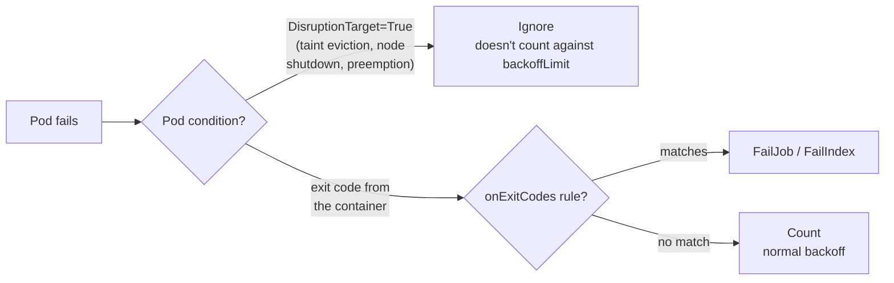
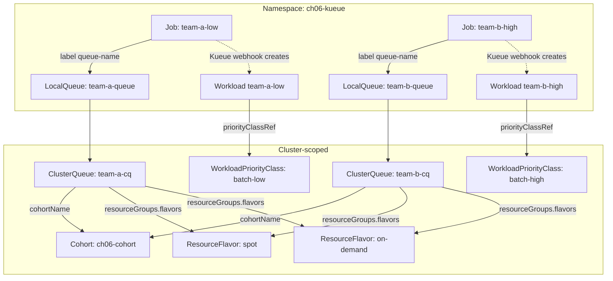

# 06 · Batch Jobs and Kueue

> Turning a Kubernetes cluster into a shared, quota-fair batch scheduler for ML work: Jobs and
> Indexed Jobs that survive spot reclaims, and **Kueue** (ResourceFlavor, ClusterQueue,
> LocalQueue, Cohort, preemption, WorkloadPriorityClass) on **GKE, EKS and AKS**.

---

## Before you start

This chapter assumes:

- A cluster from chapter `00-prerequisites-and-cluster-setup` (GKE/EKS/AKS) or any cluster for the
  cpu-lab path — Kueue itself needs no GPUs.
- `env.sh` and `versions.env` sourced (`source env.sh && source versions.env`) so `${KUEUE_VERSION}`
  and per-cloud project/account variables are set.
- For Step 5 (real spot vs on-demand ResourceFlavors): cloud IAM/quota to create a second (on-demand)
  node pool alongside the spot pool — see the table in `CONVENTIONS.md` for each cloud's spot label.
- No GPU node pool is required for this chapter — it's CPU-only quota management. If you're
  continuing straight from chapter `05-model-storage-and-data`, you can reuse that cluster as-is.

## 1. Why this matters

The default Kubernetes scheduler answers one question: "is there a node with room for this
pod?" It has no idea that your cluster is shared by three teams with different budgets, that a
training run needs all N of its pods or none of them, or that "spot capacity ran out" is a
different problem from "this pod is broken." Left to itself, `kube-scheduler` will happily
admit team A's 200-pod sweep first and starve team B for the rest of the day, or start 3 of a
4-worker gang and leave the job deadlocked.

**Kueue** sits in front of the scheduler as an *admission* layer. Pods aren't the unit it
manages — a `batch/v1` Job, an Indexed Job, a `RayJob`, a `PyTorchJob`, and (from chapter
`07-distributed-training-kubeflow-trainer`) a `TrainJob` are. Kueue holds each one back
(`spec.suspend: true`) until it has proven there is quota for it, then releases it all at once.
That single idea gives you, for free:

- **Multi-tenant fairness** — a ClusterQueue per team, with nominal quota and the ability to
  borrow spare capacity from a shared **Cohort** and give it back via **preemption**.
- **Spot-aware scheduling** — a **ResourceFlavor** per capacity type (spot vs on-demand), tried
  in the order you list them, so batch work defaults to the cheap capacity and only falls back
  to on-demand when spot is exhausted.
- **Queueing instead of scheduler storms** — pending work waits in a LocalQueue instead of
  hammering the API server with pods that immediately go `Pending`.

In DevOps terms this chapter is about **capacity management for batch compute**: the same
problem an HPC scheduler (Slurm, LSF) or a data-platform's YARN/Spark queues solve, applied to
Kubernetes-native Jobs. Chapters `07` (Kubeflow Trainer) and `08` (Ray) both sit *on top* of
Kueue rather than replacing it.

## 2. Learning objectives & time plan (~3 h)

By the end you can:

1. Explain why `podFailurePolicy` matters for Jobs on spot capacity, and write an Indexed Job
   that ignores spot-reclaim failures without masking real bugs.
2. Model Kueue's object graph: ResourceFlavor → ClusterQueue → Cohort, LocalQueue → ClusterQueue,
   Workload (generated per Job) → WorkloadPriorityClass.
3. Configure spot-first ResourceFlavors per cloud and explain what makes AKS's different (the
   automatic spot taint).
4. Set up two ClusterQueues that share a Cohort, watch one borrow the other's unused quota, and
   trigger classical preemption with a WorkloadPriorityClass.
5. Read `kubectl get workloads` / `kubectl describe clusterqueue` to diagnose why a Job is
   pending, and know the difference between Fair Sharing and classical preemption.

| Block | Time | What |
|---|---|---|
| Theory | 40 min | §3 concepts, object model, the two preemption models |
| Lab A (any cluster) | 45 min | cpu-lab: install Kueue, queues, plain Job, Indexed Job + podFailurePolicy |
| Lab B (your cloud) | 60 min | spot/on-demand node pools, cloud-patched ResourceFlavors, borrowing + preemption |
| Lab C (optional) | 20 min | Fair Sharing vs classical preemption, WorkloadPriorityClass mutability |
| Review | 15 min | spot notes, troubleshooting, checkpoint questions |

## 3. Concepts

### 3.1 Jobs and Indexed Jobs for ML work

A plain `batch/v1` Job with `parallelism`/`completions` runs N identical, unordered pods — fine
for "process whatever's in this queue" work. An **Indexed Job** (`completionMode: Indexed`) gives
each pod a stable `$JOB_COMPLETION_INDEX` (0..N-1) it can read from its own environment/hostname,
which is the shape almost all parallel ML batch work actually needs: shard `i` of a dataset,
partition `i` of a hyperparameter sweep, rank `i` of a (non-gang) distributed job. It's also the
foundation JobSet and Kubeflow Trainer's PyTorch runtime build on for `torchrun --node-rank`.

### 3.2 podFailurePolicy: telling spot reclaims apart from real bugs

By default, every failed pod counts against a Job's `backoffLimit`, whether it failed because
your code panicked or because the cloud reclaimed the spot instance it was running on. On a
reclaim-heavy spot pool that means Jobs fail for reasons that have nothing to do with the code.



`spec.podFailurePolicy.rules` (native `batch/v1`, requires `restartPolicy: Never`) lets you say
"a pod failure caused by disruption doesn't count; a real exit code does." See
`common/jobs/job-indexed-spot.yaml` for the full rule set.

### 3.3 Kueue's object model



- **ResourceFlavor** — a named "kind of node" (`nodeLabels`, `nodeTaints`/`tolerations`, and
  optionally `topologyName` for Topology Aware Scheduling — see §3.6). Cluster-scoped, no quota
  of its own.
- **ClusterQueue** — cluster-scoped quota holder. `spec.resourceGroups[].flavors[]` lists, in
  preference order, which flavors cover which resources and their `nominalQuota` /
  `borrowingLimit` / `lendingLimit`. `spec.cohortName` joins a Cohort.
- **Cohort** — its own CRD since v1beta2 (it was a bare string in v1beta1). Lets ClusterQueues
  lend/borrow spare quota to/from each other; also carries the `fairSharing.weight` used for Fair
  Sharing.
- **LocalQueue** — namespaced. `spec.clusterQueue` points at one ClusterQueue. This is what
  users' Jobs actually target via the `kueue.x-k8s.io/queue-name` label.
- **Workload** — generated automatically by Kueue's webhook for every queued Job (one Workload
  per Job, tracking its PodSets/requests and admission status). You read these, you don't write
  them.
- **WorkloadPriorityClass** — cluster-scoped, `kueue.x-k8s.io/v1beta2`, independent of Kubernetes
  `scheduling.k8s.io/v1` PriorityClass. Set it with the `kueue.x-k8s.io/priority-class` label on
  the Job. It governs queue ordering and preemption *only*; it does not touch pod priority unless
  the Job has no PriorityClass of its own.

`kueue.x-k8s.io/queue-name` on a Job triggers Kueue's mutating webhook to set `spec.suspend:
true`; Kueue flips it back to `false` once the matching Workload is admitted.

### 3.4 Spot-first flavor ordering and flavorFungibility

`resourceGroups[].flavors` is an **ordered** list. With the default `flavorFungibility`
(`whenCanBorrow: Borrow`, `whenCanPreempt: TryNextFlavor`), Kueue tries the first flavor a
Workload fits in — including quota it can *borrow* from the cohort — before trying the next one.
Listing `spot` before `on-demand` in every ClusterQueue in this chapter is what makes "spot
first, on-demand fallback" happen; you never set that on the Job itself.

### 3.5 Two ways to share a cohort: classical preemption vs Fair Sharing

| | Classical preemption | Fair Sharing |
|---|---|---|
| Enable | default; configure per-ClusterQueue `spec.preemption` | opt-in: `fairSharing:` block in the cluster-wide `Configuration` |
| `reclaimWithinCohort` | `Never` / `LowerPriority` / `Any` | still applies |
| `borrowWithinCohort` | governs preemption *while borrowing* | **not used** — the docs are explicit these two don't mix |
| Ordering signal | priority (and, as a tiebreak, borrowWithinCohort) | each ClusterQueue's *historical share* of the cohort, weighted by `Cohort.spec.fairSharing.weight` |
| Good for | "team B's priority-10000 job always wins" | "over time, give every team roughly its weighted share, regardless of priority" |

This chapter's default install (`common/values-kueue.yaml`) uses **classical preemption** —
`team-a-cq`/`team-b-cq` set `reclaimWithinCohort: LowerPriority` and `borrowWithinCohort`. §Lab C
and `common/values-kueue-fairsharing.yaml` show how to switch to Fair Sharing instead (not both
at once).

### 3.6 Topology Aware Scheduling (mention only)

For multi-node training/inference you eventually care not just *that* a Workload gets nodes, but
that its pods land close together on the datacenter network (same rack/block). Kueue's
**Topology Aware Scheduling** (`Topology` CRD + `ResourceFlavor.spec.topologyName`) does that;
it's out of scope here but chapters `07` and `12` (multi-node serving) come back to it — see the
[TAS docs](https://kueue.sigs.k8s.io/docs/concepts/topology_aware_scheduling/) if you're curious
now.

## 4. Lab

Layout:

```
06-batch-jobs-and-kueue/
├── common/
│   ├── base/             namespace ch06-kueue
│   ├── flavors/          ResourceFlavor spot + on-demand (empty nodeLabels — cloud overlays patch them)
│   ├── queues/            Cohort, team-a-cq/team-b-cq, team-a-queue/team-b-queue, batch-low/batch-high
│   ├── jobs/              job-simple (pattern a), job-indexed-spot (pattern b, podFailurePolicy), job-high-priority
│   ├── values-kueue.yaml              Helm values: classical preemption (default)
│   └── values-kueue-fairsharing.yaml  Helm values: Fair Sharing (§Lab C, optional)
├── gke/ eks/ aks/        create-nodepool.sh (spot + on-demand pool), install-kueue.sh, ResourceFlavor patches, cleanup.sh
└── cpu-lab/              same queues, unpatched flavors — any cluster, no cloud IAM
```

```bash
source env.sh && source versions.env
```

### Step 1 · CPU lab: install Kueue, inspect the queues

```bash
kubectl apply -k 06-batch-jobs-and-kueue/cpu-lab      # namespace + flavors + cohort + queues + priority classes
./06-batch-jobs-and-kueue/cpu-lab/install-kueue.sh    # helm install kueue, --version ${KUEUE_VERSION}
kubectl get resourceflavor,clusterqueue,cohort,workloadpriorityclass
kubectl get localqueue -n ch06-kueue
```

Expected: `team-a-cq` and `team-b-cq` both show `Active: True`; `kubectl describe clusterqueue
team-a-cq` shows `resourceGroups` with `spot` before `on-demand` and the nominal quotas from
§3.4.

### Step 2 · Pattern (a): a plain Job through the queue

```bash
kubectl apply -f 06-batch-jobs-and-kueue/common/jobs/job-simple.yaml
kubectl get workloads -n ch06-kueue -w   # Ctrl-C once ADMITTED
kubectl get job team-a-low -n ch06-kueue -o jsonpath='{.spec.suspend}'; echo   # false once admitted
kubectl get pods -n ch06-kueue -l app=team-a-low
```

Example output:

```
NAME                          QUEUE          RESERVED IN   ADMITTED   FINISHED   AGE
team-a-low-a1b2c              team-a-queue   team-a-cq     True                  3s
```

### Step 3 · Pattern (b): Indexed Job with podFailurePolicy, then simulate a spot reclaim

```bash
kubectl apply -f 06-batch-jobs-and-kueue/common/jobs/job-indexed-spot.yaml
kubectl get pods -n ch06-kueue -l app=team-a-indexed
# Simulate the cloud reclaiming the node under one shard mid-run:
kubectl delete pod -n ch06-kueue -l app=team-a-indexed --field-selector=status.phase=Running --wait=false | head -1
kubectl get job team-a-indexed -n ch06-kueue -o jsonpath='{.status.failed}'; echo   # stays empty/0
kubectl -n ch06-kueue wait --for=condition=complete job/team-a-indexed --timeout=10m
```

Because the deleted pod's replacement re-checks `/checkpoints/<index>.done` before redoing the
work, and because `podFailurePolicy` ignores the `DisruptionTarget` condition, the Job finishes
without touching `backoffLimit`. Compare: delete a pod with `kubectl delete pod ... 
--grace-period=0 --force` right after exec'ing in and running `kill -9 1` on a real bug — that
still fails normally, because there's no `DisruptionTarget` condition on a plain container crash.

### Step 4 · Borrowing and preemption across the cohort

```bash
# team-a takes almost all the shared spot quota:
kubectl apply -f 06-batch-jobs-and-kueue/common/jobs/job-simple.yaml   # ~1.5 CPU of team-a-cq's 4 CPU spot quota... run it a few times, or bump `parallelism`, to actually exhaust it
kubectl get clusterqueue team-a-cq -o jsonpath='{.status.flavorsUsage}'; echo
# team-b needs more spot than its own 1 CPU nominal quota — watch it borrow:
kubectl apply -f 06-batch-jobs-and-kueue/common/jobs/job-high-priority.yaml
kubectl get workloads -n ch06-kueue -o custom-columns=NAME:.metadata.name,QUEUE:.spec.queueName,ADMITTED:.status.conditions[-1].type
kubectl describe clusterqueue team-b-cq | grep -A6 "Preemption\|Borrowing"
```

Because `team-b-high` carries `batch-high` (value 10000) and team-a's running pods carry
`batch-low` (value 100), and `team-a-cq`/`team-b-cq` both set `reclaimWithinCohort:
LowerPriority` + `borrowWithinCohort.policy: LowerPriority`, Kueue evicts enough of team-a-low's
pods to admit team-b-high once team-b needs to reclaim its share. Evicted pods' Workloads go back
to `Pending` and are retried automatically — you don't resubmit anything.

### Step 5 (your cloud) · Real spot vs on-demand ResourceFlavors

What you're about to do: tear down the cpu-lab install, create a real spot + on-demand node-pool
pair on your cloud, and re-install Kueue with the controller pinned to the on-demand pool.

```bash
kubectl delete -k 06-batch-jobs-and-kueue/cpu-lab   # tear down the cpu-lab queues first
helm uninstall kueue -n kueue-system
```

<details>
<summary><b>GKE</b></summary>

```bash
./06-batch-jobs-and-kueue/gke/create-nodepool.sh   # ch06-cpu-spot + ch06-cpu-ondemand node pools
./06-batch-jobs-and-kueue/gke/install-kueue.sh     # controller pinned to cloud.google.com/gke-nodepool=ch06-cpu-ondemand
kubectl apply -k 06-batch-jobs-and-kueue/gke
kubectl get resourceflavor spot -o yaml | grep -A3 nodeLabels
```

Expected: `nodeLabels` shows `cloud.google.com/gke-nodepool: ch06-cpu-spot` (or your spot pool's
name). How to tell this worked: `kubectl get nodes -L cloud.google.com/gke-spot` shows `true` on
the spot pool's nodes.
</details>

<details>
<summary><b>EKS</b></summary>

```bash
eksctl create nodegroup -f 06-batch-jobs-and-kueue/eks/nodegroup-ch06.yaml   # ch06-cpu-spot + ch06-cpu-ondemand
./06-batch-jobs-and-kueue/eks/install-kueue.sh     # controller pinned to eks.amazonaws.com/capacityType=ON_DEMAND
kubectl apply -k 06-batch-jobs-and-kueue/eks
kubectl get resourceflavor spot -o yaml | grep -A3 nodeLabels
```

Expected: `nodeLabels` shows `eks.amazonaws.com/capacityType: SPOT`. How to tell this worked:
`kubectl get nodes -L eks.amazonaws.com/capacityType` shows `SPOT` on the spot nodegroup's nodes.
</details>

<details>
<summary><b>AKS</b></summary>

```bash
./06-batch-jobs-and-kueue/aks/create-nodepool.sh   # ch06spot + ch06ondemand node pools
./06-batch-jobs-and-kueue/aks/install-kueue.sh     # controller pinned to agentpool=ch06ondemand
kubectl apply -k 06-batch-jobs-and-kueue/aks
kubectl get resourceflavor spot -o yaml | grep -A6 nodeLabels
```

Expected: `nodeLabels` shows `kubernetes.azure.com/scalesetpriority: spot`, and (unlike GKE/EKS)
`spec.tolerations` includes `kubernetes.azure.com/scalesetpriority=spot:NoSchedule` — AKS is the
one cloud of the three that taints its spot pool automatically, so the flavor needs a matching
toleration or admitted pods will never schedule there. How to tell this worked: `kubectl describe
pod <team-a pod>` shows that toleration even though you never wrote it on the Job — it came from
`ResourceFlavor.spec.tolerations`.
</details>

Re-run Steps 2–4 against whichever cloud overlay you applied. `kubectl get pods -n ch06-kueue -o
wide` plus `kubectl get nodes -L <cloud's spot label>` (see the table in `CONVENTIONS.md`) shows
the pods landing specifically on the spot pool — you never wrote a `nodeSelector` on the Job;
Kueue's admission webhook copied it in from the ResourceFlavor.

### Step 6 (optional) · Fair Sharing instead of classical preemption

What you're about to do: switch the cohort from classical preemption to Fair Sharing and observe
that admission order now follows historical share instead of priority.

```bash
kubectl patch clusterqueue team-a-cq --type merge -p '{"spec":{"preemption":{"borrowWithinCohort":null}}}'
kubectl patch clusterqueue team-b-cq --type merge -p '{"spec":{"preemption":{"borrowWithinCohort":null}}}'
```

<details>
<summary><b>GKE</b></summary>

```bash
helm upgrade kueue oci://registry.k8s.io/kueue/charts/kueue --version "${KUEUE_VERSION}" \
  -n kueue-system -f 06-batch-jobs-and-kueue/common/values-kueue.yaml \
  -f 06-batch-jobs-and-kueue/common/values-kueue-fairsharing.yaml \
  --set 'controllerManager.nodeSelector.cloud\.google\.com/gke-nodepool=ch06-cpu-ondemand'
```
</details>

<details>
<summary><b>EKS</b></summary>

```bash
helm upgrade kueue oci://registry.k8s.io/kueue/charts/kueue --version "${KUEUE_VERSION}" \
  -n kueue-system -f 06-batch-jobs-and-kueue/common/values-kueue.yaml \
  -f 06-batch-jobs-and-kueue/common/values-kueue-fairsharing.yaml \
  --set 'controllerManager.nodeSelector.eks\.amazonaws\.com/capacityType=ON_DEMAND'
```
</details>

<details>
<summary><b>AKS</b></summary>

```bash
helm upgrade kueue oci://registry.k8s.io/kueue/charts/kueue --version "${KUEUE_VERSION}" \
  -n kueue-system -f 06-batch-jobs-and-kueue/common/values-kueue.yaml \
  -f 06-batch-jobs-and-kueue/common/values-kueue-fairsharing.yaml \
  --set controllerManager.nodeSelector.agentpool=ch06ondemand
```
</details>

```bash
kubectl get clusterqueue -o custom-columns=NAME:.metadata.name,WEIGHTEDSHARE:.status.fairSharing.weightedShare
```

Expected: both ClusterQueues listed, `WEIGHTEDSHARE` starts at `0` for both. Re-run Step 4's two
`kubectl apply` commands. How to tell this worked: admission order now depends on each
ClusterQueue's historical share of the cohort (`Cohort.spec.fairSharing.weight`, both `1` here so
it's an even split), not purely on `batch-high` vs `batch-low` — check `WEIGHTEDSHARE` climbing on
whichever queue is consuming more than its fair split.

## 5. Spot considerations

- **This whole chapter is the spot-interruption story for batch work.** `podFailurePolicy` +
  Indexed Jobs (§3.2) is the pattern; everything else (checkpointing to object/shared storage
  from chapter `05`) is what makes the re-run cheap instead of starting from zero.
- **Pin the Kueue controller off spot.** It's a control-plane component for every team's queue;
  every `install-kueue.sh` here sets `controllerManager.nodeSelector` to the on-demand pool. If
  it runs on spot and gets reclaimed, admission for the whole cluster stalls until it
  reschedules.
- **`waitForPodsReady` avoids half-admitted gangs.** Enabled in `common/values-kueue.yaml`. Without
  it, a multi-pod Workload can have some pods scheduled and others stuck (e.g. spot momentarily
  out of capacity in one AZ), burning quota on a Job that can't actually make progress.
- **`borrowingLimit` caps the blast radius of borrowing.** Without one, a team that never uses
  its own on-demand quota could grab the *entire* cohort's spot capacity during a burst, starving
  everyone else the moment spot gets scarce.
- **AKS's automatic spot taint is a trap for hand-written manifests, not for Kueue-managed
  ones.** Any Job you don't route through a LocalQueue backed by the tainted flavor will simply
  never schedule there — that's by design, but it means "why is my Job stuck Pending" on AKS is
  often "check the ResourceFlavor's tolerations," not a Kueue bug.

## 6. Troubleshooting

| Symptom | Likely cause | Fix |
|---|---|---|
| Job stuck `suspend: true` forever, no Workload admitted | ClusterQueue quota too small for the request, or `namespaceSelector` doesn't match | `kubectl describe workload <name> -n ch06-kueue`; check `status.conditions` message |
| `Error creating: admission webhook ... denied the request: cohortName ...` | Cohort object doesn't exist yet | Apply `common/queues` (includes `cohort.yaml`) before any ClusterQueue referencing it |
| `reclaimWithinCohort=Never and borrowWithinCohort.Policy!=Never` on `kubectl apply` | Kueue's webhook rejects that specific combination | Set `reclaimWithinCohort` to `LowerPriority`/`Any` if you set `borrowWithinCohort` |
| Preemption doesn't happen even though priorities differ | Fair Sharing is enabled cluster-wide — `borrowWithinCohort` is a no-op under Fair Sharing | Pick one model (§3.5); don't run both configs at once |
| Workload preempted pods immediately re-admitted on the *same* low-priority Job | Requeuing worked as designed — that's expected once the preemptor's own Workload completes and frees quota | n/a |
| `kubectl apply -k aks` Job's pod `Pending`, event `node(s) had untolerated taint {kubernetes.azure.com/scalesetpriority: spot}` | Applied `common/` directly instead of the `aks/` overlay (missing the toleration patch) | Always `kubectl apply -k 06-batch-jobs-and-kueue/aks`, not `common` |
| `helm install kueue` times out waiting for webhook | cert-manager not installed and `enableCertManager=false` (chart default: internal cert management) needs the webhook Service reachable | `kubectl get pods -n kueue-system`; check `kueue-controller-manager` logs |
| Indexed Job pod fails and **does** count against `backoffLimit` even though the node was reclaimed | No `DisruptionTarget` condition — e.g. you force-killed the pod (`--grace-period=0`) instead of a real taint-eviction/API eviction | Test with `kubectl delete pod` (soft) or an actual spot reclaim, not a forced delete |
| `kubectl get workloads` shows `Pending`, `status.conditions` mentions `borrowing limit exceeded` | `borrowingLimit` on the flavor is smaller than the request | Raise `borrowingLimit`, or request less |

## 7. Cleanup & cost notes

```bash
kubectl delete -f 06-batch-jobs-and-kueue/common/jobs --ignore-not-found
kubectl delete -k 06-batch-jobs-and-kueue/cpu-lab --ignore-not-found   # or gke / eks / aks — whichever you applied
./06-batch-jobs-and-kueue/gke/cleanup.sh   # GKE — deletes node pools too, spot/on-demand capacity costs money even idle
./06-batch-jobs-and-kueue/eks/cleanup.sh   # EKS
./06-batch-jobs-and-kueue/aks/cleanup.sh   # AKS
```

- Kueue itself costs nothing beyond the controller pod (small, one on-demand node). The cost here
  is entirely the node pools: **scale-to-zero autoscaling on both the spot and on-demand pools**
  (both scripts set `--min-nodes 0` / `--min-count 0`) is what keeps this chapter close to free
  between lab sessions.
  Pending Workloads/queues cost nothing on their own — only running pods do.
- `cleanup.sh` deletes both node pools. If you're moving straight to chapter `07`, keep the
  cluster and just delete the Kueue install + this chapter's namespace, and re-run
  `install-kueue.sh` there (it configures the `trainer.kubeflow.org/trainjob` integration too).
- CPU quota, not GPU quota, is what this chapter needs on any cloud, so there's no accelerator
  quota request to plan around here — unlike chapters `01`–`04`, `07`+.

## 8. Checkpoint questions

1. Why does a Job need `kueue.x-k8s.io/queue-name` to be managed by Kueue at all — what does the
   admission webhook do differently for a Job with that label versus one without it?
2. `resourceGroups[].flavors` lists `spot` before `on-demand`. What Kueue setting determines
   whether a Workload that doesn't fit in `spot`'s quota tries `on-demand`, versus waits and
   borrows more `spot` quota from the cohort?
3. Your Indexed Job's `podFailurePolicy` ignores `DisruptionTarget=True`. A teammate's container
   segfaults with exit code 139. Does that count against `backoffLimit`? Why?
4. What's the difference between a Kubernetes `scheduling.k8s.io/v1` `PriorityClass` and a Kueue
   `WorkloadPriorityClass`, and what happens if a Job sets only the latter?
5. `borrowWithinCohort` and cluster-wide Fair Sharing are documented as mutually exclusive. What
   breaks (or silently no-ops) if you configure both?
6. On AKS, why does the "spot" ResourceFlavor need `spec.tolerations` when GKE's and EKS's don't?
7. Two ClusterQueues share a Cohort. team-a-cq is using more than its nominal quota (borrowed from
   team-b-cq). team-b-cq now needs that capacity back. Name the two ClusterQueue fields that
   control whether — and which — of team-a's running Workloads get preempted.
8. Why is `waitForPodsReady` particularly relevant for spot capacity, compared to on-demand?

<details>
<summary>Answers</summary>

1. The label makes Kueue's mutating webhook set `spec.suspend: true` on the Job at creation and
   create a matching `Workload` object that tracks its resource requests. Kueue flips `suspend`
   back to `false` only once that Workload is admitted against a ClusterQueue's quota. A Job
   without the label is scheduled immediately by the default scheduler, completely outside Kueue.
2. `flavorFungibility` (`whenCanBorrow`, `whenCanPreempt`), together with the borrowing quota
   (`borrowingLimit`) configured on the `spot` flavor's entry in the ClusterQueue. Default
   behavior: try to borrow more of the current (spot) flavor before moving on to the next one.
3. Yes, it counts. The rule only matches pod condition `DisruptionTarget=True`, which is set for
   taint-based eviction, API-initiated eviction/preemption and graceful node shutdown — not for a
   container that crashed on its own. A real bug still fails the Job normally.
4. `PriorityClass` sets both the *pod's* scheduling priority and (by default) the workload's
   Kueue priority. `WorkloadPriorityClass` only sets the Kueue-side priority (queueing order,
   preemption eligibility) and leaves pod priority untouched — useful for prioritizing queue
   position without giving a Job's pods elevated priority against non-Kueue pods on the node.
5. Nothing throws a validation error, but `borrowWithinCohort` becomes a no-op: the docs state it
   "only works with Classical Preemption, not with Fair Sharing." Fair Sharing's own weighted-share
   comparison takes over as the sole preemption-across-cohort mechanism.
6. AKS taints every Spot node pool automatically with
   `kubernetes.azure.com/scalesetpriority=spot:NoSchedule`. GKE and EKS don't taint spot nodes by
   default, so a `nodeLabels`-only flavor is enough there; AKS needs the matching
   `ResourceFlavor.spec.tolerations` too, or admitted pods will never schedule on the spot pool.
7. `spec.preemption.reclaimWithinCohort` (must be `LowerPriority` or `Any`, not the default
   `Never`) and `spec.preemption.borrowWithinCohort.policy` (plus its optional
   `maxPriorityThreshold`) on the ClusterQueue that needs its quota back.
8. Spot capacity is more likely to be partially available (some pods schedule, others don't, in a
   given moment/zone) than on-demand. `waitForPodsReady` stops a Workload from sitting
   half-admitted, burning quota on pods that can't make progress until the rest show up, and
   requeues it as a whole if it can't get fully ready within the timeout.
</details>

## 9. Further reading

- [Kueue documentation](https://kueue.sigs.k8s.io/docs/) — [Installation](https://kueue.sigs.k8s.io/docs/installation/), [ClusterQueue](https://kueue.sigs.k8s.io/docs/concepts/cluster_queue/), [LocalQueue](https://kueue.sigs.k8s.io/docs/concepts/local_queue/), [Cohort](https://kueue.sigs.k8s.io/docs/concepts/cohort/), [Preemption](https://kueue.sigs.k8s.io/docs/concepts/preemption/), [Workload Priority Class](https://kueue.sigs.k8s.io/docs/concepts/workload_priority_class/), [Topology Aware Scheduling](https://kueue.sigs.k8s.io/docs/concepts/topology_aware_scheduling/)
- [Kueue API reference (v1beta2)](https://kueue.sigs.k8s.io/docs/reference/kueue.v1beta2/) and [source (`apis/kueue/v1beta2`)](https://github.com/kubernetes-sigs/kueue/tree/main/apis/kueue/v1beta2)
- Kubernetes: [Job — Pod failure policy](https://kubernetes.io/docs/concepts/workloads/controllers/job/#pod-failure-policy), [Indexed Jobs](https://kubernetes.io/docs/tasks/job/indexed-parallel-processing-static/)
- Per-cloud spot: [GKE Spot VMs](https://cloud.google.com/kubernetes-engine/docs/concepts/spot-vms), [EKS Spot best practices](https://docs.aws.amazon.com/eks/latest/best-practices/spot.html), [AKS spot node pools](https://learn.microsoft.com/azure/aks/spot-node-pool)
- Cross-link: `05-model-storage-and-data` (checkpointing/model caches these Jobs would load from), `07-distributed-training-kubeflow-trainer` (TrainJob is Kueue-managed the same way), `08-ray-on-kubernetes` (RayJob likewise), `13-node-autoscaling-and-cost` (Karpenter/Cluster Autoscaler provisioning the node pools these ResourceFlavors point at)

## Versions tested

| Component | Version |
|---|---|
| Kueue (Helm chart `oci://registry.k8s.io/kueue/charts/kueue`) | `0.19.4` (`KUEUE_VERSION`), API `kueue.x-k8s.io/v1beta2` |
| Kubernetes | 1.29+ (chart minimum); labs written against 1.35 |
| Job image | `registry.k8s.io/e2e-test-images/agnhost:2.53` *(not in versions.env — upstream Kueue's own examples use this tag)* |
