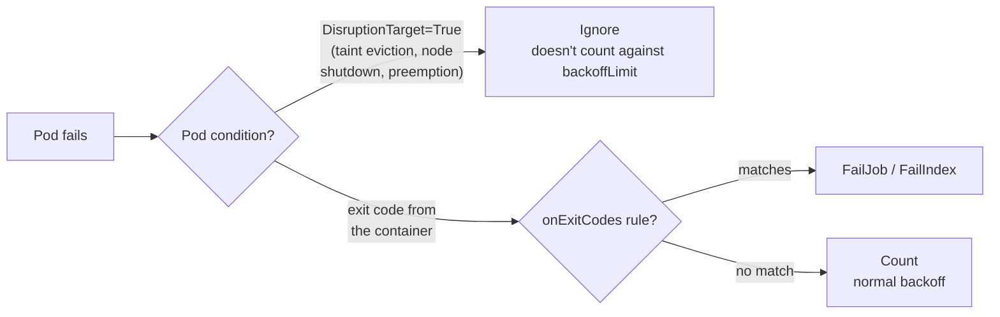
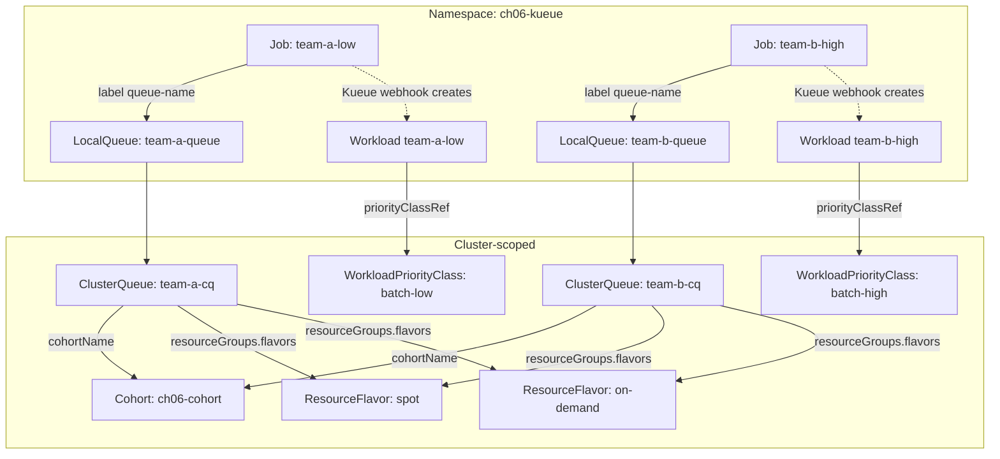

# 06 · Batch Jobs and Kueue

> Turning a Kubernetes cluster into a shared, quota-fair batch scheduler for ML work: Jobs and
> Indexed Jobs that survive spot reclaims, and **Kueue** (ResourceFlavor, ClusterQueue,
> LocalQueue, Cohort, preemption, WorkloadPriorityClass) on **EKS**.

---

## Before you start

This chapter assumes:

- A cluster from chapter `00-prerequisites-and-cluster-setup` or any cluster for the cpu-lab path —
  Kueue itself needs no GPUs.
- `env.sh` and `versions.env` sourced (`source env.sh && source versions.env`) so `${KUEUE_VERSION}`
  and `${EKS_CLUSTER}`/`${AWS_REGION}` are set.
- For Step 5 (real spot vs on-demand ResourceFlavors): AWS IAM/quota to create a second (on-demand)
  node group alongside the spot group — see the table in `CONVENTIONS.md` for EKS's spot label.
- No GPU node pool is required for this chapter — it's CPU-only quota management. If you're
  continuing straight from chapter `05-model-storage-and-data`, you can reuse that cluster as-is.

## 1. Why this matters

**If you're new to both Kubernetes and GPU/AI infra, start here.** Everything in this chapter
is about one gap: Kubernetes ships with a scheduler, but a scheduler alone cannot run a shared,
multi-team batch platform fairly. Concretely:

- **A `Deployment` is for things that run forever** — a web server, an API, a model-serving
  endpoint. Kubernetes keeps N replicas alive indefinitely and restarts them if they crash,
  because "done" is never supposed to happen.
- **A `batch/v1` Job is for things that run once and finish** — process this dataset, train
  for these 10 epochs, run this hyperparameter trial. A Job tracks *completions* (how many pods
  must exit `0` before the work counts as done) instead of *replicas* (how many must always be
  running). This is the shape almost all ML batch/training work actually has, which is why this
  chapter (and Kubeflow Trainer in chapter `07`, RayJob in chapter `08`) builds on Jobs, not
  Deployments.
- **`kube-scheduler`** (the built-in scheduler that ships with every Kubernetes cluster,
  including EKS) answers exactly one question, once, per pod: *"is there a node with enough
  free CPU/memory/GPU right now for this one pod?"* It has no concept of a team, a budget, a
  queue, or "this pod is part of a group of 4 that only makes sense together." It also runs the
  instant a pod object is created — there's no waiting room. Left to itself, `kube-scheduler`
  will happily schedule team A's 200-pod sweep first and starve team B for the rest of the day,
  or start 3 of a 4-worker gang and leave the job deadlocked, because from its point of view
  each pod is an independent, unrelated request.

That gap — no queue, no per-team budget, no all-or-nothing admission — is exactly what a raw
cluster scheduler cannot fix by itself, no matter how you tune it: `kube-scheduler`'s job is
*placement* (which node), not *admission* (should this workload be allowed to start at all,
right now, given who else is asking). Those are two different problems, solved by two different
components, and Kueue is the one that solves the second.

**Kueue** sits in front of the scheduler as an *admission* layer — a checkpoint that decides
*whether and when* a whole Job is allowed to be handed to `kube-scheduler` at all, before any of
its individual pods are placed on nodes. Think of an airport: `kube-scheduler` is the gate agent
who seats one passenger into one free seat; Kueue is the check-in desk deciding, per flight,
which *group* of passengers gets to board next given how full the plane's economy vs business
sections are and which airline (team) bought which allotment of seats. Pods aren't the unit
Kueue manages — a `batch/v1` Job, an Indexed Job, a `RayJob`, a `PyTorchJob`, and (from chapter
`07-distributed-training-kubeflow-trainer`) a `TrainJob` are. Kueue holds each one back
(`spec.suspend: true`, a native field on the Job that simply tells Kubernetes "don't create pods
for this yet") until it has proven there is quota for it, then flips `suspend` to `false` so
`kube-scheduler` sees the pods and does its normal one-pod-at-a-time placement work. That single
idea — queue first, schedule second — gives you, for free:

- **Multi-tenant fairness** — a ClusterQueue per team, with nominal quota and the ability to
  borrow spare capacity from a shared **Cohort** and give it back via **preemption**.
- **Spot-aware scheduling** — a **ResourceFlavor** per capacity type (spot vs on-demand), tried
  in the order you list them, so batch work defaults to the cheap capacity and only falls back
  to on-demand when spot is exhausted.
- **Queueing instead of scheduler storms** — pending work waits in a LocalQueue instead of
  hammering the API server with pods that immediately go `Pending`.

In DevOps terms this chapter is about **capacity management for batch compute**: the same
problem an HPC scheduler (Slurm, LSF) or a data-platform's YARN/Spark queues solve, applied to
Kubernetes-native Jobs. Chapters `07` (Kubeflow Trainer) and `08` (Ray) both sit *on top* of
Kueue rather than replacing it.

## 2. Learning objectives & time plan (~3 h)

By the end you can:

1. Explain why `podFailurePolicy` matters for Jobs on spot capacity, and write an Indexed Job
   that ignores spot-reclaim failures without masking real bugs.
2. Model Kueue's object graph: ResourceFlavor → ClusterQueue → Cohort, LocalQueue → ClusterQueue,
   Workload (generated per Job) → WorkloadPriorityClass.
3. Configure spot-first ResourceFlavors on EKS and explain why the flavor needs `nodeLabels` but,
   unlike a cloud that auto-taints spot nodes, no `tolerations`.
4. Set up two ClusterQueues that share a Cohort, watch one borrow the other's unused quota, and
   trigger classical preemption with a WorkloadPriorityClass.
5. Read `kubectl get workloads` / `kubectl describe clusterqueue` to diagnose why a Job is
   pending, and know the difference between Fair Sharing and classical preemption.

| Block | Time | What |
|---|---|---|
| Theory | 40 min | §3 concepts, object model, the two preemption models |
| Lab A (any cluster) | 45 min | cpu-lab: install Kueue, queues, plain Job, Indexed Job + podFailurePolicy |
| Lab B (your cloud) | 60 min | spot/on-demand node pools, cloud-patched ResourceFlavors, borrowing + preemption |
| Lab C (optional) | 20 min | Fair Sharing vs classical preemption, WorkloadPriorityClass mutability |
| Review | 15 min | spot notes, troubleshooting, checkpoint questions |

## 3. Concepts

### 3.0 Job vs. Deployment, and "scheduling" vs. "admission" — the two ideas everything else builds on

If you've only used Kubernetes for long-running services so far, these two distinctions are
worth pinning down before the rest of this chapter's vocabulary (ResourceFlavor, ClusterQueue,
etc.) will make sense:

| | `Deployment` (+ `Pod`) | `batch/v1` `Job` |
|---|---|---|
| Intent | "Keep N of these running, forever" | "Run this to completion, then stop" |
| Restarts on exit 0 | Never stops (that's a bug/crash) | Expected — it's how the pod finishes |
| Tracks | `replicas` (desired running count) | `completions` (successful-exit count) |
| Typical AI use | A model-serving endpoint, an API | Training a model, batch inference, a data prep run |
| Kueue manages it? | Not by default in this chapter | Yes — this whole chapter is about Jobs |

A **plain Kubernetes `Pod`** is the smallest deployable unit — one or more containers scheduled
together on one node. You almost never create bare Pods directly; a Deployment or a Job creates
and supervises them for you. If this is your first time seeing the word "Pod," it's simply "the
thing `kube-scheduler` places on a node" — everything else (Deployment, Job, ReplicaSet) is a
*controller* that creates Pods according to some policy.

**Scheduling** and **admission** are two separate decisions, made by two separate pieces of
software, in this chapter:

- **Scheduling** = "given that this pod is allowed to exist, which specific node has room for
  it?" `kube-scheduler` does this, for every pod, unconditionally, the moment the pod object
  appears in the API server. It runs whether or not Kueue is installed.
- **Admission** (as Kueue uses the word) = "should this workload be allowed to ask the
  scheduler for nodes *right now at all*, given the quota already in use by this workload's
  team and by other teams sharing the cluster?" This check happens *before* any pod exists —
  Kueue holds the whole Job suspended and only creates zero pods for it until admission passes.

Without an admission layer, the only lever you have is *scheduler* priority/preemption, which
operates pod-by-pod and has no idea a Job's pods form one logical unit, and no idea what quota
"team A" already has in flight. That's the concrete reason a raw cluster scheduler cannot do
fair GPU (or CPU) sharing across teams on its own: fairness requires remembering state across
many Jobs and many teams over time, and holding some of them back — that's a queue, and
`kube-scheduler` was never built to be one.

### 3.1 Jobs and Indexed Jobs for ML work

A plain `batch/v1` Job with `parallelism`/`completions` runs N identical, unordered pods — fine
for "process whatever's in this queue" work. An **Indexed Job** (`completionMode: Indexed`) gives
each pod a stable `$JOB_COMPLETION_INDEX` (0..N-1) it can read from its own environment/hostname,
which is the shape almost all parallel ML batch work actually needs: shard `i` of a dataset,
partition `i` of a hyperparameter sweep, rank `i` of a (non-gang) distributed job. It's also the
foundation JobSet and Kubeflow Trainer's PyTorch runtime build on for `torchrun --node-rank`.

### 3.2 podFailurePolicy: telling spot reclaims apart from real bugs

By default, every failed pod counts against a Job's `backoffLimit`, whether it failed because
your code panicked or because the cloud reclaimed the spot instance it was running on. On a
reclaim-heavy spot pool that means Jobs fail for reasons that have nothing to do with the code.

The diagram below reads left to right, following one pod's failure through the Job controller's
decision: it always starts at "Pod fails," then branches on *why* the pod's container process
exited — and that branch is the whole point of `podFailurePolicy`, because without it every one
of these paths would just fall into "count against backoffLimit," including the spot-reclaim
one you specifically don't want to count.



`spec.podFailurePolicy.rules` (native `batch/v1`, requires `restartPolicy: Never`) lets you say
"a pod failure caused by disruption doesn't count; a real exit code does." See
`common/jobs/job-indexed-spot.yaml` for the full rule set.

### 3.3 Kueue's object model

If you've never used a queueing/admission-control system before (this isn't unique to
Kubernetes — HPC schedulers like Slurm, or a database's connection-pool admission control, work
the same way), the mental model is: **requests don't get resources directly; they get resources
by first being granted a place in a queue that has a budget.** Six new object *kinds* show up in
this chapter, all under the `kueue.x-k8s.io/v1beta2` API group — none of them existed in "plain"
Kubernetes before you installed Kueue. Skim these once, then use the diagram below as the map:

- **ResourceFlavor** — answers "what *kind* of node is this?" (e.g., spot vs. on-demand). It
  carries no quota by itself — just labels/taints to match against.
- **ClusterQueue** — answers "how much of each ResourceFlavor is team X allowed to use?" This
  is where the actual numeric budget (quota) lives.
- **Cohort** — answers "which ClusterQueues are allowed to lend/borrow spare quota to/from each
  other?" A ClusterQueue with no Cohort is an island: it can never borrow, and nothing can
  borrow from it.
- **LocalQueue** — answers "which ClusterQueue does *this namespace's* Jobs actually go to?"
  It's the namespaced front door users' Jobs point at — a team never references a ClusterQueue
  by name in their Job.
- **Workload** — answers "what does Kueue currently think this specific Job needs and has it
  been let in?" You never write one; Kueue's webhook generates exactly one per queued Job and
  updates its status as admission decisions happen. It's the object you `kubectl get`/`describe`
  to see *why* a Job is or isn't running.
- **WorkloadPriorityClass** — answers "when two Workloads are both waiting, which goes first,
  and which can preempt (evict) the other?" Independent of pod-level `PriorityClass`.

Now the object graph — read it as: a Job picks a LocalQueue by label, the LocalQueue forwards it
to one ClusterQueue, and the ClusterQueue checks its own quota (and, if needed, its Cohort's
spare quota across the ResourceFlavors it's configured for) before Kueue's webhook creates a
Workload and (once admitted) lets the Job's pods actually reach `kube-scheduler`:



- **ResourceFlavor** — a named "kind of node" (`nodeLabels`, `nodeTaints`/`tolerations`, and
  optionally `topologyName` for Topology Aware Scheduling — see §3.6). Cluster-scoped, no quota
  of its own.
- **ClusterQueue** — cluster-scoped quota holder. `spec.resourceGroups[].flavors[]` lists, in
  preference order, which flavors cover which resources and their `nominalQuota` /
  `borrowingLimit` / `lendingLimit`. `spec.cohortName` joins a Cohort. In plain terms:
  - **`nominalQuota`** is this team's own guaranteed slice — "team-a-cq always gets 4 CPU of
    spot, full stop, even if every other team also wants spot right now." Nobody can take this
    away from team A.
  - **`borrowingLimit`** is the *extra*, on top of `nominalQuota`, this ClusterQueue is allowed
    to temporarily use from its Cohort's unused capacity when other teams aren't using their
    full share. It's a ceiling on generosity, not a guarantee — if the lending team suddenly
    needs its quota back, Kueue preempts (see §3.5) the borrowed-in work.
  - **`lendingLimit`** (the mirror image, set on the *lending* side) caps how much of a
    ClusterQueue's own nominal quota it's willing to let others borrow, in case a team wants to
    keep some headroom in reserve even while "sharing."
- **Cohort** — its own CRD since v1beta2 (it was a bare string in v1beta1). Lets ClusterQueues
  lend/borrow spare quota to/from each other; also carries the `fairSharing.weight` used for Fair
  Sharing.
- **LocalQueue** — namespaced. `spec.clusterQueue` points at one ClusterQueue. This is what
  users' Jobs actually target via the `kueue.x-k8s.io/queue-name` label.
- **Workload** — generated automatically by Kueue's webhook for every queued Job (one Workload
  per Job, tracking its PodSets/requests and admission status). You read these, you don't write
  them.
- **WorkloadPriorityClass** — cluster-scoped, `kueue.x-k8s.io/v1beta2`, independent of Kubernetes
  `scheduling.k8s.io/v1` PriorityClass. Set it with the `kueue.x-k8s.io/priority-class` label on
  the Job. It governs queue ordering and preemption *only*; it does not touch pod priority unless
  the Job has no PriorityClass of its own. Concretely: a `WorkloadPriorityClass` decides who
  jumps the *queue* and who gets *evicted* to make room for someone else's Workload — it never
  changes how the OS/kubelet schedules processes on a node the way a pod-level `PriorityClass`
  can.

Tying this back to §3.0's scheduling-vs-admission split: **"admission"** in this chapter always
means the moment a ClusterQueue's quota check passes for a Workload — the instant *before* that,
the Job sits with `spec.suspend: true` and has zero pods; the instant *after*, Kueue flips
`suspend` to `false` and only then does `kube-scheduler`'s ordinary node-placement logic ever
see this Job's pods. Concretely: `kueue.x-k8s.io/queue-name` on a Job triggers Kueue's mutating
webhook to set `spec.suspend: true`; Kueue flips it back to `false` once the matching Workload is
admitted.

### 3.4 Spot-first flavor ordering and flavorFungibility

`resourceGroups[].flavors` is an **ordered** list. With the default `flavorFungibility`
(`whenCanBorrow: Borrow`, `whenCanPreempt: TryNextFlavor`), Kueue tries the first flavor a
Workload fits in — including quota it can *borrow* from the cohort — before trying the next one.
Listing `spot` before `on-demand` in every ClusterQueue in this chapter is what makes "spot
first, on-demand fallback" happen; you never set that on the Job itself.

### 3.5 Two ways to share a cohort: classical preemption vs Fair Sharing

| | Classical preemption | Fair Sharing |
|---|---|---|
| Enable | default; configure per-ClusterQueue `spec.preemption` | opt-in: `fairSharing:` block in the cluster-wide `Configuration` |
| `reclaimWithinCohort` | `Never` / `LowerPriority` / `Any` | still applies |
| `borrowWithinCohort` | governs preemption *while borrowing* | **not used** — the docs are explicit these two don't mix |
| Ordering signal | priority (and, as a tiebreak, borrowWithinCohort) | each ClusterQueue's *historical share* of the cohort, weighted by `Cohort.spec.fairSharing.weight` |
| Good for | "team B's priority-10000 job always wins" | "over time, give every team roughly its weighted share, regardless of priority" |

This chapter's default install (`common/values-kueue.yaml`) uses **classical preemption** —
`team-a-cq`/`team-b-cq` set `reclaimWithinCohort: LowerPriority` and `borrowWithinCohort`. §Lab C
and `common/values-kueue-fairsharing.yaml` show how to switch to Fair Sharing instead (not both
at once).

### 3.6 Topology Aware Scheduling (mention only)

For multi-node training/inference you eventually care not just *that* a Workload gets nodes, but
that its pods land close together on the datacenter network (same rack/block). Kueue's
**Topology Aware Scheduling** (`Topology` CRD + `ResourceFlavor.spec.topologyName`) does that;
it's out of scope here but chapters `07` and `12` (multi-node serving) come back to it — see the
[TAS docs](https://kueue.sigs.k8s.io/docs/concepts/topology_aware_scheduling/) if you're curious
now.

## 4. Lab

Layout:

```
06-batch-jobs-and-kueue/
├── common/
│   ├── base/             namespace ch06-kueue
│   ├── flavors/          ResourceFlavor spot + on-demand (empty nodeLabels — cloud overlays patch them)
│   ├── queues/            Cohort, team-a-cq/team-b-cq, team-a-queue/team-b-queue, batch-low/batch-high
│   ├── jobs/              job-simple (pattern a), job-indexed-spot (pattern b, podFailurePolicy), job-high-priority
│   ├── values-kueue.yaml              Helm values: classical preemption (default)
│   └── values-kueue-fairsharing.yaml  Helm values: Fair Sharing (§Lab C, optional)
├── eks/                  nodegroup config (spot + on-demand), ResourceFlavor patches
└── cpu-lab/              same queues, unpatched flavors — any cluster, no cloud IAM
```

```bash
source env.sh && source versions.env
```

### Step 1 · CPU lab: install Kueue, inspect the queues

What you're about to do, and why in this order: the kustomize apply below creates every object
from §3.3 *except* Kueue's own controller — the namespace, both ResourceFlavors, the Cohort,
both ClusterQueues, both LocalQueues, and both WorkloadPriorityClasses. None of this actually
does anything yet, because Kueue's controller (the process that watches these objects and
performs admission) doesn't exist until the second command runs `helm install`. This order is
deliberate and safe either way — Kueue's CRDs and controller can come up before or after the
objects that use them — but doing the cheap, no-cluster-mutation kustomize apply first means
that if something's wrong with your YAML you find out before waiting on a Helm install.
`cpu-lab/install-kueue.sh` is a real file in this repo ([view
it](cpu-lab/install-kueue.sh)) — not inlined here because it's one of the few scripts CONVENTIONS.md
allows to stay a script, since it's a single reusable install step you'll also re-run from
Step 5 in spirit (there you'll run the equivalent `helm install` by hand, pinned to a node
selector).

```bash
kubectl apply -k 06-batch-jobs-and-kueue/cpu-lab      # namespace + flavors + cohort + queues + priority classes
./06-batch-jobs-and-kueue/cpu-lab/install-kueue.sh    # helm install kueue, --version ${KUEUE_VERSION}
kubectl get resourceflavor,clusterqueue,cohort,workloadpriorityclass
kubectl get localqueue -n ch06-kueue
```

Expected: `team-a-cq` and `team-b-cq` both show `Active: True` (a ClusterQueue reports
`Active: False` if it references a ResourceFlavor or Cohort that doesn't exist yet — that's the
webhook/controller cross-checking the object graph from §3.3 for you); `kubectl describe
clusterqueue team-a-cq` shows `resourceGroups` with `spot` before `on-demand` and the nominal
quotas from §3.4.

### Step 2 · Pattern (a): a plain Job through the queue

What you're about to do: submit `job-simple.yaml` — a plain, unmodified-looking `batch/v1` Job
whose only Kueue-specific content is the two labels
(`kueue.x-k8s.io/queue-name: team-a-queue`, `kueue.x-k8s.io/priority-class: batch-low`) — and
watch it go through the full suspend → admit → schedule lifecycle from §3.0/§3.3 instead of
starting immediately the way a Job normally would. The three commands below are three different
windows into the *same* admission event: `kubectl get workloads -w` watches Kueue's own view
(the Workload object), the `jsonpath` check watches the Job's `spec.suspend` flip from `true` to
`false` (this is the literal moment `kube-scheduler` is allowed to see this Job's pods), and the
final `kubectl get pods` confirms pods actually exist and are running — something that would be
impossible while `suspend` was still `true`.

```bash
kubectl apply -f 06-batch-jobs-and-kueue/common/jobs/job-simple.yaml
kubectl get workloads -n ch06-kueue -w   # Ctrl-C once ADMITTED
kubectl get job team-a-low -n ch06-kueue -o jsonpath='{.spec.suspend}'; echo   # false once admitted
kubectl get pods -n ch06-kueue -l app=team-a-low
```

Example output:

```
NAME                          QUEUE          RESERVED IN   ADMITTED   FINISHED   AGE
team-a-low-a1b2c              team-a-queue   team-a-cq     True                  3s
```

### Step 3 · Pattern (b): Indexed Job with podFailurePolicy, then simulate a spot reclaim

What you're about to do: this Job has 4 pods, each with a stable index `0..3`
(`completionMode: Indexed`, §3.1) and each writing a checkpoint file once its "work" finishes
(§3.2). You'll delete one *running* pod yourself — standing in for the cloud reclaiming its spot
instance mid-run — and confirm the Job doesn't treat that as a failure. `kubectl delete pod`
(without `--grace-period=0 --force`) is a graceful/API-initiated deletion, which is what sets the
`DisruptionTarget` pod condition your `podFailurePolicy` rule matches on — this is why the
comparison at the end of this step (a forced `kill -9`) behaves differently: it never sets that
condition, so it isn't ignored.

```bash
kubectl apply -f 06-batch-jobs-and-kueue/common/jobs/job-indexed-spot.yaml
kubectl get pods -n ch06-kueue -l app=team-a-indexed
# Simulate the cloud reclaiming the node under one shard mid-run:
kubectl delete pod -n ch06-kueue -l app=team-a-indexed --field-selector=status.phase=Running --wait=false | head -1
kubectl get job team-a-indexed -n ch06-kueue -o jsonpath='{.status.failed}'; echo   # stays empty/0
kubectl -n ch06-kueue wait --for=condition=complete job/team-a-indexed --timeout=10m
```

Because the deleted pod's replacement re-checks `/checkpoints/<index>.done` before redoing the
work, and because `podFailurePolicy` ignores the `DisruptionTarget` condition, the Job finishes
without touching `backoffLimit`. Compare: delete a pod with `kubectl delete pod ... 
--grace-period=0 --force` right after exec'ing in and running `kill -9 1` on a real bug — that
still fails normally, because there's no `DisruptionTarget` condition on a plain container crash.

### Step 4 · Borrowing and preemption across the cohort

What you're about to do: this is the step that actually exercises the "fair sharing across
teams" promise from §1 — the reason a raw scheduler can't do this on its own. First you push
team-a-cq near/over its own nominal quota (its Jobs are allowed to *borrow* team-b-cq's unused
spot quota via the shared Cohort, per §3.4's `borrowingLimit`); then you submit a high-priority
team-b Job that needs its own quota back. Watch `flavorsUsage` to see the borrowed amount as a
number, and `describe clusterqueue` to see Kueue's own explanation of the preemption/borrowing
decision it made — you don't have to take the paragraph below on faith.

```bash
# team-a takes almost all the shared spot quota:
kubectl apply -f 06-batch-jobs-and-kueue/common/jobs/job-simple.yaml   # ~1.5 CPU of team-a-cq's 4 CPU spot quota... run it a few times, or bump `parallelism`, to actually exhaust it
kubectl get clusterqueue team-a-cq -o jsonpath='{.status.flavorsUsage}'; echo
# team-b needs more spot than its own 1 CPU nominal quota — watch it borrow:
kubectl apply -f 06-batch-jobs-and-kueue/common/jobs/job-high-priority.yaml
kubectl get workloads -n ch06-kueue -o custom-columns=NAME:.metadata.name,QUEUE:.spec.queueName,ADMITTED:.status.conditions[-1].type
kubectl describe clusterqueue team-b-cq | grep -A6 "Preemption\|Borrowing"
```

Because `team-b-high` carries `batch-high` (value 10000) and team-a's running pods carry
`batch-low` (value 100), and `team-a-cq`/`team-b-cq` both set `reclaimWithinCohort:
LowerPriority` + `borrowWithinCohort.policy: LowerPriority`, Kueue evicts enough of team-a-low's
pods to admit team-b-high once team-b needs to reclaim its share. Evicted pods' Workloads go back
to `Pending` and are retried automatically — you don't resubmit anything.

### Step 5 (your cloud) · Real spot vs on-demand ResourceFlavors

What you're about to do: tear down the cpu-lab install, create a real spot + on-demand node-group
pair on EKS, and re-install Kueue with the controller pinned to the on-demand group. The teardown
matters because cpu-lab's ResourceFlavors have empty `nodeLabels: {}` (§`common/flavors/`), which
matches *any* node — fine for a single-pool kind/minikube cluster, but on EKS you want `spot` and
`on-demand` to mean something real, which is what the `eks/` overlay's patches (§eks/kustomization.yaml)
give you instead.

```bash
kubectl delete -k 06-batch-jobs-and-kueue/cpu-lab   # tear down the cpu-lab queues first
helm uninstall kueue -n kueue-system
```

Create the node groups ([`eks/nodegroup-ch06.yaml`](eks/nodegroup-ch06.yaml) defines a diversified
`ch06-cpu-spot` group and a tiny `ch06-cpu-ondemand` group for the Kueue controller itself — edit
`metadata.name`/`region` to match `env.sh` first). This is plain `eksctl`, not Kueue — it's the
actual EC2 capacity that the `spot`/`on-demand` ResourceFlavors will later point at; Kueue never
creates nodes itself, it only decides which already-existing nodes admitted Workloads are allowed
to land on:
```bash
eksctl create nodegroup -f 06-batch-jobs-and-kueue/eks/nodegroup-ch06.yaml
```

What you're about to do next: install Kueue via the official OCI Helm chart, pinned to
`${KUEUE_VERSION}`, with the controller pinned to the on-demand nodegroup
(`eks.amazonaws.com/capacityType=ON_DEMAND`) so a spot reclaim never takes the scheduler itself down.
```bash
: "${KUEUE_VERSION:?source versions.env}"
helm install kueue oci://registry.k8s.io/kueue/charts/kueue \
  --version "${KUEUE_VERSION}" \
  --namespace kueue-system --create-namespace \
  -f 06-batch-jobs-and-kueue/common/values-kueue.yaml \
  --set 'controllerManager.nodeSelector.eks\.amazonaws\.com/capacityType=ON_DEMAND' \
  --wait --timeout 5m
kubectl -n kueue-system rollout status deploy/kueue-controller-manager --timeout=5m
kubectl get crd | grep kueue.x-k8s.io
```

Then apply the EKS overlay, which patches the `spot`/`on-demand` ResourceFlavors to the labels EKS
managed node groups apply automatically for each `capacityType`:
```bash
kubectl apply -k 06-batch-jobs-and-kueue/eks
kubectl get resourceflavor spot -o yaml | grep -A3 nodeLabels
```
Expected: `nodeLabels` shows `eks.amazonaws.com/capacityType: SPOT`. How to tell this worked:
`kubectl get nodes -L eks.amazonaws.com/capacityType` shows `SPOT` on the spot nodegroup's nodes.
EKS doesn't taint spot nodes automatically, so `nodeLabels` alone is enough — the flavor needs no
`tolerations` here (compare a cloud that auto-taints spot pools, where the flavor would need a
matching toleration too, or admitted pods would never schedule there).

Re-run Steps 2–4 against the EKS overlay. `kubectl get pods -n ch06-kueue -o wide` plus
`kubectl get nodes -L eks.amazonaws.com/capacityType` shows the pods landing specifically on the
spot pool — you never wrote a `nodeSelector` on the Job; Kueue's admission webhook copied it in
from the ResourceFlavor.

### Step 6 (optional) · Fair Sharing instead of classical preemption

What you're about to do: switch the cohort from classical preemption to Fair Sharing and observe
that admission order now follows historical share instead of priority. The `kubectl patch`
commands below clear `borrowWithinCohort` on both ClusterQueues first, because §3.5 and the
Kueue docs are explicit that this field only means something under classical preemption — leaving
it set while Fair Sharing is also enabled doesn't error, it just leaves stale, ignored config
that will confuse whoever reads this ClusterQueue's YAML next.

```bash
kubectl patch clusterqueue team-a-cq --type merge -p '{"spec":{"preemption":{"borrowWithinCohort":null}}}'
kubectl patch clusterqueue team-b-cq --type merge -p '{"spec":{"preemption":{"borrowWithinCohort":null}}}'
```

```bash
helm upgrade kueue oci://registry.k8s.io/kueue/charts/kueue --version "${KUEUE_VERSION}" \
  -n kueue-system -f 06-batch-jobs-and-kueue/common/values-kueue.yaml \
  -f 06-batch-jobs-and-kueue/common/values-kueue-fairsharing.yaml \
  --set 'controllerManager.nodeSelector.eks\.amazonaws\.com/capacityType=ON_DEMAND'
```

```bash
kubectl get clusterqueue -o custom-columns=NAME:.metadata.name,WEIGHTEDSHARE:.status.fairSharing.weightedShare
```

Expected: both ClusterQueues listed, `WEIGHTEDSHARE` starts at `0` for both. Re-run Step 4's two
`kubectl apply` commands. How to tell this worked: admission order now depends on each
ClusterQueue's historical share of the cohort (`Cohort.spec.fairSharing.weight`, both `1` here so
it's an even split), not purely on `batch-high` vs `batch-low` — check `WEIGHTEDSHARE` climbing on
whichever queue is consuming more than its fair split.

## 5. Spot considerations

- **This whole chapter is the spot-interruption story for batch work.** `podFailurePolicy` +
  Indexed Jobs (§3.2) is the pattern; everything else (checkpointing to object/shared storage
  from chapter `05`) is what makes the re-run cheap instead of starting from zero.
- **Pin the Kueue controller off spot.** It's a control-plane component for every team's queue;
  Step 5's `helm install`/`helm upgrade` sets `controllerManager.nodeSelector` to the on-demand
  nodegroup. If it runs on spot and gets reclaimed, admission for the whole cluster stalls until it
  reschedules.
- **`waitForPodsReady` avoids half-admitted gangs.** Enabled in `common/values-kueue.yaml`. Without
  it, a multi-pod Workload can have some pods scheduled and others stuck (e.g. spot momentarily
  out of capacity in one AZ), burning quota on a Job that can't actually make progress.
- **`borrowingLimit` caps the blast radius of borrowing.** Without one, a team that never uses
  its own on-demand quota could grab the *entire* cohort's spot capacity during a burst, starving
  everyone else the moment spot gets scarce.
- **EKS doesn't taint spot nodes automatically**, so this chapter's `spot` ResourceFlavor only
  needs `nodeLabels`, not `tolerations`. If you later diversify onto a cloud/setup that does taint
  spot nodes, remember any Job not routed through a LocalQueue backed by a flavor with the matching
  toleration will simply never schedule there.

## 6. Troubleshooting

| Symptom | Likely cause | Why this happens | Fix |
|---|---|---|---|
| Job stuck `suspend: true` forever, no Workload admitted | ClusterQueue quota too small for the request, or `namespaceSelector` doesn't match | Kueue only flips `suspend` to `false` after admission succeeds (§3.3) — if the Workload can never fit inside `nominalQuota` + `borrowingLimit`, or the ClusterQueue's `namespaceSelector` doesn't include your namespace, Kueue has nothing wrong to report except "still waiting," because from its side this is normal queueing, not an error | `kubectl describe workload <name> -n ch06-kueue`; check `status.conditions` message |
| `Error creating: admission webhook ... denied the request: cohortName ...` | Cohort object doesn't exist yet | Kueue's validating webhook checks referential integrity at apply time — a ClusterQueue naming a Cohort that isn't in the API server yet is rejected immediately rather than silently created in a broken state, the same way Kubernetes rejects a Pod referencing a Secret that doesn't exist for volume mounts | Apply `common/queues` (includes `cohort.yaml`) before any ClusterQueue referencing it |
| `reclaimWithinCohort=Never and borrowWithinCohort.Policy!=Never` on `kubectl apply` | Kueue's webhook rejects that specific combination | Logically, "never reclaim borrowed quota" and "have a policy for reclaiming it" contradict each other — the webhook validates this combination fails fast at `apply` time instead of leaving you with config that would silently never trigger | Set `reclaimWithinCohort` to `LowerPriority`/`Any` if you set `borrowWithinCohort` |
| Preemption doesn't happen even though priorities differ | Fair Sharing is enabled cluster-wide — `borrowWithinCohort` is a no-op under Fair Sharing | The two cohort-sharing models (§3.5) use different signals to decide who gets preempted — priority for classical preemption, historical weighted share for Fair Sharing — and the docs are explicit the two don't compose, so a leftover `borrowWithinCohort` from before you enabled Fair Sharing is simply never read | Pick one model (§3.5); don't run both configs at once |
| Workload preempted pods immediately re-admitted on the *same* low-priority Job | Requeuing worked as designed — that's expected once the preemptor's own Workload completes and frees quota | Preemption evicts pods, not the Workload itself — Kueue's requeue logic puts the evicted Workload straight back in the queue, so once the higher-priority Workload finishes and releases its quota, the same low-priority Job is simply next in line again, with no resubmission needed | n/a |
| `helm install kueue` times out waiting for webhook | cert-manager not installed and `enableCertManager=false` (chart default: internal cert management) needs the webhook Service reachable | Kueue's admission/mutating webhooks (the ones that set `spec.suspend` and validate ClusterQueue references above) need a live TLS certificate to serve HTTPS; if the Service backing the webhook isn't reachable, `helm install --wait` blocks forever waiting for a readiness check that can never pass | `kubectl get pods -n kueue-system`; check `kueue-controller-manager` logs |
| Indexed Job pod fails and **does** count against `backoffLimit` even though the node was reclaimed | No `DisruptionTarget` condition — e.g. you force-killed the pod (`--grace-period=0`) instead of a real taint-eviction/API eviction | `podFailurePolicy`'s `Ignore` rule (§3.2) matches a specific pod *condition*, not "the pod died for any external reason" — a forced kill skips the graceful eviction path entirely, so Kubernetes never sets `DisruptionTarget=True`, and the rule has nothing to match against | Test with `kubectl delete pod` (soft) or an actual spot reclaim, not a forced delete |
| `kubectl get workloads` shows `Pending`, `status.conditions` mentions `borrowing limit exceeded` | `borrowingLimit` on the flavor is smaller than the request | `borrowingLimit` (§3.3) is a hard ceiling Kueue enforces the same way it enforces `nominalQuota` — it exists specifically so one team can't consume the whole cohort's spare capacity, so a request over that ceiling is refused even if the cohort has room in aggregate | Raise `borrowingLimit`, or request less |

## 7. Cleanup & cost notes

What you're about to do: delete the Jobs, queues, Kueue install and the node groups created in
Step 5 — spot **and** on-demand capacity costs money even sitting idle.
```bash
kubectl delete -f 06-batch-jobs-and-kueue/common/jobs --ignore-not-found
kubectl delete -k 06-batch-jobs-and-kueue/cpu-lab --ignore-not-found   # or eks — whichever you applied

: "${EKS_CLUSTER:?source env.sh}" "${AWS_REGION:?}"
kubectl delete -k 06-batch-jobs-and-kueue/eks --ignore-not-found
helm uninstall kueue -n kueue-system || true
kubectl delete namespace kueue-system --ignore-not-found

eksctl delete nodegroup --cluster "${EKS_CLUSTER}" --region "${AWS_REGION}" --name ch06-cpu-spot || true
eksctl delete nodegroup --cluster "${EKS_CLUSTER}" --region "${AWS_REGION}" --name ch06-cpu-ondemand || true
```

- Kueue itself costs nothing beyond the controller pod (small, one on-demand node). The cost here
  is entirely the node groups: both are configured with `minSize: 0`, so **scale-to-zero** is what
  keeps this chapter close to free between lab sessions.
  Pending Workloads/queues cost nothing on their own — only running pods do.
- The cleanup above deletes both node groups. If you're moving straight to chapter `07`, keep the
  cluster and just delete the Kueue install + this chapter's namespace, and re-install Kueue there
  (it configures the `trainer.kubeflow.org/trainjob` integration too).
- CPU quota, not GPU quota, is what this chapter needs, so there's no accelerator quota request to
  plan around here — unlike chapters `01`–`04`, `07`+.

## 8. Checkpoint questions

1. Why does a Job need `kueue.x-k8s.io/queue-name` to be managed by Kueue at all — what does the
   admission webhook do differently for a Job with that label versus one without it?
2. `resourceGroups[].flavors` lists `spot` before `on-demand`. What Kueue setting determines
   whether a Workload that doesn't fit in `spot`'s quota tries `on-demand`, versus waits and
   borrows more `spot` quota from the cohort?
3. Your Indexed Job's `podFailurePolicy` ignores `DisruptionTarget=True`. A teammate's container
   segfaults with exit code 139. Does that count against `backoffLimit`? Why?
4. What's the difference between a Kubernetes `scheduling.k8s.io/v1` `PriorityClass` and a Kueue
   `WorkloadPriorityClass`, and what happens if a Job sets only the latter?
5. `borrowWithinCohort` and cluster-wide Fair Sharing are documented as mutually exclusive. What
   breaks (or silently no-ops) if you configure both?
6. Why does this chapter's "spot" ResourceFlavor on EKS need only `nodeLabels` and no
   `spec.tolerations`, and what would have to change if the cluster's spot node group were tainted?
7. Two ClusterQueues share a Cohort. team-a-cq is using more than its nominal quota (borrowed from
   team-b-cq). team-b-cq now needs that capacity back. Name the two ClusterQueue fields that
   control whether — and which — of team-a's running Workloads get preempted.
8. Why is `waitForPodsReady` particularly relevant for spot capacity, compared to on-demand?

<details>
<summary>Answers</summary>

1. The label makes Kueue's mutating webhook set `spec.suspend: true` on the Job at creation and
   create a matching `Workload` object that tracks its resource requests. Kueue flips `suspend`
   back to `false` only once that Workload is admitted against a ClusterQueue's quota. A Job
   without the label is scheduled immediately by the default scheduler, completely outside Kueue.
2. `flavorFungibility` (`whenCanBorrow`, `whenCanPreempt`), together with the borrowing quota
   (`borrowingLimit`) configured on the `spot` flavor's entry in the ClusterQueue. Default
   behavior: try to borrow more of the current (spot) flavor before moving on to the next one.
3. Yes, it counts. The rule only matches pod condition `DisruptionTarget=True`, which is set for
   taint-based eviction, API-initiated eviction/preemption and graceful node shutdown — not for a
   container that crashed on its own. A real bug still fails the Job normally.
4. `PriorityClass` sets both the *pod's* scheduling priority and (by default) the workload's
   Kueue priority. `WorkloadPriorityClass` only sets the Kueue-side priority (queueing order,
   preemption eligibility) and leaves pod priority untouched — useful for prioritizing queue
   position without giving a Job's pods elevated priority against non-Kueue pods on the node.
5. Nothing throws a validation error, but `borrowWithinCohort` becomes a no-op: the docs state it
   "only works with Classical Preemption, not with Fair Sharing." Fair Sharing's own weighted-share
   comparison takes over as the sole preemption-across-cohort mechanism.
6. EKS managed node groups don't taint Spot nodes by default, so matching on
   `eks.amazonaws.com/capacityType: SPOT` via `nodeLabels` is enough to route admitted pods there.
   If the spot node group carried an automatic taint (as some clouds' Spot pools do), the flavor
   would also need a matching `spec.tolerations` entry, or admitted pods would never schedule on
   the spot pool despite passing admission.
7. `spec.preemption.reclaimWithinCohort` (must be `LowerPriority` or `Any`, not the default
   `Never`) and `spec.preemption.borrowWithinCohort.policy` (plus its optional
   `maxPriorityThreshold`) on the ClusterQueue that needs its quota back.
8. Spot capacity is more likely to be partially available (some pods schedule, others don't, in a
   given moment/zone) than on-demand. `waitForPodsReady` stops a Workload from sitting
   half-admitted, burning quota on pods that can't make progress until the rest show up, and
   requeues it as a whole if it can't get fully ready within the timeout.
</details>

## 9. Further reading

- [Kueue documentation](https://kueue.sigs.k8s.io/docs/) — [Installation](https://kueue.sigs.k8s.io/docs/installation/), [ClusterQueue](https://kueue.sigs.k8s.io/docs/concepts/cluster_queue/), [LocalQueue](https://kueue.sigs.k8s.io/docs/concepts/local_queue/), [Cohort](https://kueue.sigs.k8s.io/docs/concepts/cohort/), [Preemption](https://kueue.sigs.k8s.io/docs/concepts/preemption/), [Workload Priority Class](https://kueue.sigs.k8s.io/docs/concepts/workload_priority_class/), [Topology Aware Scheduling](https://kueue.sigs.k8s.io/docs/concepts/topology_aware_scheduling/)
- [Kueue API reference (v1beta2)](https://kueue.sigs.k8s.io/docs/reference/kueue.v1beta2/) and [source (`apis/kueue/v1beta2`)](https://github.com/kubernetes-sigs/kueue/tree/main/apis/kueue/v1beta2)
- Kubernetes: [Job — Pod failure policy](https://kubernetes.io/docs/concepts/workloads/controllers/job/#pod-failure-policy), [Indexed Jobs](https://kubernetes.io/docs/tasks/job/indexed-parallel-processing-static/)
- EKS: [EKS Spot best practices](https://docs.aws.amazon.com/eks/latest/best-practices/spot.html)
- Cross-link: `05-model-storage-and-data` (checkpointing/model caches these Jobs would load from), `07-distributed-training-kubeflow-trainer` (TrainJob is Kueue-managed the same way), `08-ray-on-kubernetes` (RayJob likewise), `13-node-autoscaling-and-cost` (Karpenter/Cluster Autoscaler provisioning the node pools these ResourceFlavors point at)

## Versions tested

| Component | Version |
|---|---|
| Kueue (Helm chart `oci://registry.k8s.io/kueue/charts/kueue`) | `0.19.4` (`KUEUE_VERSION`), API `kueue.x-k8s.io/v1beta2` |
| Kubernetes | 1.29+ (chart minimum); labs written against 1.35 |
| Job image | `registry.k8s.io/e2e-test-images/agnhost:2.53` *(not in versions.env — upstream Kueue's own examples use this tag)* |
