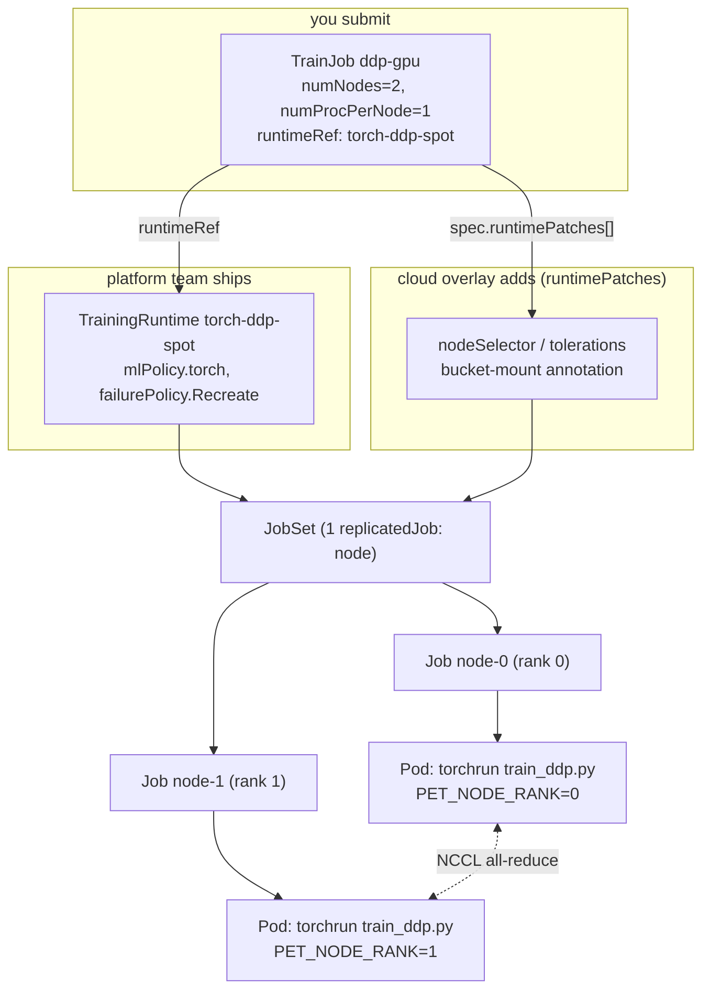

# 07 · Distributed Training with Kubeflow Trainer

> Running multi-node PyTorch DDP training as a first-class Kubernetes object with **Kubeflow
> Trainer v2** (`TrainJob` / `TrainingRuntime` / `ClusterTrainingRuntime`), gang-scheduled and
> checkpointed so it survives spot reclaims, on **EKS**.

---

## Before you start

This chapter assumes:

- A cluster from `00-prerequisites-and-cluster-setup`, with the GPU node-pool mechanics from
  `01-gpu-nodes-and-scheduling` and the NVIDIA GPU Operator from `02-nvidia-gpu-operator` already
  understood — this chapter creates its own dedicated GPU node pool (§4.3) but assumes you know
  why the driver/device-plugin steps happen.
- Bucket-mount CSI drivers from `05-model-storage-and-data` (GCS FUSE / Mountpoint-S3 / Blob CSI)
  if you want persisted checkpoints — the GPU lab path uses them; `cpu-lab/` doesn't.
- Optional: the `team-research` ClusterQueue from `06-batch-jobs-and-kueue` if you plan to run
  §3.4/Lab C (`kueue/<cloud>` overlay) — not required for the base GPU or cpu-lab paths.
- `env.sh` and `versions.env` sourced.

## 1. Why this matters

A distributed training run is not a bag of independent pods — it's a **gang**: `torchrun` needs
every rank up and rendezvoused before any of them can make progress, and if one rank dies the
whole NCCL process group is dead too. Plain Deployments/Jobs don't understand that. Kubeflow
Trainer v2 (the rewrite of the old `PyTorchJob`/`TFJob` operators, now generic across frameworks)
gives you:

- A **`TrainJob`** — the thing you submit, with `numNodes`, `numProcPerNode`, image, command and
  per-node resources, referencing a reusable **runtime**.
- A **`ClusterTrainingRuntime`** / namespaced **`TrainingRuntime`** — the "platform team" contract:
  built on a **JobSet** (one Kubernetes `batch/v1` Job per replicated node group, with a
  `failurePolicy` that can recreate the *whole* gang on a single lost pod), plus a plugin that
  injects `PET_*` env vars so `torchrun` needs zero rendezvous flags.
- **`runtimePatches`** — strategic-merge patches the `eks/` overlay layers onto the runtime's
  JobSet template without forking the runtime itself. That's how `eks/` adds its own node
  selectors/tolerations/volumes to the `torch-ddp-spot` runtime.

This is the DevOps translation of what an HPC scheduler's job step / gang-scheduling and
checkpoint-restart features do, expressed as Kubernetes CRDs. Chapter `06-batch-jobs-and-kueue`
covers the admission/quota layer this chapter's TrainJob is optionally submitted through; chapter
`05-model-storage-and-data` covers the bucket-mount CSI drivers this chapter's checkpoints use.

## 2. Learning objectives & time plan (~3 h)

By the end you can:

1. Explain the TrainJob → TrainingRuntime → JobSet chain and why gang failure handling
   (`failurePolicy.restartStrategy: Recreate`) is required for static-world-size DDP on spot.
2. Read and extend `common/base/trainingruntime-torch-ddp-spot.yaml` and
   `common/trainjob-ddp-gpu.yaml`.
3. Explain what the `runtimePatches` overlay does and why the GPU-taint and spot-taint
   tolerations it adds aren't automatic (EKS auto-taints neither — see
   `01-gpu-nodes-and-scheduling`).
4. Trigger a spot reclaim (or simulate one) mid-training and watch the DDP script's SIGTERM
   handling + JobSet's gang-recreate bring the run back to the last complete checkpoint.
5. Layer the `kueue/<cloud>` overlay on top and explain what changes once Kueue's ResourceFlavor,
   not a hardcoded nodeSelector, decides spot vs on-demand placement.

| Block | Time | What |
|---|---|---|
| Theory | 35 min | §3 concepts, TrainJob/runtime/JobSet object model |
| Lab A | 60 min | Install Trainer, GPU node pool, storage, run the 2-node DDP TrainJob on your cloud |
| Lab B | 45 min | Kill a node / simulate spot reclaim, watch gang recreate + checkpoint resume |
| Lab C (optional) | 20 min | Layer `kueue/<cloud>`, watch Kueue admit/suspend the TrainJob |
| Review | 20 min | Troubleshooting, checkpoint questions, cleanup |

## 3. Concepts

### 3.1 TrainJob, TrainingRuntime, JobSet



The Trainer **torch plugin** reads `numNodes`/`numProcPerNode` off the TrainJob and injects
`PET_NNODES`, `PET_NPROC_PER_NODE`, `PET_NODE_RANK` (from the Job's completion index),
`PET_MASTER_ADDR` (`<trainjob>-node-0-0.<trainjob>`, the JobSet headless Service) and
`PET_MASTER_PORT=29500` into every pod — `torchrun /workspace/scripts/train_ddp.py` needs no
rendezvous flags at all (see `common/trainjob-ddp-gpu.yaml`).

### 3.2 Gang failure handling on spot

DDP's process group has a **fixed world size**. If rank 1's pod is evicted, rank 0 doesn't
degrade to "1 worker" — it hangs on the next `all_reduce` until NCCL's watchdog times out. Two
settings in `common/base/trainingruntime-torch-ddp-spot.yaml` handle this:

- `backoffLimit: 0` on each replicated Job — one failed pod fails that Job immediately instead of
  retrying it alone (which would leave the *other* rank waiting).
- `failurePolicy.restartStrategy: Recreate`, `maxRestarts: 10` on the JobSet — recreates **every**
  Job (i.e. the whole gang) so all ranks re-rendezvous together. `terminationGracePeriodSeconds:
  25` gives `torchrun`'s SIGTERM handler (in `train_ddp.py`) time to `all_reduce` a stop signal
  and have rank 0 flush a final checkpoint before the pod is killed.
- `train_ddp.py` resumes from the newest checkpoint with a `.done` marker (see the script's
  docstring) — object stores have no atomic rename, so the `.pt` file is written first and the
  `.done` marker second; a reader only trusts a step once `.done` exists.

### 3.3 The `eks/` overlay via `runtimePatches`

`common/trainjob-ddp-gpu.yaml` and `common/base/trainingruntime-torch-ddp-spot.yaml` are
completely cloud-agnostic. `eks/patch-trainjob-eks.yaml` adds one `spec.runtimePatches[]` entry (a
strategic-merge patch the Trainer controller applies to the runtime's JobSet template at admission
time) carrying the spot/GPU `nodeSelector` + `tolerations`.

| | EKS |
|---|---|
| GPU | 1x L4 (`g6.xlarge`) |
| Spot nodeSelector | `eks.amazonaws.com/capacityType: SPOT` |
| GPU taint added by | this chapter's node-group create (§4.3), `nvidia.com/gpu` |
| Spot taint added by | nobody (opt-in) |
| Checkpoint bucket | S3 via Mountpoint CSI (IRSA) |

Apply the full lab with `kubectl apply -k 07-distributed-training-kubeflow-trainer/eks` — see §4.4
for the explicit command sequence.

### 3.4 Optional: Kueue admission (`kueue/eks`)

`kueue/eks` layers the `common/kueue` Kustomize *Component* on top of the `eks` overlay: it labels
the TrainJob `kueue.x-k8s.io/queue-name: ch07-queue` (Kueue's webhook then suspends the TrainJob
until admitted) and adds a `LocalQueue` pointing at the `team-research` `ClusterQueue` from
`06-batch-jobs-and-kueue`. Once admitted, Kueue's own ResourceFlavor patch decides spot vs
on-demand — so the Kueue overlay also **removes** the hardcoded spot-only key from the `eks`
overlay's `nodeSelector` (keeping the GPU-type selector and both tolerations), letting Kueue fall
back to on-demand instead of the TrainJob just sitting `Pending` when spot is unavailable. This
directory lives at the chapter root (`kueue/eks`, not `eks/kueue`) because Kustomize refuses an
overlay that lists its own parent directory as a resource ("cycle detected") — see the comment in
`kueue/eks/kustomization.yaml`.

```bash
kubectl apply -k 07-distributed-training-kubeflow-trainer/kueue/eks
```

## 4. Lab

### 4.1 Prereqs

```bash
cd kubernetes-ai-infrastructure
source env.sh && source versions.env
```

A running cluster from `00-prerequisites-and-cluster-setup`, and GPU quota for the table in §3.3
(spot **and** on-demand family — spot capacity can be unavailable). `kubectl get ns kubeflow-system`
should not yet exist (first run) or should already have Trainer installed (idempotent `install.sh`).

### 4.2 Install Kubeflow Trainer

What you're about to do: install the Trainer controller + JobSet CRDs via Helm, pinned to
`${KUBEFLOW_TRAINER_VERSION}`, and enable the built-in `torch-distributed` ClusterTrainingRuntime.

```bash
: "${KUBEFLOW_TRAINER_VERSION:?source versions.env first}"
helm upgrade --install kubeflow-trainer oci://ghcr.io/kubeflow/charts/kubeflow-trainer \
  --namespace kubeflow-system --create-namespace \
  --version "${KUBEFLOW_TRAINER_VERSION#v}" \
  --set runtimes.torchDistributed.enabled=true \
  --wait --timeout 10m
kubectl -n kubeflow-system rollout status deploy --timeout=5m
kubectl get crd trainjobs.trainer.kubeflow.org trainingruntimes.trainer.kubeflow.org clustertrainingruntimes.trainer.kubeflow.org
# The runtimes are applied by a post-install hook Job; give it a moment if this is empty.
kubectl get clustertrainingruntimes
```

Expected output (tail):

```
customresourcedefinition.apiextensions.k8s.io/trainjobs.trainer.kubeflow.org created
clustertrainingruntime.trainer.kubeflow.org/torch-distributed created
```

How to tell this worked: `kubectl get clustertrainingruntimes` lists `torch-distributed`, and
`kubectl -n kubeflow-system get pods` shows the trainer-controller-manager `Running`.

### 4.3 GPU node group and checkpoint storage

What you're about to do: create a spot GPU managed node group (`CAPACITY=on-demand` creates the
fallback group instead; requires "All G and VT Spot Instance Requests" — or on-demand G/VT — vCPU
quota ≥ 16), then create the checkpoint bucket and wire up IRSA for the Mountpoint for S3 CSI
driver.

```bash
: "${EKS_CLUSTER:?source env.sh}" "${AWS_REGION:?}"
CAPACITY="${CAPACITY:-spot}"
if [[ "${CAPACITY}" == "spot" ]]; then NG=gpu-spot-l4; SPOT=true; else NG=gpu-ondemand-l4; SPOT=false; fi

cat <<YAML | eksctl create nodegroup -f -
apiVersion: eksctl.io/v1alpha5
kind: ClusterConfig
metadata:
  name: ${EKS_CLUSTER}
  region: ${AWS_REGION}
managedNodeGroups:
  - name: ${NG}
    amiFamily: AmazonLinux2023          # eksctl picks the NVIDIA AL2023 AMI for GPU instance types
    instanceTypes: ["g6.xlarge", "g6.2xlarge"]
    spot: ${SPOT}
    minSize: 0
    desiredCapacity: 0
    maxSize: 2
    volumeSize: 100                     # the PyTorch CUDA image is ~4 GB compressed
    labels:
      ch07.lab/gpu: l4
    taints:
      - key: nvidia.com/gpu
        value: "true"
        effect: NoSchedule
    propagateASGTags: true              # lets Cluster Autoscaler scale this group from zero
    # efaEnabled: true                  # advanced: only on EFA-capable types (p4d/p5/g6e.8xlarge+)
YAML
```

Checkpoint storage — creates the S3 bucket, an IAM role for the Mountpoint for S3 CSI driver
(IRSA), installs/updates the add-on so it tolerates the GPU taint, then writes
`eks/storage/storage.env` so the kustomize overlay's `replacements:` can fill in the PV:

```bash
: "${EKS_CLUSTER:?source env.sh}" "${AWS_REGION:?}" "${AWS_ACCOUNT_ID:?}"
BUCKET="${BUCKET:-${AWS_ACCOUNT_ID}-ch07-checkpoints}"
ROLE_NAME="${ROLE_NAME:-${EKS_CLUSTER}-s3-csi-driver}"
POLICY_NAME="${POLICY_NAME:-${EKS_CLUSTER}-ch07-s3-checkpoints}"
HERE=07-distributed-training-kubeflow-trainer/eks

if ! aws s3api head-bucket --bucket "${BUCKET}" 2>/dev/null; then
  if [[ "${AWS_REGION}" == "us-east-1" ]]; then
    aws s3api create-bucket --bucket "${BUCKET}" --region "${AWS_REGION}"
  else
    aws s3api create-bucket --bucket "${BUCKET}" --region "${AWS_REGION}" \
      --create-bucket-configuration "LocationConstraint=${AWS_REGION}"
  fi
fi

POLICY_DOC=$(cat <<JSON
{
  "Version": "2012-10-17",
  "Statement": [
    {"Sid": "MountpointFullBucketAccess", "Effect": "Allow", "Action": ["s3:ListBucket"],
     "Resource": ["arn:aws:s3:::${BUCKET}"]},
    {"Sid": "MountpointFullObjectAccess", "Effect": "Allow",
     "Action": ["s3:GetObject", "s3:PutObject", "s3:AbortMultipartUpload", "s3:DeleteObject"],
     "Resource": ["arn:aws:s3:::${BUCKET}/*"]}
  ]
}
JSON
)
POLICY_ARN="arn:aws:iam::${AWS_ACCOUNT_ID}:policy/${POLICY_NAME}"
aws iam get-policy --policy-arn "${POLICY_ARN}" >/dev/null 2>&1 || \
  aws iam create-policy --policy-name "${POLICY_NAME}" --policy-document "${POLICY_DOC}"

eksctl utils associate-iam-oidc-provider --cluster "${EKS_CLUSTER}" --region "${AWS_REGION}" --approve
eksctl create iamserviceaccount \
  --name s3-csi-driver-sa --namespace kube-system \
  --cluster "${EKS_CLUSTER}" --region "${AWS_REGION}" \
  --attach-policy-arn "${POLICY_ARN}" \
  --role-name "${ROLE_NAME}" --role-only --approve

ROLE_ARN="arn:aws:iam::${AWS_ACCOUNT_ID}:role/${ROLE_NAME}"
if aws eks describe-addon --cluster-name "${EKS_CLUSTER}" --addon-name aws-mountpoint-s3-csi-driver --region "${AWS_REGION}" >/dev/null 2>&1; then
  aws eks update-addon --cluster-name "${EKS_CLUSTER}" --addon-name aws-mountpoint-s3-csi-driver \
    --region "${AWS_REGION}" --service-account-role-arn "${ROLE_ARN}" \
    --configuration-values '{"node":{"tolerateAllTaints":true}}' --resolve-conflicts OVERWRITE
else
  aws eks create-addon --cluster-name "${EKS_CLUSTER}" --addon-name aws-mountpoint-s3-csi-driver \
    --region "${AWS_REGION}" --service-account-role-arn "${ROLE_ARN}" \
    --configuration-values '{"node":{"tolerateAllTaints":true}}'
fi

printf 'BUCKET_NAME=%s\nMOUNT_REGION=region %s\n' "${BUCKET}" "${AWS_REGION}" > "${HERE}/storage/storage.env"
echo "Wrote ${HERE}/storage/storage.env"
```

### 4.4 Run the lab

What you're about to do: apply the `eks` overlay (TrainJob + patched runtime), watch the 2-rank
DDP TrainJob rendezvous and start writing checkpoints.

```bash
kubectl apply -k 07-distributed-training-kubeflow-trainer/eks
kubectl -n ch07-training get trainjob ddp-gpu -w   # Ctrl-C once JOBSSTATUS shows Running
kubectl -n ch07-training logs -l trainer.kubeflow.org/trainjob-ancestor-step=trainer -f --prefix
```

Expected log lines (rank 0):

```
[rank 0/2] world_size=2 device=cuda step=0/20000 loss=...
[rank 0/2] checkpoint written: /mnt/checkpoints/ddp-gpu/step-00000500.pt (+.done)
```

How to tell this worked: `kubectl -n ch07-training get pods` shows 2 `Running` pods (one per
rank) and neither log stream shows a NCCL timeout.

### 4.5 Simulate a spot reclaim

What you're about to do: delete the rank-1 pod to simulate a spot reclaim mid-run, and watch the
JobSet recreate the whole gang instead of just the one pod.

```bash
kubectl -n ch07-training delete pod \
  "$(kubectl -n ch07-training get pod -o name | grep node-1)"
kubectl -n ch07-training get jobs -w   # Ctrl-C once both Jobs show a new, higher restart count
```

Expected: both `ddp-gpu-node-0` and `ddp-gpu-node-1` Jobs restart together (not just node-1).
How to tell this worked: rank 0's log picks up the newest `.done` checkpoint step instead of
restarting from `step=0` — the Job's `backoffLimit: 0` fails that Job fast, and the JobSet's
`Recreate` policy recreates **both** Jobs so all ranks re-rendezvous together.

### 4.6 No GPU quota yet? Run it on CPU

`cpu-lab/` is a self-contained CPU-only variant of the same lab — same `TrainJob`/
`TrainingRuntime` shape, same `train_ddp.py` (it already auto-selects the `gloo` backend when
`torch.cuda.is_available()` is `False`), just no `nvidia.com/gpu` requests and no bucket mount
(checkpoints go to an `emptyDir`, so a pod recreate genuinely restarts from step 0 — a good
contrast to see once, then go set up chapter 05's bucket-backed checkpoints for the real thing).
It runs 2 nodes x 2 procs = 4 ranks on whatever spot CPU pool chapter 00 gave you:

```bash
kubectl apply -k 07-distributed-training-kubeflow-trainer/cpu-lab/eks
kubectl -n ch07-training-cpu get trainjob,jobset,pods -w
kubectl -n ch07-training-cpu logs -l trainer.kubeflow.org/trainjob-ancestor-step=trainer -f
```

How to tell this worked: 4 pods (2 nodes x 2 procs) go `Running`, and the log shows
`world_size=4 device=cpu`. Do the same 4.5 "simulate a spot reclaim" drill against
`ch07-training-cpu` and watch the resume logic restart from step 0 (no persistent checkpoint
volume) — that's the concrete argument for wiring up real storage before you run this on spot
GPUs for real.

## 5. Spot considerations

- **Why gang-recreate, not per-pod restart**: a lone new rank 1 can't rejoin an already-formed
  NCCL group at a different `MASTER_ADDR` epoch — recreating the JobSet's Jobs makes every rank
  re-run the rendezvous handshake together.
- **Grace period budget**: `terminationGracePeriodSeconds: 25` assumes checkpoint writes are fast
  (small demo model). Size this to your real checkpoint's upload time to the bucket — EKS gives
  ~2 minutes of spot notice, so you have room to grow this if a real checkpoint needs longer.
- **`CHECKPOINT_EVERY`**: the more often you checkpoint, the less work a reclaim throws away, at
  the cost of bucket PUT traffic — tune `common/trainjob-ddp-gpu.yaml`'s env for your model size.
- **On-demand fallback**: the `eks` overlay here doesn't run mixed spot+on-demand — for that
  layer `kueue/eks` (§3.4), which is what actually picks the flavor at admission time.

## 6. Troubleshooting

| Symptom | Likely cause | Fix |
|---|---|---|
| TrainJob stuck `Pending`/`Suspended` forever | No `kueue-system` ClusterQueue admitting it (only if you applied `kueue/eks`) | `kubectl get clusterqueue team-research -o yaml`, check spot+on-demand ResourceFlavors have real nodes |
| Pods `Pending`, event `Insufficient nvidia.com/gpu` | GPU node group scaled to 0 and nothing has scaled it up yet, or GPU quota exhausted | `kubectl get nodes -l ...`, check the EC2 quota console |
| `clustertrainingruntimes` empty after install | Post-install hook Job hasn't finished | `kubectl -n kubeflow-system get job,pod`, re-run `kubectl get clustertrainingruntimes` after it completes |
| Rank 0 hangs on `all_reduce` after a delete | Deleted rank 0 itself, or `Recreate` hasn't fired yet | `kubectl -n ch07-training get jobs` — both Jobs should show a new generation |
| Checkpoint dir empty after resume | `.done` marker never written (grace period too short, or write raced eviction) | Check pod logs for `SIGTERM received`; increase `terminationGracePeriodSeconds` |
| Mountpoint S3 mount `permission denied` | IRSA binding from §4.3's storage setup didn't propagate yet, or SA name mismatch | Re-run the storage setup commands; confirm `serviceAccountName: trainer` matches the binding's subject |

## 7. Cleanup and cost notes

```bash
: "${EKS_CLUSTER:?source env.sh}" "${AWS_REGION:?}"
kubectl delete trainjobs --all -n ch07-training --ignore-not-found
kubectl delete -k 07-distributed-training-kubeflow-trainer/eks --ignore-not-found
for ng in gpu-spot-l4 gpu-ondemand-l4; do
  eksctl delete nodegroup --cluster "${EKS_CLUSTER}" --region "${AWS_REGION}" --name "${ng}" --wait 2>/dev/null || true
done
helm uninstall kubeflow-trainer -n kubeflow-system   # only if you're done with the whole chapter
aws s3 rb "s3://${BUCKET:-${AWS_ACCOUNT_ID}-ch07-checkpoints}" --force   # only if you want checkpoints gone too
```

Deletes the TrainJob, applied manifests and the GPU node group(s) (scaled from 0, so idle cost is
near zero between runs — but 2 running L4 GPU nodes are **not** cheap; don't leave the lab
`Running` overnight). Checkpoint storage is kept unless you run the last line.

## 8. Checkpoint questions

<details><summary>1. Why does <code>backoffLimit: 0</code> on the replicated Job matter for DDP specifically, when it would be a bad default for a normal batch Job?</summary>

A normal Job's pods are independent — retrying just the failed one is fine. DDP's ranks form one
process group with a fixed world size; retrying only the failed rank in place would still leave
the *other* rank's NCCL call hung against a peer that restarted at a different rendezvous epoch.
`backoffLimit: 0` fails that Job fast so the JobSet-level `Recreate` policy can restart the whole
gang together instead.
</details>

<details><summary>2. What actually decides <code>PET_MASTER_ADDR</code>, and why doesn't <code>train_ddp.py</code> need a rendezvous flag?</summary>

The Trainer torch plugin sets it to the JobSet's headless Service DNS name for the node-0
replica (`<trainjob>-node-0-0.<trainjob>`) and injects it (with `PET_NNODES`, `PET_NODE_RANK`,
`PET_MASTER_PORT`) as `PET_*` env vars every `torchrun` process reads automatically.
</details>

<details><summary>3. Why is the checkpoint write split into a <code>.pt</code> file and a separate <code>.done</code> marker?</summary>

Object stores (GCS, S3, Azure Blob) have no atomic rename/overwrite the way a POSIX filesystem
does. Writing the payload first and a marker second means a reader can trust "is step N complete"
by checking only for the marker's existence, never observing a partially-uploaded `.pt`.
</details>

<details><summary>4. EKS doesn't auto-taint its spot node group — this chapter's node-group create adds the GPU taint itself. What would go wrong if the <code>eks</code> overlay's TrainJob patch had the <code>nodeSelector</code> but forgot the <code>nvidia.com/gpu</code> toleration?</summary>

The pod would never schedule: it explicitly asks (via `nodeSelector`) for the GPU node group, but
every node in that group carries a `NoSchedule` taint the pod doesn't tolerate, so it sits
`Pending` with a `node(s) had untolerated taint` event forever.
</details>

<details><summary>5. What changes about spot/on-demand placement when you layer <code>kueue/eks</code> instead of applying the plain <code>eks</code> overlay?</summary>

Without Kueue, the `eks` overlay's `nodeSelector` hardcodes spot — if spot capacity is
unavailable the TrainJob just sits `Pending`. With Kueue, the hardcoded capacity-type key is
removed and Kueue's ClusterQueue (spot ResourceFlavor tried first, on-demand as fallback) decides
placement at admission time, writing its own `runtimePatch` with whichever flavor's
selector/toleration it admitted the Workload into.
</details>

<details><summary>6. Why does the runtime set <code>restartPolicy: Never</code> on the pod template instead of relying on Kubernetes' own pod restart?</summary>

A kubelet-level pod restart (`restartPolicy: OnFailure`) would restart *only that container in
place*, re-executing `torchrun` without the other rank's world re-forming — same problem as
question 1. Failing the pod outright (with `backoffLimit: 0` failing the whole Job) lets the
JobSet-level `Recreate` policy own the gang-wide restart instead.
</details>

<details><summary>7. Why is <code>numNodes: 2, numProcPerNode: 1</code> used here instead of, say, 1 node with 2 GPUs?</summary>

The chapter is demonstrating *multi-node* DDP (the JobSet/rendezvous/checkpoint machinery this
chapter is about) on the cheapest possible GPU shape — 1-GPU instances (L4/T4) are widely
available and cheap on spot. Multi-GPU-per-node would use `numProcPerNode > 1` instead/in
addition and doesn't exercise cross-node NCCL at all.
</details>

<details><summary>8. `common/kueue/kustomization.yaml` is a Kustomize <em>Component</em>, not a plain overlay. What does that buy you here?</summary>

A `Component` can be layered into an existing Kustomization's `components:` list without owning
the base `resources:` — the same `common/kueue` component is reused unmodified by `kueue/eks`,
which combines it with the `../../eks` base rather than needing a near-duplicate overlay file.
</details>

## 9. Further reading

- [Kubeflow Trainer v2 docs](https://www.kubeflow.org/docs/components/trainer/)
- [Kubeflow Trainer API reference (TrainJob/TrainingRuntime)](https://www.kubeflow.org/docs/components/trainer/reference/)
- [JobSet](https://jobset.sigs.k8s.io/)
- [torchrun / torch.distributed elastic](https://pytorch.org/docs/stable/elastic/run.html)
- [EKS: Mountpoint for Amazon S3 CSI driver](https://docs.aws.amazon.com/eks/latest/userguide/s3-csi.html)
- Cross-links: `05-model-storage-and-data` (the CSI drivers used for checkpoints here),
  `06-batch-jobs-and-kueue` (the `team-research` ClusterQueue the optional `kueue/<cloud>` overlay
  submits into), `08-ray-on-kubernetes` (an alternative gang-scheduled distributed workload model)

### Versions tested

| Component | Version | Source |
|---|---|---|
| Kubeflow Trainer | `${KUBEFLOW_TRAINER_VERSION}` (v2.3.0) | `versions.env`, `oci://ghcr.io/kubeflow/charts/kubeflow-trainer` |
| PyTorch training image | `pytorch/pytorch:2.13.0-cuda12.6-cudnn9-runtime` (GPU), `-cuda13.0-` (runtime default) | Docker Hub `pytorch/pytorch` |
| Kueue (optional overlay) | `${KUEUE_VERSION}` (0.19.4) | `versions.env`, `kueue.x-k8s.io/v1beta2` |
