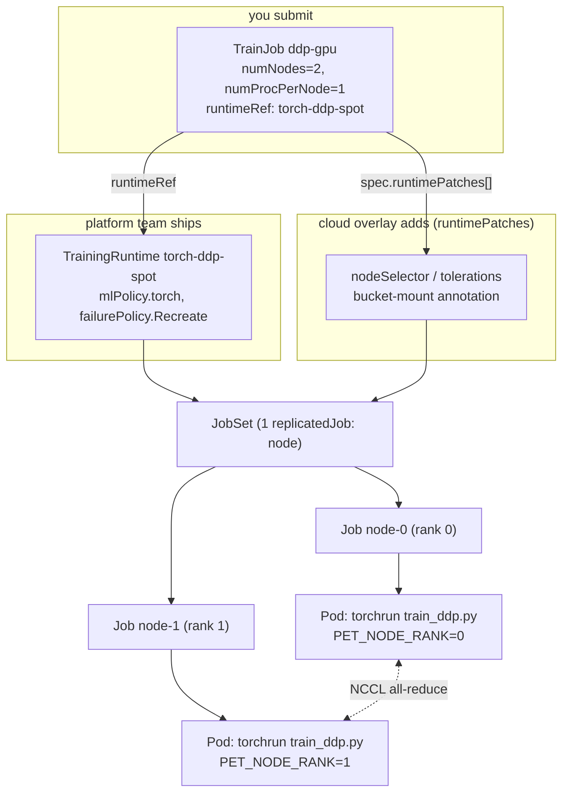

# 07 · Distributed Training with Kubeflow Trainer

> Running multi-node PyTorch DDP training as a first-class Kubernetes object with **Kubeflow
> Trainer v2** (`TrainJob` / `TrainingRuntime` / `ClusterTrainingRuntime`), gang-scheduled and
> checkpointed so it survives spot reclaims, on **GKE, EKS and AKS**.

---

## 1. Why this matters

A distributed training run is not a bag of independent pods — it's a **gang**: `torchrun` needs
every rank up and rendezvoused before any of them can make progress, and if one rank dies the
whole NCCL process group is dead too. Plain Deployments/Jobs don't understand that. Kubeflow
Trainer v2 (the rewrite of the old `PyTorchJob`/`TFJob` operators, now generic across frameworks)
gives you:

- A **`TrainJob`** — the thing you submit, with `numNodes`, `numProcPerNode`, image, command and
  per-node resources, referencing a reusable **runtime**.
- A **`ClusterTrainingRuntime`** / namespaced **`TrainingRuntime`** — the "platform team" contract:
  built on a **JobSet** (one Kubernetes `batch/v1` Job per replicated node group, with a
  `failurePolicy` that can recreate the *whole* gang on a single lost pod), plus a plugin that
  injects `PET_*` env vars so `torchrun` needs zero rendezvous flags.
- **`runtimePatches`** — strategic-merge patches an overlay (here: each cloud folder) layers onto
  the runtime's JobSet template without forking the runtime itself. That's how `gke/`, `eks/` and
  `aks/` add their own node selectors/tolerations/volumes to the *same* `torch-ddp-spot` runtime.

This is the DevOps translation of what an HPC scheduler's job step / gang-scheduling and
checkpoint-restart features do, expressed as Kubernetes CRDs. Chapter `06-batch-jobs-and-kueue`
covers the admission/quota layer this chapter's TrainJob is optionally submitted through; chapter
`05-model-storage-and-data` covers the bucket-mount CSI drivers this chapter's checkpoints use.

## 2. Learning objectives & time plan (~3 h)

By the end you can:

1. Explain the TrainJob → TrainingRuntime → JobSet chain and why gang failure handling
   (`failurePolicy.restartStrategy: Recreate`) is required for static-world-size DDP on spot.
2. Read and extend `common/base/trainingruntime-torch-ddp-spot.yaml` and
   `common/trainjob-ddp-gpu.yaml`.
3. Explain what a `runtimePatches` cloud overlay does and why the GPU-taint toleration and the
   spot-taint toleration differ across GKE/EKS/AKS (AKS auto-taints spot, none of the three
   auto-taint GPU nodes the same way — see `01-gpu-nodes-and-scheduling`).
4. Trigger a spot reclaim (or simulate one) mid-training and watch the DDP script's SIGTERM
   handling + JobSet's gang-recreate bring the run back to the last complete checkpoint.
5. Layer the `kueue/<cloud>` overlay on top and explain what changes once Kueue's ResourceFlavor,
   not a hardcoded nodeSelector, decides spot vs on-demand placement.

| Block | Time | What |
|---|---|---|
| Theory | 35 min | §3 concepts, TrainJob/runtime/JobSet object model |
| Lab A | 60 min | Install Trainer, GPU node pool, storage, run the 2-node DDP TrainJob on your cloud |
| Lab B | 45 min | Kill a node / simulate spot reclaim, watch gang recreate + checkpoint resume |
| Lab C (optional) | 20 min | Layer `kueue/<cloud>`, watch Kueue admit/suspend the TrainJob |
| Review | 20 min | Troubleshooting, checkpoint questions, cleanup |

## 3. Concepts

### 3.1 TrainJob, TrainingRuntime, JobSet



The Trainer **torch plugin** reads `numNodes`/`numProcPerNode` off the TrainJob and injects
`PET_NNODES`, `PET_NPROC_PER_NODE`, `PET_NODE_RANK` (from the Job's completion index),
`PET_MASTER_ADDR` (`<trainjob>-node-0-0.<trainjob>`, the JobSet headless Service) and
`PET_MASTER_PORT=29500` into every pod — `torchrun /workspace/scripts/train_ddp.py` needs no
rendezvous flags at all (see `common/trainjob-ddp-gpu.yaml`).

### 3.2 Gang failure handling on spot

DDP's process group has a **fixed world size**. If rank 1's pod is evicted, rank 0 doesn't
degrade to "1 worker" — it hangs on the next `all_reduce` until NCCL's watchdog times out. Two
settings in `common/base/trainingruntime-torch-ddp-spot.yaml` handle this:

- `backoffLimit: 0` on each replicated Job — one failed pod fails that Job immediately instead of
  retrying it alone (which would leave the *other* rank waiting).
- `failurePolicy.restartStrategy: Recreate`, `maxRestarts: 10` on the JobSet — recreates **every**
  Job (i.e. the whole gang) so all ranks re-rendezvous together. `terminationGracePeriodSeconds:
  25` gives `torchrun`'s SIGTERM handler (in `train_ddp.py`) time to `all_reduce` a stop signal
  and have rank 0 flush a final checkpoint before the pod is killed.
- `train_ddp.py` resumes from the newest checkpoint with a `.done` marker (see the script's
  docstring) — object stores have no atomic rename, so the `.pt` file is written first and the
  `.done` marker second; a reader only trusts a step once `.done` exists.

### 3.3 Cloud overlays via `runtimePatches`

`common/trainjob-ddp-gpu.yaml` and `common/base/trainingruntime-torch-ddp-spot.yaml` are
completely cloud-agnostic. Each of `gke/patch-trainjob-gke.yaml`, `eks/patch-trainjob-eks.yaml`
and `aks/patch-trainjob-aks.yaml` adds one `spec.runtimePatches[]` entry (a strategic-merge patch
the Trainer controller applies to the runtime's JobSet template at admission time) carrying that
cloud's spot/GPU `nodeSelector` + `tolerations`, and (GKE only) the `gke-gcsfuse/volumes: "true"`
pod annotation that injects the GCS FUSE sidecar.

| | GKE | EKS | AKS |
|---|---|---|---|
| GPU | 1x L4 (`g2-standard-4`, `nvidia-l4`) | 1x L4 (`g6.xlarge`) | 1x T4 (`Standard_NC4as_T4_v3`) |
| Spot nodeSelector | `cloud.google.com/gke-spot: "true"` | `eks.amazonaws.com/capacityType: SPOT` | `kubernetes.azure.com/scalesetpriority: spot` |
| GPU taint added by | GKE automatically | `create-gpu-nodegroup.sh` (`nvidia.com/gpu`) | `create-gpu-nodepool.sh` (`nvidia.com/gpu=present`) |
| Spot taint added by | nobody (opt-in) | nobody (opt-in) | **AKS automatically** |
| Checkpoint bucket | GCS via GCS FUSE CSI | S3 via Mountpoint CSI (IRSA) | Azure Blob via Blob CSI (kubelet managed identity) |

Apply a full lab with `kubectl apply -k 07-distributed-training-kubeflow-trainer/<gke|eks|aks>`.

### 3.4 Optional: Kueue admission (`kueue/<cloud>`)

`kueue/gke`, `kueue/eks`, `kueue/aks` layer the `common/kueue` Kustomize *Component* on top of the
matching cloud overlay: it labels the TrainJob `kueue.x-k8s.io/queue-name: ch07-queue` (Kueue's
webhook then suspends the TrainJob until admitted) and adds a `LocalQueue` pointing at the
`team-research` `ClusterQueue` from `06-batch-jobs-and-kueue`. Once admitted, Kueue's own
ResourceFlavor patch decides spot vs on-demand — so each cloud's Kueue overlay also **removes**
the hardcoded spot-only key from the cloud overlay's `nodeSelector` (keeping the GPU-type selector
and both tolerations), letting Kueue fall back to on-demand instead of the TrainJob just
sitting `Pending` when spot is unavailable. These directories live at the chapter root
(`kueue/<cloud>`, not `<cloud>/kueue`) because Kustomize refuses an overlay that lists its own
parent directory as a resource ("cycle detected") — see the comment in `kueue/gke/kustomization.yaml`.

```bash
kubectl apply -k 07-distributed-training-kubeflow-trainer/kueue/gke   # or eks / aks
```

> **Stray-file cleanup note:** an earlier pass had left a single `07-.../kueue/gke/kustomization.yaml`
> with no `eks`/`aks` counterparts and no README coverage. This pass verified the file still
> renders correctly, added the missing `kueue/eks` and `kueue/aks` overlays with the equivalent
> per-cloud patch, and documented all three here — nothing was deleted, the layout was completed.

## 4. Lab

### 4.1 Prereqs

```bash
cd kubernetes-ai-infrastructure
source env.sh && source versions.env
```

A running cluster from `00-prerequisites-and-cluster-setup`, and GPU quota for the table in §3.3
(spot **and** on-demand family — spot capacity can be unavailable). `kubectl get ns kubeflow-system`
should not yet exist (first run) or should already have Trainer installed (idempotent `install.sh`).

### 4.2 Install Kubeflow Trainer (same on every cloud)

```bash
./07-distributed-training-kubeflow-trainer/<gke|eks|aks>/install.sh
```

Installs the `kubeflow-trainer` Helm chart (controller + JobSet CRDs/controller as a dependency)
with the built-in `torch-distributed` `ClusterTrainingRuntime` enabled, and prints the CRDs and
`clustertrainingruntimes` once the post-install hook has applied them.

### 4.3 GPU node pool and checkpoint storage

```bash
# GKE
./07-distributed-training-kubeflow-trainer/gke/create-gpu-nodepool.sh
./07-distributed-training-kubeflow-trainer/gke/setup-storage.sh

# EKS
./07-distributed-training-kubeflow-trainer/eks/create-gpu-nodegroup.sh
./07-distributed-training-kubeflow-trainer/eks/setup-storage.sh

# AKS
./07-distributed-training-kubeflow-trainer/aks/create-gpu-nodepool.sh
./07-distributed-training-kubeflow-trainer/aks/setup-storage.sh
```

Each `setup-storage.sh` creates the checkpoint bucket/container, wires up its cloud's identity
mechanism (Workload Identity Federation on GKE, IRSA on EKS, the AKS kubelet managed identity on
AKS — no per-pod identity needed there, see `aks/setup-storage.sh`), and writes
`<cloud>/storage/storage.env` so the kustomize overlay's `replacements:` can fill in the PV.

### 4.4 Run the lab

```bash
kubectl apply -k 07-distributed-training-kubeflow-trainer/<gke|eks|aks>
kubectl -n ch07-training get trainjob ddp-gpu -w
kubectl -n ch07-training logs -l trainer.kubeflow.org/trainjob-ancestor-step=trainer -f --prefix
```

Expected log lines (rank 0):

```
[rank 0/2] world_size=2 device=cuda step=0/20000 loss=...
[rank 0/2] checkpoint written: /mnt/checkpoints/ddp-gpu/step-00000500.pt (+.done)
```

### 4.5 Simulate a spot reclaim

```bash
kubectl -n ch07-training delete pod -l trainer.kubeflow.org/trainjob-ancestor-step=trainer --field-selector status.phase=Running --grep node-1 2>/dev/null \
  || kubectl -n ch07-training delete pod $(kubectl -n ch07-training get pod -o name | grep node-1)
```

Watch: the Job's `backoffLimit: 0` fails that Job, the JobSet's `Recreate` policy recreates
**both** Jobs, and rank 0's resume logic picks up the newest `.done` checkpoint instead of
restarting from step 0.

### 4.6 No GPU quota yet? Run it on CPU

`cpu-lab/` is a self-contained CPU-only variant of the same lab — same `TrainJob`/
`TrainingRuntime` shape, same `train_ddp.py` (it already auto-selects the `gloo` backend when
`torch.cuda.is_available()` is `False`), just no `nvidia.com/gpu` requests and no bucket mount
(checkpoints go to an `emptyDir`, so a pod recreate genuinely restarts from step 0 — a good
contrast to see once, then go set up chapter 05's bucket-backed checkpoints for the real thing).
It runs 2 nodes x 2 procs = 4 ranks on whatever spot CPU pool chapter 00 gave you:

```bash
kubectl apply -k 07-distributed-training-kubeflow-trainer/cpu-lab/gke   # or eks / aks
kubectl -n ch07-training-cpu get trainjob,jobset,pods -w
kubectl -n ch07-training-cpu logs -l trainer.kubeflow.org/trainjob-ancestor-step=trainer -f
```

Do the same 4.5 "simulate a spot reclaim" drill against `ch07-training-cpu` and watch the
resume logic restart from step 0 (no persistent checkpoint volume) — that's the concrete
argument for wiring up real storage before you run this on spot GPUs for real.

## 5. Spot considerations

- **Why gang-recreate, not per-pod restart**: a lone new rank 1 can't rejoin an already-formed
  NCCL group at a different `MASTER_ADDR` epoch — recreating the JobSet's Jobs makes every rank
  re-run the rendezvous handshake together.
- **Grace period budget**: `terminationGracePeriodSeconds: 25` assumes checkpoint writes are fast
  (small demo model). Size this to your real checkpoint's upload time to the bucket, and remember
  AWS gives ~2 minutes of spot notice vs ~30s on GKE/AKS — you may want a longer period on EKS.
  spec is per-cloud reclaim notice, not something the runtime can read directly.
- **`CHECKPOINT_EVERY`**: the more often you checkpoint, the less work a reclaim throws away, at
  the cost of bucket PUT traffic — tune `common/trainjob-ddp-gpu.yaml`'s env for your model size.
- **On-demand fallback**: none of the cloud overlays here run mixed spot+on-demand — for that
  layer `kueue/<cloud>` (§3.4), which is what actually picks the flavor at admission time.

## 6. Troubleshooting

| Symptom | Likely cause | Fix |
|---|---|---|
| TrainJob stuck `Pending`/`Suspended` forever | No `kueue-system` ClusterQueue admitting it (only if you applied `kueue/<cloud>`) | `kubectl get clusterqueue team-research -o yaml`, check spot+on-demand ResourceFlavors have real nodes |
| Pods `Pending`, event `Insufficient nvidia.com/gpu` | GPU node pool scaled to 0 and cluster/node autoscaler hasn't scaled up yet, or GPU quota exhausted | `kubectl get nodes -l ...`, check cloud console quota page |
| `clustertrainingruntimes` empty after `install.sh` | Post-install hook Job hasn't finished | `kubectl -n kubeflow-system get job,pod`, re-run `kubectl get clustertrainingruntimes` after it completes |
| Rank 0 hangs on `all_reduce` after a delete | Deleted rank 0 itself, or `Recreate` hasn't fired yet | `kubectl -n ch07-training get jobs` — both Jobs should show a new generation |
| Checkpoint dir empty after resume | `.done` marker never written (grace period too short, or write raced eviction) | Check pod logs for `SIGTERM received`; increase `terminationGracePeriodSeconds` |
| GCS FUSE / Mountpoint / Blob mount `permission denied` | Identity binding from `setup-storage.sh` didn't propagate yet, or SA name mismatch | Re-run `setup-storage.sh`; confirm `serviceAccountName: trainer` matches the binding's subject |

## 7. Cleanup and cost notes

```bash
./07-distributed-training-kubeflow-trainer/<gke|eks|aks>/cleanup.sh
```

Deletes the TrainJob, applied manifests and the GPU node pool(s) (scaled from 0, so idle cost is
near zero between runs — but 2 running L4/T4 GPU nodes are **not** cheap; don't leave the lab
`Running` overnight). Checkpoint storage is kept by default; set `DELETE_BUCKET=true` (GKE/EKS) or
`DELETE_STORAGE=true` (AKS) to remove it too. Uninstall the Trainer controller itself with
`UNINSTALL_TRAINER=true` if you're done with the whole chapter.

## 8. Checkpoint questions

<details><summary>1. Why does <code>backoffLimit: 0</code> on the replicated Job matter for DDP specifically, when it would be a bad default for a normal batch Job?</summary>

A normal Job's pods are independent — retrying just the failed one is fine. DDP's ranks form one
process group with a fixed world size; retrying only the failed rank in place would still leave
the *other* rank's NCCL call hung against a peer that restarted at a different rendezvous epoch.
`backoffLimit: 0` fails that Job fast so the JobSet-level `Recreate` policy can restart the whole
gang together instead.
</details>

<details><summary>2. What actually decides <code>PET_MASTER_ADDR</code>, and why doesn't <code>train_ddp.py</code> need a rendezvous flag?</summary>

The Trainer torch plugin sets it to the JobSet's headless Service DNS name for the node-0
replica (`<trainjob>-node-0-0.<trainjob>`) and injects it (with `PET_NNODES`, `PET_NODE_RANK`,
`PET_MASTER_PORT`) as `PET_*` env vars every `torchrun` process reads automatically.
</details>

<details><summary>3. Why is the checkpoint write split into a <code>.pt</code> file and a separate <code>.done</code> marker?</summary>

Object stores (GCS, S3, Azure Blob) have no atomic rename/overwrite the way a POSIX filesystem
does. Writing the payload first and a marker second means a reader can trust "is step N complete"
by checking only for the marker's existence, never observing a partially-uploaded `.pt`.
</details>

<details><summary>4. Only AKS auto-taints its spot node pool. What would go wrong if the AKS overlay's TrainJob patch had the <code>nodeSelector</code> but forgot the <code>kubernetes.azure.com/scalesetpriority</code> toleration?</summary>

The pod would never schedule: it explicitly asks (via `nodeSelector`) for a spot node, but every
spot node carries a `NoSchedule` taint the pod doesn't tolerate, so it sits `Pending` with a
`node(s) had untolerated taint` event forever.
</details>

<details><summary>5. What changes about spot/on-demand placement when you layer <code>kueue/&lt;cloud&gt;</code> instead of applying the plain cloud overlay?</summary>

Without Kueue, the cloud overlay's `nodeSelector` hardcodes spot — if spot capacity is
unavailable the TrainJob just sits `Pending`. With Kueue, the hardcoded capacity-type key is
removed and Kueue's ClusterQueue (spot ResourceFlavor tried first, on-demand as fallback) decides
placement at admission time, writing its own `runtimePatch` with whichever flavor's
selector/toleration it admitted the Workload into.
</details>

<details><summary>6. Why does the runtime set <code>restartPolicy: Never</code> on the pod template instead of relying on Kubernetes' own pod restart?</summary>

A kubelet-level pod restart (`restartPolicy: OnFailure`) would restart *only that container in
place*, re-executing `torchrun` without the other rank's world re-forming — same problem as
question 1. Failing the pod outright (with `backoffLimit: 0` failing the whole Job) lets the
JobSet-level `Recreate` policy own the gang-wide restart instead.
</details>

<details><summary>7. Why is <code>numNodes: 2, numProcPerNode: 1</code> used here instead of, say, 1 node with 2 GPUs?</summary>

The chapter is demonstrating *multi-node* DDP (the JobSet/rendezvous/checkpoint machinery this
chapter is about) on the cheapest possible GPU shape — 1-GPU instances (L4/T4) are widely
available and cheap on spot. Multi-GPU-per-node would use `numProcPerNode > 1` instead/in
addition and doesn't exercise cross-node NCCL at all.
</details>

<details><summary>8. `common/kueue/kustomization.yaml` is a Kustomize <em>Component</em>, not a plain overlay. What does that buy you here?</summary>

A `Component` can be layered into an existing Kustomization's `components:` list without owning
the base `resources:` — the same `common/kueue` component is reused unmodified by `kueue/gke`,
`kueue/eks` and `kueue/aks`, each combining it with a *different* base (`../../gke`, `../../eks`,
`../../aks`) rather than needing three near-duplicate overlay files.
</details>

## 9. Further reading

- [Kubeflow Trainer v2 docs](https://www.kubeflow.org/docs/components/trainer/)
- [Kubeflow Trainer API reference (TrainJob/TrainingRuntime)](https://www.kubeflow.org/docs/components/trainer/reference/)
- [JobSet](https://jobset.sigs.k8s.io/)
- [torchrun / torch.distributed elastic](https://pytorch.org/docs/stable/elastic/run.html)
- [GKE: Cloud Storage FUSE CSI driver](https://cloud.google.com/kubernetes-engine/docs/how-to/persistent-volumes/cloud-storage-fuse-csi-driver)
- [EKS: Mountpoint for Amazon S3 CSI driver](https://docs.aws.amazon.com/eks/latest/userguide/s3-csi.html)
- [AKS: Blob Storage CSI driver](https://learn.microsoft.com/en-us/azure/aks/azure-blob-csi)
- Cross-links: `05-model-storage-and-data` (the CSI drivers used for checkpoints here),
  `06-batch-jobs-and-kueue` (the `team-research` ClusterQueue the optional `kueue/<cloud>` overlay
  submits into), `08-ray-on-kubernetes` (an alternative gang-scheduled distributed workload model)

### Versions tested

| Component | Version | Source |
|---|---|---|
| Kubeflow Trainer | `${KUBEFLOW_TRAINER_VERSION}` (v2.3.0) | `versions.env`, `oci://ghcr.io/kubeflow/charts/kubeflow-trainer` |
| PyTorch training image | `pytorch/pytorch:2.13.0-cuda12.6-cudnn9-runtime` (GPU), `-cuda13.0-` (runtime default) | Docker Hub `pytorch/pytorch` |
| Kueue (optional overlay) | `${KUEUE_VERSION}` (0.19.4) | `versions.env`, `kueue.x-k8s.io/v1beta2` |
