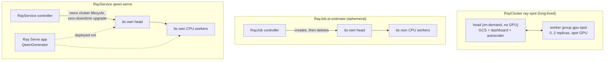

# 08 · Ray on Kubernetes

> Running **Ray** — Python-native distributed compute (tasks, actors, data, train, serve) — on
> top of Kubernetes with **KubeRay**: a long-lived `RayCluster` (head on stable capacity, workers
> on spot GPUs), an ephemeral `RayJob`, and a `RayService` running Ray Serve, on **EKS**.

---

## 0. Before you start

This chapter assumes:

- A cluster from `00-prerequisites-and-cluster-setup`, plus the node-pool mechanics from
  `01-gpu-nodes-and-scheduling` (this chapter creates its own dedicated GPU node pool in §4.2).
- Optional: the `team-research` ClusterQueue and Ray integrations enabled by
  `06-batch-jobs-and-kueue`'s Kueue install, only if you plan to run §3.5's optional Kueue step.
- `env.sh` and `versions.env` sourced.

## 1. Why this matters

### 1.0 What Ray actually is (read this if you've never touched Ray before)

Forget Kubernetes for a moment. **Ray** is a Python library for turning ordinary Python functions
and classes into things that run *somewhere else in a cluster* instead of in your local process.
Decorate a function with `@ray.remote` and calling it doesn't run it inline — it schedules it onto
whichever machine in the Ray cluster has a free CPU/GPU, returns immediately with a future, and you
collect the result later with `ray.get()`. Decorate a class with `@ray.remote` and you get an
**actor**: a stateful worker that lives on one machine and can be called repeatedly (think "a
long-lived service object", not "a stateless function call"). On top of that primitive, Ray ships
higher-level libraries: `ray.data` (distributed data loading/transforms), `ray.train` (distributed
model training), `ray.serve` (model-serving/HTTP layer), and `ray.tune` (hyperparameter search).
**This is the key thing to understand: Ray is a general-purpose distributed-computing framework,
not a training-specific tool.** Training is one thing you can build on it; a web-scraping pipeline,
a hyperparameter sweep, or a multi-model inference service are others.

Whether Ray runs on your laptop, a handful of EC2 VMs, or Kubernetes Pods, every Ray cluster has the
same two kinds of process:

- **Head node** — the one process that holds the cluster's shared state (called the **GCS**, Global
  Control Store: which actors exist, which tasks are pending, object references, cluster
  membership), serves the web dashboard, and — if autoscaling is on — runs the Ray autoscaler
  itself. There is exactly one head per cluster. Think of it as the cluster's control plane: not
  where your workload's heavy lifting happens, but the thing that, if it dies, takes the whole
  cluster's state with it.
- **Worker group** — one or more Pods that actually execute your tasks/actors. A cluster can have
  several worker *groups* with different hardware (e.g. a `cpu-workers` group and a `gpu-spot`
  group), the same way a Kubernetes cluster can have several node *groups*. Workers are individually
  disposable — losing one just loses whatever it was running, which Ray's scheduler retries
  elsewhere.

**Why run this on Kubernetes at all, instead of Ray's own cluster launcher (`ray up` against raw
EC2)?** Because by this point in the course you already have a working EKS cluster with spot node
groups, GPU device plugins, Kueue quota, and observability wired up — running Ray *as Kubernetes
Pods* means the Ray head and workers are just more workloads on that same cluster, subject to the
same scheduling, quota, and autoscaling machinery, rather than a second, separate piece of
infrastructure to operate.

**What is KubeRay, concretely?** It's a Kubernetes *operator*: a controller Deployment that watches
for `RayCluster`/`RayJob`/`RayService` objects (Kubernetes **CRDs** — Custom Resource Definitions,
which let you extend the Kubernetes API with new object *kinds* the same way `Pod` or `Deployment`
are built-in kinds) and, when it sees one, creates the actual head/worker Pods, Services, and
ConfigMaps needed to run that Ray cluster, then keeps reconciling reality to match the spec (restart
a crashed head, resize worker groups the Ray autoscaler asked for, and so on). You never create Ray
head/worker Pods by hand — you write a `RayCluster`/`RayJob`/`RayService` YAML and KubeRay does the
Pod bookkeeping, the same relationship a `Deployment` has to the Pods it manages.

**Why not just use a plain Kubernetes `batch/v1` Job for this kind of work?** A plain Job runs one
(or N identical, uncoordinated) containers to completion — there's no shared state, no cross-task
communication, no way for one task to hand data or an actor handle to another without you building
that yourself. Ray gives you a distributed object store, a task scheduler, and stateful actors as
built-in primitives, so a workload made of many small, unevenly-sized units of work (a hyperparameter
sweep, a per-shard data pipeline, a service composed of several models) doesn't need you to
hand-roll coordination logic. §4.4's `pi-estimate` job could technically be written as a plain Job
with Python multiprocessing — it's deliberately simple so the *lab* teaches the RayJob lifecycle
mechanics, not because pi estimation needs a distributed framework.

**Ray vs. Kubeflow Trainer (chapter `07`), when do you reach for which?** Kubeflow Trainer is
purpose-built for one shape of workload: a fixed-size gang of identical ranks running one
framework's collective-communication protocol (all-reduce style multi-GPU/multi-node training). A
lot of real ML work doesn't look like that — a data pipeline with uneven per-shard cost, a
hyperparameter sweep with dozens of trials, or a serving layer that composes several models. Ray's
general-purpose scheduler and autoscaler handle those shapes without forcing everything into the
gang-scheduled mold.

The three CRDs KubeRay ships map to three different job shapes:

- **`RayCluster`** — a long-lived cluster you `ray.init()`/connect to interactively or point
  multiple jobs at. Think "the cluster the data team shares."
- **`RayJob`** — submit-and-forget: KubeRay can spin up a *fresh* RayCluster just for this job
  (`spec.rayClusterSpec`) and tear it down when it finishes. Think "one Job resource," the same
  mental model as `batch/v1` Job or chapter 07's `TrainJob`.
- **`RayService`** — a `RayCluster` plus a Ray Serve app, with KubeRay doing zero-downtime
  upgrades (stand up a new cluster, health-check it, switch traffic, tear down the old one)
  whenever the spec changes. Think "a Deployment, but the pods are a Ray cluster."

In DevOps terms: Ray is one more thing that turns "a cluster of machines" into "a scheduler
target," the same job Kubernetes itself does one layer down — which is exactly why running Ray
*on* Kubernetes (rather than Ray's own standalone cluster launcher) lets you reuse everything
you've already built in this course: spot node pools, Kueue admission, GPU device plugins,
observability.

## 2. Learning objectives & time plan (~3 h)

By the end you can:

1. Explain the difference between `RayCluster`, `RayJob` and `RayService`, and which one to reach
   for.
2. Read `eks/raycluster-spot.yaml`: head vs worker group spec, `enableInTreeAutoscaling`, and
   why the head shouldn't run GPU workloads or spot capacity.
3. Explain the difference between the **Ray autoscaler** (adds/removes Ray worker *replicas*
   based on pending Ray tasks/actors) and the **Kubernetes-level** Cluster Autoscaler/Karpenter
   (adds/removes *nodes* based on unschedulable Pods) — and how the two compose.
4. Submit a `RayJob` and explain its ephemeral-cluster lifecycle vs. reusing an existing
   `RayCluster` via `clusterSelector`.
5. Deploy a `RayService` running a small Ray Serve app and understand what KubeRay's zero-downtime
   upgrade does differently from a Kubernetes Deployment rolling update.
6. Explain what changes once you layer the optional Kueue admission step.

| Block | Time | What |
|---|---|---|
| Theory | 35 min | §3 concepts, RayCluster/RayJob/RayService, the two autoscalers |
| Lab A | 40 min | Install KubeRay, create the GPU node pool, apply the EKS GPU RayCluster |
| Lab B | 45 min | Submit `RayJob` (watch the ephemeral cluster come and go), inspect the dashboard |
| Lab C | 40 min | Deploy `RayService`, curl `/generate`, trigger a spec change and watch the upgrade |
| Review | 20 min | Kueue admission, troubleshooting, checkpoint questions, cleanup |

## 3. Concepts

### 3.1 Object model



**Reading this diagram if you've never seen a Ray cluster before:** each box (`H1`, `W1`, `H2`...)
is a Kubernetes Pod that KubeRay created and is watching — not something you create by hand. The
three outer boxes (`rc`, `rj`, `rs`) are the three separate Ray clusters this chapter's lab spins
up, one per CRD kind, all coexisting in the same `ch08-ray` namespace at once by the time you reach
§4.5:

- **`rc` (RayCluster `ray-spot`)** is the long-lived cluster from §4.3. `H1` is its single head Pod
  — no GPU, on your normal on-demand nodes, running the GCS/dashboard/autoscaler. `W1` is its
  `gpu-spot` worker *group*, drawn as one box even though it can be 0, 1, or 2 Pods at any moment —
  KubeRay resizes that count for you (§3.3). The `H1 <--> W1` arrow is the Ray-internal
  heartbeat/RPC traffic between head and workers (not something you interact with directly); if it
  breaks because the head died, every worker in `W1` becomes orphaned.
- **`rj` (RayJob `pi-estimate`)** is what §4.4 submits. Unlike `rc`, this cluster doesn't exist
  until you create the `RayJob` object: the `RayJob controller` (part of KubeRay) reads
  `spec.rayClusterSpec` embedded in the RayJob, creates a *brand-new* head (`H2`) and worker group
  (`W2`) just for this one job, waits for the entrypoint command to finish, and then — because
  `shutdownAfterJobFinishes: true` — deletes `H2`/`W2` again. The `RayJob` object itself (with the
  final status and a pointer to logs) is what's left behind; the compute is gone.
- **`rs` (RayService `qwen-serve`)** is what §4.5 deploys. It looks structurally like `rj` (its own
  head `H3` and worker group `W3`) but the `RayService controller` keeps that cluster running
  indefinitely and layers a Ray Serve application (`SERVE`, your `serve_app.py` deployed onto the
  cluster) on top, routing HTTP traffic to it. The "zero-downtime upgrade" behavior noted on the
  arrow is what makes RayService different from a RayCluster you deploy Serve onto by hand: change
  the spec (a new pip dependency, a code change) and KubeRay stands up a *second* full cluster,
  waits for its Serve app to become healthy, flips traffic over, then deletes the old cluster — so
  requests never hit a half-upgraded cluster.

If you take one thing from this diagram: a `RayCluster`/`RayJob`/`RayService` is never "one Pod" —
it's always at least a head Pod plus a worker-group's worth of Pods, and KubeRay is the thing
translating that one YAML object into the right number of real Pods for you.

### 3.2 Head on stable, workers on spot

The head process holds cluster state (GCS), runs the dashboard and (with
`enableInTreeAutoscaling: true`) the Ray autoscaler itself — losing it kills every actor's
connection to the cluster, not just one task. `eks/raycluster-spot.yaml` therefore gives the
head **no** `nodeSelector` at all (schedules onto whatever on-demand capacity your default node
pool provides) and **no GPU**, while the `gpu-spot` worker group carries the spot + GPU
`nodeSelector`/`tolerations` (§3.4) directly in its pod spec. `terminationGracePeriodSeconds: 25`
on the worker gives Ray's own graceful drain (stop accepting new tasks, let running ones finish)
a head start before a spot reclaim SIGKILLs the pod.

### 3.3 Two autoscalers, two triggers

| | Ray autoscaler (`enableInTreeAutoscaling`) | Kubernetes node autoscaler (Cluster Autoscaler / Karpenter, chapter `13`) |
|---|---|---|
| Watches | Pending Ray tasks/actors vs. cluster resources | Unschedulable Pods |
| Acts on | `workerGroupSpecs[].replicas` (adds/removes **Pods**) | Nodes (adds/removes **VMs**) |
| Runs as | A sidecar-like process inside the Ray head | A cluster-level controller/DaemonSet-adjacent deployment |

They compose in sequence: a burst of `ray.remote` GPU tasks makes the Ray autoscaler raise
`gpu-spot` replicas toward `maxReplicas`, which creates new worker Pods with
`nvidia.com/gpu: "1"` requests the scheduler can't place yet → those Pods go `Pending` → *that's*
what triggers the Kubernetes-level autoscaler to add a spot GPU node. `idleTimeoutSeconds: 120`
controls how long an idle Ray worker survives before Ray scales its replica count back down
(which then lets the node-level autoscaler reclaim the now-empty node).

### 3.4 The EKS worker group placement

Only the RayCluster's `gpu-spot` worker group carries spot + GPU `nodeSelector`/`tolerations` —
the head, the RayJob's ephemeral cluster and the RayService are all CPU-only and schedule fine on
your default on-demand node pool from chapter `00`.

| | EKS |
|---|---|
| GPU | 1x T4 (`g4dn.xlarge`) |
| Spot nodeSelector | `eks.amazonaws.com/capacityType: SPOT` |
| GPU taint added by | the `eksctl create nodegroup` command in §4.2 |
| Spot taint added by | nobody — opt-in, set explicitly in the nodegroup config |

### 3.5 Optional: Kueue admission

`eks/localqueue.yaml` creates a `LocalQueue` in `ch08-ray` pointing at the same `team-research`
`ClusterQueue` chapter `07`'s optional Kueue step uses. To opt the `RayJob` and/or the
`RayCluster` into it, apply the LocalQueue and label the object with
`kueue.x-k8s.io/queue-name=ch08-queue` (and, for the RayCluster's `gpu-spot` worker group, remove
the hardcoded `eks.amazonaws.com/capacityType` selector key from `eks/raycluster-spot.yaml` so
Kueue's admitted ResourceFlavor decides spot vs on-demand instead). `06-batch-jobs-and-kueue`'s
Kueue Helm values already enable the `ray.io/rayjob`, `ray.io/rayservice` and `ray.io/raycluster`
integrations, so no controller-side change is needed here. Kueue's RayJob webhook manages
`spec.suspend` itself (suspends until admitted); the always-on `RayCluster` is admitted once at
creation and simply stays `Pending` if quota isn't free.

```bash
kubectl apply -f 08-ray-on-kubernetes/eks/localqueue.yaml
kubectl -n ch08-ray label rayjob pi-estimate kueue.x-k8s.io/queue-name=ch08-queue
kubectl -n ch08-ray label raycluster ray-spot kueue.x-k8s.io/queue-name=ch08-queue
```

## 4. Lab

### 4.1 Install KubeRay

What you're about to do: install the KubeRay operator (controller + CRDs for
`RayCluster`/`RayJob`/`RayService`) via Helm, pinned to `${KUBERAY_VERSION}`. Run this once per
cluster, before applying any of this chapter's manifests.

```bash
source env.sh && source versions.env
```

This loads your AWS account/region (`env.sh`) and every chart-version/image-tag pin this course
uses (`versions.env`) into your shell — every `${...}` variable in the commands below comes from
one of these two files, so this must be the first thing you run in a fresh terminal.

```bash
helm repo add kuberay https://ray-project.github.io/kuberay-helm/ --force-update
helm repo update kuberay

helm upgrade --install kuberay-operator kuberay/kuberay-operator \
  --namespace kuberay-system --create-namespace \
  --version "${KUBERAY_VERSION}" \
  --wait --timeout 5m

kubectl -n kuberay-system rollout status deploy/kuberay-operator --timeout=5m
kubectl get crd rayclusters.ray.io rayjobs.ray.io rayservices.ray.io
```

Why each line: `helm repo add`/`update` register and refresh the KubeRay chart repository (Helm
doesn't know about it by default, and `--force-update` avoids a stale-repo error if you'd added it
before with a different URL). `helm upgrade --install` is the idiomatic Helm one-liner for "install
if missing, upgrade in place if it's already there" — useful because you'll run this exact command
again after any `versions.env` bump. Installing a Helm chart here means: apply the KubeRay CRDs
(`RayCluster`/`RayJob`/`RayService` — see §1.0 for what a CRD is) plus the `kuberay-operator`
Deployment and its RBAC (the controller needs permission to create/watch Pods, Services and
ConfigMaps on your behalf). `--wait --timeout 5m` makes Helm block until the operator Deployment is
actually healthy instead of returning as soon as the objects are created — so if this command
returns successfully, the operator is genuinely up, not just "requested." The two `kubectl` lines
afterward are just belt-and-suspenders verification: `rollout status` re-confirms the Deployment is
ready, and `get crd` confirms the three new API kinds this chapter uses actually registered with the
API server (if the chart failed partway, you'd see this fail instead of failing mysteriously later
on `kubectl apply -f`).

How to tell this worked: `kubectl -n kuberay-system get pods` shows `kuberay-operator` `Running`,
and `kubectl get crd | grep ray.io` lists `rayclusters.ray.io`, `rayjobs.ray.io`,
`rayservices.ray.io`.

### 4.2 GPU node pool

What you're about to do: create the dedicated spot GPU managed node group the `gpu-spot` worker
group targets — the cheapest single-GPU option (`g4dn.xlarge`), scaling from 0.
The RayCluster head, RayJob's ephemeral cluster and RayService all run on your existing on-demand
default node group from chapter `00`. Requires "All G and VT Spot Instance Requests" (or On-Demand
G and VT) vCPU quota >= 8 — this is an AWS service-quota limit, separate from your account's billing
limit; a fresh AWS account often defaults to 0 for GPU instance families, so if you've never
requested a quota increase, do that first (AWS Console → Service Quotas → Amazon EC2) or this
nodegroup will sit unable to launch any instances. Set `CAPACITY=on-demand` instead of the default
`spot` to create the fallback group.

```bash
CAPACITY="${CAPACITY:-spot}"
if [[ "${CAPACITY}" == "spot" ]]; then NG=ch08-gpu-spot-t4; SPOT=true; else NG=ch08-gpu-ondemand-t4; SPOT=false; fi

cat <<YAML | eksctl create nodegroup -f -
apiVersion: eksctl.io/v1alpha5
kind: ClusterConfig
metadata:
  name: ${EKS_CLUSTER}
  region: ${AWS_REGION}
managedNodeGroups:
  - name: ${NG}
    amiFamily: AmazonLinux2023
    instanceTypes: ["g4dn.xlarge"]
    spot: ${SPOT}
    minSize: 0
    desiredCapacity: 0
    maxSize: 2
    volumeSize: 100
    labels:
      ch08.lab/gpu: l4
    taints:
      - key: nvidia.com/gpu
        value: "true"
        effect: NoSchedule
    propagateASGTags: true
YAML
```

Why this is shaped the way it is: `eksctl create nodegroup -f -` reads a `ClusterConfig` manifest
from stdin instead of taking flags, which is why the command is a `cat <<YAML | ...` heredoc —
everything between `cat <<YAML` and the closing `YAML` is piped straight into `eksctl` as if it were
a file. The `if`/`CAPACITY` shell logic just picks between two names/settings (`ch08-gpu-spot-l4` +
`spot: true` vs `ch08-gpu-ondemand-l4` + `spot: false`) so you can run this same block twice — once
for spot, once as an on-demand fallback if spot capacity is unavailable — without editing the
command by hand. `minSize: 0`/`desiredCapacity: 0` mean the node group starts with **zero running
EC2 instances** (so it costs nothing until something actually needs a GPU node); `maxSize: 2` caps
it so a runaway Ray autoscaler can't scale you into a large, expensive bill unattended. The `taints`
block adds `nvidia.com/gpu=true:NoSchedule` to every node this group creates — EKS does **not**
taint GPU nodes for you automatically, so without this, any ordinary CPU Pod that doesn't request a
GPU could get scheduled onto your expensive GPU node and waste it; the `gpu-spot` worker group's
`tolerations` (§3.4) are what let *only* Ray's GPU workers land there. `propagateASGTags: true`
copies the node group's tags onto the underlying AWS Auto Scaling Group, which some cost-allocation
and autoscaler tooling relies on to attribute spend correctly.

How to tell this worked: `kubectl get nodes -l nvidia.com/gpu.present=true` lists at least one
node once the pool scales up on demand (this pool scales from 0, so it may show nothing until
Step 4.3's worker Pods trigger a scale-up).

### 4.3 RayCluster

What you're about to do: apply the namespace, ServiceAccount and RayCluster manifests and watch
the head + worker group come up. Every manifest in this chapter is plain, self-contained
Kubernetes YAML — no templating or overlay tool involved — so apply the namespace first, then the
rest, with plain `kubectl apply -f`:

```bash
kubectl apply -f 08-ray-on-kubernetes/eks/namespace.yaml
kubectl apply -f 08-ray-on-kubernetes/eks/serviceaccount.yaml
kubectl apply -f 08-ray-on-kubernetes/eks/raycluster-spot.yaml
```

`eks/raycluster-spot.yaml` already carries the spot + GPU `nodeSelector`/`tolerations` (§3.4)
directly on the `gpu-spot` worker group's pod spec — there's no separate base/overlay pair to
merge, this is the complete manifest you'd `kubectl apply -f` on its own.

```bash
kubectl -n ch08-ray get raycluster,pods -w
kubectl -n ch08-ray port-forward svc/ray-spot-head-svc 8265:8265   # dashboard
```

The first command watches (`-w` streams updates instead of exiting) both the `RayCluster` object
and its Pods coming up, so you can see KubeRay create the head Pod, wait for it to become Ready,
then create the worker Pod(s). The second command is `kubectl port-forward`: it opens a tunnel from
a port on your own machine (`8265`) to a port inside the cluster on the named Service
(`ray-spot-head-svc`, which KubeRay creates automatically for the head), so you can reach the Ray
dashboard in your browser without exposing it to the internet via a LoadBalancer — this command
blocks and keeps the tunnel open, so run it in its own terminal.

Open `http://localhost:8265` — the Ray dashboard shows the cluster's nodes, jobs and
`nvidia.com/gpu` in cluster resources. Expected:

```
NAME       DESIRED WORKERS   AVAILABLE WORKERS   STATUS   AGE
ray-spot   1                 1                    ready    2m
```

How to tell this worked: the `raycluster` shows `STATUS: ready` and the dashboard's "Cluster"
tab lists the head plus at least one worker.

### 4.4 RayJob (ephemeral cluster)

```bash
kubectl apply -f 08-ray-on-kubernetes/eks/pi-estimate-configmap.yaml
kubectl apply -f 08-ray-on-kubernetes/eks/rayjob-batch.yaml
```

The ConfigMap ships `eks/src/pi_estimate.py` (the RayJob's entrypoint script) as a mounted file —
apply it before the RayJob so the volume it references already exists.

```bash
kubectl -n ch08-ray get rayjob pi-estimate -w
kubectl -n ch08-ray logs -l job-name=pi-estimate-<suffix> -f   # get the exact name from `get pods`
```

The `-l job-name=...` flag is a Kubernetes **label selector** — KubeRay stamps every Pod belonging
to this RayJob's submitter with a `job-name` label whose value includes a random suffix (so you
can't know it in advance), so `<suffix>` is a literal placeholder you replace after running
`kubectl -n ch08-ray get pods` once to read the real name off; `-f` then follows/streams that Pod's
logs live instead of dumping them once and exiting. Watch a fresh `raycluster` and its Pods appear for `pi-estimate`, run to completion
(`pi ~= 3.14...` in the logs), and then (after `ttlSecondsAfterFinished: 60`) disappear —
`shutdownAfterJobFinishes: true` tore the ephemeral cluster down for you. How to tell this
worked: `kubectl -n ch08-ray get rayjob pi-estimate -o jsonpath='{.status.jobStatus}'` reads
`SUCCEEDED`, and `kubectl -n ch08-ray get raycluster` eventually shows no cluster left for it.

### 4.5 RayService

```bash
kubectl apply -f 08-ray-on-kubernetes/eks/qwen-serve-configmap.yaml
kubectl apply -f 08-ray-on-kubernetes/eks/rayservice-serve.yaml
```

Same reasoning as §4.4: the ConfigMap ships `eks/src/serve_app.py` as a mounted file, so it needs
to exist before the RayService's Pods reference it as a volume.

```bash
kubectl -n ch08-ray get rayservice qwen-serve -w   # wait for Status: RUNNING
kubectl -n ch08-ray port-forward svc/qwen-serve-serve-svc 8000:8000
curl -s localhost:8000/generate -X POST \
  -H 'content-type: application/json' \
  -d '{"prompt": "Kubernetes is", "max_new_tokens": 32}' | jq
```

Same `port-forward` mechanism as §4.3, but to the `-serve-svc` Service (port `8000`, Ray Serve's
HTTP port on the head — see `rayservice-serve.yaml`'s `ports` list) instead of the `-head-svc`
dashboard Service. The `curl` is a plain HTTP POST to the `/generate` route your `serve_app.py`
registers via `route_prefix: /generate` in `serveConfigV2` — this is exactly how any client (not
just curl) would call your model once deployed; `| jq` just pretty-prints the JSON response.
First request is slow (downloading and loading `Qwen/Qwen3-0.6B` on CPU); subsequent ones are
fast. How to tell this worked: the response is JSON with a `"generated_text"` field starting with
your prompt. Bump `serveConfigV2`'s `pip` list or `route_prefix` and re-apply to trigger a
zero-downtime upgrade — watch `kubectl -n ch08-ray get rayservice qwen-serve -w` show a second
cluster come up before the old one is torn down.

## 5. Spot considerations

- **Never put the head on spot.** A reclaimed head loses GCS state for the whole cluster, not
  just the work on that node — every worker, every in-flight actor, every Serve replica goes with
  it. `eks/raycluster-spot.yaml` intentionally leaves the head's `nodeSelector` empty (on-demand
  default pool) so it's never touched by the `gpu-spot` worker group's spot/GPU placement.
- **`idleTimeoutSeconds`** on the Ray autoscaler and `minReplicas`/`maxReplicas` per worker group
  are your spot cost dial: shorter idle timeout = faster scale-to-zero = cheaper but more cold
  starts.
- **RayJob's ephemeral worker group** in this lab (`eks/rayjob-batch.yaml`) is deliberately
  CPU-only/on-demand-shaped — for a spot GPU batch job, add the same
  `nodeSelector`/`tolerations` pattern from `raycluster-spot.yaml`'s worker group to its
  `rayClusterSpec.workerGroupSpecs`.
- **RayService availability** during a spot reclaim of a *worker* (not the head) degrades
  gracefully — Serve routes around the lost replica and the Ray autoscaler/Kubernetes autoscaler
  replace it; a reclaimed head, as above, does not degrade gracefully.

## 6. Troubleshooting

| Symptom | Likely cause | Why this happens | Fix |
|---|---|---|---|
| `rayclusters.ray.io` / `rayjobs.ray.io` not found | KubeRay operator not installed yet | These are CRDs — Kubernetes only understands `RayCluster`/`RayJob`/`RayService` objects once the KubeRay Helm chart has registered them with the API server. Applying any of this chapter's manifests before §4.1 asks the API server about a kind it's never heard of, which is a hard error, not a warning | Run §4.1's `helm upgrade --install`, check `kubectl -n kuberay-system get pods` |
| GPU worker Pod stuck `Pending` | GPU node pool at 0 and no autoscaler trigger, or GPU quota exhausted | The GPU node group in §4.2 starts at `desiredCapacity: 0` on purpose (so it's free until needed); a worker Pod requesting `nvidia.com/gpu: "1"` only triggers a scale-up if a Kubernetes-level autoscaler (Cluster Autoscaler/Karpenter, chapter `13`) is watching this node group and there's AWS quota left to launch the instance — if either is missing, the Pod just sits `Pending` forever instead of erroring | `kubectl get nodes -l nvidia.com/gpu.present=true`; check the AWS console for G/VT quota |
| RayJob stuck `Pending`/no cluster created | `spec.suspend` still `true` (only if you labeled it into Kueue per §3.5 and quota isn't free) | Kueue's RayJob webhook (enabled by `06-batch-jobs-and-kueue`'s Helm values) intercepts every `RayJob` carrying the `kueue.x-k8s.io/queue-name` label and sets `spec.suspend: true` until the `team-research` ClusterQueue has free quota to admit it — KubeRay itself never creates the embedded `rayClusterSpec`'s Pods while `suspend` is `true`, so "nothing happened" usually means "still queued," not "broken" | `kubectl get clusterqueue team-research -o yaml` |
| RayService stuck `WaitForDashboard`/`DeploymentUnhealthy` | Serve app failed to import (bad `working_dir`/pip deps) or CPU too small to load the model | RayService only flips to `RUNNING` once Ray Serve reports the deployed application healthy; a Python import error in `serve_app.py`, a typo'd package in `serveConfigV2`'s `pip` list, or a head Pod too small to load `Qwen/Qwen3-0.6B` into memory all surface as the app never becoming healthy, which looks identical from `kubectl get rayservice` alone | `kubectl -n ch08-ray logs <head-pod> -c ray-head`; check `serveConfigV2` runtime_env |
| Dashboard 502 / can't reach 8265 | Port-forward to the wrong service name, or head Pod not Ready | `port-forward` connects to a *Service*, and forwards traffic on to whichever Pod that Service currently selects — if the head Pod isn't Ready yet (still starting up) or you forwarded to a Service name from a different RayCluster/lab run, the tunnel opens but every request behind it fails | `kubectl -n ch08-ray get svc` for the exact `-head-svc` name |
| `pi_estimate.py` / `serve_app.py` "file not found" | ConfigMap not mounted at the exact path the script/`working_dir` expects, or applied after the RayJob/RayService that references it | Both scripts reach the Ray Pods as ConfigMaps mounted as a volume, not baked into the container image — if the ConfigMap's name and the Pod spec's `volumes[].configMap.name` disagree, or the ConfigMap didn't exist yet when the Pod was scheduled, the volume mount silently doesn't find the file at runtime | Confirm `eks/pi-estimate-configmap.yaml`/`eks/qwen-serve-configmap.yaml` were applied before the RayJob/RayService, and that the ConfigMap name matches the volume's `configMap.name` |

## 7. Cleanup and cost notes

What you're about to do: delete the RayServices/RayJobs/RayClusters, the applied manifests, and
scale the GPU managed node groups back down to nothing.

```bash
kubectl delete rayservices,rayjobs,rayclusters --all -n ch08-ray --ignore-not-found
kubectl delete -f 08-ray-on-kubernetes/eks/qwen-serve-configmap.yaml --ignore-not-found
kubectl delete -f 08-ray-on-kubernetes/eks/pi-estimate-configmap.yaml --ignore-not-found
kubectl delete -f 08-ray-on-kubernetes/eks/localqueue.yaml --ignore-not-found
kubectl delete -f 08-ray-on-kubernetes/eks/serviceaccount.yaml --ignore-not-found
kubectl delete -f 08-ray-on-kubernetes/eks/namespace.yaml --ignore-not-found
for ng in ch08-gpu-spot-l4 ch08-gpu-ondemand-l4; do
  eksctl delete nodegroup --cluster "${EKS_CLUSTER}" --region "${AWS_REGION}" --name "${ng}" --wait 2>/dev/null || true
done
# UNINSTALL_OPERATOR=true also removes the KubeRay controller:
if [[ "${UNINSTALL_OPERATOR:-false}" == "true" ]]; then
  helm uninstall kuberay-operator -n kuberay-system || true
fi
```

Why the order matters: deleting the `RayService`/`RayJob`/`RayCluster` objects first (rather than
jumping straight to `kubectl delete -f eks/namespace.yaml`) makes KubeRay tear down their Pods
gracefully through its own controller logic before the namespace/ServiceAccount disappear out
from under it; `--ignore-not-found` on every line means you can safely re-run this block even if
you already deleted some of it by hand, instead of the command erroring out and leaving the rest
undone. The `eksctl delete nodegroup` loop
removes the GPU managed node group(s) entirely (not just scaling to 0) — since spot/on-demand
capacity you're not actively using should be deleted, not idled, to actually stop paying for it; `||
true` and `2>/dev/null` mean a nodegroup that was never created (e.g. you only ever ran the spot
variant) doesn't fail the whole script. Leaving `UNINSTALL_OPERATOR` unset by default keeps the
KubeRay controller installed for the next chapter/lab run, since it's cheap to leave running (it's
just a Pod, not GPU capacity) — set it to `true` only if you're fully done with Ray on this cluster.

Running GPU nodes are not cheap — don't leave `ray-spot` or `qwen-serve` up overnight.

## 8. Checkpoint questions

<details><summary>1. Why must the RayCluster head never run on spot capacity, even though workers can?</summary>

The head holds the Global Control Store (GCS) — the cluster's shared state for every actor,
task and object reference. Losing it is a whole-cluster failure, not a single lost worker; a
worker reclaim just loses that worker's in-flight tasks, which Ray's autoscaler/scheduler can
recover from.
</details>

<details><summary>2. What's the actual difference between the Ray autoscaler and the Kubernetes node autoscaler in this chapter, and how do they interact?</summary>

The Ray autoscaler changes `workerGroupSpecs[].replicas` (Ray-level: how many worker **Pods**
exist) based on pending Ray tasks/actors. The Kubernetes-level autoscaler (Cluster
Autoscaler/Karpenter) changes how many **nodes** exist, based on unschedulable Pods. A Ray-level
scale-up creates Pods the node-level autoscaler then has to find (or create) capacity for.
</details>

<details><summary>3. When would you reach for `RayJob` instead of applying tasks/actors against the long-lived `RayCluster`?</summary>

When the work is a discrete, boundable unit (a training run, a batch scoring pass) that should
own its own cluster lifecycle end-to-end, get its own quota decision (especially under Kueue),
and not compete with or be affected by whatever else is running on a shared interactive cluster.
`clusterSelector` is the other option when you *do* want to reuse an existing cluster.
</details>

<details><summary>4. Why can't `RayService` reuse an existing RayCluster the way `RayJob` can via `clusterSelector`?</summary>

RayService's core feature is zero-downtime upgrades: on a spec change it stands up a *new*
RayCluster, health-checks the Serve app on it, switches traffic, then tears down the old one. That
lifecycle requires RayService to own the cluster outright — it can't safely replace a cluster
something else might also be using.
</details>

<details><summary>5. What does <code>shutdownAfterJobFinishes: true</code> + <code>ttlSecondsAfterFinished</code> actually delete, and what's left behind?</summary>

They delete the ephemeral `RayCluster` (and its Pods) that KubeRay created for the `RayJob`, N
seconds after the job's Kubernetes Job-equivalent status goes terminal. The `RayJob` object itself
(and its final status/logs reference) stays until you `kubectl delete rayjob` it.
</details>

<details><summary>6. What changes about spot/on-demand placement once you opt a workload into the optional Kueue step (§3.5)?</summary>

Same pattern as chapter 07: the hardcoded capacity-type key is removed from the worker group's
`nodeSelector`, and Kueue's admitted ResourceFlavor (spot tried first, on-demand fallback)
decides placement instead of the Workload sitting `Pending` when spot is unavailable.
</details>

<details><summary>7. Why does the head's `rayStartParams` set <code>num-cpus: "0"</code>?</summary>

It tells Ray not to schedule ordinary tasks/actors onto the head's CPU — the head's CPU/memory
should be reserved for GCS, the dashboard and the autoscaler, not compete with user workloads
(which is doubly important since the head is the one component you can't afford to overload or
lose).
</details>

<details><summary>8. Why does the GPU node group in §4.2 set <code>minSize: 0</code>/<code>desiredCapacity: 0</code>, and what has to happen before a GPU worker Pod actually lands on a node?</summary>

`minSize: 0`/`desiredCapacity: 0` mean the node group costs nothing until something needs a GPU
— a Kubernetes-level autoscaler (Cluster Autoscaler/Karpenter, chapter `13`) has to see an
unschedulable `nvidia.com/gpu`-requesting Pod (created when the Ray autoscaler raises `gpu-spot`
replicas per §3.3) and there has to be spot/on-demand GPU capacity and quota available in the
region before a real node joins the cluster.
</details>

## 9. Further reading

- [KubeRay documentation](https://docs.ray.io/en/latest/cluster/kubernetes/index.html)
- [RayCluster / RayJob / RayService CRD reference](https://docs.ray.io/en/latest/cluster/kubernetes/user-guides/config.html)
- [Ray Serve](https://docs.ray.io/en/latest/serve/index.html)
- [Ray autoscaling on Kubernetes](https://docs.ray.io/en/latest/cluster/kubernetes/user-guides/configuring-autoscaling.html)
- [Kueue's Ray integrations](https://kueue.sigs.k8s.io/docs/tasks/run/rayjobs/)
- Cross-links: `06-batch-jobs-and-kueue` (the `team-research` ClusterQueue and Ray integrations
  used by `kueue/eks`), `07-distributed-training-kubeflow-trainer` (the gang-scheduled
  alternative for fixed-size multi-node training), `09-llm-inference-with-vllm` (production LLM
  serving throughput/latency — Ray Serve here demonstrates the deployment pattern, not
  performance)

### Versions tested

| Component | Version | Source |
|---|---|---|
| KubeRay operator | `${KUBERAY_VERSION}` (1.7.0) | `versions.env`, helm repo `https://ray-project.github.io/kuberay-helm/` |
| Ray (head/worker image) | `2.52.0` (`rayproject/ray:2.52.0-py311[-gpu]`) | not in `versions.env` — pinned here; verified tag exists on Docker Hub |
| RayCluster/RayJob/RayService API | `ray.io/v1` | KubeRay v1.7.0 CRDs |
| Serve model | `Qwen/Qwen3-0.6B` (ungated) | verified present on Hugging Face Hub |
| Kueue (optional overlay) | `${KUEUE_VERSION}` (0.19.4) | `versions.env`, `kueue.x-k8s.io/v1beta2` |

---

[← Prev: 07-distributed-training-kubeflow-trainer](../07-distributed-training-kubeflow-trainer) | [Course Map](../README.md) | [Next: 09-llm-inference-with-vllm →](../09-llm-inference-with-vllm)