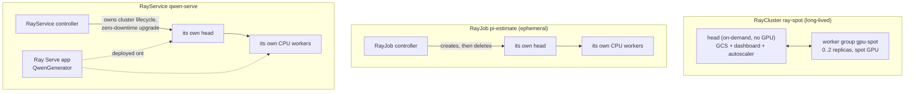

# 08 · Ray on Kubernetes

> Running **Ray** — Python-native distributed compute (tasks, actors, data, train, serve) — on
> top of Kubernetes with **KubeRay**: a long-lived `RayCluster` (head on stable capacity, workers
> on spot GPUs), an ephemeral `RayJob`, and a `RayService` running Ray Serve, on **EKS**.

---

## Before you start

This chapter assumes:

- A cluster from `00-prerequisites-and-cluster-setup`. The `cpu-lab` path needs nothing else; the
  GPU path needs the node-pool mechanics from `01-gpu-nodes-and-scheduling` (this chapter creates
  its own dedicated GPU node pool in §4.2).
- Optional: the `team-research` ClusterQueue and Ray integrations enabled by
  `06-batch-jobs-and-kueue`'s Kueue install, only if you plan to run §3.5's `kueue/eks`
  overlay.
- `env.sh` and `versions.env` sourced.

## 1. Why this matters

Kubeflow Trainer (chapter `07`) is purpose-built for one shape of workload: a fixed-size gang of
identical ranks running one framework's collective-communication protocol. A lot of real ML work
doesn't look like that — a data pipeline with uneven per-shard cost, a hyperparameter sweep with
dozens of trials, or a serving layer that composes several models. **Ray** gives you a general
distributed-Python runtime (tasks, actors, `ray.data`, `ray.train`, `ray.serve`) with its own
scheduler and autoscaler, and **KubeRay** is the operator that runs a Ray cluster's processes as
Kubernetes Pods instead of VMs you SSH into.

The three CRDs KubeRay ships map to three different job shapes:

- **`RayCluster`** — a long-lived cluster you `ray.init()`/connect to interactively or point
  multiple jobs at. Think "the cluster the data team shares."
- **`RayJob`** — submit-and-forget: KubeRay can spin up a *fresh* RayCluster just for this job
  (`spec.rayClusterSpec`) and tear it down when it finishes. Think "one Job resource," the same
  mental model as `batch/v1` Job or chapter 07's `TrainJob`.
- **`RayService`** — a `RayCluster` plus a Ray Serve app, with KubeRay doing zero-downtime
  upgrades (stand up a new cluster, health-check it, switch traffic, tear down the old one)
  whenever the spec changes. Think "a Deployment, but the pods are a Ray cluster."

In DevOps terms: Ray is one more thing that turns "a cluster of machines" into "a scheduler
target," the same job Kubernetes itself does one layer down — which is exactly why running Ray
*on* Kubernetes (rather than Ray's own standalone cluster launcher) lets you reuse everything
you've already built in this course: spot node pools, Kueue admission, GPU device plugins,
observability.

## 2. Learning objectives & time plan (~3 h)

By the end you can:

1. Explain the difference between `RayCluster`, `RayJob` and `RayService`, and which one to reach
   for.
2. Read `common/raycluster-spot.yaml`: head vs worker group spec, `enableInTreeAutoscaling`, and
   why the head shouldn't run GPU workloads or spot capacity.
3. Explain the difference between the **Ray autoscaler** (adds/removes Ray worker *replicas*
   based on pending Ray tasks/actors) and the **Kubernetes-level** Cluster Autoscaler/Karpenter
   (adds/removes *nodes* based on unschedulable Pods) — and how the two compose.
4. Submit a `RayJob` and explain its ephemeral-cluster lifecycle vs. reusing an existing
   `RayCluster` via `clusterSelector`.
5. Deploy a `RayService` running a small Ray Serve app and understand what KubeRay's zero-downtime
   upgrade does differently from a Kubernetes Deployment rolling update.
6. Explain what changes once you layer the optional `kueue/eks` overlay.

| Block | Time | What |
|---|---|---|
| Theory | 35 min | §3 concepts, RayCluster/RayJob/RayService, the two autoscalers |
| Lab A | 40 min | Install KubeRay, run the CPU `cpu-lab` (or the EKS GPU RayCluster) |
| Lab B | 45 min | Submit `RayJob` (watch the ephemeral cluster come and go), inspect the dashboard |
| Lab C | 40 min | Deploy `RayService`, curl `/generate`, trigger a spec change and watch the upgrade |
| Review | 20 min | Kueue overlay, troubleshooting, checkpoint questions, cleanup |

## 3. Concepts

### 3.1 Object model



### 3.2 Head on stable, workers on spot

The head process holds cluster state (GCS), runs the dashboard and (with
`enableInTreeAutoscaling: true`) the Ray autoscaler itself — losing it kills every actor's
connection to the cluster, not just one task. `common/raycluster-spot.yaml` therefore gives the
head **no** `nodeSelector` at all (schedules onto whatever on-demand capacity your default node
pool provides) and **no GPU**, while the `gpu-spot` worker group gets the EKS overlay's spot +
GPU `nodeSelector`/`tolerations` (§3.4). `terminationGracePeriodSeconds: 25` on the worker gives
Ray's own graceful drain (stop accepting new tasks, let running ones finish) a head start before
a spot reclaim SIGKILLs the pod.

### 3.3 Two autoscalers, two triggers

| | Ray autoscaler (`enableInTreeAutoscaling`) | Kubernetes node autoscaler (Cluster Autoscaler / Karpenter, chapter `13`) |
|---|---|---|
| Watches | Pending Ray tasks/actors vs. cluster resources | Unschedulable Pods |
| Acts on | `workerGroupSpecs[].replicas` (adds/removes **Pods**) | Nodes (adds/removes **VMs**) |
| Runs as | A sidecar-like process inside the Ray head | A cluster-level controller/DaemonSet-adjacent deployment |

They compose in sequence: a burst of `ray.remote` GPU tasks makes the Ray autoscaler raise
`gpu-spot` replicas toward `maxReplicas`, which creates new worker Pods with
`nvidia.com/gpu: "1"` requests the scheduler can't place yet → those Pods go `Pending` → *that's*
what triggers the Kubernetes-level autoscaler to add a spot GPU node. `idleTimeoutSeconds: 120`
controls how long an idle Ray worker survives before Ray scales its replica count back down
(which then lets the node-level autoscaler reclaim the now-empty node).

### 3.4 The EKS overlay

Only the RayCluster's `gpu-spot` worker group needs a patch (spot + GPU
`nodeSelector`/`tolerations`) — the head, the RayJob's ephemeral cluster and the RayService are
all CPU-only and schedule fine on your default on-demand node pool from chapter `00`.

| | EKS |
|---|---|
| GPU | 1x L4 (`g6.xlarge`) |
| Spot nodeSelector | `eks.amazonaws.com/capacityType: SPOT` |
| GPU taint added by | `create-gpu-nodegroup.sh` (§4.2) |
| Spot taint added by | nobody — opt-in, set explicitly in the nodegroup config |

`cpu-lab/` strips the GPU requirement entirely (CPU image, no `nvidia.com/gpu`, no
`nodeSelector`) so the whole chapter runs on any cluster while you're waiting on GPU quota.

### 3.5 Optional: Kueue admission (`kueue/eks`)

`kueue/eks` layers the `common/kueue` Kustomize *Component*: it labels both the `RayJob` and the
`RayCluster` with `kueue.x-k8s.io/queue-name: ch08-queue` (pointing at the same `team-research`
`ClusterQueue` chapter `07`'s optional overlay uses) and removes the worker group's hardcoded
`eks.amazonaws.com/capacityType` selector key so Kueue's admitted ResourceFlavor decides spot vs
on-demand instead. `06-batch-jobs-and-kueue`'s Kueue Helm values already enable the
`ray.io/rayjob`, `ray.io/rayservice` and `ray.io/raycluster` integrations, so no controller-side
change is needed here. Kueue's RayJob webhook manages `spec.suspend` itself (suspends until
admitted); the always-on `RayCluster` is admitted once at creation and simply stays `Pending` if
quota isn't free.

```bash
kubectl apply -k 08-ray-on-kubernetes/kueue/eks
```

## 4. Lab

### 4.1 Install KubeRay

What you're about to do: install the KubeRay operator (controller + CRDs for
`RayCluster`/`RayJob`/`RayService`) via Helm, pinned to `${KUBERAY_VERSION}`. Skip this step
entirely if you're only running `cpu-lab` on a cluster that already has KubeRay — otherwise run it
once per cluster.

```bash
source env.sh && source versions.env
```

```bash
helm repo add kuberay https://ray-project.github.io/kuberay-helm/ --force-update
helm repo update kuberay

helm upgrade --install kuberay-operator kuberay/kuberay-operator \
  --namespace kuberay-system --create-namespace \
  --version "${KUBERAY_VERSION}" \
  --wait --timeout 5m

kubectl -n kuberay-system rollout status deploy/kuberay-operator --timeout=5m
kubectl get crd rayclusters.ray.io rayjobs.ray.io rayservices.ray.io
```

How to tell this worked: `kubectl -n kuberay-system get pods` shows `kuberay-operator` `Running`,
and `kubectl get crd | grep ray.io` lists `rayclusters.ray.io`, `rayjobs.ray.io`,
`rayservices.ray.io`.

### 4.2 GPU node pool (skip for `cpu-lab`)

What you're about to do: create the dedicated spot GPU managed node group the `gpu-spot` worker
group targets — L4 instances (`g6.xlarge`/`g6.2xlarge` for spot diversification), scaling from 0.
The RayCluster head, RayJob's ephemeral cluster and RayService all run on your existing on-demand
default node group from chapter `00`. Requires "All G and VT Spot Instance Requests" (or On-Demand
G and VT) vCPU quota >= 8. Set `CAPACITY=on-demand` instead of the default `spot` to create the
fallback group.

```bash
CAPACITY="${CAPACITY:-spot}"
if [[ "${CAPACITY}" == "spot" ]]; then NG=ch08-gpu-spot-l4; SPOT=true; else NG=ch08-gpu-ondemand-l4; SPOT=false; fi

cat <<YAML | eksctl create nodegroup -f -
apiVersion: eksctl.io/v1alpha5
kind: ClusterConfig
metadata:
  name: ${EKS_CLUSTER}
  region: ${AWS_REGION}
managedNodeGroups:
  - name: ${NG}
    amiFamily: AmazonLinux2023
    instanceTypes: ["g6.xlarge", "g6.2xlarge"]
    spot: ${SPOT}
    minSize: 0
    desiredCapacity: 0
    maxSize: 2
    volumeSize: 100
    labels:
      ch08.lab/gpu: l4
    taints:
      - key: nvidia.com/gpu
        value: "true"
        effect: NoSchedule
    propagateASGTags: true
YAML
```

How to tell this worked: `kubectl get nodes -l nvidia.com/gpu.present=true` lists at least one
node once the pool scales up on demand (this pool scales from 0, so it may show nothing until
Step 4.3's worker Pods trigger a scale-up).

### 4.3 RayCluster

What you're about to do: apply the `eks` overlay (or `cpu-lab` if you have no GPU quota yet) and
watch the head + worker group come up.

```bash
kubectl apply -k 08-ray-on-kubernetes/eks
```

No GPU quota yet? Run the CPU-only variant instead:
```bash
kubectl apply -k 08-ray-on-kubernetes/cpu-lab
```

```bash
kubectl -n ch08-ray get raycluster,pods -w
kubectl -n ch08-ray port-forward svc/ray-spot-head-svc 8265:8265   # dashboard
```

Open `http://localhost:8265` — the Ray dashboard shows the cluster's nodes, jobs and (with the
GPU overlay) `nvidia.com/gpu` in cluster resources. Expected:

```
NAME       DESIRED WORKERS   AVAILABLE WORKERS   STATUS   AGE
ray-spot   1                 1                    ready    2m
```

How to tell this worked: the `raycluster` shows `STATUS: ready` and the dashboard's "Cluster"
tab lists the head plus at least one worker.

### 4.4 RayJob (ephemeral cluster)

```bash
kubectl -n ch08-ray get rayjob pi-estimate -w
kubectl -n ch08-ray logs -l job-name=pi-estimate-<suffix> -f   # get the exact name from `get pods`
```

Watch a fresh `raycluster` and its Pods appear for `pi-estimate`, run to completion
(`pi ~= 3.14...` in the logs), and then (after `ttlSecondsAfterFinished: 60`) disappear —
`shutdownAfterJobFinishes: true` tore the ephemeral cluster down for you. How to tell this
worked: `kubectl -n ch08-ray get rayjob pi-estimate -o jsonpath='{.status.jobStatus}'` reads
`SUCCEEDED`, and `kubectl -n ch08-ray get raycluster` eventually shows no cluster left for it.

### 4.5 RayService

```bash
kubectl -n ch08-ray get rayservice qwen-serve -w   # wait for Status: RUNNING
kubectl -n ch08-ray port-forward svc/qwen-serve-serve-svc 8000:8000
curl -s localhost:8000/generate -X POST \
  -H 'content-type: application/json' \
  -d '{"prompt": "Kubernetes is", "max_new_tokens": 32}' | jq
```

First request is slow (downloading and loading `Qwen/Qwen3-0.6B` on CPU); subsequent ones are
fast. How to tell this worked: the response is JSON with a `"generated_text"` field starting with
your prompt. Bump `serveConfigV2`'s `pip` list or `route_prefix` and re-apply to trigger a
zero-downtime upgrade — watch `kubectl -n ch08-ray get rayservice qwen-serve -w` show a second
cluster come up before the old one is torn down.

## 5. Spot considerations

- **Never put the head on spot.** A reclaimed head loses GCS state for the whole cluster, not
  just the work on that node — every worker, every in-flight actor, every Serve replica goes with
  it. `common/raycluster-spot.yaml` intentionally leaves the head's `nodeSelector` empty
  (on-demand default pool) so it's never touched by the spot/GPU overlay.
- **`idleTimeoutSeconds`** on the Ray autoscaler and `minReplicas`/`maxReplicas` per worker group
  are your spot cost dial: shorter idle timeout = faster scale-to-zero = cheaper but more cold
  starts.
- **RayJob's ephemeral worker group** in this lab (`common/rayjob-batch.yaml`) is deliberately
  CPU-only/on-demand-shaped — for a spot GPU batch job, add the same overlay pattern
  (`nodeSelector`/`tolerations`) to its `rayClusterSpec.workerGroupSpecs`.
- **RayService availability** during a spot reclaim of a *worker* (not the head) degrades
  gracefully — Serve routes around the lost replica and the Ray autoscaler/Kubernetes autoscaler
  replace it; a reclaimed head, as above, does not degrade gracefully.

## 6. Troubleshooting

| Symptom | Likely cause | Fix |
|---|---|---|
| `rayclusters.ray.io` / `rayjobs.ray.io` not found | KubeRay operator not installed yet | Run §4.1's `helm upgrade --install`, check `kubectl -n kuberay-system get pods` |
| GPU worker Pod stuck `Pending` | GPU node pool at 0 and no autoscaler trigger, or GPU quota exhausted | `kubectl get nodes -l nvidia.com/gpu.present=true`; check the AWS console for G/VT quota |
| RayJob stuck `Pending`/no cluster created | `spec.suspend` still `true` (only if you applied `kueue/eks` and quota isn't free) | `kubectl get clusterqueue team-research -o yaml` |
| RayService stuck `WaitForDashboard`/`DeploymentUnhealthy` | Serve app failed to import (bad `working_dir`/pip deps) or CPU too small to load the model | `kubectl -n ch08-ray logs <head-pod> -c ray-head`; check `serveConfigV2` runtime_env |
| Dashboard 502 / can't reach 8265 | Port-forward to the wrong service name, or head Pod not Ready | `kubectl -n ch08-ray get svc` for the exact `-head-svc` name |
| `pi_estimate.py` / `serve_app.py` "file not found" | ConfigMap not mounted at the exact path the script/`working_dir` expects | Confirm `configMapGenerator` name matches the volume's `configMap.name` |

## 7. Cleanup and cost notes

What you're about to do: delete the RayServices/RayJobs/RayClusters, the applied manifests, and
scale the GPU managed node groups back down to nothing.

```bash
kubectl delete rayservices,rayjobs,rayclusters --all -n ch08-ray --ignore-not-found
kubectl delete -k 08-ray-on-kubernetes/eks --ignore-not-found
for ng in ch08-gpu-spot-l4 ch08-gpu-ondemand-l4; do
  eksctl delete nodegroup --cluster "${EKS_CLUSTER}" --region "${AWS_REGION}" --name "${ng}" --wait 2>/dev/null || true
done
# UNINSTALL_OPERATOR=true also removes the KubeRay controller:
if [[ "${UNINSTALL_OPERATOR:-false}" == "true" ]]; then
  helm uninstall kuberay-operator -n kuberay-system || true
fi
```

Running GPU nodes are not cheap — don't leave `ray-spot` or `qwen-serve` up overnight.

## 8. Checkpoint questions

<details><summary>1. Why must the RayCluster head never run on spot capacity, even though workers can?</summary>

The head holds the Global Control Store (GCS) — the cluster's shared state for every actor,
task and object reference. Losing it is a whole-cluster failure, not a single lost worker; a
worker reclaim just loses that worker's in-flight tasks, which Ray's autoscaler/scheduler can
recover from.
</details>

<details><summary>2. What's the actual difference between the Ray autoscaler and the Kubernetes node autoscaler in this chapter, and how do they interact?</summary>

The Ray autoscaler changes `workerGroupSpecs[].replicas` (Ray-level: how many worker **Pods**
exist) based on pending Ray tasks/actors. The Kubernetes-level autoscaler (Cluster
Autoscaler/Karpenter) changes how many **nodes** exist, based on unschedulable Pods. A Ray-level
scale-up creates Pods the node-level autoscaler then has to find (or create) capacity for.
</details>

<details><summary>3. When would you reach for `RayJob` instead of applying tasks/actors against the long-lived `RayCluster`?</summary>

When the work is a discrete, boundable unit (a training run, a batch scoring pass) that should
own its own cluster lifecycle end-to-end, get its own quota decision (especially under Kueue),
and not compete with or be affected by whatever else is running on a shared interactive cluster.
`clusterSelector` is the other option when you *do* want to reuse an existing cluster.
</details>

<details><summary>4. Why can't `RayService` reuse an existing RayCluster the way `RayJob` can via `clusterSelector`?</summary>

RayService's core feature is zero-downtime upgrades: on a spec change it stands up a *new*
RayCluster, health-checks the Serve app on it, switches traffic, then tears down the old one. That
lifecycle requires RayService to own the cluster outright — it can't safely replace a cluster
something else might also be using.
</details>

<details><summary>5. What does <code>shutdownAfterJobFinishes: true</code> + <code>ttlSecondsAfterFinished</code> actually delete, and what's left behind?</summary>

They delete the ephemeral `RayCluster` (and its Pods) that KubeRay created for the `RayJob`, N
seconds after the job's Kubernetes Job-equivalent status goes terminal. The `RayJob` object itself
(and its final status/logs reference) stays until you `kubectl delete rayjob` it.
</details>

<details><summary>6. What changes about spot/on-demand placement once you layer <code>kueue/eks</code>?</summary>

Same pattern as chapter 07: the overlay's hardcoded capacity-type key is removed from the
worker group's `nodeSelector`, and Kueue's admitted ResourceFlavor (spot tried first, on-demand
fallback) decides placement instead of the Workload sitting `Pending` when spot is unavailable.
</details>

<details><summary>7. Why does the head's `rayStartParams` set <code>num-cpus: "0"</code>?</summary>

It tells Ray not to schedule ordinary tasks/actors onto the head's CPU — the head's CPU/memory
should be reserved for GCS, the dashboard and the autoscaler, not compete with user workloads
(which is doubly important since the head is the one component you can't afford to overload or
lose).
</details>

<details><summary>8. What doesn't carry over from the GPU overlay to <code>cpu-lab</code>?</summary>

Any `num_gpus=...` Ray task/actor placement, NCCL-based multi-GPU collective work, and the "spot
GPU workers" cost story the chapter's overlays are built around — `cpu-lab` only exercises the
RayCluster/RayJob/RayService and autoscaler mechanics on ordinary CPU capacity.
</details>

## 9. Further reading

- [KubeRay documentation](https://docs.ray.io/en/latest/cluster/kubernetes/index.html)
- [RayCluster / RayJob / RayService CRD reference](https://docs.ray.io/en/latest/cluster/kubernetes/user-guides/config.html)
- [Ray Serve](https://docs.ray.io/en/latest/serve/index.html)
- [Ray autoscaling on Kubernetes](https://docs.ray.io/en/latest/cluster/kubernetes/user-guides/configuring-autoscaling.html)
- [Kueue's Ray integrations](https://kueue.sigs.k8s.io/docs/tasks/run/rayjobs/)
- Cross-links: `06-batch-jobs-and-kueue` (the `team-research` ClusterQueue and Ray integrations
  used by `kueue/eks`), `07-distributed-training-kubeflow-trainer` (the gang-scheduled
  alternative for fixed-size multi-node training), `09-llm-inference-with-vllm` (production LLM
  serving throughput/latency — Ray Serve here demonstrates the deployment pattern, not
  performance)

### Versions tested

| Component | Version | Source |
|---|---|---|
| KubeRay operator | `${KUBERAY_VERSION}` (1.7.0) | `versions.env`, helm repo `https://ray-project.github.io/kuberay-helm/` |
| Ray (head/worker image) | `2.52.0` (`rayproject/ray:2.52.0-py311[-gpu]`) | not in `versions.env` — pinned here; verified tag exists on Docker Hub |
| RayCluster/RayJob/RayService API | `ray.io/v1` | KubeRay v1.7.0 CRDs |
| Serve model | `Qwen/Qwen3-0.6B` (ungated) | verified present on Hugging Face Hub |
| Kueue (optional overlay) | `${KUEUE_VERSION}` (0.19.4) | `versions.env`, `kueue.x-k8s.io/v1beta2` |
