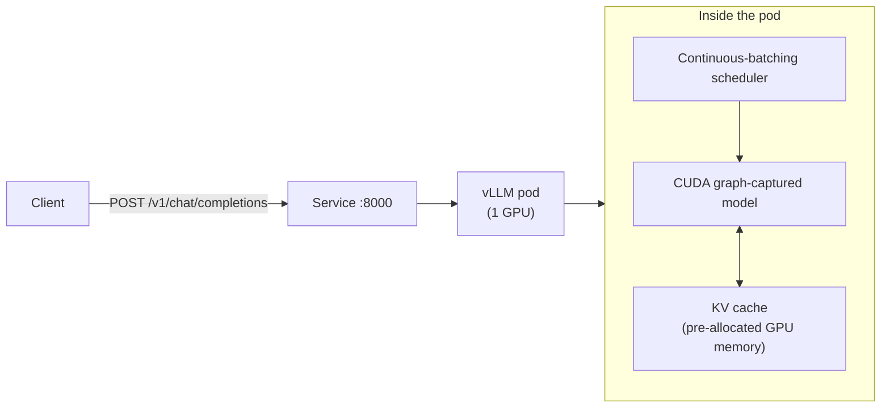

# 09 · LLM Inference with vLLM

> Serve an OpenAI-compatible LLM endpoint on Kubernetes with vLLM: probes that match a multi-minute
> weight-load, KV cache / GPU memory sizing, tensor parallelism, and benchmarking.

**New to both Kubernetes and GPU/AI serving?** This chapter assumes you can already run `kubectl
apply`/`get`/`logs` (from earlier chapters) but assumes nothing about how LLMs get served. Section 3
below is written for someone who has never seen an inference server before — read it before Step 1,
not after something breaks.

## 0. Before you start

This chapter assumes:

- A spot GPU node pool from `01-gpu-nodes-and-scheduling` §4 (creates the `spot-gpu` managed node
  group and installs the pinned NVIDIA device plugin) — this chapter reuses that pool, it does not
  create its own.
- The NVIDIA GPU Operator or device plugin from `01`/`02` already installed on that pool.
- `env.sh` and `versions.env` sourced.

## 1. Why this matters

A vLLM pod is not "just another Deployment." It boots for minutes (not seconds), owns the *entire*
GPU's memory in one allocation (the KV cache), dies ungracefully if you send SIGTERM without a grace
period, and its "ready" signal has nothing to do with the container starting. Get the probes or the
memory math wrong and you get flapping pods, OOM-killed inference, or silent request drops during a
spot reclaim. This chapter builds one correct single-GPU deployment first, then scales it out
(tensor parallel) and stress-tests it (benchmark job), on EKS.

If you've only ever deployed stateless web apps (a container that answers a request in milliseconds
and holds no meaningful state between requests), almost every assumption you're used to breaks here:
the pod is *slow* to become ready by design, it *deliberately* grabs nearly all of a scarce, expensive
resource (GPU memory) up front, and a plain `kubectl delete pod` can silently drop in-flight user
requests if you don't understand why. This chapter exists to make those differences explicit before
you hit them in production.

## 2. Learning objectives and time plan (~3 h)

By the end you can:

1. Explain why vLLM's startup/readiness/liveness probes and `terminationGracePeriodSeconds` look
   nothing like a typical web app's, and size them correctly for a given model.
2. Explain KV cache and `--gpu-memory-utilization`: why vLLM pre-allocates (nearly) all free GPU
   memory instead of allocating per-request like a normal server.
3. Run vLLM on one spot GPU on your cloud, hit the OpenAI-compatible API, and read the startup logs.
4. Explain when tensor parallelism helps (model too big for one GPU) vs. when it doesn't (latency
   for a model that already fits), and run a 2-GPU tensor-parallel deployment.
5. Benchmark throughput/TTFT with `vllm bench serve` and read the report.

| Time | Activity |
|---|---|
| 0:00–0:30 | Read section 3 (concepts): probes, KV cache, tensor parallel |
| 0:30–1:15 | Deploy vLLM on your cloud's spot GPU, watch startup logs, hit the API |
| 1:15–1:45 | Break the probes on purpose (see Troubleshooting), fix them |
| 1:45–2:30 | Tensor-parallel-2 deployment + benchmark job, read the report |
| 2:30–3:00 | Checkpoint questions, cleanup |

## 3. Concepts

### 3.0 What an LLM inference server does that a normal web service doesn't

Before touching YAML, it helps to know *what kind of thing* you're deploying. A normal web service
(say, a REST API backed by a database) is roughly: request in, a few milliseconds of CPU work and a
database round trip, response out. Any pod can handle it, the container starts in seconds, and one
request finishing doesn't affect the next one.

An LLM inference server is a different shape of workload entirely:

- **It generates output one token at a time.** "Tokens" are the sub-word chunks a model reads and
  writes (roughly 3/4 of a word each in English). To answer a 50-word prompt, the model runs its full
  neural network forward pass *once per output token* — that's dozens to hundreds of GPU passes for
  one response, not one. This is why LLM responses stream in word-by-word instead of appearing all
  at once: the server literally hasn't computed the rest yet.
- **It needs a KV cache, and that's the biggest new idea here.** For every token already generated,
  the model's attention mechanism needs to remember two per-layer, per-token vectors (the "keys" and
  "values" — hence *KV*) so it doesn't recompute them from scratch for every new token. This cache
  grows with every token in a conversation and lives entirely in GPU memory for the life of the
  request. A model with a long context window and many concurrent users needs gigabytes of KV cache,
  not the kilobytes-per-request a typical API holds. Section 3.1 below covers exactly how vLLM manages
  this.
- **It batches requests very differently from a normal server.** A web server mostly handles requests
  independently and in parallel; an LLM server's GPU is most efficient when it processes many
  requests' next-token step *together* in one batch, because the GPU's matrix-multiply hardware is
  underused running just one request at a time. Section 3.1 explains vLLM's *continuous* batching,
  which is the specific technique that makes this efficient without making early requests wait for a
  batch to fill up.
- **It runs across more than one GPU when the model doesn't fit in one.** Modern LLMs range from
  under a gigabyte (this chapter's `Qwen3-0.6B`) to hundreds of gigabytes of weights. When a model's
  weights don't fit in a single GPU's memory, you must literally split ("shard") the model's weight
  matrices across multiple GPUs and have them cooperate on every request. Section 3.3 covers this
  under the name **tensor parallelism**.

**What vLLM is, and why not just use a Hugging Face `transformers` model directly.** The
[`transformers`](https://huggingface.co/docs/transformers) Python library can load and run almost any
model, including generating text — but it was built for *correctness and flexibility* (research,
fine-tuning, one-off scripts), not for serving thousands of concurrent chat requests efficiently. Run
it naively as a web server and every request gets its own memory allocation, no request shares GPU
work with another, and the GPU sits mostly idle waiting for Python/CUDA overhead between steps. vLLM
is a purpose-built *inference server*: it implements continuous batching and the paged KV-cache
allocator (**PagedAttention**, described in 3.1) so the same GPU serves many concurrent users with
far higher throughput, and it exposes an **OpenAI-compatible HTTP API** (`/v1/chat/completions`, the
same request/response shape as OpenAI's own API) so any existing OpenAI client library talks to it
with just a different base URL.

**What a Hugging Face access token and a "gated" model are, and why the Secret pattern matters.**
Hugging Face Hub hosts model weights (the actual downloadable files a model needs, gigabytes of
numbers). Most models are public and downloadable anonymously, but anonymous downloads are
rate-limited, and some models are **gated**: the model's page requires you to accept a license or
usage agreement before you can download it (common for commercially-sensitive or restricted-use
models). Either way, you authenticate downloads with a **Hugging Face access token** — a secret string
tied to your HF account (create one at huggingface.co → Settings → Access Tokens). Never put that
token directly in a YAML manifest or commit it to git: anyone who can read the manifest gets your
token. Instead it's stored as a Kubernetes **Secret** — a Kubernetes object designed to hold sensitive
values, kept separate from your regular config manifests — and the pod reads it as an environment
variable at start time via `secretKeyRef` (see the Deployment's `env:` block in Step 1). This chapter's
default model, `Qwen/Qwen3-0.6B`, is public and ungated, so the token is optional here — but the
Secret still avoids anonymous rate limits, and the exact same pattern is required the moment you point
this Deployment at a gated model (Llama and Gemma model families are common gated examples).

### 3.1 Request path



**Reading this diagram if you've never seen an LLM-serving architecture before:** the client and
Service box on the left look exactly like any other Kubernetes app — a client sends a normal HTTP
POST, the Service load-balances to a pod, nothing new so far. Everything interesting happens *inside*
the pod, in the middle box, and it happens on every single request:

1. The **continuous-batching scheduler** is the traffic controller. It doesn't queue your request and
   wait for a batch to fill — every time the GPU is about to compute the next token for whatever it's
   currently working on, the scheduler decides which requests (old and brand new) get a "turn" in that
   step. This is what lets a request that just arrived start being served within the current step
   rather than waiting for unrelated in-flight requests to finish.
2. The **CUDA graph-captured model** is the actual neural network doing the computation — "CUDA graph
   capture" is an optimization where vLLM pre-records the exact sequence of GPU operations once at
   startup (this is one reason startup takes minutes, see 3.2) so each subsequent step replays that
   recorded graph instead of re-issuing thousands of individual GPU instructions from Python each time.
3. The **KV cache** is the memory region described in 3.0 — every token the engine has already
   processed, for every in-flight sequence, has an entry here. The double arrow between the engine and
   the KV cache means every decode step *both* reads from it (attention over past tokens) *and*
   writes to it (the newly generated token's own key/value).

The arrows only look like a straight pipeline; in reality steps 1–3 repeat once per output token,
for potentially dozens of requests interleaved in the same batch, until each request's response is
complete.

- **Continuous batching**: unlike a naive server that batches fixed-size groups of requests, vLLM's
  scheduler adds/removes sequences from the running batch every decode step — a new request doesn't
  wait for the current batch to finish.
- **PagedAttention / KV cache**: the KV cache (attention keys/values per token, per sequence) is
  allocated in fixed-size GPU-memory "pages," addressed like virtual memory, so sequences don't need
  a contiguous memory block and near-100% of a GPU's free memory can be used without fragmentation
  waste. This is *why* `--gpu-memory-utilization` exists: vLLM measures free GPU memory at startup
  and pre-allocates that fraction for weights + activations + the KV cache pool — it is not "used
  memory," it's reserved capacity for concurrent requests.

  In plain terms: a normal program allocates memory as it needs it and frees it when done. vLLM
  instead looks at how much GPU memory is free the moment it starts, claims a large fraction of it
  immediately, and then manages that claimed memory itself in fixed-size chunks ("pages") for the
  rest of the process's life — similar to how an OS manages RAM in pages rather than one contiguous
  block per program. The payoff is that it can pack far more concurrent sequences into the same GPU
  than a naive "allocate per request" approach, because pages from different sequences never need to
  be contiguous.

### 3.2 Why the probes look the way they do

Kubernetes decides whether to send traffic to a pod, restart it, or leave it alone using three
different **probes** — periodic HTTP/exec checks against the container. If you've only deployed fast
web services before, you've probably never needed a `startupProbe` at all; it exists specifically for
workloads like this one that take a long time to become healthy on first boot.

| Probe | What it checks | Why it's shaped this way |
|---|---|---|
| `startupProbe` | `/health`, `failureThreshold: 60` × `periodSeconds: 10` = 10 min | Weight download (if not cached) + CUDA graph capture + KV cache allocation can take minutes; **liveness/readiness are suppressed until this passes**, so a slow-but-healthy boot is never killed |
| `readinessProbe` | `/health`, short interval | Once `/health` returns 200 the engine is serving; a `terminationGracePeriodSeconds`-aware `preStop` sleep gives load balancers time to stop routing before SIGTERM |
| `livenessProbe` | `/health`, longer `failureThreshold` | A genuinely hung engine (CUDA error, deadlocked scheduler) needs a restart — but do not make this trigger-happy, a busy batch can be slow to answer |
| `terminationGracePeriodSeconds: 25` + `--shutdown-timeout=10` | Grace period budget | Must be **≤ EC2's spot notice window (~2 min)** so vLLM's own graceful drain (`--shutdown-timeout`) finishes inside the grace period, not after the kubelet SIGKILLs it |

Why three separate probes instead of one: they answer three different questions Kubernetes needs
answered independently. `startupProbe` answers "has this container *ever* become healthy since it
started?" — while it's failing, Kubernetes doesn't touch the pod (doesn't restart it, doesn't route
traffic) because a multi-minute boot failing early checks would otherwise look identical to a crashed
process. Once `startupProbe` passes for the first time, it stops running forever and the other two
take over: `readinessProbe` answers "should the Service route traffic to this pod *right now*?" (a
pod can flip in and out of ready without being restarted — useful if the engine is briefly too busy to
answer `/health` fast), and `livenessProbe` answers "is this process fundamentally stuck and needs a
restart?" (a much rarer, more drastic action). Getting these three roles confused — e.g. relying on
`livenessProbe` alone for a slow boot — is the single most common cause of vLLM pods stuck in
`CrashLoopBackOff` (see Troubleshooting).

The grace-period math matters because of what happens on pod termination. When Kubernetes decides to
remove this pod (a voluntary drain, or — critically for this chapter — a spot instance reclaim),
it runs the container's `preStop` hook, then sends `SIGTERM`, then waits up to
`terminationGracePeriodSeconds` before force-killing with `SIGKILL`. `--shutdown-timeout=10` is vLLM's
*own* internal budget, given the SIGTERM, to let in-flight requests finish rather than aborting them
instantly. If `terminationGracePeriodSeconds` were smaller than `preStop`'s sleep plus vLLM's own
shutdown timeout, the kubelet would SIGKILL the process mid-drain — the exact outcome the grace period
was supposed to prevent — so `25s` (5s `preStop` + 10s `--shutdown-timeout` + margin) has to stay
comfortably under the ~2-minute warning AWS gives before reclaiming a spot EC2 instance.

### 3.3 Tensor parallelism

Splits each layer's weight matrices across N GPUs on the **same node** (intra-node, needs fast
NVLink/PCIe — this repo does not cover multi-node TP; see `12-inference-gateway-and-multinode-serving`
for LeaderWorkerSet-based multi-node serving). Use it when the model doesn't fit one GPU's memory
(e.g. Qwen3-8B on a 16 GiB T4), not to speed up a model that already fits — TP adds NCCL
all-reduce latency per layer, so a model that already fits one GPU is usually *faster* on 1 GPU than
split across 2 (throughput can still improve at high concurrency, but latency does not).

**What "splitting a model across 2 GPUs" physically means:** a model's weights are organized as large
matrices per layer (attention projections, feed-forward layers, and so on). Tensor parallelism cuts
each of those matrices into N equal slices — with `--tensor-parallel-size=2`, GPU 0 holds one half of
every matrix's columns and GPU 1 holds the other half. Neither GPU holds the whole model. To compute
one layer's output, each GPU computes its own partial result on its half of the matrix using its own
half of the data, and then the GPUs exchange and combine those partial results (an **NCCL
all-reduce**, using NVIDIA's collective-communication library over NVLink or PCIe between the two
GPUs) before moving to the next layer. This has to happen for *every layer, every token* — which is
exactly why it adds latency: two GPUs computing in parallel still have to stop and synchronize with
each other dozens of times per response. It only pays off when the alternative (fitting the model on
one GPU) isn't possible at all, or when the extra GPUs' combined compute throughput outweighs that
synchronization cost under heavy concurrent load.

### 3.4 Production serving features: Chunked Prefill, Prefix Caching, Multi-LoRA, Speculative Decoding, and Quantization

When serving LLMs at scale, standard single-model serving leaves immense performance and cost efficiency on the table. Modern production deployments configure several advanced vLLM capabilities:

#### Chunked Prefill (`--enable-chunked-prefill=true`)

LLM inference consists of two fundamentally distinct phases:
- **Prefill phase (Compute-bound)**: The server takes the input prompt (e.g. 2,000 tokens) and evaluates it in a single forward pass. Matrix multiplications saturate GPU Tensor Cores, reaching high TFLOPS.
- **Decode phase (Memory-bandwidth bound)**: The server generates output tokens autoregressively, one token at a time. The GPU must read all model weights and the entire KV cache from VRAM to compute just one token, leaving arithmetic units mostly idle.

**The Head-of-Line Blocking Problem**: When a large prompt arrives while the engine is in the middle of streaming responses to 20 active users, the GPU switches to prefill mode for 500 ms – 2 seconds. During this window, all 20 ongoing streaming chats freeze. Users perceive sudden stuttering and erratic Time-Per-Output-Token (TPOT).

**The Solution**: Chunked prefill slices incoming prompts into small chunks (e.g. 512 tokens) and interleaves them with decode tokens in the same forward-pass batch. This caps maximum prefill latency per step, keeping streaming token delivery smooth and predictable under bursty traffic.

#### Automatic Prefix Caching (APC - `--enable-prefix-caching`)

Real-world prompts almost always share identical prefixes:
- A 1,500-token system prompt ("You are an enterprise support bot...").
- A 2,000-token context document retrieved via RAG.
- Prior conversation history in a multi-turn chat session.

Without APC, vLLM re-evaluates those 3,500 prompt tokens from scratch on **every single request**, repeatedly paying the full prefill compute and latency penalty.

With `--enable-prefix-caching`, vLLM maintains a Radix Tree of previously computed KV blocks in GPU memory:
- When a new request arrives, vLLM matches the prompt tokens against the tree.
- Any prefix already computed is reused directly from the KV cache without re-running the neural network.
- **Result**: Time To First Token (TTFT) drops by 80%–95% (e.g. from 1,200 ms to 45 ms), and the GPU spends far less compute on redundant prefills.

#### Dynamic Multi-LoRA Serving (`--enable-lora`)

In enterprise settings, different teams often fine-tune low-rank adapters (LoRA) on the same foundation model (e.g. a `sql-generator` adapter, a `legal-reviewer` adapter, and a `customer-support` adapter, all built on `Qwen-2.5-7B`).

- **The Naive Way**: Deploy 3 separate GPU pods, each hosting a merged model. Cost: 3x GPU hardware, with low average utilization.
- **The Multi-LoRA Way**: Deploy 1 vLLM pod hosting the base model with `--enable-lora` and `--max-loras=8`. vLLM loads and manages LoRA adapters dynamically in CPU/GPU memory. Clients simply pass the desired adapter name in the OpenAI API request:
  ```json
  {
    "model": "sql-generator",
    "messages": [{"role": "user", "content": "SELECT * FROM users..."}]
  }
  ```
  vLLM swaps the tiny LoRA adapter matrices into the base model computation dynamically, allowing one GPU pod to serve dozens of specialized models.

#### Speculative Decoding (`--speculative-model`)

Because decode is bottlenecked by memory bandwidth (reading weights for one token takes as long as reading weights for 5 tokens), speculative decoding pairs a small "draft model" with the larger "target model":
1. The tiny draft model (e.g. `Qwen-0.5B`) rapidly generates $K$ candidate tokens (e.g. 4 tokens).
2. The large target model (e.g. `Qwen-7B`) executes a single forward pass over all $K$ tokens simultaneously to verify which ones match its own output probabilities.
3. If 3 tokens are accepted, the system generated 3 tokens in the time of a single target forward pass.
4. **Result**: 2x–3x latency reduction for interactive chatbot workloads with zero degradation in mathematical output quality.

#### Quantization in Production (FP8, AWQ, GPTQ)

Model weights in BF16/FP16 take 2 bytes per parameter (a 70B model requires 140 GB VRAM just for weights). Quantization compresses weights and/or activations:
- **FP8 (8-bit floating point)**: Supported in hardware by NVIDIA Ada Lovelace (L4, L40S) and Hopper (H100). Halves memory footprint (1 byte/param) with almost zero accuracy loss and native tensor core speedups.
- **AWQ (Activation-aware Weight Quantization) & GPTQ (INT4)**: Compresses weights to 4 bits (0.5 bytes/param). A 70B model fits into ~40 GB VRAM across two L4/A10G cards instead of needing an 8-GPU node.
- **Marlin / FlashInfer kernels**: Specialized GPU kernels that perform dequantization on-the-fly during matrix multiply, delivering both memory savings and high decode throughput.

## 4. Lab

```bash
cp env.sh.example env.sh   # if not already done
source env.sh && source versions.env
```

Prerequisite: a spot GPU node pool from `01-gpu-nodes-and-scheduling` §4 (the `spot-gpu` managed
node group + the pinned NVIDIA device plugin). This chapter reuses that nodegroup — it does not
create its own.

### Step 1: What's in `eks/`

Every file here is a complete, standalone manifest you apply directly with `kubectl apply -f` — no
kustomize base/overlay, no separate patch files.

- `namespace.yaml` — `ch09-vllm`
- `vllm-deployment.yaml` — the single-GPU vLLM Deployment (`Qwen/Qwen3-0.6B`, `strategy: Recreate`
  because a 1-GPU pod pool can't run two copies during a rollout), pinned to the spot GPU node group
  via `nodeSelector`, with the HF cache mounted from the PVC below
- `hf-cache-pvc.yaml` — PVC-backed HF cache so restarts don't re-download weights (see "Model cache"
  below)
- `service.yaml`, `pdb.yaml`
- `vllm-deployment-tp2.yaml` — an alternate Deployment (same name/namespace as `vllm-deployment.yaml`
  — apply one or the other, not both) that swaps the model to `Qwen/Qwen3-8B` and requests 2 GPUs with
  `--tensor-parallel-size=2` (needs a 2-GPU node — see step 4)
- `benchmark-job.yaml` — `vllm bench serve` load test (runs on CPU, hits the Service)

There's no separate script for the `hf-token` Secret — Step 2 below creates it inline with a single
`kubectl create secret generic hf-token --from-literal=HF_TOKEN=...` command from `$HF_TOKEN`
(optional for the ungated Qwen3-0.6B model, but avoids anonymous rate limits, and is required once
you point this at a gated model). Other chapters that reuse this step (`12`, `16`, `19`) run that
same `kubectl create secret` command with their own namespace — there's no `create-hf-secret.sh`
file to run in any of them.

Two other things worth knowing about `strategy: Recreate` and the PDB before you deploy, since both
show up as soon as the pod exists:

- **Why `strategy: Recreate` instead of the default `RollingUpdate`.** A normal Deployment update
  starts the new pod *before* stopping the old one (that's the whole point of a rolling update — zero
  downtime). On a node pool where every node has exactly 1 GPU and this Deployment requests
  `nvidia.com/gpu: "1"`, that doesn't work: the new pod would need a second free GPU to schedule onto
  while the old pod (still holding its GPU) is being terminated, and there isn't one. `Recreate` tells
  Kubernetes to fully terminate the old pod *first*, freeing its GPU, before creating the new one —
  trading a short outage during any update for a deployment that actually succeeds instead of leaving
  the new pod stuck `Pending` forever.
- **What the PodDisruptionBudget (`pdb.yaml`) is for.** A PDB is a Kubernetes object that tells the
  cluster "don't let the number of healthy pods for this app drop below N during *voluntary*
  operations" — things a human or controller chooses to do, like draining a node for maintenance or a
  cluster upgrade. With `minAvailable: 1` and only 1 replica, this PDB effectively blocks anyone from
  voluntarily draining the node this pod is running on, forcing you to plan around it (e.g. scale to 2
  replicas first) rather than accidentally taking the only vLLM replica down during routine
  maintenance. It has no power over an *involuntary* disruption like a spot reclaim — see §5.

### Step 2: Deploy (pick your cloud)

What you're about to do: create an optional HF token Secret (`Qwen/Qwen3-0.6B` is ungated so this
is optional for the base lab, but it's required once you swap in a gated model, and it silences
anonymous-download rate limits either way), then apply the `eks` overlay (1x L4/T4 spot node,
reusing the `spot-gpu` managed node group from chapter `01` — `nvidia.com/gpu.present=true` is set
at boot by `nodeadm` on the EKS AL2023 NVIDIA AMI) and watch the pod come up.

```bash
NAMESPACE=ch09-vllm
: "${HF_TOKEN:?export HF_TOKEN=hf_xxx, or skip — optional for the ungated Qwen3-0.6B}"
kubectl create namespace "$NAMESPACE" --dry-run=client -o yaml | kubectl apply -f -
kubectl create secret generic hf-token \
  --namespace "$NAMESPACE" \
  --from-literal=HF_TOKEN="$HF_TOKEN" \
  --dry-run=client -o yaml | kubectl apply -f -
```

Why this two-step shape: the first line creates the `ch09-vllm` namespace (harmless to re-run — the
`--dry-run=client -o yaml | kubectl apply -f -` idiom generates the object's YAML locally without
contacting the cluster, then applies it, so it never errors if the namespace already exists, unlike
plain `kubectl create namespace` which fails on a second run). The second line creates the Kubernetes
**Secret** discussed in 3.0: `--from-literal=HF_TOKEN=...` stores your token as a base64-encoded value
inside a Secret object named `hf-token`, and the Deployment's `env:` block (see
`eks/vllm-deployment.yaml`) reads it into the container as the `HF_TOKEN` environment variable via
`secretKeyRef`, with `optional: true` so the pod still starts fine if you skipped exporting
`HF_TOKEN` entirely. The `: "${HF_TOKEN:?...}"` line is a bash idiom that prints that reminder message
and exits *only if you actually try to use `$HF_TOKEN` without having exported it* — it does not force
you to set one.

```bash
kubectl apply -f 09-llm-inference-with-vllm/eks/namespace.yaml
kubectl apply -f 09-llm-inference-with-vllm/eks/hf-cache-pvc.yaml
kubectl apply -f 09-llm-inference-with-vllm/eks/vllm-deployment.yaml
kubectl apply -f 09-llm-inference-with-vllm/eks/service.yaml
kubectl apply -f 09-llm-inference-with-vllm/eks/pdb.yaml
```

This is the actual deployment step: apply the namespace first (so the PVC/Deployment/Service/PDB
have somewhere to land), then the rest of `eks/`. Each file is a complete manifest — the Deployment
already has the spot GPU `nodeSelector` and the PVC-backed HF cache baked in, there's no overlay to
merge on top.

```bash
kubectl -n ch09-vllm get pods -w
```

Expected (first boot, cold weight download — several minutes):
```
NAME                    READY   STATUS    RESTARTS
vllm-xxxxxxxxxx-yyyyy   0/1     Running   0
```
then `1/1 Running` once `/health` passes. Watch the logs for the key startup milestones:
```bash
kubectl -n ch09-vllm logs -f deploy/vllm | grep -Ei "gpu_memory_utilization|Available KV cache|Capturing CUDA|Started server"
```
This filters the (very verbose) vLLM startup log down to the four milestones that map directly to
section 3: `gpu_memory_utilization` confirms the memory-reservation fraction it picked up from the
Deployment args (3.1), `Available KV cache memory` is vLLM reporting how much of that reservation is
left over for actual request concurrency after loading weights, `Capturing CUDA` is the CUDA graph
capture step from 3.1 (this is often the slowest part of startup), and `Started server` is the moment
`/health` starts returning 200 and `readinessProbe` will pass.

Verify the OpenAI API:
```bash
kubectl -n ch09-vllm port-forward svc/vllm 8000:8000 &
curl -s http://localhost:8000/v1/models | jq
curl -s http://localhost:8000/v1/chat/completions -H 'Content-Type: application/json' -d \
  '{"model":"Qwen/Qwen3-0.6B","messages":[{"role":"user","content":"Say hi in 5 words"}]}' | jq
```
`kubectl port-forward` opens a tunnel from your local machine's `localhost:8000` to the Service's port
8000 inside the cluster — it's a quick way to reach a ClusterIP Service from your laptop without
setting up an Ingress/LoadBalancer, and it's fine for this lab but not how you'd expose this in
production. `/v1/models` is the OpenAI API's "list what's loaded" endpoint — a fast call that proves
the HTTP server is answering (it doesn't touch the GPU compute path), useful as a first sanity check
before you send an actual generation request. The second `curl` is a real inference request in the
OpenAI chat-completions shape: this is the same request body any OpenAI-client SDK sends, just pointed
at your own cluster's IP instead of `api.openai.com`.

### Step 3: Benchmark

```bash
kubectl apply -f 09-llm-inference-with-vllm/eks/benchmark-job.yaml
kubectl -n ch09-vllm logs -f job/vllm-bench
```
This applies a Kubernetes **Job** (a Pod that runs to completion once, unlike a Deployment which keeps
pods running indefinitely) that runs `vllm bench serve` — vLLM's own built-in load-testing tool —
against the `vllm` Service from *inside* the cluster. It sends 300 synthetic prompts at
`--max-concurrency=32` and measures how the server actually performs under concurrent load, which a
single manual `curl` can never show you.

Expected (numbers vary by GPU/model):
```
============ Serving Benchmark Result ============
Successful requests:                    300
Request throughput (req/s):             X.XX
Output token throughput (tok/s):        XXX.XX
Mean TTFT (ms):                         XX.XX
Mean TPOT (ms):                         X.XX
====================================================
```
Two metrics worth knowing by name since they're specific to LLM serving: **TTFT** (time to first
token) is the delay before the *first* output token appears — this is what a user perceives as
"latency" in a streaming chat UI, dominated by how long the request waited in the continuous-batching
queue plus the first forward pass. **TPOT** (time per output token) is the average delay *between*
subsequent tokens once generation has started — this is what determines how fast text visibly streams
in after that first token. A high concurrency setting can keep throughput (tokens/sec across all
requests) high while making both of these worse for any individual request, because more requests are
sharing the same GPU's batching slots.

Re-run with `--max-concurrency` set to 1, 8, 32, 64 (edit `benchmark-job.yaml`) and compare TTFT vs.
throughput — this is the latency/throughput tradeoff continuous batching makes explicit.

### Step 4: Tensor parallelism (needs a 2-GPU node)

The reused single-GPU pool from chapter 01 only has 1 GPU per node. To try tensor-parallel-2 you need
a node with 2 GPUs (e.g. `g6.12xlarge`) — expensive, so this step is **optional/advanced**.
`eks/vllm-deployment-tp2.yaml` is a complete, standalone alternate Deployment (same name/namespace as
`vllm-deployment.yaml`, so applying it replaces the single-GPU pod rather than running alongside it):
it requests `nvidia.com/gpu: "2"` instead of `"1"`, swaps the model to the larger `Qwen/Qwen3-8B`
(which is the point — 3.3 explained TP is for models that don't fit one GPU, and `Qwen3-0.6B` already
fits comfortably on one), and raises the `startupProbe` budget to 20 minutes since more/larger weights
take longer to download and the CUDA graph capture step scales with model size.

Edit its `nodeSelector` to target your 2-GPU pool (uncomment/adjust the
`node.kubernetes.io/instance-type` line, or add whatever label your 2-GPU node group carries), then:
```bash
kubectl apply -f 09-llm-inference-with-vllm/eks/vllm-deployment-tp2.yaml
```
Compare `vllm bench serve` throughput at concurrency 64 against the single-GPU run. To go back to the
single-GPU deployment afterwards, re-apply `vllm-deployment.yaml`.

### Model cache

`eks/hf-cache-pvc.yaml` gives the HF cache a `ReadWriteOnce` PVC on the cluster's default
StorageClass instead of an `emptyDir`, so a rescheduled pod (spot reclaim!) doesn't re-download
weights — it's already wired into `vllm-deployment.yaml` (and `vllm-deployment-tp2.yaml`) in this
chapter. For a cache **shared** across multiple vLLM replicas or nodes (ReadOnlyMany), reuse
`05-model-storage-and-data`'s GCS-FUSE / Mountpoint-S3 / Azure-Blob-CSI patterns instead — mount that
PV in place of `hf-cache`.

## 5. Spot considerations

- **Cold start is the real cost, not preemption frequency.** A vLLM pod's `startupProbe` budget
  (10 min) exists *because* weight download + CUDA graph capture takes minutes — a spot reclaim
  mid-serving means the next pod pays that cost again unless the model cache PVC (or an image with
  baked-in weights) survives the reclaim.
- **`terminationGracePeriodSeconds: 25` is conservative relative to EC2's ~2 min spot notice
  window.** You can raise it and `--shutdown-timeout` together for a cleaner drain if you want more
  margin for in-flight requests to finish.
- **`replicas: 1` + `strategy: Recreate` means a preemption is a real outage**, not a rolling
  no-op — there's no second replica to absorb traffic. Chapter `10-autoscaling-inference` covers
  scaling replicas with HPA/KEDA; until then, expect single-replica downtime during reclaims.
- **PDB (`pdb.yaml`, `minAvailable: 1`) only blocks voluntary disruption** (node drain, cluster
  upgrade) — it cannot stop a spot reclaim, which is involuntary.

## 6. Troubleshooting

| Symptom | Cause | Fix |
|---|---|---|
| Pod stuck `0/1 Running`, no restarts, minutes pass | Normal — still inside `startupProbe` budget (weight download + KV cache alloc). This is the single most common "is it broken?" moment for someone new to GPU workloads, because every other Kubernetes workload you've deployed so far became ready in seconds. | `kubectl logs`, watch for "Available KV cache memory" / "Started server" |
| Pod `CrashLoopBackOff` right after `Running` briefly | `livenessProbe` fired before boot finished — usually means `startupProbe` was removed/reduced. Without a `startupProbe`, Kubernetes applies `livenessProbe`'s much shorter failure budget from the moment the container starts, so a legitimately-still-booting engine looks indistinguishable from a hung one and gets killed, restarts, boots again, gets killed again — forever. | Keep the `startupProbe`; never rely on `initialDelaySeconds` alone for a multi-minute boot |
| `CUDA out of memory` at startup | `--gpu-memory-utilization` too high for the node, or another process holds GPU memory. Remember from 3.1 that this flag reserves a *fraction of currently free* memory — if something else on the GPU (a leftover pod from a previous crash, a driver process) is already holding memory, "90% of free" can still be more than what's physically left. | Lower to `0.80–0.85`; check no leftover pod from a previous crash still holds the device |
| `ValueError: ... does not fit in ... GPU memory` | Model + `--max-model-len` KV cache needs more memory than available. `--max-model-len` caps the longest sequence (prompt + generated tokens) vLLM will ever have to hold KV cache for — a larger value means it must reserve more KV cache headroom per sequence at startup, even before any request arrives. | Lower `--max-model-len`, `--max-num-seqs`, or use a smaller model/bigger GPU |
| 2-GPU TP pod `Pending`: `Insufficient nvidia.com/gpu` | Reused 1-GPU pool from chapter 01 only has 1 GPU/node, and Kubernetes cannot split one pod's GPU request across two different nodes — the scheduler needs one node that alone has 2 free `nvidia.com/gpu` to place this pod. | Provision a 2-GPU node type (step 4) |
| Requests time out under load, throughput plateaus | Expected — GPU compute/KV-cache-bound; not a bug. Once the continuous-batching scheduler has as many sequences in flight as the GPU's compute and KV-cache pages can support, additional concurrent requests only add queueing delay, not more completed work per second — this is the same effect the benchmark step's TTFT-vs-throughput comparison is designed to show you directly. | Benchmark at different `--max-concurrency`, see step 3 |
| `curl: /v1/chat/completions` 404 | Wrong path, or `port-forward` not actually running | vLLM Service is `ch09-vllm` svc `vllm:8000`; confirm `kubectl -n ch09-vllm get svc vllm` and that the `port-forward` process is still alive |

## 7. Cleanup and cost notes

What you're about to do: remove this chapter's workloads. EKS does not autoscale to 0 by itself —
if no other chapter needs the GPU nodegroup, scale it down too (chapter `01` §4: `eksctl scale
nodegroup ... --nodes 0`).

```bash
kubectl delete -f 09-llm-inference-with-vllm/eks/benchmark-job.yaml --ignore-not-found
kubectl delete -f 09-llm-inference-with-vllm/eks/pdb.yaml --ignore-not-found
kubectl delete -f 09-llm-inference-with-vllm/eks/service.yaml --ignore-not-found
kubectl delete -f 09-llm-inference-with-vllm/eks/vllm-deployment.yaml --ignore-not-found
kubectl delete -f 09-llm-inference-with-vllm/eks/vllm-deployment-tp2.yaml --ignore-not-found
kubectl delete -f 09-llm-inference-with-vllm/eks/hf-cache-pvc.yaml --ignore-not-found
kubectl delete -f 09-llm-inference-with-vllm/eks/namespace.yaml --ignore-not-found
```
`--ignore-not-found` makes every command safe to re-run even if you already deleted these resources
(or never fully applied them) — `kubectl delete` normally exits non-zero when the target doesn't
exist, which is unhelpful in a cleanup script you might run more than once. Deleting the namespace
last also takes the PVC with it, so the explicit `hf-cache-pvc.yaml` delete above is belt-and-suspenders.

- A single L4/T4 spot GPU running vLLM idle-but-loaded still bills for the whole node — this chapter
  does not scale to zero on its own (see `10-autoscaling-inference` for KEDA scale-to-zero).
- The GPU node pool/nodegroup is shared with chapter `01` — only scale it to 0 if you're done with
  GPU chapters for this session.
- The `hf-cache` PVC persists after deleting the Deployment/Service if you don't delete the namespace
  or the PVC itself — delete it explicitly to stop paying for the disk: `kubectl -n ch09-vllm delete
  pvc hf-cache`.

> **GPU quota and cost reminder:** GPU-backed EC2 instances (even spot) are the most expensive compute
> this course uses. Confirm the nodegroup is scaled to 0 (or the pods deleted) when you're done for the
> session — an idle vLLM pod on a live GPU node bills the same as a busy one.

## 8. Checkpoint questions

<details>
<summary>1. Why does vLLM's <code>startupProbe</code> get a 10-minute budget while <code>readinessProbe</code>'s interval is 5s?</summary>

Boot (weight download/load + CUDA graph capture + KV cache allocation) can genuinely take minutes and
must not be killed as "unhealthy" — `startupProbe` suppresses liveness/readiness checks until it
passes once. After that, `readinessProbe` just needs to detect quickly whether the already-running
engine is currently able to serve.
</details>

<details>
<summary>2. What does <code>--gpu-memory-utilization=0.90</code> actually reserve, and why doesn't lowering it just "save memory for other pods"?</summary>

It reserves ~90% of *free* GPU memory at startup for weights + activations + the KV cache page pool —
it is a one-time allocation for the life of the process, not elastic usage. Another pod requesting
`nvidia.com/gpu: 1` on the same GPU is blocked by the extended-resource scheduler anyway (1 GPU is
indivisible without MPS/MIG/time-slicing — see chapter 03), so lowering it mainly shrinks your own KV
cache (fewer concurrent sequences), not memory available to a neighbor.
</details>

<details>
<summary>3. Why is tensor-parallel-2 the wrong tool to make an already-fits-on-one-GPU model answer faster?</summary>

TP adds an NCCL all-reduce synchronization per layer across GPUs — pure communication overhead that a
single-GPU deployment doesn't pay. It helps when the model literally doesn't fit in one GPU's memory,
or at high concurrency where the extra compute throughput outweighs the added latency; it does not
reduce single-request latency for a model that already fits.
</details>

<details>
<summary>4. Why is <code>strategy: Recreate</code> used instead of <code>RollingUpdate</code> for the single-GPU Deployment?</summary>

With `replicas: 1` on a 1-GPU node pool, a rolling update would try to schedule the new pod (which
also requests `nvidia.com/gpu: 1`) before terminating the old one — there's no second GPU for it to
land on, so it would sit `Pending` forever. `Recreate` frees the GPU first.
</details>

<details>
<summary>5. <code>terminationGracePeriodSeconds: 25</code> and <code>--shutdown-timeout=10</code> — why two numbers, and why must the first be ≥ the second?</summary>

`terminationGracePeriodSeconds` is Kubernetes' budget before SIGKILL; `--shutdown-timeout` is vLLM's
own budget to finish in-flight requests after SIGTERM before it self-terminates. The Kubernetes grace
period must be large enough to contain vLLM's own drain *plus* the `preStop` sleep, or the kubelet
SIGKILLs the process mid-drain, dropping in-flight requests anyway.
</details>

<details>
<summary>6. A benchmark run shows throughput barely changes from <code>--max-concurrency=32</code> to <code>64</code>, but TTFT roughly doubles. What's happening?</summary>

The GPU (compute and/or KV-cache-page pool) is saturated at 32 concurrent sequences — the scheduler
is already batching as much useful work as the hardware supports, so adding more concurrent requests
just makes them wait longer in the continuous-batching queue rather than increasing completed
tokens/sec.
</details>

<details>
<summary>7. Why does <code>vllm-deployment-tp2.yaml</code> exist as a separate file instead of a flag you toggle on <code>vllm-deployment.yaml</code>?</summary>

Every manifest in this chapter is meant to be a complete, standalone file you can read and
`kubectl apply -f` on its own — a toggle would mean the file on disk no longer matches what's
actually running unless you also remembered which flag was last set. Because both files use the same
Deployment name/namespace, applying one always fully replaces the other on the cluster, which makes
it obvious and auditable which variant (single-GPU or tensor-parallel-2) is live.
</details>

<details>
<summary>8. Why does <code>hf-cache-pvc.yaml</code> use <code>ReadWriteOnce</code> instead of reusing chapter 05's <code>ReadOnlyMany</code> object-storage mount?</summary>

This chapter runs a single vLLM replica — a simple RWO PVC on the default StorageClass is enough to
survive that one pod's restarts and needs no cloud IAM setup. `ReadOnlyMany` object storage (GCS
FUSE / Mountpoint-S3 / Azure Blob CSI from chapter 05) only pays off once you have *multiple*
replicas/nodes that need to share one already-downloaded copy — worth adding once chapter 10 scales
this out.
</details>

<details>
<summary>9. What does the Kubernetes Secret pattern (<code>hf-token</code>) actually protect, given that <code>Qwen/Qwen3-0.6B</code> doesn't even require a token?</summary>

It protects your Hugging Face account token from ever appearing in a plain-text manifest or shell
history committed to git, and it establishes the same pattern (`kubectl create secret` +
`secretKeyRef` with `optional: true`) that becomes mandatory the moment you point this Deployment at a
gated model — at that point an anonymous or missing token means the download fails outright, not just
gets rate-limited.
</details>

## 9. Further reading and versions tested

- vLLM: [OpenAI-Compatible Server](https://docs.vllm.ai/en/latest/serving/openai_compatible_server.html), [Engine Args](https://docs.vllm.ai/en/latest/serving/engine_args.html), [Distributed Serving (Tensor Parallel)](https://docs.vllm.ai/en/latest/serving/distributed_serving.html)
- Model: [Qwen/Qwen3-0.6B on Hugging Face](https://huggingface.co/Qwen/Qwen3-0.6B)
- Cross-link: `01-gpu-nodes-and-scheduling` (GPU node pool reused here), `05-model-storage-and-data` (shared model cache options), `10-autoscaling-inference` (HPA/KEDA scaling this Deployment), `12-inference-gateway-and-multinode-serving` (Gateway API Inference Extension, multi-node serving), and [AI Infrastructure Research & Articles](../AI_INFRASTRUCTURE_RESEARCH_AND_ARTICLES.md#31-model-serving-kv-cache--attention-mechanics) (seminal papers on PagedAttention, FlashAttention, SGLang, and Speculative Decoding)

**Versions tested** (2026-09-16): Kubernetes 1.35, `VLLM_VERSION=v0.29.0` (image `vllm/vllm-openai:v0.29.0-cu129`),
model `Qwen/Qwen3-0.6B` (vLLM).

---

[← Prev: 08-ray-on-kubernetes](../08-ray-on-kubernetes) | [Course Map](../README.md) | [Next: 10-autoscaling-inference →](../10-autoscaling-inference)