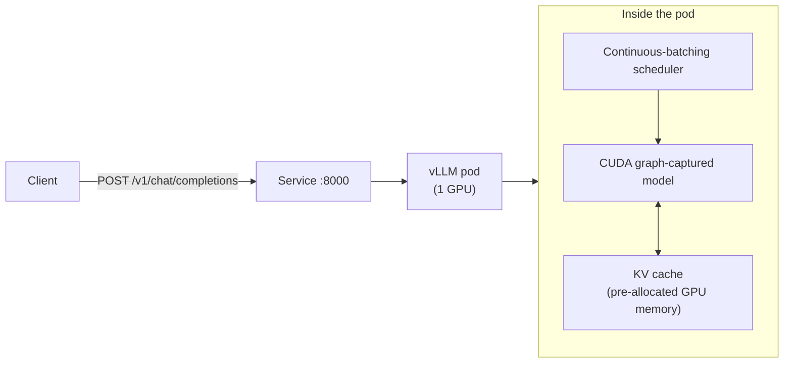

# 09 · LLM Inference with vLLM

> Serve an OpenAI-compatible LLM endpoint on Kubernetes with vLLM: probes that match a multi-minute
> weight-load, KV cache / GPU memory sizing, tensor parallelism, benchmarking, and a CPU fallback.

## Before you start

This chapter assumes:

- A spot GPU node pool from `01-gpu-nodes-and-scheduling` §4 (creates the `spot-gpu` managed node
  group and installs the pinned NVIDIA device plugin) — this chapter reuses that pool, it does not
  create its own.
- The NVIDIA GPU Operator or device plugin from `01`/`02` already installed on that pool.
- `env.sh` and `versions.env` sourced.
- No GPU? Skip straight to Step 5 (`cpu-lab/` with Ollama) — it needs only the base cluster from
  chapter `00`.

## 1. Why this matters

A vLLM pod is not "just another Deployment." It boots for minutes (not seconds), owns the *entire*
GPU's memory in one allocation (the KV cache), dies ungracefully if you send SIGTERM without a grace
period, and its "ready" signal has nothing to do with the container starting. Get the probes or the
memory math wrong and you get flapping pods, OOM-killed inference, or silent request drops during a
spot reclaim. This chapter builds one correct single-GPU deployment first, then scales it out
(tensor parallel) and stress-tests it (benchmark job), on EKS — plus a CPU-only Ollama lab so you
can learn the request/response shape before you have GPU quota.

## 2. Learning objectives and time plan (~3 h)

By the end you can:

1. Explain why vLLM's startup/readiness/liveness probes and `terminationGracePeriodSeconds` look
   nothing like a typical web app's, and size them correctly for a given model.
2. Explain KV cache and `--gpu-memory-utilization`: why vLLM pre-allocates (nearly) all free GPU
   memory instead of allocating per-request like a normal server.
3. Run vLLM on one spot GPU on your cloud, hit the OpenAI-compatible API, and read the startup logs.
4. Explain when tensor parallelism helps (model too big for one GPU) vs. when it doesn't (latency
   for a model that already fits), and run a 2-GPU tensor-parallel deployment.
5. Benchmark throughput/TTFT with `vllm bench serve` and read the report.
6. Run the same OpenAI-compatible contract on CPU with Ollama, and name exactly what does not carry
   over to real GPU serving.

| Time | Activity |
|---|---|
| 0:00–0:30 | Read section 3 (concepts): probes, KV cache, tensor parallel |
| 0:30–1:15 | Deploy vLLM on your cloud's spot GPU, watch startup logs, hit the API |
| 1:15–1:45 | Break the probes on purpose (see Troubleshooting), fix them |
| 1:45–2:15 | Tensor-parallel-2 component + benchmark job, read the report |
| 2:15–2:45 | `cpu-lab/` with Ollama — same OpenAI contract, no GPU |
| 2:45–3:00 | Checkpoint questions, cleanup |

## 3. Concepts

### 3.1 Request path



- **Continuous batching**: unlike a naive server that batches fixed-size groups of requests, vLLM's
  scheduler adds/removes sequences from the running batch every decode step — a new request doesn't
  wait for the current batch to finish.
- **PagedAttention / KV cache**: the KV cache (attention keys/values per token, per sequence) is
  allocated in fixed-size GPU-memory "pages," addressed like virtual memory, so sequences don't need
  a contiguous memory block and near-100% of a GPU's free memory can be used without fragmentation
  waste. This is *why* `--gpu-memory-utilization` exists: vLLM measures free GPU memory at startup
  and pre-allocates that fraction for weights + activations + the KV cache pool — it is not "used
  memory," it's reserved capacity for concurrent requests.

### 3.2 Why the probes look the way they do

| Probe | What it checks | Why it's shaped this way |
|---|---|---|
| `startupProbe` | `/health`, `failureThreshold: 60` × `periodSeconds: 10` = 10 min | Weight download (if not cached) + CUDA graph capture + KV cache allocation can take minutes; **liveness/readiness are suppressed until this passes**, so a slow-but-healthy boot is never killed |
| `readinessProbe` | `/health`, short interval | Once `/health` returns 200 the engine is serving; a `terminationGracePeriodSeconds`-aware `preStop` sleep gives load balancers time to stop routing before SIGTERM |
| `livenessProbe` | `/health`, longer `failureThreshold` | A genuinely hung engine (CUDA error, deadlocked scheduler) needs a restart — but do not make this trigger-happy, a busy batch can be slow to answer |
| `terminationGracePeriodSeconds: 25` + `--shutdown-timeout=10` | Grace period budget | Must be **≤ EC2's spot notice window (~2 min)** so vLLM's own graceful drain (`--shutdown-timeout`) finishes inside the grace period, not after the kubelet SIGKILLs it |

### 3.3 Tensor parallelism

Splits each layer's weight matrices across N GPUs on the **same node** (intra-node, needs fast
NVLink/PCIe — this repo does not cover multi-node TP; see `12-inference-gateway-and-multinode-serving`
for LeaderWorkerSet-based multi-node serving). Use it when the model doesn't fit one GPU's memory
(e.g. Qwen3-8B on a 16 GiB T4), not to speed up a model that already fits — TP adds NCCL
all-reduce latency per layer, so a model that already fits one GPU is usually *faster* on 1 GPU than
split across 2 (throughput can still improve at high concurrency, but latency does not).

## 4. Lab

```bash
cp env.sh.example env.sh   # if not already done
source env.sh && source versions.env
```

Prerequisite: a spot GPU node pool from `01-gpu-nodes-and-scheduling` §4 (the `spot-gpu` managed
node group + the pinned NVIDIA device plugin). This chapter reuses that nodegroup — it does not
create its own.

### Step 1: What's in `common/`

- `namespace.yaml` — `ch09-vllm`
- `vllm-deployment.yaml` — the single-GPU vLLM Deployment (`Qwen/Qwen3-0.6B`, `strategy: Recreate`
  because a 1-GPU pod pool can't run two copies during a rollout)
- `service.yaml`, `pdb.yaml`
- `components/tensor-parallel-2` — a Kustomize Component that swaps the model to `Qwen/Qwen3-8B` and
  requests 2 GPUs with `--tensor-parallel-size=2` (needs a 2-GPU node — see step 4)
- `components/model-cache-pvc` — swaps the emptyDir HF cache for a PVC so restarts don't re-download
  weights (see "Model cache" below)
- `create-hf-secret.sh` — creates the `hf-token` Secret from `$HF_TOKEN` (optional for the ungated
  Qwen3-0.6B model, but avoids anonymous rate limits, and is required once you point this at a
  gated model)
- `benchmark/benchmark-job.yaml` — `vllm bench serve` load test (runs on CPU, hits the Service)

### Step 2: Deploy (pick your cloud)

What you're about to do: create an optional HF token Secret (`Qwen/Qwen3-0.6B` is ungated so this
is optional for the base lab, but it's required once you swap in a gated model, and it silences
anonymous-download rate limits either way), then apply the `eks` overlay (1x L4/T4 spot node,
reusing the `spot-gpu` managed node group from chapter `01` — `nvidia.com/gpu.present=true` is set
at boot by `nodeadm` on the EKS AL2023 NVIDIA AMI) and watch the pod come up.

```bash
NAMESPACE=ch09-vllm
: "${HF_TOKEN:?export HF_TOKEN=hf_xxx, or skip — optional for the ungated Qwen3-0.6B}"
kubectl create namespace "$NAMESPACE" --dry-run=client -o yaml | kubectl apply -f -
kubectl create secret generic hf-token \
  --namespace "$NAMESPACE" \
  --from-literal=HF_TOKEN="$HF_TOKEN" \
  --dry-run=client -o yaml | kubectl apply -f -
```

```bash
kubectl apply -k 09-llm-inference-with-vllm/eks
```

```bash
kubectl -n ch09-vllm get pods -w
```

Expected (first boot, cold weight download — several minutes):
```
NAME                    READY   STATUS    RESTARTS
vllm-xxxxxxxxxx-yyyyy   0/1     Running   0
```
then `1/1 Running` once `/health` passes. Watch the logs for the key startup milestones:
```bash
kubectl -n ch09-vllm logs -f deploy/vllm | grep -Ei "gpu_memory_utilization|Available KV cache|Capturing CUDA|Started server"
```
Verify the OpenAI API:
```bash
kubectl -n ch09-vllm port-forward svc/vllm 8000:8000 &
curl -s http://localhost:8000/v1/models | jq
curl -s http://localhost:8000/v1/chat/completions -H 'Content-Type: application/json' -d \
  '{"model":"Qwen/Qwen3-0.6B","messages":[{"role":"user","content":"Say hi in 5 words"}]}' | jq
```

### Step 3: Benchmark

```bash
kubectl apply -k 09-llm-inference-with-vllm/common/benchmark
kubectl -n ch09-vllm logs -f job/vllm-bench
```
Expected (numbers vary by GPU/model):
```
============ Serving Benchmark Result ============
Successful requests:                    300
Request throughput (req/s):             X.XX
Output token throughput (tok/s):        XXX.XX
Mean TTFT (ms):                         XX.XX
Mean TPOT (ms):                         X.XX
====================================================
```
Re-run with `--max-concurrency` set to 1, 8, 32, 64 (edit `benchmark-job.yaml`) and compare TTFT vs.
throughput — this is the latency/throughput tradeoff continuous batching makes explicit.

### Step 4: Tensor parallelism (needs a 2-GPU node)

The reused single-GPU pool from chapter 01 only has 1 GPU per node. To try tensor-parallel-2 you need
a node with 2 GPUs (e.g. `g6.12xlarge`) — expensive, so this step is **optional/advanced**. Layer
the component on top of the overlay:
```yaml
# 09-llm-inference-with-vllm/eks/kustomization.yaml, temporarily:
components:
- ../common/components/tensor-parallel-2
```
then `kubectl kustomize eks` to confirm the patch, point the overlay's node selector at your 2-GPU
pool, and apply. Compare `vllm bench serve` throughput at concurrency 64 against the single-GPU run.

### Step 5: CPU lab (no GPU, any cluster)

```bash
kubectl apply -k 09-llm-inference-with-vllm/cpu-lab
kubectl -n ch09-vllm-cpu wait --for=condition=ready pod -l app.kubernetes.io/name=ollama --timeout=600s
kubectl -n ch09-vllm-cpu port-forward svc/ollama 11434:11434 &
curl -s http://localhost:11434/v1/chat/completions -H 'Content-Type: application/json' -d \
  '{"model":"qwen3:0.6b","messages":[{"role":"user","content":"Say hi in 5 words"}]}' | jq
```
**What carries over**: the OpenAI-compatible `/v1/chat/completions` contract, the idea of a
model-load startup delay, request/response shape for building clients against.
**What does not carry over**: throughput (CPU llama.cpp decoding is 10-100x slower per token than a
GPU), continuous batching under concurrent load, PagedAttention KV cache mechanics (Ollama uses
llama.cpp's own KV cache, not vLLM's), tensor parallelism, and GPU memory sizing math entirely.

### Model cache

By default the HF cache is an `emptyDir` — simple, but a rescheduled pod (spot reclaim!) re-downloads
weights. `components/model-cache-pvc` swaps it for a `ReadWriteOnce` PVC on the cluster's default
StorageClass, already wired into the `eks` overlay in this chapter. For a cache **shared**
across multiple vLLM replicas or nodes (ReadOnlyMany), reuse `05-model-storage-and-data`'s
GCS-FUSE / Mountpoint-S3 / Azure-Blob-CSI patterns instead — mount that PV in place of `hf-cache`.

## 5. Spot considerations

- **Cold start is the real cost, not preemption frequency.** A vLLM pod's `startupProbe` budget
  (10 min) exists *because* weight download + CUDA graph capture takes minutes — a spot reclaim
  mid-serving means the next pod pays that cost again unless the model cache PVC (or an image with
  baked-in weights) survives the reclaim.
- **`terminationGracePeriodSeconds: 25` is conservative relative to EC2's ~2 min spot notice
  window.** You can raise it and `--shutdown-timeout` together for a cleaner drain if you want more
  margin for in-flight requests to finish.
- **`replicas: 1` + `strategy: Recreate` means a preemption is a real outage**, not a rolling
  no-op — there's no second replica to absorb traffic. Chapter `10-autoscaling-inference` covers
  scaling replicas with HPA/KEDA; until then, expect single-replica downtime during reclaims.
- **PDB (`pdb.yaml`, `minAvailable: 1`) only blocks voluntary disruption** (node drain, cluster
  upgrade) — it cannot stop a spot reclaim, which is involuntary.

## 6. Troubleshooting

| Symptom | Cause | Fix |
|---|---|---|
| Pod stuck `0/1 Running`, no restarts, minutes pass | Normal — still inside `startupProbe` budget (weight download + KV cache alloc) | `kubectl logs`, watch for "Available KV cache memory" / "Started server" |
| Pod `CrashLoopBackOff` right after `Running` briefly | `livenessProbe` fired before boot finished — usually means `startupProbe` was removed/reduced | Keep the `startupProbe`; never rely on `initialDelaySeconds` alone for a multi-minute boot |
| `CUDA out of memory` at startup | `--gpu-memory-utilization` too high for the node, or another process holds GPU memory | Lower to `0.80–0.85`; check no leftover pod from a previous crash still holds the device |
| `ValueError: ... does not fit in ... GPU memory` | Model + `--max-model-len` KV cache needs more memory than available | Lower `--max-model-len`, `--max-num-seqs`, or use a smaller model/bigger GPU |
| 2-GPU TP pod `Pending`: `Insufficient nvidia.com/gpu` | Reused 1-GPU pool from chapter 01 only has 1 GPU/node | Provision a 2-GPU node type (step 4) |
| Requests time out under load, throughput plateaus | Expected — GPU compute/KV-cache-bound; not a bug | Benchmark at different `--max-concurrency`, see step 3 |
| `curl: /v1/chat/completions` 404 | Wrong path, or hit the CPU-lab Ollama Service instead of vLLM (or vice versa) — both listen OpenAI-style but on different ports/namespaces | vLLM: `ch09-vllm` svc `vllm:8000`; Ollama: `ch09-vllm-cpu` svc `ollama:11434` |
| Ollama pod never `Ready` | `ollama pull` still downloading Qwen3-0.6B GGUF (~523 MB) | `kubectl -n ch09-vllm-cpu logs deploy/ollama`; `startupProbe` allows 10 min |

## 7. Cleanup and cost notes

What you're about to do: remove this chapter's workloads. EKS does not autoscale to 0 by itself —
if no other chapter needs the GPU nodegroup, scale it down too (chapter `01` §4: `eksctl scale
nodegroup ... --nodes 0`).

```bash
kubectl delete -k 09-llm-inference-with-vllm/eks --ignore-not-found
kubectl delete -k 09-llm-inference-with-vllm/cpu-lab --ignore-not-found
```
- A single L4/T4 spot GPU running vLLM idle-but-loaded still bills for the whole node — this chapter
  does not scale to zero on its own (see `10-autoscaling-inference` for KEDA scale-to-zero).
- The GPU node pool/nodegroup is shared with chapter `01` — only scale it to 0 if you're done with
  GPU chapters for this session.
- The `hf-cache` PVC persists after `kubectl delete -k` only if you delete the Deployment/Service but
  not the PVC directly — delete it explicitly to stop paying for the disk: `kubectl -n ch09-vllm
  delete pvc hf-cache`.

## 8. Checkpoint questions

<details>
<summary>1. Why does vLLM's <code>startupProbe</code> get a 10-minute budget while <code>readinessProbe</code>'s interval is 5s?</summary>

Boot (weight download/load + CUDA graph capture + KV cache allocation) can genuinely take minutes and
must not be killed as "unhealthy" — `startupProbe` suppresses liveness/readiness checks until it
passes once. After that, `readinessProbe` just needs to detect quickly whether the already-running
engine is currently able to serve.
</details>

<details>
<summary>2. What does <code>--gpu-memory-utilization=0.90</code> actually reserve, and why doesn't lowering it just "save memory for other pods"?</summary>

It reserves ~90% of *free* GPU memory at startup for weights + activations + the KV cache page pool —
it is a one-time allocation for the life of the process, not elastic usage. Another pod requesting
`nvidia.com/gpu: 1` on the same GPU is blocked by the extended-resource scheduler anyway (1 GPU is
indivisible without MPS/MIG/time-slicing — see chapter 03), so lowering it mainly shrinks your own KV
cache (fewer concurrent sequences), not memory available to a neighbor.
</details>

<details>
<summary>3. Why is tensor-parallel-2 the wrong tool to make an already-fits-on-one-GPU model answer faster?</summary>

TP adds an NCCL all-reduce synchronization per layer across GPUs — pure communication overhead that a
single-GPU deployment doesn't pay. It helps when the model literally doesn't fit in one GPU's memory,
or at high concurrency where the extra compute throughput outweighs the added latency; it does not
reduce single-request latency for a model that already fits.
</details>

<details>
<summary>4. Why is <code>strategy: Recreate</code> used instead of <code>RollingUpdate</code> for the single-GPU Deployment?</summary>

With `replicas: 1` on a 1-GPU node pool, a rolling update would try to schedule the new pod (which
also requests `nvidia.com/gpu: 1`) before terminating the old one — there's no second GPU for it to
land on, so it would sit `Pending` forever. `Recreate` frees the GPU first.
</details>

<details>
<summary>5. <code>terminationGracePeriodSeconds: 25</code> and <code>--shutdown-timeout=10</code> — why two numbers, and why must the first be ≥ the second?</summary>

`terminationGracePeriodSeconds` is Kubernetes' budget before SIGKILL; `--shutdown-timeout` is vLLM's
own budget to finish in-flight requests after SIGTERM before it self-terminates. The Kubernetes grace
period must be large enough to contain vLLM's own drain *plus* the `preStop` sleep, or the kubelet
SIGKILLs the process mid-drain, dropping in-flight requests anyway.
</details>

<details>
<summary>6. A benchmark run shows throughput barely changes from <code>--max-concurrency=32</code> to <code>64</code>, but TTFT roughly doubles. What's happening?</summary>

The GPU (compute and/or KV-cache-page pool) is saturated at 32 concurrent sequences — the scheduler
is already batching as much useful work as the hardware supports, so adding more concurrent requests
just makes them wait longer in the continuous-batching queue rather than increasing completed
tokens/sec.
</details>

<details>
<summary>7. Why doesn't the CPU-lab Ollama deployment prove your vLLM YAML will work correctly on a GPU?</summary>

They serve a compatible *API contract* but completely different engines: Ollama uses llama.cpp's own
scheduler and KV cache, no PagedAttention, no continuous batching at vLLM's level, no tensor
parallelism, no CUDA graph capture, and no GPU memory pre-allocation. It validates client code and the
request/response shape, not vLLM's GPU-specific behavior or performance characteristics.
</details>

<details>
<summary>8. Why does <code>components/model-cache-pvc</code> use <code>ReadWriteOnce</code> instead of reusing chapter 05's <code>ReadOnlyMany</code> object-storage mount?</summary>

This chapter runs a single vLLM replica — a simple RWO PVC on the default StorageClass is enough to
survive that one pod's restarts and needs no cloud IAM setup. `ReadOnlyMany` object storage (GCS
FUSE / Mountpoint-S3 / Azure Blob CSI from chapter 05) only pays off once you have *multiple*
replicas/nodes that need to share one already-downloaded copy — worth adding once chapter 10 scales
this out.
</details>

## 9. Further reading and versions tested

- vLLM: [OpenAI-Compatible Server](https://docs.vllm.ai/en/latest/serving/openai_compatible_server.html), [Engine Args](https://docs.vllm.ai/en/latest/serving/engine_args.html), [Distributed Serving (Tensor Parallel)](https://docs.vllm.ai/en/latest/serving/distributed_serving.html)
- Ollama: [OpenAI compatibility](https://ollama.com/blog/openai-compatibility), [qwen3 library page](https://ollama.com/library/qwen3)
- Model: [Qwen/Qwen3-0.6B on Hugging Face](https://huggingface.co/Qwen/Qwen3-0.6B)
- Cross-link: `01-gpu-nodes-and-scheduling` (GPU node pool reused here), `05-model-storage-and-data` (shared model cache options), `10-autoscaling-inference` (HPA/KEDA scaling this Deployment), `12-inference-gateway-and-multinode-serving` (Gateway API Inference Extension, multi-node serving)

**Versions tested** (2026-09-16): Kubernetes 1.35, `VLLM_VERSION=v0.29.0` (image `vllm/vllm-openai:v0.29.0-cu129`),
`OLLAMA_VERSION=0.34.1` (image `ollama/ollama:0.34.1`), model `Qwen/Qwen3-0.6B` (vLLM) / `qwen3:0.6b` (Ollama library tag).
