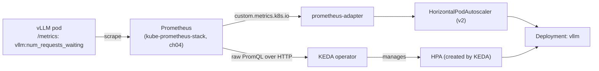

# 10 · Autoscaling Inference

> Scale vLLM by a metric that actually reflects load (queue depth, not CPU), two ways: HPA v2 via
> prometheus-adapter, and KEDA (which can scale to zero). Do the cold-start math before you trust
> either one on GPU capacity.

**New to Kubernetes autoscaling entirely?** Read section 3.0 first — it explains what a
HorizontalPodAutoscaler is, what KEDA adds on top of it, and what "scale to zero" actually means,
before you touch any YAML. Everything else in this chapter assumes you've read that primer.

## Before you start

This chapter assumes:

- Chapter `09-llm-inference-with-vllm`'s vLLM Deployment running (`ch09-vllm` namespace) on your
  cloud — this chapter scales it, it doesn't deploy vLLM itself.
- Chapter `04-gpu-observability`'s kube-prometheus-stack installed (namespace `monitoring`) — the
  metric source for both HPA and KEDA here.
- `env.sh` and `versions.env` sourced.
- No GPU? Step 4 (`cpu-lab/`) only needs chapter `09`'s CPU-lab Ollama Deployment.

If any of those are missing, stop and go do them first — every command below assumes vLLM and
Prometheus are already running and reachable in-cluster; none of this chapter installs them.

## 1. Why this matters

Autoscaling means "let Kubernetes add or remove replicas of a workload automatically, based on some
measurement of load, instead of a human watching a dashboard and typing `kubectl scale`." For a
normal web service, that measurement is usually CPU: busy CPU means busy service, add a pod. For a
GPU-bound inference server like vLLM, that assumption quietly breaks.

Here's why: vLLM's Python process spends almost all of its time waiting on the GPU to finish a batch
of token-generation work. The CPU core running that Python process is mostly idle — it hands work to
the GPU and waits — even while the GPU itself is 100% saturated processing dozens of concurrent
requests. So "container CPU utilization" for a fully-loaded vLLM pod can sit at 5-10%, the same
number you'd see on an idle pod. If you point a CPU-based HPA at this Deployment, it will never
trigger a scale-out no matter how backed up the request queue gets, because the one number it's
allowed to look at never moves.

Scaling on the wrong signal means either over-provisioning (GPUs sit idle, burning spot budget) or
under-provisioning (requests queue behind a full batch while a correct metric would have triggered a
new replica minutes ago). This chapter wires vLLM's own Prometheus metrics — specifically, "how many
requests are waiting in line to be processed" — into two different Kubernetes-native autoscaling
paths, and is explicit about what "scale to zero" actually costs in cold-start latency on this kind
of workload — a decision node autoscaling (chapter 13) makes looks free until you've measured it.

## 2. Learning objectives and time plan (~3 h)

By the end you can:

1. Explain why HPA v2 needs prometheus-adapter (custom.metrics.k8s.io) while KEDA does not.
2. Pick a metric for LLM-serving autoscaling and justify it over CPU/memory.
3. Configure and trigger a scale-out with both an HPA and a KEDA `ScaledObject` against the same
   Deployment (not simultaneously).
4. Configure KEDA scale-to-zero and estimate the resulting cold-start latency for your model/GPU.
5. Explain the interplay between pod-level autoscaling here and node-level autoscaling (chapter 13):
   why a HPA/KEDA scale-up can still leave a pod `Pending` for minutes.
6. Reproduce the same trigger-a-scale-out exercise on CPU with KEDA's `cpu` scaler.

| Time | Activity |
|---|---|
| 0:00–0:25 | Read section 3: what HPA/KEDA are, metrics, cold-start math |
| 0:25–1:00 | Install prometheus-adapter + KEDA, wire the ServiceMonitor |
| 1:00–1:40 | HPA v2 lab: load-generate, watch it scale out, read `kubectl describe hpa` |
| 1:40–2:15 | KEDA lab: scale-to-zero, load-generate again, measure cold start end-to-end |
| 2:15–2:45 | `cpu-lab/`: KEDA `cpu` trigger on Ollama, load-generate |
| 2:45–3:00 | Checkpoint questions, cleanup |

## 3. Concepts

### 3.0 First-time primer: HPA, KEDA, scale-to-zero, and custom metrics

Skip this subsection if you've already run a HorizontalPodAutoscaler off a custom metric before.
Otherwise, read it before 3.1 — the rest of the chapter uses these terms without re-explaining them.

**What a HorizontalPodAutoscaler (HPA) is.** It's a built-in Kubernetes controller (API group
`autoscaling/v2`) that watches one metric for a Deployment (or similar workload) and adjusts
`spec.replicas` to keep that metric near a target value you set. The classic example: "keep average
CPU utilization across all pods near 50%; if it climbs, add pods; if it falls, remove pods." The HPA
itself doesn't create pods directly — it edits the Deployment's replica count, and the Deployment
controller does the rest. It re-checks its metric on a fixed loop (default every 15s) and only acts
after the metric has stayed above/below target for a configurable "stabilization window," so a single
noisy spike doesn't cause a scale event.

**Why plain CPU-based HPA fails for GPU/LLM workloads.** An HPA can only scale on metrics it can see,
and out of the box it only sees CPU and memory (from `metrics-server`) — numbers measured on the
*container*, at the *OS* level. As explained in section 1, a vLLM container's CPU stays low
regardless of GPU load, because the actual work happens on the GPU device, which the container's CPU
metrics know nothing about. `nvidia.com/gpu` utilization isn't even something a plain HPA can read at
all without extra plumbing (DCGM exporter + adapter). Even if it could, raw GPU utilization percent
answers "is the GPU busy," not "is work piling up faster than the GPU can drain it" — the thing you
actually want to react to. That's why this chapter uses a request-queue-depth metric instead (section
3.2) and why getting that metric into the HPA at all requires an extra piece — prometheus-adapter,
next.

**What a "custom metric" is, and why prometheus-adapter exists.** The HPA controller only understands
metrics reachable through one of three Kubernetes metrics APIs: `metrics.k8s.io` (CPU/memory, from
metrics-server), `custom.metrics.k8s.io` (any other per-pod/per-object metric), and
`external.metrics.k8s.io` (metrics with no Kubernetes object attached at all, e.g. an SQS queue
length). vLLM exposes queue depth as a Prometheus metric on its own `/metrics` HTTP endpoint —
Prometheus can scrape and store it, but the HPA controller cannot query Prometheus directly; it only
knows how to call the `custom.metrics.k8s.io` Kubernetes API. **prometheus-adapter** is the bridge: it
runs as its own pod, translates a PromQL query you configure into that API on request, and the HPA
controller calls it exactly like it would call metrics-server for CPU. This chapter's
`values-prometheus-adapter.yaml` is that translation rule, written once, for one specific metric.

**What KEDA is, and how a `ScaledObject` works.** KEDA (Kubernetes Event-Driven Autoscaling) is a
separate operator you install via Helm that adds a new CRD, `ScaledObject`, plus 50+ built-in
"scalers" (Prometheus, CPU, SQS, Kafka lag, cron schedule, and more). You point a `ScaledObject` at a
Deployment and give it one or more triggers; KEDA polls each trigger's data source on its own schedule
(`pollingInterval`) — for a `prometheus` trigger, that means KEDA runs a PromQL query against
Prometheus itself, no adapter or translation layer needed. The key architectural difference from a
plain HPA: **above** a `minReplicaCount` you set, KEDA creates and owns a completely normal HPA object
for you (so above that point it behaves exactly like the HPA v2 lab in Step 2) — but **at or below**
that threshold, including the 0-to-1 transition, KEDA edits the Deployment's replica count directly,
bypassing the HPA entirely. That distinction matters because of the next point.

**What "scale to zero" means, and why it's tricky.** A plain Kubernetes HPA cannot represent "0
replicas" — its underlying algorithm computes `desiredReplicas = ceil(currentReplicas *
(currentMetric / targetMetric))`, which is undefined once `currentReplicas` is 0 (there's nothing to
measure a ratio against, and the API rejects `minReplicas: 0` outright). KEDA works around this by
stepping outside the HPA algorithm below its threshold and just directly setting `replicas: 0` on the
Deployment when there's no real traffic, then directly setting it back to 1+ once traffic reappears —
only handing control back to a real HPA once above `minReplicaCount`. That sounds like free money
(zero GPU pods running, zero GPU cost, while nobody's using the model) — and for bursty/dev traffic it
often is. The catch: scaling a stateless web pod from 0 typically takes a couple of seconds. Scaling a
GPU inference pod from 0 can take *minutes* — a new GPU node may need to be provisioned, the container
image pulled, the model's weights downloaded/loaded onto the GPU, and CUDA state initialized — all of
which is idle time the very first caller after the idle period has to sit through with no response.
Section 3.3 breaks that budget down in detail; read it before you decide `minReplicaCount: 0` is the
right call for your traffic pattern.

**What a Prometheus-based custom metric is, and how KEDA reads it, concretely.** "Custom metric" just
means "a metric that isn't CPU or memory, that something other than metrics-server is the source of
truth for." Here, vLLM's own process exposes a `/metrics` HTTP endpoint (Prometheus exposition
format) with a gauge called `vllm:num_requests_waiting`. Two different consumers read this same
underlying data two different ways in this chapter:
- **prometheus-adapter** (for the HPA path) is configured with a `seriesQuery` that matches
  `vllm:num_requests_waiting{...}` and re-exposes it, renamed, as `vllm_num_requests_waiting` on the
  `custom.metrics.k8s.io` API — the HPA then polls *that* API, never touching Prometheus itself.
- **KEDA** (for the `ScaledObject` path) is configured with a raw PromQL `query` string
  (`sum(vllm:num_requests_waiting{namespace="ch09-vllm"})`) and a Prometheus server address, and it
  runs that query against Prometheus directly on every `pollingInterval` tick — no adapter, no
  Kubernetes metrics API involved at all.

Both roads start at the exact same number scraped off the exact same vLLM pod; they just reach the
autoscaler through different plumbing, which is the whole point of comparing them side by side in
this lab.

### 3.1 Two autoscaling paths, one metric source



Read this diagram left to right, as a pipeline, if you've never seen a metrics-driven autoscaling
setup before:

1. **Leftmost box (`VLLM`)**: the vLLM Pod is already running (from chapter 09) and, independent of
   this chapter's work, exposes an HTTP endpoint at `/metrics` with plain-text numbers, including the
   queue-depth gauge this chapter cares about. It doesn't push this data anywhere — something else has
   to come and scrape it.
2. **First arrow, "scrape"**: Prometheus (installed in chapter 04, already running in the `monitoring`
   namespace) is told, via the `ServiceMonitor` you apply in Step 1, to periodically (every 15s) make
   an HTTP GET to that vLLM pod's `/metrics` path and store whatever numbers come back, with a
   timestamp, in its own time-series database. From this point on, the *current* queue depth lives in
   Prometheus, not in vLLM directly — anything downstream queries Prometheus, not the pod.
3. **The diagram forks into two independent, parallel paths from `PROM`** — this is the "two
   autoscaling paths, one metric source" of the section title. Nothing here is sequential; you choose
   one path or the other per lab step, never both against the same Deployment at once (section 6
   explains why running both simultaneously would fight over the replica count).
   - **Top path (`PA` → `HPA`)**: prometheus-adapter continuously translates the raw Prometheus data
     into the Kubernetes `custom.metrics.k8s.io` API. The `HorizontalPodAutoscaler` object never talks
     to Prometheus — it only ever calls that Kubernetes API, the same way it would call
     metrics-server for CPU. This is "the native Kubernetes way," at the cost of an extra
     translation layer (prometheus-adapter) that has to be configured with the right PromQL rule.
   - **Bottom path (`KEDA`  → `HPA2`)**: the KEDA operator queries Prometheus directly over HTTP with
     its own PromQL string, no Kubernetes metrics API involved. Once the target Deployment needs more
     than `minReplicaCount` replicas, KEDA creates and manages an ordinary `HPA` object on your behalf
     (`HPA2` in the diagram) to handle everything above that floor — which is why `HPA2` feeds into
     `DEPLOY` exactly the same way the hand-written `HPA` does.
4. **Both paths converge on `DEPLOY`**: whichever route got there, the *only* thing being changed is
   `spec.replicas` on the same `vllm` Deployment (already running from chapter 09). Autoscaling never
   creates a new kind of object to hold your Pods — it just changes how many copies of the existing
   Deployment's Pod template are running.

The practical takeaway: everything downstream of Prometheus is replaceable/comparable (that's exactly
what Steps 2 and 3 let you do — same metric, two different autoscaling engines), but everything
upstream of Prometheus (the vLLM pod exposing `/metrics`, and the `ServiceMonitor` scraping it) is
shared infrastructure you only set up once, in Step 1.

- **HPA v2 + prometheus-adapter**: prometheus-adapter translates a PromQL rule into the
  `custom.metrics.k8s.io` API the HPA controller polls. Native Kubernetes object, but **cannot scale
  to 0** (`minReplicas` must be ≥ 1) and needs prometheus-adapter's rule-authoring YAML (fragile,
  regex-based series matching).
- **KEDA**: a CRD (`ScaledObject`) with built-in scalers (`prometheus`, `cpu`, `cron`, 50+ more) that
  query the source directly — no adapter/rule translation layer. Above `minReplicaCount` it creates
  and manages a normal HPA for you; **below** it (including to/from 0) it scales the Deployment
  directly, because HPAs cannot represent "0 replicas."

### 3.2 Which metric

| Metric | Good for | Bad because |
|---|---|---|
| `cpu`/`memory` (Resource) | CPU-bound services | A GPU-bound vLLM pod's CPU barely reflects load |
| `vllm:num_requests_waiting` (this chapter) | Queue pressure — pending work the current batch hasn't started yet | Needs vLLM's `/metrics` scraped; a brief spike is normal, don't react to noise (see `stabilizationWindowSeconds`) |
| `vllm:kv_cache_usage_perc` | "Are we close to OOM/max concurrency" | Alone it's a saturation signal, not throughput — pair with waiting-requests for a complete picture |
| Request rate / RPS at the gateway | Simple, cloud-native (e.g. GAIE's `InferencePool`, chapter 12) | Doesn't distinguish light vs. heavy requests (256 vs 8192 tokens) the way queue depth does |

This chapter uses `vllm:num_requests_waiting` (via the `ServiceMonitor` in `common/`) as the single
signal for both the HPA and the KEDA `ScaledObject`, exposed as a Pods-type custom metric
(`vllm_num_requests_waiting`) for the HPA and queried directly by KEDA's `prometheus` trigger.

In plain terms: `num_requests_waiting` is vLLM counting, at any instant, how many incoming requests
have arrived but haven't yet been picked up into a running batch on the GPU. Zero means the server is
keeping up; a number that keeps climbing over consecutive scrapes means requests are arriving faster
than the current replica(s) can drain them — exactly the moment you want a new replica to start
booting, even though a new replica won't be *ready* to help for a while (section 3.3).

### 3.3 Cold-start math

Scaling a GPU inference pod from 0 (or from N to N+1 on a spot pool that also needs a new **node**)
is not like scaling a stateless web pod. Rough budget, from chapter 09's numbers:

```
node provision (if pool is scaled to 0)  : 1–8 min   (cloud/instance-type dependent, see ch13)
image pull (if not cached on the node)   : 10 s – 2 min
container start + driver/device ready    : a few sec
model weight load (HF cache miss)        : 10 s – 2 min  (Qwen3-0.6B, larger for bigger models)
CUDA graph capture + KV cache alloc      : 10–60 s
                                            ------------------------
best case (warm node, cached weights)    : ~30–60 s
worst case (cold node, cold cache)       : 5–12 min
```

Walking through why each line exists, since none of this is Kubernetes-specific behavior: **node
provisioning** only applies if the GPU node pool itself is also at 0 nodes (common when you've also
scaled the nodegroup down for cost, chapter 13) — the cloud has to launch a fresh EC2 instance, which
takes minutes, before Kubernetes can even schedule a pod onto it. **Image pull** is the container
runtime downloading the vLLM image layers to that node if they aren't already cached there — a fresh
node has nothing cached. **Container start** is fast once the image is local — this is ordinary pod
startup. **Model weight load** is vLLM reading the model's weight files (from local disk if cached, or
downloading from Hugging Face otherwise) into GPU memory — this scales with model size and is the
second-biggest variable after node provisioning. **CUDA graph capture** is vLLM's own warmup step,
pre-compiling execution graphs for common batch shapes before it will accept real traffic — you can't
skip it and get correct behavior.

A KEDA `ScaledObject` with `minReplicaCount: 0` means **every** request after an idle period pays
some slice of this budget — there is no request queue holding the caller's connection open while the
pod boots (that's what KEDA's separate HTTP add-on does, out of scope here). For a latency-sensitive
API, `minReplicaCount: 1` (never truly idle, just autoscale the rest) is usually the right trade;
scale-to-zero is for genuinely bursty/dev/batch-adjacent traffic where an occasional 5+ minute first
request is acceptable. This is why `activationThreshold`, `cooldownPeriod`, and the scale-down
`stabilizationWindowSeconds` in `common/keda/scaledobject-vllm.yaml` are all tuned conservatively —
flapping between 0 and 1 replicas is far more expensive here than on a typical microservice.

## 4. Lab

```bash
cp env.sh.example env.sh   # if not already done
source env.sh && source versions.env
```

Why: `env.sh` holds your AWS account/region, and `versions.env` pins the exact chart versions
(`PROMETHEUS_ADAPTER_VERSION`, `KEDA_VERSION`) every `helm upgrade --install` below references — this
makes the commands copy-pasteable without you having to know or guess a version number.

Prereqs: chapter `09` vLLM Deployment running (`ch09-vllm` namespace) on your cloud, and chapter `04`
kube-prometheus-stack installed (namespace `monitoring`).

### Step 1: Install prometheus-adapter and KEDA, wire the ServiceMonitor

What you're about to do: install prometheus-adapter (exposes vLLM's queue-depth metric as a
`custom.metrics.k8s.io` series, feeding the HPA in `common/hpa`) and KEDA (queries Prometheus
directly, feeding the `ScaledObject` in `common/keda`) — prereq: chapter `04`'s
kube-prometheus-stack already running in-cluster (namespace `monitoring`) — then apply the
`ServiceMonitor` that tells Prometheus to scrape vLLM's `/metrics`.

```bash
helm repo add prometheus-community https://prometheus-community.github.io/helm-charts --force-update
helm repo update prometheus-community

helm upgrade --install prometheus-adapter prometheus-community/prometheus-adapter \
  --namespace monitoring --create-namespace \
  --version "${PROMETHEUS_ADAPTER_VERSION}" \
  -f 10-autoscaling-inference/common/values-prometheus-adapter.yaml \
  --wait --timeout 5m

kubectl get apiservice v1beta1.custom.metrics.k8s.io
```

Why each piece: `helm repo add`/`update` register and refresh the chart source so Helm can resolve the
pinned `--version` (skip this and Helm may install whatever it last cached, silently drifting from
`versions.env`). `--namespace monitoring --create-namespace` puts prometheus-adapter alongside chapter
04's Prometheus rather than the default namespace — it's part of the same observability stack.
`-f values-prometheus-adapter.yaml` is the translation rule from section 3.0 — without it,
prometheus-adapter runs but exposes no useful metrics at all, since it has no default opinion on which
Prometheus series to turn into Kubernetes custom metrics. `--wait --timeout 5m` makes Helm block until
the pod is actually Ready instead of returning immediately after the API objects are created, so the
next command isn't racing a pod that hasn't started yet. The final `kubectl get apiservice` call checks
that Kubernetes itself has registered and can reach the new `custom.metrics.k8s.io` endpoint — this is
a different check from "is the pod Running"; an `APIService` can exist and still be `False`
(`Available`) if the adapter pod is crash-looping or unreachable.

KEDA talks to Prometheus over HTTP directly, so it needs no cloud-specific values:
```bash
helm repo add kedacore https://kedacore.github.io/charts --force-update
helm repo update kedacore

helm upgrade --install keda kedacore/keda \
  --namespace keda --create-namespace \
  --version "${KEDA_VERSION}" \
  --wait --timeout 5m

kubectl -n keda get pods
```

Why KEDA gets its own namespace and no `-f values.yaml`: unlike prometheus-adapter, KEDA doesn't need
to be told which Prometheus series to expose ahead of time — that configuration lives per-`ScaledObject`
(you'll write the PromQL query directly into `scaledobject-vllm.yaml` in Step 3), so the Helm install
itself is generic and identical across clouds. `kubectl -n keda get pods` is a plain readiness check —
you're looking for the `keda-operator` and `keda-operator-metrics-apiserver` pods both `Running`
before moving on, since a `ScaledObject` applied against a not-yet-ready operator just sits inert.

Apply the `ServiceMonitor` (this overlay's only resource):
```bash
kubectl apply -k 10-autoscaling-inference/eks
```

Why this is a kustomize overlay and not a bare `kubectl apply -f`: it follows this repo's convention
(CONVENTIONS.md) of always applying through the `eks/` overlay so cloud-specific patches (none needed
here, but the pattern stays consistent) have a place to live. Under the hood this simply creates the
`ServiceMonitor` object from `common/servicemonitor-vllm.yaml`, which is a Custom Resource understood
by the Prometheus Operator (installed in chapter 04) — it tells that already-running Prometheus "go
scrape this additional target," it does not itself run any scraping.

Verify:
```bash
kubectl -n ch09-vllm get servicemonitor vllm
kubectl get --raw '/apis/custom.metrics.k8s.io/v1beta1/namespaces/ch09-vllm/pods/*/vllm_num_requests_waiting' | jq
kubectl -n keda get pods
```
How to tell this worked: the custom-metrics `get --raw` call returns a JSON body (not a 404/empty
`items: []`) once at least one request has hit vLLM, and `kubectl -n keda get pods` shows
`keda-operator` `Running`. If you run the `get --raw` call before *any* request has ever reached vLLM,
expect an empty `items: []` — Prometheus only has a time series for a metric once it has been scraped
at least once with a non-null value, and vLLM's own metrics library often only emits certain gauges
after the first request. That's normal at this point in the lab; you'll generate real traffic in Step
2.

### Step 2: HPA v2 lab

```bash
kubectl apply -k 10-autoscaling-inference/common/hpa
kubectl -n ch09-vllm get hpa vllm --watch &
kubectl apply -k 10-autoscaling-inference/common/load-generator
```

Why in this order: applying the `HorizontalPodAutoscaler` first means it's already watching (even with
no load yet, it'll just report the metric as `<unknown>` or `0`) before you generate traffic, so you
don't miss the transition from idle to scaling. Backgrounding the `--watch` with `&` lets you keep
issuing commands in the same terminal while it streams updates — it will keep printing new lines as
the HPA re-evaluates, which is exactly what you want to see live. The `load-generator` Job (see
`common/load-generator/load-job.yaml`) runs vLLM's own benchmark client, sending sustained concurrent
chat-completion requests at the Deployment so `num_requests_waiting` climbs — without it, there's no
load, and the HPA would sit at its idle replica count indefinitely.

Expected: `kubectl -n ch09-vllm describe hpa vllm` shows the current metric value climbing above the
`averageValue: "5"` target, then `Replicas` increasing (bounded by `maxReplicas: 4` and — on the
single-GPU node pool reused from chapter 09/01 — by GPU node availability; see Troubleshooting).
```bash
kubectl delete -k 10-autoscaling-inference/common/hpa
kubectl -n ch10-load delete job load-generator
```

Why delete the HPA before moving to Step 3 rather than leaving it applied: a KEDA `ScaledObject`
against the same Deployment would create a second HPA-equivalent controlling the exact same
`spec.replicas` field — two controllers racing to set the same number is the "don't layer them"
warning in sections 5/6, so this lab always tears one path down before standing the other up. Deleting
the finished `load-generator` Job just cleans up the completed Pod/Job object; it doesn't stop any
traffic that's already been sent (the benchmark run finishes on its own once `--num-prompts` requests
complete or you delete it early).

### Step 3: KEDA scale-to-zero lab

```bash
kubectl apply -k 10-autoscaling-inference/common/keda
kubectl -n ch09-vllm get scaledobject vllm
# after cooldownPeriod (300s) with no traffic, the Deployment scales to 0:
kubectl -n ch09-vllm get deploy vllm -w
```

Why you'll likely watch it scale to 0 almost immediately: `common/keda/scaledobject-vllm.yaml` sets
`minReplicaCount: 0`, and if there's no load running (you deleted the load-generator Job at the end of
Step 2), the Prometheus query will read at or near zero, which is below `activationThreshold: "0.5"` —
so KEDA treats this as "no real traffic" and scales the Deployment down to 0 once `cooldownPeriod`
(300s) has elapsed with the metric that low. This is expected and is the behavior the rest of this
step measures, not a bug.

Expected once idle: `vllm   0/0     0            0`. Now trigger from zero and time it:
```bash
date; kubectl apply -k 10-autoscaling-inference/common/load-generator
kubectl -n ch09-vllm get pods -w   # note the timestamp the first vllm pod goes Running
```

Why the `date` command matters here: it's your stopwatch start — the whole point of this step is to
measure real elapsed wall-clock time from "traffic starts arriving" to "a vLLM pod is actually
`Running` and serving," so you can compare it against the cold-start budget in section 3.3 rather than
just taking that table's numbers on faith. Watching `get pods -w` (not `get deploy -w`) shows you the
individual pod's lifecycle (`Pending` → `ContainerCreating` → `Running`) rather than just the aggregate
replica count, which is more informative for spotting exactly where time is going (e.g. stuck in
`Pending` means you're waiting on a node, per section 5).

Compare the elapsed time against section 3.3's estimate. Cleanup:
```bash
kubectl -n ch10-load delete job load-generator
kubectl delete -k 10-autoscaling-inference/common/keda
```

Why delete the `ScaledObject` here rather than leaving it running for the rest of the chapter: it's the
same "don't run two autoscalers on one Deployment" reasoning as Step 2, in reverse, and it also avoids
KEDA silently scaling `vllm` back to 0 while you're doing something else with it later in the course.
(Section 7 has an important note about KEDA's finalizer — delete the `ScaledObject` before ever
uninstalling KEDA itself, not just at the end of this step.)

### Step 4: CPU lab (no GPU)

```bash
kubectl apply -k 09-llm-inference-with-vllm/cpu-lab   # if not already running
kubectl apply -k 10-autoscaling-inference/cpu-lab
kubectl -n ch09-vllm-cpu get scaledobject,hpa,pods -w
```

Why this exists as a separate lab rather than just "do the GPU lab on CPU": it demonstrates KEDA's
built-in `cpu` scaler (`cpu-lab/scaledobject-ollama.yaml`) against Ollama, chapter 09's CPU-only
serving stand-in — this is the one case in the whole chapter where plain resource-based autoscaling
*is* the right signal, because Ollama-on-CPU genuinely is CPU-bound, unlike vLLM-on-GPU. It's a useful
contrast: same KEDA operator, same `ScaledObject` CRD, completely different trigger type, and (per
section 3.1/3.3) a trigger that structurally cannot scale to 0 on its own. `get scaledobject,hpa,pods
-w` in one command watches all three object types at once so you can see the `ScaledObject` existing,
the HPA KEDA created for it, and the resulting pod count change together, rather than needing three
terminals.

Watch the KEDA-managed HPA's `TARGET` column climb as the load Job runs, and `ollama` replicas scale
from 1 toward 3, then back down after `cooldownPeriod`. This trigger **cannot** go to 0 — see 3.1/3.3
and the manifest's comments.

## 5. Spot considerations

- **Autoscaling and node autoscaling are two different loops that must agree.** A HPA/KEDA scale-up
  to 4 replicas on a GPU node pool with `max-nodes` lower than 4 (or spot capacity unavailable in
  your zone) leaves pods `Pending` — the pod-level decision was correct, the cluster just doesn't
  have the node capacity yet. Chapter 13 covers tuning the node autoscaler to match.
- **Scale-to-zero interacts badly with spot capacity churn.** If the node pool ALSO scales to 0 when
  idle (chapter 01/09's pools do), a KEDA scale-from-zero pays node provisioning time on top of the
  cold-start budget above — the two "zeros" stack.
- **Conservative scale-down windows are a spot-safety measure here, not just a UX choice**: scaling a
  GPU replica down right before a burst returns means immediately re-paying the cold start, which is
  far more costly than briefly over-provisioning one idle GPU pod.
- **GPU quota is a hard ceiling autoscaling can't see past.** `maxReplicas: 4` / `maxReplicaCount: 4`
  in this chapter's manifests are safety caps you chose, but your AWS account's GPU instance quota
  (or your spot nodegroup's `--nodes-max`) is a separate, harder ceiling — the HPA/KEDA will happily
  keep asking for more replicas than either allows; the pods just stay `Pending` forever until you
  raise one of those limits or the load subsides. Always know both numbers before running the load
  generator against a shared/quota-constrained account.

## 6. Troubleshooting

| Symptom | Cause | Fix |
|---|---|---|
| `kubectl get hpa` shows `<unknown>/5` for TARGET | prometheus-adapter isn't serving the metric yet, or no vLLM traffic has happened so the series doesn't exist. This happens because the HPA controller can only display a value it successfully fetched from `custom.metrics.k8s.io` on its last poll — if that API call 404s or the series is empty, it has nothing to show but `<unknown>`, which looks alarming but usually just means "no data yet," not "broken." | `kubectl get --raw '/apis/custom.metrics.k8s.io/v1beta1/...'`; generate at least one request first |
| `apiservice v1beta1.custom.metrics.k8s.io` not Available | prometheus-adapter pod not Ready, or wrong `prometheus.url` in values. An `APIService` object is just a pointer Kubernetes uses to forward `custom.metrics.k8s.io` calls to the adapter's Service — if the adapter pod behind it isn't answering (crashed, still starting, or pointed at a Prometheus URL that doesn't resolve), the pointer itself gets marked `Available: False` even though the object exists. | `kubectl -n monitoring logs deploy/prometheus-adapter`; confirm `kube-prometheus-stack-prometheus` Service name/namespace |
| KEDA `ScaledObject` stuck, no HPA created | KEDA operator not installed/Ready, or `scaleTargetRef.name` typo. Remember from 3.0 that KEDA only creates its managed HPA once the object is validated and its trigger is reachable — a typo'd Deployment name or an operator that never finished starting means KEDA has nothing to attach an HPA to, so none appears, silently. | `kubectl -n keda get pods`; `kubectl describe scaledobject vllm -n ch09-vllm` |
| Scaled-up replica sits `Pending` | Node pool at its max, or spot capacity unavailable in zone. This is the "two loops" problem from section 5/3.1 checkpoint question 3: the HPA/KEDA decision to add a replica was correct, but the *separate* node-level autoscaler either hasn't finished provisioning a node yet or has hit its own ceiling — from the pod-level autoscaler's point of view, both look identical ("still Pending"), so you have to check the node side yourself. | Check `kubectl describe pod`; raise the nodegroup's `--nodes-max`, or scale up the on-demand fallback nodegroup from chapter `01` §4 (`INCLUDE=ondemand-gpu`) |
| Deployment never scales to 0 | Traffic never actually stops (health checks, benchmark job still running), or `activationThreshold` too low. Liveness/readiness probes hitting the pod, or a load Job you forgot to delete, both keep `num_requests_waiting` or request volume just barely nonzero — enough to stay above `activationThreshold` forever, which from KEDA's point of view is indistinguishable from real traffic. | `kubectl -n ch09-vllm top pod`; confirm no leftover load Job |
| `cpu` trigger in cpu-lab never fires | Ollama pod's `resources.requests.cpu` not set, or load Job undersized. KEDA's `cpu` scaler (like a plain HPA) computes utilization as *actual usage* divided by the pod's `resources.requests.cpu` — if requests aren't set, that denominator is undefined and there's nothing to compute a percentage against, so the trigger just never reports a meaningful value. | Check `patch-ollama-resources.yaml` applied; scale up `load-job.yaml` iteration count |
| Everything scales, but requests still time out during scale-up | Expected under a hard load spike — the cold-start budget (3.3) is real time, not a bug. Neither HPA nor KEDA holds a caller's request open while a new pod boots (that requires KEDA's separate HTTP add-on, out of scope here) — a request that lands exactly when the old replicas are already saturated and the new one isn't ready yet will simply time out or queue at the client, which is the concrete cost of the "worst case" row in section 3.3's table. | Consider `minReplicaCount: 1` for latency-sensitive traffic |

## 7. Cleanup and cost notes

What you're about to do: remove this chapter's autoscaling objects and the prometheus-adapter/KEDA
releases. Leaves chapter 09's vLLM Deployment and chapter 04's kube-prometheus-stack in place —
they belong to those chapters. Delete the `ScaledObject` **before** uninstalling KEDA — KEDA puts a
finalizer on it, and with the operator gone the object sits in `Terminating`:

```bash
kubectl delete -k 10-autoscaling-inference/common/keda --ignore-not-found
kubectl delete -k 10-autoscaling-inference/common/hpa --ignore-not-found
kubectl delete -k 10-autoscaling-inference/common/load-generator --ignore-not-found
kubectl delete -k 10-autoscaling-inference/eks --ignore-not-found   # ServiceMonitor
# cpu-lab only — NOTE: this overlay includes 09's cpu-lab as a base, so it also deletes the Ollama
# Deployment from chapter 09's cpu-lab. Re-apply 09-llm-inference-with-vllm/cpu-lab if you still need it.
kubectl delete -k 10-autoscaling-inference/cpu-lab --ignore-not-found

# Uninstall the Helm releases only if they're present (another chapter may already have removed them):
if helm status prometheus-adapter -n monitoring > /dev/null 2>&1; then
  helm uninstall prometheus-adapter -n monitoring
fi
if helm status keda -n keda > /dev/null 2>&1; then
  helm uninstall keda -n keda
fi
kubectl delete namespace keda --ignore-not-found
```

Why the ordering matters, spelled out: a `ScaledObject`'s finalizer is a piece of metadata KEDA's
operator adds that tells Kubernetes "don't actually finish deleting this object until I (the operator)
say it's safe" — it's how KEDA guarantees it gets a chance to clean up (e.g. hand control of
`spec.replicas` back to a plain Deployment) before the object disappears. If you `helm uninstall keda`
first, the operator that would process that finalizer is gone, and the `ScaledObject` is stuck
`Terminating` forever until you manually strip the finalizer — deleting it first, while the operator
can still see it, avoids that entirely. `--ignore-not-found` on every `kubectl delete` makes each line
safe to re-run if you're not sure what's already been cleaned up (a plain `kubectl delete` on a
missing object exits non-zero and would otherwise stop a copy-pasted script partway through). The
`if helm status ... > /dev/null 2>&1` guards likewise make the Helm uninstalls idempotent: `helm
uninstall` on a release that isn't installed errors out, so this checks first rather than assuming it
was your session that installed it.

EKS does not scale the GPU nodegroup to 0 by itself — if no other chapter needs it, scale it down
too (chapter `01` §4: `eksctl scale nodegroup ... --nodes 0`).
- If KEDA had scaled vLLM to 0 when you deleted the `ScaledObject`, the Deployment stays at 0 —
  `kubectl -n ch09-vllm scale deploy vllm --replicas=1` to bring it back for later chapters.
- prometheus-adapter and KEDA themselves are cheap (small CPU-only pods); the cost driver is however
  many GPU replicas autoscaling brings up — `maxReplicaCount`/`maxReplicas: 4` here is a safety cap,
  lower it if you're cost-conscious.
- Don't leave the KEDA `ScaledObject` and a plain HPA applied to the same Deployment at once — they
  fight over the replica count. This chapter's labs delete one before applying the other.
- **GPU nodes are the expensive line item in this entire chapter, not the autoscalers themselves** —
  double-check `kubectl get nodes -l <your GPU node label>` and the nodegroup's desired/min/max sizes
  after cleanup, since a `Pending` scale-up you forgot about (section 6) can otherwise leave a spot GPU
  node running with nothing useful on it.

## 8. Checkpoint questions

<details>
<summary>1. Why can't a plain HPA v2 scale a Deployment to 0 replicas, and how does KEDA get around it?</summary>

`autoscaling/v2` HorizontalPodAutoscaler requires `minReplicas >= 1` by API validation — there's no
representation of "0" in the HPA algorithm (it computes a ratio against current replicas, which
breaks at 0). KEDA sidesteps this by managing the Deployment's replica count directly below its own
`minReplicaCount` threshold (including the 0↔1 transition) and only handing off to a real HPA object
once above that threshold.
</details>

<details>
<summary>2. Why is <code>vllm:num_requests_waiting</code> a better autoscaling signal than CPU for this Deployment?</summary>

vLLM is GPU-bound: the engine can be fully saturated (batching as many sequences as the KV cache
allows) while the container's CPU usage stays low, since the heavy compute happens on the GPU.
`num_requests_waiting` directly measures queued work the current batch hasn't picked up yet — the
actual thing you want to relieve by adding a replica.
</details>

<details>
<summary>3. What two separate autoscaling loops does a GPU scale-out event depend on, and why can both be individually "correct" while a pod still sits Pending?</summary>

Pod-level (HPA/KEDA, this chapter) and node-level (cluster autoscaler/Karpenter/NAP, chapter 13). The
HPA correctly decides "add a replica," the pod is correctly scheduled requesting `nvidia.com/gpu: 1`
— but if the GPU node pool has no spare capacity and is itself scaling up (or is capped, or spot
capacity is unavailable in the zone), the pod is `Pending` until a node actually appears. Neither
loop is wrong; they're just sequential and have very different latencies.
</details>

<details>
<summary>4. In the cold-start budget (3.3), which stage differs the most between a "warm" and "cold" scale-up, and why does that matter for choosing <code>minReplicaCount</code>?</summary>

Node provisioning — seconds (already-running node picks up the pod) vs. minutes (a brand-new spot
node must be provisioned, boot, and get its driver ready). It dominates the total, which is why
scale-to-zero (`minReplicaCount: 0`, this chapter's KEDA lab) is only safe for traffic that can
tolerate an occasional multi-minute first response; `minReplicaCount: 1` avoids ever hitting that
worst case, at the cost of one GPU always running.
</details>

<details>
<summary>5. Why does <code>common/keda/scaledobject-vllm.yaml</code> set <code>activationThreshold: "0.5"</code> in addition to <code>threshold: "5"</code>?</summary>

`threshold` is the target the HPA-equivalent math scales toward (more replicas as the value exceeds
it). `activationThreshold` is a separate floor: below it, KEDA treats the workload as having "no
real traffic" and lets it scale to 0 rather than keeping 1 replica alive forever on a metric result
that's technically nonzero (rounding noise, a stray health check) but not meaningful traffic.
</details>

<details>
<summary>6. Why can't the KEDA <code>cpu</code> scaler in cpu-lab scale Ollama to 0 replicas on its own?</summary>

Resource metrics (`cpu`/`memory`) are computed as a ratio against currently-running pods' actual
usage — with 0 replicas there is nothing to measure, so KEDA has no signal to decide when to scale
back up from 0. KEDA requires pairing a resource scaler with at least one non-resource trigger
(Prometheus, cron, etc., like the vLLM `ScaledObject` in this same chapter) to support scale-to-zero.
</details>

<details>
<summary>7. Why does <code>common/keda/scaledobject-vllm.yaml</code>'s scale-down <code>stabilizationWindowSeconds</code> (300s) intentionally differ from a typical web-service HPA's default (0-30s)?</summary>

Scaling a GPU replica down and then immediately needing it again means fully re-paying the cold-start
budget from 3.3 — for this workload, a slower, more conservative scale-down (tolerate a short burst
of low traffic before removing capacity) is cheaper overall than reacting quickly and flapping.
</details>

<details>
<summary>8. Why does this chapter apply the HPA and the KEDA ScaledObject as mutually exclusive steps rather than layering them?</summary>

Both ultimately try to control `spec.replicas` on the same Deployment (KEDA does so by creating and
owning its own HPA object). Running a hand-written HPA and a KEDA-managed one against the same
`scaleTargetRef` at once means two controllers racing to set the replica count — the lab deletes one
before applying the other to keep the scaling decision unambiguous.
</details>

## 9. Further reading and versions tested

- Kubernetes: [Horizontal Pod Autoscaling](https://kubernetes.io/docs/tasks/run-application/horizontal-pod-autoscale/), [HPA walkthrough with custom metrics](https://kubernetes.io/docs/tasks/run-application/horizontal-pod-autoscale-walkthrough/)
- [prometheus-adapter](https://github.com/kubernetes-sigs/prometheus-adapter), [Helm chart](https://github.com/prometheus-community/helm-charts/tree/main/charts/prometheus-adapter)
- KEDA: [prometheus scaler](https://keda.sh/docs/2.20/scalers/prometheus/), [cpu scaler](https://keda.sh/docs/2.20/scalers/cpu/), [ScaledObject spec](https://keda.sh/docs/2.20/concepts/scaling-deployments/)
- vLLM: [Production Metrics](https://docs.vllm.ai/en/latest/usage/metrics.html)
- [Amazon Managed Service for Prometheus](https://docs.aws.amazon.com/prometheus/latest/userguide/what-is-Amazon-Managed-Service-Prometheus.html) (metrics source alternative to in-cluster kube-prometheus-stack — not wired into this chapter's lab, see `common/values-prometheus-adapter.yaml` comment)
- Cross-link: `04-gpu-observability` (the Prometheus this chapter scrapes into), `09-llm-inference-with-vllm` (the Deployment being scaled), `12-inference-gateway-and-multinode-serving` (InferencePool-aware routing/autoscaling), `13-node-autoscaling-and-cost` (the node-level loop this chapter's pod-level loop depends on)

**Versions tested** (2026-09-16): Kubernetes 1.35, `PROMETHEUS_ADAPTER_VERSION=5.3.0`, `KEDA_VERSION=2.20.2`,
`KUBE_PROMETHEUS_STACK_VERSION=91.4.1` (from chapter 04).
