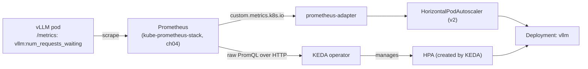

# 10 · Autoscaling Inference

> Scale vLLM by a metric that actually reflects load (queue depth, not CPU), two ways: HPA v2 via
> prometheus-adapter, and KEDA (which can scale to zero). Do the cold-start math before you trust
> either one on GPU capacity.

## 1. Why this matters

`cpu` utilization is meaningless for a GPU-bound inference server — the container's CPU barely moves
while the GPU is saturated. Scaling on the wrong signal means either over-provisioning (GPUs sit idle,
burning spot budget) or under-provisioning (requests queue behind a full batch while a correct metric
would have triggered a new replica minutes ago). This chapter wires vLLM's own Prometheus metrics into
two different Kubernetes-native autoscaling paths, and is explicit about what "scale to zero" actually
costs in cold-start latency on this kind of workload — a decision node autoscaling (chapter 13) makes
looks free until you've measured it.

## 2. Learning objectives and time plan (~3 h)

By the end you can:

1. Explain why HPA v2 needs prometheus-adapter (custom.metrics.k8s.io) while KEDA does not.
2. Pick a metric for LLM-serving autoscaling and justify it over CPU/memory.
3. Configure and trigger a scale-out with both an HPA and a KEDA `ScaledObject` against the same
   Deployment (not simultaneously).
4. Configure KEDA scale-to-zero and estimate the resulting cold-start latency for your model/GPU.
5. Explain the interplay between pod-level autoscaling here and node-level autoscaling (chapter 13):
   why a HPA/KEDA scale-up can still leave a pod `Pending` for minutes.
6. Reproduce the same trigger-a-scale-out exercise on CPU with KEDA's `cpu` scaler.

| Time | Activity |
|---|---|
| 0:00–0:25 | Read section 3: metrics, HPA vs KEDA, cold-start math |
| 0:25–1:00 | Install prometheus-adapter + KEDA, wire the ServiceMonitor |
| 1:00–1:40 | HPA v2 lab: load-generate, watch it scale out, read `kubectl describe hpa` |
| 1:40–2:15 | KEDA lab: scale-to-zero, load-generate again, measure cold start end-to-end |
| 2:15–2:45 | `cpu-lab/`: KEDA `cpu` trigger on Ollama, load-generate |
| 2:45–3:00 | Checkpoint questions, cleanup |

## 3. Concepts

### 3.1 Two autoscaling paths, one metric source



- **HPA v2 + prometheus-adapter**: prometheus-adapter translates a PromQL rule into the
  `custom.metrics.k8s.io` API the HPA controller polls. Native Kubernetes object, but **cannot scale
  to 0** (`minReplicas` must be ≥ 1) and needs prometheus-adapter's rule-authoring YAML (fragile,
  regex-based series matching).
- **KEDA**: a CRD (`ScaledObject`) with built-in scalers (`prometheus`, `cpu`, `cron`, 50+ more) that
  query the source directly — no adapter/rule translation layer. Above `minReplicaCount` it creates
  and manages a normal HPA for you; **below** it (including to/from 0) it scales the Deployment
  directly, because HPAs cannot represent "0 replicas."

### 3.2 Which metric

| Metric | Good for | Bad because |
|---|---|---|
| `cpu`/`memory` (Resource) | CPU-bound services | A GPU-bound vLLM pod's CPU barely reflects load |
| `vllm:num_requests_waiting` (this chapter) | Queue pressure — pending work the current batch hasn't started yet | Needs vLLM's `/metrics` scraped; a brief spike is normal, don't react to noise (see `stabilizationWindowSeconds`) |
| `vllm:kv_cache_usage_perc` | "Are we close to OOM/max concurrency" | Alone it's a saturation signal, not throughput — pair with waiting-requests for a complete picture |
| Request rate / RPS at the gateway | Simple, cloud-native (e.g. GAIE's `InferencePool`, chapter 12) | Doesn't distinguish light vs. heavy requests (256 vs 8192 tokens) the way queue depth does |

This chapter uses `vllm:num_requests_waiting` (via the `ServiceMonitor` in `common/`) as the single
signal for both the HPA and the KEDA `ScaledObject`, exposed as a Pods-type custom metric
(`vllm_num_requests_waiting`) for the HPA and queried directly by KEDA's `prometheus` trigger.

### 3.3 Cold-start math

Scaling a GPU inference pod from 0 (or from N to N+1 on a spot pool that also needs a new **node**)
is not like scaling a stateless web pod. Rough budget, from chapter 09's numbers:

```
node provision (if pool is scaled to 0)  : 1–8 min   (cloud/instance-type dependent, see ch13)
image pull (if not cached on the node)   : 10 s – 2 min
container start + driver/device ready    : a few sec
model weight load (HF cache miss)        : 10 s – 2 min  (Qwen3-0.6B, larger for bigger models)
CUDA graph capture + KV cache alloc      : 10–60 s
                                            ------------------------
best case (warm node, cached weights)    : ~30–60 s
worst case (cold node, cold cache)       : 5–12 min
```

A KEDA `ScaledObject` with `minReplicaCount: 0` means **every** request after an idle period pays
some slice of this budget — there is no request queue holding the caller's connection open while the
pod boots (that's what KEDA's separate HTTP add-on does, out of scope here). For a latency-sensitive
API, `minReplicaCount: 1` (never truly idle, just autoscale the rest) is usually the right trade;
scale-to-zero is for genuinely bursty/dev/batch-adjacent traffic where an occasional 5+ minute first
request is acceptable. This is why `activationThreshold`, `cooldownPeriod`, and the scale-down
`stabilizationWindowSeconds` in `common/keda/scaledobject-vllm.yaml` are all tuned conservatively —
flapping between 0 and 1 replicas is far more expensive here than on a typical microservice.

## 4. Lab

```bash
cp env.sh.example env.sh   # if not already done
source env.sh && source versions.env
```

Prereqs: chapter `09` vLLM Deployment running (`ch09-vllm` namespace) on your cloud, and chapter `04`
kube-prometheus-stack installed (namespace `monitoring`).

### Step 1: Install prometheus-adapter and KEDA, wire the ServiceMonitor

```bash
./10-autoscaling-inference/<gke|eks|aks>/install-prometheus-adapter.sh
./10-autoscaling-inference/<gke|eks|aks>/install-keda.sh
kubectl apply -k 10-autoscaling-inference/<gke|eks|aks>   # ServiceMonitor only
```
Verify:
```bash
kubectl -n ch09-vllm get servicemonitor vllm
kubectl get --raw '/apis/custom.metrics.k8s.io/v1beta1/namespaces/ch09-vllm/pods/*/vllm_num_requests_waiting' | jq
kubectl -n keda get pods
```

### Step 2: HPA v2 lab

```bash
kubectl apply -k 10-autoscaling-inference/common/hpa
kubectl -n ch09-vllm get hpa vllm --watch &
kubectl apply -k 10-autoscaling-inference/common/load-generator
```
Expected: `kubectl -n ch09-vllm describe hpa vllm` shows the current metric value climbing above the
`averageValue: "5"` target, then `Replicas` increasing (bounded by `maxReplicas: 4` and — on the
single-GPU node pool reused from chapter 09/01 — by GPU node availability; see Troubleshooting).
```bash
kubectl delete -k 10-autoscaling-inference/common/hpa
kubectl -n ch10-load delete job load-generator
```

### Step 3: KEDA scale-to-zero lab

```bash
kubectl apply -k 10-autoscaling-inference/common/keda
kubectl -n ch09-vllm get scaledobject vllm
# after cooldownPeriod (300s) with no traffic, the Deployment scales to 0:
kubectl -n ch09-vllm get deploy vllm -w
```
Expected once idle: `vllm   0/0     0            0`. Now trigger from zero and time it:
```bash
date; kubectl apply -k 10-autoscaling-inference/common/load-generator
kubectl -n ch09-vllm get pods -w   # note the timestamp the first vllm pod goes Running
```
Compare the elapsed time against section 3.3's estimate. Cleanup:
```bash
kubectl -n ch10-load delete job load-generator
kubectl delete -k 10-autoscaling-inference/common/keda
```

### Step 4: CPU lab (no GPU)

```bash
kubectl apply -k 09-llm-inference-with-vllm/cpu-lab   # if not already running
kubectl apply -k 10-autoscaling-inference/cpu-lab
kubectl -n ch09-vllm-cpu get scaledobject,hpa,pods -w
```
Watch the KEDA-managed HPA's `TARGET` column climb as the load Job runs, and `ollama` replicas scale
from 1 toward 3, then back down after `cooldownPeriod`. This trigger **cannot** go to 0 — see 3.1/3.3
and the manifest's comments.

## 5. Spot considerations

- **Autoscaling and node autoscaling are two different loops that must agree.** A HPA/KEDA scale-up
  to 4 replicas on a GPU node pool with `max-nodes` lower than 4 (or spot capacity unavailable in
  your zone) leaves pods `Pending` — the pod-level decision was correct, the cluster just doesn't
  have the node capacity yet. Chapter 13 covers tuning the node autoscaler to match.
- **Scale-to-zero interacts badly with spot capacity churn.** If the node pool ALSO scales to 0 when
  idle (chapter 01/09's pools do), a KEDA scale-from-zero pays node provisioning time on top of the
  cold-start budget above — the two "zeros" stack.
- **Conservative scale-down windows are a spot-safety measure here, not just a UX choice**: scaling a
  GPU replica down right before a burst returns means immediately re-paying the cold start, which is
  far more costly than briefly over-provisioning one idle GPU pod.

## 6. Troubleshooting

| Symptom | Cause | Fix |
|---|---|---|
| `kubectl get hpa` shows `<unknown>/5` for TARGET | prometheus-adapter isn't serving the metric yet, or no vLLM traffic has happened so the series doesn't exist | `kubectl get --raw '/apis/custom.metrics.k8s.io/v1beta1/...'`; generate at least one request first |
| `apiservice v1beta1.custom.metrics.k8s.io` not Available | prometheus-adapter pod not Ready, or wrong `prometheus.url` in values | `kubectl -n monitoring logs deploy/prometheus-adapter`; confirm `kube-prometheus-stack-prometheus` Service name/namespace |
| KEDA `ScaledObject` stuck, no HPA created | KEDA operator not installed/Ready, or `scaleTargetRef.name` typo | `kubectl -n keda get pods`; `kubectl describe scaledobject vllm -n ch09-vllm` |
| Scaled-up replica sits `Pending` | Node pool at its max, or spot capacity unavailable in zone | Check `kubectl describe pod`; raise node pool `max-nodes` or fall back to on-demand (chapter 09/01 `ON_DEMAND=true`) |
| Deployment never scales to 0 | Traffic never actually stops (health checks, benchmark job still running), or `activationThreshold` too low | `kubectl -n ch09-vllm top pod`; confirm no leftover load Job |
| `cpu` trigger in cpu-lab never fires | Ollama pod's `resources.requests.cpu` not set, or load Job undersized | Check `patch-ollama-resources.yaml` applied; scale up `load-job.yaml` iteration count |
| Everything scales, but requests still time out during scale-up | Expected under a hard load spike — the cold-start budget (3.3) is real time, not a bug | Consider `minReplicaCount: 1` for latency-sensitive traffic |

## 7. Cleanup and cost notes

```bash
kubectl delete -k 10-autoscaling-inference/common/hpa --ignore-not-found
kubectl delete -k 10-autoscaling-inference/common/keda --ignore-not-found
kubectl delete -k 10-autoscaling-inference/common/load-generator --ignore-not-found
kubectl delete -k 10-autoscaling-inference/cpu-lab --ignore-not-found
helm -n monitoring uninstall prometheus-adapter
helm -n keda uninstall keda
```
- prometheus-adapter and KEDA themselves are cheap (small CPU-only pods); the cost driver is however
  many GPU replicas autoscaling brings up — `maxReplicaCount`/`maxReplicas: 4` here is a safety cap,
  lower it if you're cost-conscious.
- Don't leave the KEDA `ScaledObject` and a plain HPA applied to the same Deployment at once — they
  fight over the replica count. This chapter's labs delete one before applying the other.

## 8. Checkpoint questions

<details>
<summary>1. Why can't a plain HPA v2 scale a Deployment to 0 replicas, and how does KEDA get around it?</summary>

`autoscaling/v2` HorizontalPodAutoscaler requires `minReplicas >= 1` by API validation — there's no
representation of "0" in the HPA algorithm (it computes a ratio against current replicas, which
breaks at 0). KEDA sidesteps this by managing the Deployment's replica count directly below its own
`minReplicaCount` threshold (including the 0↔1 transition) and only handing off to a real HPA object
once above that threshold.
</details>

<details>
<summary>2. Why is <code>vllm:num_requests_waiting</code> a better autoscaling signal than CPU for this Deployment?</summary>

vLLM is GPU-bound: the engine can be fully saturated (batching as many sequences as the KV cache
allows) while the container's CPU usage stays low, since the heavy compute happens on the GPU.
`num_requests_waiting` directly measures queued work the current batch hasn't picked up yet — the
actual thing you want to relieve by adding a replica.
</details>

<details>
<summary>3. What two separate autoscaling loops does a GPU scale-out event depend on, and why can both be individually "correct" while a pod still sits Pending?</summary>

Pod-level (HPA/KEDA, this chapter) and node-level (cluster autoscaler/Karpenter/NAP, chapter 13). The
HPA correctly decides "add a replica," the pod is correctly scheduled requesting `nvidia.com/gpu: 1`
— but if the GPU node pool has no spare capacity and is itself scaling up (or is capped, or spot
capacity is unavailable in the zone), the pod is `Pending` until a node actually appears. Neither
loop is wrong; they're just sequential and have very different latencies.
</details>

<details>
<summary>4. In the cold-start budget (3.3), which stage differs the most between a "warm" and "cold" scale-up, and why does that matter for choosing <code>minReplicaCount</code>?</summary>

Node provisioning — seconds (already-running node picks up the pod) vs. minutes (a brand-new spot
node must be provisioned, boot, and get its driver ready). It dominates the total, which is why
scale-to-zero (`minReplicaCount: 0`, this chapter's KEDA lab) is only safe for traffic that can
tolerate an occasional multi-minute first response; `minReplicaCount: 1` avoids ever hitting that
worst case, at the cost of one GPU always running.
</details>

<details>
<summary>5. Why does <code>common/keda/scaledobject-vllm.yaml</code> set <code>activationThreshold: "0.5"</code> in addition to <code>threshold: "5"</code>?</summary>

`threshold` is the target the HPA-equivalent math scales toward (more replicas as the value exceeds
it). `activationThreshold` is a separate floor: below it, KEDA treats the workload as having "no
real traffic" and lets it scale to 0 rather than keeping 1 replica alive forever on a metric result
that's technically nonzero (rounding noise, a stray health check) but not meaningful traffic.
</details>

<details>
<summary>6. Why can't the KEDA <code>cpu</code> scaler in cpu-lab scale Ollama to 0 replicas on its own?</summary>

Resource metrics (`cpu`/`memory`) are computed as a ratio against currently-running pods' actual
usage — with 0 replicas there is nothing to measure, so KEDA has no signal to decide when to scale
back up from 0. KEDA requires pairing a resource scaler with at least one non-resource trigger
(Prometheus, cron, etc., like the vLLM `ScaledObject` in this same chapter) to support scale-to-zero.
</details>

<details>
<summary>7. Why does <code>common/keda/scaledobject-vllm.yaml</code>'s scale-down <code>stabilizationWindowSeconds</code> (300s) intentionally differ from a typical web-service HPA's default (0-30s)?</summary>

Scaling a GPU replica down and then immediately needing it again means fully re-paying the cold-start
budget from 3.3 — for this workload, a slower, more conservative scale-down (tolerate a short burst
of low traffic before removing capacity) is cheaper overall than reacting quickly and flapping.
</details>

<details>
<summary>8. Why does this chapter apply the HPA and the KEDA ScaledObject as mutually exclusive steps rather than layering them?</summary>

Both ultimately try to control `spec.replicas` on the same Deployment (KEDA does so by creating and
owning its own HPA object). Running a hand-written HPA and a KEDA-managed one against the same
`scaleTargetRef` at once means two controllers racing to set the replica count — the lab deletes one
before applying the other to keep the scaling decision unambiguous.
</details>

## 9. Further reading and versions tested

- Kubernetes: [Horizontal Pod Autoscaling](https://kubernetes.io/docs/tasks/run-application/horizontal-pod-autoscale/), [HPA walkthrough with custom metrics](https://kubernetes.io/docs/tasks/run-application/horizontal-pod-autoscale-walkthrough/)
- [prometheus-adapter](https://github.com/kubernetes-sigs/prometheus-adapter), [Helm chart](https://github.com/prometheus-community/helm-charts/tree/main/charts/prometheus-adapter)
- KEDA: [prometheus scaler](https://keda.sh/docs/2.20/scalers/prometheus/), [cpu scaler](https://keda.sh/docs/2.20/scalers/cpu/), [ScaledObject spec](https://keda.sh/docs/2.20/concepts/scaling-deployments/)
- vLLM: [Production Metrics](https://docs.vllm.ai/en/latest/usage/metrics.html)
- Managed Prometheus per cloud (metrics source alternative to in-cluster kube-prometheus-stack — not wired into this chapter's lab, see `common/values-prometheus-adapter.yaml` comment): [Google Managed Prometheus](https://cloud.google.com/stackdriver/docs/managed-prometheus), [Amazon Managed Service for Prometheus](https://docs.aws.amazon.com/prometheus/latest/userguide/what-is-Amazon-Managed-Service-Prometheus.html), [Azure Monitor managed service for Prometheus](https://learn.microsoft.com/azure/azure-monitor/essentials/prometheus-metrics-overview)
- Cross-link: `04-gpu-observability` (the Prometheus this chapter scrapes into), `09-llm-inference-with-vllm` (the Deployment being scaled), `12-inference-gateway-and-multinode-serving` (InferencePool-aware routing/autoscaling), `13-node-autoscaling-and-cost` (the node-level loop this chapter's pod-level loop depends on)

**Versions tested** (2026-09-16): Kubernetes 1.35, `PROMETHEUS_ADAPTER_VERSION=5.3.0`, `KEDA_VERSION=2.20.2`,
`KUBE_PROMETHEUS_STACK_VERSION=91.4.1` (from chapter 04).
