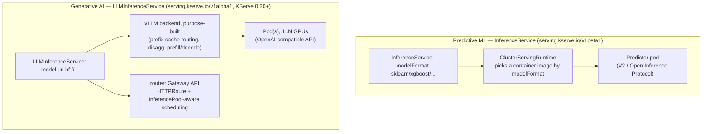

# 11 · KServe

> A model-serving control plane on top of what chapters 09-10 built by hand: `InferenceService` for
> CPU predictive models, the new `LLMInferenceService` CRD for GPU generative models with a vLLM
> backend, RawDeployment mode (no Knative dependency), and canary rollouts.

## 0. Before you start

This chapter assumes:

- A cluster from `00-prerequisites-and-cluster-setup`. Step 2 (predictive models) is CPU-only and
  works on any cluster (`cpu-lab/` is the same overlay, cloud-agnostic).
- Step 3 (generative model) needs the spot GPU node pool from `01-gpu-nodes-and-scheduling` /
  `09-llm-inference-with-vllm` — this chapter reuses it, it does not create its own.
- Step 4's optional native-Serverless canary demo needs Knative Serving installed separately (not
  provisioned by this course); the RawDeployment workaround (default path) needs nothing extra.
- `env.sh` and `versions.env` sourced.

> **New to Kubernetes and to GPU/AI infrastructure?** Read this note before you type anything. Every
> chapter before this one had you write the Kubernetes objects yourself: a `Deployment` (the thing
> that keeps N copies of your container running), a `Service` (a stable network name in front of
> those copies), maybe an `HPA`/KEDA object (scales replica count up/down). That's the *general
> purpose* way to run anything on Kubernetes — a web server, a batch job, a model server, doesn't
> matter, Kubernetes doesn't know or care what's inside the container. KServe is different: it's a
> **model-serving platform** — software that sits on top of Kubernetes and knows specifically about
> serving ML/AI models. Instead of you writing a `Deployment` + `Service` + probes + autoscaling
> policy by hand every single time you have a new model, you write one much smaller YAML file (an
> `InferenceService`) that just says "here is my model, here is its format, here is where the model
> file lives" — and KServe generates all the Kubernetes plumbing underneath for you. Section 1 below
> explains *why* that matters in practice; section 3 explains the concepts (runtimes, deployment
> modes, canary) before you touch a command.

## 1. Why this matters

Chapters 09-10 hand-wrote a Deployment, Service, probes, HPA/KEDA — correct, but every team doing
this ends up re-inventing the same YAML for every new model. KServe standardizes that into one CRD
per model (`InferenceService`), a pluggable **runtime** per model format (sklearn, xgboost, a
HuggingFace/vLLM runtime for LLMs), and now — as of KServe 0.20 — a purpose-built
`LLMInferenceService` CRD for generative models specifically (prefix-cache-aware routing,
disaggregated prefill/decode, multi-node tensor parallelism via LeaderWorkerSet). This chapter is
intentionally narrow: one CPU predictive model, one GPU LLM, and what canary rollout does and
doesn't give you depending on deployment mode.

### 1.1 What a model-serving platform adds on top of a raw Deployment

If you only ever write a plain `Deployment`, here is what you are responsible for by hand, every
time, for every model:

| Concern | Chapters 09-10 (hand-built) | KServe (this chapter) |
|---|---|---|
| Container image | You pick/build one that loads the model and exposes an HTTP endpoint | A `ClusterServingRuntime` picks the right pre-built image for you based on `modelFormat` |
| Downloading the model into the pod | You write an init container or bake the model into the image | KServe injects a **storage-initializer** init container automatically from `storageUri` |
| Readiness/liveness probes | You write them | The runtime ships sane defaults for its protocol |
| A stable network name | You write a `Service` | KServe generates one (e.g. `sklearn-iris-predictor`) |
| Scaling | You write an `HPA`/KEDA object | Same knobs, but KServe wires the `Deployment` it manages to them — see `minReplicas`/`maxReplicas` on `spec.predictor` (not used in this chapter's fixed-size example, but that's the knob) |
| Splitting traffic between "the old model" and "the new model" | You'd hand-roll two Deployments + a Service/Ingress split yourself | A dedicated concept: **canary rollout** (see 3.3) — native in one deployment mode, a documented workaround in the other |
| Different model "shapes" (just a predictor vs. predictor + a pre/post-processing step vs. predictor + an explainability sidecar) | You'd wire up separate Deployments and a chain of Services by hand | `InferenceService` has three optional named components — **predictor** (required, runs the model), **transformer** (optional, pre/post-processes requests — e.g. turning a JPEG into the tensor the model expects), **explainer** (optional, answers "why did the model predict this?") — not exercised in this chapter's examples, but it's the shape KServe standardizes toward |

In short: KServe doesn't do anything a `Deployment` couldn't eventually do — it just gives every
model the *same* CRD, the *same* rollout/scaling knobs, and the *same* traffic-splitting concept,
instead of every team reinventing slightly different YAML per model.

### 1.2 Predictive ML vs. generative LLM serving — two different jobs

This chapter deploys two very different kinds of "model" and it matters that you can tell them apart:

- **Predictive ML** (this chapter's sklearn/xgboost Iris examples): a small model that takes a fixed
  shape of numeric input (four flower measurements) and returns a small, fast, deterministic-ish
  output (a class label + probabilities). Inference takes milliseconds, needs no GPU, and the whole
  model file might be a few hundred KB. This is what most "classic ML" in production looks like:
  fraud scoring, churn prediction, recommendation ranking, etc.
- **Generative LLM serving** (this chapter's Qwen3-0.6B example): a multi-hundred-MB-to-many-GB
  transformer model that takes a text prompt and *generates* a sequence of tokens one at a time,
  needs a GPU to be fast, needs specialized serving software (vLLM — chapter 09 built this by hand)
  for batching/paged-attention/KV-cache management, and exposes an OpenAI-style chat API rather than
  a fixed-shape tensor API.

KServe reflects that split at the API level: predictive models use the mature, general-purpose
`InferenceService` CRD (works for *any* model format with a runtime, including LLMs via a plain
HuggingFace runtime); generative models get a purpose-built `LLMInferenceService` CRD (alpha, KServe
0.20+) that bakes in vLLM and LLM-specific routing concerns. Section 3.1 has the full comparison
table.

## 2. Learning objectives and time plan (~3 h)

By the end you can:

1. Explain what a KServe **runtime** is and why `modelFormat: sklearn` is enough to get a full
   serving container without writing one.
2. Deploy a CPU predictive `InferenceService` (sklearn, xgboost) in RawDeployment mode.
3. Explain RawDeployment vs. Serverless deployment mode and why this chapter defaults to
   RawDeployment.
4. Deploy a GPU `LLMInferenceService` backed by vLLM and hit its OpenAI-compatible endpoint.
5. Explain why `canaryTrafficPercent` doesn't work in RawDeployment mode, and what the workaround
   costs you.
6. Compare what KServe gives you "for free" against chapters 09-10's hand-built version, and name
   what you'd still have to build yourself (chapter 12's Gateway API Inference Extension: smart,
   load-aware routing across replicas).

| Time | Activity |
|---|---|
| 0:00–0:30 | Read section 3: runtimes, deployment modes, `LLMInferenceService` vs. `InferenceService` |
| 0:30–1:15 | Install KServe, deploy the sklearn/xgboost predictive models, hit the V2 inference API |
| 1:15–2:00 | Deploy the GPU `LLMInferenceService`, hit the OpenAI-compatible endpoint |
| 2:00–2:40 | Canary lab: try native `canaryTrafficPercent` (Serverless) vs. the RawDeployment workaround |
| 2:40–3:00 | Checkpoint questions, cleanup |

## 3. Concepts

### 3.1 Runtimes and the two serving CRDs



**Reading this diagram if you're new to it:** each box is either a Kubernetes object you create/that
gets created for you (`InferenceService`, `ClusterServingRuntime`, a pod), or a piece of software
running inside a pod (the vLLM backend). An arrow means "this creates/configures/talks to that."
Follow the top path first: you write an `InferenceService` YAML file with `modelFormat: sklearn` (you
never touch `ClusterServingRuntime` or the pod directly) → KServe's controller looks up the
cluster-wide `ClusterServingRuntime` registered for `sklearn` → that runtime tells KServe which
container image to run → KServe creates a `Deployment` whose pod runs that image and serves the V2
protocol. You only ever author the top box; everything below it is generated. The bottom path is the
same idea for LLMs, except the "runtime" is baked into `LLMInferenceService` itself (it always means
"use vLLM"), and instead of a plain Service, KServe also asks Gateway API for a `router` (an
`HTTPRoute` + an `InferencePool`-aware scheduler, covered properly in chapter 12) so requests can
eventually be load-balanced across more than one replica in an LLM-aware way (e.g. routing a request
to whichever replica already has that prompt's prefix cached).

| | `InferenceService` (v1beta1) | `LLMInferenceService` (v1alpha1) |
|---|---|---|
| Since | Original KServe API, stable | KServe 0.17+, **alpha** in 0.20.0 |
| Built for | Predictive ML (classification/regression/etc.) — also usable for LLMs via the HuggingFace runtime | Generative AI specifically |
| Routing | Kubernetes Service, or Knative (Serverless mode) | Gateway API-native (`router.gateway`/`route`/`scheduler`) |
| This chapter | `common/predictive` — sklearn, xgboost | `common/generative` — Qwen3-0.6B on vLLM |

This chapter deliberately uses **both** CRDs so you can see the split: predictive workloads stay on
the mature, stable `InferenceService`; the new LLM-specific path is `LLMInferenceService`. Because
it's alpha, every field here is marked `# VERIFY` in the manifest — expect this API to change before
KServe reaches a GA generative-AI CRD.

### 3.2 Deployment modes

**In plain terms:** `LLMInferenceService`/`InferenceService` don't run your model directly — KServe
has to pick *how* to turn your one YAML file into running pods and a way to reach them. There are two
such strategies, called "deployment modes," and they produce genuinely different underlying
Kubernetes objects:

- **RawDeployment** — KServe creates the same kind of objects you'd have written by hand in chapters
  09-10: a plain `Deployment` and a plain `Service`. Nothing new to install, nothing new to learn
  operationally — if you know how to debug a `Deployment`, you know how to debug this.
- **Serverless** — KServe instead creates a Knative `Service`/`Revision`. Knative is a separate,
  optional Kubernetes add-on (not installed by this course) that adds request-based autoscaling —
  including scaling a workload down to **zero pods** when there's no traffic, and back up when a
  request arrives — plus built-in traffic splitting between old and new versions ("Revisions").
  Getting that requires running Knative Serving *and* a service-mesh/ingress layer underneath it
  (typically Istio), which is real operational surface area on top of everything else this course
  already has you running.

| | RawDeployment (this chapter) | Serverless |
|---|---|---|
| Under the hood | Plain `Deployment` + `Service` (+ HPA if configured) | Knative `Service`/`Revision` (needs Knative Serving + a networking layer, typically Istio) |
| Scale to zero | Only via an external autoscaler (KEDA, chapter 10) | Built in (Knative's own) |
| Canary (`canaryTrafficPercent`) | **Not supported** as of KServe 0.20.0 (open issue kserve/kserve#5335) | Native — Knative Revisions split traffic |
| Dependencies | None beyond KServe itself | Knative Serving + Istio/Contour/Kourier |
| Set via | `serving.kserve.io/deploymentMode: RawDeployment` annotation (or `Standard` at the controller level, this chapter's install) | default, or explicit `Serverless` annotation |

This chapter uses **RawDeployment** throughout to avoid adding a Knative dependency on top of
everything else in this course — which is precisely why "Canary rollout" (3.3) needs a workaround.

### 3.3 Canary rollout

**In plain terms, what is a "canary rollout"?** The name comes from coal miners carrying a canary
down into a mine — if the air turned toxic, the canary (more sensitive than a human) showed symptoms
first, giving miners a warning before it hurt them. Applied to software: instead of switching *all*
traffic from your old model straight to your new model at once (risky — if the new model is buggy,
every user hits the bug immediately), you send it a *small* slice of traffic first (say 10%) while
the rest keeps going to the known-good version. You watch error rates/latency/prediction quality on
that small slice, and only if it looks healthy do you gradually shift more traffic over. If it looks
bad, you've only exposed 10% of users, and you roll back by shifting traffic back to 0%. It's the
same idea as a canary release/blue-green deploy you may have seen for ordinary web services — model
serving needs it for the same reason: a "new version" (retrained model) can be silently wrong in ways
that only show up under real traffic.

KServe's native `canaryTrafficPercent` field (set on `spec.predictor`, KServe tracks the "last good"
revision automatically) only works in **Serverless** mode, because the traffic split is implemented
by Knative Revisions — RawDeployment's plain Service has no revision concept to split between.
`common/canary/` demonstrates the RawDeployment-compatible pattern instead: two independently-named
`InferenceService`s (`-stable`, `-canary`) plus a Gateway API `HTTPRoute` with weighted
`backendRefs`. It's more manual (you own the naming/promotion process) but needs no Knative.

## 4. Lab

```bash
cp env.sh.example env.sh   # if not already done
source env.sh && source versions.env
```
Why: `env.sh` holds your AWS account/region (gitignored, so your own values never get committed);
`versions.env` pins every chart/image version this whole course uses, including `${KSERVE_VERSION}`
below. Sourcing both means every command that follows can reference `${KSERVE_VERSION}` instead of a
hardcoded version string that would silently drift out of date.

### Step 1: Install KServe

What you're about to do: install the KServe CRDs + controller via the official OCI Helm charts,
pinned to `${KSERVE_VERSION}`, in Standard (RawDeployment-capable) mode — plain Kubernetes
Deployments/Services, no Knative or Istio dependency. `LLMInferenceService`'s router still needs
Gateway API CRDs + an implementation (see chapter 12) for the route/gateway objects to actually
come up — install those first if you're doing the generative lab.

```bash
helm upgrade --install kserve-crd oci://ghcr.io/kserve/charts/kserve-crd \
  --version "${KSERVE_VERSION}" \
  --namespace kserve --create-namespace \
  --wait

helm upgrade --install kserve oci://ghcr.io/kserve/charts/kserve-resources \
  --version "${KSERVE_VERSION}" \
  --namespace kserve \
  --set kserve.controller.deploymentMode=Standard \
  --wait --timeout 10m
```
Why each part matters, if you haven't run many Helm installs before:
- `helm upgrade --install` (rather than plain `helm install`) is the idiomatic "install it if it's
  missing, update it if it's already there" form — safe to re-run, which is why it's used everywhere
  in this course instead of a one-shot `install`.
- Two separate charts, in this order: `kserve-crd` registers the Custom Resource Definitions
  (`InferenceService`, `LLMInferenceService`, `ClusterServingRuntime`, ...) — these are cluster-wide
  API extensions that must exist *before* the controller that watches them starts up, which is why
  it's installed first and `--wait`ed on. `kserve-resources` is the actual controller (the pod that
  watches `InferenceService` objects and creates `Deployment`s/`Service`s for them).
- `--namespace kserve --create-namespace`: KServe's own control plane lives in its own namespace
  (conventional across the course — see CLAUDE.md's namespace list), separate from `ch11-kserve`
  where *your* models will live in Step 2 onward.
- `--set kserve.controller.deploymentMode=Standard`: this is the cluster-wide default deployment mode
  (see 3.2) — `Standard` here means "default new `InferenceService`s to RawDeployment unless they say
  otherwise," matching what this whole chapter uses, without requiring every manifest to carry the
  `serving.kserve.io/deploymentMode: RawDeployment` annotation explicitly (the example manifests set
  it explicitly anyway, for clarity).
- `--wait --timeout 10m`: `helm` normally returns as soon as the objects are *created*, not once
  they're actually *ready* — `--wait` blocks until the controller Deployment's pods report Ready (or
  the timeout is hit), so the very next command (checking `kubectl -n kserve get pods`) isn't racing
  a controller that's still pulling its image.

`# VERIFY`: chart names/flags against `helm show values oci://ghcr.io/kserve/charts/kserve-resources
--version ${KSERVE_VERSION}` for your exact pinned version before relying on this in a real setup.

```bash
kubectl -n kserve get pods
kubectl get crd | grep serving.kserve.io
```
Why: two independent checks for two independent things that both have to be true — CRDs registered
(so the Kubernetes API server even understands what an `InferenceService` object is) and the
controller pod actually running (so something is watching those objects and acting on them). Seeing
CRDs without a running controller means your `InferenceService`s will sit there forever with nothing
reconciling them.

Expected: `inferenceservices.serving.kserve.io`, `llminferenceservices.serving.kserve.io`,
`clusterservingruntimes.serving.kserve.io` among the CRDs; `kserve-controller-manager` `Running` in
`kserve`. How to tell this worked: `kubectl -n kserve rollout status deploy/kserve-controller-manager` reports `successfully rolled out`.

### Step 2: Predictive models (CPU, any cloud)

What you're about to do: apply the namespace + sklearn/xgboost `InferenceService`s and hit the V2
inference API once they're ready.

```bash
kubectl apply -k 11-kserve/eks   # namespace + sklearn + xgboost InferenceServices
```
Why `-k` (kustomize) instead of `apply -f` on individual files: `11-kserve/eks/kustomization.yaml`
composes the `common` base (the `ch11-kserve` `Namespace` object plus the two `InferenceService`
manifests you read above) with any EKS-specific patches — same "cloud-agnostic base + cloud overlay"
pattern used by every chapter in this course (CONVENTIONS.md). You never need to know or list the
individual files; `kustomization.yaml` is the manifest of what's included.

No GPU/cloud cluster yet? `kubectl apply -k 11-kserve/cpu-lab` is identical for this step —
`cpu-lab/` is `common` + `common/predictive` with no cloud-specific patches, since predictive
models here need no GPU/spot nodeSelector at all.

```bash
kubectl -n ch11-kserve get inferenceservice
```
Why this takes a minute or two: applying the YAML only creates the `InferenceService` *object* —
KServe's controller then has to notice it, create a `Deployment`, and that Deployment's pod has to
start, run KServe's storage-initializer init container (which downloads the model file from the
public `gs://kfserving-examples/...` bucket referenced in `storageUri`), and only then start the
actual serving container. `READY: True` means all of that finished, not just that you ran `kubectl
apply`.

Expected (after the storage-initializer downloads the public model, ~1-2 min):
```
NAME           URL                                             READY
sklearn-iris   http://sklearn-iris.ch11-kserve.<...>            True
xgboost-iris   http://xgboost-iris.ch11-kserve.<...>            True
```
Verify (V2 / Open Inference Protocol):
```bash
kubectl -n ch11-kserve port-forward svc/sklearn-iris-predictor 8080:80 &
curl -s http://localhost:8080/v2/models/sklearn-iris/infer -H 'Content-Type: application/json' -d \
  '{"inputs":[{"name":"input-0","shape":[1,4],"datatype":"FP32","data":[[6.8,2.8,4.8,1.4]]}]}' | jq
```
Why `port-forward` at all: the `InferenceService`'s `URL` in the table above is only reachable from
*inside* the cluster (or through an ingress this course doesn't set up for this chapter) — `kubectl
port-forward` tunnels a port on your local machine to the Service's port inside the cluster so `curl`
on your laptop can reach it, purely for this lab; it's not how a real client would call the model in
production. The `curl` body's shape (`inputs`/`shape`/`datatype`/`data`) is the V2 / Open Inference
Protocol's inference request format — `shape: [1,4]` because the Iris model takes one sample of 4
numeric features (sepal/petal length/width), `datatype: FP32` because that's the tensor type the
sklearn runtime expects.

How to tell this worked: the response JSON's `outputs[0].data` is a 3-class probability/label
array, not an HTTP error.

### Step 3: Generative model (GPU, needs a spot GPU node pool — see chapter 01/09)

What you're about to do: layer the `generative` component on top of the EKS overlay to deploy
the GPU `LLMInferenceService`.

```bash
kubectl apply -k 11-kserve/eks/generative
```
Why this is a separate overlay from Step 2's `eks/` rather than bundled in: the GPU LLM needs a spot
GPU node pool (chapter 01) to exist first and costs real money per hour while running, whereas the
CPU predictive models are nearly free and don't need one — keeping them as separate `kubectl apply`
targets means you only pay for the GPU pod once you're actually ready to run the generative half of
the lab. `eks/generative/kustomization.yaml` layers `eks/generative/patch-spot.yaml` (the spot
`nodeSelector` you saw above) onto `common/generative/llminferenceservice-qwen.yaml`.

```bash
kubectl -n ch11-kserve get llminferenceservice
kubectl -n ch11-kserve get pods -w
```
Why `-w` (watch) here specifically, unlike Step 2: an LLM pod's startup is much slower and more
visibly multi-stage than the small sklearn/xgboost pods — pulling a multi-GB serving image, then
downloading the model weights from Hugging Face Hub (no local cache in this manifest, see the
`# VERIFY` comment in `llminferenceservice-qwen.yaml` about a cloud-storage-backed alternative), then
loading them onto the GPU and running vLLM's CUDA-graph capture, before the pod reports `Running`
and Ready. Watching the pod list live lets you see which stage it's stuck in if something goes wrong,
instead of only finding out after a timeout.

Verify (find the Service KServe created for the LLM — name may differ by version, `# VERIFY`):
```bash
kubectl -n ch11-kserve get svc
kubectl -n ch11-kserve port-forward svc/qwen3-0-6b 8000:80 &   # VERIFY exact Service name/port
curl -s http://localhost:8000/v1/chat/completions -H 'Content-Type: application/json' -d \
  '{"model":"Qwen/Qwen3-0.6B","messages":[{"role":"user","content":"Say hi in 5 words"}]}' | jq
```
Why the request body looks different from Step 2's: this is the OpenAI Chat Completions API shape
(`model` + a `messages` array), which is the API vLLM (and therefore `LLMInferenceService`) exposes —
deliberately compatible with existing OpenAI-client tooling/SDKs, unlike the V2 tensor protocol
predictive models use. This is the same request shape chapter 09 had you send by hand against its
hand-built vLLM Deployment; KServe changes how the pod got there, not the API it serves once up.

### Step 4: Canary (RawDeployment workaround)

```bash
kubectl apply -k 11-kserve/common/canary   # stable + canary InferenceServices (+ HTTPRoute if Gateway API is installed)
kubectl -n ch11-kserve get inferenceservice
```
Why two `InferenceService`s instead of one: this is the RawDeployment workaround from 3.3 in
practice — `sklearn-iris-stable` and `sklearn-iris-canary` are two completely independent
`InferenceService` objects (independent `Deployment`s, independent `Service`s), not one object with a
traffic-split field. KServe itself does nothing to split traffic between them; that job falls either
to a Gateway API `HTTPRoute` (if installed) or to you comparing them manually (below). This is the
"more manual, you own the naming/promotion process" cost mentioned in 3.3.

Without Gateway API installed, just compare the two directly:
```bash
kubectl -n ch11-kserve port-forward svc/sklearn-iris-stable-predictor 8080:80 &
kubectl -n ch11-kserve port-forward svc/sklearn-iris-canary-predictor 8081:80 &
```
Why two port-forwards on two different local ports: without an `HTTPRoute` splitting traffic for you,
"canary testing" here just means sending the same request to both Services yourself (`curl
localhost:8080/...` vs `curl localhost:8081/...`) and comparing the responses — there's no automatic
weighting happening, you're doing the comparison a Gateway API `HTTPRoute` would otherwise automate.

To see the native Serverless-mode `canaryTrafficPercent` behavior instead (separate, optional —
needs Knative Serving installed, not covered by this course's cluster setup):
```yaml
# VERIFY against your Knative install — not exercised by this chapter's kustomize overlays
metadata:
  annotations: {serving.kserve.io/deploymentMode: Serverless}
spec:
  predictor:
    canaryTrafficPercent: 10
    model: {storageUri: "gs://.../new-model"}
```
This snippet is shown for contrast only, not something you apply in this lab: in Serverless mode you
edit the *same* `InferenceService` object in place, set `canaryTrafficPercent: 10`, and Knative
automatically sends 10% of requests to the new Revision while KServe tracks which Revision was "last
good" — no second `InferenceService` name, no manual `HTTPRoute` needed. That convenience is exactly
what RawDeployment gives up in exchange for not depending on Knative.

## 5. Spot considerations

- **The `LLMInferenceService` pod requests `nvidia.com/gpu: 1` like every other GPU workload in this
  course** — same taint/toleration/spot-nodeSelector story as chapter 09, applied in
  `eks/generative/patch-spot.yaml`.
- **RawDeployment's plain Deployment has no built-in PDB.** Add one (see `09-llm-inference-with-vllm/common/pdb.yaml`
  for the pattern) if you run more than one replica and want voluntary-disruption protection.
- **Cold start applies here too** — an `LLMInferenceService` pod pays the same weight-download +
  CUDA-graph-capture budget as chapter 09's vLLM Deployment (section 3.3 there). KServe doesn't
  change that physics, it changes how you declare the workload.

## 6. Troubleshooting

| Symptom | Cause | Why this happens | Fix |
|---|---|---|---|
| `InferenceService` stuck `READY: False`, no pods | `ClusterServingRuntime` for that `modelFormat` not found, or storage-initializer failing | KServe's controller can only create a `Deployment` once it resolves `modelFormat` to a `ClusterServingRuntime` — if the CRD chart installed a different/older set of runtimes than you expect (or you typo'd `modelFormat`), there's simply nothing for the controller to build a pod spec from, so it never creates one. A failing storage-initializer (bad `storageUri`, no network egress to the bucket) has the opposite shape: a pod *does* get created but never becomes Ready because its init container never completes | `kubectl -n ch11-kserve describe inferenceservice sklearn-iris`; `kubectl get clusterservingruntime` |
| Predictor pod `ImagePullBackOff` | KServe version mismatch between CRD/controller and the runtime images it selects | `ClusterServingRuntime` objects hardcode an image tag per KServe release. If `kserve-crd` and `kserve` were installed at different versions (e.g. you bumped `${KSERVE_VERSION}` and only re-ran one `helm upgrade`), the runtime can reference an image tag that was renamed/removed in the registry, or doesn't exist for your exact version | Confirm Step 1 pinned `${KSERVE_VERSION}` on both `kserve-crd` and `kserve` charts |
| `LLMInferenceService` pod `Pending`: `Insufficient nvidia.com/gpu` | No GPU node pool, or overlay's nodeSelector doesn't match your cloud | The pod's `resources.requests.nvidia.com/gpu: "1"` (from `llminferenceservice-qwen.yaml`) can only be scheduled on a node that actually advertises that extended resource — the Kubernetes scheduler will not "wait and see," it marks the pod `Pending` immediately if no current node qualifies. This is the same failure mode as chapter 01/09's plain GPU Deployments; KServe doesn't change GPU scheduling mechanics | Create/scale the pool (chapter 01), confirm you applied the right `<cloud>/generative` overlay |
| `LLMInferenceService` has no obvious Service/URL | Gateway API not installed, so `router.gateway`/`route` can't provision | `router: {gateway: {}, route: {}, scheduler: {}}` tells KServe to manage Gateway API objects (`HTTPRoute`, and an `InferencePool`-aware scheduler) for you — but Gateway API is a separate set of CRDs plus a controller implementation (covered in chapter 12), not something this chapter installs. Without them, KServe's controller has nothing to create the route against, so no user-facing URL ever appears, even though the pod itself may be perfectly healthy | Install Gateway API CRDs + an implementation first (see chapter 12), or `kubectl -n ch11-kserve get pods,svc` to find the pod directly and port-forward it |
| `canaryTrafficPercent` set but 100% traffic still goes to one revision | You're in RawDeployment mode — this field is Serverless-only (3.3) | RawDeployment's plain `Service` always points at whatever pods currently match its label selector — there's exactly one "current" set of pods, no concept of "10% of them are an old revision." The field is silently a no-op rather than an error, which is why this is easy to miss until you notice traffic isn't actually splitting | Use `common/canary`'s two-InferenceService + HTTPRoute pattern instead |
| V2 inference `curl` returns 404 | Wrong path — V2 protocol is `/v2/models/<name>/infer`, not `/v1/models/<name>:predict` (that's V1) | KServe runtimes can serve either the older V1 REST contract or the V2 / Open Inference Protocol contract depending on `protocolVersion` in the manifest — the two use different URL paths and payload shapes, and the server only listens on the path for the protocol it's actually configured for, so hitting the "wrong" one 404s rather than falling back | Confirm `protocolVersion: v2` is set and use the V2 path |

## 7. Cleanup and cost notes

What you're about to do: remove the chapter's workloads (and, optionally, the KServe controller
itself).

```bash
kubectl delete -k 11-kserve/eks --ignore-not-found
kubectl delete -k 11-kserve/eks/generative --ignore-not-found
kubectl delete -k 11-kserve/common/canary --ignore-not-found
kubectl delete -k 11-kserve/cpu-lab --ignore-not-found
if [[ "${UNINSTALL_KSERVE:-false}" == "true" ]]; then
  helm -n kserve uninstall kserve || true
  helm -n kserve uninstall kserve-crd || true
fi
```
Why each part: `kubectl delete -k <path>` is the exact inverse of the `kubectl apply -k <path>` you
ran to create each thing — kustomize renders the same set of objects, `delete` just removes them
instead of creating/updating them, so you never have to remember individual object names.
`--ignore-not-found` means it's safe to run all four lines even if you skipped some steps (e.g. never
did the GPU lab) — without it, deleting something that was never applied would exit non-zero and
could break a copy-pasted script. The `helm uninstall` calls are gated behind an environment variable
(`UNINSTALL_KSERVE`, unset/`false` by default) specifically so that running cleanup after *this*
chapter doesn't remove the KServe controller/CRDs out from under any other chapter or namespace that
might still depend on them — you opt in explicitly only when you're sure nothing else needs KServe.
`|| true` on each `helm uninstall` means "don't fail the whole script if this particular release was
already gone" — same defensive intent as `--ignore-not-found` above.

- The CPU predictive models are cheap (1 CPU / 2Gi each) — leave them running is fine between
  sessions if you're not GPU-constrained.
- The `LLMInferenceService` GPU pod bills like any other spot GPU workload in this course (chapter
  09's cost notes apply identically) — don't forget it when tearing down.
- `UNINSTALL_KSERVE=true` removes the controller and CRDs for the **whole cluster** — only do this
  if no other chapter/namespace still has an `InferenceService` you need.

## 8. Checkpoint questions

<details>
<summary>1. What does a KServe "runtime" actually provide, and why does <code>modelFormat: sklearn</code> alone get you a working server?</summary>

A `ClusterServingRuntime` maps a `modelFormat` (and optionally a framework version) to a prebuilt
serving container image and its default resource/protocol settings. KServe looks up the runtime
matching `modelFormat: sklearn`, launches that container, and injects the `storageUri` via a
storage-initializer init container — you never write a Dockerfile or a serving loop.
</details>

<details>
<summary>2. Why does this chapter use <code>InferenceService</code> (not <code>LLMInferenceService</code>) for the sklearn/xgboost models?</summary>

`LLMInferenceService` is purpose-built for generative AI (vLLM backend, prefix-cache routing,
disaggregated prefill/decode) — none of that applies to a small tabular classifier. `InferenceService`
is the stable, general-purpose CRD and is what predictive ML has always used in KServe.
</details>

<details>
<summary>3. Why does RawDeployment mode need an external autoscaler (KEDA, chapter 10) to scale to zero, while Serverless mode doesn't?</summary>

RawDeployment is a plain Kubernetes `Deployment` — Kubernetes has no built-in "scale a Deployment to
0 based on traffic" primitive (only manual `replicas: 0` or an external controller). Serverless mode
runs on Knative Serving, which implements request-based autoscaling including scale-to-zero natively
as part of the Knative Revision lifecycle.
</details>

<details>
<summary>4. Why doesn't <code>spec.predictor.canaryTrafficPercent</code> do anything in this chapter's RawDeployment InferenceServices?</summary>

It's implemented via Knative Revision traffic splitting, which only exists in Serverless mode.
RawDeployment's plain Service routes 100% of traffic to whatever the Deployment's pods currently are
— there's no revision object for KServe to split percentages between (open feature request
kserve/kserve#5335 as of v0.20.0).
</details>

<details>
<summary>5. In the RawDeployment canary workaround (<code>common/canary</code>), what actually does the traffic splitting, and what does it depend on?</summary>

A Gateway API `HTTPRoute` with weighted `backendRefs` pointing at the two InferenceServices'
generated predictor Services. It requires Gateway API CRDs and a Gateway controller/implementation
installed in the cluster (covered properly in chapter 12) — without that, the two InferenceServices
can only be compared manually (separate port-forwards), no automatic split.
</details>

<details>
<summary>6. Why is every field in <code>common/generative/llminferenceservice-qwen.yaml</code> marked <code># VERIFY</code>?</summary>

`LLMInferenceService` is an alpha CRD in KServe 0.20.0 — the field set, defaults, and even whether
`router.gateway: {}` resolves the same way across versions are explicitly not API-stable yet. Alpha
means "expect it to change"; the manifest is only verified against the specific example published
alongside the 0.20 release, not a long-term contract.
</details>

<details>
<summary>7. What does KServe give you here that chapter 09's hand-written vLLM Deployment didn't, and what does it still NOT give you (pointing to chapter 12)?</summary>

KServe standardizes the CRD/runtime abstraction (declare a model, get a correctly-configured pod) and
adds generative-specific features like prefix-cache-aware routing and disaggregated prefill/decode
via `LLMInferenceService`. It does not, by itself, give you load-aware routing across multiple
replicas of the *same* model at the request level — that's the Gateway API Inference Extension's
`InferencePool`/EPP (Endpoint Picker), covered in chapter 12.
</details>

<details>
<summary>8. A predictive InferenceService responds to <code>/v2/models/sklearn-iris/infer</code> but a `curl` to <code>/v1/models/sklearn-iris:predict</code> 404s. Why, and is that a misconfiguration?</summary>

Not a misconfiguration — `protocolVersion: v2` in the manifest selects KServe's V2 / Open Inference
Protocol contract (`/v2/models/<name>/infer`), which is distinct from the older V1 protocol
(`/v1/models/<name>:predict`). Only the protocol version you configured is being served.
</details>

## 9. Further reading and versions tested

- KServe: [Predictive Inference overview](https://kserve.github.io/website/docs/model-serving/predictive-inference/frameworks/overview), [LLMInferenceService overview](https://kserve.github.io/website/docs/model-serving/generative-inference/llmisvc/llmisvc-overview), [Canary Rollout](https://kserve.github.io/website/docs/model-serving/predictive-inference/rollout-strategies/canary), [Deployment modes](https://kserve.github.io/website/docs/getting-started/quickstart-guide), [Storage containers / URI schemes](https://kserve.github.io/website/docs/model-serving/storage/storage-containers)
- [kserve/kserve#5335](https://github.com/kserve/kserve/issues/5335) — `canaryTrafficPercent` for RawDeployment (open as of 0.20.0)
- Cross-link: `01-gpu-nodes-and-scheduling` (GPU node pool reused here), `09-llm-inference-with-vllm` (the hand-built version this chapter automates), `10-autoscaling-inference` (scale-to-zero for RawDeployment InferenceServices), `12-inference-gateway-and-multinode-serving` (Gateway API Inference Extension, `InferencePool`, multi-node serving)

**Versions tested** (2026-09-16): Kubernetes 1.35, `KSERVE_VERSION=v0.20.0` (Helm OCI charts
`oci://ghcr.io/kserve/charts/kserve-crd`, `oci://ghcr.io/kserve/charts/kserve-resources`), model
`Qwen/Qwen3-0.6B`, KServe public example models `gs://kfserving-examples/models/sklearn/1.0/model`
and `gs://kfserving-examples/models/xgboost/1.5/model`.

**# VERIFY items** (see inline comments): `LLMInferenceService` field shape and defaults (alpha CRD,
fast-churning); whether object-storage `storageUri` schemes (gs://, s3://, Azure blob https://) work
identically for `LLMInferenceService.spec.model.uri` as they do for `InferenceService` — only `hf://`
was exercised here; exact generated Service name for a RawDeployment predictor/LLM component, used
in the canary `HTTPRoute` and the generative port-forward step; Helm OCI chart names/flags for
Step 1's install — re-run `helm show values oci://ghcr.io/kserve/charts/kserve-resources --version v0.20.0`
before relying on this in a real environment.

---

[← Prev: 10-autoscaling-inference](../10-autoscaling-inference) | [Course Map](../README.md) | [Next: 12-inference-gateway-and-multinode-serving →](../12-inference-gateway-and-multinode-serving)