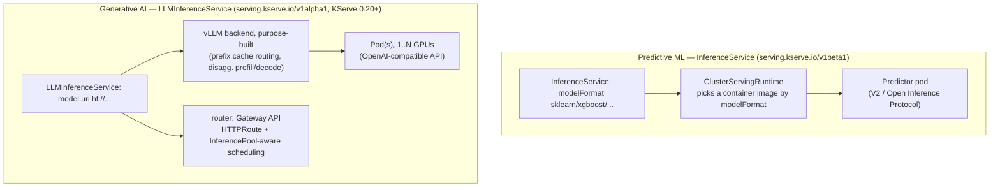

# 11 · KServe

> A model-serving control plane on top of what chapters 09-10 built by hand: `InferenceService` for
> CPU predictive models, the new `LLMInferenceService` CRD for GPU generative models with a vLLM
> backend, RawDeployment mode (no Knative dependency), and canary rollouts.

## Before you start

This chapter assumes:

- A cluster from `00-prerequisites-and-cluster-setup`. Step 2 (predictive models) is CPU-only and
  works on any cluster (`cpu-lab/` is the same overlay, cloud-agnostic).
- Step 3 (generative model) needs the spot GPU node pool from `01-gpu-nodes-and-scheduling` /
  `09-llm-inference-with-vllm` — this chapter reuses it, it does not create its own.
- Step 4's optional native-Serverless canary demo needs Knative Serving installed separately (not
  provisioned by this course); the RawDeployment workaround (default path) needs nothing extra.
- `env.sh` and `versions.env` sourced.

## 1. Why this matters

Chapters 09-10 hand-wrote a Deployment, Service, probes, HPA/KEDA — correct, but every team doing
this ends up re-inventing the same YAML for every new model. KServe standardizes that into one CRD
per model (`InferenceService`), a pluggable **runtime** per model format (sklearn, xgboost, a
HuggingFace/vLLM runtime for LLMs), and now — as of KServe 0.20 — a purpose-built
`LLMInferenceService` CRD for generative models specifically (prefix-cache-aware routing,
disaggregated prefill/decode, multi-node tensor parallelism via LeaderWorkerSet). This chapter is
intentionally narrow: one CPU predictive model, one GPU LLM, and what canary rollout does and
doesn't give you depending on deployment mode.

## 2. Learning objectives and time plan (~3 h)

By the end you can:

1. Explain what a KServe **runtime** is and why `modelFormat: sklearn` is enough to get a full
   serving container without writing one.
2. Deploy a CPU predictive `InferenceService` (sklearn, xgboost) in RawDeployment mode.
3. Explain RawDeployment vs. Serverless deployment mode and why this chapter defaults to
   RawDeployment.
4. Deploy a GPU `LLMInferenceService` backed by vLLM and hit its OpenAI-compatible endpoint.
5. Explain why `canaryTrafficPercent` doesn't work in RawDeployment mode, and what the workaround
   costs you.
6. Compare what KServe gives you "for free" against chapters 09-10's hand-built version, and name
   what you'd still have to build yourself (chapter 12's Gateway API Inference Extension: smart,
   load-aware routing across replicas).

| Time | Activity |
|---|---|
| 0:00–0:30 | Read section 3: runtimes, deployment modes, `LLMInferenceService` vs. `InferenceService` |
| 0:30–1:15 | Install KServe, deploy the sklearn/xgboost predictive models, hit the V2 inference API |
| 1:15–2:00 | Deploy the GPU `LLMInferenceService`, hit the OpenAI-compatible endpoint |
| 2:00–2:40 | Canary lab: try native `canaryTrafficPercent` (Serverless) vs. the RawDeployment workaround |
| 2:40–3:00 | Checkpoint questions, cleanup |

## 3. Concepts

### 3.1 Runtimes and the two serving CRDs



| | `InferenceService` (v1beta1) | `LLMInferenceService` (v1alpha1) |
|---|---|---|
| Since | Original KServe API, stable | KServe 0.17+, **alpha** in 0.20.0 |
| Built for | Predictive ML (classification/regression/etc.) — also usable for LLMs via the HuggingFace runtime | Generative AI specifically |
| Routing | Kubernetes Service, or Knative (Serverless mode) | Gateway API-native (`router.gateway`/`route`/`scheduler`) |
| This chapter | `common/predictive` — sklearn, xgboost | `common/generative` — Qwen3-0.6B on vLLM |

This chapter deliberately uses **both** CRDs so you can see the split: predictive workloads stay on
the mature, stable `InferenceService`; the new LLM-specific path is `LLMInferenceService`. Because
it's alpha, every field here is marked `# VERIFY` in the manifest — expect this API to change before
KServe reaches a GA generative-AI CRD.

### 3.2 Deployment modes

| | RawDeployment (this chapter) | Serverless |
|---|---|---|
| Under the hood | Plain `Deployment` + `Service` (+ HPA if configured) | Knative `Service`/`Revision` (needs Knative Serving + a networking layer, typically Istio) |
| Scale to zero | Only via an external autoscaler (KEDA, chapter 10) | Built in (Knative's own) |
| Canary (`canaryTrafficPercent`) | **Not supported** as of KServe 0.20.0 (open issue kserve/kserve#5335) | Native — Knative Revisions split traffic |
| Dependencies | None beyond KServe itself | Knative Serving + Istio/Contour/Kourier |
| Set via | `serving.kserve.io/deploymentMode: RawDeployment` annotation (or `Standard` at the controller level, this chapter's install) | default, or explicit `Serverless` annotation |

This chapter uses **RawDeployment** throughout to avoid adding a Knative dependency on top of
everything else in this course — which is precisely why "Canary rollout" (3.3) needs a workaround.

### 3.3 Canary rollout

KServe's native `canaryTrafficPercent` field (set on `spec.predictor`, KServe tracks the "last good"
revision automatically) only works in **Serverless** mode, because the traffic split is implemented
by Knative Revisions — RawDeployment's plain Service has no revision concept to split between.
`common/canary/` demonstrates the RawDeployment-compatible pattern instead: two independently-named
`InferenceService`s (`-stable`, `-canary`) plus a Gateway API `HTTPRoute` with weighted
`backendRefs`. It's more manual (you own the naming/promotion process) but needs no Knative.

## 4. Lab

```bash
cp env.sh.example env.sh   # if not already done
source env.sh && source versions.env
```

### Step 1: Install KServe

What you're about to do: install the KServe CRDs + controller via the official OCI Helm charts,
pinned to `${KSERVE_VERSION}`, in Standard (RawDeployment-capable) mode — plain Kubernetes
Deployments/Services, no Knative or Istio dependency. `LLMInferenceService`'s router still needs
Gateway API CRDs + an implementation (see chapter 12) for the route/gateway objects to actually
come up — install those first if you're doing the generative lab.

```bash
helm upgrade --install kserve-crd oci://ghcr.io/kserve/charts/kserve-crd \
  --version "${KSERVE_VERSION}" \
  --namespace kserve --create-namespace \
  --wait

helm upgrade --install kserve oci://ghcr.io/kserve/charts/kserve-resources \
  --version "${KSERVE_VERSION}" \
  --namespace kserve \
  --set kserve.controller.deploymentMode=Standard \
  --wait --timeout 10m
```
`# VERIFY`: chart names/flags against `helm show values oci://ghcr.io/kserve/charts/kserve-resources
--version ${KSERVE_VERSION}` for your exact pinned version before relying on this in a real setup.

```bash
kubectl -n kserve get pods
kubectl get crd | grep serving.kserve.io
```
Expected: `inferenceservices.serving.kserve.io`, `llminferenceservices.serving.kserve.io`,
`clusterservingruntimes.serving.kserve.io` among the CRDs; `kserve-controller-manager` `Running` in
`kserve`. How to tell this worked: `kubectl -n kserve rollout status deploy/kserve-controller-manager` reports `successfully rolled out`.

### Step 2: Predictive models (CPU, any cloud)

What you're about to do: apply the namespace + sklearn/xgboost `InferenceService`s and hit the V2
inference API once they're ready.

```bash
kubectl apply -k 11-kserve/eks   # namespace + sklearn + xgboost InferenceServices
```
No GPU/cloud cluster yet? `kubectl apply -k 11-kserve/cpu-lab` is identical for this step —
`cpu-lab/` is `common` + `common/predictive` with no cloud-specific patches, since predictive
models here need no GPU/spot nodeSelector at all.

```bash
kubectl -n ch11-kserve get inferenceservice
```
Expected (after the storage-initializer downloads the public model, ~1-2 min):
```
NAME           URL                                             READY
sklearn-iris   http://sklearn-iris.ch11-kserve.<...>            True
xgboost-iris   http://xgboost-iris.ch11-kserve.<...>            True
```
Verify (V2 / Open Inference Protocol):
```bash
kubectl -n ch11-kserve port-forward svc/sklearn-iris-predictor 8080:80 &
curl -s http://localhost:8080/v2/models/sklearn-iris/infer -H 'Content-Type: application/json' -d \
  '{"inputs":[{"name":"input-0","shape":[1,4],"datatype":"FP32","data":[[6.8,2.8,4.8,1.4]]}]}' | jq
```
How to tell this worked: the response JSON's `outputs[0].data` is a 3-class probability/label
array, not an HTTP error.

### Step 3: Generative model (GPU, needs a spot GPU node pool — see chapter 01/09)

What you're about to do: layer the `generative` component on top of the EKS overlay to deploy
the GPU `LLMInferenceService`.

```bash
kubectl apply -k 11-kserve/eks/generative
```

```bash
kubectl -n ch11-kserve get llminferenceservice
kubectl -n ch11-kserve get pods -w
```
Verify (find the Service KServe created for the LLM — name may differ by version, `# VERIFY`):
```bash
kubectl -n ch11-kserve get svc
kubectl -n ch11-kserve port-forward svc/qwen3-0-6b 8000:80 &   # VERIFY exact Service name/port
curl -s http://localhost:8000/v1/chat/completions -H 'Content-Type: application/json' -d \
  '{"model":"Qwen/Qwen3-0.6B","messages":[{"role":"user","content":"Say hi in 5 words"}]}' | jq
```

### Step 4: Canary (RawDeployment workaround)

```bash
kubectl apply -k 11-kserve/common/canary   # stable + canary InferenceServices (+ HTTPRoute if Gateway API is installed)
kubectl -n ch11-kserve get inferenceservice
```
Without Gateway API installed, just compare the two directly:
```bash
kubectl -n ch11-kserve port-forward svc/sklearn-iris-stable-predictor 8080:80 &
kubectl -n ch11-kserve port-forward svc/sklearn-iris-canary-predictor 8081:80 &
```
To see the native Serverless-mode `canaryTrafficPercent` behavior instead (separate, optional —
needs Knative Serving installed, not covered by this course's cluster setup):
```yaml
# VERIFY against your Knative install — not exercised by this chapter's kustomize overlays
metadata:
  annotations: {serving.kserve.io/deploymentMode: Serverless}
spec:
  predictor:
    canaryTrafficPercent: 10
    model: {storageUri: "gs://.../new-model"}
```

## 5. Spot considerations

- **The `LLMInferenceService` pod requests `nvidia.com/gpu: 1` like every other GPU workload in this
  course** — same taint/toleration/spot-nodeSelector story as chapter 09, applied in
  `eks/generative/patch-spot.yaml`.
- **RawDeployment's plain Deployment has no built-in PDB.** Add one (see `09-llm-inference-with-vllm/common/pdb.yaml`
  for the pattern) if you run more than one replica and want voluntary-disruption protection.
- **Cold start applies here too** — an `LLMInferenceService` pod pays the same weight-download +
  CUDA-graph-capture budget as chapter 09's vLLM Deployment (section 3.3 there). KServe doesn't
  change that physics, it changes how you declare the workload.

## 6. Troubleshooting

| Symptom | Cause | Fix |
|---|---|---|
| `InferenceService` stuck `READY: False`, no pods | `ClusterServingRuntime` for that `modelFormat` not found, or storage-initializer failing | `kubectl -n ch11-kserve describe inferenceservice sklearn-iris`; `kubectl get clusterservingruntime` |
| Predictor pod `ImagePullBackOff` | KServe version mismatch between CRD/controller and the runtime images it selects | Confirm `install-kserve.sh` pinned `${KSERVE_VERSION}` on both `kserve-crd` and `kserve` charts |
| `LLMInferenceService` pod `Pending`: `Insufficient nvidia.com/gpu` | No GPU node pool, or overlay's nodeSelector doesn't match your cloud | Create/scale the pool (chapter 01), confirm you applied the right `<cloud>/generative` overlay |
| `LLMInferenceService` has no obvious Service/URL | Gateway API not installed, so `router.gateway`/`route` can't provision | Install Gateway API CRDs + an implementation first (see chapter 12), or `kubectl -n ch11-kserve get pods,svc` to find the pod directly and port-forward it |
| `canaryTrafficPercent` set but 100% traffic still goes to one revision | You're in RawDeployment mode — this field is Serverless-only (3.3) | Use `common/canary`'s two-InferenceService + HTTPRoute pattern instead |
| V2 inference `curl` returns 404 | Wrong path — V2 protocol is `/v2/models/<name>/infer`, not `/v1/models/<name>:predict` (that's V1) | Confirm `protocolVersion: v2` is set and use the V2 path |

## 7. Cleanup and cost notes

What you're about to do: remove the chapter's workloads (and, optionally, the KServe controller
itself).

```bash
kubectl delete -k 11-kserve/eks --ignore-not-found
kubectl delete -k 11-kserve/eks/generative --ignore-not-found
kubectl delete -k 11-kserve/common/canary --ignore-not-found
kubectl delete -k 11-kserve/cpu-lab --ignore-not-found
if [[ "${UNINSTALL_KSERVE:-false}" == "true" ]]; then
  helm -n kserve uninstall kserve || true
  helm -n kserve uninstall kserve-crd || true
fi
```
- The CPU predictive models are cheap (1 CPU / 2Gi each) — leave them running is fine between
  sessions if you're not GPU-constrained.
- The `LLMInferenceService` GPU pod bills like any other spot GPU workload in this course (chapter
  09's cost notes apply identically) — don't forget it when tearing down.
- `UNINSTALL_KSERVE=true` removes the controller and CRDs for the **whole cluster** — only do this
  if no other chapter/namespace still has an `InferenceService` you need.

## 8. Checkpoint questions

<details>
<summary>1. What does a KServe "runtime" actually provide, and why does <code>modelFormat: sklearn</code> alone get you a working server?</summary>

A `ClusterServingRuntime` maps a `modelFormat` (and optionally a framework version) to a prebuilt
serving container image and its default resource/protocol settings. KServe looks up the runtime
matching `modelFormat: sklearn`, launches that container, and injects the `storageUri` via a
storage-initializer init container — you never write a Dockerfile or a serving loop.
</details>

<details>
<summary>2. Why does this chapter use <code>InferenceService</code> (not <code>LLMInferenceService</code>) for the sklearn/xgboost models?</summary>

`LLMInferenceService` is purpose-built for generative AI (vLLM backend, prefix-cache routing,
disaggregated prefill/decode) — none of that applies to a small tabular classifier. `InferenceService`
is the stable, general-purpose CRD and is what predictive ML has always used in KServe.
</details>

<details>
<summary>3. Why does RawDeployment mode need an external autoscaler (KEDA, chapter 10) to scale to zero, while Serverless mode doesn't?</summary>

RawDeployment is a plain Kubernetes `Deployment` — Kubernetes has no built-in "scale a Deployment to
0 based on traffic" primitive (only manual `replicas: 0` or an external controller). Serverless mode
runs on Knative Serving, which implements request-based autoscaling including scale-to-zero natively
as part of the Knative Revision lifecycle.
</details>

<details>
<summary>4. Why doesn't <code>spec.predictor.canaryTrafficPercent</code> do anything in this chapter's RawDeployment InferenceServices?</summary>

It's implemented via Knative Revision traffic splitting, which only exists in Serverless mode.
RawDeployment's plain Service routes 100% of traffic to whatever the Deployment's pods currently are
— there's no revision object for KServe to split percentages between (open feature request
kserve/kserve#5335 as of v0.20.0).
</details>

<details>
<summary>5. In the RawDeployment canary workaround (<code>common/canary</code>), what actually does the traffic splitting, and what does it depend on?</summary>

A Gateway API `HTTPRoute` with weighted `backendRefs` pointing at the two InferenceServices'
generated predictor Services. It requires Gateway API CRDs and a Gateway controller/implementation
installed in the cluster (covered properly in chapter 12) — without that, the two InferenceServices
can only be compared manually (separate port-forwards), no automatic split.
</details>

<details>
<summary>6. Why is every field in <code>common/generative/llminferenceservice-qwen.yaml</code> marked <code># VERIFY</code>?</summary>

`LLMInferenceService` is an alpha CRD in KServe 0.20.0 — the field set, defaults, and even whether
`router.gateway: {}` resolves the same way across versions are explicitly not API-stable yet. Alpha
means "expect it to change"; the manifest is only verified against the specific example published
alongside the 0.20 release, not a long-term contract.
</details>

<details>
<summary>7. What does KServe give you here that chapter 09's hand-written vLLM Deployment didn't, and what does it still NOT give you (pointing to chapter 12)?</summary>

KServe standardizes the CRD/runtime abstraction (declare a model, get a correctly-configured pod) and
adds generative-specific features like prefix-cache-aware routing and disaggregated prefill/decode
via `LLMInferenceService`. It does not, by itself, give you load-aware routing across multiple
replicas of the *same* model at the request level — that's the Gateway API Inference Extension's
`InferencePool`/EPP (Endpoint Picker), covered in chapter 12.
</details>

<details>
<summary>8. A predictive InferenceService responds to <code>/v2/models/sklearn-iris/infer</code> but a `curl` to <code>/v1/models/sklearn-iris:predict</code> 404s. Why, and is that a misconfiguration?</summary>

Not a misconfiguration — `protocolVersion: v2` in the manifest selects KServe's V2 / Open Inference
Protocol contract (`/v2/models/<name>/infer`), which is distinct from the older V1 protocol
(`/v1/models/<name>:predict`). Only the protocol version you configured is being served.
</details>

## 9. Further reading and versions tested

- KServe: [Predictive Inference overview](https://kserve.github.io/website/docs/model-serving/predictive-inference/frameworks/overview), [LLMInferenceService overview](https://kserve.github.io/website/docs/model-serving/generative-inference/llmisvc/llmisvc-overview), [Canary Rollout](https://kserve.github.io/website/docs/model-serving/predictive-inference/rollout-strategies/canary), [Deployment modes](https://kserve.github.io/website/docs/getting-started/quickstart-guide), [Storage containers / URI schemes](https://kserve.github.io/website/docs/model-serving/storage/storage-containers)
- [kserve/kserve#5335](https://github.com/kserve/kserve/issues/5335) — `canaryTrafficPercent` for RawDeployment (open as of 0.20.0)
- Cross-link: `01-gpu-nodes-and-scheduling` (GPU node pool reused here), `09-llm-inference-with-vllm` (the hand-built version this chapter automates), `10-autoscaling-inference` (scale-to-zero for RawDeployment InferenceServices), `12-inference-gateway-and-multinode-serving` (Gateway API Inference Extension, `InferencePool`, multi-node serving)

**Versions tested** (2026-09-16): Kubernetes 1.35, `KSERVE_VERSION=v0.20.0` (Helm OCI charts
`oci://ghcr.io/kserve/charts/kserve-crd`, `oci://ghcr.io/kserve/charts/kserve-resources`), model
`Qwen/Qwen3-0.6B`, KServe public example models `gs://kfserving-examples/models/sklearn/1.0/model`
and `gs://kfserving-examples/models/xgboost/1.5/model`.

**# VERIFY items** (see inline comments): `LLMInferenceService` field shape and defaults (alpha CRD,
fast-churning); whether object-storage `storageUri` schemes (gs://, s3://, Azure blob https://) work
identically for `LLMInferenceService.spec.model.uri` as they do for `InferenceService` — only `hf://`
was exercised here; exact generated Service name for a RawDeployment predictor/LLM component, used
in the canary `HTTPRoute` and the generative port-forward step; Helm OCI chart names/flags for
`install-kserve.sh` — re-run `helm show values oci://ghcr.io/kserve/charts/kserve-resources --version v0.20.0`
before relying on this in a real environment.
