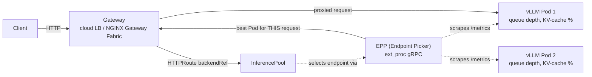
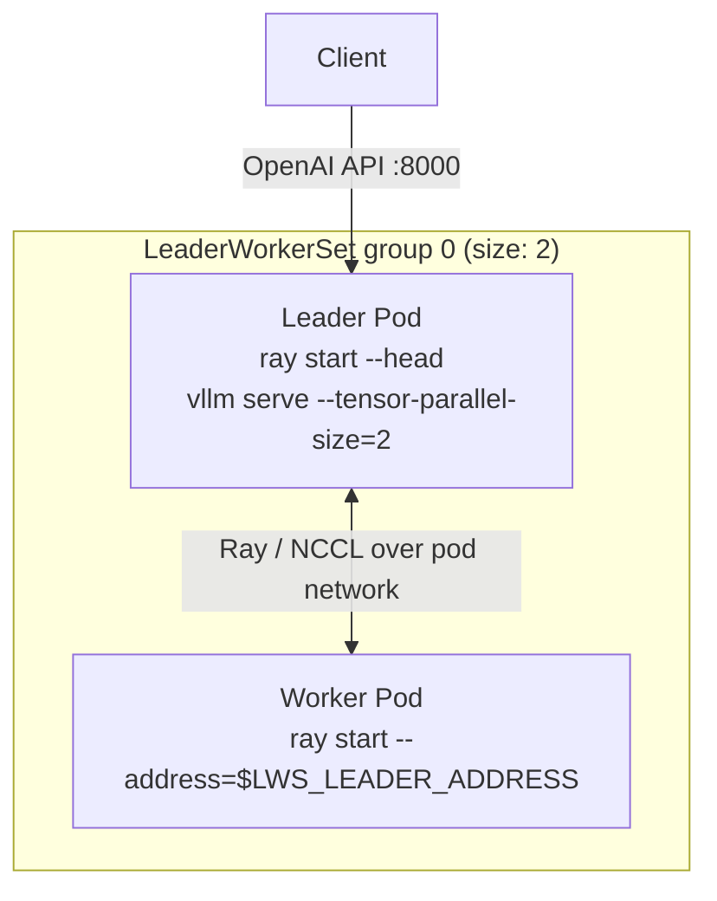

# 12 · Inference Gateway and Multi-Node Serving

> Gateway API + the Gateway API Inference Extension for LLM-aware load balancing, and
> LeaderWorkerSet for models too big for one node. Builds directly on chapter 09's vLLM
> Deployment and chapter 05's storage patterns instead of re-teaching them.

## 1. Why this matters

Chapter 09 put one vLLM replica behind a plain `Service`. That's fine for a demo, but a
`Service`'s load balancing (random / round-robin / iptables hashing) doesn't know anything about
what's happening *inside* an LLM server: one request might be a 3-token classification call, the
next a 4000-token generation that pins the GPU for 30 seconds. A `Service` sends the next request
to whichever Pod is next in rotation, even if that Pod's KV cache is full and its queue is 40
requests deep. In production this shows up as **tail latency that doesn't correlate with load** —
p50 looks fine, p99 is terrible, and no amount of HPA fixes it because the problem is routing, not
capacity.

The **Gateway API Inference Extension (GAIE)** fixes this by putting an **EPP (Endpoint Picker)**
in the request path: a component that watches vLLM's real-time metrics (queue depth, KV-cache
utilization) and picks the *specific* Pod for each request. And once a single node's GPU isn't
enough for a model, **LeaderWorkerSet (LWS)** lets you scale a single logical replica *across*
nodes, so a group of Pods start and fail together instead of a Deployment scaling GPUs it can't
place.

This chapter composes rather than duplicates: the single-node vLLM workload is chapter 09's
`vllm-deployment.yaml`, imported by kustomize directly; the multi-node variant reuses the same
image, probes, and shutdown handling ideas, extended for a leader/worker group. Model weights
caching follows chapter 05's patterns (PVC / object-storage — swap in either from there).

## 2. Learning objectives and time plan (~3 h, can split into two sessions)

By the end you can:

1. Explain why a `Service` isn't good enough for LLM traffic and what an EPP scores requests on.
2. Deploy Gateway API core resources (GatewayClass, Gateway, HTTPRoute) and point an HTTPRoute at
   an `InferencePool` instead of a `Service`.
3. Stand up the InferencePool + EPP and verify inference-aware routing is actually happening.
4. Explain LeaderWorkerSet's group model (`size`, leader/worker templates, `LWS_LEADER_ADDRESS`)
   and deploy a 2-node tensor-parallel vLLM replica.
5. Compare each cloud's Gateway implementation options and know what changed across GKE/EKS/AKS.
6. Place this chapter's pieces (Gateway, InferencePool, LWS, llm-d) into the broader "serving
   stack" picture.

| Time | Activity |
|---|---|
| 0:00–0:35 | Read section 3 (concepts). Skim `common/` manifests, compare to ch09 |
| 0:35–1:10 | Install Gateway API + GAIE CRDs, your cloud's Gateway controller. Deploy `vllm-pool` + `InferencePool`/EPP |
| 1:10–1:40 | Send traffic through the Gateway, watch EPP routing decisions, break it (kill a Pod mid-request) |
| 1:40–2:20 | Install LWS, deploy `multinode-lws`, watch the leader wait for the worker, verify TP=2 across nodes |
| 2:20–2:45 | Per-cloud Gateway implementation tour (section 6), llm-d overview (section 7) |
| 2:45–3:00 | Checkpoint questions, cleanup |

## 3. Concepts

### 3.1 Request flow with an Inference Gateway



- **GatewayClass**: cluster-scoped, provided by an implementation (GKE, NGINX Gateway Fabric,
  Istio...). You don't create it.
- **Gateway**: the listener (port 80/443) you *do* create, referencing a GatewayClass.
- **HTTPRoute**: path/header matching rules, with a `backendRef`. Normally that's a `Service`;
  here it's an `InferencePool`.
- **InferencePool** (`inference.networking.k8s.io/v1`): a label selector over Pods (like a
  headless Service) plus a reference to the EPP that picks among them.
- **EPP**: implements the [Endpoint Picker Protocol](https://gateway-api-inference-extension.sigs.k8s.io/)
  (gRPC `ext_proc`). The Gateway calls it per-request; it returns the one Pod to send this
  specific request to, based on live model-server signals — not just balancing connection count.

### 3.2 LeaderWorkerSet: scaling a model across nodes

A Deployment scales *identical, independent* Pods. Multi-node tensor-parallel serving needs the
opposite: a **group** of Pods (1 leader + N workers) that come up together, know about each other
(via Ray or NCCL), and are useless individually.



- `leaderWorkerTemplate.size` = total Pods per group (leader + workers).
- Every Pod gets `LWS_LEADER_ADDRESS` (the leader's stable DNS name via an auto-created headless
  Service), `LWS_GROUP_INDEX`, `LWS_WORKER_INDEX` injected as env vars.
- `restartPolicy: RecreateGroupOnPodRestart` — if any one Pod in the group dies, the whole group
  restarts together (a half-formed Ray cluster is worse than no cluster).
- This is orthogonal to `InferencePool`: an `InferencePool` can select a *group's leader Pods* the
  same way it selects independent replicas — each group is one endpoint.

### 3.3 llm-d (overview only — not deployed in this lab)

[llm-d](https://llm-d.ai/) is a Kubernetes-native reference architecture built **on top of** the
same primitives this chapter teaches (Gateway API Inference Extension, LWS) plus
**prefill/decode disaggregation** (splitting the compute-bound prompt-processing phase from the
memory-bound token-generation phase onto different Pods/hardware) and KV-cache-aware routing
across a fleet. It's the production answer to "what do I do once one InferencePool isn't enough."
Treat this chapter as the primitives llm-d is assembled from; adopting llm-d itself is a platform
decision beyond a 3-hour lab — see their [architecture docs](https://llm-d.ai/docs/architecture)
before evaluating it. # VERIFY: llm-d's own manifests move fast; if you deploy it, re-verify
CRDs/Helm values against the pinned llm-d release, not this description.

## 4. Lab

Env: `cp env.sh.example env.sh` (repo root) then `source env.sh && source versions.env`. This
chapter needs a GPU node pool with **room for 2 GPU nodes at once** (`MAX_NODES=2`) for the
multi-node section — reuse chapter 01's pool.

### 4.1 Install cluster-scoped prerequisites (once per cluster)

```bash
common/install-gateway-crds.sh   # Gateway API core CRDs (standard channel) + GAIE CRDs
common/install-lws.sh            # LeaderWorkerSet controller
```

### 4.2 GKE

```bash
../01-gpu-nodes-and-scheduling/gke/create-gpu-nodepool.sh   # MAX_NODES=2 ./create-gpu-nodepool.sh
gke/create-gateway.sh                                        # confirms Gateway API is enabled
../09-llm-inference-with-vllm/common/create-hf-secret.sh ch12-gateway
kubectl apply -k gke
kubectl get gateway inference-gateway -n ch12-gateway -o wide     # wait for an ADDRESS
kubectl get inferencepool vllm-pool -n ch12-gateway -o yaml        # Accepted=True, ResolvedRefs=True
```

GKE's `gke-l7-regional-external-managed` GatewayClass provisions a regional external Application
Load Balancer. GKE also offers a **fully managed GKE Inference Gateway** experience where Google
runs the EPP for you (no `epp-deployment.yaml` needed) — this lab uses the self-hosted EPP so the
same manifests work unmodified on EKS/AKS; see
[Deploy GKE Inference Gateway](https://cloud.google.com/kubernetes-engine/docs/how-to/deploy-gke-inference-gateway)
for the managed variant.

### 4.3 EKS / AKS

```bash
# EKS
MAX_NODES=2 ../01-gpu-nodes-and-scheduling/eks/create-gpu-nodegroup.sh
eks/install-nginx-gateway-fabric.sh
../09-llm-inference-with-vllm/common/create-hf-secret.sh ch12-gateway
kubectl apply -k eks

# AKS
MAX_NODES=2 ../01-gpu-nodes-and-scheduling/aks/create-gpu-nodepool.sh
aks/install-nginx-gateway-fabric.sh
../09-llm-inference-with-vllm/common/create-hf-secret.sh ch12-gateway
kubectl apply -k aks
```

Neither cloud has a first-party Gateway implementation with **confirmed** Inference Extension
conformance at the time this was written (AWS's Gateway API GA support for ALB/VPC-Lattice and
Azure's Application Gateway for Containers ALB Controller are both real Gateway API
implementations, just not verified against GAIE here — `# VERIFY` before swapping either in for
NGINX Gateway Fabric). NGINX Gateway Fabric is upstream-listed as a conformant Inference Extension
implementation and installs identically on both clouds behind a `LoadBalancer` Service.

### 4.4 Send traffic and watch routing decisions

```bash
kubectl -n ch12-gateway port-forward svc/vllm-epp 9090:9090 &   # EPP's own /metrics
GW_IP=$(kubectl get gateway inference-gateway -n ch12-gateway -o jsonpath='{.status.addresses[0].value}')
curl http://$GW_IP/v1/completions -H 'Content-Type: application/json' -d \
  '{"model":"Qwen/Qwen3-0.6B","prompt":"Kubernetes is","max_tokens":20}'
curl -s localhost:9090/metrics | grep inference_pool   # EPP's scoring/queue-depth metrics
```

**Expected output**: a normal OpenAI-style completion JSON from the Gateway (not from `vllm`'s
Service directly — confirm by scaling to 2 replicas and watching the EPP metrics shift requests
toward whichever Pod has the shorter queue).

### 4.5 Multi-node: LeaderWorkerSet

```bash
kubectl apply -k common/multinode-lws -n ch12-gateway   # or via your cloud overlay, already included
kubectl get pods -n ch12-gateway -l app.kubernetes.io/name=vllm-multinode -o wide
# expect vllm-multinode-0 (leader) and vllm-multinode-0-1 (worker) on DIFFERENT nodes
kubectl logs -n ch12-gateway vllm-multinode-0 -f   # watch: "waiting for ray nodes to join" -> vllm serve starts
kubectl -n ch12-gateway port-forward svc/vllm-multinode 8000:8000 &
curl localhost:8000/v1/completions -d '{"model":"Qwen/Qwen3-0.6B","prompt":"hi","max_tokens":5}'
```

**Expected output**: two Pods, `-0` (leader) and `-0-1` (worker), `Running`, on two different
nodes (`kubectl get pods -o wide`); the leader's log shows Ray forming a 2-node cluster before
`vllm serve` starts listening.

### 4.6 CPU lab (no cloud account, no GPU)

```bash
kubectl apply -k cpu-lab
kubectl -n ch09-vllm-cpu port-forward svc/ollama 11434:11434 &
kubectl get gateway inference-gateway -n ch09-vllm-cpu
kubectl get pods -n ch09-vllm-cpu -l app.kubernetes.io/name=lws-demo
```

**What doesn't carry over from the CPU lab**: no `InferencePool`/EPP (Ollama doesn't expose
vLLM's Prometheus metrics, so there's nothing for the EPP to score — the HTTPRoute targets a
plain `Service`); the LWS demo uses `busybox` sleep loops, not Ray/vLLM, so it shows group
topology and env-var injection only, not real tensor parallelism; no spot GPU taints/tolerations
to reason about.

## 5. Spot considerations

- **EPP and Gateway controllers** should run on stable (non-spot) infrastructure — they're
  control-plane-adjacent, low resource cost, and a mid-scoring restart briefly drops routing
  intelligence (falls back to whatever the underlying load balancer does by default).
- **Single-node `vllm-pool`**: same as chapter 09 — the `PodDisruptionBudget` only protects
  voluntary disruption; the EPP's health check will route around a preempted Pod within a few
  scrape intervals, but in-flight requests to it are lost. `--shutdown-timeout` gives it a
  chance to finish first if the preemption is graceful (rare on true spot reclaim).
- **Multi-node `LeaderWorkerSet`**: this is the sharpest edge in the chapter. If the WORKER's
  node is spot-reclaimed, `restartPolicy: RecreateGroupOnPodRestart` tears down and recreates the
  **whole group**, including the leader — a single spot reclaim costs you the entire model
  reload + Ray re-formation, not just one Pod. Two independent spot pools each have their own
  reclaim probability; a 2-node group's *effective* reclaim rate is roughly double a single node's.
  For anything latency-sensitive, put the LWS leader (and arguably both) on **on-demand** and
  reserve spot for the stateless single-node `vllm-pool` tier instead; chapter 13 covers
  spot-diversification strategies that reduce simultaneous reclaim risk if you do run LWS on spot.

## 6. Per-cloud Gateway implementation notes

| | GKE | EKS | AKS |
|---|---|---|---|
| GatewayClass used here | `gke-l7-regional-external-managed` | `nginx` (NGINX Gateway Fabric) | `nginx` (NGINX Gateway Fabric) |
| Native alternative | GKE Inference Gateway (managed EPP) | AWS LB Controller Gateway API GA / VPC Lattice controller — `# VERIFY` GAIE conformance | Application Gateway for Containers ALB Controller (`azure-alb-external`) — `# VERIFY` GAIE conformance |
| Install | built in, `gcloud container clusters update --gateway-api=standard` | Helm (`ngf` chart) | Helm (`ngf` chart) |
| LB type provisioned | Regional external L7 (Google Cloud Load Balancer) | Service `type: LoadBalancer` (cloud LB via CCM) | Service `type: LoadBalancer` (Azure LB) |

## 7. Troubleshooting

| Symptom | Likely cause | Fix |
|---|---|---|
| `Gateway` stuck with no `ADDRESS` | Wrong/missing GatewayClass, or the controller isn't installed | `kubectl get gatewayclass`; re-run the cloud install script |
| `HTTPRoute` `ResolvedRefs=False` | `InferencePool` name/port typo, or InferencePool not `Accepted` | `kubectl describe httproute`; check `kubectl get inferencepool -o yaml` conditions |
| `InferencePool` `Accepted=False` | EPP Service/Deployment not Ready, or `endpointPickerRef` port wrong | `kubectl get pods -l app.kubernetes.io/name=vllm-epp`; check EPP logs |
| Requests succeed but always hit the same Pod | Only 1 replica of `vllm-pool` running, or EPP can't scrape `/metrics` (RBAC/NetworkPolicy) | Scale `vllm` to 2 replicas (needs a 2nd GPU); check EPP logs for scrape errors |
| LWS leader Pod stuck in `Running` but not Ready | Waiting for the worker to join Ray — worker `Pending` (no 2nd GPU node) | `kubectl get pods -o wide`; confirm your GPU pool has `MAX_NODES=2` and 2 nodes actually scaled up |
| LWS group restarts in a loop | One Pod crash-looping drags the whole group down (`RecreateGroupOnPodRestart`) | Check the crashing Pod's logs first — usually an HF auth/model-name error, not an LWS problem |
| `503`/connection refused calling the Gateway | LB still provisioning (GKE regional LBs take a few minutes), or `allowedRoutes.namespaces` mismatch | Wait 2-5 min; confirm HTTPRoute's namespace matches the Gateway's `allowedRoutes` |

## 8. Cleanup and cost notes

```bash
gke/cleanup.sh   # or eks/ or aks/
```

Deleting the `Gateway` deletes the cloud load balancer it provisioned — **verify in the cloud
console** (GCP forwarding rules / AWS ELB / Azure Load Balancer) that it's actually gone; a
dangling regional LB bills hourly even when idle. The 2-node GPU pool from section 4 is the
expensive part of this chapter (2x spot GPU nodes) — scale it back to `MAX_NODES=1` or delete it
if you're not immediately doing chapter 13.

## 9. Checkpoint questions

<details>
<summary>1. Why can't a plain Kubernetes <code>Service</code> do what an EPP does?</summary>

A `Service` load-balances on connection/packet level (round robin, random, or session affinity)
with no visibility into application state. An EPP scores endpoints on live model-server signals
(queue depth, KV-cache utilization) fetched from `/metrics`, so it can route a new request away
from a Pod that's about to run out of KV cache even if that Pod has fewer open TCP connections.
</details>

<details>
<summary>2. What does <code>HTTPRoute.spec.rules[].backendRefs[].kind: InferencePool</code> change about routing, mechanically?</summary>

Instead of the Gateway resolving the backend to a Kubernetes `Service`'s `EndpointSlice` and load
balancing itself, it calls out to the EPP referenced by the `InferencePool` (via `ext_proc` gRPC)
for every request, and sends the request to whichever single Pod the EPP names.
</details>

<details>
<summary>3. In a LeaderWorkerSet with <code>size: 2</code>, how many total Pods make one group, and how many GPUs does one group of a tensor-parallel-size=2 model use?</summary>

`size: 2` = 1 leader + 1 worker = 2 Pods per group. With `--tensor-parallel-size=2` and 1 GPU
requested per Pod, that's 2 GPUs total for one logical model replica.
</details>

<details>
<summary>4. Why does killing the WORKER Pod in an LWS group also restart the LEADER?</summary>

`restartPolicy: RecreateGroupOnPodRestart` treats the group as an atomic unit — a Ray/NCCL
cluster with a missing member is unusable, so LWS tears down and recreates every Pod in the group
together rather than trying to hot-add a replacement worker to a live tensor-parallel run.
</details>

<details>
<summary>5. What env var does a worker Pod use to find its leader, and how is it populated?</summary>

`LWS_LEADER_ADDRESS`, injected automatically by the LWS controller. It resolves via a headless
Service LWS creates for the group, so it's a DNS name, not an IP the worker has to discover another way.
</details>

<details>
<summary>6. Why is spot capacity riskier for a multi-node LWS replica than for a single-node Deployment replica?</summary>

Losing any ONE Pod in the group (via spot reclaim on either node) tears down the WHOLE group
under `RecreateGroupOnPodRestart`. With 2 independently-reclaimable spot nodes, the effective
probability of losing the group in a given window is roughly double that of a single spot node,
and the cost of a loss (full model reload + Ray re-formation across both nodes) is higher than
losing one stateless single-GPU replica.
</details>

<details>
<summary>7. What's the practical difference between GKE's built-in Inference Gateway and the self-hosted EPP path used in this lab?</summary>

Functionally the same InferencePool/EPP mechanism; GKE's managed path runs and upgrades the EPP
for you as part of the `gke-l7-*` GatewayClass machinery (no `epp-deployment.yaml` to maintain),
while the self-hosted path (used here for cross-cloud portability) means you own the EPP
Deployment, RBAC, and version upgrades yourself.
</details>

<details>
<summary>8. Where does llm-d fit relative to what this chapter deploys?</summary>

llm-d is built ON these same primitives (Gateway API Inference Extension, LWS) plus additional
capabilities this chapter doesn't cover — prefill/decode disaggregation and fleet-wide
KV-cache-aware routing. It's the next step once a single InferencePool's routing intelligence
isn't enough, not a replacement for learning the primitives first.
</details>

## 10. Further reading

- [Gateway API Inference Extension docs](https://gateway-api-inference-extension.sigs.k8s.io/)
- [InferencePool API reference](https://gateway-api-inference-extension.sigs.k8s.io/api-types/inferencepool/)
- [LeaderWorkerSet docs](https://lws.sigs.k8s.io/)
- [vLLM: Deploying with LWS](https://docs.vllm.ai/en/stable/deployment/frameworks/lws/)
- [GKE Inference Gateway](https://cloud.google.com/kubernetes-engine/docs/how-to/deploy-gke-inference-gateway)
- [NGINX Gateway Fabric + Inference Extension](https://docs.nginx.com/nginx-gateway-fabric/how-to/gateway-api-inference-extension/)
- [llm-d](https://llm-d.ai/)
- Cross-links: [09-llm-inference-with-vllm](../09-llm-inference-with-vllm) (single-node base),
  [05-model-storage-and-data](../05-model-storage-and-data) (weights caching),
  [10-autoscaling-inference](../10-autoscaling-inference) (scaling the Pods this Gateway routes
  to), [13-node-autoscaling-and-cost](../13-node-autoscaling-and-cost) (scaling the GPU nodes
  underneath)

### Versions tested

From `versions.env`: `GATEWAY_API_VERSION=v1.6.2`, `GAIE_VERSION=v1.6.1`, `LWS_VERSION=v0.10.0`,
`VLLM_VERSION=v0.29.0`. Not in `versions.env` (pinned in this chapter's scripts, report to the
lead for consolidation): `NGF_VERSION=2.7.0` (NGINX Gateway Fabric, `eks/aks` overlays).
