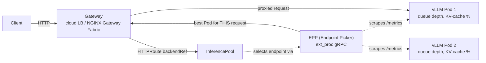
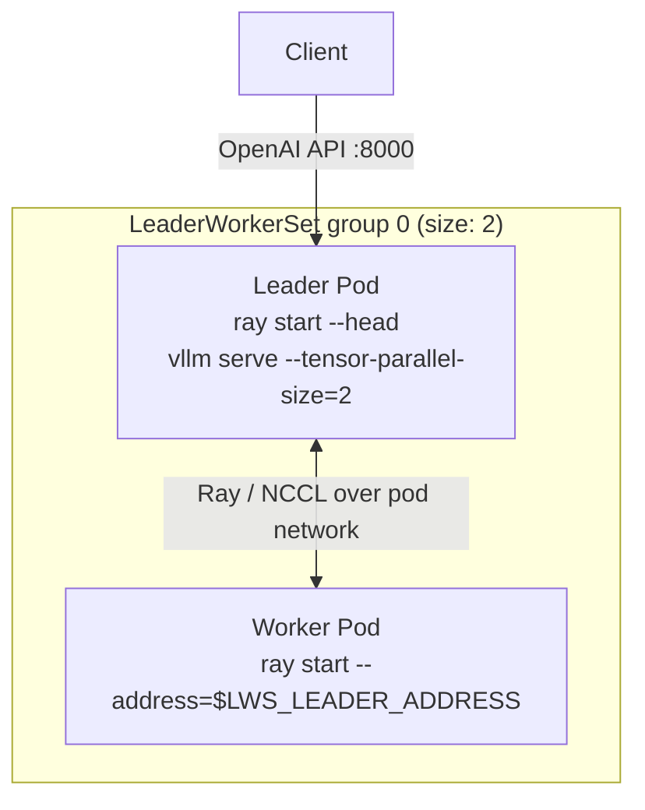

# 12 · Inference Gateway and Multi-Node Serving

> Gateway API + the Gateway API Inference Extension for LLM-aware load balancing, and
> LeaderWorkerSet for models too big for one node. Builds directly on chapter 09's vLLM
> Deployment and chapter 05's storage patterns instead of re-teaching them.

**If this is your first time touching Kubernetes networking or multi-GPU serving**: read
section 3 (Concepts) slowly, even the parts that look like background trivia. Everything after
it assumes you know what a Gateway, an HTTPRoute, an InferencePool, and a LeaderWorkerSet group
each are — the lab steps explain the *commands*, not the *nouns*.

## Before you start

This chapter assumes:

- **A GPU node group that can scale to 2 nodes at once** from
  [01-gpu-nodes-and-scheduling](../01-gpu-nodes-and-scheduling) — scale the `spot-gpu` nodegroup
  created there with `eksctl scale nodegroup ... --nodes 2 --nodes-min 0 --nodes-max 2` (step 2
  below shows the exact command; the multi-node LWS section in 4.6 needs both nodes up
  simultaneously, single-node section 4.3-4.5 only needs 1).
- **Chapter 09's vLLM base** ([09-llm-inference-with-vllm](../09-llm-inference-with-vllm)) — this
  chapter's `vllm-pool` imports `09-llm-inference-with-vllm/common` wholesale via kustomize rather
  than re-defining the Deployment/Service/PDB; read 09 first if you haven't, especially its
  `kubectl create secret generic hf-token` step, which this chapter reuses verbatim (own namespace).
- **A storage pattern for model weights** from
  [05-model-storage-and-data](../05-model-storage-and-data) if you want persistent caching across
  Pod restarts — this lab defaults to an `emptyDir` HF cache for simplicity, which re-downloads on
  every restart.
- No prior GAIE/Gateway API/LWS install is assumed — section 4.1 installs both CRDs and the LWS
  controller from scratch.
- **No prior Kubernetes networking knowledge beyond `kubectl expose`/`Service`** is assumed either
  — section 3.1 explains Gateway API from first principles before any command touches it.

If you've never worked with Kubernetes Services before, the one-sentence version you need for this
chapter is: a `Service` is a stable virtual IP + DNS name that load-balances traffic across a set
of Pods, chosen by a label selector, with no idea what's inside the requests it forwards. Keep that
picture in mind — everything below is about *replacing* that "no idea what's inside" part for LLM
traffic specifically.

## 1. Why this matters

Chapter 09 put one vLLM replica behind a plain `Service`. That's fine for a demo, but a
`Service`'s load balancing (random / round-robin / iptables hashing) doesn't know anything about
what's happening *inside* an LLM server: one request might be a 3-token classification call, the
next a 4000-token generation that pins the GPU for 30 seconds. A `Service` sends the next request
to whichever Pod is next in rotation, even if that Pod's KV cache is full and its queue is 40
requests deep. In production this shows up as **tail latency that doesn't correlate with load** —
p50 looks fine, p99 is terrible, and no amount of HPA fixes it because the problem is routing, not
capacity.

To make that concrete: imagine two vLLM Pods. Pod A just started a 4000-token generation and its
GPU's KV cache (the memory that holds every previous token's attention state, so the model doesn't
recompute from scratch) is nearly full. Pod B is idle. A round-robin `Service` has a coin-flip
chance of sending the *next* request to Pod A anyway, because a `Service` only tracks TCP
connections, not what the model server is doing with them. That request then queues behind Pod A's
long generation and its latency has nothing to do with the cluster's actual capacity — it's a
routing accident. Multiply this by hundreds of requests per second and you get exactly the
"p50 fine, p99 terrible" symptom described above.

The **Gateway API Inference Extension (GAIE)** fixes this by putting an **EPP (Endpoint Picker)**
in the request path: a component that watches vLLM's real-time metrics (queue depth, KV-cache
utilization) and picks the *specific* Pod for each request. And once a single node's GPU isn't
enough for a model, **LeaderWorkerSet (LWS)** lets you scale a single logical replica *across*
nodes, so a group of Pods start and fail together instead of a Deployment scaling GPUs it can't
place.

Why can't a Deployment just solve the "model too big for one GPU" problem by adding more
replicas? Because more replicas means more *independent, full copies* of the model — each Pod
still needs the whole model to fit on its own node's GPU(s). Tensor-parallel serving is the
opposite: it splits *one copy* of the model's weights across multiple GPUs (potentially on
different physical nodes), so those GPUs jointly hold one model that's too big for any one of them
alone. A Deployment has no concept of "these N Pods together are one replica" — it only knows how
to scale identical, independent Pods up or down. That gap is exactly what LeaderWorkerSet fills.

This chapter composes rather than duplicates: the single-node vLLM workload is chapter 09's
`vllm-deployment.yaml`, imported by kustomize directly; the multi-node variant reuses the same
image, probes, and shutdown handling ideas, extended for a leader/worker group. Model weights
caching follows chapter 05's patterns (PVC / object-storage — swap in either from there).

## 2. Learning objectives and time plan (~3 h, can split into two sessions)

By the end you can:

1. Explain why a `Service` isn't good enough for LLM traffic and what an EPP scores requests on.
2. Deploy Gateway API core resources (GatewayClass, Gateway, HTTPRoute) and point an HTTPRoute at
   an `InferencePool` instead of a `Service`.
3. Stand up the InferencePool + EPP and verify inference-aware routing is actually happening.
4. Explain LeaderWorkerSet's group model (`size`, leader/worker templates, `LWS_LEADER_ADDRESS`)
   and deploy a 2-node tensor-parallel vLLM replica.
5. Explain why NGINX Gateway Fabric is used here instead of a cloud-native Gateway implementation,
   and what you'd verify before swapping in AWS's own Gateway API path.
6. Place this chapter's pieces (Gateway, InferencePool, LWS, llm-d) into the broader "serving
   stack" picture.

| Time | Activity |
|---|---|
| 0:00–0:35 | Read section 3 (concepts). Skim `common/` manifests, compare to ch09 |
| 0:35–1:10 | Install Gateway API + GAIE CRDs, your cloud's Gateway controller. Deploy `vllm-pool` + `InferencePool`/EPP |
| 1:10–1:40 | Send traffic through the Gateway, watch EPP routing decisions, break it (kill a Pod mid-request) |
| 1:40–2:20 | Install LWS, deploy `multinode-lws`, watch the leader wait for the worker, verify TP=2 across nodes |
| 2:20–2:45 | Per-cloud Gateway implementation tour (section 6), llm-d overview (section 7) |
| 2:45–3:00 | Checkpoint questions, cleanup |

## 3. Concepts

### 3.0 Gateway API vs. Ingress, for someone who has only seen Ingress (or neither)

If you've used Kubernetes' older `Ingress` resource (or never touched either), here's the context
you need before any of this makes sense:

- **`Ingress`** is a single, fairly minimal resource that bundles "here's my listener config" and
  "here's my routing rules" together, and its spec is intentionally generic because it has to work
  the same way across wildly different implementations (NGINX, ALB, Traefik, ...). Anything beyond
  basic host/path routing needs vendor-specific annotations that don't portable across
  implementations — e.g. one annotation syntax for NGINX's Ingress controller, a different one for
  AWS ALB Ingress.
- **Gateway API** is the newer, upstream Kubernetes networking API that replaces `Ingress` with
  several smaller, role-oriented resources instead of one big one:
  - **`GatewayClass`** (cluster-scoped) — declares "an implementation like NGINX Gateway Fabric or
    Istio is available here." A cluster admin or the vendor's install process creates this; you
    don't write one yourself in this chapter.
  - **`Gateway`** (namespaced) — the actual listener: "open port 80/443 here, using that
    GatewayClass." This is the resource that gets a real IP/hostname (an AWS ELB/NLB, on EKS).
  - **`HTTPRoute`** (namespaced) — the routing rules: "requests matching this path/header pattern
    go to that backend." Normally the backend is a plain `Service`; the whole point of this
    chapter is that it can instead be an `InferencePool`.

  Splitting these apart means the *cluster infrastructure* (Gateway) and the *routing rules*
  (HTTPRoute) can be owned by different teams and evolve independently — a platform team manages
  Gateways, application teams manage their own HTTPRoutes without needing cluster-admin
  permissions. It also means "smarter than round-robin" backends like `InferencePool` can be added
  as a first-class `backendRef` kind instead of a pile of NGINX-specific annotations bolted onto
  `Ingress`.
- If you've never used `Ingress` either: the practical takeaway is just that Gateway API is "how
  HTTP traffic gets from outside the cluster to your Pods," and it's built from three cooperating
  objects instead of one.

### 3.1 Request flow with an Inference Gateway



Read the diagram left to right, one request at a time, if this is your first Gateway/EPP diagram:

1. **Client → Gateway**: an external HTTP client (your `curl`, or a real application) sends a
   request to the Gateway's public IP/hostname — this is the AWS ELB/NLB that NGINX Gateway
   Fabric provisions in step 2 below. Nothing LLM-specific has happened yet; this is exactly like
   hitting any other Kubernetes-fronted HTTP service.
2. **Gateway → InferencePool, via the HTTPRoute's `backendRef`**: normally at this point a Gateway
   would resolve the backend to a `Service`, look up that Service's ready Pod IPs
   (`EndpointSlice`), and load-balance across them itself — the same round-robin/random behavior
   described in section 1. Here, the HTTPRoute's backend is an `InferencePool` instead of a
   `Service`, so the Gateway does something different: it does not pick a Pod itself.
3. **InferencePool → EPP**: the `InferencePool` is mostly just a label selector over Pods (think
   "headless Service") plus a pointer to an EPP. Instead of the Gateway load-balancing directly,
   it calls out to the EPP — over a gRPC protocol called `ext_proc` ("external processing") — and
   asks, in effect, "given this specific request, which one of your Pods should handle it?"
4. **EPP scoring, using data it already collected**: the EPP isn't guessing live during that gRPC
   call — it continuously scrapes each vLLM Pod's `/metrics` endpoint in the background (queue
   depth, KV-cache utilization percentage, etc.), so when a routing decision is needed it already
   has a fresh picture of every Pod's load. It picks whichever Pod scores best for this request —
   e.g. the one with the most free KV-cache headroom and the shortest queue.
5. **EPP → Gateway → Pod**: the EPP returns its chosen Pod to the Gateway, and the Gateway proxies
   the original request straight to that Pod. The client never talks to the EPP directly and never
   knows this extra hop happened — from the client's point of view it just called a URL and got a
   completion back.

The net effect: routing decisions move from "which Pod is next in rotation" (a `Service`) to
"which Pod can actually serve this request fastest right now" (an `InferencePool` + EPP) — without
the client or the HTTPRoute's matching rules needing to change at all.

- **GatewayClass**: cluster-scoped, provided by an implementation (NGINX Gateway Fabric, Istio,
  a cloud-native controller...). You don't create it.
- **Gateway**: the listener (port 80/443) you *do* create, referencing a GatewayClass.
- **HTTPRoute**: path/header matching rules, with a `backendRef`. Normally that's a `Service`;
  here it's an `InferencePool`.
- **InferencePool** (`inference.networking.k8s.io/v1`): a label selector over Pods (like a
  headless Service) plus a reference to the EPP that picks among them.
- **EPP**: implements the [Endpoint Picker Protocol](https://gateway-api-inference-extension.sigs.k8s.io/)
  (gRPC `ext_proc`). The Gateway calls it per-request; it returns the one Pod to send this
  specific request to, based on live model-server signals — not just balancing connection count.

### 3.2 LeaderWorkerSet: scaling a model across nodes

A Deployment scales *identical, independent* Pods. Multi-node tensor-parallel serving needs the
opposite: a **group** of Pods (1 leader + N workers) that come up together, know about each other
(via Ray or NCCL), and are useless individually.

To understand why that's necessary, contrast two things that sound similar but are completely
different in practice:

- **Horizontal scaling (what a Deployment does well)**: you have a model that fits entirely on one
  GPU. To serve more traffic, you run more *full copies* of it — each Pod is independent, has its
  own complete set of weights, and can be killed/restarted/rescheduled without affecting any other
  Pod. This is what chapter 09's single-node `vllm-pool` does, and what `InferencePool`/EPP routes
  across.
- **Tensor parallelism across nodes (what LWS is for)**: you have a model whose weights don't fit
  on one GPU (or even one node's GPUs) at all — a 70B+ parameter model, for example. The only way
  to serve it is to split the weight matrices themselves into shards, put each shard on a
  different GPU, and have those GPUs continuously exchange intermediate activations over the
  network (via NCCL, often coordinated by Ray) for every single forward pass. Those Pods are not
  independent copies — they are fragments of one model that only produces correct output when all
  fragments are present and talking to each other. If one shard's Pod is missing, the "model" as a
  whole cannot serve a single request, no matter how healthy the other shards are.

A Deployment has no way to express "these Pods are one indivisible unit and must succeed or fail
together" — it just keeps N independent Pods running. LeaderWorkerSet exists specifically to model
that leader+worker group as the unit of scaling, restart, and scheduling.



- `leaderWorkerTemplate.size` = total Pods per group (leader + workers).
- Every Pod gets `LWS_LEADER_ADDRESS` (the leader's stable DNS name via an auto-created headless
  Service), `LWS_GROUP_INDEX`, `LWS_WORKER_INDEX` injected as env vars.
- `restartPolicy: RecreateGroupOnPodRestart` — if any one Pod in the group dies, the whole group
  restarts together (a half-formed Ray cluster is worse than no cluster).
- This is orthogonal to `InferencePool`: an `InferencePool` can select a *group's leader Pods* the
  same way it selects independent replicas — each group is one endpoint.
- Client traffic only ever talks to the **leader** Pod (`:8000`, the OpenAI-compatible API vLLM
  exposes) — the worker Pod has no client-facing port at all. Its only job is to run its shard of
  the model and exchange activations with the leader over Ray/NCCL, which is why the diagram shows
  the client arrow pointing only at `L0`.

### 3.3 llm-d (overview only — not deployed in this lab)

[llm-d](https://llm-d.ai/) is a Kubernetes-native reference architecture built **on top of** the
same primitives this chapter teaches (Gateway API Inference Extension, LWS) plus
**prefill/decode disaggregation** (splitting the compute-bound prompt-processing phase from the
memory-bound token-generation phase onto different Pods/hardware) and KV-cache-aware routing
across a fleet. It's the production answer to "what do I do once one InferencePool isn't enough."
Treat this chapter as the primitives llm-d is assembled from; adopting llm-d itself is a platform
decision beyond a 3-hour lab — see their [architecture docs](https://llm-d.ai/docs/architecture)
before evaluating it. # VERIFY: llm-d's own manifests move fast; if you deploy it, re-verify
CRDs/Helm values against the pinned llm-d release, not this description.

## 4. Lab

```bash
cp env.sh.example env.sh   # repo root, if not already done
source env.sh && source versions.env
```

Why: `env.sh` holds your AWS account/region and cluster name, and `versions.env` pins every
chart/CRD version this chapter installs (`GATEWAY_API_VERSION`, `GAIE_VERSION`, `LWS_VERSION`,
...) so the commands below never hand-guess a version. Every later step in this lab assumes both
are sourced into your shell.

This chapter needs a GPU node pool with **room for 2 GPU nodes at once** (`MAX_NODES=2`) for the
multi-node section (step 5) — reuse chapter 01's pool. Step 1-2 only need 1 node.

### Step 1: Install cluster-scoped prerequisites (once per cluster)

What you're about to do: install the Gateway API core CRDs (standard channel), the Gateway API
Inference Extension CRDs (`InferencePool`), and the LeaderWorkerSet controller. These are
cluster-scoped and shared by every cloud overlay — run once, not per-cloud.

Why cluster-scoped and not part of the `eks/` overlay: CRDs (`CustomResourceDefinition`) register
new Kubernetes API types cluster-wide — they aren't namespaced, so they can't be scoped to one
chapter's namespace the way the rest of this chapter's resources are. Applying them twice is
harmless (idempotent), but they conceptually belong to the cluster, not to `ch12-gateway`, which
is why they're separate scripts instead of being folded into `kubectl apply -k eks`.

```bash
./12-inference-gateway-and-multinode-serving/common/install-gateway-crds.sh
./12-inference-gateway-and-multinode-serving/common/install-lws.sh
```

`install-gateway-crds.sh` runs two `kubectl apply --server-side` calls straight from the upstream
Gateway API and Gateway API Inference Extension GitHub release assets (pinned via
`GATEWAY_API_VERSION`/`GAIE_VERSION` in `versions.env`), then waits for the `InferencePool` CRD to
report `Established`. `install-lws.sh` does the same for the LeaderWorkerSet controller, pinned
via `LWS_VERSION`, and waits for its controller Deployment to become `Available`. Waiting instead
of returning immediately means the next step never races an EPP/LWS deployment against a
still-registering CRD.

**Expected output**: `Gateway API + Inference Extension CRDs installed.` then
`LeaderWorkerSet installed in namespace lws-system.`

**How to tell this worked**:
```bash
kubectl get crd inferencepools.inference.networking.k8s.io gateways.gateway.networking.k8s.io
kubectl -n lws-system get deploy lws-controller-manager   # AVAILABLE 1/1
```

### Step 2: Scale the GPU node group to 2 and install the Gateway controller

What you're about to do: scale the `spot-gpu` nodegroup from chapter 01 up to 2 nodes (this
chapter's multi-node LWS section needs both simultaneously), then install NGINX Gateway Fabric
with the Gateway API Inference Extension feature turned on.

Why 2 nodes now, even before you need them: EKS spot GPU capacity can take several minutes to
provision (and occasionally isn't available in a given AZ at all) — scaling early means the nodes
are likely to be ready by the time you reach the multi-node section (step 6), instead of making
you wait mid-lab. If node 2 is going to be a capacity problem for your account/region, better to
find that out now than after you've already deployed the single-node section.

```bash
eksctl scale nodegroup --cluster "$EKS_CLUSTER" --region "$AWS_REGION" --name spot-gpu \
  --nodes 2 --nodes-min 0 --nodes-max 2
kubectl get nodes -l eks.amazonaws.com/nodegroup=spot-gpu

NGF_VERSION="${NGF_VERSION:-2.7.0}"   # VERIFY against https://github.com/nginx/nginx-gateway-fabric/releases
helm upgrade --install ngf oci://ghcr.io/nginx/charts/nginx-gateway-fabric \
  --version "$NGF_VERSION" \
  --namespace nginx-gateway --create-namespace \
  --set nginxGateway.gwAPIInferenceExtension.enable=true \
  --wait --timeout 5m
kubectl get gatewayclass nginx
```

The `helm upgrade --install` here is what actually gives your cluster a working `GatewayClass:
nginx` — until this runs, any `Gateway` you create referencing it will sit with no `ADDRESS`
forever, because there's no controller watching it. The
`--set nginxGateway.gwAPIInferenceExtension.enable=true` flag is the one line that turns on
`InferencePool` support specifically — without it you'd get a perfectly normal Gateway API
installation that has no idea what an `InferencePool` `backendRef` means. `--wait --timeout 5m`
makes Helm block until the controller Deployment is actually ready instead of returning as soon as
the chart's manifests are submitted, so the very next command (checking the GatewayClass) isn't
racing the controller's own startup.

**Expected output**: two `Ready` nodes in the `spot-gpu` nodegroup; `NGINX Gateway Fabric 2.7.0`
installed with `GatewayClass: nginx`.

**How to tell this worked**: `kubectl get gatewayclass nginx` shows `ACCEPTED=True`.

AWS's own Gateway API paths (ALB Controller's Gateway API GA support, or the VPC Lattice
controller) are real Gateway API implementations but their Inference Extension (GAIE) conformance
wasn't verified for this chapter — `# VERIFY` before swapping either in for NGINX Gateway Fabric.
NGINX Gateway Fabric is upstream-listed as a conformant Inference Extension implementation and
installs the same way on every cloud, behind a `LoadBalancer` Service.

### Step 3: Create the HF secret and deploy the chapter's manifests

What you're about to do: create the Hugging Face token Secret vLLM needs to pull
`Qwen/Qwen3-0.6B`, then apply this chapter's `kubectl kustomize`-rendered EKS manifests (Gateway,
HTTPRoute, InferencePool/EPP, the single-node vLLM pool imported from chapter 09, and the
multi-node LWS group).

Why create the Secret manually instead of letting kustomize generate it: a `secretGenerator` would
bake your `HF_TOKEN` value into a ConfigMap/Secret hash that ends up versioned alongside the rest
of the kustomize output, which is the wrong place for a credential. Creating it directly with
`kubectl create secret generic ... --dry-run=client -o yaml | kubectl apply -f -` keeps the token
out of any file on disk and makes the command safely re-runnable (the `--dry-run`+`apply` pattern
updates the Secret in place instead of erroring on "already exists," which a plain
`kubectl create` would do the second time you run it).

```bash
NAMESPACE=ch12-gateway
: "${HF_TOKEN:?export HF_TOKEN=hf_xxx, or skip — optional for the ungated Qwen3-0.6B}"
kubectl create namespace "$NAMESPACE" --dry-run=client -o yaml | kubectl apply -f -
kubectl create secret generic hf-token \
  --namespace "$NAMESPACE" \
  --from-literal=HF_TOKEN="$HF_TOKEN" \
  --dry-run=client -o yaml | kubectl apply -f -

kubectl apply -k 12-inference-gateway-and-multinode-serving/eks
```

The final `kubectl apply -k .../eks` is where everything from section 3's diagrams actually gets
created in one shot: kustomize renders the `eks/` overlay (which itself imports `common/` —
Gateway, HTTPRoute, InferencePool, EPP RBAC/Deployment/Service, the multi-node LWS group, and
chapter 09's vLLM Deployment) and applies the combined result. Because it's one `apply`, Kubernetes
creates every object roughly together and lets each one's own readiness/dependency logic (e.g. the
EPP watching for `InferencePool`, the Gateway watching for its GatewayClass) settle asynchronously
— which is exactly why the next two steps are about *waiting* rather than assuming everything is
instantly live.

**Expected output**: a long list of `namespace/ch12-gateway created`, `gateway.gateway.networking.k8s.io/inference-gateway created`,
`inferencepool.inference.networking.k8s.io/vllm-pool created`, `deployment.apps/vllm-epp created`,
`deployment.apps/vllm created`, `leaderworkerset.leaderworkerset.x-k8s.io/vllm-multinode created`, etc.

**How to tell this worked**:
```bash
kubectl -n ch12-gateway get gateway,inferencepool,deploy,lws
```
shows every object present with no error events yet (Pods may still be `Pending`/`ContainerCreating`
while the node pool scales up and the image pulls).

### Step 4: Wait for the Gateway and InferencePool to become ready

What you're about to do: poll until the cloud load balancer is provisioned and the InferencePool
has successfully wired up to its EPP — both take a few minutes the first time.

Why this is its own step instead of folded into step 3: an AWS ELB/NLB provisioning (behind the
Gateway) and an EPP Deployment becoming Ready are both asynchronous, multi-minute processes that
happen completely independently of `kubectl apply` returning. Treating "apply succeeded" as "the
system is ready" is the single most common mistake with any Kubernetes controller-driven resource
— the object existing and the object being *functional* are different facts, and this step exists
to check the second one explicitly before you send real traffic.

```bash
kubectl get gateway inference-gateway -n ch12-gateway -o wide --watch   # Ctrl-C once ADDRESS appears
kubectl get inferencepool vllm-pool -n ch12-gateway -o yaml
```

**Expected output**: the `Gateway`'s `ADDRESS` column populates with an IP/hostname; the
`InferencePool`'s `status.conditions` show `type: Accepted, status: "True"` and
`type: ResolvedRefs, status: "True"`.

**How to tell this worked**: both conditions above read `True` and the Gateway has a non-empty
`ADDRESS`. If not, see section 7 (Troubleshooting) before moving on.

### Step 5: Send traffic through the Gateway and watch EPP routing decisions

What you're about to do: call the model through the Gateway (not the vLLM Service directly) and
confirm the EPP is actually scoring endpoints, using its own `/metrics` port.

Why through the Gateway and not a direct port-forward to vLLM: a port-forward to the vLLM Service
bypasses the entire Gateway/InferencePool/EPP path this chapter is teaching — it would "work" but
prove nothing about inference-aware routing. Hitting `$GW_IP` instead forces the request through
the exact path in the section 3.1 diagram, and scraping the EPP's own `/metrics` (a completely
separate port from vLLM's own metrics) is how you confirm the EPP itself is alive and has
endpoints registered, independent of whether any individual completion request succeeded.

```bash
kubectl -n ch12-gateway port-forward svc/vllm-epp 9090:9090 &
GW_IP=$(kubectl get gateway inference-gateway -n ch12-gateway -o jsonpath='{.status.addresses[0].value}')
curl http://$GW_IP/v1/completions -H 'Content-Type: application/json' -d \
  '{"model":"Qwen/Qwen3-0.6B","prompt":"Kubernetes is","max_tokens":20}'
curl -s localhost:9090/metrics | grep inference_pool
```

**Expected output**: a normal OpenAI-style completion JSON (`{"id": "...", "choices": [...]}`)
from the Gateway, and `inference_pool_*` metric lines (e.g. `inference_pool_ready_pods`) from the
EPP's own metrics endpoint.

**How to tell this worked**: the completion succeeds through the Gateway's `$GW_IP`, not a
port-forward to vLLM directly — confirm by scaling `vllm` to 2 replicas
(`kubectl -n ch12-gateway scale deploy vllm --replicas=2`, needs a 2nd GPU) and watching the EPP
metrics shift requests toward whichever Pod has the shorter queue.

### Step 5b: Break it — kill a Pod mid-request

What you're about to do: confirm the EPP reacts to a Pod disappearing, instead of the Gateway
blindly sending traffic to a dead endpoint.

Why bother breaking it on purpose: this is the whole point of choosing an EPP-based architecture
over a plain `Service` — you're not just checking that routing works when everything is healthy,
you're checking that it *recovers* when something isn't. A demo that only ever runs against
healthy Pods can't distinguish "the EPP is doing real health-aware routing" from "there was only
ever one Pod anyway."

```bash
kubectl -n ch12-gateway delete pod -l app.kubernetes.io/name=vllm --wait=false
curl http://$GW_IP/v1/completions -H 'Content-Type: application/json' -d \
  '{"model":"Qwen/Qwen3-0.6B","prompt":"still working?","max_tokens":10}' -w '\n%{http_code}\n'
```

**Expected output**: the in-flight request to the deleted Pod fails/times out, but the next
request (once the EPP's next scrape interval passes) succeeds again — a `200` with a completion.

**How to tell this worked**: a request issued a few seconds after the delete succeeds again
without you doing anything else; `kubectl -n ch12-gateway get pods -l app.kubernetes.io/name=vllm`
shows a fresh Pod replacing the deleted one.

### Step 6: Multi-node — LeaderWorkerSet

What you're about to do: verify the `vllm-multinode` LeaderWorkerSet group (applied as part of
step 3) has formed across 2 nodes and is serving via tensor parallelism.

Why watch the leader's logs before curling it: unlike the single-node vLLM Pod from chapter 09,
this leader Pod cannot start serving until it has found and connected to its worker over Ray — if
the 2nd GPU node isn't up yet (or is still pulling the image), the leader will sit waiting
indefinitely, and a `curl` against it will just hang or connection-refuse with no useful error.
Watching the log first tells you *which* phase you're in (still waiting for Ray, or Ray formed and
vLLM starting) before you try to use the API.

```bash
kubectl get pods -n ch12-gateway -l app.kubernetes.io/name=vllm-multinode -o wide
kubectl logs -n ch12-gateway vllm-multinode-0 -f   # Ctrl-C once you see "Uvicorn running"
kubectl -n ch12-gateway port-forward svc/vllm-multinode 8000:8000 &
curl localhost:8000/v1/completions -H 'Content-Type: application/json' -d \
  '{"model":"Qwen/Qwen3-0.6B","prompt":"hi","max_tokens":5}'
```

**Expected output**: two Pods, `vllm-multinode-0` (leader) and `vllm-multinode-0-1` (worker), both
`Running` and on **different** nodes (check the `NODE` column); the leader's log shows
`waiting for ray nodes to join...` then a Ray cluster forming before `vllm serve` starts listening
on `:8000`; the `curl` returns a normal completion.

**How to tell this worked**:
```bash
kubectl get pods -n ch12-gateway -l app.kubernetes.io/name=vllm-multinode -o \
  jsonpath='{range .items[*]}{.metadata.name}{"\t"}{.spec.nodeName}{"\n"}{end}'
```
prints two distinct node names — if both Pods land on the same node, tensor parallelism isn't
actually spanning nodes and something's wrong with your node pool's scale-up.

### Step 7: CPU lab (no cloud account, no GPU)

What you're about to do: exercise the Gateway API and LWS mechanics without a GPU, using Ollama
(chapter 09's CPU variant) behind a plain-`Service` HTTPRoute and a `busybox`-based LWS group.

Why this still teaches something useful without a GPU: everything about *how* Gateway API and LWS
work mechanically — GatewayClass/Gateway/HTTPRoute wiring, and the leader/worker group forming
with `LWS_LEADER_ADDRESS`/`LWS_GROUP_INDEX` injected — is orthogonal to whether the workload
behind them is a real GPU model server or a `busybox` sleep loop. What you don't get here is
anything InferencePool/EPP-related, since that specifically depends on scraping vLLM's own
Prometheus metrics (see "What doesn't carry over" below) — this section is for the plumbing, not
the routing intelligence.

```bash
helm upgrade --install ngf oci://ghcr.io/nginx/charts/nginx-gateway-fabric --version 2.7.0 \
  -n nginx-gateway --create-namespace
./12-inference-gateway-and-multinode-serving/common/install-gateway-crds.sh
./12-inference-gateway-and-multinode-serving/common/install-lws.sh
kubectl apply -k 12-inference-gateway-and-multinode-serving/cpu-lab
kubectl -n ch09-vllm-cpu port-forward svc/ollama 11434:11434 &
kubectl get gateway inference-gateway -n ch09-vllm-cpu
kubectl get pods -n ch09-vllm-cpu -l app.kubernetes.io/name=lws-demo
```

**Expected output**: the Gateway gets an `ADDRESS`; `lws-demo-0` (leader) and `lws-demo-0-1`
(worker) reach `Running`; `kubectl logs -n ch09-vllm-cpu lws-demo-0` prints a line containing
`LWS_LEADER_ADDRESS=...` and `LWS_GROUP_INDEX=0`.

**How to tell this worked**: both `lws-demo` Pods are `Running` (busybox sleep loops don't exit)
and their startup log line shows non-empty `LWS_LEADER_ADDRESS`/`LWS_GROUP_INDEX` values, proving
LWS injected them correctly even without real Ray/vLLM underneath.

**What doesn't carry over from the CPU lab**: no `InferencePool`/EPP (Ollama doesn't expose
vLLM's Prometheus metrics, so there's nothing for the EPP to score — the HTTPRoute targets a
plain `Service`); the LWS demo uses `busybox` sleep loops, not Ray/vLLM, so it shows group
topology and env-var injection only, not real tensor parallelism; no spot GPU taints/tolerations
to reason about.

## 5. Spot considerations

- **EPP and Gateway controllers** should run on stable (non-spot) infrastructure — they're
  control-plane-adjacent, low resource cost, and a mid-scoring restart briefly drops routing
  intelligence (falls back to whatever the underlying load balancer does by default).
- **Single-node `vllm-pool`**: same as chapter 09 — the `PodDisruptionBudget` only protects
  voluntary disruption; the EPP's health check will route around a preempted Pod within a few
  scrape intervals, but in-flight requests to it are lost. `--shutdown-timeout` gives it a
  chance to finish first if the preemption is graceful (rare on true spot reclaim).
- **Multi-node `LeaderWorkerSet`**: this is the sharpest edge in the chapter. If the WORKER's
  node is spot-reclaimed, `restartPolicy: RecreateGroupOnPodRestart` tears down and recreates the
  **whole group**, including the leader — a single spot reclaim costs you the entire model
  reload + Ray re-formation, not just one Pod. Two independent spot pools each have their own
  reclaim probability; a 2-node group's *effective* reclaim rate is roughly double a single node's.
  For anything latency-sensitive, put the LWS leader (and arguably both) on **on-demand** and
  reserve spot for the stateless single-node `vllm-pool` tier instead; chapter 13 covers
  spot-diversification strategies that reduce simultaneous reclaim risk if you do run LWS on spot.

## 6. Gateway implementation notes

This chapter installs NGINX Gateway Fabric (Helm chart, `GatewayClass: nginx`) rather than a
cloud-native Gateway. On EKS, the native alternatives are the AWS Load Balancer Controller's
Gateway API GA support and the VPC Lattice controller — both are real Gateway API
implementations, but their Gateway API Inference Extension (GAIE) conformance wasn't verified for
this chapter (`# VERIFY` before swapping either in). NGINX Gateway Fabric is upstream-listed as a
conformant Inference Extension implementation and provisions a Service `type: LoadBalancer` (an
AWS ELB/NLB via the cloud controller manager).

## 7. Troubleshooting

| Symptom | Likely cause | Why this happens | Fix |
|---|---|---|---|
| `Gateway` stuck with no `ADDRESS` | Wrong/missing GatewayClass, or the controller isn't installed | A `Gateway` is just a spec until something is actually watching its `GatewayClass` and provisioning a load balancer for it — without a running controller, the resource sits accepted-but-inert forever, with no error to tell you why | `kubectl get gatewayclass`; re-run the cloud install script |
| `HTTPRoute` `ResolvedRefs=False` | `InferencePool` name/port typo, or InferencePool not `Accepted` | The Gateway validates that every `backendRef` actually resolves to something real before it will route to it; a typo'd name or an `InferencePool` that itself isn't `Accepted` yet leaves the reference dangling, which the Gateway reports as a condition rather than a hard error | `kubectl describe httproute`; check `kubectl get inferencepool -o yaml` conditions |
| `InferencePool` `Accepted=False` | EPP Service/Deployment not Ready, or `endpointPickerRef` port wrong | An `InferencePool` can't be considered functional if the EPP it delegates routing decisions to isn't reachable — the Gateway controller checks this at admission time, so a not-yet-Ready EPP or a wrong port shows up here instead of silently failing on the first real request | `kubectl get pods -l app.kubernetes.io/name=vllm-epp`; check EPP logs |
| Requests succeed but always hit the same Pod | Only 1 replica of `vllm-pool` running, or EPP can't scrape `/metrics` (RBAC/NetworkPolicy) | If there's truly one Pod, "always the same Pod" is correct behavior, not a bug — this only indicates a real problem when you've scaled to 2+ replicas and still see one Pod getting everything, which usually means the EPP can't see the other Pod's metrics at all (so it can't score it) rather than that it's scoring both and always preferring one | Scale `vllm` to 2 replicas (needs a 2nd GPU); check EPP logs for scrape errors |
| LWS leader Pod stuck in `Running` but not Ready | Waiting for the worker to join Ray — worker `Pending` (no 2nd GPU node) | The leader's readiness probe (indirectly, via vLLM actually starting to serve) depends on the full tensor-parallel group being formed first — the leader process is alive and passing liveness, but it's intentionally blocking on Ray discovery, so `Running`-but-not-Ready is the expected state of an incomplete group, not a crash | `kubectl get pods -o wide`; confirm your GPU pool has `MAX_NODES=2` and 2 nodes actually scaled up |
| LWS group restarts in a loop | One Pod crash-looping drags the whole group down (`RecreateGroupOnPodRestart`) | This is the direct, intended consequence of `RecreateGroupOnPodRestart` (section 3.2) — LWS treats the group as an atomic unit, so any one Pod's `CrashLoopBackOff` looks, from LWS's perspective, exactly like "this group is unhealthy," and it tears down and recreates every Pod rather than trying to isolate the failure | Check the crashing Pod's logs first — usually an HF auth/model-name error, not an LWS problem |
| `503`/connection refused calling the Gateway | LB still provisioning (AWS ELB/NLB takes a few minutes), or `allowedRoutes.namespaces` mismatch | An ELB/NLB is a real AWS resource provisioned asynchronously outside the Kubernetes API — `kubectl apply` returning doesn't mean AWS finished creating and registering targets for it; separately, a `Gateway`'s `allowedRoutes.namespaces` field is a security boundary (which namespaces' HTTPRoutes it will accept) and a mismatch there fails silently from the client's point of view — the route just never attaches | Wait 2-5 min; confirm HTTPRoute's namespace matches the Gateway's `allowedRoutes` |

## 8. Cleanup and cost notes

What you're about to do: remove the chapter's workloads. Deleting the `Gateway` deletes the
Service NGF created for the listener; if that Service is `type: LoadBalancer`, confirm in the AWS
console that the ELB/NLB is actually gone — a dangling ELB bills hourly even when idle. The
`spot-gpu` node group is shared with chapter 01 and scales to 0 on its own.

```bash
kubectl delete -k 12-inference-gateway-and-multinode-serving/eks --ignore-not-found
```

The 2-node GPU pool from section 4 is the expensive part of this chapter (2x spot GPU nodes) —
scale it back down (`eksctl scale nodegroup --cluster "$EKS_CLUSTER" --region "$AWS_REGION"
--name spot-gpu --nodes 0 --nodes-min 0`) if you're not immediately doing chapter 13.

## 9. Checkpoint questions

<details>
<summary>1. Why can't a plain Kubernetes <code>Service</code> do what an EPP does?</summary>

A `Service` load-balances on connection/packet level (round robin, random, or session affinity)
with no visibility into application state. An EPP scores endpoints on live model-server signals
(queue depth, KV-cache utilization) fetched from `/metrics`, so it can route a new request away
from a Pod that's about to run out of KV cache even if that Pod has fewer open TCP connections.
</details>

<details>
<summary>2. What does <code>HTTPRoute.spec.rules[].backendRefs[].kind: InferencePool</code> change about routing, mechanically?</summary>

Instead of the Gateway resolving the backend to a Kubernetes `Service`'s `EndpointSlice` and load
balancing itself, it calls out to the EPP referenced by the `InferencePool` (via `ext_proc` gRPC)
for every request, and sends the request to whichever single Pod the EPP names.
</details>

<details>
<summary>3. In a LeaderWorkerSet with <code>size: 2</code>, how many total Pods make one group, and how many GPUs does one group of a tensor-parallel-size=2 model use?</summary>

`size: 2` = 1 leader + 1 worker = 2 Pods per group. With `--tensor-parallel-size=2` and 1 GPU
requested per Pod, that's 2 GPUs total for one logical model replica.
</details>

<details>
<summary>4. Why does killing the WORKER Pod in an LWS group also restart the LEADER?</summary>

`restartPolicy: RecreateGroupOnPodRestart` treats the group as an atomic unit — a Ray/NCCL
cluster with a missing member is unusable, so LWS tears down and recreates every Pod in the group
together rather than trying to hot-add a replacement worker to a live tensor-parallel run.
</details>

<details>
<summary>5. What env var does a worker Pod use to find its leader, and how is it populated?</summary>

`LWS_LEADER_ADDRESS`, injected automatically by the LWS controller. It resolves via a headless
Service LWS creates for the group, so it's a DNS name, not an IP the worker has to discover another way.
</details>

<details>
<summary>6. Why is spot capacity riskier for a multi-node LWS replica than for a single-node Deployment replica?</summary>

Losing any ONE Pod in the group (via spot reclaim on either node) tears down the WHOLE group
under `RecreateGroupOnPodRestart`. With 2 independently-reclaimable spot nodes, the effective
probability of losing the group in a given window is roughly double that of a single spot node,
and the cost of a loss (full model reload + Ray re-formation across both nodes) is higher than
losing one stateless single-GPU replica.
</details>

<details>
<summary>7. Why does this chapter install NGINX Gateway Fabric instead of AWS's own Gateway API path, and what would you need to verify before switching?</summary>

Some clouds ship a managed Gateway implementation with GAIE conformance built in (so you don't
maintain the EPP Deployment/RBAC yourself); AWS's Gateway API options (ALB Controller, VPC
Lattice) are real Gateway API implementations, but their Inference Extension conformance wasn't
verified for this chapter, so it uses NGINX Gateway Fabric — upstream-listed as conformant — and
you own the EPP Deployment, RBAC, and version upgrades yourself. Before switching to a native AWS
path you'd verify GAIE conformance against the current release, confirm `InferencePool` support,
and re-test the EPP routing behavior end to end (section 5).
</details>

<details>
<summary>8. What is the practical difference between horizontally scaling a Deployment and forming a LeaderWorkerSet group, in terms of what each Pod contains?</summary>

Scaling a Deployment creates more independent Pods, each holding a *complete, self-sufficient*
copy of the model — any one of them can serve a request alone. A LeaderWorkerSet group's Pods each
hold only a *shard* of one model's weights (via tensor parallelism); no single Pod in the group can
serve a request by itself, and the group only produces correct output when every member is present
and exchanging activations over Ray/NCCL.
</details>

<details>
<summary>8b. In step 5b, why does a request sent right after <code>kubectl delete pod -l app.kubernetes.io/name=vllm</code> sometimes still fail even though a replacement Pod is created almost immediately?</summary>

The EPP learns about endpoint health by scraping `/metrics` on an interval, not instantly — there's
a window between the old Pod disappearing and the EPP's next scrape (or the Deployment's
replacement Pod becoming Ready) during which the EPP may still route to a stale/dead endpoint or
have no ready endpoint at all. This is the same class of lag as any polling-based health check, not
an EPP-specific bug.
</details>

<details>
<summary>9. Where does llm-d fit relative to what this chapter deploys?</summary>

llm-d is built ON these same primitives (Gateway API Inference Extension, LWS) plus additional
capabilities this chapter doesn't cover — prefill/decode disaggregation and fleet-wide
KV-cache-aware routing. It's the next step once a single InferencePool's routing intelligence
isn't enough, not a replacement for learning the primitives first.
</details>

## 10. Further reading

- [Gateway API Inference Extension docs](https://gateway-api-inference-extension.sigs.k8s.io/)
- [InferencePool API reference](https://gateway-api-inference-extension.sigs.k8s.io/api-types/inferencepool/)
- [LeaderWorkerSet docs](https://lws.sigs.k8s.io/)
- [vLLM: Deploying with LWS](https://docs.vllm.ai/en/stable/deployment/frameworks/lws/)
- [NGINX Gateway Fabric + Inference Extension](https://docs.nginx.com/nginx-gateway-fabric/how-to/gateway-api-inference-extension/)
- [Kubernetes Gateway API concepts](https://gateway-api.sigs.k8s.io/concepts/api-overview/) — start
  here if section 3.0 was your first exposure to Gateway API
- [llm-d](https://llm-d.ai/)
- Cross-links: [09-llm-inference-with-vllm](../09-llm-inference-with-vllm) (single-node base),
  [05-model-storage-and-data](../05-model-storage-and-data) (weights caching),
  [10-autoscaling-inference](../10-autoscaling-inference) (scaling the Pods this Gateway routes
  to), [13-node-autoscaling-and-cost](../13-node-autoscaling-and-cost) (scaling the GPU nodes
  underneath)

### Versions tested

From `versions.env`: `GATEWAY_API_VERSION=v1.6.2`, `GAIE_VERSION=v1.6.1`, `LWS_VERSION=v0.10.0`,
`VLLM_VERSION=v0.29.0`. Not in `versions.env` (pinned in this chapter's scripts, report to the
lead for consolidation): `NGF_VERSION=2.7.0` (NGINX Gateway Fabric).
</content>
