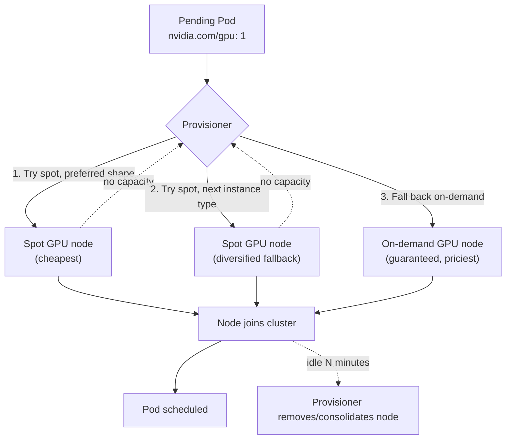
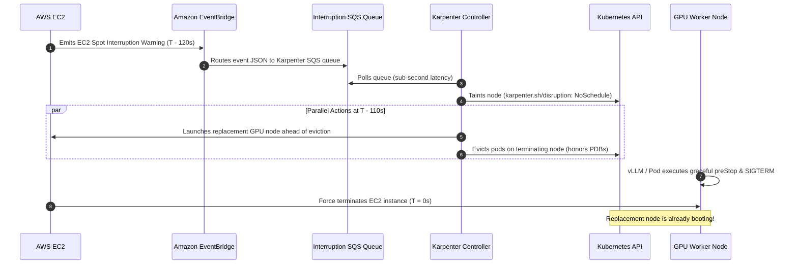

# 13 · Node Autoscaling and Cost

> Making the NODE layer elastic under your GPU workloads: Karpenter on EKS, spot diversification,
> image streaming, and how to actually see what any of this costs.

If you're new to both Kubernetes and GPU infrastructure: every chapter before this one ran on a
node group you (or `eksctl`) created once, up front, with a fixed number of machines. This chapter
is the first time something *other than you* decides when a new machine should exist. That's a
bigger conceptual jump than it sounds, so section 1 below spends real time on it before any command
runs.

## 0. Before you start

This chapter assumes:

- **A working cluster with GPU quota** from
  [00-prerequisites-and-cluster-setup](../00-prerequisites-and-cluster-setup) and the GPU Operator
  from [02-nvidia-gpu-operator](../02-nvidia-gpu-operator) — you don't reuse chapter 01's
  *fixed* node group directly (this chapter replaces it with elastic auto-provisioning), but the
  driver/quota prerequisites it depends on still need to be satisfied on the cluster.
- **`env.sh` and `versions.env` sourced** (`cp env.sh.example env.sh`, fill in your AWS account,
  then `source env.sh && source versions.env`) — needed for `EKS_CLUSTER`/`AWS_REGION`/`AWS_ACCOUNT_ID`.
- A Karpenter IAM role/instance profile and SQS interruption queue already provisioned (out of
  scope here — see step 1's comments and the Karpenter EKS getting-started guide in Further
  Reading), and `karpenter.sh/discovery=<cluster-name>` tags on your subnets/security groups
  (chapter 01/00's eksctl cluster sets these for you on the standard VPC).
- Not required but useful context: chapter 10's autoscaling-inference cold-start math (section 3.3
  there) assumes this chapter's node provisioning time as an input, and chapter 12's multi-node
  LWS groups are what section 5 here means by "consolidation can disrupt a stateful group."
- **If you're brand new to Kubernetes**: you should already be comfortable with `kubectl get/describe`,
  Deployments, and taints/tolerations from chapters 00–01. If "taint" and "toleration" don't ring a
  bell, go back to [01-gpu-nodes-and-scheduling](../01-gpu-nodes-and-scheduling) section 3 first —
  this chapter uses both heavily and doesn't re-explain them from scratch.

## 1. Why this matters

### 1.1 What every earlier chapter did (fixed node groups)

Every previous chapter assumed a node pool already existed (you ran the `eksctl create nodegroup`
command once in chapter 01 and reused it). A "node group" in that model is a fixed shelf of
machines: you told `eksctl` "give me 1 to 4 `g6.xlarge` spot instances," and AWS keeps that many
EC2 instances running (via an Auto Scaling Group) regardless of whether anything is actually
scheduled on them. If you need 5 GPUs and the group tops out at 4, you're stuck `Pending` until you
manually run `eksctl scale nodegroup` again. If you only ever use 1 GPU, you're still paying for
however many the group's minimum keeps warm. That's fine for a lab where you control exactly what
runs — it's the wrong model for production, where GPU demand is spiky: training jobs queue up
overnight, an inference service's traffic 10x's at 9am, and a *fixed* pool is either oversized
(paying for idle GPUs sitting there doing nothing) or undersized (Pods stuck `Pending` while
someone gets paged at 2am).

### 1.2 Cluster Autoscaler: scale the shelf, don't reshape it

The original fix for this, still the default on most non-EKS-managed Kubernetes and available as an
optional EKS add-on, is the **Cluster Autoscaler**. It watches for Pods stuck `Pending` because no
node has room, then adds more nodes *of a shape you already defined* to an existing node group (and
removes nodes when they sit empty/underutilized for a while). The key limitation: Cluster Autoscaler
can only scale node groups you pre-created — it picks *how many*, never *what kind*. If your
workloads need three different GPU shapes over time, you either pre-create three node groups and
hope you sized each one's min/max correctly, or you don't get that shape at all. It also can't
create a node group from nothing — someone still has to define the shelf before Cluster Autoscaler
can stock or empty it.

### 1.3 Karpenter: provision the right node, not just more of a fixed one

**Karpenter** removes the "pre-defined shelf" requirement entirely. Instead of managing the size of
node groups you created ahead of time, Karpenter watches for `Pending` Pods directly, works out
*from the Pod's own requirements* (GPU count, CPU/memory requests, tolerations, node selectors,
zone constraints) what the cheapest instance shape would satisfy them, and calls the EC2 `RunInstances`
API itself to launch exactly that instance — no managed node group involved at all for this capacity.
Three concrete differences from Cluster Autoscaler that matter in practice:

1. **No fixed node group shapes.** You describe a *range* of acceptable instance types/families in
   a `NodePool` (see 3.1) instead of pre-choosing one shape per group. Karpenter picks whichever
   available shape in that range is cheapest and satisfies the Pod.
2. **Bin-packing, not just counting.** Karpenter tries to pack Pods onto as few nodes as possible
   (and, on scale-down, consolidate underutilized nodes together) rather than just adding/removing
   whole nodes of one fixed size. This is also where the risk in section 5 comes from: bin-packing
   existing nodes tighter means moving Pods, which is a disruption.
3. **Direct EC2 API calls.** Karpenter talks to EC2 directly (`RunInstances`, `TerminateInstances`)
   instead of going through an Auto Scaling Group's desired-count field. A node it created is not a
   member of any ASG — nothing "resizes" a group; Karpenter creates and destroys individual
   instances one at a time as `NodeClaim` objects.
4. **Faster to add a genuinely new shape.** Because there's no per-shape group to create ahead of
   time, asking for a GPU type you've never used before doesn't require any new infrastructure setup
   — just a `NodePool` requirement that allows it.

The trade-off for all of this flexibility: Karpenter needs its own IAM permissions to call EC2
directly (the role/instance-profile prerequisite above), and because it's more automated, a
misconfigured `NodePool` can silently launch (and pay for) more or pricier capacity than you
intended if you don't also set `limits` (section 6).

### 1.4 The two objects that describe "what to launch": NodePool and EC2NodeClass

Karpenter splits "what shape of capacity is this?" into two Kubernetes custom resources you'll
apply in the lab:

- **`NodePool`** — the *scheduling* half: which capacity type (spot vs on-demand), which instance
  types/families, which architecture, what taints new nodes should carry, and the disruption/limits
  policy. This is the object Karpenter reads to decide "does a Pending Pod's requirements fit
  anything I'm allowed to launch here?"
- **`EC2NodeClass`** — the *infrastructure* half: which AMI, which IAM role, which subnets/security
  groups (matched by the `karpenter.sh/discovery` tag), and disk configuration. This is the
  cloud-specific "what does the actual EC2 instance look like" object — on GKE/AKS the equivalent
  object has a different name and API group, but the same job.

A `NodePool` always points at exactly one `EC2NodeClass` (via `nodeClassRef`); this chapter's two
`NodePool`s (`gpu-spot`, `gpu-ondemand`) both point at the same `gpu` `EC2NodeClass`, because they
should produce identically-configured nodes — the only difference between them is capacity type.
Section 3.1 walks the actual files field by field.

### 1.5 "Consolidation" — the cost feature that can also disrupt you

Because Karpenter creates individual nodes rather than resizing a fixed group, it can also be much
more aggressive about removing them: `consolidationPolicy: WhenEmptyOrUnderutilized` (used by both
`NodePool`s in this chapter) means Karpenter will proactively **cordon and drain** a node — moving
its Pods elsewhere or just terminating them if nothing else needs them — the moment it decides a
tighter bin-packing is possible, not just when a node is fully idle. That's good for cost (you stop
paying for a half-empty GPU node sooner) but it is a **voluntary disruption**: it can restart Pods
you didn't ask to restart. For a normal stateless Deployment that's a non-event. For chapter 12's
multi-node `LeaderWorkerSet` inference group, though, disrupting *any single Pod* in the group can
restart the *entire* multi-node group (depending on its restart policy) — an expensive, slow
operation for a serving workload. Section 5 covers the concrete mitigations; the point to internalize
now is that "the autoscaler will just clean up idle capacity for me" is not free when the workload
spans multiple nodes that need to stay together.

## 2. Learning objectives and time plan (~3 h)

By the end you can:

1. Explain the difference between the (older) Cluster Autoscaler model — fixed node pools it
   scales up/down — and Karpenter's node-auto-provisioning model, which creates the RIGHT shape
   node from scratch per pending Pod.
2. Configure spot-first-with-fallback as a ranked preference (Karpenter `NodePool` weight) instead
   of two node groups you manage by hand.
3. Explain what "spot diversification" buys you and configure it (multiple instance types/families
   in one `NodePool`).
4. Explain image streaming/preloading and why cold-start time matters as much as node price.
5. Read `kubectl get events`/cost-visibility tooling to answer "why is this Pod Pending" and
   "what did this GPU-hour cost."

| Time | Activity |
|---|---|
| 0:00–0:35 | Read section 3. Read `eks/nodepool.yaml` and `eks/ec2nodeclass.yaml` |
| 0:35–1:15 | Install Karpenter. Apply `eks/namespace.yaml` + `eks/scale-demo.yaml`, scale `scale-demo` up, time the Pending→Running gap |
| 1:15–1:45 | Force a spot-exhausted scenario (limit instance types to 1, request more GPUs than available) and watch fallback; force a second GPU node (Step 4) |
| 1:45–2:15 | Image streaming/preloading (section 6): compare cold-start with/without |
| 2:15–2:45 | Cost visibility tour (section 7): label-based cost allocation, the tools each cloud gives you |
| 2:45–3:00 | Checkpoint questions, cleanup (scale to 0, confirm nodes actually disappear) |

## 3. Concepts

### 3.1 From "scale a fixed pool" to "provision the right node"



**Reading this diagram if you've never seen this flow before:** nothing in this chapter "polls on a
timer." The whole loop is event-driven, triggered the instant a Pod can't be scheduled:

1. You (or a Deployment's replica count going up) create a Pod that requests `nvidia.com/gpu: 1`.
   The Kubernetes scheduler looks at every existing node and finds none with a free GPU (or none at
   all, if this is the very first GPU workload) — the Pod's `status.phase` becomes `Pending`. This
   is completely normal and expected; it's not an error by itself.
2. Karpenter's controller (the `Watch{Provisioner}` box) is subscribed to exactly these
   scheduling failures. It reads the Pending Pod's requirements (GPU count, CPU/memory, any
   `nodeSelector`/`tolerations`/zone constraints) and compares them against every `NodePool` you've
   applied, ordered by `weight` (higher weight = tried first).
3. For the first `NodePool` that could satisfy the Pod (`gpu-spot`, weight 10, in this chapter), it
   asks EC2 for a matching **spot** instance of one of the allowed types. If EC2 has none available
   (a "spot capacity" stockout for that instance type/AZ combination — this happens, especially for
   popular GPU shapes), Karpenter doesn't fail outright: it tries the *next* allowed instance type in
   the same `NodePool` (arrow 2 in the diagram — this is what "spot diversification," section 3.2,
   buys you). Only if every allowed spot shape in `gpu-spot` is unavailable does it move on to the
   next-lower-weight `NodePool` (`gpu-ondemand`, arrow 3), which asks for a guaranteed but pricier
   on-demand instance instead.
4. Once EC2 confirms an instance, Karpenter tracks it as a `NodeClaim` object while the machine
   boots, joins the cluster as a `Node`, and the kubelet reports it `Ready`. Only then does the
   scheduler actually place the originally-Pending Pod onto it — this is the "Pending → Running gap"
   you'll time by hand in Lab Step 2, and it's on the order of a minute or two for a fresh EC2
   instance (compare that to milliseconds for scheduling onto an already-`Ready` node — this gap is
   the real cost of scale-from-zero, which is why chapter 10's inference autoscaling math treats it
   as an input rather than assuming it's instant).
5. Later, if that node's workload scales back down (or was consolidated elsewhere) and the node sits
   empty or underutilized past `consolidateAfter` (5 minutes in this chapter's `NodePool`s),
   Karpenter proactively removes it — this is the "Consolidate" box, and it's the mechanism section
   1.5 above flagged as a double-edged sword: good for cost, disruptive if you weren't expecting a
   node under your Pods to disappear.

**Karpenter** — no managed node groups at all for autoscaled capacity. A `NodePool`
(scheduling constraints: capacity-type, instance-type, taints) + `EC2NodeClass` (AMI, IAM role,
subnets/SGs, disk) pair replaces eksctl `managedNodeGroups` for elastic capacity. Multiple
`NodePool`s with different `weight` implement fallback ordering — this chapter's `gpu-spot`
(weight 10) is tried before `gpu-ondemand` (weight 1).

Open [`eks/nodepool.yaml`](eks/nodepool.yaml) and [`eks/ec2nodeclass.yaml`](eks/ec2nodeclass.yaml)
side by side with this table — every field either object sets and why it's there:

| File | Field | What it controls |
|---|---|---|
| `nodepool.yaml` | `nodeClassRef` | Which `EC2NodeClass` supplies the AMI/IAM/networking for nodes from this pool — both pools here point at the same `gpu` class |
| `nodepool.yaml` | `requirements[karpenter.sh/capacity-type]` | Restricts this pool to `spot` (in `gpu-spot`) or `on-demand` (in `gpu-ondemand`) — this is what makes "spot-first" a ranked choice between two pools rather than a single flag |
| `nodepool.yaml` | `requirements[node.kubernetes.io/instance-type]` | The allowed instance shapes — `gpu-spot` lists two (`g6.xlarge`, `g4dn.xlarge`) for diversification; `gpu-ondemand` lists one, since it's a guaranteed fallback, not trying to be cheap |
| `nodepool.yaml` | `taints` | Every node this pool launches carries `nvidia.com/gpu=present:NoSchedule` so only Pods with the matching toleration (chapter 01's pattern) land on an expensive GPU node — `eks/scale-demo.yaml`'s Pod spec has this toleration already |
| `nodepool.yaml` | `disruption.consolidationPolicy` / `consolidateAfter` | Controls the "Consolidate" arrow in the diagram above — `WhenEmptyOrUnderutilized` + `5m` means Karpenter looks for bin-packing opportunities, not just fully-idle nodes, and waits 5 minutes of idleness before acting |
| `nodepool.yaml` | `limits` | A **hard cap** (CPU and GPU count) on how much this pool can ever provision at once — section 6 explains why this is the cheapest insurance policy in the whole chapter |
| `nodepool.yaml` | `weight` | Tie-breaks which pool Karpenter tries first when both could satisfy a Pod — higher wins; `gpu-spot: 10` beats `gpu-ondemand: 1` |
| `ec2nodeclass.yaml` | `role` | The IAM role EC2 instances launch with — must already exist (the "Karpenter IAM role" prerequisite above); `# VERIFY:` in the file flags that the exact role name depends on how you provisioned it |
| `ec2nodeclass.yaml` | `amiFamily` / `amiSelectorTerms` | Which base AMI new nodes boot from (`AL2023`, latest) — this is also where you'd point at a custom preloaded AMI (section 3.3) |
| `ec2nodeclass.yaml` | `subnetSelectorTerms` / `securityGroupSelectorTerms` | Karpenter discovers which subnets/SGs to launch into by matching the `karpenter.sh/discovery=<cluster>` tag, instead of you hardcoding subnet IDs |
| `ec2nodeclass.yaml` | `blockDeviceMappings` | Root EBS volume size/type for new nodes (100Gi gp3 here) — matters because a GPU node also needs room for pulled container images |

### 3.2 Spot-first, ranked, with real fallback

Karpenter expresses "try spot, try another spot shape, fall back on-demand" as separate
`NodePool`s: the higher-`weight` pool is tried first, and each has its own `requirements`/`limits`.
Concretely, if you're used to thinking of "spot vs on-demand" as one node group's setting you flip,
recalibrate: here it's *two entire `NodePool` objects*, and Karpenter's own logic — not a script you
write — decides which one actually gets used for any given Pending Pod, based purely on which one
can currently be satisfied.

**Spot diversification**: listing several instance types (`g6.xlarge` AND `g4dn.xlarge`; or
several GPU families) in one spot-seeking pool matters because spot capacity pools are
per-instance-type-per-AZ. If you only ever ask for `g6.xlarge` spot and that specific pool is
tight, you get nothing even if `g4dn.xlarge` spot is wide open next door. More eligible shapes =
lower chance of a stockout forcing an expensive fallback (or a `Pending` Pod). Concretely: AWS
tracks spot capacity separately for every (instance type, availability zone) pair — `g6.xlarge` in
`us-east-1a` can be completely out of spot capacity while `g6.xlarge` in `us-east-1b` or
`g4dn.xlarge` in either zone is fine. A `NodePool` that only allows one instance type is betting
everything on one of those narrow pools; a `NodePool` that allows several similar ones is spreading
that bet.

### 3.3 Image streaming and preloading

A cold GPU node pulling `vllm/vllm-openai:v0.29.0-cu129` (several GB) before a single Pod can
start is often the SLOWEST part of an autoscale event — slower than the node boot itself. Two
fixes:
- **Streaming** (containerd lazy-pulling / Seekable OCI-style streaming): start the container as
  soon as enough of the image is available, stream the rest in the background.
- **Preloading**: bake the image into the node's boot disk (a custom AMI on EKS) so there's no
  pull at all on a fresh node.

Chapter 05's storage-preloading pattern for model weights applies the same idea to container
images: bake it into the AMI instead of pulling it every cold start.

### 3.4 Spot Interruption & Rebalance Architecture (EventBridge + SQS)

Running GPU workloads on EC2 Spot capacity delivers 60%–70% cost savings, but comes with one ironclad rule: **AWS can reclaim any spot instance at any time with exactly two minutes' notice**.

Without automated interruption handling, those two minutes tick away unnoticed. AWS abruptly cuts power to the instance, causing hard connection resets for serving clients and catastrophic NCCL ring stalls for training jobs.

#### The 2-minute interruption lifecycle



#### The three events Karpenter handles

1. **Spot Interruption Warning (`aws.ec2 SpotInterruptionWarning`)**: The hard 2-minute termination notice. Karpenter immediately begins graceful draining and provisions a replacement node.
2. **Rebalance Recommendation (`aws.ec2 EC2InstanceRebalanceRecommendation`)**: A proactive signal emitted by AWS when a spot pool is experiencing elevated reclaim probability, often sent **minutes before** a formal interruption notice. Karpenter uses this to preemptively launch replacement capacity and migrate workloads before the hard countdown starts.
3. **Scheduled Change / Health Events (`aws.health AWS_EC2_PERSISTENT_INSTANCE_RETIREMENT_SCHEDULED`)**: Hardware retirement or planned host maintenance.

#### Why parallel provisioning matters

In a naive setup, draining happens first, and only after the instance disappears does the autoscaler notice `Pending` pods and start an EC2 instance. That adds another 3–5 minutes of downtime on top of the termination!

Karpenter initiates **parallel provisioning**: the moment the SQS message is consumed, it provisions replacement capacity while the terminating node is draining. By the time the old node is terminated, the new GPU node is already pulling images or warming weights, cutting failover downtime by over 80%.

## 4. Lab

```bash
cp env.sh.example env.sh   # repo root, if not already done
source env.sh && source versions.env
```

Why this first: everything below reads `$EKS_CLUSTER`, `$AWS_REGION`, and `$KARPENTER_VERSION` from
these two files (`envsubst` and the Helm `--version` flag both depend on them being set in your
current shell). If you skip this and a later command fails with an empty/unbound variable, come
back here — it almost always means a fresh shell that never sourced `env.sh`.

### Step 1: Install Karpenter and apply the NodePool/EC2NodeClass pair

What you're about to do: install the Karpenter controller via Helm (pinned from `versions.env`),
then apply the `EC2NodeClass`/`NodePool` pair — cluster-scoped, so applied directly with
`kubectl apply -f`, after `envsubst` fills in `${EKS_CLUSTER}`. This assumes the
Karpenter IAM role/instance profile + SQS interruption queue already exist (out of scope for a
manifests-only chapter; see the Karpenter EKS getting-started guide in Further Reading for
`eksctl create iamserviceaccount` / CloudFormation prerequisites, or use
`karpenter-provider-aws`'s `cloudformation.yaml` template) and that the role is named
`KarpenterNodeRole-${EKS_CLUSTER}` (matches `ec2nodeclass.yaml`).

Karpenter itself runs as a regular Deployment in `kube-system` — it is not part of the EKS control
plane, which is why you install it with Helm like any other cluster add-on, and why it needs its
own IAM permissions to call the EC2 API on your behalf.

```bash
helm upgrade --install karpenter oci://public.ecr.aws/karpenter/karpenter \
  --version "$KARPENTER_VERSION" \
  --namespace kube-system \
  --set settings.clusterName="$EKS_CLUSTER" \
  --set settings.interruptionQueue="$EKS_CLUSTER" \
  --set controller.resources.requests.cpu=1 \
  --set controller.resources.requests.memory=1Gi \
  --wait --timeout 5m

envsubst < 13-node-autoscaling-and-cost/eks/ec2nodeclass.yaml | kubectl apply --server-side -f -
envsubst < 13-node-autoscaling-and-cost/eks/nodepool.yaml     | kubectl apply --server-side -f -
kubectl apply -f 13-node-autoscaling-and-cost/eks/namespace.yaml
kubectl apply -f 13-node-autoscaling-and-cost/eks/scale-demo.yaml

kubectl get nodepools.karpenter.sh
```

What each part of that block is doing, in order:
- `helm upgrade --install ... --namespace kube-system` installs Karpenter's controller (idempotent —
  safe to re-run if you need to change a setting). `settings.clusterName` tells Karpenter which EKS
  cluster's API it's managing capacity for; `settings.interruptionQueue` points it at the SQS queue
  that receives AWS's 2-minute spot-interruption warnings, so Karpenter can gracefully drain a Pod
  *before* AWS reclaims the spot instance under it, instead of the Pod just vanishing.
  `controller.resources.requests.*` sizes the controller's own Pod (it needs to run somewhere too —
  by default on whatever CPU-only nodes you already have, before any GPU node exists).
- `envsubst < ... | kubectl apply --server-side -f -` : `envsubst` is a small Unix tool that replaces
  `${EKS_CLUSTER}` placeholders in the YAML with your shell's actual value (from `env.sh`) before the
  YAML reaches `kubectl` — this is why `ec2nodeclass.yaml` contains a literal `${EKS_CLUSTER}` string
  in the repo instead of your account-specific cluster name. `--server-side` asks the API server (not
  your local `kubectl`) to compute the merge/patch, which handles Karpenter's CRDs more reliably than
  client-side apply.
- These two objects are applied directly with `kubectl apply -f -` rather than through a plain
  `kubectl apply -f eks/` sweep because they're cluster-scoped (no namespace) and need the `envsubst`
  substitution step first — plain YAML doesn't have a templating mechanism of its own, so the repo
  just pipes them through `envsubst` directly, the same pattern chapter 05 uses for its
  cloud-specific scripts.
- `kubectl apply -f 13-node-autoscaling-and-cost/eks/namespace.yaml` then
  `kubectl apply -f 13-node-autoscaling-and-cost/eks/scale-demo.yaml` apply everything else in this
  chapter's EKS manifests (the namespace, then the `scale-demo` workload) — every remaining file
  under `eks/` is a complete, standalone manifest with its `metadata.namespace` set, so the
  namespace has to exist first, same order as chapter 00's Step 5.

**Expected output**: Karpenter `${KARPENTER_VERSION}` installed; a `kubectl get nodepools.karpenter.sh`
table showing `gpu-spot` (weight 10) and `gpu-ondemand` (weight 1).

**How to tell this worked**: `kubectl get nodepools.karpenter.sh` lists `gpu-spot` and
`gpu-ondemand`; `kubectl -n kube-system get pods -l app.kubernetes.io/name=karpenter` shows the
controller `Running`.

### Step 2: Scale up and time the Pending → Running gap

What you're about to do: scale the idle `scale-demo` Deployment from 0 to 2 replicas and watch a
brand-new GPU node get provisioned from scratch — this is the number section 3.3 and chapter 10's
cold-start math build on. `scale-demo` starts at `replicas: 0` on purpose (see
`eks/scale-demo.yaml`) precisely so that scaling it up is the trigger you control by hand.

```bash
date; kubectl scale -n ch13-autoscale deploy/scale-demo --replicas=2
kubectl get nodeclaims --watch   # Ctrl-C once status shows Initialized
```

`date` just timestamps the moment you triggered the scale-up, so you can eyeball the gap against
the `NodeClaim` timestamps you'll see next. `kubectl get nodeclaims --watch` streams live updates
to Karpenter's `NodeClaim` objects (one per EC2 instance Karpenter is managing) — `--watch` keeps
the terminal open and prints a new line every time the object changes state, instead of you having
to re-run `kubectl get` in a loop. Press Ctrl-C once you see `Initialized` — that's a manual stop,
not something the command does for you.

**Expected output**: `kubectl get nodeclaims` shows a `NodeClaim` transition
`Launched -> Registered -> Initialized` (Karpenter provisions the EC2 instance directly, faster
than a fresh managed node group would). In plain terms: `Launched` means the EC2 `RunInstances` call
succeeded and a VM exists; `Registered` means that VM's kubelet has joined the Kubernetes API server
as a `Node` object; `Initialized` means the node has finished any startup taints/labels and is ready
to actually receive Pods. Your `scale-demo` Pods go from `Pending` to `Running` shortly after
`Initialized`.

**How to tell this worked**: `kubectl get nodepools.karpenter.sh gpu-spot -o wide` shows its node
count go from 0 to 1-2, and `kubectl get pods -n ch13-autoscale` shows both Pods `Running`.

### Step 3: Force the fallback path

What you're about to do: make the spot pool unsatisfiable on purpose and confirm the SECOND
priority / `gpu-ondemand` NodePool takes over instead of Pods staying `Pending` forever — proving
the fallback ordering actually works, not just the happy path. This matters because "we configured
a fallback" and "the fallback actually fires when it needs to" are different claims, and the second
one is the one that saves you from a page at 2am.

```bash
kubectl scale -n ch13-autoscale deploy/scale-demo --replicas=0   # reset first
kubectl patch nodepool gpu-spot --type=json \
  -p='[{"op":"replace","path":"/spec/template/spec/requirements/1/values","value":["g6.48xlarge"]}]'
kubectl scale -n ch13-autoscale deploy/scale-demo --replicas=2
kubectl get pods -n ch13-autoscale -o wide --watch
```

Walking through why each line is there: scaling to 0 first tears down the nodes Step 2 created, so
you're starting the fallback test from a clean slate rather than reusing an already-`Running` Pod
that would never re-trigger provisioning. The `kubectl patch ... --type=json` is a **JSON patch** —
it edits one specific field (`requirements[1].values`, the instance-type list) in the *live* object
on the cluster without you having to re-apply the whole file; here it swaps `gpu-spot`'s allowed
instance types to `g6.48xlarge` only, a huge and (usually) spot-scarce instance size, deliberately
making the spot pool practically impossible to satisfy. Scaling back to 2 then re-triggers the exact
same Pending-Pod flow from section 3.1 — except this time `gpu-spot` can't win, so by the diagram's
arrow 3, `gpu-ondemand` should.

**Expected output**: the spot pool now can't be satisfied (`g6.48xlarge` has no spot capacity), so
after the provisioner gives up on it, the Pods still reach `Running` — just on a node from
`gpu-ondemand` instead.

**How to tell this worked**:
```bash
kubectl get pods -n ch13-autoscale -o wide   # note the NODE column
kubectl get nodes <node-from-above> -o jsonpath='{.metadata.labels.karpenter\.sh/capacity-type}{"\n"}'
```
prints `on-demand` instead of `spot` — confirming the fallback fired. The first command shows you
*which* node your Pods actually landed on (the `NODE` column); the second reads that specific node's
`karpenter.sh/capacity-type` label with `jsonpath` (a way to pull one field out of `kubectl`'s JSON
output instead of eyeballing a full `describe`) — this is the one piece of ground truth that proves
fallback happened, since a Pod reaching `Running` on its own doesn't tell you which pool won.
Revert the patch (`envsubst < 13-node-autoscaling-and-cost/eks/nodepool.yaml | kubectl apply
--server-side -f -`) before continuing — otherwise `gpu-spot` stays stuck on the huge instance type
for the rest of the chapter.

### Step 4: Force a second real GPU node (bin-packing, not just one-node scale-from-zero)

What you're about to do: revert Step 3's patch, then scale `scale-demo` past what a single GPU
node can hold, so you watch Karpenter provision a **second** GPU node from scratch instead of just
the first scale-from-zero node Step 2 already showed you. Step 2 proves "0 → 1 node"; this step
proves the same mechanism keeps working at "1 → 2 nodes," which is the actual shape of a real
training/serving traffic spike (demand keeps growing, not just going from none to some).

```bash
# Revert Step 3's patch first, if you haven't already, so gpu-spot is back to its normal shape.
envsubst < 13-node-autoscaling-and-cost/eks/nodepool.yaml | kubectl apply --server-side -f -
kubectl -n ch13-autoscale scale deploy/scale-demo --replicas=0
kubectl get nodeclaims   # confirm you're starting from 0 GPU NodeClaims

date; kubectl scale -n ch13-autoscale deploy/scale-demo --replicas=4
kubectl get nodeclaims --watch   # Ctrl-C once you see 2 NodeClaims reach Initialized
```

Each `scale-demo` Pod requests exactly 1 GPU, and `g6.xlarge`/`g4dn.xlarge` each expose exactly 1
GPU, so 4 replicas cannot fit on one node — Karpenter has to launch a second GPU `NodeClaim` to
schedule the overflow Pods, the same event-driven loop from section 3.1's diagram, triggered twice
in a row.

**Expected output**: `kubectl get nodeclaims` shows two GPU `NodeClaim`s reach `Initialized`
(likely a few minutes apart, not simultaneously — Karpenter provisions greedily as Pods go
`Pending`, it doesn't batch multiple nodes into one launch), and `kubectl get pods -n
ch13-autoscale -o wide` shows all 4 Pods `Running`, split across two different `NODE` values.

**How to tell this worked**: `kubectl get nodes -l karpenter.sh/nodepool=gpu-spot` (or
`gpu-ondemand`, if spot was exhausted) lists 2 nodes, and no `scale-demo` Pod stays `Pending`.
Scale back down afterwards so you're not paying for 2 idle GPU nodes:
```bash
kubectl -n ch13-autoscale scale deploy/scale-demo --replicas=0
```

## 5. Spot considerations

This ENTIRE chapter is spot considerations — the autoscaler is the thing that makes spot
practical at all (manually swapping between spot and on-demand node pools doesn't scale). Three
points specific to the node-autoscaling layer itself, beyond what chapters 01/09/12 already cover
for the workloads running on top of it:

1. **Consolidation isn't free**: `consolidationPolicy: WhenEmptyOrUnderutilized` will move Pods
   (by cordoning + draining) to bin-pack nodes tighter, which is itself a voluntary disruption —
   respect PodDisruptionBudgets the same way chapter 09 does, or a stateful multi-node LWS group
   (chapter 12) can get shuffled mid-run. Concretely: if a `LeaderWorkerSet` group's leader and
   workers happen to land across two GPU nodes, and Karpenter later decides it can consolidate one
   of those nodes into another, evicting even one worker Pod from that group can — depending on the
   group's restart policy — restart the *entire* multi-node serving group, not just the one Pod.
   That's a multi-minute reload for a production inference endpoint over what was, from the node
   layer's point of view, a routine cost optimization. The concrete mitigations: a PodDisruptionBudget
   tight enough to block the eviction, a separate `NodePool` for LWS nodes with disruption disabled or
   a long `consolidateAfter`, or accepting the periodic reload as a known cost.
2. **Provisioning a brand-new node with Karpenter is still not instant** — a fresh EC2 instance
   takes on the order of a minute or two to launch, boot, and register, which is faster than
   creating an entirely new managed node group but still real latency; factor that into how
   aggressively you can rely on scale-from-zero for latency-sensitive inference. Chapter 10's
   `10-autoscaling-inference` pre-scaling/cold-start math assumes THIS chapter's node provisioning
   time as an input — if you skipped timing Step 2, that's the number to go back and capture.
3. **Diversify within a class, not across it**: `g6.xlarge` and `g4dn.xlarge` are both single-GPU,
   similar price/perf, safe to treat as interchangeable spot fallbacks. Don't diversify into a
   completely different GPU class (e.g., falling back from L4 to A100) without your workload
   actually being portable across that memory/compute jump — chapter 09's `--gpu-memory-utilization`
   and TP settings are tuned per-GPU-type.

## 6. Cost visibility

- **Label-based allocation**: every workload in this repo carries
  `app.kubernetes.io/part-of: chNN-...` — feed that into
  [AWS Cost Explorer with Kubernetes cost allocation tags](https://docs.aws.amazon.com/cur/latest/userguide/env-eks.html)
  or [Kubecost](https://www.kubecost.com/) to see spend per chapter/team, not just per cluster.
  Karpenter's own `NodePool` `limits` are your hard cost ceiling per pool.
- Cheapest thing you can do: **`limits` on every autoscaled NodePool** (this chapter's manifests
  all set one) — a runaway scale-up (bad HPA config, bug in a batch job fan-out) hits a hard
  ceiling instead of your bill. Concretely, `gpu-spot`'s `limits.nvidia.com/gpu: "8"` means Karpenter
  will refuse to provision an 9th GPU's worth of capacity from that pool no matter how many Pods are
  Pending — the excess Pods simply stay `Pending` (visible, debuggable) instead of your bill growing
  unbounded (invisible until the invoice arrives). Since this whole chapter is about the layer that
  spends your money automatically on your behalf, treat `limits` as non-optional, not a nice-to-have.

## 7. Troubleshooting

| Symptom | Likely cause | Why this happens | Fix |
|---|---|---|---|
| Pod stays `Pending`, no node appears | Karpenter not installed, or NodePool `requirements` don't match the Pod's taints/nodeSelector/resources | Karpenter can only provision for a Pod whose requirements are a subset of what some `NodePool` allows — a Pod asking for a GPU type not listed in any `NodePool`'s `requirements`, or missing a toleration for the taint a `NodePool` applies, will sit Pending forever with no error, because from the scheduler's point of view "no node fits" is a normal, silent state, not a failure | `kubectl describe pod`; check `kubectl logs -n kube-system -l app.kubernetes.io/name=karpenter` |
| Node appears but Pod still `Pending` | Taint without matching toleration (every overlay here needs `nvidia.com/gpu` + the spot taint) | Karpenter successfully launched a node, but taints and tolerations are evaluated by the *scheduler*, independently of Karpenter — a new GPU node's `nvidia.com/gpu=present:NoSchedule` taint repels any Pod that doesn't explicitly tolerate it, even though the node has free GPU capacity sitting right there | `kubectl describe node`; compare taints to the Pod's `tolerations` |
| Karpenter NodeClaim stuck `Launching` | IAM role/instance profile missing or misnamed, subnet/SG discovery tags absent | Karpenter's EC2 `RunInstances` call is failing server-side (bad IAM role, no matching subnet/SG found by the `karpenter.sh/discovery` tag) — the `NodeClaim` object exists in Kubernetes because Karpenter *decided* to launch something, but the actual AWS API call behind it is erroring out, which won't show up in `kubectl describe pod` at all | Confirm `EC2NodeClass.spec.role` matches an existing IAM role; confirm `karpenter.sh/discovery` tags on subnets/SGs |
| Fallback (on-demand) NodePool never used even when spot is exhausted | `weight` ordering wrong, or the fallback pool's own `requirements` also can't be satisfied | If `gpu-ondemand`'s `weight` were accidentally set higher than `gpu-spot`'s, it would be tried FIRST every time, defeating the entire spot-first design silently — or if `gpu-ondemand`'s own `limits` are already maxed out from earlier Pods, it's just as unsatisfiable as the spot pool was | Check `limits` aren't already exhausted on the fallback pool; verify weight ordering |
| Node created but takes minutes before Pod starts | No image streaming/preloading — full image pull on a cold node | A brand-new EC2 instance has an empty local container image cache — the first Pod scheduled to it has to pull the entire image (potentially several GB for a vLLM/CUDA image) sequentially over the network before the container can even start, and this pull time is invisible in `kubectl get pods` (it just shows `ContainerCreating`) unless you check events | See section 3.3; compare with a preloaded/streamed image |
| Node never scales back down | PodDisruptionBudget blocking eviction, or `consolidateAfter` too long, or a DaemonSet-only node looking "non-empty" | Consolidation is voluntary and cooperative — Karpenter will not force through a PDB violation, so a Pod protected by a strict PDB (or a `consolidateAfter` you set generously long for stability) can keep a node alive and billing long after its "real" workload is gone; a node running only DaemonSet Pods (log shippers, CNI, etc.) looks occupied at a glance even though it has no application Pods left | `kubectl get pdb`; lower `consolidateAfter` for testing; DaemonSet Pods don't block consolidation by default but confirm none of yours pin the node another way |

## 8. Cleanup and cost notes

What you're about to do: scale `scale-demo` to 0 first so Karpenter's `consolidateAfter` fires and
terminates the EC2 instances (Karpenter nodes are NOT part of any eksctl-managed ASG — they
disappear when Karpenter decides to, not when a node group is deleted), then remove the chapter's
workloads and the `NodePool`.

```bash
kubectl -n ch13-autoscale scale deploy/scale-demo --replicas=0
kubectl delete -f 13-node-autoscaling-and-cost/eks/scale-demo.yaml --ignore-not-found
kubectl delete -f 13-node-autoscaling-and-cost/eks/namespace.yaml --ignore-not-found
kubectl delete -f 13-node-autoscaling-and-cost/eks/nodepool.yaml --ignore-not-found
```

Scaling to 0 first (rather than deleting the `NodePool` immediately) matters because it lets
Karpenter's normal consolidation/deprovisioning path terminate the underlying EC2 instances
cleanly; deleting the `NodePool` object out from under running `NodeClaim`s can leave orphaned
instances that Karpenter no longer tracks — you'd have to find and terminate those by hand in the
EC2 console.

**GPU nodes from an autoscaler disappear on their own** once `scale-demo` is scaled to 0 and
`consolidateAfter` elapses — but always run `kubectl get nodes` a few minutes after cleanup and
check the EC2 console if you're stepping away; a stuck PDB or a leftover DaemonSet Pod can pin a
node indefinitely and you'll pay for it overnight. GPU instances (even spot `g6.xlarge`/`g4dn.xlarge`)
are the most expensive line item in this entire course per hour — treat "did the nodes actually
disappear" as a mandatory last step, not an optional one, every single time you finish a session in
this chapter.

## 9. Checkpoint questions

<details>
<summary>1. What's the core behavioral difference between the old "Cluster Autoscaler scales a fixed node pool" model and GKE NAP / Karpenter / AKS NAP?</summary>

The old model only adds/removes nodes of a shape you pre-defined in a node pool. The newer
provisioners create the node pool/shape itself on demand, computed from what's actually Pending,
so you don't pre-guess every instance type/size you'll need.
</details>

<details>
<summary>2. How do you express "try spot first, fall back to on-demand" differently on GKE vs Karpenter (EKS/AKS)?</summary>

GKE: one `ComputeClass` with an ordered `priorities` list (spot entries before on-demand).
Karpenter (EKS/AKS, same API): two separate `NodePool`s with different `spec.weight` — the
higher-weight (spot) pool is tried first.
</details>

<details>
<summary>3. Why does listing multiple instance types in one spot-seeking NodePool reduce Pending time?</summary>

Spot capacity is allocated per instance-type-per-AZ. If your NodePool can be satisfied by ANY of
several similar instance types, Karpenter/the provisioner can succeed on whichever one currently
has spare spot capacity instead of failing when your single preferred type is temporarily out.
</details>

<details>
<summary>4. What problem does DWS flex-start solve that plain spot and plain on-demand don't?</summary>

It gets you a short queued wait (rather than an immediate failure) for scarce on-demand-priced
GPU capacity at a discount versus a standing reservation — useful when you need availability
better than spot (no reclaim risk once granted) but can tolerate a short startup delay, for SKUs
where even on-demand can be hard to get instantly.
</details>

<details>
<summary>5. Why is AKS's AKSNodeClass a different API group from EKS's EC2NodeClass, but the NodePool the same?</summary>

Node Auto Provisioning on AKS is literally the open-source Karpenter project with an Azure cloud
provider plugin, so the cloud-agnostic scheduling object (`NodePool`, `karpenter.sh/v1`) is
shared, while the cloud-specific "what does the node actually look like" object
(`EC2NodeClass`/`AKSNodeClass`) has its own API group per cloud provider implementation.
</details>

<details>
<summary>6. Why can image pulling dominate autoscale latency more than the node boot itself?</summary>

A multi-gigabyte container image (vLLM images are several GB) pulled cold, sequentially, over the
node's network can take longer than the VM boot + kubelet registration. Image streaming lets the
container start before the full image is local; preloading (baked into the boot disk/AMI/node
image) removes the pull from the critical path entirely.
</details>

<details>
<summary>7. Why does `consolidationPolicy: WhenEmptyOrUnderutilized` matter for the chapter 12 multi-node LWS workload specifically?</summary>

Consolidation can drain/move Pods to bin-pack nodes tighter, which is a voluntary disruption. For
an `LeaderWorkerSet` group with `RecreateGroupOnPodRestart`, disrupting ANY one Pod in the group
(leader or worker) via consolidation restarts the WHOLE group — so latency-sensitive multi-node
serving needs either a PDB that blocks it, a NodePool that excludes those nodes from
consolidation, or acceptance of periodic reload cost.
</details>

<details>
<summary>8. What's the cheapest safeguard against a runaway autoscale event costing you real money?</summary>

Set `limits` (cpu/memory/GPU count) on every autoscaled NodePool/ComputeClass — this repo's
manifests all do it — so a bug (bad HPA target, runaway batch fan-out) hits a hard resource
ceiling instead of an unbounded bill.
</details>

<details>
<summary>9. In step 3, after patching the spot pool unsatisfiable, how do you PROVE the Pod landed on the on-demand fallback rather than just assume it because it eventually went <code>Running</code>?</summary>

Check the actual node's capacity-type label, not just Pod status — `kubectl get nodes
<node> -o jsonpath='{.metadata.labels.karpenter\.sh/capacity-type}'` (Karpenter/NAP) or
`cloud.google.com/gke-spot` (GKE). A Pod reaching `Running` only tells you scheduling succeeded
somewhere; the label is what confirms which NodePool/priority actually won.
</details>

<details>
<summary>10. A first-timer's Deployment scale-up sits Pending for over five minutes with no node created, and Karpenter is confirmed Running. What's the first thing to check, and why?</summary>

Compare the Pod's resource requests, `nodeSelector`/tolerations, and any zone constraints against
every `NodePool`'s `requirements` and `taints` — Karpenter can only launch a node that satisfies a
Pod whose needs are a *subset* of some `NodePool`'s allowed shapes. A single mismatched
requirement (an instance type not listed, a missing toleration for the pool's taint, an
architecture the pool doesn't allow) makes the Pod permanently unsatisfiable, and Karpenter fails
silently rather than erroring — there's no node to `describe` yet, so `kubectl describe pod` and
its `Events` section (not node state) is where the mismatch actually surfaces.
</details>

## 10. Further reading

- [GKE: About custom ComputeClasses](https://docs.cloud.google.com/kubernetes-engine/docs/concepts/about-custom-compute-classes)
- [GKE: DWS flex-start on GKE](https://docs.cloud.google.com/kubernetes-engine/docs/concepts/dws)
- [Karpenter concepts: NodePools](https://karpenter.sh/docs/concepts/nodepools/) /
  [NodeClasses](https://karpenter.sh/docs/concepts/nodeclasses/)
- [AKS: Node auto-provisioning overview](https://learn.microsoft.com/en-us/azure/aks/node-auto-provisioning)
- [AKS: AKSNodeClass reference](https://learn.microsoft.com/en-us/azure/aks/node-auto-provisioning-aksnodeclass)
- [GKE image streaming](https://cloud.google.com/kubernetes-engine/docs/how-to/image-streaming)
- [OpenCost](https://www.opencost.io/) / [Kubecost](https://www.kubecost.com/)
- Cross-links: [01-gpu-nodes-and-scheduling](../01-gpu-nodes-and-scheduling) (the fixed pools this
  chapter replaces with elastic ones), [05-model-storage-and-data](../05-model-storage-and-data)
  (secondary boot disk preloading), [06-batch-jobs-and-kueue](../06-batch-jobs-and-kueue)
  (ResourceFlavors are the Kueue-side half of spot/on-demand), [10-autoscaling-inference](../10-autoscaling-inference)
  (Pod-level autoscaling this chapter's node-level autoscaling has to keep up with),
  [12-inference-gateway-and-multinode-serving](../12-inference-gateway-and-multinode-serving)
  (multi-node LWS groups this chapter's consolidation can disrupt)

### Versions tested

From `versions.env`: `KARPENTER_VERSION=1.14.1`. GKE and AKS NAP have no separate chart/CLI
version to pin (features of the managed control plane / `az aks` CLI, gated by cluster/CLI
version instead — see prerequisites noted in each script).

---

[← Prev: 12-inference-gateway-and-multinode-serving](../12-inference-gateway-and-multinode-serving) | [Course Map](../README.md) | [Next: 14-multi-tenancy-and-security →](../14-multi-tenancy-and-security)