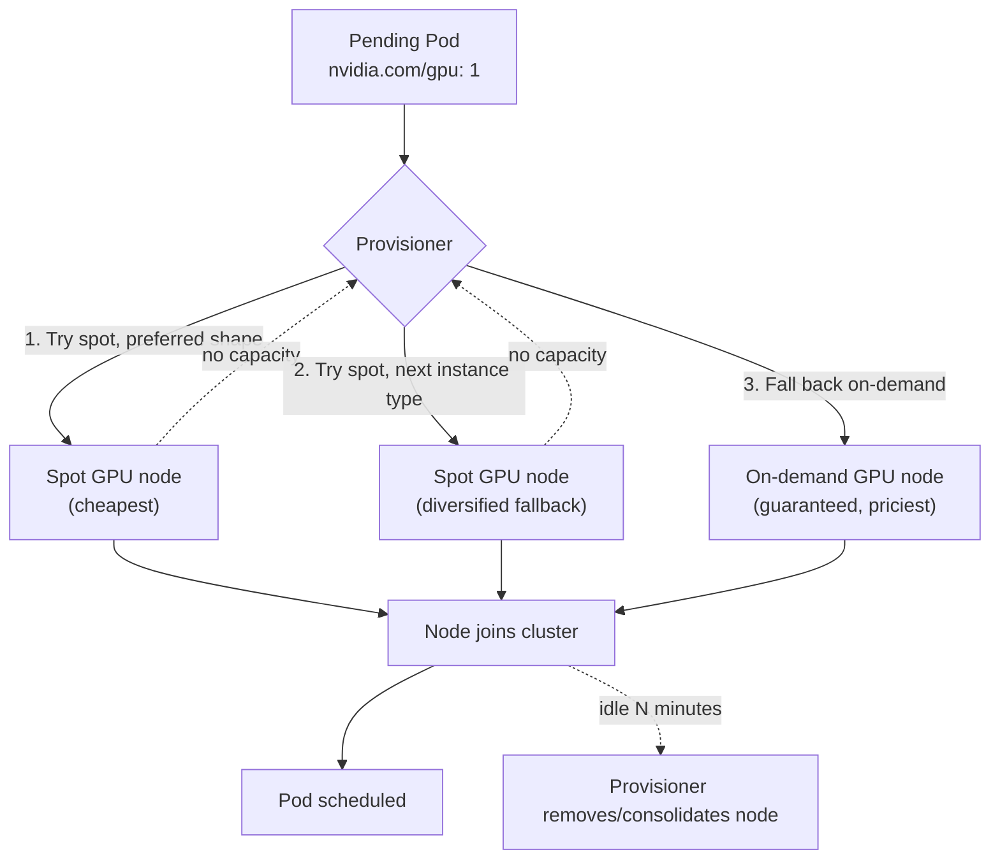

# 13 · Node Autoscaling and Cost

> Making the NODE layer elastic under your GPU workloads: GKE Node Auto-Provisioning +
> ComputeClasses + DWS flex-start, Karpenter on EKS, AKS Node Auto Provisioning (Karpenter-based),
> spot diversification, image streaming, and how to actually see what any of this costs.

## Before you start

This chapter assumes:

- **A working cluster with GPU quota** from
  [00-prerequisites-and-cluster-setup](../00-prerequisites-and-cluster-setup) and the GPU Operator
  from [02-gpu-operator-and-drivers](../02-gpu-operator-and-drivers) — you don't reuse chapter 01's
  *fixed* node pool directly (this chapter replaces it with elastic auto-provisioning), but the
  driver/quota prerequisites it depends on still need to be satisfied on the cluster.
- **`env.sh` and `versions.env` sourced** (`cp env.sh.example env.sh`, fill in your
  project/account/subscription, then `source env.sh && source versions.env`) — needed for
  `PROJECT_ID`/`GKE_CLUSTER`/`ZONE` (GKE), `EKS_CLUSTER`/`AWS_REGION`/`AWS_ACCOUNT_ID` (EKS), or
  `AZ_RESOURCE_GROUP`/`AKS_CLUSTER` (AKS).
- **EKS only**: a Karpenter IAM role/instance profile and SQS interruption queue already
  provisioned (out of scope here — see `eks/install-karpenter.sh`'s comments and the Karpenter EKS
  getting-started guide in Further Reading), and `karpenter.sh/discovery=<cluster-name>` tags on
  your subnets/security groups (chapter 01/00's eksctl cluster sets these for you on the standard
  VPC).
- **AKS only**: Azure CLI >= 2.76.0 and a cluster using a Standard Load Balancer (NAP is
  incompatible with Basic Load Balancer, Windows node pools, and IPv6 clusters).
- Not required but useful context: chapter 10's autoscaling-inference cold-start math (section 3.3
  there) assumes this chapter's node provisioning time as an input, and chapter 12's multi-node
  LWS groups are what section 5 here means by "consolidation can disrupt a stateful group."

## 1. Why this matters

Every previous chapter assumed a node pool already existed (you ran `create-gpu-nodepool.sh`
once in chapter 01 and reused it). That's fine for a lab; it's wrong for production, where GPU
demand is spiky — training jobs queue up overnight, an inference service's traffic 10x's at 9am —
and a *fixed* pool is either oversized (paying for idle GPUs) or undersized (Pods `Pending` while
someone gets paged). The **Cluster Autoscaler** family of controllers exists to close that gap:
watch for `Pending` Pods, figure out what node shape would let them schedule, create it; watch for
empty/underutilized nodes, remove them. This chapter is about configuring that loop correctly —
spot-first with a real fallback, several instance types so one stockout doesn't block you, and
node images that don't spend 5 of your 10 GPU-minutes pulling a 20 GiB container.

## 2. Learning objectives and time plan (~3 h)

By the end you can:

1. Explain the difference between the (older) Cluster Autoscaler model — fixed node pools it
   scales up/down — and the newer node-auto-provisioning model (GKE NAP/ComputeClasses, Karpenter,
   AKS NAP) that creates the RIGHT shape node from scratch per pending Pod.
2. Configure spot-first-with-fallback as a ranked preference (GKE ComputeClass `priorities`,
   Karpenter `NodePool` weight) instead of two node pools you manage by hand.
3. Explain what "spot diversification" buys you and configure it (multiple instance types/families
   in one NodePool/ComputeClass).
4. Explain GKE's DWS flex-start and when it's useful even for on-demand-priced capacity.
5. Explain image streaming/preloading and why cold-start time matters as much as node price.
6. Read `kubectl get events`/cost-visibility tooling to answer "why is this Pod Pending" and
   "what did this GPU-hour cost."

| Time | Activity |
|---|---|
| 0:00–0:35 | Read section 3. Compare `gke/computeclass.yaml` vs `eks/nodepool.yaml` vs `aks/nodepool.yaml` side by side |
| 0:35–1:15 | Install your cloud's provisioner. Deploy `common/`, scale `scale-demo` up, time the Pending→Running gap |
| 1:15–1:45 | Force a spot-exhausted scenario (limit instance types to 1, request more GPUs than available) and watch fallback |
| 1:45–2:15 | Image streaming/preloading (section 6): compare cold-start with/without |
| 2:15–2:45 | Cost visibility tour (section 7): label-based cost allocation, the tools each cloud gives you |
| 2:45–3:00 | Checkpoint questions, cleanup (scale to 0, confirm nodes actually disappear) |

## 3. Concepts

### 3.1 From "scale a fixed pool" to "provision the right node"



- **GKE**: Node Auto-Provisioning (NAP) + **ComputeClass** — a ranked `priorities` list a Pod
  opts into via `nodeSelector: cloud.google.com/compute-class: <name>`. NAP creates
  (and later removes) whatever node pool shape satisfies the highest-priority entry with capacity.
- **EKS**: **Karpenter** — no managed node groups at all for autoscaled capacity. A `NodePool`
  (scheduling constraints: capacity-type, instance-type, taints) + `EC2NodeClass` (AMI, IAM role,
  subnets/SGs, disk) pair replaces eksctl `managedNodeGroups` for elastic capacity. Multiple
  `NodePool`s with different `weight` implement fallback ordering.
- **AKS**: **Node Auto Provisioning (NAP)** — literally the Azure port of Karpenter
  (`karpenter-provider-azure`), same `karpenter.sh/v1` `NodePool` API as EKS, with an
  Azure-specific `AKSNodeClass` (`karpenter.azure.com/v1beta1`) instead of `EC2NodeClass`.
  Enabled via `az aks update --node-provisioning-mode Auto`.

### 3.2 Spot-first, ranked, with real fallback

All three approaches express the same idea — try spot, try another spot shape, fall back
on-demand — just with different syntax:

| | Mechanism |
|---|---|
| GKE ComputeClass | ordered `spec.priorities` list, first match with capacity wins |
| Karpenter NodePool | separate `NodePool`s, higher `weight` tried first, each with its own `requirements`/`limits` |
| AKS NAP | same as Karpenter (it IS Karpenter) |

**Spot diversification**: listing several instance types (`g6.xlarge` AND `g4dn.xlarge`; or
several GPU families) in one spot-seeking pool matters because spot capacity pools are
per-instance-type-per-AZ. If you only ever ask for `g6.xlarge` spot and that specific pool is
tight, you get nothing even if `g4dn.xlarge` spot is wide open next door. More eligible shapes =
lower chance of a stockout forcing an expensive fallback (or a `Pending` Pod).

### 3.3 DWS flex-start (GKE) — a third option, not just spot vs on-demand

Dynamic Workload Scheduler's **flex-start** mode queues a capacity request (GPUs, in particular)
for up to a bounded wait instead of failing immediately when on-demand capacity isn't available
right now — at a meaningful discount versus a standing reservation. It's neither "spot" (can be
reclaimed) nor "always-on on-demand" (always available, priciest): it trades a short wait for
better GPU availability + price than plain on-demand, which matters a lot for scarce SKUs (A100/H100).
The schema is `priorities[].flexStart.enabled: true` (verified against GKE's DWS flex-start docs);
`# VERIFY` current wait-time guarantees against GKE docs before depending on it for a real SLA —
those are operational numbers Google tunes independently of the API shape.

### 3.4 Image streaming and preloading

A cold GPU node pulling `vllm/vllm-openai:v0.29.0-cu129` (several GB) before a single Pod can
start is often the SLOWEST part of an autoscale event — slower than the node boot itself. Two
fixes, same idea both clouds support in different forms:
- **Streaming** (GKE image streaming / containerd lazy-pulling): start the container as soon as
  enough of the image is available, stream the rest in the background.
- **Preloading**: bake the image into the node's boot disk (GKE secondary boot disk, custom AMI
  on EKS, custom AKS node image) so there's no pull at all on a fresh node.

Chapter 05's `secondary-boot-disk.sh` (GKE) already demonstrates preloading for model weights;
the same mechanism applies to container images.

## 4. Lab

```bash
cp env.sh.example env.sh   # repo root, if not already done
source env.sh && source versions.env
```

### Step 1: Enable your cloud's node auto-provisioner

What you're about to do: turn on GKE NAP / install Karpenter / turn on AKS NAP, then apply this
chapter's ComputeClass or NodePool+NodeClass pair (spot-first, on-demand fallback) so pending Pods
have somewhere to provision capacity from.

<details>
<summary><b>GKE</b></summary>

```bash
./13-node-autoscaling-and-cost/gke/enable-nap.sh
kubectl apply -k 13-node-autoscaling-and-cost/gke
```
**Expected output**: `enable-nap.sh` prints `NAP enabled. ...`; the `kubectl apply -k` prints
`computeclass.cloud.google.com/gpu-spot-first created` plus the namespace/Deployment.

**How to tell this worked**: `kubectl get computeclass gpu-spot-first` returns the object (no
`NotFound`).
</details>

<details>
<summary><b>EKS</b></summary>

```bash
./13-node-autoscaling-and-cost/eks/install-karpenter.sh
kubectl apply -k 13-node-autoscaling-and-cost/eks
```
**Expected output**: `install-karpenter.sh` ends with
`Karpenter 1.14.1 installed with gpu-spot (weight 10) + gpu-ondemand (weight 1).` and a
`kubectl get nodepools.karpenter.sh` table showing both.

**How to tell this worked**: `kubectl get nodepools.karpenter.sh` lists `gpu-spot` and
`gpu-ondemand`; `kubectl -n kube-system get pods -l app.kubernetes.io/name=karpenter` shows the
controller `Running`.
</details>

<details>
<summary><b>AKS</b></summary>

```bash
./13-node-autoscaling-and-cost/aks/enable-nap.sh
kubectl apply -k 13-node-autoscaling-and-cost/aks
```
**Expected output**: `enable-nap.sh` ends with
`NAP enabled with gpu-spot (weight 10) + gpu-ondemand (weight 1) NodePools.`

**How to tell this worked**: `kubectl get nodepools.karpenter.sh` lists `gpu-spot` and
`gpu-ondemand`; `kubectl get aksnodeclass gpu` returns the object.
</details>

### Step 2: Scale up and time the Pending → Running gap

What you're about to do: scale the idle `scale-demo` Deployment from 0 to 2 replicas and watch a
brand-new GPU node get provisioned from scratch — this is the number section 3.4 and chapter 10's
cold-start math build on.

<details>
<summary><b>GKE</b></summary>

```bash
date; kubectl scale -n ch13-autoscale deploy/scale-demo --replicas=2
kubectl get pods,nodes -n ch13-autoscale -o wide --watch   # Ctrl-C once both Pods are Running
```
**Expected output**: `scale-demo` Pods `Pending` for roughly 1-3 minutes (NAP creating a new node
pool from scratch is slower than Cluster Autoscaler scaling an existing one), then `Running` once
a node joins.

**How to tell this worked**: `kubectl get nodes -l cloud.google.com/gke-spot=true` shows a new
node, and `kubectl get pods -n ch13-autoscale` shows both `scale-demo` Pods `2/2 Running`.
</details>

<details>
<summary><b>EKS</b></summary>

```bash
date; kubectl scale -n ch13-autoscale deploy/scale-demo --replicas=2
kubectl get nodeclaims --watch   # Ctrl-C once status shows Initialized
```
**Expected output**: `kubectl get nodeclaims` shows a `NodeClaim` transition
`Launched -> Registered -> Initialized` (Karpenter provisions the EC2 instance directly, faster
than a fresh managed node group would).

**How to tell this worked**: `kubectl get nodepools.karpenter.sh gpu-spot -o wide` shows its node
count go from 0 to 1-2, and `kubectl get pods -n ch13-autoscale` shows both Pods `Running`.
</details>

<details>
<summary><b>AKS</b></summary>

```bash
date; kubectl scale -n ch13-autoscale deploy/scale-demo --replicas=2
kubectl get nodeclaims --watch   # Ctrl-C once status shows Initialized
```
**Expected output**: same `NodeClaim` transition as EKS (AKS NAP runs the same Karpenter core).

**How to tell this worked**: `kubectl get nodepools.karpenter.sh gpu-spot -o wide` shows its node
count go from 0 to 1-2, and `kubectl get pods -n ch13-autoscale` shows both Pods `Running`.
</details>

### Step 3: Force the fallback path

What you're about to do: make the spot pool unsatisfiable on purpose and confirm the SECOND
priority / `gpu-ondemand` NodePool takes over instead of Pods staying `Pending` forever — proving
the fallback ordering actually works, not just the happy path.

```bash
kubectl scale -n ch13-autoscale deploy/scale-demo --replicas=0   # reset first
```
<details>
<summary><b>GKE</b></summary>

```bash
kubectl patch computeclass gpu-spot-first --type=json \
  -p='[{"op":"replace","path":"/spec/priorities/0/gpu/type","value":"nvidia-nonexistent-gpu"}]'
kubectl scale -n ch13-autoscale deploy/scale-demo --replicas=2
kubectl get pods -n ch13-autoscale -o wide --watch
```
</details>

<details>
<summary><b>EKS</b></summary>

```bash
kubectl patch nodepool gpu-spot --type=json \
  -p='[{"op":"replace","path":"/spec/template/spec/requirements/1/values","value":["g6.48xlarge"]}]'
kubectl scale -n ch13-autoscale deploy/scale-demo --replicas=2
kubectl get pods -n ch13-autoscale -o wide --watch
```
</details>

<details>
<summary><b>AKS</b></summary>

```bash
kubectl patch nodepool gpu-spot --type=json \
  -p='[{"op":"replace","path":"/spec/template/spec/requirements/1/values","value":["Standard_ND96amsr_A100_v4"]}]'
kubectl scale -n ch13-autoscale deploy/scale-demo --replicas=2
kubectl get pods -n ch13-autoscale -o wide --watch
```
</details>

**Expected output**: the spot pool now can't be satisfied (the instance type/GPU you patched in
has no spot capacity), so after the provisioner gives up on it, the Pods still reach `Running` —
just on a node from `gpu-ondemand` instead.

**How to tell this worked**:
```bash
kubectl get pods -n ch13-autoscale -o wide   # note the NODE column
kubectl get nodes <node-from-above> -o jsonpath='{.metadata.labels.karpenter\.sh/capacity-type}{"\n"}'
# GKE equivalent: kubectl get nodes <node-from-above> -o jsonpath='{.metadata.labels.cloud\.google\.com/gke-spot}{"\n"}'
```
prints `on-demand` (or empty/`false` on GKE) instead of `spot` — confirming the fallback fired.
Revert the patch (`kubectl apply -k <cloud>`) before continuing.

### Step 4: CPU lab (no GPU quota, no provisioner install)

What you're about to do: exercise the SAME "Pending Pod → new node → Pod schedules → idle node
removed" loop using your cluster's always-on default cluster autoscaler, with no GPU quota and no
Karpenter/NAP install required.

```bash
kubectl apply -k 13-node-autoscaling-and-cost/cpu-lab
kubectl scale -n ch13-autoscale deploy/scale-demo-cpu --replicas=4
kubectl get pods -n ch13-autoscale -o wide --watch
```

**Expected output**: `scale-demo-cpu` Pods `Pending` briefly (much shorter than the GPU case — no
GPU driver/accelerator attach step), then `Running`, possibly on a newly-added CPU node if your
default pool didn't already have 4x 1.5 vCPU of headroom.

**How to tell this worked**: `kubectl get pods -n ch13-autoscale -l app.kubernetes.io/name=scale-demo-cpu`
shows `4/4 Running`, and `kubectl get nodes` shows more nodes than before the scale-up if your
default pool was tight on capacity.

**What doesn't carry over**: no ComputeClass/NodePool ranked spot-then-on-demand preference (this
just uses whatever autoscaler your default CPU pool already has), no GPU-specific
scheduling/taints, no DWS flex-start, no meaningful image-pull cold-start story (`busybox` is
tiny).

## 5. Spot considerations

This ENTIRE chapter is spot considerations — the autoscaler is the thing that makes spot
practical at all (manually swapping between spot and on-demand node pools doesn't scale). Three
points specific to the node-autoscaling layer itself, beyond what chapters 01/09/12 already cover
for the workloads running on top of it:

1. **Consolidation isn't free**: `consolidationPolicy: WhenEmptyOrUnderutilized` will move Pods
   (by cordoning + draining) to bin-pack nodes tighter, which is itself a voluntary disruption —
   respect PodDisruptionBudgets the same way chapter 09 does, or a stateful multi-node LWS group
   (chapter 12) can get shuffled mid-run.
2. **Provisioning a brand-new node pool (GKE NAP) is slower than adding a node to an existing one
   (Karpenter, or GKE's plain Cluster Autoscaler)** — factor that into how aggressively you can
   rely on scale-from-zero for latency-sensitive inference; chapter 10's `10-autoscaling-inference`
   pre-scaling/cold-start math assumes THIS chapter's node provisioning time as an input.
3. **Diversify within a class, not across it**: `g6.xlarge` and `g4dn.xlarge` are both single-GPU,
   similar price/perf, safe to treat as interchangeable spot fallbacks. Don't diversify into a
   completely different GPU class (e.g., falling back from L4 to A100) without your workload
   actually being portable across that memory/compute jump — chapter 09's `--gpu-memory-utilization`
   and TP settings are tuned per-GPU-type.

## 6. Per-cloud comparison

| | GKE | EKS | AKS |
|---|---|---|---|
| Mechanism | Node Auto-Provisioning + ComputeClass | Karpenter | Node Auto Provisioning (Karpenter) |
| Spot-first syntax | `ComputeClass.spec.priorities[]`, ordered | `NodePool.spec.weight`, higher tried first | same as EKS (`karpenter.sh/v1`) |
| NodeClass CRD | N/A (ComputeClass covers both) | `EC2NodeClass` (`karpenter.k8s.aws/v1`) | `AKSNodeClass` (`karpenter.azure.com/v1beta1`) |
| Unique capability | DWS flex-start (queued on-demand-ish) | mature multi-instance-type diversification, `consolidateAfter` tuning | inherits OSS Karpenter's exact API — least AKS-specific lock-in |
| Enable | `gcloud container clusters update --enable-autoprovisioning` | Helm install + IAM prereqs | `az aks update --node-provisioning-mode Auto` (CLI >= 2.76.0) |

## 7. Cost visibility

- **Label-based allocation**: every workload in this repo carries
  `app.kubernetes.io/part-of: chNN-...` — feed that into your cloud's cost tool
  (GKE Cost Allocation / AWS Cost Explorer with Kubernetes cost allocation tags / AKS Cost
  Analysis) to see spend per chapter/team, not just per cluster.
- **GKE**: enable [GKE cost allocation](https://cloud.google.com/kubernetes-engine/docs/how-to/cost-allocations)
  (BigQuery export of per-namespace/label spend).
- **EKS**: [Kubecost](https://www.kubecost.com/) or native
  [AWS Cost Explorer + Kubernetes cost allocation tags](https://docs.aws.amazon.com/cur/latest/userguide/env-eks.html);
  Karpenter's own `NodePool` `limits` are your hard cost ceiling per pool.
- **AKS**: [AKS Cost Analysis add-on](https://learn.microsoft.com/en-us/azure/aks/cost-analysis)
  (built on the same open-source [OpenCost](https://www.opencost.io/) project Kubecost is based on).
- Cheapest thing you can do in every cloud: **`limits` on every autoscaled NodePool/ComputeClass**
  (this chapter's manifests all set one) — a runaway scale-up (bad HPA config, bug in a batch job
  fan-out) hits a hard ceiling instead of your bill.

## 8. Troubleshooting

| Symptom | Likely cause | Fix |
|---|---|---|
| Pod stays `Pending`, no node appears | Provisioner not installed/enabled, or NodePool/ComputeClass `requirements` don't match the Pod's taints/nodeSelector/resources | `kubectl describe pod`; check the provisioner's own logs (`kubectl logs -n kube-system -l app.kubernetes.io/name=karpenter`, or Cloud Logging for GKE NAP) |
| Node appears but Pod still `Pending` | Taint without matching toleration (very common — every overlay here needs `nvidia.com/gpu` + the cloud's spot taint) | `kubectl describe node`; compare taints to the Pod's `tolerations` |
| Karpenter NodeClaim stuck `Launching` | IAM role/instance profile missing or misnamed, subnet/SG discovery tags absent | Confirm `EC2NodeClass.spec.role` matches an existing IAM role; confirm `karpenter.sh/discovery` tags on subnets/SGs |
| AKS `az aks update --node-provisioning-mode Auto` fails | Basic Load Balancer, Windows node pools, or IPv6 cluster (all unsupported by NAP) | Recreate on Standard Load Balancer, or use manual Cluster Autoscaler node pools instead |
| Fallback (on-demand) NodePool never used even when spot is exhausted | `weight`/`priorities` ordering wrong, or the fallback pool's own `requirements` also can't be satisfied | Check `limits` aren't already exhausted on the fallback pool; verify weight ordering |
| Node created but takes minutes before Pod starts | No image streaming/preloading — full image pull on a cold node | See section 3.4; compare with a preloaded/streamed image |
| Node never scales back down | PodDisruptionBudget blocking eviction, or `consolidateAfter` too long, or a DaemonSet-only node looking "non-empty" | `kubectl get pdb`; lower `consolidateAfter` for testing; DaemonSet Pods don't block consolidation by default but confirm none of yours pin the node another way |

## 9. Cleanup and cost notes

```bash
gke/cleanup.sh   # or eks/ or aks/
```

**GPU nodes from an autoscaler disappear on their own** once `scale-demo` is scaled to 0 and
`consolidateAfter` elapses — but always run `kubectl get nodes` a few minutes after cleanup and
check the cloud console if you're stepping away; a stuck PDB or a leftover DaemonSet Pod can pin
a node indefinitely and you'll pay for it overnight.

## 10. Checkpoint questions

<details>
<summary>1. What's the core behavioral difference between the old "Cluster Autoscaler scales a fixed node pool" model and GKE NAP / Karpenter / AKS NAP?</summary>

The old model only adds/removes nodes of a shape you pre-defined in a node pool. The newer
provisioners create the node pool/shape itself on demand, computed from what's actually Pending,
so you don't pre-guess every instance type/size you'll need.
</details>

<details>
<summary>2. How do you express "try spot first, fall back to on-demand" differently on GKE vs Karpenter (EKS/AKS)?</summary>

GKE: one `ComputeClass` with an ordered `priorities` list (spot entries before on-demand).
Karpenter (EKS/AKS, same API): two separate `NodePool`s with different `spec.weight` — the
higher-weight (spot) pool is tried first.
</details>

<details>
<summary>3. Why does listing multiple instance types in one spot-seeking NodePool reduce Pending time?</summary>

Spot capacity is allocated per instance-type-per-AZ. If your NodePool can be satisfied by ANY of
several similar instance types, Karpenter/the provisioner can succeed on whichever one currently
has spare spot capacity instead of failing when your single preferred type is temporarily out.
</details>

<details>
<summary>4. What problem does DWS flex-start solve that plain spot and plain on-demand don't?</summary>

It gets you a short queued wait (rather than an immediate failure) for scarce on-demand-priced
GPU capacity at a discount versus a standing reservation — useful when you need availability
better than spot (no reclaim risk once granted) but can tolerate a short startup delay, for SKUs
where even on-demand can be hard to get instantly.
</details>

<details>
<summary>5. Why is AKS's AKSNodeClass a different API group from EKS's EC2NodeClass, but the NodePool the same?</summary>

Node Auto Provisioning on AKS is literally the open-source Karpenter project with an Azure cloud
provider plugin, so the cloud-agnostic scheduling object (`NodePool`, `karpenter.sh/v1`) is
shared, while the cloud-specific "what does the node actually look like" object
(`EC2NodeClass`/`AKSNodeClass`) has its own API group per cloud provider implementation.
</details>

<details>
<summary>6. Why can image pulling dominate autoscale latency more than the node boot itself?</summary>

A multi-gigabyte container image (vLLM images are several GB) pulled cold, sequentially, over the
node's network can take longer than the VM boot + kubelet registration. Image streaming lets the
container start before the full image is local; preloading (baked into the boot disk/AMI/node
image) removes the pull from the critical path entirely.
</details>

<details>
<summary>7. Why does `consolidationPolicy: WhenEmptyOrUnderutilized` matter for the chapter 12 multi-node LWS workload specifically?</summary>

Consolidation can drain/move Pods to bin-pack nodes tighter, which is a voluntary disruption. For
an `LeaderWorkerSet` group with `RecreateGroupOnPodRestart`, disrupting ANY one Pod in the group
(leader or worker) via consolidation restarts the WHOLE group — so latency-sensitive multi-node
serving needs either a PDB that blocks it, a NodePool that excludes those nodes from
consolidation, or acceptance of periodic reload cost.
</details>

<details>
<summary>8. What's the cheapest safeguard against a runaway autoscale event costing you real money?</summary>

Set `limits` (cpu/memory/GPU count) on every autoscaled NodePool/ComputeClass — this repo's
manifests all do it — so a bug (bad HPA target, runaway batch fan-out) hits a hard resource
ceiling instead of an unbounded bill.
</details>

<details>
<summary>9. In step 3, after patching the spot pool unsatisfiable, how do you PROVE the Pod landed on the on-demand fallback rather than just assume it because it eventually went <code>Running</code>?</summary>

Check the actual node's capacity-type label, not just Pod status — `kubectl get nodes
<node> -o jsonpath='{.metadata.labels.karpenter\.sh/capacity-type}'` (Karpenter/NAP) or
`cloud.google.com/gke-spot` (GKE). A Pod reaching `Running` only tells you scheduling succeeded
somewhere; the label is what confirms which NodePool/priority actually won.
</details>

## 11. Further reading

- [GKE: About custom ComputeClasses](https://docs.cloud.google.com/kubernetes-engine/docs/concepts/about-custom-compute-classes)
- [GKE: DWS flex-start on GKE](https://docs.cloud.google.com/kubernetes-engine/docs/concepts/dws)
- [Karpenter concepts: NodePools](https://karpenter.sh/docs/concepts/nodepools/) /
  [NodeClasses](https://karpenter.sh/docs/concepts/nodeclasses/)
- [AKS: Node auto-provisioning overview](https://learn.microsoft.com/en-us/azure/aks/node-auto-provisioning)
- [AKS: AKSNodeClass reference](https://learn.microsoft.com/en-us/azure/aks/node-auto-provisioning-aksnodeclass)
- [GKE image streaming](https://cloud.google.com/kubernetes-engine/docs/how-to/image-streaming)
- [OpenCost](https://www.opencost.io/) / [Kubecost](https://www.kubecost.com/)
- Cross-links: [01-gpu-nodes-and-scheduling](../01-gpu-nodes-and-scheduling) (the fixed pools this
  chapter replaces with elastic ones), [05-model-storage-and-data](../05-model-storage-and-data)
  (secondary boot disk preloading), [06-batch-jobs-and-kueue](../06-batch-jobs-and-kueue)
  (ResourceFlavors are the Kueue-side half of spot/on-demand), [10-autoscaling-inference](../10-autoscaling-inference)
  (Pod-level autoscaling this chapter's node-level autoscaling has to keep up with),
  [12-inference-gateway-and-multinode-serving](../12-inference-gateway-and-multinode-serving)
  (multi-node LWS groups this chapter's consolidation can disrupt)

### Versions tested

From `versions.env`: `KARPENTER_VERSION=1.14.1`. GKE and AKS NAP have no separate chart/CLI
version to pin (features of the managed control plane / `az aks` CLI, gated by cluster/CLI
version instead — see prerequisites noted in each script).
