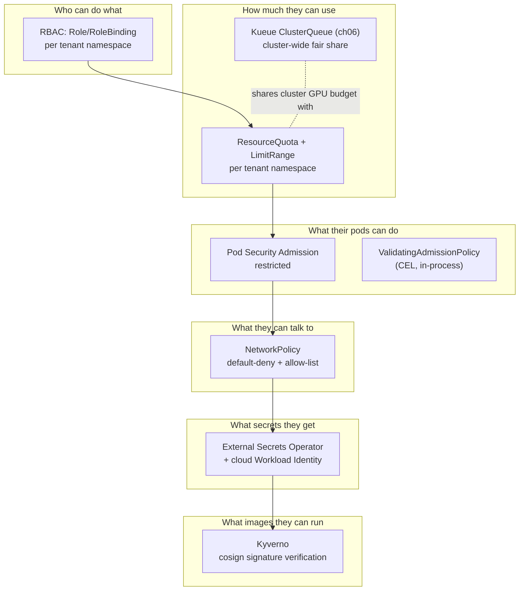
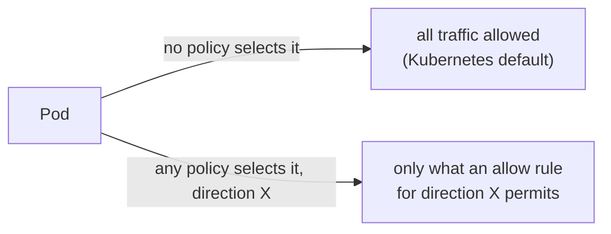
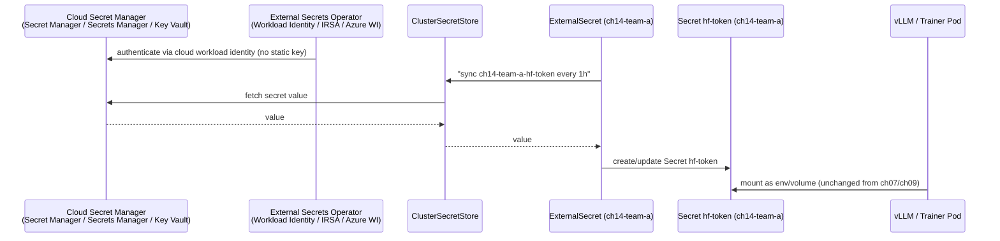

# 14 · Multi-Tenancy and Security

> Turning a shared GPU cluster into something two competing teams can safely run production
> workloads on at once: quotas, RBAC, NetworkPolicy, Pod Security Admission, workload identity
> per cloud, secrets via External Secrets Operator, and model/image supply-chain checks
> (ValidatingAdmissionPolicy + Kyverno cosign verification) — on **GKE, EKS and AKS**.

---

## 1. Why this matters

Every chapter so far assumed one friendly operator with cluster-admin. Real GPU clusters are
expensive enough that they're shared: team A's fine-tuning run and team B's inference service
sit on the same nodes, same Kueue cohort (chapter `06`), same Grafana (chapter `04`). Without
this chapter's controls, "shared" quietly becomes "team B's misconfigured Job starves team A's
GPU quota," "anyone with `kubectl` can read anyone's Hugging Face token," or "a compromised
base image runs with the same access as the platform team." Multi-tenancy in Kubernetes isn't a
single feature — it's the layered set of controls this chapter builds:



In DevOps terms this is the same problem as multi-team access to a shared Slurm cluster or a
shared cloud account with multiple cost centers, mapped onto Kubernetes-native primitives.

## 2. Learning objectives & time plan (~3 h)

By the end you can:

1. Scope a tenant to a namespace with RBAC that can't self-escalate, a ResourceQuota/LimitRange
   that bounds both compute and object count, and explain how that interacts with Kueue's
   cluster-wide ClusterQueue quota from chapter `06`.
2. Explain why `pod-security.kubernetes.io/enforce: restricted` is safe for every GPU workload
   namespace in this course, and why `gpu-operator`'s own namespace can't use it.
3. Write a default-deny NetworkPolicy set that still lets DNS, same-namespace, monitoring
   scrape, and HTTPS egress through — and explain what "default-deny" actually denies.
4. Write and bind a `ValidatingAdmissionPolicy` using CEL, and explain what it can and can't
   check compared to a Kyverno `ClusterPolicy`.
5. Wire External Secrets Operator to each cloud's secret manager via that cloud's workload
   identity mechanism, and explain why RBAC gives tenants read access to `Secret` objects but
   not create/update.
6. Explain the two halves of image supply-chain security in this repo (registry allow-listing
   via VAP, signature verification via Kyverno keyless cosign) and why CEL alone can't do the
   second one.

| Block | Time | What |
|---|---|---|
| Theory | 35 min | §3 concepts, the six-layer model above |
| Lab A (any cluster) | 60 min | cpu-lab: namespaces, quotas, RBAC, NetworkPolicy, PSA, VAP |
| Lab B (your cloud) | 60 min | ESO + workload identity + real secret manager, Kyverno |
| Lab C (optional) | 15 min | Break each control on purpose, read the resulting error |
| Review | 15 min | troubleshooting, checkpoint questions |

## 3. Concepts

### 3.1 Tenant = namespace + quota + RBAC, not a separate cluster

This chapter reuses the `team-a` / `team-b` tenants from chapter `06-batch-jobs-and-kueue`
(there, Kueue ClusterQueues; here, namespaces `ch14-team-a`/`ch14-team-b` with everything else
layered on). A namespace alone isn't isolation — it's a name scope. **ResourceQuota** bounds
compute and object counts inside it; **LimitRange** supplies defaults so a Pod that forgets to
set requests doesn't silently dodge that quota; **RBAC** bounds who can create objects in it at
all. None of the three implies the other two.

### 3.2 RBAC that can't escalate itself

`common/rbac/role-team-a-edit.yaml` grants Jobs/Deployments/TrainJobs/RayClusters/
InferenceServices — the objects a tenant actually creates — but deliberately **not**
RoleBindings, ResourceQuota, or write access to Secrets. A tenant that could edit its own
RoleBinding could grant itself cluster-admin from inside its own namespace; a tenant that could
write Secrets could plant a credential another Pod trusts. It can `get/list/watch` Secrets
because Deployments still need to mount them (the *values* come from ESO — see §3.5 — not from
`kubectl create secret` by a human). `common/rbac/clusterrole-platform-admin.yaml` holds the
cluster-scoped verbs (Namespaces, ClusterQueues, ValidatingAdmissionPolicies, Kyverno
ClusterPolicies) that only the platform team gets.

### 3.3 Pod Security Admission: restricted is the default, not the exception

Pod Security Admission has been part of the API server since 1.23 (stable since 1.25) — no
Helm chart, no webhook to install, just three namespace labels
(`pod-security.kubernetes.io/{enforce,audit,warn}`). `restricted` forbids privileged
containers, host namespaces/paths, added capabilities, and requires `runAsNonRoot` — and every
GPU workload manifest in this course (vLLM, KServe, Kubeflow Trainer, Ray) already runs that
way, because none of them need host access. The one namespace in this repo that can't run
`restricted` is `gpu-operator` itself (`02-nvidia-gpu-operator/common/namespace.yaml` sets
`enforce: privileged`) — the NVIDIA driver/toolkit containers *do* need host access to install
kernel modules and mount device nodes. That's the pattern: **privileged only for the
infrastructure namespace that needs it, restricted everywhere tenants run pods.**

### 3.4 NetworkPolicy: default-deny is additive, not "deny everything forever"



The moment *any* NetworkPolicy selects a Pod for a direction (Ingress or Egress), that
direction becomes allow-list-only — for **every** policy that also selects it, unioned
together. `common/netpol/default-deny-team-a.yaml` selects all Pods in `ch14-team-a`, both
directions, with zero rules — the starting "deny all" baseline. The other four policies in
`common/netpol/` then punch the specific holes: DNS (UDP/TCP 53 to any namespace, since
CoreDNS's namespace label differs per cloud), same-namespace (gang-scheduled training ranks,
Ray head↔worker, Gateway→backend), HTTPS egress (Hugging Face Hub, container registries, cloud
secret managers), and inbound scrape from the `monitoring` namespace (chapter `04`'s
kube-prometheus-stack). Cross-tenant traffic — `ch14-team-a` to `ch14-team-b` — is never
allowed by any of these, which is the actual isolation this buys you.

### 3.5 Two admission tools, two different jobs

| | ValidatingAdmissionPolicy | Kyverno |
|---|---|---|
| Where it runs | in-process in `kube-apiserver` (CEL) | its own webhook + controller pods |
| GA since | Kubernetes 1.30 | N/A (external project) |
| Can check | object fields/structure (image tag, resource limits, registry prefix) | everything VAP can, **plus** signature/attestation verification, image existence, JMESPath/context lookups |
| Cost | none beyond the API server | extra pods, webhook latency |
| This chapter's use | `vap-disallow-latest-tag`, `vap-require-resource-limits`, `vap-restrict-registries` | `kyverno-verify-images` (cosign keyless signature check) |

CEL has no way to call out to Rekor's transparency log or fetch a registry's signature
manifest, so "is this image cryptographically signed by our CI pipeline" is Kyverno's job, not
VAP's. Use VAP for cheap structural rules everywhere; add Kyverno only for the checks that
genuinely need it, to keep the extra webhook hop to a minimum.

### 3.6 External Secrets Operator: tenants get Secrets, never secret-manager credentials



No human or CI job ever holds the raw secret-manager credential — the ESO controller pod
authenticates via GKE Workload Identity / EKS IRSA / AKS Azure Workload Identity, the same
mechanism chapter `05` uses for model downloads and storage CSI drivers. Tenants get a
Kubernetes `Secret` object (which chapters `07`/`09`'s manifests already expect by name,
`hf-token`) without ever touching Secret Manager/Secrets Manager/Key Vault credentials directly.

## 4. Lab

Layout:

```
14-multi-tenancy-and-security/
├── common/
│   ├── base/     ch14-team-a/ch14-team-b namespaces (PSA restricted), ResourceQuota, LimitRange
│   ├── rbac/     ClusterRole (platform), Role+RoleBinding+ServiceAccount per tenant
│   ├── netpol/   default-deny, allow-dns, allow-same-namespace, allow-egress-https, allow-monitoring-scrape
│   └── policy/   3x ValidatingAdmissionPolicy(+Binding), 1x Kyverno ClusterPolicy (verifyImages)
├── gke/ eks/ aks/   install-external-secrets.sh, setup-workload-identity.sh (prints commands —
│                    does not run mutating cloud CLI calls itself), clustersecretstore-<cloud>.yaml,
│                    externalsecret-example-team-a.yaml, install-kyverno.sh, cleanup.sh
└── cpu-lab/         same common/, ESO backed by a `kubernetes`-provider ClusterSecretStore
                      (backing-secret.yaml stands in for the cloud secret manager) — no cloud IAM
```

```bash
source env.sh && source versions.env
```

### Step 1 · Namespaces, quotas, RBAC (any cluster)

```bash
kubectl apply -k 14-multi-tenancy-and-security/cpu-lab
kubectl get ns ch14-team-a ch14-team-b -o jsonpath='{.items[*].metadata.labels.pod-security\.kubernetes\.io/enforce}' 2>/dev/null
kubectl describe resourcequota team-a-quota -n ch14-team-a
kubectl auth can-i create jobs --as-group=team-a-engineers -n ch14-team-a         # yes
kubectl auth can-i create secrets --as-group=team-a-engineers -n ch14-team-a      # no
kubectl auth can-i create rolebindings --as-group=team-a-engineers -n ch14-team-a # no
kubectl auth can-i get pods --as-group=team-a-engineers -n ch14-team-b            # no (RBAC is namespace-scoped)
```

### Step 2 · Pod Security Admission in action

```bash
kubectl run priv-test --image=nginx --overrides='{"spec":{"containers":[{"name":"priv-test","image":"nginx","securityContext":{"privileged":true}}]}}' -n ch14-team-a
# Expected: error creating pod: pods "priv-test" is forbidden: violates PodSecurity "restricted:latest" ...
```

### Step 3 · NetworkPolicy: prove default-deny, then prove the allow rules

```bash
kubectl run curler --image=curlimages/curl -n ch14-team-a --command -- sleep 3600
kubectl exec -n ch14-team-a curler -- curl -m3 -s -o /dev/null -w '%{http_code}\n' https://huggingface.co   # allowed (443 egress rule)
kubectl exec -n ch14-team-a curler -- curl -m3 -s -o /dev/null -w '%{http_code}\n' http://some-svc.ch14-team-b.svc.cluster.local  # times out — cross-tenant is not on any allow list
```

### Step 4 · ValidatingAdmissionPolicy: CEL rejecting bad manifests

```bash
kubectl apply -f 14-multi-tenancy-and-security/common/policy   # standalone, also included via common/kustomization.yaml
kubectl create deployment bad --image=docker.io/library/nginx:latest -n ch14-team-a
# Expected: error: deployments.apps "bad" is forbidden: ValidatingAdmissionPolicy 'ch14-disallow-latest-tag' ... denied request: container images must be pinned ...
```

### Step 5 (your cloud) · External Secrets Operator with real Workload Identity

```bash
./14-multi-tenancy-and-security/<gke|eks|aks>/install-external-secrets.sh
./14-multi-tenancy-and-security/<gke|eks|aks>/setup-workload-identity.sh   # prints the IAM commands — review, then run them yourself
kubectl apply -k 14-multi-tenancy-and-security/<gke|eks|aks>
kubectl get clustersecretstore
kubectl get externalsecret -n ch14-team-a
kubectl get secret hf-token -n ch14-team-a -o jsonpath='{.data.HF_TOKEN}' | base64 -d; echo
```

Expected: `clustersecretstore` shows `READY: True`; `externalsecret` shows `STATUS: SecretSynced`.

### Step 6 · Kyverno signature verification

```bash
./14-multi-tenancy-and-security/<gke|eks|aks|cpu-lab>/install-kyverno.sh
kubectl apply -f 14-multi-tenancy-and-security/common/policy/kyverno-verify-images.yaml   # fill in YOUR_ORG/YOUR_REPO first
kubectl run test --image=ghcr.io/YOUR_ORG/unsigned:latest -n ch14-team-a
# Expected: error ... admission webhook "validate.kyverno.svc-fail" denied the request: ... failed to verify signature
```

## 5. Spot considerations

- Every control in this chapter is orthogonal to spot vs on-demand — RBAC/quota/NetworkPolicy/
  PSA/admission policies apply identically regardless of which ResourceFlavor (chapter `06`)
  admitted the pod.
- One real interaction: a **preempted spot pod's replacement** goes through admission again —
  make sure your ValidatingAdmissionPolicies and Kyverno rules are cheap (CEL) or your webhook
  is fast (Kyverno `admissionController.replicas` ≥ 2 in production), or spot-churn amplifies
  into API-server/webhook latency exactly when the cluster is already reshuffling pods.
- Pin the Kyverno admission controller and ESO controller off spot for the same reason chapter
  `06` pins the Kueue controller off spot: if the thing enforcing/supplying your security
  policy is itself reclaimed, every new pod creation stalls or (with `failurePolicy: Fail`)
  gets rejected cluster-wide until it reschedules.

## 6. Troubleshooting

| Symptom | Likely cause | Fix |
|---|---|---|
| `pods "x" is forbidden: violates PodSecurity "restricted:latest"` | Pod sets `privileged`, a Linux capability, `hostPath`, or omits `runAsNonRoot` | Match the securityContext pattern in chapters `07`/`08`/`09`/`11`'s manifests |
| `ValidatingAdmissionPolicy ... denied request` on a Job/Deployment you expected to pass | Image untagged or `:latest`, missing `resources.limits`, or registry not in the allow-list | Check which of the three `vap-*.yaml` policies fired in the error message |
| `admission webhook "validate.kyverno.svc-fail" denied the request: failed to verify signature` | Image isn't cosign-signed with the configured keyless identity, or `imageReferences` glob doesn't match | Confirm with `cosign verify --certificate-identity-regexp ... --certificate-oidc-issuer ...` locally first |
| `ExternalSecret` stuck `SecretSyncedError` | Workload identity binding missing/wrong, or `remoteRef.key` doesn't exist in the secret manager | `kubectl describe externalsecret -n ch14-team-a`; re-check `setup-workload-identity.sh` output was actually applied |
| `ClusterSecretStore` `READY: False` | `serviceAccountRef` namespace/name mismatch, or controller pod's SA isn't annotated for workload identity | `kubectl -n external-secrets logs deploy/external-secrets`; verify the annotation `install-external-secrets.sh` set |
| `curler` in Step 3 can reach nothing, even DNS | Applied `common/` without `allow-dns` (e.g. via `kubectl apply -f` on one file only) | Always apply the whole `common/netpol` directory, or the cloud overlay that includes it |
| `kubectl auth can-i` says `yes` for something the Role shouldn't grant | Testing as the wrong identity (default kubeconfig user has cluster-admin) | Use `--as-group=team-a-engineers` (or `--as=system:serviceaccount:ch14-team-a:team-a-ci`), not your own admin credentials |
| Kyverno webhook times out under spot churn | `webhookConfiguration.timeoutSeconds` too low for a busy admission controller with 1 replica | Raise `admissionController.replicas`, or raise the timeout (trades off fail-open risk if `failurePolicy: Ignore`) |

## 7. Cleanup & cost notes

```bash
./14-multi-tenancy-and-security/<gke|eks|aks|cpu-lab>/cleanup.sh
```

- Nothing in this chapter provisions new node pools — it reuses whatever cluster chapter `00`
  created. The only cost is the ESO and Kyverno controller pods (small, a few hundred MB RAM
  each) plus whatever secret-manager API calls Secret Manager/Secrets Manager/Key Vault bills
  per request (all three have a free tier well above lab usage).
- `setup-workload-identity.sh` prints IAM/role commands rather than running them, per this
  course's "never mutate a live cloud account from a script" rule — `cleanup.sh` correspondingly
  does **not** remove them. Delete the service account / IAM role / federated credential
  yourself once you're done (`gcloud iam service-accounts delete`, `eksctl delete
  iamserviceaccount`, `az identity delete`).

## 8. Checkpoint questions

1. A tenant's Role grants `get/list/watch` on Secrets but not `create`/`update`. Why is that
   safe, given the tenant's Deployments still mount Secrets by name?
2. Why can `gpu-operator`'s namespace not use `pod-security.kubernetes.io/enforce: restricted`,
   while every GPU *workload* namespace in this course (ch07, ch08, ch09, ch11) can?
3. A NetworkPolicy selecting Pods for Ingress only, with zero rules, is applied to a namespace
   that previously had none. What happens to that namespace's **egress** traffic?
4. Why can't a `ValidatingAdmissionPolicy` verify a cosign signature, and what does Kyverno do
   differently that makes it possible?
5. Walk through what happens end to end when `ExternalSecret hf-token` is created in
   `ch14-team-a`, from ESO's authentication to the moment a vLLM Pod can read `$HF_TOKEN`.
6. Two ClusterQueues (chapter `06`) already limit GPU usage across the cluster. Why does this
   chapter add a per-namespace `ResourceQuota` on top of that instead of relying on Kueue alone?
7. Your `vap-restrict-registries` policy blocks an image from `ghcr.io/kubeflow/trainer`. What's
   the fix, and why shouldn't the fix be "set `failurePolicy: Ignore`"?
8. Why does `setup-workload-identity.sh` print commands instead of running them, unlike
   `install-external-secrets.sh`?

<details>
<summary>Answers</summary>

1. Read access lets the kubelet/Deployment mount the Secret's current value; write access would
   let a tenant (or anything running as them) overwrite a Secret's contents — e.g. swap in a
   credential another workload trusts, or exfiltrate by replacing a Secret another team
   references with one they control. ESO (§3.6), authenticated via cloud workload identity, is
   the only writer.
2. The NVIDIA driver/toolkit/device-plugin containers `gpu-operator` runs need to load kernel
   modules and access host device nodes — that requires `privileged` and host access, which
   `restricted` forbids outright. Workload pods (vLLM, Trainer, Ray, KServe) only request the
   already-installed `nvidia.com/gpu` extended resource; they never need host access themselves.
3. Nothing changes for egress — a NetworkPolicy only restricts the directions listed in
   `policyTypes`. Ingress-only selection leaves that namespace's egress exactly as open (or
   as restricted by other policies) as before.
4. CEL evaluates the API object's own fields in-process; it has no network access to call
   Rekor's transparency log or pull a registry's signature/attestation manifest. Kyverno's
   `verifyImages` rule runs as an external admission webhook that *can* make those calls as part
   of handling the request.
5. ESO's controller pod authenticates to the cloud secret manager using Workload Identity/IRSA/
   Azure Workload Identity (no static key). The `ExternalSecret` in `ch14-team-a` tells it to
   sync `ch14-team-a-hf-token` from the `ClusterSecretStore` on a schedule. ESO fetches the
   value and creates/updates a Kubernetes `Secret` named `hf-token` in `ch14-team-a`. A vLLM
   pod's manifest (unchanged from chapter `09`) mounts that Secret by name as it always would —
   it has no idea the value came from a cloud secret manager instead of `kubectl create secret`.
6. Kueue's ClusterQueue quota governs *admission of Kueue-managed Workloads* cluster-wide (Jobs,
   TrainJobs, RayJobs with the queue-name label) — it says nothing about Deployments, Services,
   PVC counts, or any object a tenant creates outside Kueue's purview. `ResourceQuota` is the
   namespace-scoped backstop that catches everything else and also caps object *counts*, not
   just compute.
7. Add `ghcr.io/kubeflow/` to the `allowedPrefixes` variable in `vap-restrict-registries.yaml`
   (it's already there in this chapter's shipped version — the scenario is what to do if it
   weren't). Setting `failurePolicy: Ignore` instead would make the *entire policy* fail open on
   any apiserver/CEL error, silently admitting every image whenever the check itself can't run —
   turning a targeted allow-list gap into "the control doesn't reliably apply."
8. This course's ground rule is no script may run mutating cloud CLI commands
   (`gcloud`/`aws`/`az` that create/modify/delete) against a live account — `install-*.sh`
   scripts only call `helm`/`kubectl`, which act on the cluster you're already authenticated to
   and are the labs' actual deliverable; IAM/identity bindings are account-level, higher-blast-
   radius changes the brief deliberately keeps as a human, reviewed action.

</details>

## 9. Further reading

- Kubernetes: [RBAC](https://kubernetes.io/docs/reference/access-authn-authz/rbac/), [Resource Quotas](https://kubernetes.io/docs/concepts/policy/resource-quotas/), [Limit Ranges](https://kubernetes.io/docs/concepts/policy/limit-range/), [NetworkPolicy](https://kubernetes.io/docs/concepts/services-networking/network-policies/), [Pod Security Admission](https://kubernetes.io/docs/concepts/security/pod-security-admission/), [ValidatingAdmissionPolicy](https://kubernetes.io/docs/reference/access-authn-authz/validating-admission-policy/)
- [External Secrets Operator docs](https://external-secrets.io/latest/) — [GCP Secret Manager provider](https://external-secrets.io/latest/provider/google-secrets-manager/), [AWS Secrets Manager provider](https://external-secrets.io/latest/provider/aws-secrets-manager/), [Azure Key Vault provider](https://external-secrets.io/latest/provider/azure-key-vault/), [Kubernetes provider](https://external-secrets.io/latest/provider/kubernetes/)
- [Kyverno docs](https://kyverno.io/docs/) — [Verify Images / Sigstore](https://kyverno.io/docs/policy-types/cluster-policy/verify-images/sigstore/), [ImageValidatingPolicy (newer CEL form)](https://kyverno.io/docs/policy-types/image-validating-policy/)
- [sigstore/cosign](https://docs.sigstore.dev/cosign/overview/) — keyless signing
- Per-cloud identity: [GKE Workload Identity](https://cloud.google.com/kubernetes-engine/docs/how-to/workload-identity), [EKS IRSA](https://docs.aws.amazon.com/eks/latest/userguide/iam-roles-for-service-accounts.html), [AKS Workload Identity](https://learn.microsoft.com/azure/aks/workload-identity-overview)
- Cross-link: `00-prerequisites-and-cluster-setup` (OIDC issuer / Workload Identity federation prerequisites per cloud), `05-model-storage-and-data` (same workload-identity mechanisms used for storage access), `06-batch-jobs-and-kueue` (`team-a`/`team-b` tenants this chapter secures), `04-gpu-observability` (`monitoring` namespace this chapter's NetworkPolicy allow-lists), `15-mlops-gitops-and-pipelines` (Argo CD/Workflows ServiceAccounts this chapter's RBAC pattern extends to), `16-capstone-ai-platform` (assembles this chapter alongside every other one)

## Versions tested

| Component | Version |
|---|---|
| Kubernetes | 1.29+ for ValidatingAdmissionPolicy GA; labs written against 1.35 |
| External Secrets Operator (Helm chart `external-secrets/external-secrets`) | `2.10.0` *(not in versions.env — verified via Artifact Hub, 2026-09-16)* |
| Kyverno (Helm chart `kyverno/kyverno`) | `3.9.1`, app `v1.19.1` *(not in versions.env — verified via Artifact Hub, 2026-09-16)* |
| cosign / Sigstore keyless (Fulcio + Rekor) | schema per current [Kyverno Sigstore docs](https://kyverno.io/docs/policy-types/cluster-policy/verify-images/sigstore/) |
