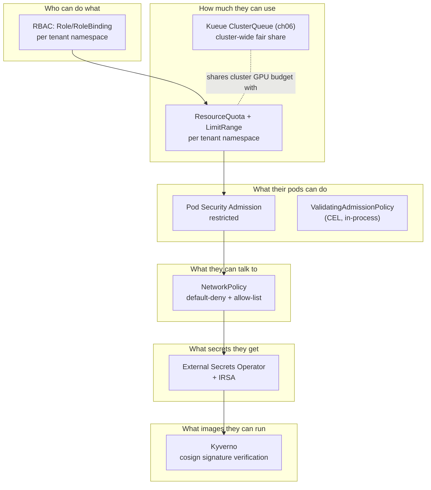
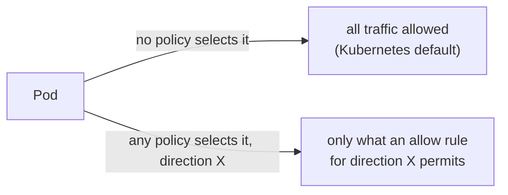
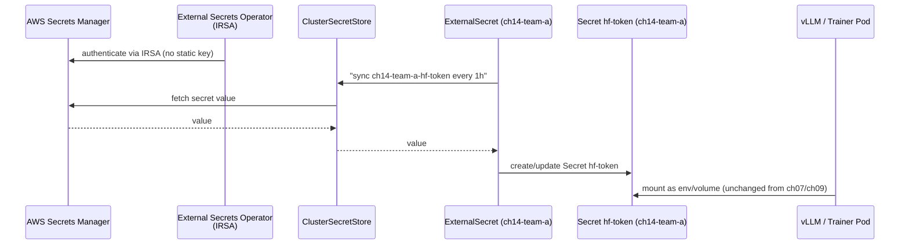

# 14 · Multi-Tenancy and Security

> Turning a shared GPU cluster into something two competing teams can safely run production
> workloads on at once: quotas, RBAC, NetworkPolicy, Pod Security Admission, workload identity,
> secrets via External Secrets Operator, and model/image supply-chain checks
> (ValidatingAdmissionPolicy + Kyverno cosign verification) — on **EKS**.

If you have never touched Kubernetes RBAC, NetworkPolicy, or a secrets manager before, read
§0 below first — it defines every term this chapter uses before you see a single command. If
you're already comfortable with those primitives, skip to §1.

---

## 0. New here? Start with this

**What "multi-tenancy" means, concretely.** In every chapter before this one, you were the only
person using the cluster, so nothing stopped you from doing anything. A real GPU cluster is
expensive — a single node with 8 GPUs can cost more per hour than a whole team's laptops — so
organizations don't buy one cluster per team. They buy one cluster and let several teams
("tenants") share it. "Multi-tenancy" is the set of controls that make that sharing *safe*
instead of a free-for-all: team A shouldn't be able to see team B's secrets, burn through team
B's GPU budget, or take down team B's service by accident (or on purpose). None of these
controls exist by default — a brand-new Kubernetes cluster has one shared pool of everything
and (depending on how you authenticated) often nobody stopping you from touching any of it.
This chapter builds the isolation up in layers, and each layer is a distinct Kubernetes concept:

- **Namespace** — a name-scoping boundary, nothing more. `ch14-team-a` and `ch14-team-b` are
  namespaces: two folders in the same cluster. Creating a namespace does *not* limit how much
  CPU/GPU/memory workloads inside it can use, and does not by itself stop anyone from reading or
  writing objects in it — those protections come from the layers below. Think of a namespace as
  a labeled shelf, not a locked room.
- **ResourceQuota** — an object that says "everything in this namespace, added together, may not
  exceed these totals" (e.g. 2 GPUs, 32Gi memory, 40 Pods). Without one, a single mistake in team
  A's namespace — a Job accidentally launched 500 times — can consume every GPU in the cluster,
  starving team B. A **LimitRange** is the quota's quiet partner: it fills in a default
  `requests`/`limits` on any Pod that forgot to set one, so that Pod doesn't slip through the
  quota accounting uncounted (a Pod with no `requests.cpu` set requests `0`, which a quota can't
  meaningfully cap).
- **RBAC (Role-Based Access Control): Role + RoleBinding** — Kubernetes' permission system.
  A `Role` is a namespace-scoped list of "verbs" (get/list/watch/create/update/patch/delete)
  allowed on specific resource types (Pods, Jobs, Secrets, ...). On its own a `Role` grants
  nobody anything — it's a permission *template*. A `RoleBinding` is what actually attaches that
  template to a real identity (a user, a group, or a `ServiceAccount`) inside one namespace. The
  combination answers "who can do what, where" — e.g. "the `team-a-engineers` group can
  create/edit Jobs in `ch14-team-a`, and nothing else, and only there."
- **NetworkPolicy** — the network-layer equivalent of RBAC: it controls which Pods can send
  network traffic to which other Pods, instead of which API calls a human/ServiceAccount can
  make. By default every Pod in Kubernetes can reach every other Pod's IP, in every namespace —
  there is no built-in network isolation between tenants. NetworkPolicy is what adds it.
- **How these three combine**: RBAC stops team A from *creating* something in team B's
  namespace via the Kubernetes API. NetworkPolicy stops team A's already-running Pods from
  *talking to* team B's Pods over the network even though RBAC has nothing to say about network
  packets. ResourceQuota stops team A from starving team B of compute even if every create call
  team A makes is one it's fully permitted to make. All three are needed — dropping any one
  leaves a real gap: RBAC alone doesn't stop a compromised Pod's outbound traffic; a quota alone
  doesn't stop credential theft; NetworkPolicy alone doesn't stop someone from just asking the
  API server for another tenant's Secret.
- **What a policy engine (Kyverno) adds on top of RBAC.** RBAC and quotas answer "is this
  identity allowed to call this API at all?" — a yes/no gate based on *who* is asking and *which
  verb/resource* they're using. Neither one looks at the *contents* of what's being created. A
  policy engine runs at **admission time** — the moment between "the API server accepted the
  request" and "the object is actually stored" — and inspects the object itself: does this
  Deployment's image use an untrusted registry? Is the image tag `:latest` (which silently
  changes what "the same image" means later)? Is the image cryptographically signed by your own
  CI pipeline? RBAC would happily let a fully-authorized team-a engineer create a Deployment with
  an unsigned image pulled from a random public registry — RBAC has no concept of "image
  contents." That's the gap ValidatingAdmissionPolicy (built into Kubernetes, cheap, CEL-based)
  and Kyverno (an add-on with its own webhook, able to call out to external services like
  Sigstore's transparency log) fill. §3.5 covers exactly where the line between them falls.
- **What External Secrets Operator (ESO) does, and why "pull from an external secret store"
  beats "store the secret directly in Kubernetes."** A plain Kubernetes `Secret` is
  base64-encoded, not encrypted, by default — anyone with `get`/`list` on Secrets in that
  namespace (or etcd access) can read the raw value trivially (base64 is an *encoding*, not
  encryption). If you `kubectl create secret` by hand, that value now lives in your shell
  history, in whatever YAML file you wrote, and in etcd, with no audit trail of who read it, no
  automatic rotation, and no automatic revocation if it leaks. **External Secrets Operator**
  instead keeps the actual secret value in a purpose-built secret manager (AWS Secrets Manager in
  this chapter) that supports encryption at rest, fine-grained IAM policies, automatic rotation,
  and access logging — and only *mirrors* the current value into a Kubernetes `Secret` that Pods
  can mount, on a schedule, via a controller that authenticates to AWS without any human or CI
  job ever holding a long-lived AWS key (via IRSA — see §3.6). If the mirrored `Secret` leaks,
  you rotate it in Secrets Manager and ESO re-syncs the new value; the workload manifests never
  change.

If any of the above is still fuzzy once you hit §3, come back to this section — the deeper dives
there assume you already have these five terms straight.

## 0. Before you start

This chapter assumes:

- **A working cluster** from [00-prerequisites-and-cluster-setup](../00-prerequisites-and-cluster-setup)
  — the `cpu-lab` sections need no GPU quota at all, but Lab B (AWS) needs a real AWS account with
  the cluster's OIDC provider associated for IRSA the way chapter 00 sets it up
  (`eksctl utils associate-iam-oidc-provider`) — a cluster-creation-time setting you can't easily
  bolt on after the fact.
- **The `team-a`/`team-b` tenant concept from [06-batch-jobs-and-kueue](../06-batch-jobs-and-kueue)**
  — this chapter reuses those names for its namespaces (`ch14-team-a`/`ch14-team-b`) and explains
  in §3.1/checkpoint 6 how its `ResourceQuota` layers on top of (not instead of) chapter 06's
  ClusterQueue.
- **`hf-token` Secret consumers from chapters 07/09** — Lab B's `ExternalSecret` produces a
  `Secret` named `hf-token`, the same name those chapters' manifests already expect; you don't
  need those chapters deployed to run this one, but the naming match is intentional.
- **The `monitoring` namespace from [04-gpu-observability](../04-gpu-observability)** if you want
  `common/netpol/allow-monitoring-scrape.yaml` to actually allow live traffic (the NetworkPolicy
  applies regardless, it just has nothing to allow if `monitoring` doesn't exist yet).

If you're new to Kubernetes entirely, don't worry about memorizing IRSA or CEL right now — Lab A
(cpu-lab, no cloud account needed) is enough to see namespaces, quotas, RBAC, and NetworkPolicy
work end to end. Lab B (real AWS Secrets Manager + Kyverno) is where the cloud-specific pieces
show up, and it explains each one before you run it.

## 1. Why this matters

Every chapter so far assumed one friendly operator with cluster-admin. Real GPU clusters are
expensive enough that they're shared: team A's fine-tuning run and team B's inference service
sit on the same nodes, same Kueue cohort (chapter `06`), same Grafana (chapter `04`). Without
this chapter's controls, "shared" quietly becomes "team B's misconfigured Job starves team A's
GPU quota," "anyone with `kubectl` can read anyone's Hugging Face token," or "a compromised
base image runs with the same access as the platform team." Multi-tenancy in Kubernetes isn't a
single feature — it's the layered set of controls this chapter builds:



**How to read this diagram if you've never seen one like it.** Each box is one Kubernetes
control this chapter turns on; the arrows are the order the lab applies them in, not a strict
technical dependency (e.g. NetworkPolicy doesn't literally require RBAC to exist first — but it
makes no sense to lock down the network before you've decided who's even allowed to create Pods
in the namespace). Read it top-to-bottom as "first decide who can act (RBAC), then bound how much
they can consume (quotas), then constrain what their Pods are allowed to *do* once running (Pod
Security Admission, admission policies), then constrain what those Pods can *talk to* over the
network (NetworkPolicy), then control what *secrets* they get (ESO), then control what *images*
they're even allowed to run (Kyverno)." Skipping a box doesn't disable the others — they're
independent controls — but it does leave that specific gap open (e.g. skip NetworkPolicy and
RBAC/quotas still work fine, but a compromised Pod in team A's namespace can still make network
calls straight into team B's namespace).

The dotted line — `KQ -.shares cluster GPU budget with.- RQ` — is the one relationship in this
diagram that *is* a real technical interaction, and it trips people up: Kueue's `ClusterQueue`
(chapter `06`) and this chapter's per-namespace `ResourceQuota` are **two separate GPU counters
that both apply at once**, not one superseding the other. Kueue's queue governs whether a
Kueue-managed `Workload` (a Job/TrainJob/RayJob carrying a queue-name label) gets *admitted* to
run at all, cluster-wide, based on fair-share across cohorts. `ResourceQuota` is a hard ceiling
Kubernetes itself enforces the moment any object is created in that one namespace — it has no
concept of Kueue's queues or cohorts, and it also catches things Kueue never looks at, like a
plain unmanaged Pod or a PersistentVolumeClaim. A workload has to fit under *both* limits to
actually run; checkpoint question 6 walks through why you want both rather than picking one.

In DevOps terms this is the same problem as multi-team access to a shared Slurm cluster or a
shared cloud account with multiple cost centers, mapped onto Kubernetes-native primitives.

## 2. Learning objectives & time plan (~3 h)

By the end you can:

1. Scope a tenant to a namespace with RBAC that can't self-escalate, a ResourceQuota/LimitRange
   that bounds both compute and object count, and explain how that interacts with Kueue's
   cluster-wide ClusterQueue quota from chapter `06`.
2. Explain why `pod-security.kubernetes.io/enforce: restricted` is safe for every GPU workload
   namespace in this course, and why `gpu-operator`'s own namespace can't use it.
3. Write a default-deny NetworkPolicy set that still lets DNS, same-namespace, monitoring
   scrape, and HTTPS egress through — and explain what "default-deny" actually denies.
4. Write and bind a `ValidatingAdmissionPolicy` using CEL, and explain what it can and can't
   check compared to a Kyverno `ClusterPolicy`.
5. Wire External Secrets Operator to AWS Secrets Manager via IRSA, and explain why RBAC gives
   tenants read access to `Secret` objects but not create/update.
6. Explain the two halves of image supply-chain security in this repo (registry allow-listing
   via VAP, signature verification via Kyverno keyless cosign) and why CEL alone can't do the
   second one.

| Block | Time | What |
|---|---|---|
| Theory | 35 min | §0/§3 concepts, the six-layer model above |
| Lab A (any cluster) | 60 min | cpu-lab: namespaces, quotas, RBAC, NetworkPolicy, PSA, VAP |
| Lab B (AWS) | 60 min | ESO + IRSA + Secrets Manager, Kyverno |
| Lab C (optional) | 15 min | Break each control on purpose, read the resulting error |
| Review | 15 min | troubleshooting, checkpoint questions |

## 3. Concepts

### 3.1 Tenant = namespace + quota + RBAC, not a separate cluster

This chapter reuses the `team-a` / `team-b` tenants from chapter `06-batch-jobs-and-kueue`
(there, Kueue ClusterQueues; here, namespaces `ch14-team-a`/`ch14-team-b` with everything else
layered on). A namespace alone isn't isolation — it's a name scope. **ResourceQuota** bounds
compute and object counts inside it; **LimitRange** supplies defaults so a Pod that forgets to
set requests doesn't silently dodge that quota; **RBAC** bounds who can create objects in it at
all. None of the three implies the other two — you can (and people accidentally do) create a
namespace with a quota but no RBAC restriction, which caps *how much* an unrestricted set of
users can consume but does nothing to separate *who* those users are from team B's users.

### 3.2 RBAC that can't escalate itself

`common/rbac/role-team-a-edit.yaml` grants Jobs/Deployments/TrainJobs/RayClusters/
InferenceServices — the objects a tenant actually creates — but deliberately **not**
RoleBindings, ResourceQuota, or write access to Secrets. A tenant that could edit its own
RoleBinding could grant itself cluster-admin from inside its own namespace; a tenant that could
write Secrets could plant a credential another Pod trusts. It can `get/list/watch` Secrets
because Deployments still need to mount them (the *values* come from ESO — see §3.5 — not from
`kubectl create secret` by a human). `common/rbac/clusterrole-platform-admin.yaml` holds the
cluster-scoped verbs (Namespaces, ClusterQueues, ValidatingAdmissionPolicies, Kyverno
ClusterPolicies) that only the platform team gets.

If you've never read a `Role` YAML before: each entry under `rules:` is one line of
"on these API groups, for these resource types, allow these verbs." `apiGroups: [""]` means the
built-in "core" API (Pods, Services, Secrets, ConfigMaps...); everything else names its own group
(`batch` for Jobs, `apps` for Deployments, `kueue.x-k8s.io` for Kueue's CRDs, and so on). A
`RoleBinding` then says "attach this `Role` to this `subject`" — in this chapter's labs, the
subject is a **group** (`team-a-engineers`), which is how `kubectl auth can-i --as-group=...` in
Step 1 can test the permission without you needing a real second user account.

### 3.3 Pod Security Admission: restricted is the default, not the exception

Pod Security Admission has been part of the API server since 1.23 (stable since 1.25) — no
Helm chart, no webhook to install, just three namespace labels
(`pod-security.kubernetes.io/{enforce,audit,warn}`). `restricted` forbids privileged
containers, host namespaces/paths, added capabilities, and requires `runAsNonRoot` — and every
GPU workload manifest in this course (vLLM, KServe, Kubeflow Trainer, Ray) already runs that
way, because none of them need host access. The one namespace in this repo that can't run
`restricted` is `gpu-operator` itself (`02-nvidia-gpu-operator/common/namespace.yaml` sets
`enforce: privileged`) — the NVIDIA driver/toolkit containers *do* need host access to install
kernel modules and mount device nodes. That's the pattern: **privileged only for the
infrastructure namespace that needs it, restricted everywhere tenants run pods.**

In plain terms: "privileged" means a container can act almost like a process running directly on
the host machine — touch host devices, load kernel modules, see other containers' processes.
That's exactly what an NVIDIA driver installer needs and exactly what you never want a tenant's
training job to have, because a compromised or malicious training Job with `privileged: true`
could read every other Pod's data on that node, not just its own.

### 3.4 NetworkPolicy: default-deny is additive, not "deny everything forever"



The moment *any* NetworkPolicy selects a Pod for a direction (Ingress or Egress), that
direction becomes allow-list-only — for **every** policy that also selects it, unioned
together. `common/netpol/default-deny-team-a.yaml` selects all Pods in `ch14-team-a`, both
directions, with zero rules — the starting "deny all" baseline. The other four policies in
`common/netpol/` then punch the specific holes: DNS (UDP/TCP 53 to any namespace, since
CoreDNS's namespace label differs per cloud), same-namespace (gang-scheduled training ranks,
Ray head↔worker, Gateway→backend), HTTPS egress (Hugging Face Hub, container registries, cloud
secret managers), and inbound scrape from the `monitoring` namespace (chapter `04`'s
kube-prometheus-stack). Cross-tenant traffic — `ch14-team-a` to `ch14-team-b` — is never
allowed by any of these, which is the actual isolation this buys you.

Why does this need five separate files instead of one? Because NetworkPolicy rules are
"OR"-ed together, not merged into one object — applying `default-deny` alone would, correctly,
block *everything*, including DNS lookups your Pods need just to resolve `huggingface.co`. Each
extra file is a narrow, single-purpose exception layered on top of the deny baseline. If you
apply the deny file without the DNS-allow file (a common beginner mistake — see Troubleshooting),
Pods can't even resolve names, which looks like "the network is broken" rather than "one YAML
file didn't get applied."

### 3.5 Two admission tools, two different jobs

| | ValidatingAdmissionPolicy | Kyverno |
|---|---|---|
| Where it runs | in-process in `kube-apiserver` (CEL) | its own webhook + controller pods |
| GA since | Kubernetes 1.30 | N/A (external project) |
| Can check | object fields/structure (image tag, resource limits, registry prefix) | everything VAP can, **plus** signature/attestation verification, image existence, JMESPath/context lookups |
| Cost | none beyond the API server | extra pods, webhook latency |
| This chapter's use | `vap-disallow-latest-tag`, `vap-require-resource-limits`, `vap-restrict-registries` | `kyverno-verify-images` (cosign keyless signature check) |

CEL has no way to call out to Rekor's transparency log or fetch a registry's signature
manifest, so "is this image cryptographically signed by our CI pipeline" is Kyverno's job, not
VAP's. Use VAP for cheap structural rules everywhere; add Kyverno only for the checks that
genuinely need it, to keep the extra webhook hop to a minimum.

"Admission" is the moment between the API server accepting a `kubectl apply`/`create` request and
that object actually being written to storage (etcd). Both tools plug into that moment and can
say "no" before the object ever exists — which is why the errors you'll see in Steps 4 and 6 look
like the `kubectl` command itself failed, rather than an object getting created and then failing
later. That's a deliberate design goal: rejecting bad input immediately is cheaper and safer than
letting a bad Pod spec get created and then cleaning it up.

### 3.6 External Secrets Operator: tenants get Secrets, never secret-manager credentials



No human or CI job ever holds the raw secret-manager credential — the ESO controller pod
authenticates via EKS IRSA (IAM Roles for Service Accounts), the same mechanism chapter `05`
uses for model downloads and storage CSI drivers. Tenants get a Kubernetes `Secret` object
(which chapters `07`/`09`'s manifests already expect by name, `hf-token`) without ever touching
Secrets Manager credentials directly.

Reading the sequence diagram: time flows top to bottom, each vertical line is one participant,
and each arrow is one request/response. The important thing to notice is that **the arrow into
AWS Secrets Manager originates from ESO, never from a Pod or a person** — `ES` (the
`ExternalSecret` object you create) only ever talks to the in-cluster `ClusterSecretStore`; it
has no AWS credentials of its own. `IRSA` is the mechanism that lets the ESO controller Pod
prove its identity to AWS without a static access key sitting in a Secret or a config file
anywhere — the Kubernetes ServiceAccount is annotated with an IAM role ARN, and EKS's OIDC
provider (from chapter 00) lets AWS trust that ServiceAccount's token as proof of identity. If
that sounds circular — "a Kubernetes identity proves itself to AWS, which then guards an AWS
secret" — that's the point: it replaces "a long-lived AWS key baked into a Secret" (itself a
thing you'd need another layer of protection for) with a short-lived, automatically-rotated token
tied to the Pod's own identity.

### 3.7 AI Workload Security: Sandboxing untrusted LLM code execution (gVisor and Kata Containers)

In modern enterprise AI platforms, security goes beyond stopping human engineers from stepping on each other's toes. Today's AI platforms run **autonomous AI agents** (LangGraph, AutoGen, CrewAI, Code Interpreter tools) that **dynamically write and execute arbitrary Python code** at runtime.

#### The threat model: why standard containers (`runc`) are insufficient

Standard Kubernetes containers are not sandboxes. They use standard Linux cgroups and namespaces running on a shared host kernel via the default OCI runtime (`runc`):
- A malicious prompt injection or jailbroken LLM can generate code designed to exploit Linux kernel vulnerabilities (e.g. dirty COW, cgroup breakout exploits).
- The untrusted code shares the host kernel's system call interface with every other container on that GPU node.
- A breakout allows an attacker to dump GPU memory belonging to other tenants, tamper with host devices, or access cloud metadata services (`169.254.169.254`).

#### Sandboxed container runtimes: gVisor vs. Kata Containers

To safely execute AI-generated code, production Kubernetes platforms deploy **sandboxed container runtimes** exposed via Kubernetes `RuntimeClass`:

```mermaid
flowchart TD
  subgraph Standard["Standard Container (runc)"]
    APP1[Agent Code] -->|Direct Syscalls| KERNEL1[Shared Host Linux Kernel]
  end
  subgraph gVisor["gVisor (runsc)"]
    APP2[Agent Code] -->|Intercepted Syscalls| SENTRY["Sentry (Go-based Userspace Kernel)"]
    SENTRY -->|Filtered Syscalls| KERNEL2[Host Linux Kernel]
  end
  subgraph Kata["Kata Containers"]
    APP3[Agent Code] --> KERNEL3["Guest Linux Kernel (Dedicated microVM)"]
    KERNEL3 --> HYPERVISOR["QEMU / Cloud Hypervisor"]
    HYPERVISOR --> KERNEL4[Host Linux Kernel]
  end
```



| Security Dimension | Standard (`runc`) | gVisor (`runsc`) | Kata Containers |
|---|---|---|---|
| **Isolation Level** | Linux namespaces + cgroups | **Process-level virtualization** (Go userspace kernel) | **Hardware virtualization** (dedicated microVM per pod) |
| **Kernel Boundary** | **Shared with host** (vulnerable to kernel 0-days) | **Independent userspace kernel** (`Sentry`) | **Dedicated guest Linux kernel** |
| **GPU Acceleration** | Direct pass-through | Supported (gVisor GPU proxy) | Supported (PCIe VFIO pass-through) |
| **Startup Overhead** | ~100 ms | ~150 ms | ~500 ms – 1 s |
| **Memory Overhead** | ~10–20 MB | ~30–50 MB | ~150–300 MB per pod |
| **Best Used For** | Trusted microservices, internal pipelines | **AI Agent code execution, untrusted python scripts** | **Hostile multi-tenant untrusted compute, financial/medical models** |

#### Configuring sandboxed execution in Kubernetes

Platform teams install the gVisor or Kata containerd shim on worker nodes and register a `RuntimeClass`:

```yaml
apiVersion: node.k8s.io/v1
kind: RuntimeClass
metadata:
  name: gvisor
handler: runsc
```

Workloads that execute untrusted LLM-generated code simply reference the sandbox in their Pod spec:

```yaml
apiVersion: batch/v1
kind: Job
metadata:
  name: agent-code-interpreter
  namespace: ch14-team-a
spec:
  template:
    spec:
      runtimeClassName: gvisor        # Enforces gVisor userspace kernel sandbox
      securityContext:
        runAsNonRoot: true
        allowPrivilegeEscalation: false
        capabilities:
          drop: ["ALL"]
      containers:
        - name: python-sandbox
          image: python:3.11-slim
          command: ["python", "-c", "import sys; print('Executing untrusted code safely!')"]
          resources:
            limits:
              cpu: "1"
              memory: "1Gi"
```

If the Python script attempts an illegal kernel operation, memory corruption exploit, or unauthorized hardware access, the gVisor `Sentry` userspace kernel intercepts and rejects the system call, protecting the physical host and all neighboring workloads.

## 4. Lab

Layout:

```
14-multi-tenancy-and-security/
├── common/
│   ├── base/     ch14-team-a/ch14-team-b namespaces (PSA restricted), ResourceQuota, LimitRange
│   ├── rbac/     ClusterRole (platform), Role+RoleBinding+ServiceAccount per tenant
│   ├── netpol/   default-deny, allow-dns, allow-same-namespace, allow-egress-https, allow-monitoring-scrape
│   └── policy/   3x ValidatingAdmissionPolicy(+Binding), 1x Kyverno ClusterPolicy (verifyImages)
├── eks/             clustersecretstore-aws.yaml, externalsecret-example-team-a.yaml, kustomization.yaml
└── cpu-lab/         same common/, ESO backed by a `kubernetes`-provider ClusterSecretStore
                      (backing-secret.yaml stands in for the cloud secret manager) — no cloud IAM
                      (also carries install-external-secrets.sh/install-kyverno.sh/cleanup.sh —
                      the same Helm commands Step 5/6 show inline below, packaged as scripts for
                      this one no-cloud-IAM path so you can try ESO/Kyverno without an AWS account)
```

```bash
cp env.sh.example env.sh   # repo root, if not already done
source env.sh && source versions.env
```

`env.sh` carries your AWS account ID/region, and `versions.env` pins every Helm chart version
used across the whole course (so a command like `helm upgrade ... --version "${ESO_VERSION}"`
below installs the exact version this README was tested against, not whatever happens to be
latest today).

### Step 1: Namespaces, quotas, RBAC (any cluster)

What you're about to do: apply the tenant namespaces/quota/RBAC (this is `cpu-lab`'s pull of
`common/`, so it works on any cluster with no cloud IAM), then prove RBAC does what §3.2 claims —
a tenant can create the objects it needs but can't touch Secrets, RoleBindings, or the other
tenant's namespace. Every command from here on is read-only against your cluster's control
plane except the `kubectl apply`/`run`/`create` calls, which only ever create objects inside this
chapter's own `ch14-*` namespaces (or, in Lab B, the `external-secrets`/`kyverno` namespaces) —
nothing here touches an existing chapter's resources.

```bash
kubectl apply -k 14-multi-tenancy-and-security/cpu-lab
kubectl get ns ch14-team-a ch14-team-b -o jsonpath='{.items[*].metadata.labels.pod-security\.kubernetes\.io/enforce}' 2>/dev/null
kubectl describe resourcequota team-a-quota -n ch14-team-a
kubectl auth can-i create jobs --as-group=team-a-engineers -n ch14-team-a
kubectl auth can-i create secrets --as-group=team-a-engineers -n ch14-team-a
kubectl auth can-i create rolebindings --as-group=team-a-engineers -n ch14-team-a
kubectl auth can-i get pods --as-group=team-a-engineers -n ch14-team-b
```

Why each line: `apply -k` renders and applies the whole `cpu-lab` kustomization in one shot (the
namespaces, quota, RBAC, NetworkPolicy, and admission policy YAML all live under `common/`, which
`cpu-lab/kustomization.yaml` pulls in). The `jsonpath` query reads back the `enforce` label
Kubernetes' Pod Security Admission actually checks, so you can see with your own eyes that it's
set to `restricted` rather than trusting the YAML. `describe resourcequota` shows you the same
object the API server consults on every Pod/PVC/Service creation in that namespace. The four
`kubectl auth can-i` calls are Kubernetes' built-in permission dry-run — they ask "would the API
server allow this identity to do this," without actually creating anything, which is exactly how
you audit RBAC without accidentally leaving test objects behind.

**Expected output**: the `pod-security` label query prints `restricted restricted` (one per
namespace); `describe resourcequota` shows `Used` lines starting at `0` against the `Hard` limits
from `common/base/resourcequota-team-a.yaml`; the four `auth can-i` calls print `yes`, `no`, `no`,
`no` in that order.

**How to tell this worked**: exactly that `yes`/`no`/`no`/`no` sequence — if the second or third
prints `yes`, the RBAC Role is over-permissioned; if the first prints `no`, team-a can't do its
actual job.

### Step 2: Pod Security Admission in action

What you're about to do: try to create a Pod that needs host access, and watch the API server
reject it at admission time — no webhook, no extra pod, just the namespace's PSA label. This is
the cheapest possible admission control in Kubernetes: it costs nothing to run because it's
built into the API server itself, unlike Kyverno's webhook in Step 6.

```bash
kubectl run priv-test --image=nginx -n ch14-team-a \
  --overrides='{"spec":{"containers":[{"name":"priv-test","image":"nginx","securityContext":{"privileged":true}}]}}'
```

The `--overrides` flag patches the Pod spec `kubectl run` would otherwise generate, adding
`securityContext.privileged: true` — deliberately asking for the one thing `restricted` forbids,
so you get to see the rejection rather than just reading about it.

**Expected output**:
```
Error from server (Forbidden): pods "priv-test" is forbidden: violates PodSecurity "restricted:latest": privileged (container "priv-test" must not set securityContext.privileged=true)
```

**How to tell this worked**: the Pod is rejected (never created) — `kubectl get pod priv-test -n ch14-team-a` returns `NotFound`, not `Pending`/`CrashLoopBackOff`.

### Step 3: NetworkPolicy — prove default-deny, then prove the allow rules

What you're about to do: confirm the default-deny baseline still lets the documented traffic
through (DNS, HTTPS egress) while blocking cross-tenant traffic that's on no allow-list.

```bash
kubectl run curler --image=curlimages/curl -n ch14-team-a --command -- sleep 3600
kubectl wait --for=condition=Ready pod/curler -n ch14-team-a --timeout=60s
kubectl exec -n ch14-team-a curler -- curl -m3 -s -o /dev/null -w '%{http_code}\n' https://huggingface.co
kubectl exec -n ch14-team-a curler -- curl -m3 -s -o /dev/null -w '%{http_code}\n' http://some-svc.ch14-team-b.svc.cluster.local
```

Why a throwaway `curler` Pod: NetworkPolicy only affects Pods, so the only way to actually prove
traffic is allowed or blocked is to run traffic from inside a Pod in the namespace you're
testing — `curl` from your own laptop tells you nothing about what team-a's Pods can reach.
`sleep 3600` keeps the Pod alive long enough to `exec` into it twice; `-m3` caps each `curl` at a
3-second timeout so a blocked call doesn't hang the terminal indefinitely.

**Expected output**: the first `curl` prints `200` (or `301`/`302`) — allowed by
`allow-egress-internet-https-team-a`. The second hangs for the full 3s timeout and prints nothing
useful (connection timed out, `curl` exit code 28) — cross-tenant traffic is on no allow-list.

**How to tell this worked**: the first call succeeds fast, the second one times out rather than
getting a fast `Connection refused` — a timeout is what NetworkPolicy-level dropping looks like
(no RST packet, unlike an actual closed port). If you're used to firewalls that send back an
explicit "connection refused," this silence can look like something is broken rather than working
as designed — it isn't broken, NetworkPolicy enforcement drops the packets rather than rejecting
them.

### Step 4: ValidatingAdmissionPolicy — CEL rejecting bad manifests

What you're about to do: apply the three CEL policies and confirm the `:latest`-tag rule actually
fires on a manifest that violates it.

```bash
kubectl apply -f 14-multi-tenancy-and-security/common/policy   # standalone; also included via common/kustomization.yaml
kubectl create deployment bad --image=docker.io/library/nginx:latest -n ch14-team-a
```

The comment matters: you already applied these policies indirectly in Step 1 via
`common/kustomization.yaml` (which `cpu-lab/kustomization.yaml` includes) — this line re-applies
them directly from the `policy/` directory alone, which is harmless (`kubectl apply` is
idempotent) and useful if you're jumping straight to this step. The `create deployment` command
deliberately uses `:latest`, an explicitly-forbidden pattern per §3.5's table, so you can see the
CEL rule actually evaluate and reject it rather than taking the policy's existence on faith.

**Expected output**:
```
error: failed to create deployment: admission webhook denied the request: deployments.apps "bad" is forbidden: ValidatingAdmissionPolicy 'ch14-disallow-latest-tag' with binding 'ch14-disallow-latest-tag-binding' denied request: container images must be pinned to an explicit tag or digest, not ':latest' or an implicit tag
```

**How to tell this worked**: the error names `ch14-disallow-latest-tag` specifically — if you see
`ch14-require-resource-limits` instead (or both), that's expected too (this manifest also omits
`resources`, so both policies are entitled to reject it; whichever one the API server evaluates
and reports first is not guaranteed to be the same every time).

### Step 5: External Secrets Operator with real IRSA

What you're about to do: install ESO via its Helm chart, annotating its ServiceAccount with the
IAM role ARN it will assume; then print (and run yourself) the `eksctl` command that creates that
IRSA role, bound to Secrets Manager; then confirm a real secret synced into a Kubernetes `Secret`.
If you don't have an AWS account handy and just want to see the ExternalSecret-to-Secret sync
loop work, `14-multi-tenancy-and-security/cpu-lab/install-external-secrets.sh` and
`cpu-lab/install-kyverno.sh` run the same two Helm installs against a fake, in-cluster
`kubernetes`-provider secret store instead — no cloud IAM step required, at the cost of not
proving the real AWS/IRSA path this section walks through.

Install External Secrets Operator, pointing its ServiceAccount at the IAM role IRSA will create
below (`ch14-eso-secretsmanager`):
```bash
: "${ESO_VERSION:=2.10.0}"
helm repo add external-secrets https://charts.external-secrets.io --force-update
helm repo update external-secrets
helm upgrade --install external-secrets external-secrets/external-secrets \
  --version "${ESO_VERSION}" \
  --namespace external-secrets --create-namespace \
  --set installCRDs=true \
  --set serviceAccount.annotations."eks\.amazonaws\.com/role-arn"="arn:aws:iam::${AWS_ACCOUNT_ID}:role/ch14-eso-secretsmanager"
kubectl -n external-secrets rollout status deployment/external-secrets --timeout=180s
```

Why each flag: `helm repo add`/`update` register and refresh the chart source (skip this if
you've already added it in an earlier chapter — it's harmless to repeat). `--version` pins the
exact chart version from `versions.env` rather than whatever's newest today, matching this
repo's "verify, don't assume" rule for fast-moving components. `--set installCRDs=true` installs
ESO's own CRDs (`ClusterSecretStore`, `ExternalSecret`) as part of the same release, since nothing
else in the cluster provides them yet. The `serviceAccount.annotations` flag is the actual IRSA
wiring: it's a plain Kubernetes annotation, but EKS's Pod-identity webhook watches for exactly
this annotation key and injects short-lived AWS credentials for that role into any Pod using this
ServiceAccount — this is what lets the ESO controller Pod call AWS APIs with no key file or
environment variable holding a secret. `rollout status` blocks the script until the Deployment is
actually ready, instead of racing ahead to the next command against a controller that isn't up
yet.

IRSA (IAM Roles for Service Accounts) is EKS's "no downloaded key" pattern, via the cluster's
OIDC provider instead of a Workload Identity Federation pool. It requires
`eksctl utils associate-iam-oidc-provider --cluster "$EKS_CLUSTER" --approve` to already be done
(chapter 00 sets this up for the whole cluster). Review this command, then run it yourself — it's
a mutating, account-level IAM change, which this course's scripts never run on your behalf:
```bash
eksctl create iamserviceaccount \
  --cluster "${EKS_CLUSTER}" --region "${AWS_REGION}" \
  --namespace external-secrets --name external-secrets \
  --role-name ch14-eso-secretsmanager \
  --attach-policy-arn arn:aws:iam::aws:policy/SecretsManagerReadWrite \
  --approve --override-existing-serviceaccounts
```
This command does two things at once: it creates the IAM role (`ch14-eso-secretsmanager`) with a
trust policy scoped to this cluster's OIDC provider and this one ServiceAccount (so *only* Pods
using that ServiceAccount, in that namespace, on that cluster, can assume it — not "anything with
network access to AWS"), and it attaches the AWS-managed `SecretsManagerReadWrite` policy to it.
`--override-existing-serviceaccounts` lets it patch the ServiceAccount Helm already created above
with the role-ARN annotation, rather than failing because the ServiceAccount already exists.

Narrower than the managed policy above for anything beyond the lab: scope a custom policy to
secrets named `ch14-team-*/*` only (resource ARN prefix), not every secret in the account.

Apply the `ClusterSecretStore` and the example `ExternalSecret` for team A:
```bash
kubectl apply -k 14-multi-tenancy-and-security/eks
```

This is the last piece of the sequence diagram in §3.6: `ClusterSecretStore` tells ESO *how* and
*where* to reach AWS Secrets Manager (using the IRSA identity from the ServiceAccount above), and
`ExternalSecret` tells it *which* secret to pull and what Kubernetes `Secret` name/namespace to
write the result to.

```bash
kubectl get clustersecretstore
kubectl get externalsecret -n ch14-team-a
kubectl get secret hf-token -n ch14-team-a -o jsonpath='{.data.HF_TOKEN}' | base64 -d; echo
```

The last command decodes the `Secret`'s value locally just to prove the whole chain worked end to
end — this is the one place in the lab where you're intentionally looking at a real secret value,
so treat your terminal output accordingly (don't paste it anywhere, and don't leave it in shell
history longer than you need to).

**Expected output**: `clustersecretstore` shows `READY  True`; `externalsecret` shows
`STATUS  SecretSynced`; the last command prints your actual HF token value (proving the sync
round-trip worked end to end, not just that the objects exist).

**How to tell this worked**: `READY: True` and `SecretSynced` — if either is `False`, check
section 6 (Troubleshooting) before assuming the secret value; a stale/empty `Secret` from a
previous failed sync can still exist even while the current state is broken.

### Step 6: Kyverno signature verification

What you're about to do: install Kyverno, apply a `verifyImages` ClusterPolicy (after filling in
your own org/identity), and confirm an unsigned image gets rejected at admission time. Unlike
Step 4's ValidatingAdmissionPolicy, this check needs a real webhook because verifying a cosign
signature means calling out to Sigstore's infrastructure (§3.5) — that's why this step installs a
whole Helm chart instead of applying a single CEL YAML file.

```bash
: "${KYVERNO_VERSION:=3.9.1}"
helm repo add kyverno https://kyverno.github.io/kyverno/ --force-update
helm repo update kyverno
helm upgrade --install kyverno kyverno/kyverno \
  --version "${KYVERNO_VERSION}" \
  --namespace kyverno --create-namespace \
  --set admissionController.replicas=1 \
  --set backgroundController.enabled=true \
  --set reportsController.enabled=false
kubectl -n kyverno rollout status deployment/kyverno-admission-controller --timeout=180s
# Edit common/policy/kyverno-verify-images.yaml first: replace YOUR_ORG/YOUR_REPO with a real
# GitHub org/repo and the cosign keyless certificate-identity-regexp for your CI pipeline.
kubectl apply -f 14-multi-tenancy-and-security/common/policy/kyverno-verify-images.yaml
kubectl run test --image=ghcr.io/YOUR_ORG/unsigned:latest -n ch14-team-a
```

Why these particular `--set` flags: `admissionController.replicas=1` keeps this a lab-sized
install (§5 explains why production wants ≥2); `backgroundController.enabled=true` lets Kyverno
periodically re-scan already-existing objects against policies (useful for auditing, not required
for this lab's admission-time test); `reportsController.enabled=false` skips a component that
generates PolicyReport objects — not needed here, and one fewer moving part while you're just
learning the admission-rejection behavior. The `# Edit ...` comment is not optional: the shipped
YAML has placeholder `YOUR_ORG`/`YOUR_REPO` values that will never match a real signature, so the
policy will reject every image, signed or not, until you point it at your own CI identity — same
placeholder pattern the repo's chapter 15 note calls out for its own YAML.

**Expected output**:
```
Error from server: admission webhook "validate.kyverno.svc-fail" denied the request: ...
failed to verify signature ...
```

**How to tell this worked**: the Pod is rejected before it's ever created (`kubectl get pod test -n ch14-team-a` returns `NotFound`); if it instead gets created and then fails PSA or the VAP
policies, Kyverno's webhook isn't actually being called — check `kubectl get validatingwebhookconfigurations` for the Kyverno entry.

## 5. Spot considerations

- Every control in this chapter is orthogonal to spot vs on-demand — RBAC/quota/NetworkPolicy/
  PSA/admission policies apply identically regardless of which ResourceFlavor (chapter `06`)
  admitted the pod.
- One real interaction: a **preempted spot pod's replacement** goes through admission again —
  make sure your ValidatingAdmissionPolicies and Kyverno rules are cheap (CEL) or your webhook
  is fast (Kyverno `admissionController.replicas` ≥ 2 in production), or spot-churn amplifies
  into API-server/webhook latency exactly when the cluster is already reshuffling pods.
- Pin the Kyverno admission controller and ESO controller off spot for the same reason chapter
  `06` pins the Kueue controller off spot: if the thing enforcing/supplying your security
  policy is itself reclaimed, every new pod creation stalls or (with `failurePolicy: Fail`)
  gets rejected cluster-wide until it reschedules.

## 6. Troubleshooting

| Symptom | Likely cause | Why this happens | Fix |
|---|---|---|---|
| `pods "x" is forbidden: violates PodSecurity "restricted:latest"` | Pod sets `privileged`, a Linux capability, `hostPath`, or omits `runAsNonRoot` | Pod Security Admission evaluates the Pod spec against the `restricted` profile at admission time (§3.3) — this is the API server itself rejecting it, before a webhook or scheduler ever sees the Pod | Match the securityContext pattern in chapters `07`/`08`/`09`/`11`'s manifests |
| `ValidatingAdmissionPolicy ... denied request` on a Job/Deployment you expected to pass | Image untagged or `:latest`, missing `resources.limits`, or registry not in the allow-list | CEL rules run in-process on every matching create/update, so any manifest field that violates the compiled expression is rejected the moment you apply it — there's no partial-apply or warning-only mode unless the policy is explicitly written that way | Check which of the three `vap-*.yaml` policies fired in the error message |
| `admission webhook "validate.kyverno.svc-fail" denied the request: failed to verify signature` | Image isn't cosign-signed with the configured keyless identity, or `imageReferences` glob doesn't match | Kyverno's `verifyImages` rule calls out to Sigstore (Fulcio/Rekor) to check the image's signature against the `certificate-identity-regexp`/issuer you configured; a mismatch on any of those (wrong org, wrong repo, image built by a different pipeline) fails the same way an outright-unsigned image would | Confirm with `cosign verify --certificate-identity-regexp ... --certificate-oidc-issuer ...` locally first |
| `ExternalSecret` stuck `SecretSyncedError` | IRSA role binding missing/wrong, or `remoteRef.key` doesn't exist in Secrets Manager | ESO's controller can only fetch what its assumed IAM role can see — if the ServiceAccount annotation, the IAM trust policy, or the secret's ARN/name don't line up exactly, the AWS API call itself fails and ESO surfaces that as a sync error rather than a Kubernetes-side problem | `kubectl describe externalsecret -n ch14-team-a`; re-check the `eksctl create iamserviceaccount` command from Step 5 was actually run |
| `ClusterSecretStore` `READY: False` | `serviceAccountRef` namespace/name mismatch, or controller pod's SA isn't annotated with the IRSA role ARN | The store object itself doesn't hold credentials — it just points at a ServiceAccount and expects IRSA to inject temporary AWS credentials into whatever Pod uses it; if the reference is wrong, or the annotation Step 5's Helm install set is missing, ESO's Pod authenticates as nobody | `kubectl -n external-secrets logs deploy/external-secrets`; verify the `eks.amazonaws.com/role-arn` annotation the Step 5 Helm install set |
| `curler` in Step 3 can reach nothing, even DNS | Applied `common/` without `allow-dns` (e.g. via `kubectl apply -f` on one file only) | Once any NetworkPolicy selects a Pod for a direction, that direction becomes allow-list-only for every policy targeting it combined (§3.4) — apply `default-deny` without also applying `allow-dns`, and DNS lookups (UDP/TCP 53) have no matching allow rule, so they're silently dropped along with everything else | Always apply the whole `common/netpol` directory, or the cloud overlay that includes it |
| `kubectl auth can-i` says `yes` for something the Role shouldn't grant | Testing as the wrong identity (default kubeconfig user has cluster-admin) | `--as-group`/`--as` impersonates a *different* identity for that one check; without it, `can-i` answers for whichever identity your current kubeconfig actually authenticates as — usually the cluster-admin you created the cluster with, which will pass every check regardless of the Role you're trying to test | Use `--as-group=team-a-engineers` (or `--as=system:serviceaccount:ch14-team-a:team-a-ci`), not your own admin credentials |
| Kyverno webhook times out under spot churn | `webhookConfiguration.timeoutSeconds` too low for a busy admission controller with 1 replica | Every Pod create/update on a matching resource blocks on a round-trip to the Kyverno webhook Pod; if spot preemption is creating many replacement Pods at once and there's only one webhook replica, requests queue up and start hitting the timeout, which then either fails the request (`failurePolicy: Fail`) or silently skips the check (`failurePolicy: Ignore`) | Raise `admissionController.replicas`, or raise the timeout (trades off fail-open risk if `failurePolicy: Ignore`) |

## 7. Cleanup & cost notes

```bash
kubectl delete -k 14-multi-tenancy-and-security/eks --ignore-not-found
helm uninstall external-secrets -n external-secrets --ignore-not-found 2>/dev/null || true
helm uninstall kyverno -n kyverno --ignore-not-found 2>/dev/null || true
kubectl delete namespace external-secrets kyverno --ignore-not-found
```
(or, for the `cpu-lab` variant, swap the `kubectl delete -k` target for `14-multi-tenancy-and-security/cpu-lab`
— or run `14-multi-tenancy-and-security/cpu-lab/cleanup.sh`, which does the same delete/uninstall
sequence for that variant in one command.)

- Nothing in this chapter provisions new node pools — it reuses whatever cluster chapter `00`
  created. The only cost is the ESO and Kyverno controller pods (small, a few hundred MB RAM
  each) plus whatever Secrets Manager API calls it makes per request (well within the free tier
  for lab usage).
- The `eksctl create iamserviceaccount` command from Step 5 was run by hand, per this course's
  "never mutate a live cloud account from a script" rule — cleanup above correspondingly does
  **not** remove it. Delete the IAM role yourself once you're done:
  `eksctl delete iamserviceaccount --cluster "$EKS_CLUSTER" --region "$AWS_REGION" --name external-secrets --namespace external-secrets`.

## 8. Checkpoint questions

1. A tenant's Role grants `get/list/watch` on Secrets but not `create`/`update`. Why is that
   safe, given the tenant's Deployments still mount Secrets by name?
2. Why can `gpu-operator`'s namespace not use `pod-security.kubernetes.io/enforce: restricted`,
   while every GPU *workload* namespace in this course (ch07, ch08, ch09, ch11) can?
3. A NetworkPolicy selecting Pods for Ingress only, with zero rules, is applied to a namespace
   that previously had none. What happens to that namespace's **egress** traffic?
4. Why can't a `ValidatingAdmissionPolicy` verify a cosign signature, and what does Kyverno do
   differently that makes it possible?
5. Walk through what happens end to end when `ExternalSecret hf-token` is created in
   `ch14-team-a`, from ESO's authentication to the moment a vLLM Pod can read `$HF_TOKEN`.
6. Two ClusterQueues (chapter `06`) already limit GPU usage across the cluster. Why does this
   chapter add a per-namespace `ResourceQuota` on top of that instead of relying on Kueue alone?
7. Your `vap-restrict-registries` policy blocks an image from `ghcr.io/kubeflow/trainer`. What's
   the fix, and why shouldn't the fix be "set `failurePolicy: Ignore`"?
8. Why does Step 5's `eksctl create iamserviceaccount` command get printed for you to review and
   run by hand, instead of the Helm install for External Secrets Operator that immediately
   precedes it in the same step?

<details>
<summary>Answers</summary>

1. Read access lets the kubelet/Deployment mount the Secret's current value; write access would
   let a tenant (or anything running as them) overwrite a Secret's contents — e.g. swap in a
   credential another workload trusts, or exfiltrate by replacing a Secret another team
   references with one they control. ESO (§3.6), authenticated via IRSA, is the only writer.
2. The NVIDIA driver/toolkit/device-plugin containers `gpu-operator` runs need to load kernel
   modules and access host device nodes — that requires `privileged` and host access, which
   `restricted` forbids outright. Workload pods (vLLM, Trainer, Ray, KServe) only request the
   already-installed `nvidia.com/gpu` extended resource; they never need host access themselves.
3. Nothing changes for egress — a NetworkPolicy only restricts the directions listed in
   `policyTypes`. Ingress-only selection leaves that namespace's egress exactly as open (or
   as restricted by other policies) as before.
4. CEL evaluates the API object's own fields in-process; it has no network access to call
   Rekor's transparency log or pull a registry's signature/attestation manifest. Kyverno's
   `verifyImages` rule runs as an external admission webhook that *can* make those calls as part
   of handling the request.
5. ESO's controller pod authenticates to AWS Secrets Manager using IRSA (no static key). The
   `ExternalSecret` in `ch14-team-a` tells it to sync `ch14-team-a-hf-token` from the
   `ClusterSecretStore` on a schedule. ESO fetches the value and creates/updates a Kubernetes
   `Secret` named `hf-token` in `ch14-team-a`. A vLLM pod's manifest (unchanged from chapter `09`)
   mounts that Secret by name as it always would — it has no idea the value came from a cloud
   secret manager instead of `kubectl create secret`.
6. Kueue's ClusterQueue quota governs *admission of Kueue-managed Workloads* cluster-wide (Jobs,
   TrainJobs, RayJobs with the queue-name label) — it says nothing about Deployments, Services,
   PVC counts, or any object a tenant creates outside Kueue's purview. `ResourceQuota` is the
   namespace-scoped backstop that catches everything else and also caps object *counts*, not
   just compute.
7. Add `ghcr.io/kubeflow/` to the `allowedPrefixes` variable in `vap-restrict-registries.yaml`
   (it's already there in this chapter's shipped version — the scenario is what to do if it
   weren't). Setting `failurePolicy: Ignore` instead would make the *entire policy* fail open on
   any apiserver/CEL error, silently admitting every image whenever the check itself can't run —
   turning a targeted allow-list gap into "the control doesn't reliably apply."
8. This course's ground rule is that nothing may mutate a live cloud account on your behalf
   (`eksctl`/`aws` calls that create/modify/delete IAM resources) — the `helm`/`kubectl` commands
   only act on the cluster you're already authenticated to and are the labs' actual deliverable.
   `eksctl create iamserviceaccount` creates a real IAM role and trust policy, an account-level,
   higher-blast-radius change the brief deliberately keeps as a human, reviewed action you copy,
   read, and run yourself.

</details>

## 9. Further reading

- Kubernetes: [RBAC](https://kubernetes.io/docs/reference/access-authn-authz/rbac/), [Resource Quotas](https://kubernetes.io/docs/concepts/policy/resource-quotas/), [Limit Ranges](https://kubernetes.io/docs/concepts/policy/limit-range/), [NetworkPolicy](https://kubernetes.io/docs/concepts/services-networking/network-policies/), [Pod Security Admission](https://kubernetes.io/docs/concepts/security/pod-security-admission/), [ValidatingAdmissionPolicy](https://kubernetes.io/docs/reference/access-authn-authz/validating-admission-policy/)
- [External Secrets Operator docs](https://external-secrets.io/latest/) — [AWS Secrets Manager provider](https://external-secrets.io/latest/provider/aws-secrets-manager/), [Kubernetes provider](https://external-secrets.io/latest/provider/kubernetes/)
- [Kyverno docs](https://kyverno.io/docs/) — [Verify Images / Sigstore](https://kyverno.io/docs/policy-types/cluster-policy/verify-images/sigstore/), [ImageValidatingPolicy (newer CEL form)](https://kyverno.io/docs/policy-types/image-validating-policy/)
- [sigstore/cosign](https://docs.sigstore.dev/cosign/overview/) — keyless signing
- [EKS IRSA (IAM Roles for Service Accounts)](https://docs.aws.amazon.com/eks/latest/userguide/iam-roles-for-service-accounts.html)
- Cross-link: `00-prerequisites-and-cluster-setup` (OIDC provider / IRSA prerequisites), `05-model-storage-and-data` (same workload-identity mechanisms used for storage access), `06-batch-jobs-and-kueue` (`team-a`/`team-b` tenants this chapter secures), `04-gpu-observability` (`monitoring` namespace this chapter's NetworkPolicy allow-lists), `15-mlops-gitops-and-pipelines` (Argo CD/Workflows ServiceAccounts this chapter's RBAC pattern extends to), `16-capstone-ai-platform` (assembles this chapter alongside every other one)

## Versions tested

| Component | Version |
|---|---|
| Kubernetes | 1.29+ for ValidatingAdmissionPolicy GA; labs written against 1.35 |
| External Secrets Operator (Helm chart `external-secrets/external-secrets`) | `2.10.0` *(not in versions.env — verified via Artifact Hub, 2026-09-16)* |
| Kyverno (Helm chart `kyverno/kyverno`) | `3.9.1`, app `v1.19.1` *(not in versions.env — verified via Artifact Hub, 2026-09-16)* |
| cosign / Sigstore keyless (Fulcio + Rekor) | schema per current [Kyverno Sigstore docs](https://kyverno.io/docs/policy-types/cluster-policy/verify-images/sigstore/) |

---

[← Prev: 13-node-autoscaling-and-cost](../13-node-autoscaling-and-cost) | [Course Map](../README.md) | [Next: 15-mlops-gitops-and-pipelines →](../15-mlops-gitops-and-pipelines)