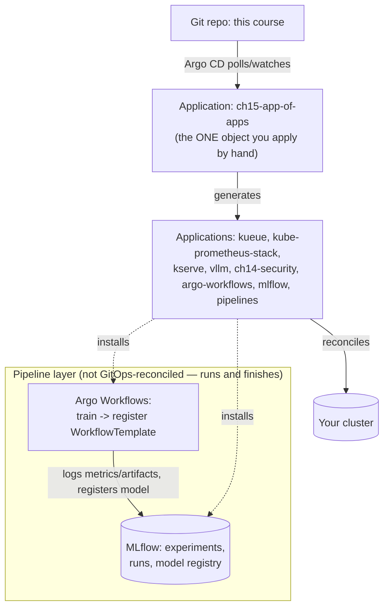
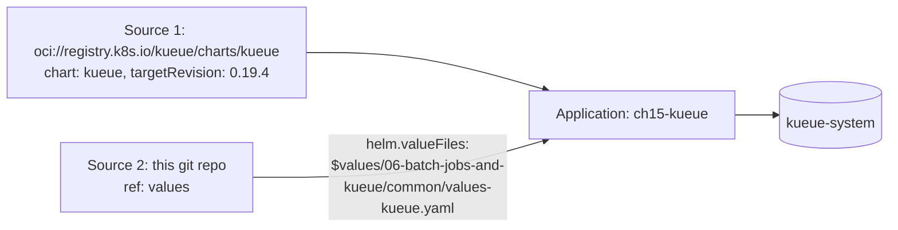

# 15 · MLOps: GitOps and Pipelines

> Handing the stack you've built by hand in chapters `00`–`14` over to **Argo CD** (app-of-apps,
> against your **existing** Argo CD install — this chapter never installs or reconfigures Argo
> CD itself), orchestrating multi-step training→registration pipelines with **Argo Workflows**,
> and tracking runs/models in **MLflow** — on **EKS**.

**New to Kubernetes, GitOps, or MLOps?** Read [§0.1](#01-if-youve-never-heard-of-gitops-start-here)
before touching a single command — it explains, in plain language, what problem each tool in this
chapter solves and why they're introduced together.

---

## 0. Before you start

This chapter assumes:

- **A real EKS cluster** from
  [00-prerequisites-and-cluster-setup](../00-prerequisites-and-cluster-setup) — this course targets
  real GPU hardware end to end, so there's no separate no-cluster/no-GPU quick-start path here;
  every step below runs against your actual EKS cluster.
- **An Argo CD instance you already run on that cluster** (chart `argo-cd`, namespace `argocd`) —
  this chapter never installs or reconfigures Argo CD itself (see the note at the top of this
  README and in [CLAUDE.md](../CLAUDE.md)). If you don't run Argo CD yet, install it yourself first
  (out of scope for this chapter) before starting the Lab below.
- **The chapters this app-of-apps wires together, if you want the synced Applications to actually
  do something**: [06-batch-jobs-and-kueue](../06-batch-jobs-and-kueue) (`app-kueue.yaml`/
  `app-kueue-queues.yaml` reuse its values file and `team-a`/`team-b` ClusterQueue),
  [04-gpu-observability](../04-gpu-observability) (`app-kube-prometheus-stack.yaml`),
  [09-llm-inference-with-vllm](../09-llm-inference-with-vllm) (`app-vllm.yaml`),
  [11-kserve](../11-kserve) (`app-kserve*.yaml`), and
  [14-multi-tenancy-and-security](../14-multi-tenancy-and-security) (`app-ch14-security.yaml`) —
  you don't need any of them deployed to *apply* the app-of-apps, only to have something
  meaningful happen when you sync a given child.
- A git fork of this repo you can push to, with every `YOUR_ORG`/`YOUR_PROJECT`/`YOUR_AWS_ACCOUNT`/
  `YOUR_STORAGE_ACCOUNT` placeholder filled in — see §4 Step 2 before applying anything from this
  chapter against a real Argo CD.

## 0.1 If you've never heard of GitOps, start here

Every chapter before this one taught you to change your cluster by typing a command on your own
laptop: `helm install kueue ...`, `kubectl apply -f 09-llm-inference-with-vllm/eks/deployment.yaml`. That works,
but it has a quiet cost: the *cluster's real state* and the *commands someone typed* are two
different things that can silently drift apart. Six months from now, nobody can look at a git repo
and know for certain what's actually running — they'd have to SSH around and diff by hand.

**GitOps is a fix for that drift, not a new deployment technology.** The rule is simple: a git
repository is the single source of truth for "what should be running," and a piece of software
called a **controller** — here, **Argo CD** — runs inside your cluster, constantly comparing git to
the cluster's live state, and pushes the cluster to match git whenever they differ. You stop typing
`kubectl apply` for day-to-day changes; you commit a change to git, and the controller notices and
applies it (or waits for your go-ahead, depending on settings you'll see below). If you're
completely new to Kubernetes: think of it like a very literal-minded assistant who re-reads a
shopping list (git) every few minutes and buys (applies) whatever's on it that isn't already in the
fridge (the cluster) — and, if you told it to, throws out anything in the fridge that's no longer on
the list.

A few vocabulary items you'll see constantly in this chapter, explained once here so the rest of
the README doesn't have to stop and define them:

- **Argo CD `Application` (a Custom Resource, or CRD)** — a Kubernetes object that says, in
  essence, "watch this path in this git repo, and keep this namespace on this cluster looking like
  it." It's not a workload itself — it's a pointer plus a policy. Kubernetes lets tools like Argo CD
  register brand-new object *kinds* (CRDs) beyond the built-in ones (Pod, Deployment, Service);
  `Application` and `AppProject` are two CRDs Argo CD installs for itself.
- **`AppProject`** — a second Argo CD CRD that fences in what a group of `Application` objects is
  *allowed* to do: which git/Helm repos they may pull from, which namespaces they may write to,
  which cluster-scoped resource kinds (things not confined to one namespace, like CRDs or
  ClusterRoles) they may create. Without one, every `Application` uses the `default` project, which
  permits everything — effectively cluster-admin via a git commit. §3.3 goes deeper.
- **`prune` and `selfHeal`** (both live under `spec.syncPolicy.automated`) — two independent
  switches, off by default in this chapter. `prune: true` means "if something is deleted from git,
  delete it from the cluster too" — powerful (git really is the whole truth) and risky (a bad
  revert, or someone deleting the wrong file, deletes real running resources). `selfHeal: true`
  means "if someone runs `kubectl edit` directly against the cluster, revert it back to match git
  within minutes" — powerful (nobody can silently drift from git) and risky (an emergency
  hot-fix you `kubectl patch` in by hand during an incident gets silently undone). Both are ordinary,
  desirable settings once you trust a given `Application` — they're just not something you want
  flipped on for every app on day one, which is why this chapter ships everything manual-sync
  first. See §3.2.
- **Argo Workflows** — a *different* Argo project (same community, unrelated CRDs) for running
  **finite, multi-step jobs that finish** — "run step A, then step B using A's output, then stop" —
  as opposed to Argo CD's job of keeping *long-lived* infrastructure in sync forever. A plain
  Kubernetes `Job` can run one container to completion; Argo Workflows' `Workflow` (and its
  reusable, saved form, `WorkflowTemplate`) can run a **DAG (directed acyclic graph)** of many
  steps, pass data between them (a training step's output path becomes a registration step's
  input), retry a single failed step instead of the whole thing, and run steps in parallel where the
  DAG allows it — none of which a plain `Job` gives you on its own. This chapter's pipeline has
  exactly two steps (`train` → `register`), but the same primitive scales to dozens.
- **MLflow** — an open-source tool for **experiment tracking** (what run used what
  hyperparameters, and what metrics did it produce) and a **model registry** (which specific
  trained model is "the one in production" right now, as an explicit, queryable answer instead of a
  developer's memory of which file they last copied somewhere). It has nothing to do with GitOps or
  Argo — it's the piece that answers "which model is this?" *after* a training pipeline (Argo
  Workflows, or your own script) has produced one. §3.7 breaks down its three moving parts.

With those five terms in hand, the rest of this chapter is: use Argo CD to keep the *infrastructure*
this course built in chapters `00`–`14` in sync with git (§3.1–§3.5), and use Argo Workflows +
MLflow to run and record the *pipelines* that produce models on top of that infrastructure
(§3.6–§3.7).

## 1. Why this matters

Every chapter so far ended with a human running `helm install` / `kubectl apply -f` from a
laptop. That's fine for learning; it doesn't scale to "did team B's Friday change actually match
what's in git" or "what exactly is running on the cluster right now, and who approved it." GitOps
answers both: git is the source of truth, a controller (Argo CD) continuously reconciles the
cluster to match it, and `kubectl apply` mostly stops being something a human runs directly.
**This chapter assumes you (or your organization) already run Argo CD** — the brief for this repo
is explicit that touching a live Argo CD instance is out of scope for an auto-generated chapter,
so everything here is content Argo CD would manage, plus the one `Application` object (the
"app-of-apps" root) you apply yourself after reviewing it.

The second half — Argo Workflows + MLflow — is the pipeline layer GitOps doesn't cover:
GitOps reconciles *long-lived infrastructure* (Kueue, vLLM, KServe, this course's whole stack);
Argo Workflows runs *finite, multi-step jobs* (train → evaluate → register); MLflow is where the
output of those jobs (metrics, artifacts, model versions) actually lives so "which model is in
production" has an answer that isn't "whoever remembers."



**Reading this diagram if you've never seen a reconciliation loop before:** follow the arrows in
order, not all at once. (1) `Git repo: this course` is just files — nothing runs by looking at git
alone. (2) Argo CD's controller (already running in your cluster, in the `argocd` namespace) has an
internal loop, on the order of every few minutes or on a webhook, that re-reads whatever path each
`Application` object points at — that's the "polls/watches" arrow, and it never stops; it isn't a
one-time deploy. (3) `ch15-app-of-apps` is the *only* `Application` object in this diagram a human
creates directly (`kubectl apply -f eks/root-app.yaml`, §4 Step 1) — everything to its right is a
consequence of that one action, not something you separately apply. (4) That root `Application`'s
job is boring on purpose: its `source.path` points at a *directory* of eight more `Application`
YAML files (`eks/apps/`), and Argo CD applies whatever it finds there just like
it would any other manifest — it has no idea those files happen to describe more `Application`
objects, which is the entire "app-of-apps" trick (spelled out fully in §3.1). (5) Each of those
eight child Applications then reconciles *its own* piece of the real cluster — one installs Kueue,
one installs the kube-prometheus-stack, and so on — which is the "reconciles" arrow into `Your
cluster`. (6) The dotted `installs` arrows show that two of those eight children (`argo-workflows`,
`mlflow`) aren't reconciling course infrastructure at all — they're installing the tools in the
bottom "Pipeline layer" box. (7) That bottom box is drawn as a separate subgraph specifically
*because it behaves differently*: Argo Workflows' `Workflow` runs a finite set of steps and then
stops (it isn't being continuously reconciled against a "should be running" state the way a
Deployment is), and MLflow is just a normal long-running service that the pipeline talks to over
HTTP to record what happened. Nothing in this bottom box is under Argo CD's continuous
reconciliation — it's the "run once, finish, record the result" layer GitOps intentionally doesn't
try to own.

## 2. Learning objectives & time plan (~2 h)

By the end you can:

1. Explain the app-of-apps pattern: one root `Application` that itself only manages other
   `Application` objects, and why that's the unit you review/apply instead of dozens of
   separate `helm install` commands.
2. Write an Argo CD multi-source `Application` that combines an upstream Helm chart with a
   values file from your own git repo (`sources[].ref` / `$values`), and explain why that's
   different from vendoring the whole chart.
3. Scope an `AppProject` (`sourceRepos`, `destinations`, `clusterResourceWhitelist`) narrower
   than the `default` project, and explain the blast-radius difference.
4. Explain why this chapter's Applications ship with **manual sync** by default and what
   changes (and what risk you accept) when you turn on `syncPolicy.automated`.
5. Write an Argo Workflows `WorkflowTemplate` that chains a training step to an MLflow
   registration step, and read `argo logs`/`argo get` to debug a failed step.
6. Explain what MLflow's tracking server, artifact store, and model registry each do, and how
   an `InferenceService` (chapter `11`) or vLLM deployment (chapter `09`) would consume a
   registered model version in a real rollout.

| Block | Time | What |
|---|---|---|
| Theory | 30 min | §3 concepts, app-of-apps, sync safety |
| Lab A | 60 min | Review and apply the root Application against your own Argo CD; sync one child app |
| Lab B (optional) | 20 min | Add a ninth child Application for a component this chapter didn't cover |
| Review | 10 min | troubleshooting, checkpoint questions |

## 3. Concepts

### 3.1 App-of-apps: one Application that manages Applications


`common/argocd-apps/apps-<cloud>/*.yaml` are themselves just `Application` objects committed to
git — nothing special about them syntactically. The "app-of-apps" trick is entirely that the
**root** `Application` (`<cloud>/root-app.yaml`) points its `source.path` at the *directory
containing them*, so Argo CD treats "the list of child Applications" as content it reconciles
too. Add a ninth `.yaml` file to that directory, commit, and (once you sync the root) Argo CD
creates the ninth child Application for you — you never ran `argocd app create` by hand for it.

If you're new to Kubernetes: this works because Argo CD doesn't actually care what *kind* of
object lives at the path it's watching — a Deployment, a ConfigMap, and an `Application` are all
just YAML to it. The only reason this is called a special "pattern" rather than just "a normal
sync" is that the objects it happens to be syncing are themselves more things for Argo CD to watch
— it's recursion, not a different mechanism.

### 3.2 Why every Application here ships without `syncPolicy.automated`

Argo CD's `syncPolicy.automated` block makes an `Application` self-heal and auto-apply every git
change the moment it's detected — genuinely useful once you trust the pipeline, genuinely
dangerous the first time you wire a course repo's app-of-apps against a real cluster with real
GPU spend. Every `Application` in this chapter is **manual-sync by default**: Argo CD will show
you an `OutOfSync` diff and wait for `argocd app sync <name>` (or a UI click). Once you've run
through Lab B and trust what each child app does, add:

```yaml
spec:
  syncPolicy:
    automated:
      prune: true      # deletes cluster objects removed from git — real teeth, understand it first
      selfHeal: true    # reverts manual kubectl edits that drift from git
```

to individual `Application` objects, one at a time, not as a blanket edit to all eight.

Concretely, "manual sync" means Argo CD still does the *comparison* automatically and continuously
— it will show `OutOfSync` in `argocd app list` the moment git and cluster disagree — it just
refuses to *act* on that difference until a human types the sync command. That's the safety
property: you always get to see the diff (`argocd app diff <name>`) before anything changes,
which matters most on your very first pass through a course repo you didn't write, against a
cluster that costs real money.

### 3.3 AppProject: the blast radius of "what can this app-of-apps touch"

The `default` AppProject (created automatically with Argo CD) allows any source repo, any
destination namespace, and any cluster-scoped resource — an app-of-apps in `default` is
effectively cluster-admin via git. `project.yaml` defines `ai-platform` instead:
`sourceRepos` lists exactly the git repo and Helm repos this chapter's Applications use;
`destinations` lists exactly the namespaces they deploy into; `clusterResourceWhitelist` lists
exactly the cluster-scoped kinds (Kueue's CRDs, this course's `ValidatingAdmissionPolicy`,
Kyverno's `ClusterPolicy`, RBAC `ClusterRole`) they're allowed to create — anything else a
compromised or careless commit tried to add (say, a `ClusterRoleBinding` granting
cluster-admin) is rejected by Argo CD itself, before it ever reaches the API server's own RBAC
check.

Put another way, for a first-timer: Kubernetes RBAC already governs what Argo CD's own service
account is allowed to do against the API server. `AppProject` is a *second*, independent fence
Argo CD enforces on top of that, scoped per group of `Application` objects — even if Argo CD's
service account technically has permission to create a `ClusterRoleBinding` cluster-wide, the
`ai-platform` project can (and here, does) refuse to let *this chapter's* Applications create one,
so a bad commit to this course's repo can't silently grant itself cluster-admin.

### 3.4 Multi-source Applications: chart + your values, not chart + fork



Argo CD's multi-source Applications (`spec.sources`, a list) let one source be an upstream Helm
chart and a second be a plain git repo providing values, referenced via `ref:` and `$values/...`
in the chart source's `helm.valueFiles`. This is what makes `app-kueue.yaml`,
`app-kube-prometheus-stack.yaml`, `app-argo-workflows.yaml` and `app-mlflow.yaml` work without
forking the upstream chart into this repo: **the values files chapters `06` and `04` already
wrote are the single source of truth**, reused instead of duplicated. Plain directory-path
Applications (`app-vllm.yaml`, `app-ch14-security.yaml`, `app-pipelines.yaml`) don't need this —
they just point `source.path` at a chapter's own flat directory of plain Kubernetes YAML, the same
directory `kubectl apply -f <file>` would use.

Why this matters if you've only ever run `helm install -f values.yaml` by hand: without a
multi-source `Application`, GitOps-managing a chart from someone else's Helm repository would
force you to either (a) copy that chart's entire source into this repo (now you own upgrading it
forever), or (b) give up on Argo CD tracking your values file at all and bake them into a
templated manifest instead. Multi-source `Applications` avoid both — Argo CD pulls the chart
straight from its real upstream repo every sync, and separately pulls just your values file from
your own repo, the same file `helm install -f` would have used directly.

### 3.5 Sync waves: ordering without a workflow engine

`argocd.argoproj.io/sync-wave` annotations (lower number syncs first) are how the app-of-apps
gets CRDs before the objects that need them without a separate pipeline: `app-kserve-crd.yaml`
is wave `0`, `app-kserve.yaml` (the controller, which needs those CRDs) is wave `1`;
`app-kueue.yaml` (controller + CRDs) is wave `0`, `app-kueue-queues.yaml` (ResourceFlavors/
ClusterQueues that need the CRDs registered) is wave `1`. Argo CD waits for each wave's
Applications to reach `Healthy` before starting the next.

If you're wondering why this is necessary at all: Kubernetes' API server rejects any object whose
CRD (its schema) isn't registered yet — creating a `ClusterQueue` before Kueue's CRDs exist just
fails outright, it doesn't queue and retry on its own within a single sync. Sync waves are Argo
CD's way of saying "don't even attempt wave 1 until every wave 0 Application reports `Healthy`,"
which sidesteps that failure without needing a full workflow engine (that's Argo Workflows' job,
covered next) just to sequence two Helm installs.

### 3.6 Argo Workflows vs Kueue/TrainJob (chapters 06/07) — different layers

Argo Workflows orchestrates a **DAG of steps** that each finish and hand off (train → register,
or extract → transform → load); Kueue admits **Workloads** (Jobs, TrainJobs, RayJobs) against
quota; Kubeflow Trainer's `TrainJob` runs **one distributed training job**. They compose: an
Argo Workflows step's container can itself submit a `TrainJob` or a Kueue-managed `Job` and poll
for completion, letting a single pipeline definition span "orchestrate the whole ML lifecycle"
while still going through chapter `06`'s admission/fairness controls for the expensive GPU step.
This chapter's `train-and-register` `WorkflowTemplate` keeps the training step as a plain
container (CPU-only, so it runs without GPU quota) — swap it for a `TrainJob`/`RayJob`
submission once you're pointing at real GPU capacity.

For a reader who has only ever used a plain Kubernetes `Job`: a `Job` runs one Pod template to
completion (optionally retried, optionally parallel copies of the *same* Pod). It has no concept
of "step 2 depends on step 1's output," no built-in way to pass a value from one Pod to another,
and no notion of a DAG at all — chaining two `Job`s yourself means writing your own glue (a script
that watches Job A finish, then creates Job B, wiring outputs through some side channel like a
shared volume or an object store path). Argo Workflows' `WorkflowTemplate` builds exactly that
glue into the CRD: `steps.train.outputs.parameters.run-dir` in this chapter's template (see §4,
`workflowtemplate-train-pipeline.yaml`) is literally the training step's output file path, handed
to the register step as an input parameter — no extra script required. A `WorkflowTemplate` is
just a *saved, reusable* `Workflow` spec, the same relationship a Deployment's PodTemplate has to a
bare Pod: you `argo submit --from workflowtemplate/train-and-register` instead of retyping the
whole DAG every run.

### 3.7 MLflow: tracking, artifacts, registry — three different things people conflate

- **Tracking server** — the API/UI (`MLFLOW_TRACKING_URI`) that experiments and runs log
  metrics/params to (`mlflow.log_metrics`, `mlflow.start_run()`).
- **Artifact store** — where the actual files (model weights, plots, checkpoints) live. The
  chart's `artifactRoot.s3` points this at the same S3 bucket chapter `05` uses for model
  downloads — proxied through the server (`proxiedArtifactStorage: true`) so clients never need
  direct AWS credentials, consistent with this chapter's IRSA-only stance.
- **Model registry** — a named, versioned pointer (`mlflow.register_model(...)`) on top of
  logged artifacts. "Which model is in production" is a registry stage/alias, not a file path —
  this is what a real KServe `InferenceService` or vLLM rollout would read to decide which
  weights to serve next, instead of a human editing a Deployment's image tag.

Concretely, in this chapter's own pipeline (`workflowtemplate-train-pipeline.yaml`'s
`register-step`): `mlflow.set_tracking_uri(...)` points the Python client at the tracking server
(a plain HTTP call, nothing GitOps-related); `mlflow.start_run()` + `mlflow.log_metrics(metrics)`
records that this specific run produced `eval_loss: 0.4x` — this is the tracking server's job;
`mlflow.log_artifact(...)` uploads the actual (stand-in) model file — this is the artifact store's
job; and `mlflow.register_model(...)` creates or bumps a version of `ch15-demo-model` in the
registry, which is a separate step from just logging the file — you could log a hundred runs'
artifacts without ever registering any of them as "a model," the same way you can save a hundred
draft files without ever marking one as "the released version."

## 4. Lab

Layout:

```
15-mlops-gitops-and-pipelines/
├── common/
│   ├── argocd-apps/
│   │   ├── project.yaml            AppProject "ai-platform"
│   │   └── apps-eks/                8 child Application manifests + kustomization
│   ├── workflows/                  ch15-pipelines namespace, RBAC, PVC, train-and-register WorkflowTemplate
│   └── mlflow/                     values-mlflow-{eks,cpu-lab}.yaml (Helm values, not applied directly)
├── eks/                             root-app.yaml (the ONE Application you apply by hand), kustomization.yaml
└── cpu-lab/                        install-argo-workflows.sh, install-mlflow.sh (plain Helm, no Argo CD needed), kustomization.yaml (workflows), cleanup.sh
```

```bash
cp env.sh.example env.sh   # repo root, if not already done
source env.sh && source versions.env
```

Why this first: `versions.env` is where every pinned chart/image version in this course lives
(`ARGO_WORKFLOWS_VERSION`, `MLFLOW_CHART_VERSION`, etc.) — every script and Application manifest
below references those variables instead of a hardcoded version, so sourcing it is what makes
`${ARGO_WORKFLOWS_VERSION}` resolve to something real in the commands that follow. `env.sh` (your
own copy, gitignored) supplies the AWS account/region details later steps that touch a real
cluster or S3 bucket will need.

### Step 1: No Argo CD yet? Start here (any cluster)

What you're about to do: install Argo Workflows and MLflow directly via Helm (no Argo CD
involved), then run the `train-and-register` pipeline end to end and confirm MLflow actually
recorded the run. This is the "any cluster" path — it works on a kind/minikube cluster with no
AWS account at all, because `cpu-lab/install-mlflow.sh` uses `values-mlflow-cpu-lab.yaml`, which
stores its backend and artifacts on local PVC storage instead of S3.

```bash
./15-mlops-gitops-and-pipelines/cpu-lab/install-argo-workflows.sh
./15-mlops-gitops-and-pipelines/cpu-lab/install-mlflow.sh
kubectl apply -k 15-mlops-gitops-and-pipelines/cpu-lab
kubectl -n argo port-forward svc/argo-workflows-server 2746:2746 &
kubectl -n mlflow port-forward svc/mlflow 5000:5000 &
argo submit --watch -n ch15-pipelines --from workflowtemplate/train-and-register
```

What each line actually does, for a first-timer:

- `install-argo-workflows.sh` runs `helm upgrade --install argo-workflows argo/argo-workflows
  --version "${ARGO_WORKFLOWS_VERSION}" --namespace argo --create-namespace`, pinned to the
  version in `versions.env` — same as any Helm install you've done in earlier chapters, just
  wrapped in a script so this README doesn't repeat three lines of `helm repo add`/`update`/
  `upgrade --install` boilerplate. It also passes `--set controller.workflowNamespaces='{ch15-pipelines}'`,
  which tells the *cluster-wide* Argo Workflows controller which namespaces it's allowed to run
  `WorkflowTemplate`s in — without this, `argo submit -n ch15-pipelines` would fail even though the
  controller itself is healthy, because the controller was never told to watch that namespace.
- `install-mlflow.sh` similarly runs `helm upgrade --install mlflow community-charts/mlflow
  --version "${MLFLOW_CHART_VERSION}" --namespace mlflow --create-namespace -f
  common/mlflow/values-mlflow-cpu-lab.yaml` — an ordinary Helm install into its own namespace.
- `kubectl apply -k 15-mlops-gitops-and-pipelines/cpu-lab` applies this chapter's own
  kustomization: the `ch15-pipelines` namespace, the `pipelines-runner` ServiceAccount + RBAC the
  Workflow's Pods run as, the `pipeline-artifacts` PVC the train/register steps share a
  filesystem through, and the `train-and-register` `WorkflowTemplate` itself. None of this needs
  Argo CD — it's the exact same `kubectl apply -k` pattern every earlier chapter used.
- The two `port-forward ... &` commands open a local TCP tunnel to each Service so you can reach
  the Argo Workflows UI and the MLflow UI from your own browser at `localhost:2746` and
  `localhost:5000` — the trailing `&` backgrounds them so your shell isn't blocked; kill them later
  with `kill %1 %2` or just close the terminal.
- `argo submit --watch -n ch15-pipelines --from workflowtemplate/train-and-register` is the actual
  pipeline run: it creates a `Workflow` object from the saved `WorkflowTemplate`, and `--watch`
  streams each step's status live instead of you having to separately run `argo get`/`argo logs`.

**Expected output**: `argo submit --watch` prints both steps (`train`, `register`) reaching
`Succeeded`, ending with `Status: Succeeded`.

**How to tell this worked**: open `http://localhost:5000` — the `ch15-train-and-register`
experiment has a new run with a logged `eval_loss` metric, and **Models** shows a registered
model `ch15-demo-model` with a new version. If the Workflow succeeded but nothing shows up here,
the register step ran against the wrong `MLFLOW_TRACKING_URI` — see section 6.

### Step 2 (only if you run Argo CD): Review, then apply the app-of-apps

**Do not skip the review.** Every `Application`/`AppProject` manifest here has `YOUR_ORG`,
`YOUR_PROJECT`, `YOUR_AWS_ACCOUNT`, or `YOUR_STORAGE_ACCOUNT` placeholders — fill in your own
fork's clone URL and cloud identifiers first, and push this repo somewhere Argo CD can reach.
This matters because these manifests are written generically for anyone forking this course —
`YOUR_ORG/kubernetes-ai-infrastructure.git` isn't a real, reachable repository, so applying
`root-app.yaml` unedited just leaves the `Application` stuck reporting a repo error (see §6)
rather than doing anything harmful — but it also won't do anything *useful* until you fix it.

```bash
grep -rln "YOUR_" 15-mlops-gitops-and-pipelines/   # find every placeholder before editing
grep -rln "YOUR_" 15-mlops-gitops-and-pipelines/ | xargs sed -i '' 's#YOUR_ORG/kubernetes-ai-infrastructure#<your-fork>#g'   # example; do the rest by hand
```

The `grep -rln` first prints every file containing a placeholder so you know the full scope of
what to edit before changing anything (currently `eks/root-app.yaml` and
`common/argocd-apps/project.yaml`, both `repoURL`/`sourceRepos` entries). The `sed -i ''` line
(macOS/BSD `sed` syntax — drop the `''` on GNU/Linux `sed`) is one example substitution for the
git URL placeholder; it's deliberately not a script that rewrites every placeholder for you,
because `YOUR_AWS_ACCOUNT`/`YOUR_STORAGE_ACCOUNT` values depend on your own AWS account and S3
bucket naming, which nothing in this repo can guess — replace those by hand after reading each
file `grep` found.

```bash
kubectl apply -f 15-mlops-gitops-and-pipelines/common/argocd-apps/project.yaml
kubectl apply -f 15-mlops-gitops-and-pipelines/eks/root-app.yaml
```

Both of these are plain `kubectl apply -f` against your **existing** Argo CD's namespace
(`argocd`) — `AppProject` and `Application` are Kubernetes objects like any other, once Argo CD's
CRDs are installed (which they already are, since this chapter assumes Argo CD is already
running). Applying `project.yaml` first matters: `root-app.yaml`'s `spec.project: ai-platform`
refers to the `AppProject` by name, and Argo CD rejects an `Application` naming a project that
doesn't exist yet.

```bash
argocd app get ch15-app-of-apps
argocd app list -l app.kubernetes.io/part-of=ai-platform
```

`argocd app get` is the CLI's detail view for one `Application` — health, sync status, and the
resources it manages. `argocd app list -l ...` lists every `Application` carrying that label,
which is how you see all nine (the root plus eight children) at a glance instead of naming each
one individually.

**Expected output**: `argocd app get ch15-app-of-apps` shows `Health: Healthy` (the root
Application itself just creates the 8 child Application objects — a fast sync); `argocd app list`
shows all 8 child apps with `SYNC STATUS: OutOfSync` (manual sync — expected, see §3.2).

**How to tell this worked**: 8 child apps listed, not an error about `AppProject ai-platform does
not allow ...` — if you see that, a `destinations`/`sourceRepos` entry is missing in
`project.yaml` for the app's target namespace/repo (see section 6).

### Step 3: Sync one child app, read the diff first

What you're about to do: sync exactly one child Application after reviewing its diff — the
pattern you'd repeat for each app once you trust it, never all 8 at once on a first run.

```bash
argocd app diff ch15-mlflow
argocd app sync ch15-mlflow
argocd app wait ch15-mlflow --health
```

`argocd app diff` is the one command in this whole chapter that most directly embodies "GitOps
means you always see the diff before it happens" — it prints exactly the Kubernetes objects Argo
CD is about to create/change/delete for this one `Application`, computed by comparing git to the
live cluster, without touching anything yet. Only after reading that do you run `argocd app sync`,
which actually applies it (this is the manual-sync gate from §3.2 in action — nothing happened
automatically just because the `Application` existed). `argocd app wait --health` then blocks your
terminal until Argo CD reports the synced resources `Healthy` (or times out), which is the
GitOps-native equivalent of a plain `kubectl rollout status` you've used in earlier chapters.

**Expected output**: `argocd app diff` prints the resources about to be created (MLflow
Deployment, Service, PVC, etc.); `argocd app sync` streams the apply; `argocd app wait --health`
blocks until `Healthy` or times out.

**How to tell this worked**: `argocd app get ch15-mlflow` shows `Sync Status: Synced` and
`Health Status: Healthy`; `kubectl -n mlflow get pods` shows the MLflow pod `Running`.

### Step 4 (optional): Add a ninth Application

What you're about to do: extend the app-of-apps with a component this chapter didn't wire up, to
prove the "commit a file, Argo CD creates the Application" mechanic from §3.1 yourself.

```bash
cp 15-mlops-gitops-and-pipelines/common/argocd-apps/apps-eks/app-vllm.yaml \
   15-mlops-gitops-and-pipelines/common/argocd-apps/apps-eks/app-kserve-demo.yaml
# edit app-kserve-demo.yaml: change metadata.name and spec.source.path to point at 11-kserve/eks
# add it to apps-eks/kustomization.yaml's resources list
git add -A && git commit -m "ch15: add kserve demo Application" && git push
argocd app sync ch15-app-of-apps
argocd app list -l app.kubernetes.io/part-of=ai-platform   # now 9
```

Copying `app-vllm.yaml` (a plain kustomize-path `Application`, §3.4) as the template is
deliberate — chapter `11-kserve`'s `eks/` directory is a kustomize overlay just like `09`'s, so the
same shape of `Application` (`source.path` pointing at that overlay, no multi-source needed) works
unmodified aside from the name/path edit. Committing and pushing is the step that actually matters
here, not the local file copy — nothing changes on the cluster until the root Application's next
sync sees that new file in git, which is why `argocd app sync ch15-app-of-apps` comes after the
`git push`, not before it.

**Expected output**: after the push and root-app sync, a ninth Application (whatever you named
it) appears in `argocd app list`, `OutOfSync` (manual sync, same as the others).

**How to tell this worked**: you never ran `argocd app create` for the ninth app — it exists
purely because it was a file in the directory the root Application's `source.path` points at.

## 5. Spot considerations

- Pin the Argo Workflows controller and MLflow server off spot (`controller.nodeSelector` in
  `values-argo-workflows.yaml`) — same reasoning as Kueue's controller (chapter `06`): these are
  shared orchestration/registry components, not per-tenant compute.
- Individual Workflow **step pods** are exactly the kind of bursty, restartable, checkpoint-
  friendly work spot is made for — run them on spot node pools like any other batch Job, and
  reuse chapter `06`'s `podFailurePolicy` pattern if a step wraps a `batch/v1` Job.
- MLflow's SQLite-on-PVC backend store (this chapter's default) is a single file — a spot node
  reclaim mid-write on ReadWriteOnce storage that can't follow the pod to a new node stalls the
  server until it reschedules. Move to `backendStore.postgres` (a managed database) before
  anything beyond the lab; it isn't a spot-specific problem so much as "don't run your registry's
  database as a single SQLite file," but spot churn makes the failure mode show up sooner.

If you're new to spot capacity: EC2 Spot instances are spare AWS capacity sold at a discount, that
AWS can reclaim with only a two-minute warning whenever it needs the capacity back. That's a good
trade for a Workflow step pod (it just gets rescheduled and re-runs, and this pipeline's steps are
short and cheap to redo) and a bad trade for a stateful singleton like the Argo Workflows
controller or MLflow's server (losing the one Pod that's also holding an in-progress SQLite write,
mid-reclaim, is how you get a corrupted or wedged database rather than a quick retry) — which is
exactly the controller-vs-step-pod split the first two bullets describe.

## 6. Troubleshooting

| Symptom | Likely cause | Fix |
|---|---|---|
| `argocd app sync` fails: `AppProject ai-platform does not allow ... destination` | Namespace or source repo not listed in `project.yaml` | Add the missing `destinations`/`sourceRepos` entry, don't loosen to wildcards |
| Child `Application` stuck `Unknown`/repo error | `YOUR_ORG` placeholder never replaced, or Argo CD has no credentials for a private repo | Fix `repoURL`; configure the repo credential in Argo CD itself (out of scope for this chapter — that's a change to your live Argo CD, do it via your normal process) |
| `ch15-kueue-queues` syncs before `ch15-kueue` is healthy, fails on missing CRD | Sync-wave annotation missing or edited | Confirm `argocd.argoproj.io/sync-wave: "0"` on `app-kueue.yaml`, `"1"` on `app-kueue-queues.yaml` |
| `mlflow.exceptions.MlflowException: API request ... Connection refused` in the register step | `MLFLOW_TRACKING_URI` wrong, or MLflow Service not yet `Ready` | `kubectl -n mlflow get pods,svc`; the WorkflowTemplate assumes Service name `mlflow` in namespace `mlflow` |
| Workflow step stuck `Pending` | `ch15-pipelines` PVC (`ReadWriteOnce`) already mounted by a pod on a different node | Reduce parallelism, or move `pipeline-artifacts` to a `ReadWriteMany` class (Filestore/EFS/Azure Files — chapter `05`) |
| `argo submit` says `WorkflowTemplate not found` | Applied `cpu-lab/kustomization.yaml` to the wrong namespace, or Argo Workflows `controller.workflowNamespaces` doesn't include `ch15-pipelines` | `kubectl get workflowtemplate -n ch15-pipelines`; check `values-argo-workflows.yaml`'s `controller.workflowNamespaces` |
| Everything in `apps-eks/*.yaml` shows `OutOfSync` and never changes | Expected — manual sync by default (§3.2). `argocd app sync <name>` each one you've reviewed | n/a |
| `helm.valueFiles: $values/...` path not found | Multi-source `ref: values` source's `targetRevision`/repo doesn't actually contain that path (e.g. you pushed to a branch other than `main`) | Match `targetRevision` in the Application to the branch you actually pushed |

Why these happen, in more depth:

- **`AppProject` destination/repo errors** happen because `AppProject` enforcement is a hard allow
  list, not a warning — Argo CD refuses the sync outright rather than syncing "most of it." This is
  the mechanism from §3.3 doing exactly its job; the fix is always to name the specific missing
  namespace/repo, never to widen the list to a wildcard (`*`), which defeats the reason the
  `AppProject` exists.
- **Repo errors on a child `Application`** are almost always the placeholder problem from §4 Step
  2 — a URL like `https://github.com/YOUR_ORG/kubernetes-ai-infrastructure.git` isn't a real,
  reachable repository, so Argo CD's repo-server can never clone it, and every `Application`
  pointing at it sits in `Unknown` forever, not because anything is broken but because it was never
  finished being configured.
- **Sync-wave ordering failures** happen because, without the annotation, Argo CD is free to sync
  both Applications in the same pass — most of the time that's fine, but a CRD registering with
  the API server takes a moment, and a dependent object created in that window fails with a
  "no matches for kind" error. It's a race, so it can even work sometimes and not others, which is
  why confirming the annotation (rather than just retrying) is the real fix.
- **MLflow connection-refused** almost always means the register step ran before the MLflow
  Deployment's Pod passed its readiness probe — the `Service` exists as soon as you `helm install`,
  but routing traffic to a Pod that isn't Ready yet still fails at the TCP level.
- **PVC-stuck-Pending** is a `ReadWriteOnce` limitation, not a bug: that access mode allows the
  volume to be mounted by Pods on exactly one node at a time, so if Kubernetes schedules the next
  step's Pod onto a different node than the one already holding the mount, it blocks rather than
  failing outright — waiting in case the other Pod finishes and releases it.
- **`WorkflowTemplate not found`** is a namespace-scoping problem on two independent axes: the
  `WorkflowTemplate` object itself lives in whatever namespace you applied `cpu-lab/kustomization.yaml`
  (or the GitOps `common/workflows/` in Lab B) to, *and* the cluster-wide Argo Workflows controller
  only watches namespaces listed in its own `controller.workflowNamespaces` Helm value — get either
  one wrong and `argo submit -n ch15-pipelines` can't find it even though the YAML was applied
  successfully.

## 7. Cleanup & cost notes

```bash
./15-mlops-gitops-and-pipelines/cpu-lab/cleanup.sh
```

This script (`cpu-lab/cleanup.sh`) tears down exactly what Lab A created, in reverse: it
`kubectl delete -k`s this chapter's own kustomization (the `WorkflowTemplate`, PVC, RBAC, and
`ch15-pipelines` namespace), `helm uninstall`s the `mlflow` and `argo-workflows` releases, and
deletes the `argo`/`mlflow` namespaces those releases created — safe to run repeatedly, since every
step is `--ignore-not-found`/tolerant of things already being gone.

Or, if you applied the app-of-apps against your own Argo CD, review then run (this prints rather
than runs the delete, consistent with this course's rule that a chapter never mutates your live
Argo CD's own install — only the `Application`/`AppProject` objects it created; Argo CD's cascade
finalizer removes everything a synced child manages too):
```bash
kubectl delete -f 15-mlops-gitops-and-pipelines/eks/root-app.yaml
kubectl delete -f 15-mlops-gitops-and-pipelines/common/argocd-apps/project.yaml
```
(check `kubectl get application -n argocd -l app.kubernetes.io/part-of=ai-platform` first if you
want to delete children individually instead of cascading.)

Deleting the root `Application` first matters here because Argo CD's cascade finalizer on an
`Application` deletes every Kubernetes resource that `Application` itself created (or, for the
root, every child `Application` it created) as part of its own cleanup — deleting `project.yaml`
(the `AppProject`) before that finishes would leave orphaned `Application` objects pointing at a
project that no longer exists.

- Argo Workflows and MLflow controllers/servers are small (a few hundred MB RAM each); the real
  cost is whatever child Applications you sync (Kueue/kube-prometheus-stack/KServe/vLLM node
  pools — see those chapters' own cost notes).
- MLflow's object-storage artifact root (an S3 bucket referenced in `values-mlflow-eks.yaml`) is
  **not created by any script in this chapter** — create and delete it yourself; it will happily
  keep every artifact you ever log until you do.
- This chapter never runs `argocd app delete` or touches your live Argo CD's own Helm release —
  only the `Application`/`AppProject` objects it created.

## 8. Checkpoint questions

1. What's the actual mechanism that makes "app-of-apps" work — what does the root `Application`
   point at that makes Argo CD create the other eight?
2. Why does every `Application` in this chapter ship without `syncPolicy.automated`, and what
   two behaviors does adding that block turn on?
3. `app-kueue.yaml` has two entries under `spec.sources`. What does each one contribute, and
   what CLI command would this replace if you weren't using Argo CD?
4. A commit adds a `ClusterRoleBinding` granting `cluster-admin` inside
   `14-multi-tenancy-and-security/eks`. What stops that from being synced, assuming
   `clusterResourceWhitelist` wasn't updated to allow it?
5. Why is `app-kserve-crd.yaml` sync-wave `0` and `app-kserve.yaml` sync-wave `1`, and what
   would go wrong if they were both wave `0`?
6. Name the three things MLflow's chart configures separately (backend store, artifact root,
   registry) and which of the three chapter `05`'s object-storage/IRSA pattern directly reuses.
7. The `train-and-register` WorkflowTemplate's training step is a plain container, not a
   `TrainJob`. What would you change to run it as a real distributed training job through
   chapter `07`, and why would you still want Kueue in that path?
8. Your MLflow backend store is SQLite on a `ReadWriteOnce` PVC. What's the specific failure
   mode on spot capacity, and what's the fix?
9. `root-app.yaml`'s `spec.destination.namespace` is `argocd`, and `app-pipelines.yaml`'s is
   `ch15-pipelines`. Both need an entry in `project.yaml`'s `destinations` list to sync — why does
   the FIRST one matter for literally every other Application in this chapter, not just the root?

<details>
<summary>Answers</summary>

1. `spec.source.path` on the root `Application` points at a *directory* in git
   (`common/argocd-apps/apps-<cloud>/`) containing other `Application` manifests. Argo CD
   applies whatever plain Kubernetes objects live at that path — since those objects happen to
   be `Application` CRs themselves, Argo CD ends up creating and then reconciling each one, the
   same as any other manifest it manages.
2. It's the safety default for a course repo an unknown reader points at their own cluster —
   Argo CD shows diffs and waits for an explicit `sync` instead of applying every git change
   immediately. Adding `syncPolicy.automated` turns on `prune` (delete cluster objects removed
   from git) and `selfHeal` (revert manual `kubectl` edits back to match git) — real,
   irreversible actions you should only enable once you trust the specific Application.
3. Source 1 (`repoURL: oci://registry.k8s.io/kueue/charts/kueue`) is the upstream Helm chart
   itself, pinned to `KUEUE_VERSION`. Source 2 (this git repo, `ref: values`) supplies just the
   values file chapter `06` already wrote, referenced as `$values/06-batch-jobs-and-kueue/
   common/values-kueue.yaml`. Together they replace chapter `06`'s own
   `helm install kueue oci://registry.k8s.io/kueue/charts/kueue --version "${KUEUE_VERSION}"
   -f common/values-kueue.yaml --set 'controllerManager.nodeSelector.eks\.amazonaws\.com/
   capacityType=ON_DEMAND'` command from chapter 06's lab.
4. The `ai-platform` AppProject's `clusterResourceWhitelist` doesn't include
   `rbac.authorization.k8s.io`/`ClusterRoleBinding` with unrestricted names — Argo CD refuses to
   sync any resource of a kind/group not on that list for the Application's project, independent
   of whether the underlying Kubernetes RBAC would otherwise allow the Argo CD service account
   to create it.
5. `kserve-resources` (the controller, wave `1`) installs CRs (`ServingRuntime`,
   `InferenceService` defaults) that depend on CRDs `kserve-crd` (wave `0`) registers. If both
   were wave `0`, Argo CD could sync them concurrently and the controller's install could fail
   or race against CRDs that aren't registered with the API server yet.
6. Backend store (experiment/run metadata — SQLite or a managed database), artifact root (the
   actual files — local disk or object storage), and model registry (versioned pointers on top
   of logged artifacts, stored in the backend store). Chapter `05`'s IRSA pattern is what this
   chapter's `artifactRoot.s3` config reuses for the artifact store specifically — the backend
   store and registry don't need AWS credentials at all.
7. Replace the `train-step` container with a step that applies/creates a `TrainJob` (chapter
   `07`'s CRD) and polls its status (e.g. via `kubectl` in the step container, or Argo's
   `resource` template type) instead of running Python inline. You'd still want it to carry a
   `kueue.x-k8s.io/queue-name` label so the expensive GPU work goes through chapter `06`'s
   quota/fairness/spot-first admission — Argo Workflows orchestrates the pipeline shape, Kueue
   still governs whether and when the GPU step is allowed to actually run.
8. A spot reclaim mid-write to the SQLite file, or the pod rescheduling to a different node
   while the `ReadWriteOnce` PVC can only attach to one node at a time, stalls or corrupts the
   backend store until the original node/pod recovers. Fix: `backendStore.postgres` pointed at
   a managed database (Cloud SQL/RDS/Azure Database), which isn't tied to a single node's
   attached volume.
9. Every child Application object (`ch15-kueue`, `ch15-mlflow`, all 8 of them) is itself a
   Kubernetes object that lives IN the `argocd` namespace — they're what the root Application's
   sync creates. If `argocd` isn't in `project.yaml`'s `destinations`, the root Application can't
   sync at all ("destination not permitted"), which means none of the 8 children ever get created
   in the first place — a missing `ch15-pipelines` entry only breaks that one child's own sync,
   but a missing `argocd` entry breaks the entire app-of-apps before it starts.

</details>

## 9. Further reading

- [Argo CD documentation](https://argo-cd.readthedocs.io/) — [App of Apps pattern](https://argo-cd.readthedocs.io/en/stable/operator-manual/cluster-bootstrapping/), [Multiple Sources for an Application](https://argo-cd.readthedocs.io/en/latest/user-guide/multiple_sources/), [Projects](https://argo-cd.readthedocs.io/en/stable/user-guide/projects/), [Sync waves](https://argo-cd.readthedocs.io/en/stable/user-guide/sync-waves/), [Automated Sync Policy](https://argo-cd.readthedocs.io/en/stable/user-guide/auto_sync/)
- [Argo Workflows documentation](https://argo-workflows.readthedocs.io/) — [WorkflowTemplates](https://argo-workflows.readthedocs.io/en/latest/workflow-templates/), [Argo Helm charts](https://github.com/argoproj/argo-helm)
- [MLflow documentation](https://mlflow.org/docs/latest/index.html) — [Tracking](https://mlflow.org/docs/latest/tracking.html), [Model Registry](https://mlflow.org/docs/latest/model-registry.html), [community-charts/mlflow](https://github.com/community-charts/helm-charts/tree/main/charts/mlflow)
- New to GitOps entirely? [OpenGitOps principles](https://opengitops.dev/) is a short, vendor-neutral definition of the term worth reading once, independent of Argo CD specifically.
- Cross-link: `06-batch-jobs-and-kueue` (values file this chapter's `app-kueue.yaml` reuses), `04-gpu-observability` (values file `app-kube-prometheus-stack.yaml` reuses), `07-distributed-training-kubeflow-trainer` / `08-ray-on-kubernetes` (what a real training step in the pipeline would submit), `09-llm-inference-with-vllm` / `11-kserve` (consumers of a model MLflow's registry points at), `14-multi-tenancy-and-security` (the RBAC/AppProject-scoping pattern this chapter's `ai-platform` project extends), `16-capstone-ai-platform` (assembles this chapter's app-of-apps alongside every other one)

## Versions tested

| Component | Version |
|---|---|
| Argo CD (assumed already running — this chapter does not install it) | `10.4.0` chart, namespace `argocd` (per this course's live cluster) |
| Argo Workflows (Helm chart `argo/argo-workflows`) | `2.0.6`, app `v4.1.3` (`ARGO_WORKFLOWS_VERSION` in versions.env; verified via Artifact Hub, 2026-09-16) |
| MLflow (Helm chart `community-charts/mlflow`) | `1.11.7`, app `3.16.0` (`MLFLOW_CHART_VERSION` in versions.env; verified via Artifact Hub, 2026-09-16) |
| MLflow Python client (pipeline register step image) | `ghcr.io/mlflow/mlflow:v3.4.0` — `# VERIFY:` pin to a client version compatible with your deployed server's app version |
| Kueue / kube-prometheus-stack / KServe / vLLM chart-versions referenced by child Applications | same as `versions.env` (`KUEUE_VERSION`, `KUBE_PROMETHEUS_STACK_VERSION`, `KSERVE_VERSION`) — kept in sync by hand since Argo CD `Application` YAML can't `${env}`-expand |
</content>

---

[← Prev: 14-multi-tenancy-and-security](../14-multi-tenancy-and-security) | [Course Map](../README.md) | [Next: 16-capstone-ai-platform →](../16-capstone-ai-platform)