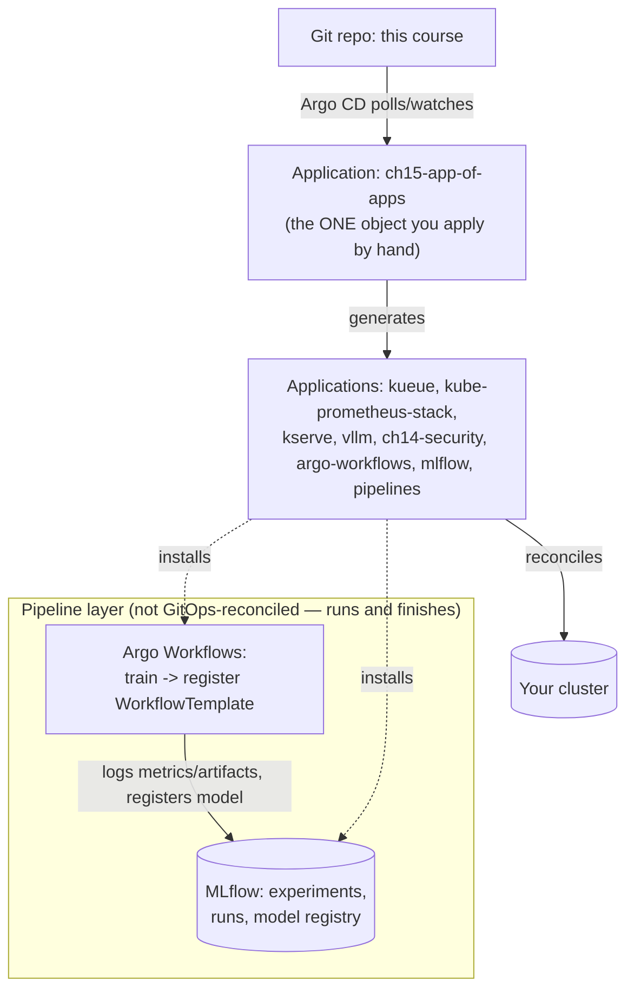
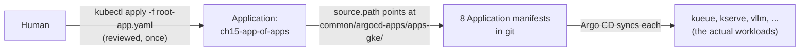
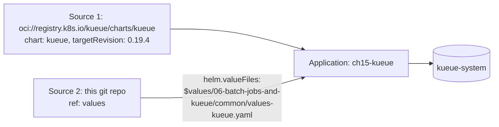

# 15 · MLOps: GitOps and Pipelines

> Handing the stack you've built by hand in chapters `00`–`14` over to **Argo CD** (app-of-apps,
> against your **existing** Argo CD install — this chapter never installs or reconfigures Argo
> CD itself), orchestrating multi-step training→registration pipelines with **Argo Workflows**,
> and tracking runs/models in **MLflow** — on **GKE, EKS and AKS**.

---

## Before you start

This chapter assumes:

- **Lab A (cpu-lab) needs only a working cluster** from
  [00-prerequisites-and-cluster-setup](../00-prerequisites-and-cluster-setup) — no GPU quota, no
  Argo CD.
- **Lab B needs an Argo CD instance you already run** (chart `argo-cd`, namespace `argocd`) — this
  chapter never installs or reconfigures Argo CD itself (see the note at the top of this README
  and in [CLAUDE.md](../CLAUDE.md)). If you don't run Argo CD, skip straight to Lab A/cpu-lab;
  there's no GitOps-specific prerequisite chapter to go read first.
- **The chapters this app-of-apps wires together, if you want the synced Applications to actually
  do something**: [06-batch-jobs-and-kueue](../06-batch-jobs-and-kueue) (`app-kueue.yaml`/
  `app-kueue-queues.yaml` reuse its values file and `team-a`/`team-b` ClusterQueue),
  [04-gpu-observability](../04-gpu-observability) (`app-kube-prometheus-stack.yaml`),
  [09-llm-inference-with-vllm](../09-llm-inference-with-vllm) (`app-vllm.yaml`),
  [11-kserve](../11-kserve) (`app-kserve*.yaml`), and
  [14-multi-tenancy-and-security](../14-multi-tenancy-and-security) (`app-ch14-security.yaml`) —
  you don't need any of them deployed to *apply* the app-of-apps, only to have something
  meaningful happen when you sync a given child.
- A git fork of this repo you can push to, with every `YOUR_ORG`/`YOUR_PROJECT`/`YOUR_AWS_ACCOUNT`/
  `YOUR_STORAGE_ACCOUNT` placeholder filled in — see §4 Step 2 before applying anything from this
  chapter against a real Argo CD.

## 1. Why this matters

Every chapter so far ended with a human running `helm install` / `kubectl apply -k` from a
laptop. That's fine for learning; it doesn't scale to "did team B's Friday change actually match
what's in git" or "what exactly is running on the cluster right now, and who approved it." GitOps
answers both: git is the source of truth, a controller (Argo CD) continuously reconciles the
cluster to match it, and `kubectl apply` mostly stops being something a human runs directly.
**This chapter assumes you (or your organization) already run Argo CD** — the brief for this repo
is explicit that touching a live Argo CD instance is out of scope for an auto-generated chapter,
so everything here is content Argo CD would manage, plus the one `Application` object (the
"app-of-apps" root) you apply yourself after reviewing it.

The second half — Argo Workflows + MLflow — is the pipeline layer GitOps doesn't cover:
GitOps reconciles *long-lived infrastructure* (Kueue, vLLM, KServe, this course's whole stack);
Argo Workflows runs *finite, multi-step jobs* (train → evaluate → register); MLflow is where the
output of those jobs (metrics, artifacts, model versions) actually lives so "which model is in
production" has an answer that isn't "whoever remembers."



## 2. Learning objectives & time plan (~3 h)

By the end you can:

1. Explain the app-of-apps pattern: one root `Application` that itself only manages other
   `Application` objects, and why that's the unit you review/apply instead of dozens of
   separate `helm install` commands.
2. Write an Argo CD multi-source `Application` that combines an upstream Helm chart with a
   values file from your own git repo (`sources[].ref` / `$values`), and explain why that's
   different from vendoring the whole chart.
3. Scope an `AppProject` (`sourceRepos`, `destinations`, `clusterResourceWhitelist`) narrower
   than the `default` project, and explain the blast-radius difference.
4. Explain why this chapter's Applications ship with **manual sync** by default and what
   changes (and what risk you accept) when you turn on `syncPolicy.automated`.
5. Write an Argo Workflows `WorkflowTemplate` that chains a training step to an MLflow
   registration step, and read `argo logs`/`argo get` to debug a failed step.
6. Explain what MLflow's tracking server, artifact store, and model registry each do, and how
   an `InferenceService` (chapter `11`) or vLLM deployment (chapter `09`) would consume a
   registered model version in a real rollout.

| Block | Time | What |
|---|---|---|
| Theory | 30 min | §3 concepts, app-of-apps, sync safety |
| Lab A (any cluster) | 60 min | cpu-lab: Argo Workflows + MLflow directly via Helm, run the train→register pipeline |
| Lab B (your cloud, if you run Argo CD) | 60 min | Review and apply the root Application against your own Argo CD; sync one child app |
| Lab C (optional) | 20 min | Add a ninth child Application for a component this chapter didn't cover |
| Review | 10 min | troubleshooting, checkpoint questions |

## 3. Concepts

### 3.1 App-of-apps: one Application that manages Applications



`common/argocd-apps/apps-<cloud>/*.yaml` are themselves just `Application` objects committed to
git — nothing special about them syntactically. The "app-of-apps" trick is entirely that the
**root** `Application` (`<cloud>/root-app.yaml`) points its `source.path` at the *directory
containing them*, so Argo CD treats "the list of child Applications" as content it reconciles
too. Add a ninth `.yaml` file to that directory, commit, and (once you sync the root) Argo CD
creates the ninth child Application for you — you never ran `argocd app create` by hand for it.

### 3.2 Why every Application here ships without `syncPolicy.automated`

Argo CD's `syncPolicy.automated` block makes an `Application` self-heal and auto-apply every git
change the moment it's detected — genuinely useful once you trust the pipeline, genuinely
dangerous the first time you wire a course repo's app-of-apps against a real cluster with real
GPU spend. Every `Application` in this chapter is **manual-sync by default**: Argo CD will show
you an `OutOfSync` diff and wait for `argocd app sync <name>` (or a UI click). Once you've run
through Lab B and trust what each child app does, add:

```yaml
spec:
  syncPolicy:
    automated:
      prune: true      # deletes cluster objects removed from git — real teeth, understand it first
      selfHeal: true    # reverts manual kubectl edits that drift from git
```

to individual `Application` objects, one at a time, not as a blanket edit to all eight.

### 3.3 AppProject: the blast radius of "what can this app-of-apps touch"

The `default` AppProject (created automatically with Argo CD) allows any source repo, any
destination namespace, and any cluster-scoped resource — an app-of-apps in `default` is
effectively cluster-admin via git. `project.yaml` defines `ai-platform` instead:
`sourceRepos` lists exactly the git repo and Helm repos this chapter's Applications use;
`destinations` lists exactly the namespaces they deploy into; `clusterResourceWhitelist` lists
exactly the cluster-scoped kinds (Kueue's CRDs, this course's `ValidatingAdmissionPolicy`,
Kyverno's `ClusterPolicy`, RBAC `ClusterRole`) they're allowed to create — anything else a
compromised or careless commit tried to add (say, a `ClusterRoleBinding` granting
cluster-admin) is rejected by Argo CD itself, before it ever reaches the API server's own RBAC
check.

### 3.4 Multi-source Applications: chart + your values, not chart + fork



Argo CD's multi-source Applications (`spec.sources`, a list) let one source be an upstream Helm
chart and a second be a plain git repo providing values, referenced via `ref:` and `$values/...`
in the chart source's `helm.valueFiles`. This is what makes `app-kueue.yaml`,
`app-kube-prometheus-stack.yaml`, `app-argo-workflows.yaml` and `app-mlflow.yaml` work without
forking the upstream chart into this repo: **the values files chapters `06` and `04` already
wrote are the single source of truth**, reused instead of duplicated. Plain kustomize-path
Applications (`app-vllm.yaml`, `app-ch14-security.yaml`, `app-pipelines.yaml`) don't need this —
they just point `source.path` at a chapter's own kustomize overlay, the same directory
`kubectl apply -k` would use.

### 3.5 Sync waves: ordering without a workflow engine

`argocd.argoproj.io/sync-wave` annotations (lower number syncs first) are how the app-of-apps
gets CRDs before the objects that need them without a separate pipeline: `app-kserve-crd.yaml`
is wave `0`, `app-kserve.yaml` (the controller, which needs those CRDs) is wave `1`;
`app-kueue.yaml` (controller + CRDs) is wave `0`, `app-kueue-queues.yaml` (ResourceFlavors/
ClusterQueues that need the CRDs registered) is wave `1`. Argo CD waits for each wave's
Applications to reach `Healthy` before starting the next.

### 3.6 Argo Workflows vs Kueue/TrainJob (chapters 06/07) — different layers

Argo Workflows orchestrates a **DAG of steps** that each finish and hand off (train → register,
or extract → transform → load); Kueue admits **Workloads** (Jobs, TrainJobs, RayJobs) against
quota; Kubeflow Trainer's `TrainJob` runs **one distributed training job**. They compose: an
Argo Workflows step's container can itself submit a `TrainJob` or a Kueue-managed `Job` and poll
for completion, letting a single pipeline definition span "orchestrate the whole ML lifecycle"
while still going through chapter `06`'s admission/fairness controls for the expensive GPU step.
This chapter's `train-and-register` `WorkflowTemplate` keeps the training step as a plain
container (CPU-only, so it runs without GPU quota) — swap it for a `TrainJob`/`RayJob`
submission once you're pointing at real GPU capacity.

### 3.7 MLflow: tracking, artifacts, registry — three different things people conflate

- **Tracking server** — the API/UI (`MLFLOW_TRACKING_URI`) that experiments and runs log
  metrics/params to (`mlflow.log_metrics`, `mlflow.start_run()`).
- **Artifact store** — where the actual files (model weights, plots, checkpoints) live. The
  chart's `artifactRoot.{gcs,s3,azureBlob}` points this at the same kind of object storage
  chapter `05` uses for model downloads — proxied through the server
  (`proxiedArtifactStorage: true`) so clients never need direct cloud credentials, consistent
  with this chapter's workload-identity-only stance.
- **Model registry** — a named, versioned pointer (`mlflow.register_model(...)`) on top of
  logged artifacts. "Which model is in production" is a registry stage/alias, not a file path —
  this is what a real KServe `InferenceService` or vLLM rollout would read to decide which
  weights to serve next, instead of a human editing a Deployment's image tag.

## 4. Lab

Layout:

```
15-mlops-gitops-and-pipelines/
├── common/
│   ├── argocd-apps/
│   │   ├── project.yaml            AppProject "ai-platform"
│   │   └── apps-{gke,eks,aks}/     8 child Application manifests + kustomization per cloud
│   ├── workflows/                  ch15-pipelines namespace, RBAC, PVC, train-and-register WorkflowTemplate
│   └── mlflow/                     values-mlflow-{gke,eks,aks,cpu-lab}.yaml (Helm values, not applied directly)
├── gke/ eks/ aks/                  root-app.yaml (the ONE Application you apply by hand), kustomization.yaml, cleanup.sh
└── cpu-lab/                        install-argo-workflows.sh, install-mlflow.sh (plain Helm, no Argo CD needed), kustomization.yaml (workflows), cleanup.sh
```

```bash
cp env.sh.example env.sh   # repo root, if not already done
source env.sh && source versions.env
```

### Step 1: No Argo CD yet? Start here (any cluster)

What you're about to do: install Argo Workflows and MLflow directly via Helm (no Argo CD
involved), then run the `train-and-register` pipeline end to end and confirm MLflow actually
recorded the run.

```bash
./15-mlops-gitops-and-pipelines/cpu-lab/install-argo-workflows.sh
./15-mlops-gitops-and-pipelines/cpu-lab/install-mlflow.sh
kubectl apply -k 15-mlops-gitops-and-pipelines/cpu-lab
kubectl -n argo port-forward svc/argo-workflows-server 2746:2746 &
kubectl -n mlflow port-forward svc/mlflow 5000:5000 &
argo submit --watch -n ch15-pipelines --from workflowtemplate/train-and-register
```

**Expected output**: `argo submit --watch` prints both steps (`train`, `register`) reaching
`Succeeded`, ending with `Status: Succeeded`.

**How to tell this worked**: open `http://localhost:5000` — the `ch15-train-and-register`
experiment has a new run with a logged `eval_loss` metric, and **Models** shows a registered
model `ch15-demo-model` with a new version. If the Workflow succeeded but nothing shows up here,
the register step ran against the wrong `MLFLOW_TRACKING_URI` — see section 6.

### Step 2 (only if you run Argo CD): Review, then apply the app-of-apps

**Do not skip the review.** Every `Application`/`AppProject` manifest here has `YOUR_ORG`,
`YOUR_PROJECT`, `YOUR_AWS_ACCOUNT`, or `YOUR_STORAGE_ACCOUNT` placeholders — fill in your own
fork's clone URL and cloud identifiers first, and push this repo somewhere Argo CD can reach.

```bash
grep -rln "YOUR_" 15-mlops-gitops-and-pipelines/   # find every placeholder before editing
grep -rln "YOUR_" 15-mlops-gitops-and-pipelines/ | xargs sed -i '' 's#YOUR_ORG/kubernetes-ai-infrastructure#<your-fork>#g'   # example; do the rest by hand
```

<details>
<summary><b>GKE</b></summary>

```bash
kubectl apply -f 15-mlops-gitops-and-pipelines/common/argocd-apps/project.yaml
kubectl apply -f 15-mlops-gitops-and-pipelines/gke/root-app.yaml
```
</details>

<details>
<summary><b>EKS</b></summary>

```bash
kubectl apply -f 15-mlops-gitops-and-pipelines/common/argocd-apps/project.yaml
kubectl apply -f 15-mlops-gitops-and-pipelines/eks/root-app.yaml
```
</details>

<details>
<summary><b>AKS</b></summary>

```bash
kubectl apply -f 15-mlops-gitops-and-pipelines/common/argocd-apps/project.yaml
kubectl apply -f 15-mlops-gitops-and-pipelines/aks/root-app.yaml
```
</details>

```bash
argocd app get ch15-app-of-apps
argocd app list -l app.kubernetes.io/part-of=ai-platform
```

**Expected output**: `argocd app get ch15-app-of-apps` shows `Health: Healthy` (the root
Application itself just creates the 8 child Application objects — a fast sync); `argocd app list`
shows all 8 child apps with `SYNC STATUS: OutOfSync` (manual sync — expected, see §3.2).

**How to tell this worked**: 8 child apps listed, not an error about `AppProject ai-platform does
not allow ...` — if you see that, a `destinations`/`sourceRepos` entry is missing in
`project.yaml` for the app's target namespace/repo (see section 6).

### Step 3: Sync one child app, read the diff first

What you're about to do: sync exactly one child Application after reviewing its diff — the
pattern you'd repeat for each app once you trust it, never all 8 at once on a first run.

```bash
argocd app diff ch15-mlflow
argocd app sync ch15-mlflow
argocd app wait ch15-mlflow --health
```

**Expected output**: `argocd app diff` prints the resources about to be created (MLflow
Deployment, Service, PVC, etc.); `argocd app sync` streams the apply; `argocd app wait --health`
blocks until `Healthy` or times out.

**How to tell this worked**: `argocd app get ch15-mlflow` shows `Sync Status: Synced` and
`Health Status: Healthy`; `kubectl -n mlflow get pods` shows the MLflow pod `Running`.

### Step 4 (optional): Add a ninth Application

What you're about to do: extend the app-of-apps with a component this chapter didn't wire up, to
prove the "commit a file, Argo CD creates the Application" mechanic from §3.1 yourself.

```bash
cp 15-mlops-gitops-and-pipelines/common/argocd-apps/apps-gke/app-vllm.yaml \
   15-mlops-gitops-and-pipelines/common/argocd-apps/apps-gke/app-kserve-demo.yaml
# edit app-kserve-demo.yaml: change metadata.name and spec.source.path to point at 11-kserve/gke
# add it to apps-gke/kustomization.yaml's resources list
git add -A && git commit -m "ch15: add kserve demo Application" && git push
argocd app sync ch15-app-of-apps
argocd app list -l app.kubernetes.io/part-of=ai-platform   # now 9
```

**Expected output**: after the push and root-app sync, a ninth Application (whatever you named
it) appears in `argocd app list`, `OutOfSync` (manual sync, same as the others).

**How to tell this worked**: you never ran `argocd app create` for the ninth app — it exists
purely because it was a file in the directory the root Application's `source.path` points at.

## 5. Spot considerations

- Pin the Argo Workflows controller and MLflow server off spot (`controller.nodeSelector` in
  `values-argo-workflows.yaml`) — same reasoning as Kueue's controller (chapter `06`): these are
  shared orchestration/registry components, not per-tenant compute.
- Individual Workflow **step pods** are exactly the kind of bursty, restartable, checkpoint-
  friendly work spot is made for — run them on spot node pools like any other batch Job, and
  reuse chapter `06`'s `podFailurePolicy` pattern if a step wraps a `batch/v1` Job.
- MLflow's SQLite-on-PVC backend store (this chapter's default) is a single file — a spot node
  reclaim mid-write on ReadWriteOnce storage that can't follow the pod to a new node stalls the
  server until it reschedules. Move to `backendStore.postgres` (a managed database) before
  anything beyond the lab; it isn't a spot-specific problem so much as "don't run your registry's
  database as a single SQLite file," but spot churn makes the failure mode show up sooner.

## 6. Troubleshooting

| Symptom | Likely cause | Fix |
|---|---|---|
| `argocd app sync` fails: `AppProject ai-platform does not allow ... destination` | Namespace or source repo not listed in `project.yaml` | Add the missing `destinations`/`sourceRepos` entry, don't loosen to wildcards |
| Child `Application` stuck `Unknown`/repo error | `YOUR_ORG` placeholder never replaced, or Argo CD has no credentials for a private repo | Fix `repoURL`; configure the repo credential in Argo CD itself (out of scope for this chapter — that's a change to your live Argo CD, do it via your normal process) |
| `ch15-kueue-queues` syncs before `ch15-kueue` is healthy, fails on missing CRD | Sync-wave annotation missing or edited | Confirm `argocd.argoproj.io/sync-wave: "0"` on `app-kueue.yaml`, `"1"` on `app-kueue-queues.yaml` |
| `mlflow.exceptions.MlflowException: API request ... Connection refused` in the register step | `MLFLOW_TRACKING_URI` wrong, or MLflow Service not yet `Ready` | `kubectl -n mlflow get pods,svc`; the WorkflowTemplate assumes Service name `mlflow` in namespace `mlflow` |
| Workflow step stuck `Pending` | `ch15-pipelines` PVC (`ReadWriteOnce`) already mounted by a pod on a different node | Reduce parallelism, or move `pipeline-artifacts` to a `ReadWriteMany` class (Filestore/EFS/Azure Files — chapter `05`) |
| `argo submit` says `WorkflowTemplate not found` | Applied `cpu-lab/kustomization.yaml` to the wrong namespace, or Argo Workflows `controller.workflowNamespaces` doesn't include `ch15-pipelines` | `kubectl get workflowtemplate -n ch15-pipelines`; check `values-argo-workflows.yaml`'s `controller.workflowNamespaces` |
| Everything in `apps-gke/*.yaml` shows `OutOfSync` and never changes | Expected — manual sync by default (§3.2). `argocd app sync <name>` each one you've reviewed | n/a |
| `helm.valueFiles: $values/...` path not found | Multi-source `ref: values` source's `targetRevision`/repo doesn't actually contain that path (e.g. you pushed to a branch other than `main`) | Match `targetRevision` in the Application to the branch you actually pushed |

## 7. Cleanup & cost notes

```bash
./15-mlops-gitops-and-pipelines/cpu-lab/cleanup.sh
# or, if you applied the app-of-apps against your own Argo CD:
./15-mlops-gitops-and-pipelines/<gke|eks|aks>/cleanup.sh   # prints the delete commands — review, then run
```

- Argo Workflows and MLflow controllers/servers are small (a few hundred MB RAM each); the real
  cost is whatever child Applications you sync (Kueue/kube-prometheus-stack/KServe/vLLM node
  pools — see those chapters' own cost notes).
- MLflow's object-storage artifact root (GCS/S3/Azure Blob buckets referenced in
  `values-mlflow-{gke,eks,aks}.yaml`) is **not created by any script in this chapter** — create
  and delete it yourself; it will happily keep every artifact you ever log until you do.
- This chapter never runs `argocd app delete` or touches your live Argo CD's own Helm release —
  only the `Application`/`AppProject` objects it created.

## 8. Checkpoint questions

1. What's the actual mechanism that makes "app-of-apps" work — what does the root `Application`
   point at that makes Argo CD create the other eight?
2. Why does every `Application` in this chapter ship without `syncPolicy.automated`, and what
   two behaviors does adding that block turn on?
3. `app-kueue.yaml` has two entries under `spec.sources`. What does each one contribute, and
   what CLI command would this replace if you weren't using Argo CD?
4. A commit adds a `ClusterRoleBinding` granting `cluster-admin` inside
   `14-multi-tenancy-and-security/gke`. What stops that from being synced, assuming
   `clusterResourceWhitelist` wasn't updated to allow it?
5. Why is `app-kserve-crd.yaml` sync-wave `0` and `app-kserve.yaml` sync-wave `1`, and what
   would go wrong if they were both wave `0`?
6. Name the three things MLflow's chart configures separately (backend store, artifact root,
   registry) and which of the three chapter `05`'s object-storage/Workload-Identity pattern
   directly reuses.
7. The `train-and-register` WorkflowTemplate's training step is a plain container, not a
   `TrainJob`. What would you change to run it as a real distributed training job through
   chapter `07`, and why would you still want Kueue in that path?
8. Your MLflow backend store is SQLite on a `ReadWriteOnce` PVC. What's the specific failure
   mode on spot capacity, and what's the fix?
9. `root-app.yaml`'s `spec.destination.namespace` is `argocd`, and `app-pipelines.yaml`'s is
   `ch15-pipelines`. Both need an entry in `project.yaml`'s `destinations` list to sync — why does
   the FIRST one matter for literally every other Application in this chapter, not just the root?

<details>
<summary>Answers</summary>

1. `spec.source.path` on the root `Application` points at a *directory* in git
   (`common/argocd-apps/apps-<cloud>/`) containing other `Application` manifests. Argo CD
   applies whatever plain Kubernetes objects live at that path — since those objects happen to
   be `Application` CRs themselves, Argo CD ends up creating and then reconciling each one, the
   same as any other manifest it manages.
2. It's the safety default for a course repo an unknown reader points at their own cluster —
   Argo CD shows diffs and waits for an explicit `sync` instead of applying every git change
   immediately. Adding `syncPolicy.automated` turns on `prune` (delete cluster objects removed
   from git) and `selfHeal` (revert manual `kubectl` edits back to match git) — real,
   irreversible actions you should only enable once you trust the specific Application.
3. Source 1 (`repoURL: oci://registry.k8s.io/kueue/charts/kueue`) is the upstream Helm chart
   itself, pinned to `KUEUE_VERSION`. Source 2 (this git repo, `ref: values`) supplies just the
   values file chapter `06` already wrote, referenced as `$values/06-batch-jobs-and-kueue/
   common/values-kueue.yaml`. Together they replace `06-batch-jobs-and-kueue/gke/
   install-kueue.sh`'s `helm upgrade --install ... -f values-kueue.yaml` command.
4. The `ai-platform` AppProject's `clusterResourceWhitelist` doesn't include
   `rbac.authorization.k8s.io`/`ClusterRoleBinding` with unrestricted names — Argo CD refuses to
   sync any resource of a kind/group not on that list for the Application's project, independent
   of whether the underlying Kubernetes RBAC would otherwise allow the Argo CD service account
   to create it.
5. `kserve-resources` (the controller, wave `1`) installs CRs (`ServingRuntime`,
   `InferenceService` defaults) that depend on CRDs `kserve-crd` (wave `0`) registers. If both
   were wave `0`, Argo CD could sync them concurrently and the controller's install could fail
   or race against CRDs that aren't registered with the API server yet.
6. Backend store (experiment/run metadata — SQLite or a managed database), artifact root (the
   actual files — local disk or cloud object storage), and model registry (versioned pointers
   on top of logged artifacts, stored in the backend store). Chapter `05`'s Workload
   Identity/IRSA/Azure Workload Identity pattern is what this chapter's `artifactRoot.{gcs,s3,
   azureBlob}` config reuses for the artifact store specifically — the backend store and
   registry don't need cloud object-storage credentials at all.
7. Replace the `train-step` container with a step that applies/creates a `TrainJob` (chapter
   `07`'s CRD) and polls its status (e.g. via `kubectl` in the step container, or Argo's
   `resource` template type) instead of running Python inline. You'd still want it to carry a
   `kueue.x-k8s.io/queue-name` label so the expensive GPU work goes through chapter `06`'s
   quota/fairness/spot-first admission — Argo Workflows orchestrates the pipeline shape, Kueue
   still governs whether and when the GPU step is allowed to actually run.
8. A spot reclaim mid-write to the SQLite file, or the pod rescheduling to a different node
   while the `ReadWriteOnce` PVC can only attach to one node at a time, stalls or corrupts the
   backend store until the original node/pod recovers. Fix: `backendStore.postgres` pointed at
   a managed database (Cloud SQL/RDS/Azure Database), which isn't tied to a single node's
   attached volume.
9. Every child Application object (`ch15-kueue`, `ch15-mlflow`, all 8 of them) is itself a
   Kubernetes object that lives IN the `argocd` namespace — they're what the root Application's
   sync creates. If `argocd` isn't in `project.yaml`'s `destinations`, the root Application can't
   sync at all ("destination not permitted"), which means none of the 8 children ever get created
   in the first place — a missing `ch15-pipelines` entry only breaks that one child's own sync,
   but a missing `argocd` entry breaks the entire app-of-apps before it starts.

</details>

## 9. Further reading

- [Argo CD documentation](https://argo-cd.readthedocs.io/) — [App of Apps pattern](https://argo-cd.readthedocs.io/en/stable/operator-manual/cluster-bootstrapping/), [Multiple Sources for an Application](https://argo-cd.readthedocs.io/en/latest/user-guide/multiple_sources/), [Projects](https://argo-cd.readthedocs.io/en/stable/user-guide/projects/), [Sync waves](https://argo-cd.readthedocs.io/en/stable/user-guide/sync-waves/), [Automated Sync Policy](https://argo-cd.readthedocs.io/en/stable/user-guide/auto_sync/)
- [Argo Workflows documentation](https://argo-workflows.readthedocs.io/) — [WorkflowTemplates](https://argo-workflows.readthedocs.io/en/latest/workflow-templates/), [Argo Helm charts](https://github.com/argoproj/argo-helm)
- [MLflow documentation](https://mlflow.org/docs/latest/index.html) — [Tracking](https://mlflow.org/docs/latest/tracking.html), [Model Registry](https://mlflow.org/docs/latest/model-registry.html), [community-charts/mlflow](https://github.com/community-charts/helm-charts/tree/main/charts/mlflow)
- Cross-link: `06-batch-jobs-and-kueue` (values file this chapter's `app-kueue.yaml` reuses), `04-gpu-observability` (values file `app-kube-prometheus-stack.yaml` reuses), `07-distributed-training-kubeflow-trainer` / `08-ray-on-kubernetes` (what a real training step in the pipeline would submit), `09-llm-inference-with-vllm` / `11-kserve` (consumers of a model MLflow's registry points at), `14-multi-tenancy-and-security` (the RBAC/AppProject-scoping pattern this chapter's `ai-platform` project extends), `16-capstone-ai-platform` (assembles this chapter's app-of-apps alongside every other one)

## Versions tested

| Component | Version |
|---|---|
| Argo CD (assumed already running — this chapter does not install it) | `10.4.0` chart, namespace `argocd` (per this course's live cluster) |
| Argo Workflows (Helm chart `argo/argo-workflows`) | `2.0.6`, app `v4.1.3` (`ARGO_WORKFLOWS_VERSION` in versions.env; verified via Artifact Hub, 2026-09-16) |
| MLflow (Helm chart `community-charts/mlflow`) | `1.11.7`, app `3.16.0` (`MLFLOW_CHART_VERSION` in versions.env; verified via Artifact Hub, 2026-09-16) |
| MLflow Python client (pipeline register step image) | `ghcr.io/mlflow/mlflow:v3.4.0` — `# VERIFY:` pin to a client version compatible with your deployed server's app version |
| Kueue / kube-prometheus-stack / KServe / vLLM chart-versions referenced by child Applications | same as `versions.env` (`KUEUE_VERSION`, `KUBE_PROMETHEUS_STACK_VERSION`, `KSERVE_VERSION`) — kept in sync by hand since Argo CD `Application` YAML can't `${env}`-expand |
