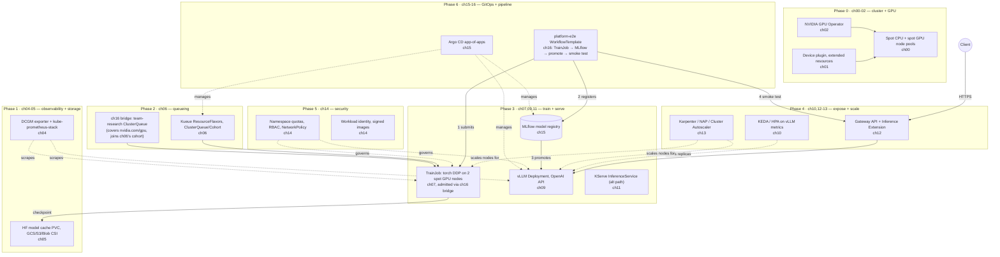

# 16 · Capstone: End-to-End Spot AI Platform

> Wire chapters 00–15 into one platform: quota-aware queueing, GPU distributed training,
> checkpointing, a model registry, GPU inference behind a gateway, autoscaling on spot capacity,
> observability, multi-tenant security, and GitOps — then break it on purpose (game day) and tear
> it down.

## 1. Why this matters

Every earlier chapter proved one capability in isolation: Kueue admits a Job, a TrainJob trains a
model, vLLM serves it, a Gateway routes to it, Karpenter/NAP adds a node for it. None of that
proves the pieces work *together* — that a TrainJob you submit is actually gated by the quota you
configured, that the checkpoint it writes is actually the one MLflow registers, that promoting a
model in MLflow actually reaches the Pod your Gateway is routing to. Integration is where capstones
(and real platforms) fail: a namespace typo, a ClusterQueue that doesn't cover the resource a
TrainJob needs, an RBAC Role that's one verb short. This chapter's job is *not* to teach a new
Kubernetes/AI concept — every concept here was taught already — it's to teach you to read across a
stack you didn't build end-to-end yourself and find where the joints don't line up, exactly the
skill you need when you inherit (or build) a real platform.

This chapter is a **read-and-run playbook**, not a new set of from-scratch labs. `common/`, `gke/`,
`eks/`, `aks/` ship the glue that earlier chapters deliberately don't own: a bridging `ClusterQueue`
(`common/kueue-bridge/`) so chapter 07's GPU `TrainJob` actually gets admitted through chapter 06's
Kueue setup, and an Argo Workflows `WorkflowTemplate` (`common/pipeline/`) that sequences a real
`TrainJob` → MLflow registration → vLLM promotion → a live smoke test through the Gateway. You run
it by applying each earlier chapter's own manifests in the order below, then this chapter's bridge
on top.

## 2. Learning objectives and time plan (~3 h, GPU path; the CPU lab below is a separate ~2 h session)

By the end you can:

1. Stand up the full stack in dependency order and explain *why* that order matters (a `TrainJob`
   submitted before Kueue's `ClusterQueue` exists sits `Pending` forever with a confusing reason).
2. Diagnose "it's wired but nothing happens" failures across namespace/RBAC/queue boundaries — the
   actual failure mode of a multi-chapter platform, not a single-manifest typo.
3. Read and extend the capstone `WorkflowTemplate` that chains TrainJob → MLflow → vLLM promotion →
   Gateway smoke test, and explain what each step depends on from earlier chapters.
4. State SLOs for a GPU inference platform (TTFT p95, GPU utilization band, cost/1M tokens) and the
   exact `kubectl`/Prometheus query that answers each one.
5. Run a game day: kill a spot node under a training job, drain a node under inference, crash the
   model server, and exhaust ClusterQueue quota — then explain what recovered on its own and what
   didn't.
6. Tear the whole platform down in reverse dependency order without leaving billable orphans.

| Time | Activity |
|---|---|
| 0:00–0:20 | Read section 3 (reference architecture); read `common/pipeline/workflowtemplate-platform-e2e.yaml` and `common/kueue-bridge/clusterqueue-team-research.yaml` in full — they're commented as design docs, not just manifests |
| 0:20–1:30 | Build order (section 4): bring up phases 0–3 (cluster → observability/storage → Kueue → training/serving) on **one** cloud |
| 1:30–2:00 | Build order phases 4–6 (gateway/autoscaling/node-autoscaling → security → GitOps/pipelines), then apply this chapter's `kubectl apply -k 16-capstone-ai-platform/<cloud>` |
| 2:00–2:20 | Run `validate-platform.sh`, then submit the capstone pipeline (`argo submit --watch --from workflowtemplate/platform-e2e -n ch15-pipelines`) |
| 2:20–2:50 | Game day (section 6): pick 2–3 scenarios, run them, write down what you observed |
| 2:50–3:00 | Checkpoint questions, cleanup |

## 3. Reference architecture



### 3.1 What ch16 actually adds

Everything inside the phase boxes above is a chapter you already built. This chapter (`16-`) adds
exactly two things, both deliberately small:

| File | Why it exists |
|---|---|
| `common/kueue-bridge/clusterqueue-team-research.yaml` | Chapter 07's `TrainJob` LocalQueue points at a ClusterQueue named `team-research` that chapter 06 never defines (06 ships `team-a-cq`/`team-b-cq`, CPU-only). Without this, the TrainJob sits `Pending` forever. This ClusterQueue joins chapter 06's existing cohort and reuses its `spot`/`on-demand` ResourceFlavors by name — it does not redefine them. |
| `common/pipeline/` (`namespace-rbac.yaml`, `workflowtemplate-platform-e2e.yaml`) | Nothing in chapters 06–15 sequences "train → register → promote → verify" as one operation across namespaces. This WorkflowTemplate does, using Argo Workflows (ch15) to submit a real TrainJob (ch07), register with MLflow (ch15), patch the vLLM Deployment (ch09), and curl through to prove it (ch12). |

No other chapter's files are modified. See `common/kueue-bridge/clusterqueue-team-research.yaml` and
`common/pipeline/*.yaml` — both are commented as design rationale, read them before the lab.

## 4. Lab: build order

Each phase below is `kubectl apply -k <chapter>/<cloud>` plus that chapter's install script(s), same
commands as `<cloud>/deploy-platform.sh` in this folder (which lists every command, commented out,
in order — uncomment and run a phase at a time rather than copy-pasting from here). Pick **one**
cloud for your first full run.

### Phase 0 — cluster + GPU (ch00–02)

```bash
cp env.sh.example env.sh && "$EDITOR" env.sh   # fill in project/account/subscription
source env.sh && source versions.env
./00-prerequisites-and-cluster-setup/gke/create-cluster.sh   # or eks/create-cluster.sh, aks/create-cluster.sh
./01-gpu-nodes-and-scheduling/gke/create-gpu-nodepool.sh
./02-nvidia-gpu-operator/gke/install.sh
```

**Acceptance criteria:** `kubectl get nodes -L cloud.google.com/gke-spot` (or the EKS/AKS spot
label from `CONVENTIONS.md`) shows at least one spot CPU node Ready; `kubectl -n gpu-operator get
pods` all Running; `kubectl describe node <gpu-node> | grep nvidia.com/gpu` shows the extended
resource advertised.

### Phase 1 — observability + storage (ch04–05)

```bash
./04-gpu-observability/gke/install-kube-prometheus-stack.sh
./05-model-storage-and-data/gke/setup-gcs-iam.sh   # Workload Identity binding
kubectl apply -k 05-model-storage-and-data/gke
```

**Acceptance criteria:** `kubectl -n monitoring get pods -l app.kubernetes.io/name=prometheus`
Running; a `DCGM_FI_DEV_GPU_UTIL` series exists in Prometheus once phase 3 has a GPU pod running.

### Phase 2 — queueing (ch06 + this chapter's bridge)

```bash
kubectl apply -k 06-batch-jobs-and-kueue/cpu-lab   # namespace + flavors + cohort + queues (cloud-agnostic)
./06-batch-jobs-and-kueue/gke/create-nodepool.sh
./06-batch-jobs-and-kueue/gke/install-kueue.sh
kubectl apply -k 06-batch-jobs-and-kueue/gke
kubectl apply -k 16-capstone-ai-platform/gke   # applies common/kueue-bridge + common/pipeline too — see note below
```

> `16-capstone-ai-platform/<cloud>` bundles **all** of this chapter's resources (queueing bridge +
> pipeline). Applying it here is fine — the pipeline's `WorkflowTemplate` is inert until you `argo
> submit` it in phase 6 — but if you'd rather apply the bridge alone first, `kubectl apply -k
> 16-capstone-ai-platform/common/kueue-bridge` targets just that piece.

**Acceptance criteria:** `kubectl get clusterqueue team-research -o yaml` shows
`coveredResources: [cpu, memory, nvidia.com/gpu]`; `kubectl get cohort ch06-cohort` exists.

### Phase 3 — training + serving (ch07, 09, optionally 11)

```bash
./07-distributed-training-kubeflow-trainer/gke/create-gpu-nodepool.sh
./07-distributed-training-kubeflow-trainer/gke/setup-storage.sh
./07-distributed-training-kubeflow-trainer/gke/install.sh
kubectl apply -k 07-distributed-training-kubeflow-trainer/gke
kubectl apply -k 07-distributed-training-kubeflow-trainer/kueue/gke
HF_TOKEN="$HF_TOKEN" ./09-llm-inference-with-vllm/common/create-hf-secret.sh ch09-vllm
kubectl apply -k 09-llm-inference-with-vllm/gke
```

**Acceptance criteria:** `kubectl -n ch07-training get trainjobs` shows a TrainJob reach
`Complete` (or is currently `Running`/admitted, not stuck `Pending` — check `kubectl get workload -n
ch07-training` for the admission reason if it's stuck); `kubectl -n ch09-vllm get pods` shows
`vllm` `1/1 Running`; `kubectl -n ch09-vllm port-forward svc/vllm 8000:8000` then `curl
localhost:8000/v1/models` returns the served model.

### Phase 4 — gateway, autoscaling, node autoscaling (ch10, 12–13)

```bash
./12-inference-gateway-and-multinode-serving/common/install-gateway-crds.sh
./12-inference-gateway-and-multinode-serving/common/install-lws.sh
./12-inference-gateway-and-multinode-serving/gke/create-gateway.sh
kubectl apply -k 12-inference-gateway-and-multinode-serving/gke
./10-autoscaling-inference/gke/install-keda.sh
./10-autoscaling-inference/gke/install-prometheus-adapter.sh
kubectl apply -k 10-autoscaling-inference/gke
./13-node-autoscaling-and-cost/gke/enable-nap.sh
kubectl apply -k 13-node-autoscaling-and-cost/gke
```

**Acceptance criteria:** `kubectl -n ch12-gateway get gateway,httproute,inferencepool` all
`Programmed`/`Accepted`; a request through the Gateway's external address reaches vLLM;
`kubectl -n ch09-vllm get scaledobject` shows KEDA active.

### Phase 5 — multi-tenancy + security (ch14)

```bash
./14-multi-tenancy-and-security/gke/install-external-secrets.sh
./14-multi-tenancy-and-security/gke/install-kyverno.sh
kubectl apply -k 14-multi-tenancy-and-security/gke
```

**Acceptance criteria:** `kubectl auth can-i create trainjobs -n ch07-training --as
system:serviceaccount:ch16-capstone:capstone-pipeline` returns `no` (RBAC is scoped — the
`capstone-pipeline` SA can only create in the namespaces `common/pipeline/namespace-rbac.yaml`
grants); a Pod without required labels is rejected by the ValidatingAdmissionPolicy from ch14.

### Phase 6 — GitOps, pipeline, registry (ch15, this chapter's bridge)

```bash
./15-mlops-gitops-and-pipelines/cpu-lab/install-argo-workflows.sh   # or via Argo CD app-of-apps, see ch15 README
./15-mlops-gitops-and-pipelines/cpu-lab/install-mlflow.sh
kubectl apply -k 15-mlops-gitops-and-pipelines/cpu-lab
argo submit --watch -n ch15-pipelines --from workflowtemplate/platform-e2e
```

**Acceptance criteria:** `argo get -n ch15-pipelines @latest` shows all four steps (`train`,
`register`, `promote`, `smoke-test`) `Succeeded`; `kubectl -n ch09-vllm get deploy vllm -o
jsonpath='{.spec.template.metadata.annotations}'` shows the
`ch16.kubernetes-ai-infrastructure/model-version` annotation the pipeline just set.

### Validate everything at once

```bash
./16-capstone-ai-platform/gke/validate-platform.sh   # read-only; every layer, one command
```

## 5. Spot considerations

Every compute-bearing chapter above defaults to spot; this chapter changes nothing about that, but
running them *together* surfaces interactions a single chapter's lab doesn't:

- **A spot reclaim during phase 3's TrainJob** triggers chapter 07's `TrainingRuntime` restart
  policy (`maxRestarts: 10`, `restartStrategy: Recreate`) — the *whole* 2-node gang is recreated and
  resumes from the last checkpoint on the storage from chapter 05. If your checkpoint interval
  (`CHECKPOINT_EVERY` in `common/pipeline/workflowtemplate-platform-e2e.yaml`) is too coarse, you lose
  more work per reclaim than necessary — this is the first thing to tune after your first game day.
- **A spot reclaim under vLLM (phase 3/4)** drops in-flight requests (vLLM has no request
  checkpointing) — chapter 09's `PodDisruptionBudget` plus chapter 13's node autoscaler bringing up
  a replacement is what the Gateway (ch12) and KEDA (ch10) are for: route around it and scale back.
  See the game day below for what "route around it" actually looks like end to end.
- **Cohort borrowing (ch06 + this chapter's bridge)** means a GPU-hungry TrainJob and a CPU-hungry
  batch Job from chapter 06's own lab can compete for the same `ch06-cohort` quota — expected, and a
  good thing to demonstrate: submit both and watch `kubectl get workload -A` show one admitted,
  one pending on borrowed quota.
- **AKS-only:** the spot taint is added automatically (`kubernetes.azure.com/scalesetpriority=spot:NoSchedule`,
  see `CONVENTIONS.md`) — every workload above that lands on a spot node needs the matching
  toleration; each chapter's overlay already adds it, but if you hand-write a new Pod for the game
  day, don't forget it.

## 6. Game day

Read-only observation first (`validate-platform.sh`), then break one thing at a time and write down
what recovered on its own vs. what needed a human. None of these commands touch cloud billing
objects directly (no `gcloud`/`aws`/`az` delete) — they act on the cluster only, but node drains and
force-deletes **do** cause real spot evictions/replacements which cost real (small) money.

| Scenario | How to trigger it | What should happen | What to check |
|---|---|---|---|
| **Spot preemption during training** | `kubectl delete pod -n ch07-training -l trainer.kubeflow.org/trainjob-ancestor-step=trainer --force --grace-period=25` (simulates the ~25–30 s reclaim notice chapter 07's `terminationGracePeriodSeconds` is sized for) | The JobSet's `failurePolicy` recreates the whole gang; both ranks re-rendezvous; training resumes from the last checkpoint, not from step 0 | `kubectl -n ch07-training get trainjob -w`; logs show `Resuming from checkpoint step <N>`, not `step 0` |
| **Node drain under inference** | `kubectl drain <node-running-vllm> --ignore-daemonsets --delete-emptydir-data` | vLLM's `PodDisruptionBudget` (ch09) blocks the drain until a replacement is `Ready` elsewhere, or the node autoscaler (ch13) provisions a new spot node first | `kubectl get pdb -n ch09-vllm`; `kubectl get events -n ch09-vllm \| grep -i evict`; Gateway (ch12) request success rate during the drain |
| **Model server crash** | `kubectl exec -n ch09-vllm deploy/vllm -- kill 1` | Pod restarts; `startupProbe` (multi-minute budget, ch09) gates readiness so the Gateway/InferencePool (ch12) and KEDA (ch10) don't route to or scale based on a still-booting pod | `kubectl get pods -n ch09-vllm -w`; confirm 5xxs stop once `Ready` flips, not before |
| **ClusterQueue quota exhaustion** | Submit the capstone TrainJob twice concurrently, or run `06-batch-jobs-and-kueue/common/jobs/job-high-priority.yaml` against `team-research`'s quota at the same time | Second workload sits `Pending` with a clear `couldn't assign flavors` condition, or preempts a lower-`WorkloadPriorityClass` workload per `common/kueue-bridge/clusterqueue-team-research.yaml`'s `preemption` policy | `kubectl get workload -n ch07-training -o yaml \| grep -A5 conditions`; `kubectl describe clusterqueue team-research` |
| **Gateway backend loses all pods** | Scale `vllm` Deployment to 0 in `ch09-vllm` | InferencePool (ch12) has no healthy endpoints; Gateway returns 503, not a hang; KEDA (ch10) should scale back up on the next request if `minReplicaCount: 0` is set, otherwise stays at 0 until you scale manually | `curl -w '%{http_code}'` through the Gateway; `kubectl -n ch09-vllm get scaledobject -o yaml` |

Record, for each scenario you run: time-to-detect (when did a Prometheus alert or probe failure
first fire), time-to-recover (when did traffic/training resume), and whether anything needed manual
intervention. That table is what a real on-call runbook looks like.

## 7. SLOs

These are the numbers a platform team would actually track. None require new tooling — every metric
source below is something chapters 04, 09, 10 and 13 already installed.

| SLO | Target (this lab's scale: 1 vLLM replica, L4/T4, Qwen3-0.6B–class model) | Source |
|---|---|---|
| **TTFT p95** | < 500 ms at `--max-concurrency ≤ 8` (see chapter 09's benchmark job; scales with `--max-model-len` and concurrency — re-baseline for your model) | `vllm bench serve` output (ch09 §4 Step 3), or `vllm:time_to_first_token_seconds` histogram if you scrape vLLM's own `/metrics` into Prometheus (ch04) |
| **GPU utilization** | 40–80% sustained under load; sustained ~100% *with requests queued* means add capacity (ch03 sharing or ch13 scale-out); sustained near 0% on an on-demand node is wasted spend | `DCGM_FI_DEV_GPU_UTIL` (ch04 §3.1) — `avg_over_time(DCGM_FI_DEV_GPU_UTIL[5m])` |
| **Cost / 1M tokens** | Back-of-envelope: `(spot $/hr for your GPU node ÷ (tokens/sec from the ch09 benchmark × 3600)) × 1,000,000`. E.g. an L4 spot node at ~$0.20/hr serving ~800 output tok/s ≈ **$0.07 per 1M output tokens** — recompute with your own benchmark numbers and current spot pricing, this is not a quote | Node spot price (cloud console/CLI) + `vllm bench serve` throughput (ch09); attribute with `app.kubernetes.io/part-of` labels per chapter 13 §8's cost-allocation guidance |
| **Training checkpoint recency** | Never more than `CHECKPOINT_EVERY` steps of work lost to a single spot reclaim | Compare TrainJob step counter in logs against the checkpoint file's step suffix on the storage from ch05 |
| **Admission latency (Kueue)** | Workload `Pending`→`Admitted` in seconds when quota is free; correctly stays `Pending` (not erroring) when quota is exhausted | `kubectl get workload -o json \| jq '.status.conditions'` timestamps |

> The TTFT and cost numbers above are **illustrative math, not measured results** — this repo never
> runs anything against a live cluster. Run chapter 09's benchmark job yourself and substitute real
> numbers; treat the formulas, not the figures, as the takeaway.

## 8. Troubleshooting

| Symptom | Cause | Fix |
|---|---|---|
| TrainJob stuck `Pending`, `Workload` shows no `ClusterQueue` match | Applied chapter 07 without this chapter's `common/kueue-bridge` (or applied it to the wrong cloud overlay) | `kubectl apply -k 16-capstone-ai-platform/common/kueue-bridge`; confirm `kubectl get clusterqueue team-research` exists |
| Pipeline's `register-model` step fails: `Connection refused` to MLflow | MLflow (ch15) not installed yet, or wrong namespace/port | `kubectl -n mlflow get pods`; the pipeline hard-codes `http://mlflow.mlflow.svc.cluster.local:5000` — that must match your ch15 install |
| Pipeline's `submit-trainjob` step fails with a Forbidden error | `common/pipeline/namespace-rbac.yaml` wasn't applied, or you're running the Workflow under a different ServiceAccount than `capstone-pipeline` | `kubectl apply -k 16-capstone-ai-platform/common/pipeline`; check the WorkflowTemplate's `spec.serviceAccountName` |
| `promote-vllm` step succeeds but the served model doesn't change | vLLM's Deployment uses `Recreate` strategy — the patch only changes a Pod *annotation*, it doesn't change the served weights on its own; wire your own `initContainer`/args to read the annotation, or treat this as a "deployment marker", not a real model swap | See the comment in `common/pipeline/workflowtemplate-platform-e2e.yaml`'s `promote-vllm` template |
| `smoke-test-gateway` step 404s / times out | Gateway (ch12) not yet `Programmed`, or the in-cluster placeholder check in that step isn't a real substitute for hitting the Gateway's external address | Read the template's comment: swap in `kubectl get gateway -n ch12-gateway -o jsonpath=...` and curl that externally for a real check |
| `validate-platform.sh` shows empty output for a whole section | That phase isn't deployed yet (fine — most `\|\| true` sections mean "not installed", not "broken") | Cross-check against the build-order phase for that section above |

## 9. Cleanup

```bash
./16-capstone-ai-platform/gke/cleanup.sh   # or eks / aks — reverse dependency order, every line commented
```

Like `deploy-platform.sh`, every command is commented out — uncomment and run a phase at a time so
you can inspect anything that fails to drain cleanly before deleting the node pool under it.
**Node pools/nodegroups are the expensive part and the cluster deletion in Phase 0 is last on
purpose** — verify nothing GPU-backed is still Running before you get there.

## 10. Brief vs. reality (read this before you file a bug against your own run)

This README documents the course as it actually exists on disk, not as originally scoped. Two
things worth knowing before you rely on cross-chapter paths:

- **Chapter list matches the original plan exactly** (00-prerequisites through 16-capstone, no
  chapters added, renamed, split or dropped) — no mismatch there.
- **`07-distributed-training-kubeflow-trainer/cpu-lab/{base,gke,eks,aks}` exist as empty
  directories** — chapter 07's own `common/base/kustomization.yaml` comment says it's "shared by the
  GPU lab and the CPU lab," but no CPU `TrainingRuntime`/`TrainJob` manifests were ever added there.
  Chapter 07's `TrainingRuntime` is GPU-only end to end (hard-codes `nvidia.com/gpu` in
  `resourcesPerNode`). This chapter's own `cpu-lab/` (section 11) does **not** patch or complete
  chapter 07's directories (out of this chapter's ownership) — instead it reuses chapter 15's
  already-CPU-friendly `train-and-register` `WorkflowTemplate` as the training stand-in. If you need
  a real CPU TrainingRuntime for chapter 07 itself, that's a gap to raise against that chapter, not
  this one.
- **`16-capstone-ai-platform/eks/cleanup.sh` was a 0-byte file** before this chapter's README/cpu-lab
  work — fixed here to mirror `gke/cleanup.sh` and `aks/cleanup.sh` (same reverse-phase structure,
  EKS paths). No other existing file in `common/`, `gke/`, `aks/` needed changes.

## 11. CPU lab: the same platform, no GPU quota required

Everything above needs GPU quota on at least one cloud. This section reaches the same milestone —
train something, register it, promote it, serve it, prove it end to end — with **zero** GPU and
**zero** cloud account, reusing each earlier chapter's existing `cpu-lab/` where one exists and this
chapter's own new `cpu-lab/` for the two pieces no chapter's CPU lab covers (queue-gated training,
and gluing training → registry → serving together).

### 11.1 What doesn't carry over

| GPU path | CPU lab equivalent | What's lost |
|---|---|---|
| Chapter 07 `TrainJob` (real PyTorch DDP, NCCL, 2 GPU nodes) | Chapter 15's `train-and-register` stand-in step (a Python container that writes a toy metric + checkpoint file) | No real distributed training, no NCCL, no gang scheduling — this proves the *pipeline*, not the *training* |
| Chapter 09 vLLM (PagedAttention, continuous batching, tensor parallel) | Chapter 09's `cpu-lab/` Ollama deployment (`ch09-vllm-cpu` namespace, Qwen3-0.6B GGUF via llama.cpp) | Much lower throughput, no tensor parallel, different KV-cache implementation — same OpenAI-ish request shape, not the same performance characteristics |
| Chapter 12 Gateway + InferencePool, multi-node LWS | Not reproduced — a plain in-cluster `curl` to the Ollama Service | No real Gateway routing/load-balancing behavior to observe |
| Chapter 13 Karpenter/NAP scaling nodes for GPU pods | Chapter 13's `cpu-lab/` `scale-demo-cpu` (optional, run separately) — and per that chapter's own README, you still need a **real** GKE/EKS/AKS CPU node pool with its cluster autoscaler on to see an actual node get added; `kind`/`minikube` can't demonstrate this at all | Real node autoscaling needs a real cloud cluster even in the "CPU lab" — this is the one piece that isn't laptop-only |
| This chapter's GPU `team-research` ClusterQueue (bridges 06↔07 for `nvidia.com/gpu`) | Chapter 06's existing `team-a-queue`/`team-a-cq` (CPU-only, already covers `cpu`/`memory`) — no new bridge needed since nothing here requests a GPU | None — the CPU path never needed the bridge in the first place |

### 11.2 Build order

```bash
# 1. Any cluster works: kind/minikube, or a real GKE/EKS/AKS spot CPU pool from ch00.
./06-batch-jobs-and-kueue/cpu-lab/install-kueue.sh
kubectl apply -k 06-batch-jobs-and-kueue/cpu-lab

# 2. (Optional but recommended) queue-gated CPU "training" job, to see admission happen —
#    this chapter's own manifest, since ch06's own jobs are generic demos, not this pipeline's input.
kubectl apply -k 16-capstone-ai-platform/cpu-lab
kubectl get workload -n ch06-kueue -w   # watch ch16-cpu-preprocess get admitted, then Complete

# 3. Serving stand-in for vLLM.
kubectl apply -k 09-llm-inference-with-vllm/cpu-lab

# 4. GitOps/pipeline/registry — Argo Workflows + MLflow, no Argo CD required for the lab.
./15-mlops-gitops-and-pipelines/cpu-lab/install-argo-workflows.sh
./15-mlops-gitops-and-pipelines/cpu-lab/install-mlflow.sh
kubectl apply -k 15-mlops-gitops-and-pipelines/cpu-lab

# 5. This chapter's CPU pipeline: train-and-register (via ch15, templateRef) -> promote Ollama -> smoke test.
argo submit --watch -n ch15-pipelines --from workflowtemplate/platform-e2e-cpu
```

**Acceptance criteria:**

- `kubectl get workload -n ch06-kueue` shows `ch16-cpu-preprocess` reach `Complete` and was
  `Admitted` (not stuck `Pending` — this cluster's `team-a-cq` has no GPU to run out of, but CPU/mem
  quota is still finite; run it twice concurrently to see the second copy queue behind the first).
- `kubectl -n ch09-vllm-cpu get pods` shows `ollama` `1/1 Running`; `kubectl -n ch09-vllm-cpu
  port-forward svc/ollama 11434:11434` then `curl localhost:11434/api/tags` lists `qwen3:0.6b`.
- `argo get -n ch15-pipelines @latest` for the `platform-e2e-cpu` run shows all steps
  `Succeeded`, including the nested `train-and-register` steps (Argo renders `templateRef`
  steps inline in the run's step graph).
- `kubectl -n ch09-vllm-cpu get deploy ollama -o jsonpath='{.spec.template.metadata.annotations}'`
  shows the `ch16.kubernetes-ai-infrastructure/pipeline-run` annotation the pipeline just set.

### 11.3 Files this chapter adds for the CPU lab

| File | Why it's new (vs. reusing another chapter's file) |
|---|---|
| `cpu-lab/queued-cpu-job.yaml` | A queue-gated CPU Job to exercise chapter 06's `team-a-queue` as part of *this* platform's story — chapter 06's own `job-simple.yaml`/`job-indexed-spot.yaml` are generic teaching demos, not part of a train→serve pipeline |
| `cpu-lab/pipeline-rbac.yaml` | A dedicated `capstone-pipeline-cpu` ServiceAccount: reuses chapter 15's existing `pipelines-runner` `Role` via a new `RoleBinding` (not duplicated), plus a narrowly-scoped new `Role` in `ch09-vllm-cpu` to patch the Ollama Deployment — same "SA needs its own cross-namespace grant" reasoning as the GPU path's `common/pipeline/namespace-rbac.yaml` |
| `cpu-lab/workflowtemplate-platform-e2e-cpu.yaml` | Calls chapter 15's `train-and-register` `WorkflowTemplate` via Argo's `templateRef` (zero duplication of its training/registration logic), then adds the two steps no chapter owns: promoting the cpu-lab Ollama Deployment and a smoke test through it |

### 11.4 Cleanup

```bash
argo delete -n ch15-pipelines --all
kubectl delete -k 16-capstone-ai-platform/cpu-lab
kubectl delete -k 09-llm-inference-with-vllm/cpu-lab
./15-mlops-gitops-and-pipelines/cpu-lab/cleanup.sh
kubectl delete -k 06-batch-jobs-and-kueue/cpu-lab
helm uninstall kueue -n kueue-system
```

## 12. Checkpoint questions

<details>
<summary>1. The capstone TrainJob sits <code>Pending</code> immediately after you submit it, with no pods created. What are the first two things you check, in order, and why that order?</summary>

First `kubectl get workload -n ch07-training -o yaml` and read `status.conditions` — Kueue admission
happens before any pod is created, so a `Pending` TrainJob with zero pods is almost always a
queueing problem, not a scheduling one. Check whether the `Workload` even exists and which
`ClusterQueue` it's trying to match (`common/kueue-bridge/clusterqueue-team-research.yaml` must
exist and cover `nvidia.com/gpu`). Only after confirming admission would you move to node-level
scheduling (`kubectl describe pod`, taints/tolerations, GPU quota).
</details>

<details>
<summary>2. Why does the capstone pipeline need its own <code>capstone-pipeline</code> ServiceAccount instead of reusing chapter 15's <code>pipelines-runner</code>?</summary>

`pipelines-runner` (chapter 15) only has RBAC inside `ch15-pipelines` — enough for its own
train-and-register demo, which never leaves that namespace. This chapter's pipeline creates a
TrainJob in `ch07-training` and patches a Deployment in `ch09-vllm`, genuinely cross-namespace
actions chapter 15 never needed. Widening `pipelines-runner`'s own Role would grant those rights to
anything using that SA, including chapter 15's own workflows that don't need them — narrower,
purpose-specific SAs (this chapter's `capstone-pipeline`) keep the blast radius of a compromised
pipeline pod limited to what it actually does.
</details>

<details>
<summary>3. A spot reclaim hits one of the two TrainJob pods mid-training. Does the surviving pod keep training solo while the other reschedules?</summary>

No — chapter 07's `TrainingRuntime` sets `restartStrategy: Recreate` with `backoffLimit: 0` per
replicated Job, so losing *either* rank fails that Job immediately, which the JobSet's
`failurePolicy.maxRestarts` catches by recreating the **whole** gang. Static-world-size DDP (no
elastic rendezvous here) can't continue with a missing rank, so both ranks restart together and
resume from the last checkpoint — never "solo."
</details>

<details>
<summary>4. The <code>promote-vllm</code> pipeline step succeeds, but users report the model's answers didn't change. Is the pipeline broken?</summary>

Not necessarily — read the step's own manifest comment: it patches a pod template *annotation*
(`ch16.kubernetes-ai-infrastructure/model-version`), which triggers vLLM's `Recreate`-strategy
Deployment to replace the pod (proving the promotion signal propagates), but nothing in this lab's
placeholder step actually points the new pod at different weights. A real promotion needs the
container args/env (e.g. `--model`) or an init step to read that annotation and load the
newly-registered MLflow model version — left as the natural next extension, not a bug in the wiring
demonstrated here.
</details>

<details>
<summary>5. During the "node drain under inference" game day scenario, the drain hangs instead of completing. What's the most likely cause, and is that a bug?</summary>

Not a bug — chapter 09's `PodDisruptionBudget` on the vLLM Deployment is doing its job: it won't let
`kubectl drain` evict the only Ready replica until a replacement exists elsewhere. This is exactly
why chapter 13's node autoscaler needs to provision a replacement node *before* the drain can
complete — check `kubectl get nodes` for a new node joining, and `kubectl get events -n ch09-vllm`
for the PDB block message, rather than force-deleting the pod (which would cause the exact dropped-
request outage the PDB exists to prevent).
</details>

<details>
<summary>6. In the CPU lab, why does <code>platform-e2e-cpu</code> call chapter 15's <code>train-and-register</code> via <code>templateRef</code> instead of just copying its steps into a new template?</summary>

Two reasons: it avoids duplicating logic that already exists and is already maintained by chapter
15 (if that chapter's stand-in training step changes, this pipeline picks it up automatically), and
it demonstrates a real Argo Workflows composition pattern — building bigger workflows out of smaller
`WorkflowTemplate`s rather than one monolithic file, which is how you'd actually structure a
growing pipeline library in production.
</details>

<details>
<summary>7. Chapter 06's <code>team-a-cq</code>/<code>team-b-cq</code> ClusterQueues both exist before this chapter runs. Why not just add <code>nvidia.com/gpu</code> to one of them instead of creating a new <code>team-research</code> ClusterQueue?</summary>

Chapter 06 is scoped CPU-only by design (its README teaches Kueue fundamentals without a GPU
dependency) — editing its files would be out of this chapter's ownership (see the repo's per-chapter
convention: each chapter owns its own files) and would silently change chapter 06's own lab for
anyone running it standalone. Adding a new ClusterQueue in the *same cohort* gets GPU coverage for
this chapter's TrainJob without touching chapter 06 at all, and still lets it share/borrow the
cohort's CPU quota.
</details>

<details>
<summary>8. Your <code>validate-platform.sh</code> run shows the Kueue and GPU sections healthy, but the GitOps section (<code>ch15-pipelines</code>) is empty. Is the platform broken?</summary>

Depends where you are in the build order — check section 4's Phase 6 was actually run. The script
is read-only and intentionally silent (`\|\| true`) for anything not yet deployed, so an empty
section usually just means you haven't reached that phase, not that something failed. Cross-check
against the phase's acceptance criteria before treating it as a bug.
</details>

## 13. Further reading and versions tested

- [Kueue documentation](https://kueue.sigs.k8s.io/docs/) — ClusterQueue/Cohort/preemption semantics used by the bridge
- [Argo Workflows: WorkflowTemplates](https://argo-workflows.readthedocs.io/en/latest/workflow-templates/) — `templateRef`, `resource` template action used throughout `common/pipeline/` and `cpu-lab/`
- [Kubeflow Trainer v2](https://www.kubeflow.org/docs/components/trainer/) — TrainJob/TrainingRuntime/JobSet failure policy referenced in the game day
- [MLflow Model Registry](https://mlflow.org/docs/latest/model-registry.html)
- [Gateway API Inference Extension](https://gateway-api-inference-extension.sigs.k8s.io/)
- This repo: `CONVENTIONS.md` (spot labels/taints per cloud), `versions.env` (every pinned version
  used transitively by the chapters this capstone assembles)

**Versions tested:** every version referenced by this chapter is inherited from the chapter that
owns the component (`versions.env` plus each chapter's own "Versions tested" section) — this chapter
pins nothing new except `ghcr.io/mlflow/mlflow:v3.4.0` in the pipeline's `register-model` step,
already flagged `# VERIFY` in `common/pipeline/workflowtemplate-platform-e2e.yaml` (client/server
version compatibility — see `15-mlops-gitops-and-pipelines/README.md`'s note) and
`curlimages/curl:8.11.1` (unpinned upstream, latest stable as of 2026-09-16) in both this chapter's
and the CPU lab's smoke-test steps.
