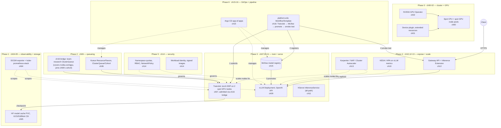

# 16 · Capstone: End-to-End Spot AI Platform

> Wire chapters 00–15 into one platform: quota-aware queueing, GPU distributed training,
> checkpointing, a model registry, GPU inference behind a gateway, autoscaling on spot capacity,
> observability, multi-tenant security, and GitOps — then break it on purpose (game day) and tear
> it down.

**New to Kubernetes and to GPU/AI infrastructure?** Read this paragraph before anything else.
Every chapter before this one taught you one Kubernetes *object type* in isolation — a `Job`, a
`TrainJob`, a `Deployment`, a `Gateway` — the same way you'd learn one instrument at a time. This
chapter is the first time you play them together, as an orchestra, and the first time you'll feel
the specific pain of a real platform: not "I don't understand Kubernetes," but "I understand every
piece, and it still isn't working, because two pieces built by two different chapters (i.e., two
different teams, in a real company) don't quite line up." That mismatch — not a new concept — is
the actual subject of this chapter. If a term below is unfamiliar (ClusterQueue, TrainJob,
Deployment, Gateway, HPA, spot instance), it was taught in an earlier chapter; the "Before you
start" list right below tells you exactly which one, so you can jump back rather than guess.

## 0. Before you start

This chapter assumes **every prior chapter's output, applied fresh in the order section 4 lays
out** — it is not a chapter you can jump into cold. If you skip ahead without doing this, the
symptom is always the same shape: a command from this chapter's README refers to a namespace,
CustomResourceDefinition (CRD), or Kubernetes object that simply doesn't exist yet, and `kubectl`
will tell you so with a `NotFound` error. That is not a bug in this chapter — it is confirmation
that a dependency below is missing. Concretely, you need:

- A cluster from [00-prerequisites-and-cluster-setup](../00-prerequisites-and-cluster-setup) with
  spot CPU + spot GPU node pools ([01-gpu-nodes-and-scheduling](../01-gpu-nodes-and-scheduling))
  and the GPU Operator ([02-nvidia-gpu-operator](../02-nvidia-gpu-operator)) installed.
- Observability ([04-gpu-observability](../04-gpu-observability)) and model storage
  ([05-model-storage-and-data](../05-model-storage-and-data)) from Phase 1.
- Kueue ([06-batch-jobs-and-kueue](../06-batch-jobs-and-kueue)) from Phase 2 — this chapter's
  `eks/clusterqueue-team-research.yaml` bridge only makes sense on top of chapter 06's
  cohort/ResourceFlavors, it doesn't replace them.
- Training ([07-distributed-training-kubeflow-trainer](../07-distributed-training-kubeflow-trainer))
  and serving ([09-llm-inference-with-vllm](../09-llm-inference-with-vllm), optionally
  [11-kserve](../11-kserve)) from Phase 3.
- Gateway/autoscaling ([10-autoscaling-inference](../10-autoscaling-inference),
  [12-inference-gateway-and-multinode-serving](../12-inference-gateway-and-multinode-serving),
  [13-node-autoscaling-and-cost](../13-node-autoscaling-and-cost)) from Phase 4.
- Security ([14-multi-tenancy-and-security](../14-multi-tenancy-and-security)) from Phase 5.
- GitOps/pipelines ([15-mlops-gitops-and-pipelines](../15-mlops-gitops-and-pipelines)) from Phase 6.

This course targets real GPU hardware throughout — there is no CPU-only fallback for this chapter.
Read section 10 ("Brief vs. reality") before filing a gap against your own run — it documents a
known, deliberate scope boundary (chapter 07 has no CPU `TrainingRuntime`; this chapter's pipeline
assumes chapter 07's real GPU TrainJob).

## 1. Why this matters

Every earlier chapter proved one capability in isolation: Kueue admits a Job, a TrainJob trains a
model, vLLM serves it, a Gateway routes to it, Karpenter/NAP adds a node for it. None of that
proves the pieces work *together* — that a TrainJob you submit is actually gated by the quota you
configured, that the checkpoint it writes is actually the one MLflow registers, that promoting a
model in MLflow actually reaches the Pod your Gateway is routing to. Integration is where capstones
(and real platforms) fail: a namespace typo, a ClusterQueue that doesn't cover the resource a
TrainJob needs, an RBAC Role that's one verb short. This chapter's job is *not* to teach a new
Kubernetes/AI concept — every concept here was taught already — it's to teach you to read across a
stack you didn't build end-to-end yourself and find where the joints don't line up, exactly the
skill you need when you inherit (or build) a real platform.

### 1.1 The big picture: what "one platform" actually means

Think of what you're building as a single pipe that a machine-learning idea flows through, from
"we have an idea for a model" to "a user is getting answers from it in production," with cost and
safety controls at every joint. Each earlier chapter built one segment of that pipe:

- **Chapters 00–02 (the foundation):** a Kubernetes cluster that actually has GPUs in it, and knows
  how to hand them out to Pods. Without this, nothing below has anywhere to run — this is the
  concrete and rebar, not a feature of the platform, but the ground it stands on.
- **Chapters 04–05 (see and store):** you can't run a platform you can't observe (ch04 — metrics,
  dashboards, alerts) or that has nowhere durable to put multi-gigabyte model weights and
  checkpoints (ch05 — object storage mounted into Pods). These aren't optional extras; a training
  job that dies with no checkpoint, or an outage nobody's dashboard shows, is a platform failure
  either way.
- **Chapter 06 (the gatekeeper):** GPUs are scarce and expensive, so before any workload is allowed
  to *use* one, something has to decide *whether* it's allowed to, right now, given what else is
  running. That's Kueue: a queue with a budget (a `ClusterQueue`) sitting in front of the cluster's
  scheduler, so "everyone submits Jobs whenever they want" doesn't turn into "everyone's Jobs fight
  over GPUs with no fairness policy."
- **Chapters 07, 09, 11 (do the actual AI work):** train a model on GPUs (ch07) and serve one for
  inference (ch09 vLLM, or ch11 KServe as an alternative). This is the part most people think of as
  "the AI platform," but notice it's chapter 3 of 6 groups — most of what makes it a *platform*
  rather than a science project is everything around it.
- **Chapters 10, 12–13 (make it reachable and elastic):** a model server nobody can reach isn't
  useful (ch12's Gateway gives it one stable address and does load-balancing/routing), and a fixed
  number of replicas is either wasteful at 3 a.m. or overwhelmed at noon (ch10's autoscaler adds/
  removes replicas, ch13's node autoscaler adds/removes the *nodes* those replicas run on).
- **Chapter 14 (don't trust everyone equally):** once multiple teams share one cluster, you need
  walls between them — quotas so one team can't starve another, RBAC so a team's ServiceAccount
  can't touch another team's namespace, network policy so a compromised Pod can't reach everything.
- **Chapter 15 (repeatability):** doing all of the above by hand once proves it *can* work; GitOps
  (Argo CD declaratively syncing manifests) and a pipeline engine (Argo Workflows sequencing steps)
  prove it can work *again*, the same way, without a human re-typing commands from memory.

Read top to bottom, that list is a believable AI platform. But each chapter built its slice with
its own toy names, its own assumed namespaces, and its own "good enough for teaching this concept"
shortcuts — because making every chapter also handle every other chapter's edge cases would have
made each one unteachable on its own. That's the deliberate trade-off, and it's why gluing them
together is *this* chapter's whole job, explained next.

### 1.2 Why a "kueue-bridge" and a "pipeline" component exist at all

You might reasonably ask: if chapters 06 and 07 were both tested and both work, why do they need a
bridge to work *together*? Because "tested in isolation" and "tested together" are different
claims, and the gap between them is exactly where real platforms break:

- Chapter 06 teaches Kueue by shipping two CPU-only ClusterQueues (`team-a-cq`, `team-b-cq`) — GPUs
  would have been a distraction from the concept it's teaching (fair-share queueing).
- Chapter 07 teaches distributed GPU training by shipping a `LocalQueue` that points at a
  ClusterQueue named `team-research` — a name chosen to sound realistic for its own lab, written
  without reference to chapter 06's specific queue names, because chapter 07 doesn't know (and
  shouldn't have to know) what chapter 06 called its queues.
- Put them on the same cluster and nothing crashes — you just get a `TrainJob` that sits `Pending`
  forever, because `team-research` doesn't exist anywhere. No error message points you at the fix;
  you have to know to look at Kueue's admission status. **That silent gap is exactly what a
  "kueue-bridge" fixes**: `eks/clusterqueue-team-research.yaml` is a small,
  reviewable file whose only job is to create the missing `team-research` ClusterQueue, joined to
  chapter 06's existing cohort (so it still shares/borrows that cohort's CPU budget) and covering
  the one resource (`nvidia.com/gpu`) chapter 06 never needed.
- Similarly, nothing in chapters 06–15 sequences the *business process* "train a model, register it
  if training succeeded, promote it to serving, then prove serving actually works" as one operation
  — each chapter proves its own step works, not that the steps chain together. The **pipeline**
  (`eks/workflowtemplate-platform-e2e.yaml`, an Argo Workflows `WorkflowTemplate`) is
  the thing that actually calls chapter 07's TrainJob, then chapter 15's MLflow, then patches
  chapter 09's Deployment, then curls through chapter 12's Gateway — in that order, with each step
  depending on the previous one succeeding. It's the executable version of the sentence "these
  chapters work together," instead of just an assertion in a README.

The general lesson, useful far beyond this course: **integration seams are where independently-
built, independently-correct components fail**, and the fix is never to rewrite either component —
it's a small, explicit, separately-owned piece of glue that names the assumption each side didn't
know it was making. That is what `kueue-bridge` and `pipeline` are, and it's why they live in this
chapter (`16-`) instead of being merged into chapter 06 or chapter 07's own files.

This chapter is a **read-and-run playbook**, not a new set of from-scratch labs. `eks/` ships the
glue that earlier chapters deliberately don't own: a bridging `ClusterQueue`
(`eks/clusterqueue-team-research.yaml`) so chapter 07's GPU `TrainJob` actually gets admitted
through chapter 06's Kueue setup, and an Argo Workflows `WorkflowTemplate`
(`eks/workflowtemplate-platform-e2e.yaml`, plus its RBAC in `eks/namespace-rbac.yaml`) that
sequences a real `TrainJob` → MLflow registration → vLLM promotion → a live smoke test through the
Gateway. You run it by applying each earlier chapter's own manifests in the order below, then this
chapter's own flat YAML files on top.

> **Cost warning up front:** this is the most expensive chapter in the course, because it is the
> only one that runs *every* GPU-and-node-autoscaling chapter's resources at the same time instead
> of one at a time. A GPU node group left running overnight is the single most common way learners
> get a surprise cloud bill from this repo — read section 5 (Spot considerations) and section 9
> (Cleanup) before you start, not after.

## 2. Learning objectives and time plan (~3 h)

By the end you can:

1. Stand up the full stack in dependency order and explain *why* that order matters (a `TrainJob`
   submitted before Kueue's `ClusterQueue` exists sits `Pending` forever with a confusing reason).
2. Diagnose "it's wired but nothing happens" failures across namespace/RBAC/queue boundaries — the
   actual failure mode of a multi-chapter platform, not a single-manifest typo.
3. Read and extend the capstone `WorkflowTemplate` that chains TrainJob → MLflow → vLLM promotion →
   Gateway smoke test, and explain what each step depends on from earlier chapters.
4. State SLOs for a GPU inference platform (TTFT p95, GPU utilization band, cost/1M tokens) and the
   exact `kubectl`/Prometheus query that answers each one.
5. Run a game day: kill a spot node under a training job, drain a node under inference, crash the
   model server, and exhaust ClusterQueue quota — then explain what recovered on its own and what
   didn't.
6. Tear the whole platform down in reverse dependency order without leaving billable orphans.

| Time | Activity |
|---|---|
| 0:00–0:20 | Read section 3 (reference architecture); read `eks/workflowtemplate-platform-e2e.yaml` and `eks/clusterqueue-team-research.yaml` in full — they're commented as design docs, not just manifests |
| 0:20–1:30 | Build order (section 4): bring up phases 0–3 (cluster → observability/storage → Kueue → training/serving) on **one** cloud |
| 1:30–2:00 | Build order phases 4–6 (gateway/autoscaling/node-autoscaling → security → GitOps/pipelines), then apply this chapter's own `eks/*.yaml` files |
| 2:00–2:20 | Run §4's "Validate everything at once" block, then submit the capstone pipeline (`argo submit --watch --from workflowtemplate/platform-e2e -n ch15-pipelines`) |
| 2:20–2:50 | Game day (section 6): pick 2–3 scenarios, run them, write down what you observed |
| 2:50–3:00 | Checkpoint questions, cleanup |

## 3. Reference architecture

If this is the first architecture diagram of this scope you've read, here's how to read it rather
than just look at it. Each dashed box (`P0` through `P6`) is one "phase" — a group of chapters whose
resources get installed together, in the order the phase numbers imply, because later phases depend
on earlier ones existing (you cannot autoscale a Deployment in P4 that P3 hasn't created yet). Solid
arrows (`-->`) mean "a real request or piece of data flows this way at runtime" — a client's HTTPS
request, a checkpoint file being written, a pipeline step calling an API. Dashed arrows (`-.->`)
mean "this component watches or manages that one, but no request-shaped traffic flows on the arrow"
— Prometheus (`OBS`) scraping metrics, Argo CD (`ARGOCD`) reconciling a Deployment's spec, RBAC
(`RBAC`) governing what a workload is allowed to do. The distinction matters operationally: if a
solid-arrow path breaks, users see errors immediately (a 503 through the Gateway); if a dashed-arrow
path breaks, nothing looks wrong *yet* — you just lose visibility or governance until you notice.

Walking it left-to-right in plain English: a client sends an HTTPS request to the Gateway (`GW`,
ch12), which forwards it to the running model server (`SERVE`, ch09's vLLM). Two autoscalers watch
that server from the side — KEDA/HPA (`HPA`, ch10) adds or removes *replicas* of the server based on
load, and Karpenter/NAP (`NAP`, ch13) adds or removes the *underlying nodes* those replicas need,
including nodes for the training job (`TRAIN`, ch07). Training itself writes its checkpoints out to
durable storage (`STORE`, ch05) — that's what protects a multi-hour training run from a spot
reclaim (see section 5). Off to the side, Prometheus (`OBS`, ch04) is scraping both `TRAIN` and
`SERVE` continuously — this is how you'd actually notice a problem, versus needing to remember to
check by hand. Kueue (`KUEUE`, ch06) sits in front of `TRAIN`, deciding whether it's allowed to run
at all given the cluster's current GPU/CPU budget; this chapter's `BRIDGE` box is the small piece
this chapter itself adds so that decision actually resolves instead of hanging forever (see
section 1.2 for why that gap exists). RBAC (`RBAC`, ch14) governs what `TRAIN` and `SERVE` are
allowed to do and who can touch them. Argo CD (`ARGOCD`, ch15) is the thing that keeps `KUEUE`,
`SERVE`, and the model registry (`REG`, ch15's MLflow) matching what's declared in Git, rather than
whatever a human last typed by hand. And finally the pipeline (`PIPE`, this chapter) is the one
component that actually *drives* the sequence end to end: it submits the TrainJob (1), registers the
resulting model with MLflow (2), promotes that model into the serving Deployment (3), and runs a
live smoke test through the Gateway to prove the whole chain actually worked (4) — the four numbered
arrows are, in order, this chapter's entire reason for existing.



### 3.1 What ch16 actually adds

Everything inside the phase boxes above is a chapter you already built. This chapter (`16-`) adds
exactly two things, both deliberately small:

| File | Why it exists |
|---|---|
| `eks/clusterqueue-team-research.yaml` | Chapter 07's `TrainJob` LocalQueue points at a ClusterQueue named `team-research` that chapter 06 never defines (06 ships `team-a-cq`/`team-b-cq`, CPU-only). Without this, the TrainJob sits `Pending` forever. This ClusterQueue joins chapter 06's existing cohort and reuses its `spot`/`on-demand` ResourceFlavors by name — it does not redefine them. |
| `eks/namespace-rbac.yaml`, `eks/workflowtemplate-platform-e2e.yaml` | Nothing in chapters 06–15 sequences "train → register → promote → verify" as one operation across namespaces. This WorkflowTemplate does, using Argo Workflows (ch15) to submit a real TrainJob (ch07), register with MLflow (ch15), patch the vLLM Deployment (ch09), and curl through to prove it (ch12). |

No other chapter's files are modified. See `eks/clusterqueue-team-research.yaml` and
`eks/workflowtemplate-platform-e2e.yaml` — both are commented as design rationale, read them before
the lab.

## 4. Lab: build order

Each phase below runs that chapter's own Lab steps (§4 of its README, EKS-only, fully
copy-pasteable there — not repeated here) plus, where noted, this chapter's own glue overlay. The
same sequence, as commented-out reference commands you uncomment a phase at a time, lives in
[`eks/deploy-platform.sh`](eks/deploy-platform.sh).

**Why phases, and why this order specifically:** Kubernetes will generally let you `kubectl apply`
things in any order — a `TrainJob` that references a `ClusterQueue` that doesn't exist yet is
accepted by the API server just fine, it just never gets admitted. That's the trap: nothing errors
loudly when you apply out of order, you just get silent `Pending` objects later and have to
reverse-engineer why. The phase order below exists specifically so each phase's *inputs* (a CRD, a
namespace, a ResourceFlavor, a running Service) already exist before the next phase's manifests
reference them. If you only remember one rule from this section: **when in doubt, apply the
thing being depended *on* first** (the queue before the job that uses it, the namespace before the
RoleBinding that grants access to it, the Deployment before the Gateway that routes to it).

### Phase 0 — cluster + GPU (ch00–02)

This phase exists to answer one question before anything else: does this AWS account actually have
a place to run GPU workloads? Everything downstream assumes yes. `env.sh` holds account-specific
values (region, cluster name, account ID) that every later chapter's commands interpolate — you set
it once, here, so you don't have to repeat AWS account details in every subsequent command.

```bash
cp env.sh.example env.sh && "$EDITOR" env.sh   # fill in your AWS account/region
source env.sh && source versions.env
```

`source`ing (not just running) `env.sh` and `versions.env` matters: `source` loads the variables
into your *current* shell so every later `kubectl`/`helm`/`eksctl` command in this README can use
them (e.g. `$EKS_CLUSTER`, `$KUEUE_VERSION`); running the file as a script instead would set those
variables in a subshell that disappears the moment the script exits, leaving your actual terminal
without them.

Run chapter 00 §4 (cluster), chapter 01 §4 (GPU node group + device plugin), chapter 02 §4 (GPU
Operator). In one sentence each: chapter 00 creates the EKS cluster and its control plane; chapter
01 adds a node group (including a **spot** GPU node group — see section 5) and makes Kubernetes
aware that GPUs are a schedulable resource at all (`nvidia.com/gpu`, an "extended resource" that
plain vanilla Kubernetes has no built-in concept of); chapter 02's GPU Operator installs the NVIDIA
driver, container toolkit, and device plugin as Kubernetes DaemonSets so you never have to SSH into
a node and install a GPU driver by hand.

**Acceptance criteria:** `kubectl get nodes -L eks.amazonaws.com/capacityType` shows at least one
spot CPU node Ready; `kubectl -n gpu-operator get pods` all Running; `kubectl describe node
<gpu-node> | grep nvidia.com/gpu` shows the extended resource advertised. If that last check comes
back empty, the node exists but Kubernetes doesn't yet know it has a GPU — nothing later in this
chapter can schedule a GPU Pod on it until the GPU Operator's DaemonSets are actually Running there.

### Phase 1 — observability + storage (ch04–05)

Why this phase comes before training/serving rather than after: you want Prometheus and durable
storage *watching and ready* before you generate anything worth watching or storing. Installing
observability after the fact means you retroactively wonder "was GPU utilization actually low
during that first training run, or did I just not have a dashboard yet" — you can never answer
that once the run is over. Chapter 04 installs `kube-prometheus-stack` (Prometheus + Grafana +
the DCGM exporter, which reads GPU metrics straight from the NVIDIA driver); chapter 05 wires up a
CSI (Container Storage Interface) driver so Pods can mount S3 as if it were a local filesystem —
that's where model weights and training checkpoints will actually live.

Run chapter 04 §4 (kube-prometheus-stack) and chapter 05 §4 (S3 CSI + IAM setup, then
`kubectl apply -k 05-model-storage-and-data/eks`).

**Acceptance criteria:** `kubectl -n monitoring get pods -l app.kubernetes.io/name=prometheus`
Running; a `DCGM_FI_DEV_GPU_UTIL` series exists in Prometheus once phase 3 has a GPU pod running.

### Phase 2 — queueing (ch06 + this chapter's bridge)

This is the phase that puts a gatekeeper in front of your (expensive, limited) GPUs. Without Kueue,
Kubernetes' default scheduler would happily start every submitted Pod immediately in first-come
order, with no concept of "team A's fair share" or "don't let one team's Jobs starve everyone
else's" — fine for a single learner's lab, a real liability the moment a second team shares the
cluster. The first command below applies chapter 06's cloud-agnostic base (namespace, Resource
Flavors describing "spot" vs "on-demand" capacity, a Cohort that lets queues share budget, and the
CPU-only queues chapter 06 teaches with) — deliberately from its `cpu-lab/` overlay here, because
that overlay is the cloud-agnostic base every cloud's Kueue install shares, not a CPU-only
substitute for the real thing:

```bash
kubectl apply -k 06-batch-jobs-and-kueue/cpu-lab   # namespace + flavors + cohort + queues (cloud-agnostic)
```

Run chapter 06 §4 (node group + Kueue install, then `kubectl apply -k 06-batch-jobs-and-kueue/eks`)
— this installs the Kueue controller itself (a Helm chart) and then layers EKS-specific pieces
(node selectors matching your actual node group labels) on top of the cloud-agnostic base you just
applied.

Then apply this chapter's own bridge (explained in full in section 1.2) — this is the step that
actually makes chapter 07's `TrainJob` admissible later in Phase 3, so skipping it is the single
most common reason a learner's GPU TrainJob sits `Pending` with no obvious error:

```bash
kubectl apply -f 16-capstone-ai-platform/eks/clusterqueue-team-research.yaml
```

> The rest of this chapter's files (`eks/namespace-rbac.yaml`, `eks/workflowtemplate-platform-e2e.yaml`)
> can be applied any time before phase 6 — the pipeline's `WorkflowTemplate` is inert until you `argo
> submit` it there. Applying the bridge alone first, as shown above, is fine.

**Acceptance criteria:** `kubectl get clusterqueue team-research -o yaml` shows
`coveredResources: [cpu, memory, nvidia.com/gpu]`; `kubectl get cohort ch06-cohort` exists.

### Phase 3 — training + serving (ch07, 09, optionally 11)

This is the phase where the platform does the AI work everything else exists to support: chapter 07
runs a real distributed PyTorch training job across 2 GPU nodes (using Kubeflow Trainer's `TrainJob`
CRD, which is admitted through the Kueue queue and bridge you just set up in Phase 2 — if Phase 2's
`team-research` ClusterQueue isn't there yet, this is where you'll see it), and chapter 09 serves a
model for inference with vLLM.

Run chapter 07 §4 (GPU node group, checkpoint storage, Trainer install, then
`kubectl apply -k 07-distributed-training-kubeflow-trainer/eks` and
`kubectl apply -k 07-distributed-training-kubeflow-trainer/kueue/eks`).

The block below sets up vLLM's namespace and, if you're serving a gated Hugging Face model, its
access token. Why this is inlined as a raw `kubectl create secret` rather than a helper script:
a Secret holds a credential, so the safest way to create one is the one command that puts it
directly into the cluster's API — no intermediate file on disk to forget to delete, no script to
audit for what it does with the token in between. `--dry-run=client -o yaml | kubectl apply -f -` is
a standard idiom here, not vLLM-specific: it renders the object as YAML locally without touching the
API server, then pipes it into `apply`, which makes the command safely re-runnable (a second run
updates the existing Secret instead of erroring that it already exists, the way a plain
`kubectl create` would):

```bash
NAMESPACE=ch09-vllm
: "${HF_TOKEN:?export HF_TOKEN=hf_xxx, or skip — optional for the ungated Qwen3-0.6B}"
kubectl create namespace "$NAMESPACE" --dry-run=client -o yaml | kubectl apply -f -
kubectl create secret generic hf-token \
  --namespace "$NAMESPACE" \
  --from-literal=HF_TOKEN="$HF_TOKEN" \
  --dry-run=client -o yaml | kubectl apply -f -

kubectl apply -k 09-llm-inference-with-vllm/eks
```

The `: "${HF_TOKEN:?...}"` line is a bash idiom for "fail with this message if the variable is
unset or empty" — it stops you here with a clear instruction instead of letting an empty token
silently reach the Secret and fail later, deep inside a Pod's logs, with a less obvious 401 error.
This chapter's own lab uses Qwen3-0.6B, which is ungated, so you can also just leave `HF_TOKEN`
unset entirely and the model will still download.

Optional: chapter 11 §4 for the KServe path instead of/alongside raw vLLM.

**Acceptance criteria:** `kubectl -n ch07-training get trainjobs` shows a TrainJob reach
`Complete` (or is currently `Running`/admitted, not stuck `Pending` — check `kubectl get workload -n
ch07-training` for the admission reason if it's stuck); `kubectl -n ch09-vllm get pods` shows
`vllm` `1/1 Running`; `kubectl -n ch09-vllm port-forward svc/vllm 8000:8000` then `curl
localhost:8000/v1/models` returns the served model.

### Phase 4 — gateway, autoscaling, node autoscaling (ch10, 12–13)

Up to this point, vLLM is running but only reachable inside the cluster (via `port-forward`, as
Phase 3's acceptance check did) — this phase makes it reachable from outside, and elastic under
load. Chapter 12 installs the Gateway API (a newer, more expressive successor to Ingress) plus the
Gateway API Inference Extension's `InferencePool`, which is inference-aware routing (it understands
that not all backend Pods are equally busy, unlike a plain round-robin load balancer). Chapter 10
installs KEDA, which scales the number of vLLM *replica Pods* up or down based on a custom metric
(queue depth, GPU utilization) rather than just CPU%, which is a poor proxy for how busy a GPU
inference server actually is. Chapter 13 installs Karpenter, which watches for Pods that can't be
scheduled (because no node has room, or the right GPU type) and provisions a brand-new *node* to fit
them — the layer below KEDA, since KEDA can create more Pods, but if there's no node with a free GPU
for them to land on, they'd sit `Pending` without Karpenter.

Run chapter 12 §4 (Gateway API CRDs, LWS, gateway controller, then
`kubectl apply -k 12-inference-gateway-and-multinode-serving/eks`), chapter 10 §4 (KEDA +
Prometheus Adapter, then `kubectl apply -k 10-autoscaling-inference/eks`), and chapter 13 §4
(Karpenter install, then `kubectl apply -k 13-node-autoscaling-and-cost/eks`).

**Acceptance criteria:** `kubectl -n ch12-gateway get gateway,httproute,inferencepool` all
`Programmed`/`Accepted`; a request through the Gateway's external address reaches vLLM;
`kubectl -n ch09-vllm get scaledobject` shows KEDA active.

### Phase 5 — multi-tenancy + security (ch14)

Everything so far has been built as if one trusted person is running the whole cluster — realistic
for you, right now, but not for a real platform with multiple teams. This phase retroactively adds
the walls that should exist between them: chapter 14 installs External Secrets (so credentials live
in a real secret store, not hand-typed `kubectl create secret` commands like Phase 3's, once you're
past the lab stage) and Kyverno (a policy engine that can reject non-compliant Pods at admission
time — e.g. a Pod missing required labels never gets created at all, rather than being created and
then flagged later).

Run chapter 14 §4 (External Secrets + Kyverno install, then
`kubectl apply -k 14-multi-tenancy-and-security/eks`).

**Acceptance criteria:** `kubectl auth can-i create trainjobs -n ch07-training --as
system:serviceaccount:ch16-capstone:capstone-pipeline` returns `no` (RBAC is scoped — the
`capstone-pipeline` SA can only create in the namespaces `eks/namespace-rbac.yaml`
grants); a Pod without required labels is rejected by the ValidatingAdmissionPolicy from ch14.

### Phase 6 — GitOps, pipeline, registry (ch15, this chapter's bridge)

This is the phase where everything built above finally gets *driven end to end* instead of just
sitting there ready. Argo Workflows is the engine that runs multi-step pipelines as Kubernetes
objects (each step is its own Pod); MLflow is the model registry — the thing that remembers "this
training run produced this specific set of weights, and here's its accuracy," so "promote this
model to serving" means something concrete rather than "hope you copied the right checkpoint file."
`argo submit --watch --from workflowtemplate/platform-e2e` is the moment this entire chapter has
been building toward: it runs the four-step pipeline this chapter added (train → register → promote
→ smoke-test, see section 1.2 and section 3's diagram) against everything you deployed in Phases
0–5. `--watch` streams the pipeline's step-by-step progress to your terminal instead of returning
immediately, which is what lets you see *which* step fails if one does, rather than only a final
pass/fail:

```bash
./15-mlops-gitops-and-pipelines/cpu-lab/install-argo-workflows.sh   # or via Argo CD app-of-apps, see ch15 README
./15-mlops-gitops-and-pipelines/cpu-lab/install-mlflow.sh
kubectl apply -k 15-mlops-gitops-and-pipelines/cpu-lab
kubectl apply -f 16-capstone-ai-platform/eks/namespace-rbac.yaml
kubectl apply -f 16-capstone-ai-platform/eks/workflowtemplate-platform-e2e.yaml
argo submit --watch -n ch15-pipelines --from workflowtemplate/platform-e2e
```

**Acceptance criteria:** `argo get -n ch15-pipelines @latest` shows all four steps (`train`,
`register`, `promote`, `smoke-test`) `Succeeded`; `kubectl -n ch09-vllm get deploy vllm -o
jsonpath='{.spec.template.metadata.annotations}'` shows the
`ch16.kubernetes-ai-infrastructure/model-version` annotation the pipeline just set. `@latest` is
Argo's shorthand for "the most recently submitted Workflow in this namespace," so you don't need to
copy-paste the auto-generated Workflow name it prints when you submitted.

### Validate everything at once

What you're about to do: run a read-only health check across every layer of the platform — the
capstone's "is it actually wired together" checklist, runnable at any point during/after the phases
above. Nothing here mutates the cluster. This is the single most useful block in this chapter for a
first-timer: rather than guessing which phase is broken from a vague symptom, run this, then read
top to bottom and stop at the first section that looks wrong (Pending, CrashLoopBackOff, or a
resource that should exist but returns "not found") — everything above that point is confirmed
healthy, so the problem is there or in the phase right after it. The repeated `|| true` after many
commands is deliberate: it stops `kubectl` from making the whole block exit early just because one
resource type doesn't exist yet (e.g. you haven't reached that phase) — a bare `kubectl get` on a
CRD that isn't installed yet would otherwise abort the script instead of showing you which layer is
missing.

```bash
echo "== Kueue: quota + admission (ch06, ch16 bridge) =="
kubectl get resourceflavor,clusterqueue,cohort
kubectl get localqueue -A

echo "== GPU nodes + device plugin (ch01-02) =="
kubectl get nodes -L nvidia.com/gpu.present,eks.amazonaws.com/capacityType
kubectl -n gpu-operator get pods || true

echo "== Observability (ch04) =="
kubectl -n monitoring get pods -l app.kubernetes.io/name=prometheus || true

echo "== Training / serving frameworks (ch07-09, 11) =="
kubectl -n ch07-training get trainjobs,trainingruntimes || true
kubectl -n ch09-vllm get deployments,pods || true
kubectl -n kserve get pods || true

echo "== Gateway + multi-node + autoscaling (ch10, 12-13) =="
kubectl -n ch12-gateway get gateway,httproute,inferencepool || true
kubectl -n ch09-vllm get scaledobject,hpa || true

echo "== Security (ch14) =="
kubectl get validatingadmissionpolicy,clusterpolicy || true
kubectl -n ch14-team-a get resourcequota,networkpolicy || true
kubectl -n external-secrets get pods || true

echo "== GitOps + pipelines + registry (ch15-16) =="
kubectl get application -n argocd -l app.kubernetes.io/part-of=ai-platform || true
kubectl -n ch15-pipelines get workflowtemplates,workflows || true
kubectl -n mlflow get pods || true
```

Review each section above for CrashLoopBackOff/Pending/0-ready before calling the platform healthy.

## 5. Spot considerations

**If you take one warning from this whole chapter, take this one: GPU spot capacity is the most
expensive thing this course touches, and this is the only chapter that keeps several GPU/autoscaling
chapters' resources running simultaneously instead of one at a time.** A spot instance is spare AWS
EC2 capacity sold at a discount (often 60–90% off on-demand) with one condition: AWS can reclaim it
with only a couple minutes' notice when it needs that capacity back. That trade — cheap, but
revocable — is why every chapter in this course defaults to it, and why "what happens when a node
disappears mid-work" is a first-class design question, not an edge case, for everything you build
here. This chapter changes nothing about that trade-off itself, but running every earlier chapter's
spot-backed workload *together* surfaces interactions a single chapter's lab never demonstrates on
its own:

- **A spot reclaim during phase 3's TrainJob** triggers chapter 07's `TrainingRuntime` restart
  policy (`maxRestarts: 10`, `restartStrategy: Recreate`) — the *whole* 2-node gang is recreated and
  resumes from the last checkpoint on the storage from chapter 05. If your checkpoint interval
  (`CHECKPOINT_EVERY` in `eks/workflowtemplate-platform-e2e.yaml`) is too coarse, you lose
  more work per reclaim than necessary — this is the first thing to tune after your first game day.
- **A spot reclaim under vLLM (phase 3/4)** drops in-flight requests (vLLM has no request
  checkpointing) — chapter 09's `PodDisruptionBudget` plus chapter 13's node autoscaler bringing up
  a replacement is what the Gateway (ch12) and KEDA (ch10) are for: route around it and scale back.
  See the game day below for what "route around it" actually looks like end to end.
- **Cohort borrowing (ch06 + this chapter's bridge)** means a GPU-hungry TrainJob and a CPU-hungry
  batch Job from chapter 06's own lab can compete for the same `ch06-cohort` quota — expected, and a
  good thing to demonstrate: submit both and watch `kubectl get workload -A` show one admitted,
  one pending on borrowed quota.
- **EKS doesn't auto-taint spot nodes** (see `CONVENTIONS.md`) — every workload above that's meant
  to land on a spot node needs its own toleration; each chapter's overlay already adds it, but if
  you hand-write a new Pod for the game day, don't forget it.

## 6. Game day

A "game day" is a deliberate, planned exercise where you break something on purpose, on a system
you understand, so the first time you see that failure mode isn't during a real, unplanned incident.
It's standard practice at companies running production infrastructure (often called chaos
engineering when automated) — the value isn't the outage, it's building the muscle memory of "I've
seen this exact symptom before and I know where to look," under conditions where nobody's paging you
and nothing catastrophic happens if you get it wrong.

Read-only observation first (§4's "Validate everything at once"), then break one thing at a time
and write down what recovered on its own vs. what needed a human. None of these commands touch
cloud billing objects directly (no `aws` delete) — they act on the cluster only, but node drains and
force-deletes **do** cause real spot evictions/replacements which cost real (small) money.

| Scenario | How to trigger it | What should happen | What to check |
|---|---|---|---|
| **Spot preemption during training** | `kubectl delete pod -n ch07-training -l trainer.kubeflow.org/trainjob-ancestor-step=trainer --force --grace-period=25` (simulates the ~25–30 s reclaim notice chapter 07's `terminationGracePeriodSeconds` is sized for) | The JobSet's `failurePolicy` recreates the whole gang; both ranks re-rendezvous; training resumes from the last checkpoint, not from step 0 | `kubectl -n ch07-training get trainjob -w`; logs show `Resuming from checkpoint step <N>`, not `step 0` |
| **Node drain under inference** | `kubectl drain <node-running-vllm> --ignore-daemonsets --delete-emptydir-data` | vLLM's `PodDisruptionBudget` (ch09) blocks the drain until a replacement is `Ready` elsewhere, or the node autoscaler (ch13) provisions a new spot node first | `kubectl get pdb -n ch09-vllm`; `kubectl get events -n ch09-vllm \| grep -i evict`; Gateway (ch12) request success rate during the drain |
| **Model server crash** | `kubectl exec -n ch09-vllm deploy/vllm -- kill 1` | Pod restarts; `startupProbe` (multi-minute budget, ch09) gates readiness so the Gateway/InferencePool (ch12) and KEDA (ch10) don't route to or scale based on a still-booting pod | `kubectl get pods -n ch09-vllm -w`; confirm 5xxs stop once `Ready` flips, not before |
| **ClusterQueue quota exhaustion** | Submit the capstone TrainJob twice concurrently, or run `06-batch-jobs-and-kueue/common/jobs/job-high-priority.yaml` against `team-research`'s quota at the same time | Second workload sits `Pending` with a clear `couldn't assign flavors` condition, or preempts a lower-`WorkloadPriorityClass` workload per `eks/clusterqueue-team-research.yaml`'s `preemption` policy | `kubectl get workload -n ch07-training -o yaml \| grep -A5 conditions`; `kubectl describe clusterqueue team-research` |
| **Gateway backend loses all pods** | Scale `vllm` Deployment to 0 in `ch09-vllm` | InferencePool (ch12) has no healthy endpoints; Gateway returns 503, not a hang; KEDA (ch10) should scale back up on the next request if `minReplicaCount: 0` is set, otherwise stays at 0 until you scale manually | `curl -w '%{http_code}'` through the Gateway; `kubectl -n ch09-vllm get scaledobject -o yaml` |

Record, for each scenario you run: time-to-detect (when did a Prometheus alert or probe failure
first fire), time-to-recover (when did traffic/training resume), and whether anything needed manual
intervention. That table is what a real on-call runbook looks like.

## 7. SLOs

These are the numbers a platform team would actually track. None require new tooling — every metric
source below is something chapters 04, 09, 10 and 13 already installed. If the jargon in this table
is new: an **SLO** (Service Level Objective) is a target a team commits to and measures against, not
just an aspiration — "TTFT p95 < 500ms" is a real SLO because it's a specific number with a specific
measurement, "the API should be fast" is not. **TTFT** is Time To First Token — how long a user
waits after sending a prompt before the model starts streaming a response back; it's the inference
equivalent of "page load time," and it's what users actually perceive as latency, more than total
response time. **p95** means "95% of requests are at or below this value" — a stronger, more honest
claim than an average, because an average can hide a bad tail (e.g. 95% of requests at 200ms and 5%
at 5 seconds still averages to a deceptively fine-looking number).

| SLO | Target (this lab's scale: 1 vLLM replica, L4/T4, Qwen3-0.6B–class model) | Source |
|---|---|---|
| **TTFT p95** | < 500 ms at `--max-concurrency ≤ 8` (see chapter 09's benchmark job; scales with `--max-model-len` and concurrency — re-baseline for your model) | `vllm bench serve` output (ch09 §4 Step 3), or `vllm:time_to_first_token_seconds` histogram if you scrape vLLM's own `/metrics` into Prometheus (ch04) |
| **GPU utilization** | 40–80% sustained under load; sustained ~100% *with requests queued* means add capacity (ch03 sharing or ch13 scale-out); sustained near 0% on an on-demand node is wasted spend | `DCGM_FI_DEV_GPU_UTIL` (ch04 §3.1) — `avg_over_time(DCGM_FI_DEV_GPU_UTIL[5m])` |
| **Cost / 1M tokens** | Back-of-envelope: `(spot $/hr for your GPU node ÷ (tokens/sec from the ch09 benchmark × 3600)) × 1,000,000`. E.g. an L4 spot node at ~$0.20/hr serving ~800 output tok/s ≈ **$0.07 per 1M output tokens** — recompute with your own benchmark numbers and current spot pricing, this is not a quote | Node spot price (cloud console/CLI) + `vllm bench serve` throughput (ch09); attribute with `app.kubernetes.io/part-of` labels per chapter 13 §8's cost-allocation guidance |
| **Training checkpoint recency** | Never more than `CHECKPOINT_EVERY` steps of work lost to a single spot reclaim | Compare TrainJob step counter in logs against the checkpoint file's step suffix on the storage from ch05 |
| **Admission latency (Kueue)** | Workload `Pending`→`Admitted` in seconds when quota is free; correctly stays `Pending` (not erroring) when quota is exhausted | `kubectl get workload -o json \| jq '.status.conditions'` timestamps |

> The TTFT and cost numbers above are **illustrative math, not measured results** — this repo never
> runs anything against a live cluster. Run chapter 09's benchmark job yourself and substitute real
> numbers; treat the formulas, not the figures, as the takeaway.

## 8. Troubleshooting

The through-line in almost every row below: **a resource that references another resource by name
or namespace doesn't validate that the target exists when you apply it** — Kubernetes' API server
accepts a `TrainJob` pointing at a nonexistent queue, or a `WorkflowTemplate` step pointing at a
nonexistent Service, without complaint. The failure only shows up later, at the moment something
tries to actually *use* that reference (admission, a network call) — which is why so many of these
symptoms are "stuck" or "silent" rather than a loud error at apply time. Once you internalize that
pattern, most of platform troubleshooting is just "find the reference, confirm the target exists."

| Symptom | Cause | Fix |
|---|---|---|
| TrainJob stuck `Pending`, `Workload` shows no `ClusterQueue` match | Applied chapter 07 without this chapter's `eks/clusterqueue-team-research.yaml` bridge. This happens because chapter 07's `LocalQueue` references a ClusterQueue named `team-research` by name, and that name only exists once *this chapter's* bridge is applied (section 1.2) — chapter 07 on its own has no way to know that name is missing | `kubectl apply -f 16-capstone-ai-platform/eks/clusterqueue-team-research.yaml`; confirm `kubectl get clusterqueue team-research` exists |
| Pipeline's `register-model` step fails: `Connection refused` to MLflow | MLflow (ch15) not installed yet, or wrong namespace/port. `Connection refused` specifically (not a timeout) means the pipeline's Pod reached the right IP but nothing was listening on that port — a strong signal the Service exists but the MLflow Pod behind it isn't up yet, versus a typo'd hostname (which would show `NXDOMAIN`/DNS failure instead) | `kubectl -n mlflow get pods`; the pipeline hard-codes `http://mlflow.mlflow.svc.cluster.local:5000` — that must match your ch15 install |
| Pipeline's `submit-trainjob` step fails with a Forbidden error | `eks/namespace-rbac.yaml` wasn't applied, or you're running the Workflow under a different ServiceAccount than `capstone-pipeline`. Kubernetes RBAC defaults to deny — a ServiceAccount can do nothing until a Role/RoleBinding explicitly grants it a verb (`create`, `get`, …) on a resource in a namespace, so a missing grant looks exactly like this: not a crash, a clean `403 Forbidden` | `kubectl apply -f 16-capstone-ai-platform/eks/namespace-rbac.yaml`; check the WorkflowTemplate's `spec.serviceAccountName` |
| `promote-vllm` step succeeds but the served model doesn't change | vLLM's Deployment uses `Recreate` strategy — the patch only changes a Pod *annotation*, it doesn't change the served weights on its own; wire your own `initContainer`/args to read the annotation, or treat this as a "deployment marker", not a real model swap. This is a deliberate simplification of this lab's pipeline, not a bug: a real promotion step would need the container's launch args (e.g. `--model <new-path>`) to actually change, which this teaching pipeline leaves as a documented next step rather than hiding behind extra complexity | See the comment in `eks/workflowtemplate-platform-e2e.yaml`'s `promote-vllm` template |
| `smoke-test-gateway` step 404s / times out | Gateway (ch12) not yet `Programmed` (its own control plane hasn't finished configuring routing yet — check with `kubectl get gateway -n ch12-gateway`), or the in-cluster placeholder check in that step isn't a real substitute for hitting the Gateway's external address, since an in-cluster curl can succeed via a path that never goes through the Gateway's actual routing rules at all | Read the template's comment: swap in `kubectl get gateway -n ch12-gateway -o jsonpath=...` and curl that externally for a real check |
| §4's "Validate everything at once" shows empty output for a whole section | That phase isn't deployed yet (fine — most `\|\| true` sections mean "not installed", not "broken"). Remember `\|\| true` exists precisely so a missing CRD/resource type doesn't abort the whole diagnostic script — an empty section is the script telling you "nothing here yet," not "something failed here" | Cross-check against the build-order phase for that section above |

## 9. Cleanup

**Do not skip this section, and do not leave the platform running "for later."** GPU nodes and
autoscaled node groups bill by the hour whether or not you're actively using them — the most common
way to turn a free/cheap lab into a real bill is walking away from this chapter with a GPU node
group still up. Set a calendar reminder if you're stopping mid-chapter.

See [`eks/cleanup.sh`](eks/cleanup.sh) — reverse dependency order, every line commented, pointing
at each chapter's own README §7 (Cleanup) for the exact commands. Uncomment and run a phase at a
time so you can inspect anything that fails to drain cleanly before deleting the node group under
it. Reverse order matters for the same reason build order did (section 4): deleting a namespace
before the Workflow running inside it finishes can leave orphaned Pods still holding a GPU, and
deleting a ClusterQueue while a TrainJob still references it can leave that TrainJob's Workload
object stuck in a confusing state. **Node groups are the expensive part and the cluster deletion in
Phase 0 is last on purpose** — verify nothing GPU-backed is still Running before you get there. A
quick way to double-check before tearing down the cluster itself: `kubectl get pods -A | grep -i
gpu` and `kubectl get nodes` should show nothing GPU-backed left, and your cloud console's EC2/node
group view should agree with `kubectl` — if they disagree, trust the cloud console, since that's
what's actually being billed.

## 10. Brief vs. reality (read this before you file a bug against your own run)

This README documents the course as it actually exists on disk, not as originally scoped. Two
things worth knowing before you rely on cross-chapter paths:

- **Chapter list matches the original plan exactly** (00-prerequisites through 16-capstone, no
  chapters added, renamed, split or dropped) — no mismatch there.
- **The course is EKS-only.** Every chapter's `gke/`/`aks/` overlays and per-cloud shell scripts
  were removed; every operational step is inlined in that chapter's own README §4/§7 instead. This
  chapter's own `common/base/kustomization.yaml` comment in chapter 07 about being "shared by the
  GPU lab and the CPU lab" is stale — chapter 07's `TrainingRuntime` is GPU-only end to end
  (hard-codes `nvidia.com/gpu` in `resourcesPerNode`). This chapter's own `cpu-lab/` (section 11)
  does **not** patch or complete chapter 07's CPU path (out of this chapter's ownership) — instead
  it reuses chapter 15's already-CPU-friendly `train-and-register` `WorkflowTemplate` as the
  training stand-in. If you need a real CPU TrainingRuntime for chapter 07 itself, that's a gap to
  raise against that chapter, not this one.

## 11. CPU lab: the same platform, no GPU quota required

If you don't yet have GPU quota approved on your AWS account (a real, common blocker — GPU quota
increases can take days and aren't guaranteed), don't let that stop you from learning the *shape* of
this platform. Everything above needs GPU quota on at least one cloud. This section reaches the same milestone —
train something, register it, promote it, serve it, prove it end to end — with **zero** GPU and
**zero** cloud account, reusing each earlier chapter's existing `cpu-lab/` where one exists and this
chapter's own new `cpu-lab/` for the two pieces no chapter's CPU lab covers (queue-gated training,
and gluing training → registry → serving together).

### 11.1 What doesn't carry over

| GPU path | CPU lab equivalent | What's lost |
|---|---|---|
| Chapter 07 `TrainJob` (real PyTorch DDP, NCCL, 2 GPU nodes) | Chapter 15's `train-and-register` stand-in step (a Python container that writes a toy metric + checkpoint file) | No real distributed training, no NCCL, no gang scheduling — this proves the *pipeline*, not the *training* |
| Chapter 09 vLLM (PagedAttention, continuous batching, tensor parallel) | Chapter 09's `cpu-lab/` Ollama deployment (`ch09-vllm-cpu` namespace, Qwen3-0.6B GGUF via llama.cpp) | Much lower throughput, no tensor parallel, different KV-cache implementation — same OpenAI-ish request shape, not the same performance characteristics |
| Chapter 12 Gateway + InferencePool, multi-node LWS | Not reproduced — a plain in-cluster `curl` to the Ollama Service | No real Gateway routing/load-balancing behavior to observe |
| Chapter 13 Karpenter scaling nodes for GPU pods | Chapter 13's `cpu-lab/` `scale-demo-cpu` (optional, run separately) — and per that chapter's own README, you still need a **real** EKS CPU node group with Karpenter running to see an actual node get added; `kind`/`minikube` can't demonstrate this at all | Real node autoscaling needs a real cloud cluster even in the "CPU lab" — this is the one piece that isn't laptop-only |
| This chapter's GPU `team-research` ClusterQueue (bridges 06↔07 for `nvidia.com/gpu`) | Chapter 06's existing `team-a-queue`/`team-a-cq` (CPU-only, already covers `cpu`/`memory`) — no new bridge needed since nothing here requests a GPU | None — the CPU path never needed the bridge in the first place |

### 11.2 Build order

```bash
# 1. Any cluster works: kind/minikube, or a real EKS spot CPU node group from ch00.
./06-batch-jobs-and-kueue/cpu-lab/install-kueue.sh
kubectl apply -k 06-batch-jobs-and-kueue/cpu-lab

# 2. (Optional but recommended) queue-gated CPU "training" job, to see admission happen —
#    this chapter's own manifest, since ch06's own jobs are generic demos, not this pipeline's input.
kubectl apply -k 16-capstone-ai-platform/cpu-lab
kubectl get workload -n ch06-kueue -w   # watch ch16-cpu-preprocess get admitted, then Complete

# 3. Serving stand-in for vLLM.
kubectl apply -k 09-llm-inference-with-vllm/cpu-lab

# 4. GitOps/pipeline/registry — Argo Workflows + MLflow, no Argo CD required for the lab.
./15-mlops-gitops-and-pipelines/cpu-lab/install-argo-workflows.sh
./15-mlops-gitops-and-pipelines/cpu-lab/install-mlflow.sh
kubectl apply -k 15-mlops-gitops-and-pipelines/cpu-lab

# 5. This chapter's CPU pipeline: train-and-register (via ch15, templateRef) -> promote Ollama -> smoke test.
argo submit --watch -n ch15-pipelines --from workflowtemplate/platform-e2e-cpu
```

**Acceptance criteria:**

- `kubectl get workload -n ch06-kueue` shows `ch16-cpu-preprocess` reach `Complete` and was
  `Admitted` (not stuck `Pending` — this cluster's `team-a-cq` has no GPU to run out of, but CPU/mem
  quota is still finite; run it twice concurrently to see the second copy queue behind the first).
- `kubectl -n ch09-vllm-cpu get pods` shows `ollama` `1/1 Running`; `kubectl -n ch09-vllm-cpu
  port-forward svc/ollama 11434:11434` then `curl localhost:11434/api/tags` lists `qwen3:0.6b`.
- `argo get -n ch15-pipelines @latest` for the `platform-e2e-cpu` run shows all steps
  `Succeeded`, including the nested `train-and-register` steps (Argo renders `templateRef`
  steps inline in the run's step graph).
- `kubectl -n ch09-vllm-cpu get deploy ollama -o jsonpath='{.spec.template.metadata.annotations}'`
  shows the `ch16.kubernetes-ai-infrastructure/pipeline-run` annotation the pipeline just set.

### 11.3 Files this chapter adds for the CPU lab

| File | Why it's new (vs. reusing another chapter's file) |
|---|---|
| `cpu-lab/queued-cpu-job.yaml` | A queue-gated CPU Job to exercise chapter 06's `team-a-queue` as part of *this* platform's story — chapter 06's own `job-simple.yaml`/`job-indexed-spot.yaml` are generic teaching demos, not part of a train→serve pipeline |
| `cpu-lab/pipeline-rbac.yaml` | A dedicated `capstone-pipeline-cpu` ServiceAccount: reuses chapter 15's existing `pipelines-runner` `Role` via a new `RoleBinding` (not duplicated), plus a narrowly-scoped new `Role` in `ch09-vllm-cpu` to patch the Ollama Deployment — same "SA needs its own cross-namespace grant" reasoning as the GPU path's `common/pipeline/namespace-rbac.yaml` |
| `cpu-lab/workflowtemplate-platform-e2e-cpu.yaml` | Calls chapter 15's `train-and-register` `WorkflowTemplate` via Argo's `templateRef` (zero duplication of its training/registration logic), then adds the two steps no chapter owns: promoting the cpu-lab Ollama Deployment and a smoke test through it |

### 11.4 Cleanup

```bash
argo delete -n ch15-pipelines --all
kubectl delete -k 16-capstone-ai-platform/cpu-lab
kubectl delete -k 09-llm-inference-with-vllm/cpu-lab
./15-mlops-gitops-and-pipelines/cpu-lab/cleanup.sh
kubectl delete -k 06-batch-jobs-and-kueue/cpu-lab
helm uninstall kueue -n kueue-system
```

## 12. Checkpoint questions

<details>
<summary>1. The capstone TrainJob sits <code>Pending</code> immediately after you submit it, with no pods created. What are the first two things you check, in order, and why that order?</summary>

First `kubectl get workload -n ch07-training -o yaml` and read `status.conditions` — Kueue admission
happens before any pod is created, so a `Pending` TrainJob with zero pods is almost always a
queueing problem, not a scheduling one. Check whether the `Workload` even exists and which
`ClusterQueue` it's trying to match (`eks/clusterqueue-team-research.yaml` must
exist and cover `nvidia.com/gpu`). Only after confirming admission would you move to node-level
scheduling (`kubectl describe pod`, taints/tolerations, GPU quota).
</details>

<details>
<summary>2. Why does the capstone pipeline need its own <code>capstone-pipeline</code> ServiceAccount instead of reusing chapter 15's <code>pipelines-runner</code>?</summary>

`pipelines-runner` (chapter 15) only has RBAC inside `ch15-pipelines` — enough for its own
train-and-register demo, which never leaves that namespace. This chapter's pipeline creates a
TrainJob in `ch07-training` and patches a Deployment in `ch09-vllm`, genuinely cross-namespace
actions chapter 15 never needed. Widening `pipelines-runner`'s own Role would grant those rights to
anything using that SA, including chapter 15's own workflows that don't need them — narrower,
purpose-specific SAs (this chapter's `capstone-pipeline`) keep the blast radius of a compromised
pipeline pod limited to what it actually does.
</details>

<details>
<summary>3. A spot reclaim hits one of the two TrainJob pods mid-training. Does the surviving pod keep training solo while the other reschedules?</summary>

No — chapter 07's `TrainingRuntime` sets `restartStrategy: Recreate` with `backoffLimit: 0` per
replicated Job, so losing *either* rank fails that Job immediately, which the JobSet's
`failurePolicy.maxRestarts` catches by recreating the **whole** gang. Static-world-size DDP (no
elastic rendezvous here) can't continue with a missing rank, so both ranks restart together and
resume from the last checkpoint — never "solo."
</details>

<details>
<summary>4. The <code>promote-vllm</code> pipeline step succeeds, but users report the model's answers didn't change. Is the pipeline broken?</summary>

Not necessarily — read the step's own manifest comment: it patches a pod template *annotation*
(`ch16.kubernetes-ai-infrastructure/model-version`), which triggers vLLM's `Recreate`-strategy
Deployment to replace the pod (proving the promotion signal propagates), but nothing in this lab's
placeholder step actually points the new pod at different weights. A real promotion needs the
container args/env (e.g. `--model`) or an init step to read that annotation and load the
newly-registered MLflow model version — left as the natural next extension, not a bug in the wiring
demonstrated here.
</details>

<details>
<summary>5. During the "node drain under inference" game day scenario, the drain hangs instead of completing. What's the most likely cause, and is that a bug?</summary>

Not a bug — chapter 09's `PodDisruptionBudget` on the vLLM Deployment is doing its job: it won't let
`kubectl drain` evict the only Ready replica until a replacement exists elsewhere. This is exactly
why chapter 13's node autoscaler needs to provision a replacement node *before* the drain can
complete — check `kubectl get nodes` for a new node joining, and `kubectl get events -n ch09-vllm`
for the PDB block message, rather than force-deleting the pod (which would cause the exact dropped-
request outage the PDB exists to prevent).
</details>

<details>
<summary>6. In the CPU lab, why does <code>platform-e2e-cpu</code> call chapter 15's <code>train-and-register</code> via <code>templateRef</code> instead of just copying its steps into a new template?</summary>

Two reasons: it avoids duplicating logic that already exists and is already maintained by chapter
15 (if that chapter's stand-in training step changes, this pipeline picks it up automatically), and
it demonstrates a real Argo Workflows composition pattern — building bigger workflows out of smaller
`WorkflowTemplate`s rather than one monolithic file, which is how you'd actually structure a
growing pipeline library in production.
</details>

<details>
<summary>7. Chapter 06's <code>team-a-cq</code>/<code>team-b-cq</code> ClusterQueues both exist before this chapter runs. Why not just add <code>nvidia.com/gpu</code> to one of them instead of creating a new <code>team-research</code> ClusterQueue?</summary>

Chapter 06 is scoped CPU-only by design (its README teaches Kueue fundamentals without a GPU
dependency) — editing its files would be out of this chapter's ownership (see the repo's per-chapter
convention: each chapter owns its own files) and would silently change chapter 06's own lab for
anyone running it standalone. Adding a new ClusterQueue in the *same cohort* gets GPU coverage for
this chapter's TrainJob without touching chapter 06 at all, and still lets it share/borrow the
cohort's CPU quota.
</details>

<details>
<summary>8. Your §4 "Validate everything at once" run shows the Kueue and GPU sections healthy, but the GitOps section (<code>ch15-pipelines</code>) is empty. Is the platform broken?</summary>

Depends where you are in the build order — check section 4's Phase 6 was actually run. The script
is read-only and intentionally silent (`\|\| true`) for anything not yet deployed, so an empty
section usually just means you haven't reached that phase, not that something failed. Cross-check
against the phase's acceptance criteria before treating it as a bug.
</details>

## 13. Further reading and versions tested

- [Kueue documentation](https://kueue.sigs.k8s.io/docs/) — ClusterQueue/Cohort/preemption semantics used by the bridge
- [Argo Workflows: WorkflowTemplates](https://argo-workflows.readthedocs.io/en/latest/workflow-templates/) — `templateRef`, `resource` template action used in `eks/workflowtemplate-platform-e2e.yaml`
- [Kubeflow Trainer v2](https://www.kubeflow.org/docs/components/trainer/) — TrainJob/TrainingRuntime/JobSet failure policy referenced in the game day
- [MLflow Model Registry](https://mlflow.org/docs/latest/model-registry.html)
- [Gateway API Inference Extension](https://gateway-api-inference-extension.sigs.k8s.io/)
- This repo: `CONVENTIONS.md` (spot labels/taints per cloud), `versions.env` (every pinned version
  used transitively by the chapters this capstone assembles)

**Versions tested:** every version referenced by this chapter is inherited from the chapter that
owns the component (`versions.env` plus each chapter's own "Versions tested" section) — this chapter
pins nothing new except `ghcr.io/mlflow/mlflow:v3.4.0` in the pipeline's `register-model` step,
already flagged `# VERIFY` in `eks/workflowtemplate-platform-e2e.yaml` (client/server
version compatibility — see `15-mlops-gitops-and-pipelines/README.md`'s note) and
`curlimages/curl:8.11.1` (unpinned upstream, latest stable as of 2026-09-16) in both this chapter's
and the CPU lab's smoke-test steps.

---

[← Prev: 15-mlops-gitops-and-pipelines](../15-mlops-gitops-and-pipelines) | [Course Map](../README.md) | [Next: 17-platform-day2-operations →](../17-platform-day2-operations)