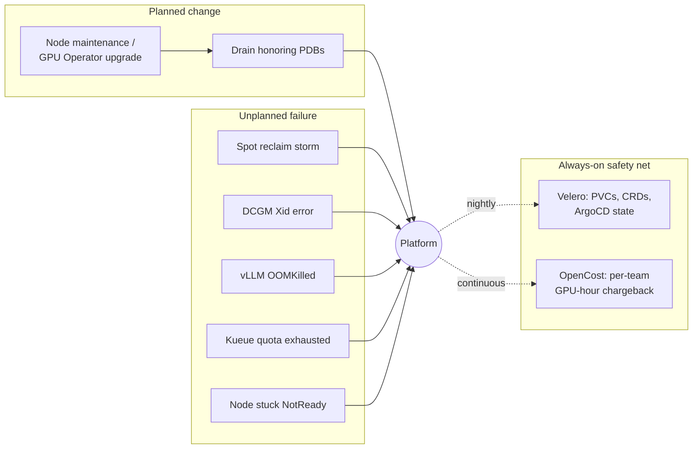
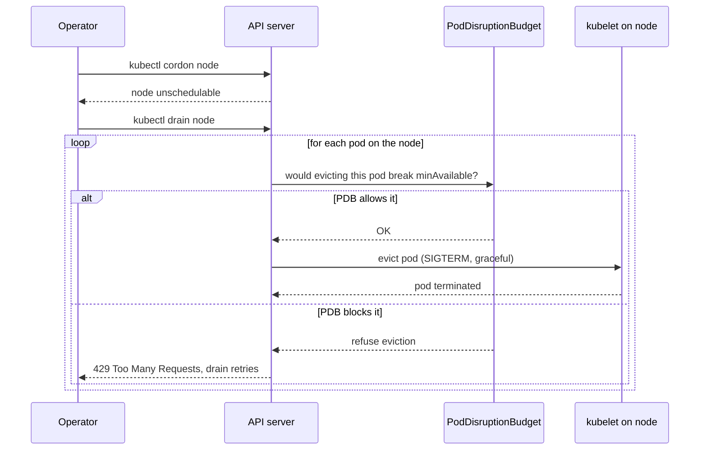
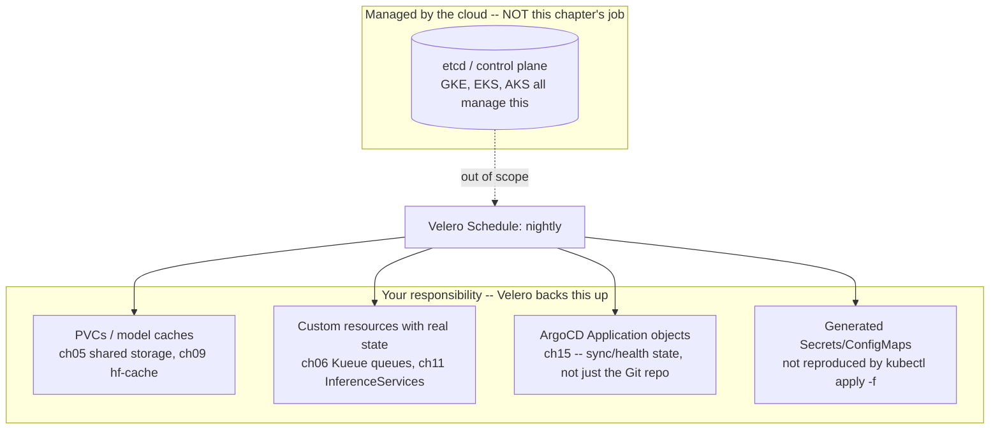
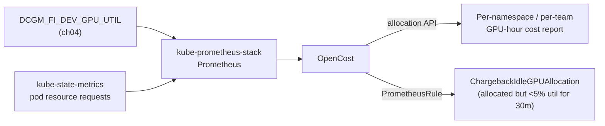

# 17 · Platform Day-2 Operations

> Running the platform chapters 00–16 built, after it's live: draining GPU nodes for maintenance
> without killing workloads, upgrading the GPU Operator/driver safely, runbooks for the failures
> this course's own chapters actually produce, backup/DR with Velero, and per-team GPU-hour
> chargeback with OpenCost.

## 0. Before you start

This chapter assumes a cluster that has already been through the earlier chapters — it does not
create node pools or GPU capacity of its own. Specifically:

- A spot GPU node pool from [`01-gpu-nodes-and-scheduling`](../01-gpu-nodes-and-scheduling) and the
  [`02-nvidia-gpu-operator`](../02-nvidia-gpu-operator) install (section 3's upgrade runbook reuses
  its `values-<cloud>.yaml`) — needed for the GPU Operator upgrade lab and the DCGM Xid runbook.
- [`04-gpu-observability`](../04-gpu-observability)'s kube-prometheus-stack (`monitoring`
  namespace, Helm release named `kube-prometheus-stack`) — the idle-GPU alert and OpenCost's
  Prometheus source both depend on it being installed under that exact release name (same gotcha
  chapter 04 itself calls out).
- [`06-batch-jobs-and-kueue`](../06-batch-jobs-and-kueue) — the Kueue quota-exhaustion runbook reads
  its ClusterQueues/Cohort/Workloads.
- [`09-llm-inference-with-vllm`](../09-llm-inference-with-vllm) — its `eks/pdb.yaml` is the PDB
  the drain lab's "real GPU workload" step drains around, and the vLLM OOMKilled runbook diagnoses
  its Deployment.
- Optional but referenced: [`11-kserve`](../11-kserve) (this chapter ships the PDB its README says
  is missing), [`13-node-autoscaling-and-cost`](../13-node-autoscaling-and-cost) (cost-visibility
  tooling this chapter's chargeback section goes deeper on), [`15-mlops-gitops-and-pipelines`](../15-mlops-gitops-and-pipelines)
  (ArgoCD `Application` state Velero backs up).
- `env.sh` and `versions.env` sourced (`source env.sh && source versions.env`).

None of the objects under this chapter's `eks/` require a GPU by themselves — the drain-demo
workload, Velero, and OpenCost all run fine on CPU-only nodes. GPUs only matter for the specific
runbooks that are inherently about GPU hardware (the Operator upgrade, DCGM Xid errors).

## 1. Why this matters

Chapters 00–16 got a platform running. None of them cover what happens six weeks later: a cloud
maintenance notice means you have to drain a node under a training job without losing it; NVIDIA
ships a GPU Operator point release and someone has to decide whether it's safe to roll out; a spot
region has a bad night and forty nodes disappear at once; a vLLM pod gets OOMKilled at 2am and the
on-call engineer has never seen the difference between a CUDA OOM and a container OOM; the cluster
itself is fine but someone asks "if we lost this cluster right now, what would we actually lose, and
how long would it take to get it back"; and finance asks which team's GPU spend tripled last month.

This is **Day-2 operations**: the recurring, unglamorous work of keeping a platform someone else
already stood up alive, safe, and accountable. It's also where a lab-grade cluster and a
production-grade platform diverge the most — chapters 00–16 taught you to build each piece
correctly once; this chapter teaches you to operate all of them together, indefinitely, without a
human staring at every node.

### 1.1 "Day-2" — what the number actually means

If you're new to this vocabulary: **Day-0** is designing the system (which cloud, which instance
types, which Kubernetes version). **Day-1** is standing it up for the first time (creating the
cluster, installing the GPU Operator, deploying the first workload) — that's what chapters 00–16
walked you through, once each, in a controlled order. **Day-2** is everything that happens *after*
it's live and other people depend on it, forever, on a schedule nobody chose: maintenance windows,
version upgrades, hardware failures, capacity crunches, and the accounting questions that only come
up once real money is being spent. A course can teach Day-0/Day-1 in a straight line; Day-2 shows
up as interruptions, which is why this chapter is organized as runbooks (recognize → recognize
which failure → fixed steps) rather than a single build-in-order lab.

Five concrete things this chapter teaches, in plain terms, before you touch a command:

- **Draining a node** means telling Kubernetes "stop scheduling new work here, and move the pods
  that are already here somewhere else, one at a time, without breaking anything that depends on
  them." It's how you take a node out of service for maintenance (an AMI update, a hardware
  replacement, a GPU Operator upgrade) without a hard outage. The flag `--delete-emptydir-data`
  matters because some pods keep working data in an `emptyDir` volume (temp storage tied to that
  specific pod, not a real disk) — for example chapter 09's vLLM pod caching a downloaded model in
  one before the persistent-cache option is added. Draining a node necessarily deletes that pod (to
  move it elsewhere), and Kubernetes refuses to do so by default if it would silently throw away
  `emptyDir` data — you must explicitly say "yes, I understand that cache is disposable and will be
  rebuilt on the new node" via this flag, or the drain command errors out instead of guessing for you.
- **A GPU Operator upgrade risk** is the fact that upgrading the NVIDIA GPU Operator (the software
  that installs and manages the GPU driver, container runtime hooks, and monitoring agents on every
  GPU node) almost always ships a new driver version too, and rolling out a new driver means
  restarting a low-level system component on every affected node — which briefly kicks every GPU
  workload on that node off the GPU while it happens. Get the version wrong, or roll it out to every
  node pool at once, and you can turn "one point release" into "every GPU workload in the cluster
  restarting simultaneously." That's why this chapter's runbook insists on a dry-run diff, a backup,
  and rolling out to one node pool before the rest.
- **A spot reclaim storm** is what happens when the cloud provider takes back a large batch of Spot
  instances at once — Spot capacity is spare, discounted compute the cloud can reclaim with only a
  couple of minutes' notice whenever it needs that capacity back for full-price customers. Because
  this course runs spot-first (see CONVENTIONS.md), a "bad night" in one instance-type/AZ pool can
  reclaim many nodes within minutes — very different from one node quietly failing, and it needs a
  different diagnostic (is this widespread and is the fallback capacity actually absorbing it, not
  "why did this one node die").
- **Velero, backup/restore, and disaster recovery (DR)** — Velero is an open-source tool that takes
  point-in-time backups of Kubernetes objects (Deployments, Custom Resources, Secrets, etc.) and,
  via your cloud's snapshot APIs, the data in Persistent Volumes. "Backup/restore" means being able
  to recreate that state later; "disaster recovery" is the broader practice of having a *plan* — not
  just backups sitting in a bucket, but a tested, timed procedure — for what you do when a cluster,
  namespace, or piece of storage is lost or corrupted. On a managed Kubernetes service (EKS here),
  the control plane itself (including `etcd`, the database Kubernetes stores all its own objects in)
  is the cloud's responsibility and isn't something you can or need to back up yourself — section 3.4
  explains exactly where the line falls.
- **Chargeback/cost-allocation tooling** (OpenCost here) answers "who is spending the money," not
  just "how much are we spending." On a shared GPU cluster where multiple teams' workloads land on
  the same nodes, a single AWS bill tells you the total but not which team's job left a $40,000 GPU
  idle overnight — OpenCost attributes cost to the Kubernetes objects (namespace, pod, workload) that
  actually consumed the resource, which is what lets a platform team hand a real, itemized number to
  each team instead of splitting the bill evenly (or arguing about it).



**Reading this diagram if you're new to Day-2 thinking:** the top-left box is things *you* schedule
on purpose (a maintenance window, a planned upgrade) — you control the timing, so you can prepare
(drain first, take a backup first). The top-right box is things that happen *to* you on someone
else's schedule — a spot reclaim, a driver crashing, a pod running out of memory, a team's quota
filling up, a node going dark — you only find out after the fact, so the response is diagnose-then-
act instead of prepare-then-act. Both feed into the same box in the middle: "the platform," meaning
the actual GPU workloads users depend on (training jobs, vLLM inference, KServe endpoints). The
bottom box is the safety net that runs regardless of what's happening above it — Velero taking
nightly backups and OpenCost continuously tracking spend — so that no matter which top-row event
occurs, you still have a recent backup to restore from and an accurate record of who was using what.
The dotted arrows ("nightly", "continuous") are deliberate: unlike the solid arrows above them,
these two run on their own schedule independent of any single incident.

## 2. Learning objectives and time plan (~3 h)

By the end you can:

1. Drain a node hosting GPU workloads for planned maintenance so a PodDisruptionBudget keeps a
   minimum number of replicas available, instead of losing every replica on that node at once.
2. Run a safe GPU Operator/driver upgrade: dry-run the diff, take a backup, roll out to one pool
   first, and know what to check before and after.
3. Recognize and respond to five specific incident patterns this course's own chapters produce:
   spot reclaim storms, DCGM Xid errors, vLLM OOMKilled pods, Kueue quota exhaustion, and a node
   stuck `NotReady`.
4. Explain what's actually worth backing up on a managed Kubernetes AI platform (and what isn't —
   etcd), configure Velero with the right cloud plugin, and frame a real RPO/RTO for this platform.
5. Read a per-team, per-GPU-hour chargeback report from OpenCost and wire an idle-GPU alert into
   chapter 04's existing DCGM metrics.

| Time | Activity |
|---|---|
| 0:00–0:25 | Read section 3 (concepts): drain+PDB mechanics, the GPU Operator upgrade runbook, backup scope, RPO/RTO |
| 0:25–1:00 | Lab step 1: drain/cordon lab (any cluster) — the generic demo, then chapter 09's real vLLM PDB |
| 1:00–1:25 | Lab step 2: GPU Operator upgrade dry-run |
| 1:25–2:10 | Lab step 3: work through the 5 incident runbooks (read + the ones you can reproduce cheaply) |
| 2:10–2:45 | Lab step 4-5: install Velero + OpenCost on your cloud, take a backup, read a chargeback report |
| 2:45–3:00 | Checkpoint questions, cleanup |

## 3. Concepts

### 3.1 Draining honors PodDisruptionBudgets — spot reclaims don't

`kubectl drain` is a **voluntary** disruption: it cordons the node (stops new pods scheduling
there), then evicts every pod on it through the Eviction API, which checks each pod's matching
PodDisruptionBudget before removing it. If evicting a pod would take a PDB's protected workload
below `minAvailable`, the eviction is refused and `kubectl drain` retries until it either succeeds
or hits `--timeout`. A **spot reclaim** is the opposite: the cloud sends a termination notice and
kills the instance on its own schedule — no eviction request, no PDB check, nothing to refuse. This
is why chapter 09's `pdb.yaml` says "PDBs only guard voluntary disruption" — drain, cluster
upgrades, and consolidation (`13-node-autoscaling-and-cost`'s `consolidationPolicy`) all respect
PDBs; a spot preemption never does.



**Reading this sequence diagram:** `cordon` and `drain` are two separate steps on purpose. Cordon
only marks the node "don't schedule anything new here" — nothing currently running is touched, so
it's always safe and instant. Drain is the step that actually moves work off the node, and it does
so pod-by-pod through the **Eviction API** rather than just deleting pods outright — eviction is a
polite request ("please terminate this pod") that the API server checks against any matching PDB
*before* acting on it. If the PDB says removing this pod would drop the workload below its declared
minimum, the API server refuses the individual eviction with an HTTP 429 ("Too Many Requests") — not
an error for `kubectl drain`, but a signal to back off and retry, which is exactly what it does,
repeatedly, until either the PDB allows it (e.g. another replica became Ready elsewhere) or
`--timeout` is reached. This retry loop is *why* a stuck drain looks like it's hanging rather than
failing outright — it's still trying, not broken.

### 3.2 GPU driver / GPU Operator upgrade runbook

Chapter 02's checkpoint question 8 already states the shape of this: read the target release's
notes for a driver-version bump (nearly every GPU Operator release ships one), diff the rendered
`ClusterPolicy` client-side, roll out to one node pool first, and expect the driver DaemonSet to
restart in place — briefly interrupting GPU workloads on that node, the same disruption a drain
causes but self-inflicted by the Operator's own reconciliation, not the eviction API, so PDBs do
**not** protect you here either. This chapter's runbook is that checklist made concrete:

1. **Dry-run the diff** (`eks/scripts/gpu-operator-upgrade-dry-run.sh`) — `helm template` both
   the current and target `${GPU_OPERATOR_VERSION}` against your cloud's real
   `values-eks.yaml` from chapter 02, entirely client-side, no cluster touched.
2. **Take a backup** — a pre-change Velero backup of the `gpu-operator` namespace and anything
   currently running GPU workloads (`eks/velero-backup-manual-example.yaml`), so a bad upgrade
   is a restore, not a re-build.
3. **Drain or accept disruption on one pool first** — cordon the target node pool (section 3.1's
   `drain-node.sh`), `helm upgrade` the GPU Operator release, watch `ClusterPolicy` come back
   `ready` and the validator pods go `Completed` (chapter 02 section 6) before touching the rest of
   the fleet.
4. **Verify** — re-check chapter 02's own GPU Operator health checks (README section 6) against
   the upgraded pool before calling it done.

### 3.3 Incident runbooks: five failures this course's own chapters produce

| Failure | Where it comes from | First move |
|---|---|---|
| **Spot reclaim storm** | Chapters 00/01/13 — spot-first everywhere means a bad night in one capacity pool can reclaim many nodes within minutes | `eks/scripts/spot-storm-report.sh` — confirm scope, check the fallback (on-demand ResourceFlavor/NodePool) is actually absorbing it, not stuck retrying the same exhausted pool |
| **DCGM Xid error** | Chapter 04's `GPUXidError` alert, chapter 02's driver stack | Correlate with `dmesg`/`nvidia-smi -q` on the node, then drain (3.1) and let the GPU Operator's validator re-certify the node once you restart it — **not** "just restart the pod," chapter 04's checkpoint answer 5 explains why |
| **vLLM OOMKilled pod** | Chapter 09's memory-pinned Deployment | Distinguish a **CUDA OOM** (`CUDA out of memory` in logs, `--gpu-memory-utilization` too high — chapter 09's troubleshooting table) from a real kubelet **OOMKilled** (`kubectl get pod -o jsonpath='{.status.containerStatuses[0].lastState.terminated.reason}'` = `OOMKilled`, exit code 137 — the *container's* `resources.limits.memory` (host RAM) was exceeded, not GPU VRAM) — see section 4 step 3 for the full diagnostic |
| **Kueue quota exhaustion blocking a team** | Chapter 06's ClusterQueues/Cohort | `eks/scripts/kueue-quota-report.sh` — is the team's own `nominalQuota` too small, a `borrowingLimit` too tight, or genuinely no spare capacity anywhere in the cohort? Each has a different fix |
| **Node stuck `NotReady`** | Any chapter, most often right after a spot reclaim/replace on a GPU pool | `eks/scripts/diagnose-notready-node.sh` — separate "kubelet lost contact briefly" from "the GPU driver DaemonSet wedged it" (chapter 02) from "the VM is actually gone" |

Each runbook script is **read-only** (`kubectl get`/`describe`, no mutations) — safe to run against
a live cluster at any time, including one you don't fully trust yet.

**Why these five, specifically.** Every one of them is a failure mode that this course's *own*
chapters can actually produce, not a generic "things that can go wrong with Kubernetes" list — the
point is that by the time you reach chapter 17 you've already built every component that can fail
this way, so you can reproduce most of these cheaply instead of taking them on faith:

- **Spot reclaim storm** happens because chapters 00/01/13 default every node pool to spot capacity
  to save cost — the tradeoff is that spot capacity can vanish in bulk, and a course that's
  spot-first everywhere is more exposed to a storm than a cluster that mixes in more on-demand.
- **DCGM Xid error** is a hardware/driver-level fault code the NVIDIA driver reports (Xid = "Xid
  message", NVIDIA's term for GPU error events) — chapter 04 wired an alert for it because a GPU
  silently corrupting compute results or hanging is far worse than one crashing loudly, and chapter
  02 is what put the driver stack in place that can produce these in the first place.
- **vLLM OOMKilled pod** happens because chapter 09 pins the pod's memory tightly to fit a GPU node
  economically — tight memory budgets are exactly what tips over into an OOM (out-of-memory kill)
  under real traffic.
- **Kueue quota exhaustion** is chapter 06's whole mechanism (fair-sharing GPU quota across teams)
  working as designed from the *cluster's* point of view while looking like a bug from the
  *blocked team's* point of view — the report script exists to tell those two apart quickly.
- **Node stuck `NotReady`** is disproportionately likely on a GPU node specifically, because it has
  an extra layer (the GPU Operator's driver DaemonSet, chapter 02) that can wedge independently of
  the kubelet itself — a plain CPU node has one less thing that can go wrong in this particular way.

### 3.4 Backup/DR with Velero — what's actually worth backing up



**Why not etcd.** On GKE, EKS, and AKS you have no access to etcd at all — there's no
`etcdctl snapshot save` step available to you, because the control plane (including etcd) is fully
managed by the cloud and covered by its own SLA. This is different from a self-managed/on-prem
cluster, where etcd backup would be the *first* thing a DR plan covers. Here, "back up the cluster"
means "back up the things only you know about": PVC data, and the live state of the custom
resources this course's chapters create (a `ClusterQueue`'s current quota, an `InferenceService`'s
current model version, an ArgoCD `Application`'s sync status) — Velero backs up Kubernetes-API
objects and, via CSI snapshots, PVC contents; it never touches etcd directly on any of these three
clouds.

**RPO/RTO framing.** `eks/velero-schedule-platform-backup.yaml` runs nightly (`0 2 * * *`) with a
30-day TTL — that's an **RPO of ~24 hours** for anything in `ch05-models`, `ch06-kueue`,
`ch09-vllm`, `ch11-kserve`, and `argocd`. That's appropriate for this course's labs (nothing here
changes minute-to-minute) but is almost certainly too coarse for a real production platform serving
live traffic — a real RPO target usually drives an hourly or more frequent Schedule, at the cost of
more storage and snapshot churn. **RTO** is a function of restore mechanics, not Velero itself: a
`velero restore create --from-backup <name>` recreates Kubernetes objects and PVCs quickly (minutes,
for typical PVC sizes), but a stateful workload (a vLLM pod's model cache, a training job's
checkpoint) still has to actually come back up and become Ready afterward — chapter 09's 10-minute
`startupProbe` budget is itself part of your real RTO for that workload, not something Velero
speeds up.

### 3.5 Chargeback/showback: OpenCost per-team, per-GPU-hour

Chapter 13's cost-visibility section already points at OpenCost as the open-source project behind
AKS Cost Analysis. This chapter goes one level deeper: install OpenCost pointed at chapter 04's
**existing** Prometheus (no second in-cluster metrics stack), and use its allocation API to answer
"which team/namespace is actually spending the GPU-hours" — not just "what does the cluster cost in
total."



OpenCost's default cost model uses AWS's **public list pricing** for GPU-hours — accurate enough to
compare teams' relative spend and catch waste, but not a reconciled invoice; matching your actual
(often discounted/committed-use) bill needs the optional cloud billing integration in
`values-opencost-eks.yaml` (AWS Cost and Usage Report via Athena) — left commented out here since it
needs real account-specific billing export setup outside this course's scope.

## 4. Lab

```bash
source env.sh && source versions.env
```

### Step 1: Drain/cordon lab — planned maintenance with a PDB in the way

What you're about to do: install a cheap 3-replica demo workload with a PDB (`minAvailable: 2`),
drain the node hosting some of its pods, and watch the PDB keep the workload available throughout —
then do the same thing against chapter 09's *real* vLLM PDB if it's still deployed.

```bash
kubectl apply -f 17-platform-day2-operations/eks/namespace.yaml
kubectl apply -f 17-platform-day2-operations/eks/drain-demo-deployment.yaml \
  -f 17-platform-day2-operations/eks/drain-demo-pdb.yaml
kubectl -n ch17-day2ops get pods -o wide -w   # Ctrl-C once all 3 are Running and spread across nodes
```
Expected: 3 `drain-demo` pods, ideally on different nodes (best-effort pod anti-affinity — on a
single-node cluster they'll share one node, which is fine for the lab, just less illustrative).

`drain-node.sh` is this chapter's copy-pasteable wrapper around the real maintenance workflow: it
cordons the node, prints what's currently scheduled there so you can see what you're about to
disrupt, then runs `kubectl drain` with two flags that matter — `--ignore-daemonsets` (DaemonSet
pods like the CNI or `dcgm-exporter` are meant to run on every node and would otherwise block the
drain forever, since a DaemonSet always wants a replacement pod on that exact node) and
`--delete-emptydir-data` (explained in section 1.1 — without it, the drain refuses to proceed past
any pod using local scratch storage). Running it with `--dry-run` first shows you exactly what real
command it would run without changing anything, which is worth doing before ever pointing it at a
node with real GPU workloads on it.

```bash
NODE=$(kubectl -n ch17-day2ops get pods -o jsonpath='{.items[0].spec.nodeName}')
./17-platform-day2-operations/eks/scripts/drain-node.sh "${NODE}" --dry-run
./17-platform-day2-operations/eks/scripts/drain-node.sh "${NODE}"
```
Expected: the pod(s) on `${NODE}` get evicted and rescheduled elsewhere; `kubectl -n ch17-day2ops
get pdb drain-demo` never shows fewer than 2 `ALLOWED DISRUPTIONS` violated. How to tell this
worked: `kubectl get node ${NODE}` shows `SchedulingDisabled`; the Deployment stays at 3/3 `Ready`
throughout (`kubectl -n ch17-day2ops get deploy drain-demo -w`).

```bash
kubectl uncordon "${NODE}"
```

**Now with a real GPU workload** (if chapter 09's vLLM Deployment is still running):
```bash
VLLM_NODE=$(kubectl -n ch09-vllm get pod -l app.kubernetes.io/name=vllm -o jsonpath='{.items[0].spec.nodeName}')
kubectl -n ch09-vllm get pdb vllm   # confirm it exists: minAvailable 1
./17-platform-day2-operations/eks/scripts/drain-node.sh "${VLLM_NODE}"
```
Expected: with `replicas: 1` (chapter 09's default) and `minAvailable: 1`, this **blocks** — there is
no second replica to satisfy the PDB while evicting the only one. How to tell this worked: the drain
command hangs/retries until `--timeout` (300s), then exits non-zero; `kubectl -n ch09-vllm get pdb
vllm` shows `ALLOWED DISRUPTIONS: 0`. This is expected, not a bug — see section 6. Scale vLLM to 2
replicas first if you want to see a real GPU workload actually drain successfully (needs a
2nd GPU node — expensive, optional).

**Fill chapter 11's PDB gap.** `11-kserve/README.md` (section 5) notes RawDeployment mode has no
built-in PDB and points at chapter 09's as "the pattern." This chapter ships that PDB:
```bash
kubectl apply -f 17-platform-day2-operations/eks/kserve-pdb.yaml
kubectl -n ch11-kserve get pdb
```
Expected: `qwen3-0-6b-predictor` PDB, `minAvailable: 1`. `# VERIFY` (flagged in the manifest itself):
confirm the pod label matches your actual deployed `LLMInferenceService` name via `kubectl -n
ch11-kserve get pods --show-labels` — KServe's alpha `LLMInferenceService` label conventions aren't
guaranteed stable across versions.

### Step 2: GPU Operator upgrade dry-run

What you're about to do: render the currently-pinned and a hypothetical next `GPU_OPERATOR_VERSION`
client-side and diff them, entirely locally — this never touches a cluster.

Why a client-side render instead of just upgrading and seeing what happens: `helm template` runs the
same templating logic `helm upgrade` would, but only prints the resulting YAML to your terminal
instead of applying it — so `gpu-operator-upgrade-dry-run.sh` reuses chapter 02's actual
`values-eks.yaml` (the real toggles this course's cluster uses) to render the *current* pinned
version and the *target* version side by side, then `diff`s the two. That diff is where you'd spot a
changed default driver/toolkit image tag before it ever reaches a real node — the single most useful
thing to check before a GPU Operator upgrade, per chapter 02's own checkpoint question 8.

```bash
./17-platform-day2-operations/eks/scripts/gpu-operator-upgrade-dry-run.sh v26.8.0   # v26.8.0 is illustrative -- use the real next release
```
Expected output (trimmed):
```
Rendering current  (v26.7.0) ClusterPolicy for eks...
Rendering target   (v26.8.0) ClusterPolicy for eks...

== diff (current -> target) ==
--- .../current.yaml
+++ .../target.yaml
@@ ...
-    version: 595.91.07
+    version: <next driver version>
...
Before rolling this out to a real cluster (README section 3):
  1. Read the target release's notes for a driver-version bump ...
```
How to tell this worked: the script exits 0 and prints a diff (or "no differences" if the target
version doesn't actually exist/resolve — `helm template` against a version tag that isn't published
yet fails loudly, which is itself useful information). If you don't have a real next version to
test against, re-run with the *current* pinned version on both sides — you should get an empty diff,
confirming the values files are self-consistent.

### Step 3: Work through the incident runbooks

What you're about to do: run each runbook script against your cluster's current (hopefully healthy)
state to see what a clean baseline looks like, so you recognize the difference when something's
actually wrong.

What each script is actually checking, and why:

- **`spot-storm-report.sh`** lists every node with its `Ready` condition and whether it's spot or
  on-demand, then greps recent `NodeNotReady`/`Preempted` events and any currently `Pending` pods.
  The reason it checks *all three together* is that no single signal proves a storm on its own — a
  few `Pending` pods could just be normal scheduling lag, but several nodes going `NotReady` within
  the same few minutes, clustered by timestamp in the events list, is the actual fingerprint of a
  reclaim wave versus one unlucky node. It finishes by checking whether Kueue Workloads are stuck
  `Admitted` without going `Running` — that's the one thing worth paging someone about; the storm
  itself resolving is expected, not an incident.
- **`kueue-quota-report.sh`** prints each ClusterQueue's quota usage per resource flavor side by side
  with the oldest still-`Pending` Workload per queue, plus which ClusterQueues are borrowing from
  which Cohort-mates. The reason it reports *age* of the oldest pending Workload rather than just a
  count is that "one workload pending for 3 seconds" and "one workload pending for 3 hours" look
  identical in a simple count but mean completely different things operationally — the script's
  output is what tells you which ClusterQueue field (see section 6 troubleshooting) is actually the
  blocker.
- **`diagnose-notready-node.sh <node>`** pulls the node's full condition list (not just the headline
  `Ready` status — `DiskPressure`, `MemoryPressure`, etc. each point at a different cause), recent
  events for that node, every pod still scheduled to it, and specifically checks whether any
  `gpu-operator` namespace pods are running (or crash-looping) on it. It's checking three
  *independent* failure layers in one pass — network/kubelet ("lost contact"), node resources
  ("actually out of disk/memory"), and the GPU driver stack ("wedged DaemonSet") — because a
  `NotReady` GPU node in this course is disproportionately likely to be the third one, which a
  generic Kubernetes troubleshooting guide wouldn't think to check.

```bash
./17-platform-day2-operations/eks/scripts/spot-storm-report.sh
./17-platform-day2-operations/eks/scripts/kueue-quota-report.sh
./17-platform-day2-operations/eks/scripts/diagnose-notready-node.sh <any-node-name>
```
Expected: all three run read-only and exit 0 on a healthy cluster — `spot-storm-report.sh` shows no
`Pending` pods and no recent `NodeNotReady`/`Preempted` events; `kueue-quota-report.sh` shows every
Workload `Admitted` (from chapter 06); `diagnose-notready-node.sh` shows every condition `Ready=True`
for the node you pick. How to tell this worked: you have a "known-good" baseline output to compare
against the next time one of these actually fires.

**vLLM OOMKilled diagnostic** (no script — two `kubectl` commands you'll run by hand at 2am). The
first command reads the *reason* Kubernetes recorded for the container's last termination straight
from its status (`OOMKilled` specifically means the Linux kernel's cgroup memory controller killed
the process for exceeding its container memory limit — a kubelet-level kill, nothing to do with the
GPU). The second checks the *previous* container's logs (`--previous`, because the crashed container
is gone and a new one has already started) for the distinct string a CUDA allocator prints when it
runs out of GPU VRAM instead — the two failures produce the same visible symptom (pod restarted) but
have opposite fixes, which is the entire point of running both checks before touching any config:
```bash
kubectl -n ch09-vllm get pod -l app.kubernetes.io/name=vllm \
  -o jsonpath='{.items[0].status.containerStatuses[0].lastState.terminated.reason}{"\n"}'
kubectl -n ch09-vllm logs deploy/vllm --previous | grep -i "cuda out of memory" || echo "no CUDA OOM in previous logs"
```
Expected/how to tell which failure you have: `reason` = `OOMKilled` with **no** "CUDA out of memory"
in the previous container's logs means the *container* (host RAM: request buffers, tokenizer,
Python overhead) exceeded `resources.limits.memory` — raise the memory limit in
`09-llm-inference-with-vllm/eks/vllm-deployment.yaml`. "CUDA out of memory" in the logs (with or
without a kubelet OOMKilled) means GPU VRAM, not host RAM — the fix is chapter 09's own
troubleshooting table (lower `--gpu-memory-utilization` or `--max-model-len`), not a Kubernetes
resource limit change at all.

**DCGM Xid diagnostic** (reuses chapter 04's alert):
```bash
kubectl -n monitoring port-forward svc/kube-prometheus-stack-prometheus 9090:9090 &
# http://localhost:9090 -> query: ALERTS{alertname="GPUXidError"}
```
If firing: drain the node (step 1's `drain-node.sh`), then `nvidia-smi -q` / `dmesg` on it (via
`kubectl debug node/<name> -it --image=busybox` or your cloud's serial console) to read the actual
Xid code before deciding whether it self-clears on reboot or the node needs replacing — chapter 04's
checkpoint answer 5 and the [NVIDIA Xid Errors doc](https://docs.nvidia.com/deploy/xid-errors/index.html)
have the code-by-code detail.

### Step 4: Velero — backup and restore

What you're about to do: create the Velero S3 bucket and an EKS Pod Identity association (no static
AWS access keys), install Velero pinned to Helm chart `12.2.0` (Velero app `v1.18.2`) with the
`velero-plugin-for-aws` (`v1.14.2`), then apply this chapter's `Schedule`/`Backup` objects.

**Why Pod Identity instead of an access key.** Velero needs AWS permissions to write backups to S3
and to create/delete EBS snapshots. The old way to grant that would be a long-lived AWS access
key/secret pasted into a Kubernetes Secret — a credential that works forever, from anywhere, if it
leaks. EKS Pod Identity instead lets you attach an IAM role directly to a Kubernetes ServiceAccount:
AWS automatically hands that role's temporary, auto-rotating credentials to any pod running as that
ServiceAccount, and nothing that looks like a static secret ever exists in the cluster. This is the
same mechanism chapter 05 uses for S3 access (its Step 2), and the pattern here follows it exactly.

Creates the bucket, the IAM role trusted by EKS Pod Identity, and the Pod Identity association for
the `velero` ServiceAccount — same pattern as chapter 05's Step 2 (object storage), no static
access keys. Walking through what this block actually does, in order: check whether the S3 bucket
already exists (`head-bucket`) and create it only if not, so re-running this script is safe; block
all public access on it (a backup bucket should never be publicly reachable) and turn on versioning
(protects against accidentally overwriting/deleting a backup object); ensure the `eks-pod-identity-agent`
add-on is installed (the cluster-side component that actually serves credentials to pods); write a
trust policy (who is allowed to assume this role — here, EKS's own pod-identity service) and a
least-privilege permissions policy (only the specific S3 and EBS-snapshot actions Velero needs, and
only against this one bucket, not `*`); create or update the IAM role with those two documents; then
create the Pod Identity association that actually wires "ServiceAccount `velero` in namespace
`velero`" to "this IAM role" — that association is the step that makes the whole chain work:
```bash
: "${AWS_REGION:?}" "${EKS_CLUSTER:?}" "${AWS_ACCOUNT_ID:?}"
BUCKET="${VELERO_S3_BUCKET:-${AWS_ACCOUNT_ID}-ch17-velero}"
TMP="$(mktemp -d)"

if ! aws s3api head-bucket --bucket "${BUCKET}" 2>/dev/null; then
  if [[ "${AWS_REGION}" == "us-east-1" ]]; then
    aws s3api create-bucket --bucket "${BUCKET}" --region "${AWS_REGION}"
  else
    aws s3api create-bucket --bucket "${BUCKET}" --region "${AWS_REGION}" \
      --create-bucket-configuration "LocationConstraint=${AWS_REGION}"
  fi
  aws s3api put-public-access-block --bucket "${BUCKET}" \
    --public-access-block-configuration BlockPublicAcls=true,IgnorePublicAcls=true,BlockPublicPolicy=true,RestrictPublicBuckets=true
  aws s3api put-bucket-versioning --bucket "${BUCKET}" --versioning-configuration Status=Enabled
fi

# eks-pod-identity-agent may already be installed by chapter 05 -- idempotent either way.
if ! aws eks describe-addon --cluster-name "${EKS_CLUSTER}" --addon-name eks-pod-identity-agent --region "${AWS_REGION}" >/dev/null 2>&1; then
  aws eks create-addon --cluster-name "${EKS_CLUSTER}" --addon-name eks-pod-identity-agent --region "${AWS_REGION}"
fi

cat > "${TMP}/trust.json" <<JSON
{
  "Version": "2012-10-17",
  "Statement": [{
    "Effect": "Allow",
    "Principal": {"Service": "pods.eks.amazonaws.com"},
    "Action": ["sts:AssumeRole", "sts:TagSession"]
  }]
}
JSON

# Velero's documented least-privilege AWS policy for backup/restore + EBS snapshots.
cat > "${TMP}/policy.json" <<JSON
{
  "Version": "2012-10-17",
  "Statement": [
    {
      "Effect": "Allow",
      "Action": ["ec2:DescribeVolumes","ec2:DescribeSnapshots","ec2:CreateTags",
                 "ec2:CreateVolume","ec2:CreateSnapshot","ec2:DeleteSnapshot"],
      "Resource": "*"
    },
    {
      "Effect": "Allow",
      "Action": ["s3:GetObject","s3:DeleteObject","s3:PutObject","s3:AbortMultipartUpload","s3:ListMultipartUploadParts"],
      "Resource": ["arn:aws:s3:::${BUCKET}/*"]
    },
    {
      "Effect": "Allow",
      "Action": ["s3:ListBucket"],
      "Resource": ["arn:aws:s3:::${BUCKET}"]
    }
  ]
}
JSON

ROLE="ch17-velero-${EKS_CLUSTER}"
if ! aws iam get-role --role-name "${ROLE}" >/dev/null 2>&1; then
  aws iam create-role --role-name "${ROLE}" --assume-role-policy-document "file://${TMP}/trust.json"
fi
aws iam put-role-policy --role-name "${ROLE}" --policy-name velero-backup --policy-document "file://${TMP}/policy.json"
ROLE_ARN="$(aws iam get-role --role-name "${ROLE}" --query Role.Arn --output text)"

EXISTING="$(aws eks list-pod-identity-associations --cluster-name "${EKS_CLUSTER}" --region "${AWS_REGION}" \
  --namespace velero --service-account velero --query 'associations[0].associationId' --output text)"
if [[ "${EXISTING}" == "None" || -z "${EXISTING}" ]]; then
  aws eks create-pod-identity-association --cluster-name "${EKS_CLUSTER}" --region "${AWS_REGION}" \
    --namespace velero --service-account velero --role-arn "${ROLE_ARN}"
fi
rm -rf "${TMP}"
echo "bucket s3://${BUCKET} ready; Pod Identity association ns=velero sa=velero -> ${ROLE_ARN} is in place"
```
How to tell this worked: the script prints `bucket s3://<bucket> ready` and the Pod Identity
association line with no errors. The `velero` namespace/ServiceAccount itself is created by the
Helm install next.

Install Velero via the official Helm chart, using EKS Pod Instance credentials (no static AWS
access keys). The `--set` flags below configure Velero's two storage locations: a
`backupStorageLocation` (where Kubernetes object manifests get written — the S3 bucket from the
previous step) and a `volumeSnapshotLocation` (where EBS volume snapshots get registered — same
region, no separate bucket needed since EBS snapshots are an AWS-native resource, not S3 objects).
`credentials.useSecret=false` is what tells the Velero pod to use the Pod Identity credentials
instead of looking for a mounted access-key Secret. The `velero-plugin-for-aws` init container
supplies the actual AWS-specific backup/restore logic — Velero's core is cloud-agnostic, and plugins
like this one are how it knows how to talk to S3 and EBS specifically (a different cloud would use a
different plugin image, same Velero core):
```bash
: "${AWS_REGION:?}"
helm repo add vmware-tanzu https://vmware-tanzu.github.io/helm-charts --force-update
helm repo update vmware-tanzu

helm upgrade --install velero vmware-tanzu/velero \
  --namespace velero --create-namespace \
  --version "${VELERO_CHART_VERSION}" \
  --set-string "configuration.backupStorageLocation[0].name=default" \
  --set-string "configuration.backupStorageLocation[0].provider=aws" \
  --set-string "configuration.backupStorageLocation[0].bucket=${BUCKET}" \
  --set-string "configuration.backupStorageLocation[0].config.region=${AWS_REGION}" \
  --set-string "configuration.volumeSnapshotLocation[0].name=default" \
  --set-string "configuration.volumeSnapshotLocation[0].provider=aws" \
  --set-string "configuration.volumeSnapshotLocation[0].config.region=${AWS_REGION}" \
  --set "credentials.useSecret=false" \
  --set-string "initContainers[0].name=velero-plugin-for-aws" \
  --set-string "initContainers[0].image=velero/velero-plugin-for-aws:${VELERO_AWS_PLUGIN_VERSION}" \
  --set-string "initContainers[0].volumeMounts[0].mountPath=/target" \
  --set-string "initContainers[0].volumeMounts[0].name=plugins" \
  --set "deployNodeAgent=true" \
  --set-string "serviceAccount.server.name=velero" \
  --wait --timeout 10m

kubectl apply -f 17-platform-day2-operations/eks/velero-schedule-platform-backup.yaml
```
Expected: `kubectl -n velero get backupstoragelocation default -o jsonpath='{.status.phase}'`
prints `Available` within ~1 minute (Pod Identity association propagation can take ~1-2 min the
first time). EKS CSI snapshots also need a `VolumeSnapshotClass` labeled
`velero.io/csi-volumesnapshot-class=true` for the `ebs.csi.aws.com` driver — check for one, create
it if missing: `kubectl get volumesnapshotclass -l velero.io/csi-volumesnapshot-class=true`.

How to tell this worked: `kubectl -n velero get schedule platform-daily` shows `LASTBACKUP`
populate after the first `0 2 * * *` run — or trigger one now:
```bash
kubectl -n velero create -f - <<'YAML'
apiVersion: velero.io/v1
kind: Backup
metadata:
  name: manual-test-backup
  namespace: velero
spec:
  includedNamespaces: [ch17-day2ops]
  storageLocation: default
YAML
kubectl -n velero wait --for=jsonpath='{.status.phase}'=Completed backup/manual-test-backup --timeout=120s
kubectl -n velero get backup manual-test-backup -o jsonpath='{.status.phase}'; echo
```
Expected: `Completed`. To see a restore work:
```bash
kubectl delete -f 17-platform-day2-operations/eks/drain-demo-deployment.yaml \
  -f 17-platform-day2-operations/eks/drain-demo-pdb.yaml --ignore-not-found
```
then `velero restore create --from-backup manual-test-backup` (needs the [Velero CLI](https://velero.io/docs/main/basic-install/#install-the-cli)),
and confirm `kubectl -n ch17-day2ops get deploy drain-demo` comes back.

### Step 5: OpenCost — per-team, per-GPU-hour chargeback

What you're about to do: install OpenCost pointed at chapter 04's existing kube-prometheus-stack
(no second in-cluster Prometheus), using AWS's built-in list pricing for the cost model.

**How OpenCost actually computes a cost.** It doesn't call any billing API in real time — instead it
reads the same metrics chapter 04 already collects (`DCGM_FI_DEV_GPU_UTIL` for GPU usage,
kube-state-metrics for what each pod *requested*: CPU, memory, and `nvidia.com/gpu` count) and
multiplies resource-time (e.g. "this pod held 1 GPU for 4.2 hours") by a price-per-hour it either
looks up from AWS's public list pricing or you feed it from a real Cost and Usage Report. That's why
pointing it at an *existing* Prometheus matters (the check just below) — OpenCost has nothing to
compute from without the utilization/allocation metrics already being scraped there.

```bash
if ! kubectl -n monitoring get svc kube-prometheus-stack-prometheus >/dev/null 2>&1; then
  echo "chapter 04's kube-prometheus-stack isn't installed -- run 04-gpu-observability/eks first." >&2
fi

helm repo add opencost https://opencost.github.io/opencost-helm-chart --force-update
helm repo update opencost

helm upgrade --install opencost opencost/opencost \
  --namespace opencost --create-namespace \
  --version "${OPENCOST_CHART_VERSION}" \
  -f 17-platform-day2-operations/eks/values-opencost-eks.yaml \
  --wait --timeout 10m

kubectl apply -f 17-platform-day2-operations/eks/opencost-servicemonitor.yaml \
  -f 17-platform-day2-operations/eks/opencost-prometheusrule.yaml
kubectl -n opencost port-forward svc/opencost 9090:9090 &
```
Expected: `kubectl -n opencost get pods` shows the `opencost` Deployment `Running`; opening
`http://localhost:9090` shows the OpenCost UI with a per-namespace cost breakdown (numbers reflect
whatever's actually running — small on a lab cluster).

**Per-team GPU-hour report** (the allocation API, aggregated by namespace as this course's proxy for
"team" — every namespace here maps 1:1 to a chapter/team by convention):
```bash
curl -s 'http://localhost:9090/allocation/compute?window=1d&aggregate=namespace&filter=gpuCount>0' | jq '.data[0] | to_entries[] | {namespace: .key, gpuHours: .value.gpuHours, gpuCost: .value.gpuCost}'
```
Expected (numbers vary):
```json
{"namespace": "ch09-vllm", "gpuHours": 4.2, "gpuCost": 3.15}
{"namespace": "ch11-kserve", "gpuHours": 1.1, "gpuCost": 0.83}
```
How to tell this worked: every namespace that's held a `nvidia.com/gpu` allocation in the window
shows up with non-zero `gpuHours`. Cross-reference chapter 04's Grafana **GPU Fleet (DCGM)**
dashboard's utilization panel for the same window — a namespace with high `gpuHours` but low
`DCGM_FI_DEV_GPU_UTIL` is exactly what `ChargebackIdleGPUAllocation` (installed below) pages on.

```bash
kubectl apply -f 17-platform-day2-operations/eks/opencost-servicemonitor.yaml \
  -f 17-platform-day2-operations/eks/opencost-prometheusrule.yaml
kubectl -n monitoring port-forward svc/kube-prometheus-stack-prometheus 9090:9091 &
# http://localhost:9091 -> Status -> Rules -> confirm ch17-chargeback group loaded
```
Expected: `ch17-chargeback` rule group present with `ChargebackIdleGPUAllocation` and
`ChargebackNamespaceBudgetExceeded`. How to tell this worked: same `release: kube-prometheus-stack`
label mechanism as chapter 04 (section 3.2 there) — if the group doesn't appear, check that label
first, exactly as chapter 04's own troubleshooting table teaches.

## 5. Spot considerations

- **Draining and spot reclaims are different events that look similar** — section 3.1 is the whole
  point: PDBs protect you from the first, never from the second. Don't assume a PDB is a spot
  survival strategy; checkpointing and `podFailurePolicy` (chapter 06) are.
- **A spot reclaim storm can starve the drain lab of nodes to demonstrate on** — if your spot pool
  is actively churning, `drain-node.sh` may cordon a node that gets reclaimed out from under you
  mid-drain. That's not a bug in the script; it's the exact distinction section 3.1 draws.
- **Run Velero's server and OpenCost on the CPU/on-demand pool, never GPU spot** — same reasoning as
  chapter 04's monitoring stack: the moment a GPU node is reclaimed is exactly when you don't want
  your backup controller or cost exporter to also disappear. Neither this chapter's Velero Helm
  install nor its OpenCost Helm install pins a `nodeSelector` by default (chart defaults schedule
  wherever fits) — if your cluster's default scheduling could land these on a GPU spot node, add one.
- **CSI volume snapshots have their own spot interaction**: a snapshot request against a PVC whose
  pod just got evicted by a spot reclaim can race the reclaim itself. Velero retries; if backups of
  a specific PVC are flaky, check whether that PVC's pod churns heavily on spot first.
- **The GPU Operator upgrade's brief per-node disruption (section 3.2) stacks with spot risk** — a
  node mid-driver-restart that then gets reclaimed pays both costs. Doing upgrades one pool at a
  time (never the whole fleet) limits the blast radius of that overlap.

## 6. Troubleshooting

| Symptom | Cause | Fix |
|---|---|---|
| `kubectl drain` hangs, then times out | PDB's `minAvailable` can't be satisfied with this node removed (e.g. chapter 09's `replicas: 1`, `minAvailable: 1`) | Expected for single-replica workloads — scale up first, or accept the outage and use `--disable-eviction` (bypasses the PDB entirely, only for a true emergency) |
| `drain-node.sh` exits immediately, "cannot delete Pods... local storage" | A pod uses `emptyDir` and you omitted `--delete-emptydir-data` | The script already sets it — if you're running `kubectl drain` by hand instead, add the flag; understand you're discarding that pod's local/cache data (chapter 09's hf-cache before the PVC component) |
| `gpu-operator-upgrade-dry-run.sh` fails with "chart version not found" | The target version string doesn't exist in the `nvidia/gpu-operator` Helm repo yet | `helm search repo nvidia/gpu-operator --versions` to see what's actually published; re-check the version against NVIDIA's release notes |
| Velero `backupstoragelocation` stuck `Unavailable` | EKS Pod Identity association not propagated yet (can take ~1-2 min), or plugin image tag typo | `kubectl -n velero logs deploy/velero \| grep -i error`; re-check the `${BUCKET}` passed to the Helm install matches the bucket actually created in step 4 |
| `Backup` stuck `InProgress` forever | No CSI `VolumeSnapshotClass` labeled `velero.io/csi-volumesnapshot-class=true` but `snapshotVolumes: true` | `kubectl get volumesnapshotclass -l velero.io/csi-volumesnapshot-class=true`; create one for your cloud's CSI driver, or set `snapshotVolumes: false` if you only need object backups |
| `ChargebackIdleGPUAllocation`/`ChargebackNamespaceBudgetExceeded` never appear in Prometheus rules | Missing `release: kube-prometheus-stack` label, or OpenCost's metric names differ from what's assumed (`# VERIFY` in the manifest) | Same check as chapter 04: `kubectl get prometheusrule -A -l release=kube-prometheus-stack`; `curl localhost:9003/metrics \| grep gpu` against the OpenCost pod directly to confirm the real metric name |
| OpenCost UI shows `$0.00` for everything | `opencost.prometheus.external.url` unreachable, or wrong Prometheus release name | `kubectl -n opencost logs deploy/opencost \| grep -i prometheus`; confirm `kube-prometheus-stack-prometheus.monitoring.svc` resolves from the `opencost` namespace |
| Kueue quota runbook shows a team stuck `Pending` with quota apparently free elsewhere | `reclaimWithinCohort`/`borrowWithinCohort` set to `Never` (chapter 06 checkpoint Q5/Q7) | `kubectl describe clusterqueue <name>`; fix per 06-batch-jobs-and-kueue's own troubleshooting table, this chapter's script only diagnoses, chapter 06 owns the fix |

### 6.1 Why these happen — drain and GPU Operator upgrade

**A stuck drain isn't the drain command being broken.** As section 3.1's sequence diagram shows,
every eviction request the drain issues gets checked against the PDB before it's allowed — with
`replicas: 1` and `minAvailable: 1` there is, by definition, no way to remove that one pod and still
have `minAvailable` replicas up, so the PDB refuses forever and the drain retries forever, until
`--timeout` gives up. The fix is never "make the drain smarter" — it's either give the workload a
second replica first (so evicting one still leaves one up) or consciously accept the outage
(`--disable-eviction` skips the Eviction API and its PDB check entirely, which is exactly why it's
an emergency-only flag: you're choosing to break the guarantee PDBs exist to provide).

**The `emptyDir` error is Kubernetes protecting you from silent data loss**, not a bug — deleting a
pod that has local scratch data is fine when you've explicitly acknowledged it (the flag), but
refusing by default means nobody's cache or scratch data disappears from an accidental drain.

**A missing chart version usually means you're ahead of the actual release**, not a typo — NVIDIA
publishes GPU Operator releases on its own cadence, and this course's `${GPU_OPERATOR_VERSION}` in
`versions.env` is pinned to whatever was actually current at verification time; a "next" version you
pass to the dry-run script for illustration may genuinely not be published yet.

### 6.2 Why these happen — Velero and backup/restore

Most Velero failures in this lab trace back to one of two things: **credentials/identity not fully
propagated yet** (EKS Pod Identity associations take a short time to become active after creation —
this is an eventual-consistency detail of the underlying AWS control plane, not a Velero bug — so
retrying after a minute or two is a legitimate first troubleshooting step, not a placeholder) or
**a missing piece of cloud-specific wiring that Velero itself can't create for you** — specifically
the `VolumeSnapshotClass` that tells the CSI driver "this is the snapshot class Velero should use,"
which is a cluster-admin setup step separate from installing Velero itself. A `Backup` stuck
`InProgress` almost always means Velero is waiting on a CSI snapshot that has nowhere to register.

### 6.3 Why these happen — OpenCost and chargeback

Both OpenCost failure modes below come back to the same root cause as chapter 04's own alerting
troubleshooting: **label and metric-name coupling**. Prometheus only loads `PrometheusRule` objects
that carry the specific `release: kube-prometheus-stack` label the Helm chart's Prometheus Operator
is configured to watch for — miss that label and the rule silently never loads (no error, it just
never appears in `Status → Rules`). Similarly, "`$0.00` for everything" almost never means "nothing
costs anything" — it means OpenCost's queries to Prometheus are returning no data, most often because
the external Prometheus URL is misconfigured/unreachable from the `opencost` namespace, not because
the cost model itself is wrong.

### 6.4 Why this happens — Kueue quota

This is intentionally **not** a bug for this chapter's script to fix — `kueue-quota-report.sh` only
tells you *which* two fields (`reclaimWithinCohort`, `borrowWithinCohort`) are worth checking; the
actual quota-sharing policy decision belongs to chapter 06, which owns the ClusterQueue/Cohort
design. A team stuck `Pending` with quota visibly free elsewhere in the cohort is Kueue behaving
exactly as configured — it just may be configured more conservatively than the team expected.

## 7. Cleanup and cost notes

```bash
kubectl delete -f 17-platform-day2-operations/eks/opencost-servicemonitor.yaml \
  -f 17-platform-day2-operations/eks/opencost-prometheusrule.yaml --ignore-not-found
kubectl delete -f 17-platform-day2-operations/eks/velero-schedule-platform-backup.yaml --ignore-not-found
kubectl delete -f 17-platform-day2-operations/eks/kserve-pdb.yaml --ignore-not-found
kubectl delete -f 17-platform-day2-operations/eks/drain-demo-deployment.yaml \
  -f 17-platform-day2-operations/eks/drain-demo-pdb.yaml --ignore-not-found
kubectl delete -f 17-platform-day2-operations/eks/namespace.yaml --ignore-not-found

helm uninstall opencost -n opencost 2>/dev/null || true
kubectl delete namespace opencost --ignore-not-found

helm uninstall velero -n velero 2>/dev/null || true
kubectl delete namespace velero --ignore-not-found
```
This deliberately does not delete the S3 bucket or its backup contents — backups should outlive the
cluster that made them. Delete it explicitly once you no longer need any of these backups (same
`BUCKET` value used in step 4): `aws s3 rb s3://${BUCKET} --force`.

- `drain-demo` (step 1) is three tiny `pause` containers — negligible cost, safe to leave running,
  but it's pointless to keep once you've done the lab.
- **Velero and OpenCost are small, always-on controllers** — a few hundred mCPU and under 1Gi RAM
  combined, similar footprint to chapter 04's kube-prometheus-stack. The real recurring cost is
  **backup storage** (the S3 bucket) and **snapshot storage** (EBS CSI volume snapshots bill like
  disk space) — the 30-day TTL in `schedule-platform-backup.yaml` bounds this, but check actual
  bucket size periodically on a real platform (a lab cluster's backups are tiny).
- The `kserve-pdb` (step 1) has no cost of its own — a PDB is a scheduling constraint, not a
  resource.

## 8. Checkpoint questions

<details>
<summary>1. A spot GPU node gets reclaimed while running a vLLM pod protected by a PDB with <code>minAvailable: 1</code> and <code>replicas: 1</code>. Does the PDB stop the pod from being killed?</summary>

No. A PDB only governs **voluntary** disruptions processed through the Eviction API (drain, cluster
upgrades, consolidation) — a spot reclaim is the cloud terminating the instance directly, with no
eviction request for the PDB to accept or refuse. The PDB would, however, block a *planned drain* of
that same node while the pod is the only replica.
</details>

<details>
<summary>2. Why does the GPU Operator upgrade runbook say the driver DaemonSet restart disrupts GPU workloads even though you never ran <code>kubectl drain</code>?</summary>

The disruption comes from the Operator's own reconciliation restarting the driver DaemonSet's pods
in place to roll out the new driver version — a Helm upgrade, not an eviction. PDBs only intercept
eviction-API requests; a DaemonSet pod being restarted by its own controller during a rollout isn't
one, so the PDB provides no protection here either.
</details>

<details>
<summary>3. A vLLM pod's <code>lastState.terminated.reason</code> is <code>OOMKilled</code> but its previous logs show no "CUDA out of memory" message. What actually ran out, and what do you change?</summary>

Host RAM (the container's cgroup memory limit — `resources.limits.memory`), not GPU VRAM. The
kubelet's OOM killer only tracks the memory cgroup for the container process, which never sees GPU
device memory. Fix by raising `resources.limits.memory` on the vLLM container, not by touching
`--gpu-memory-utilization` (that's the fix for an actual `CUDA out of memory` log line instead).
</details>

<details>
<summary>4. Why does this chapter's backup Schedule explicitly exclude etcd, and what would change that answer on a self-managed (non-GKE/EKS/AKS) cluster?</summary>

GKE, EKS, and AKS all fully manage the control plane, including etcd — you have no `etcdctl` access
to it at all, and its durability/backup is covered by the cloud's own control-plane SLA, not
something you can or need to snapshot yourself. On a self-managed cluster (on-prem, kubeadm, etc.)
you *would* own etcd's availability, and a real DR plan there starts with `etcdctl snapshot save`,
something entirely outside this course's managed-cloud scope.
</details>

<details>
<summary>5. Why does <code>schedule-platform-backup.yaml</code>'s nightly cadence give roughly a 24-hour RPO, and what would you change to tighten it?</summary>

RPO (Recovery Point Objective) is bounded by how much data you could lose between backups — with a
once-nightly Schedule, a failure right before the next scheduled run loses up to ~24 hours of
changes to anything in the backed-up namespaces. Tightening RPO means running the Schedule more
often (e.g. hourly), at the cost of more frequent CSI snapshot churn and more objects to store/expire.
</details>

<details>
<summary>6. `kueue-quota-report.sh` shows team-b stuck Pending while team-a-cq (its cohort-mate) has unused quota. What two ClusterQueue fields (from chapter 06) determine whether team-b can actually get it?</summary>

`spec.preemption.reclaimWithinCohort` (must be `LowerPriority` or `Any`, not the default `Never`) on
the ClusterQueue that needs its share back, and `spec.preemption.borrowWithinCohort.policy` (plus
its `maxPriorityThreshold`) on the ClusterQueue currently over its nominal share — chapter 06's own
checkpoint question 7 covers this in more depth; this chapter's script only surfaces the symptom.
</details>

<details>
<summary>7. Why does OpenCost here point at chapter 04's existing kube-prometheus-stack (<code>opencost.prometheus.external.enabled: true</code>) instead of the chart's default in-cluster Prometheus?</summary>

Running a second Prometheus just for OpenCost would duplicate a metrics backend that's already
scraping the exact GPU/pod-resource metrics OpenCost's cost model needs (DCGM, kube-state-metrics),
doubling storage and scrape load for no benefit — pointing OpenCost at the existing one keeps a
single source of truth and is why the `release: kube-prometheus-stack` label convention from
chapter 04 matters again here for the alerting rules.
</details>

<details>
<summary>8. `ChargebackIdleGPUAllocation` fires for a namespace. What two numbers does it combine, and why does that combination — rather than either alone — identify wasted spend specifically?</summary>

It combines a GPU being **allocated** to a running pod (via `nvidia.com/gpu` resource requests,
which is what OpenCost bills against) with **low DCGM utilization** (`DCGM_FI_DEV_GPU_UTIL` under 5%
sustained). Allocation alone is normal (that's just a running workload); low utilization alone could
be a spot node with nothing scheduled on it yet. The combination — paying for a GPU that's claimed
but doing nothing — is specifically the waste a chargeback report should surface, distinct from
chapter 04's own `GPULowUtilizationOnDemandNode` alert which is about capacity planning, not billing.
</details>

## 9. Further reading and versions tested

- Draining: [Safely Drain a Node](https://kubernetes.io/docs/tasks/administer-cluster/safely-drain-node/), [Disruptions](https://kubernetes.io/docs/concepts/workloads/pods/disruptions/), [PodDisruptionBudget](https://kubernetes.io/docs/tasks/run-application/configure-pdb/)
- GPU Operator upgrades: [Upgrading the Operator](https://docs.nvidia.com/datacenter/cloud-native/gpu-operator/latest/upgrade.html) (same doc chapter 02 links)
- Velero: [Documentation](https://velero.io/docs/main/), [Basic Install](https://velero.io/docs/main/basic-install/), [Supported Providers / Plugins](https://velero.io/docs/main/supported-providers/), [Backup Reference](https://velero.io/docs/main/backup-reference/), [CSI Snapshot support](https://velero.io/docs/main/csi/)
  — [velero-plugin-for-aws](https://github.com/vmware-tanzu/velero-plugin-for-aws)
- OpenCost: [Documentation](https://opencost.io/docs/), [Helm chart](https://github.com/opencost/opencost-helm-chart), [Allocation API](https://opencost.io/docs/api/), [Cloud billing integrations](https://opencost.io/docs/configuration/cloud-integration)
- NVIDIA: [Xid Errors](https://docs.nvidia.com/deploy/xid-errors/index.html)
- Kueue: [ClusterQueue](https://kueue.sigs.k8s.io/docs/concepts/cluster_queue/), [Cohort](https://kueue.sigs.k8s.io/docs/concepts/cohort/)
- Cross-link: [`01-gpu-nodes-and-scheduling`](../01-gpu-nodes-and-scheduling) / [`02-nvidia-gpu-operator`](../02-nvidia-gpu-operator) (the GPU stack this chapter upgrades and drains around), [`04-gpu-observability`](../04-gpu-observability) (DCGM metrics/alerts and the Prometheus this chapter reuses), [`06-batch-jobs-and-kueue`](../06-batch-jobs-and-kueue) (the quota model the Kueue runbook diagnoses), [`09-llm-inference-with-vllm`](../09-llm-inference-with-vllm) / [`11-kserve`](../11-kserve) (the PDBs this chapter drains around and fills in), [`13-node-autoscaling-and-cost`](../13-node-autoscaling-and-cost) (the cost-visibility section this chapter's chargeback work extends), [`15-mlops-gitops-and-pipelines`](../15-mlops-gitops-and-pipelines) (ArgoCD state Velero backs up)

**Versions tested** (2026-09-17, verified live against upstream release APIs on this date):

| Component | Version | Source |
|---|---|---|
| Velero | `v1.18.2` (app), Helm chart `12.2.0` (`vmware-tanzu/helm-charts`, `oci`-free `https://vmware-tanzu.github.io/helm-charts`) | `github.com/vmware-tanzu/velero` latest release |
| velero-plugin-for-aws | `v1.14.2` | `github.com/vmware-tanzu/velero-plugin-for-aws` latest release |
| OpenCost | app `v1.121.2`, Helm chart `opencost-2.5.31` (`https://opencost.github.io/opencost-helm-chart`) | `github.com/opencost/opencost-helm-chart` latest release |
| Kubernetes | 1.35 | matches every other chapter in this course |

`VELERO_CHART_VERSION`, `VELERO_AWS_PLUGIN_VERSION`, and `OPENCOST_CHART_VERSION` are pinned in
[`versions.env`](../versions.env) alongside every other component this course tracks — this
chapter's EKS lab (step 4/5 above) sources them from there like any other chapter.

**`# VERIFY` items to re-check before relying on this chapter**:
- `eks/opencost-servicemonitor.yaml`: the exact Service port name (`http`) OpenCost's chart
  exposes its `/metrics` endpoint on — confirm with `kubectl get svc -n opencost -l
  app.kubernetes.io/name=opencost -o yaml` after install; chart internals move between releases.
- `eks/opencost-prometheusrule.yaml`'s `ChargebackNamespaceBudgetExceeded`: the exact
  `opencost_pod_gpu_allocation_cost_hourly_dollars` metric name against your installed OpenCost
  version's actual `/metrics` output — OpenCost's cost-model metric names have changed across major
  versions; the `ChargebackIdleGPUAllocation` rule's cross-metric join (DCGM `Hostname` label vs.
  kube-state-metrics `node` label) is similarly fragile, same class of caveat chapter 04's own
  `GPULowUtilizationOnDemandNode` alert already carries.
- `eks/kserve-pdb.yaml`: the exact pod label KServe 0.20.0's alpha `LLMInferenceService` CRD
  sets for its predictor pod — same alpha-API caveat chapter 11's README already flags throughout.

---

[← Prev: 16-capstone-ai-platform](../16-capstone-ai-platform) | [Course Map](../README.md) | [Next: 18-infrastructure-as-code →](../18-infrastructure-as-code)