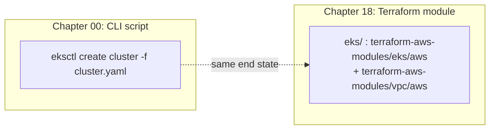

# 18 · Infrastructure as Code for Cluster Provisioning

> A Terraform equivalent of chapter 00's `eksctl` cluster + spot-node-pool creation, so cluster state
> is reviewable, diffable, and reproducible instead of hand-run.

**New to Terraform, or to "Infrastructure as Code" as a phrase?** Read straight through — this README
assumes you've done chapter 00 (which used a CLI tool, `eksctl`) and nothing else. Every Terraform
concept below is introduced before it's used, and every `.tf` block is explained line-by-line in terms
of what chapter 00 already did with `eksctl`.

## 0. What "Infrastructure as Code" means, and why this one chapter needs it

Every chapter before this one created cloud resources — a cluster, a node group, an IAM role — by
running a **CLI command** (`eksctl`, `aws`) or applying a Kubernetes manifest (`kubectl apply -k`).
That's "infrastructure as code" too, in a loose sense: the *inputs* live in a file (`cluster.yaml`, a
kustomize overlay) even if the *action* is "run this command right now." What people usually mean by
**Infrastructure as Code (IaC)**, and what this chapter is actually about, is narrower and stricter:

- **The tool itself tracks what it created**, in a file called **state** (§3.3 below), separate from
  the cloud account. Run the tool again and it compares state to the config and tells you exactly what
  would change — *before* it changes anything.
- **Changes are previewed, not just executed.** `eksctl update nodegroup --max-nodes=10` either
  succeeds or fails; you find out what else was affected only after the fact, by reading the cluster
  back. A `terraform plan` shows the entire diff — every field that would change, and every resource
  that would be created or destroyed — as plain text you (or a teammate) can read before anyone runs
  `apply`.
- **The config is the only source of truth**, and drift from it is detectable. If someone clicks a
  button in the AWS console to resize a node group, `eksctl` has no idea — the shell script that
  "creates" the cluster never runs again to notice. Terraform's next `plan` against the same state
  immediately shows "this resource changed outside of Terraform."

None of this is exotic — it's the same "diff before you merge" discipline you already use for
application code via `git diff` and pull requests, just applied to cloud resources instead of source
files. **Why does *only this chapter* get this treatment, when the other 17 use plain CLI commands and
kustomize?** Because cluster and node-pool provisioning has a different risk profile than everything
else in the course:

| | Chapters 00, 01–17 (kustomize + shell/`eksctl`) | Chapter 18 (Terraform) |
|---|---|---|
| How often does it change? | Disposable — you build it, use it for a lab, tear it down same day | Stood up once, kept for months, changed rarely |
| Blast radius of a mistake | A bad `ClusterQueue` or Helm value breaks one namespace; `kubectl delete -k` and redo | A bad node-pool change can take down every workload's compute, or (worse) delete the cluster |
| Is the current state already visible? | Yes — `kubectl get`/`diff` shows the live object right now | Not by default — the AWS console doesn't show you a diff before you click "Update" |
| Recreate cost if you get it wrong | Minutes | Potentially the whole cluster + VPC |

A shell script calling `eksctl create cluster` is the right tool for a lab environment you'll delete in
an afternoon (chapters 00–17's whole premise). It stops being the right tool the moment a real platform
team keeps that cluster running for months and changes it carefully, with a second engineer reviewing
every change — which is exactly the profile this chapter models.

### 0.1 Terraform's core concepts, in the order you'll meet them

If you've never opened a `.tf` file, here's the vocabulary this README uses, mapped to things you
already understand from `eksctl`/AWS:

- **Provider** — a plugin that knows how to talk to one API. `provider "aws"` (declared in
  `eks/versions.tf`) is what lets Terraform make the same underlying EC2/EKS/IAM API calls `eksctl` and
  the `aws` CLI make. Swap the provider block and the *rest* of the language (resources, variables,
  state) works identically against Azure, GCP, or hundreds of other providers — that portability is one
  of Terraform's main selling points, though this chapter (like the rest of the course) is EKS-only.
- **Resource** — one thing the provider can create: an EC2 instance, a VPC, an EKS cluster. You don't
  write raw resources directly in this chapter (see **module** below) — but everything a module creates
  is, underneath, a resource block like `resource "aws_eks_cluster" "this" { ... }`.
- **Module** — a reusable, packaged bundle of resources someone else wrote and versioned, that you
  configure with inputs instead of writing every resource yourself. This chapter uses two published
  modules (`terraform-aws-modules/eks/aws` and `terraform-aws-modules/vpc/aws`, §3.2) instead of
  hand-writing `aws_eks_cluster` — the same instinct as using a Helm chart instead of hand-writing every
  Kubernetes manifest a component needs.
- **State** — a file (`terraform.tfstate`, local by default, remote via the backend in §3.3) where
  Terraform records exactly what it created and with what settings, keyed to real cloud resource IDs.
  This is what makes `plan` possible: without a record of "I created this VPC with this CIDR," Terraform
  would have nothing to diff your `.tf` files against. **There is no equivalent of this in `eksctl`** —
  that CLI just makes API calls and forgets; it has no memory of what it did.
- **`plan` / `apply` / `destroy`** — the three verbs you run, always in that order of increasing
  consequence:
  - `terraform plan` is **read-only**: it compares your `.tf` files + state against the real cloud
    account and prints what *would* change. Nothing is created, modified, or deleted.
  - `terraform apply` shows you that same plan, asks for confirmation (`yes`), and then actually makes
    the API calls. This is the Terraform equivalent of `eksctl create cluster` / `eksctl update
    nodegroup` — except you saw the full diff first.
  - `terraform destroy` deletes every resource Terraform's state says it created. This is the
    irreversible, expensive-to-get-wrong operation — see §0.2 for why this chapter treats it specially.
- **`validate`** vs **`plan`** — `terraform validate` (used in this chapter's lab, §4 Step 3) only
  checks that your `.tf` files are internally well-formed: references resolve, required fields are
  present, types match. It needs **no cloud credentials** and touches no account. `terraform plan`
  needs real credentials and a real (or empty) state, and tells you what would actually happen in your
  AWS account. This chapter's lab deliberately stops at `validate` — see "Before you start" below for
  why it never asks you to run a real `plan`/`apply` against your account.

### 0.2 Why this chapter keeps a real `cleanup.sh` instead of inlining `terraform destroy`

Every other chapter in this course inlines its teardown commands directly into the README's Cleanup
section — no separate script file to open (see [CONVENTIONS.md](../CONVENTIONS.md)). This chapter is
the one exception, and it's deliberate: `terraform destroy` is **the single most destructive command in
this entire course.** A `kubectl delete -k` in another chapter removes namespace-scoped objects you can
recreate from the same overlay in seconds. `terraform destroy` here can delete an entire VPC, an EKS
control plane, and every node group backing it — and once AWS has torn those down, they are gone; there
is no "undo," only "provision it again from scratch." [`eks/cleanup.sh`](eks/cleanup.sh) exists
specifically to put friction and visibility in front of that one command:

- It **refuses to run at all unless you set `CONFIRM=yes`** — typing a plain `terraform destroy` by
  muscle memory doesn't work here on purpose.
- It **refuses if Terraform's own state is empty** (nothing was ever `apply`'d from this directory), so
  you can't accidentally run it against a module you only ever `validate`d.
- It **still shows Terraform's own destroy plan and interactive `yes` prompt** — the script never
  passes `-auto-approve`. You get two confirmations, not one: the script's `CONFIRM=yes` and Terraform's
  own plan-then-prompt.

Inlining `terraform destroy -auto-approve` into a copy-pasteable README block — the pattern every other
chapter uses for safe, cheap-to-redo operations — would remove exactly the safety rail that matters
most for the one operation in this course that can't be undone. That's the trade CONVENTIONS.md's
exception for this chapter is protecting.

### 0.3 The eksctl-to-Terraform translation, at a glance

Chapter 00 ran one command, [`eksctl create cluster -f
eks/cluster.yaml`](../00-prerequisites-and-cluster-setup/eks/cluster.yaml), against a YAML file
describing the cluster. This chapter's [`eks/main.tf`](eks/main.tf) describes the *same end state* —
same VPC shape, same spot CPU pool, same spot GPU pool scaled to zero — as Terraform resources/modules
instead. Concretely:

| Chapter 00 (`eksctl`) | Chapter 18 (Terraform) | What's actually different |
|---|---|---|
| `eks/cluster.yaml` (`ClusterConfig` YAML) | `eks/main.tf`, `eks/variables.tf` (HCL) | Same information, different syntax; `envsubst` templating in ch.00 becomes Terraform variables here |
| `eksctl create cluster -f cluster.yaml` | `terraform apply` | `eksctl` runs immediately; `terraform apply` shows a plan first and needs a typed `yes` |
| eksctl re-run to change the cluster (e.g. `eksctl update nodegroup`) | edit a `.tf` file, `terraform plan`, then `terraform apply` | eksctl has no diff step; Terraform always shows one |
| Nothing — `eksctl` doesn't remember what it did beyond querying AWS live | `terraform.tfstate` (§3.3) | This is the piece with no eksctl equivalent at all |
| `eksctl delete cluster` | `terraform destroy` (via `eks/cleanup.sh`, §0.2) | eksctl deletes immediately; this chapter wraps destroy in a confirmation-gated script |

Keep this table in mind through the rest of the README — every `.tf` file here is answering "how would
I say this same thing to Terraform instead of to `eksctl`?", not introducing new infrastructure chapter
00 didn't already have.

## A note on layout: this chapter breaks the kustomize convention on purpose

Every other chapter in this course follows [CONVENTIONS.md](../CONVENTIONS.md)'s layout: `common/`
holds cloud-agnostic Kubernetes manifests, `eks/` holds a kustomize overlay + shell scripts that call
`eksctl` / `aws` directly. **This chapter is the one exception.** `eks/` here holds a **Terraform
module**, not a kustomize overlay, and there is no `common/` (there's no Kubernetes manifest to be
cloud-agnostic about — this chapter provisions the cluster itself, before anything is applied to it)
or `cpu-lab/` (nothing here needs a GPU to run; the whole point is that `terraform validate` never
touches a cloud account). The module folder does still ship a `cleanup.sh`, as every chapter does —
here it's a guarded wrapper around `terraform destroy` (see §0.2 and §7), only relevant if you went
beyond the lab and ran a real `apply`.

**Why this is the one chapter that gets IaC instead of a script**, and the other 17 don't: a shell
script calling `eksctl create cluster` is fine for a one-off lab cluster you'll delete in an
afternoon — that's what chapters 00–17 are, disposable teaching environments. But **cluster and
node-pool provisioning is different from applying a Kueue `ClusterQueue` or a Helm chart**: it's the
one resource in this whole course that a real platform team stands up once, keeps for months, and
changes rarely and carefully — exactly the profile where a script's problems (no diff before you run
it, no record of who changed what, no plan to review in a PR, drift nobody notices until an audit)
actually hurt. A `terraform plan` on a cluster resize is something a second engineer can read and
approve before it runs; an `eksctl update nodegroup` command in a Slack message is not. Kueue queues,
Helm values, and namespace-scoped Kubernetes objects don't have that problem to the same degree —
they're already declarative, already diffable with `kubectl diff`, and already fast enough to recreate
that a script suffices. So: kustomize + shell everywhere else, Terraform here.

## Before you start

- Read [chapter 00](../00-prerequisites-and-cluster-setup/README.md) first — this chapter's module
  is a Terraform rewrite of exactly what chapter 00's `eksctl create cluster -f eks/cluster.yaml`
  step does (chapter 00 has no separate `create-cluster.sh` file — that step is inlined bash in its
  README's Lab section). Read that step's Lab section alongside the `.tf` files here to see the
  eksctl-to-Terraform mapping directly (§0.3 above walks through it once more, side by side).
- If you've never used Terraform before, read §0 above first — it introduces every concept
  (provider/resource/module/state/plan/apply/destroy) this README uses without re-explaining.
- Terraform CLI installed (`terraform version`) — this README's validation steps were run against
  **v1.16.3**; any release satisfying the module's `required_version` (`>= 1.5.7`, see `versions.tf`)
  works. No local Terraform install? Every command below also works via
  `docker run --rm -v "$(pwd):/work" -w /work hashicorp/terraform:1.16 <command>`.
- This chapter does **not** create anything — every command below is either read-only
  (`fmt -check`, `validate`, `init -backend=false`) or requires you to explicitly run `terraform plan`
  / `apply` yourself with real credentials, which this README never asks you to do. If you do choose to
  go further and run a real `apply`, re-read §0.2 and §7 first — you are now on the hook for real AWS
  billing and a resource that needs the guarded `cleanup.sh` to tear down safely.

## 1. Why this matters

Chapter 00 taught you to create a cluster with `eksctl create cluster -f cluster.yaml`. That's the
right way to *learn* the EKS API — you see every flag. It is not how a platform team runs it in
production:

- **No diff before it runs.** `eksctl update nodegroup --max-nodes=10` either succeeds or fails; nobody
  sees what else changed until after. `terraform plan` shows the full diff first.
- **No review.** A CLI command run from someone's laptop leaves no PR to approve, no commit to blame,
  no CI to gate it. A `.tf` change goes through the same review your application code does.
- **Drift is invisible.** Someone clicks a button in the AWS console to bump a node group's max size;
  the shell script that "creates" the cluster has no idea. `terraform plan` on the existing state
  shows it immediately.
- **Reproducibility.** Standing up a second cluster (new region, DR, a second team) from a script means
  re-running commands by hand and hoping you remember every flag. Standing it up from Terraform means
  `terraform apply -var-file=team-b.tfvars`.

This is deliberately narrow: it reproduces chapter 00's EKS cluster + spot CPU pool + spot GPU pool
(scaled to 0), with remote state guidance, and a pointer to where a platform team goes next
(Crossplane/ArgoCD-managed infra for self-service) — it does not re-implement every kustomize overlay
from chapters 01–17 in Terraform. Everything after the cluster exists stays kubectl-applied, same as
the rest of the course.

## 2. Learning objectives and time plan (~2 h)

By the end you can:

1. Explain what changes when cluster provisioning moves from a CLI script to Terraform (diff-before-
   apply, state, review, drift detection) and what stays the same (the underlying cloud API calls).
2. Read and adapt a `terraform-aws-modules/eks/aws`-based module reproducing chapter 00's spot CPU
   pool + spot GPU pool (scaled to 0).
3. Configure a remote state backend (S3 with native locking) for the module.
4. Run `terraform fmt -check`, `terraform init -backend=false`, and `terraform validate` — enough to
   confirm the module is syntactically and referentially sound without touching a cloud account.
5. Explain why this chapter recommends `terraform-aws-modules/eks/aws` over hand-rolled `aws_eks_*`
   resources, and where Crossplane/ArgoCD fit as the next step up from "an engineer runs
   `terraform apply`."

| Time | Activity |
|---|---|
| 0:00–0:20 | Read §0 (IaC/Terraform primer for first-timers) and §3 (concepts), compare the `.tf` module here to chapter 00's matching shell/eksctl step |
| 0:20–0:40 | Lab steps 1–2: `fmt -check` + `init -backend=false` on the module |
| 0:40–1:10 | Lab step 3: `terraform validate`, read the plan-equivalent reasoning in §4.4 |
| 1:10–1:30 | Lab step 4: wire up a remote state backend block (no real bucket needed to read it) |
| 1:30–1:50 | §6 troubleshooting + §8 checkpoint questions |
| 1:50–2:00 | "Next step up" section — skim what Crossplane/ArgoCD change |

## 3. Concepts

### 3.1 What the module reproduces



**Reading this diagram as a first-timer:** the dotted arrow is doing the most important work in this
whole chapter — it says these two boxes produce **the same cluster** in AWS (same VPC shape, same spot
CPU pool, same spot GPU pool at zero nodes). What differs is entirely on the *left-to-right* axis of
"how do you get there and what do you know along the way," not on *what exists* at the end:

- The left box (chapter 00) is a **single imperative command**: you run `eksctl create cluster`, it
  makes a sequence of AWS API calls, and when it's done you have a cluster. If you want to know what
  it's *about* to do, you read the YAML file yourself — `eksctl` doesn't show you a preview.
- The right box (this chapter) is **declarative and staged**: you describe the desired end state in
  `.tf` files, and three separate commands get you there — `init` (download the providers/modules the
  files reference, §4 Step 2), `plan` (compute and print the diff between desired state and what
  currently exists, never done for real in this chapter's read-only lab), and `apply` (actually make
  the API calls, also never done in this lab). Terraform also *remembers* what it created, in state
  (§3.3) — `eksctl` has no equivalent memory once the command exits.

If you've only ever run `eksctl`/`kubectl` commands, the mental shift is: instead of "run a command,
watch it happen," it's "describe what you want, ask the tool what it would do, then tell it to do it."
That extra "ask what it would do" step (`plan`) is the entire point of this chapter, and it's also why
the lab below stops at `validate` (syntax-only, no account) rather than `plan` (needs real credentials)
— see "Before you start" for why.

| | EKS (`eks/`) |
|---|---|
| Resources used | `terraform-aws-modules/eks/aws` v21.x (module), `terraform-aws-modules/vpc/aws` v6.x |
| Provider / floor | `hashicorp/aws` `>= 6.59` (module's own floor) |
| CPU pool | `spot-cpu`, 6 diversified instance types, `capacity_type = "SPOT"`, 1–4 |
| GPU pool | `spot-gpu`, g6.xlarge/g4dn.xlarge, `capacity_type = "SPOT"`, **0–1**, tainted |
| Why a module vs. raw resources | A bare `aws_eks_cluster` also needs you to hand-wire the OIDC provider, the `aws-auth`/access-entry dance, node IAM roles + policies, and security groups correctly — the module gets this right and keeps it current across EKS API changes. Raw `aws_eks_cluster` + `aws_eks_node_group` is documented as a "next step down" in `eks/main.tf`'s comments if you want to see it without the module. |

### 3.2 Why a module instead of raw resources

A working EKS cluster needs a VPC with correctly tagged subnets, an OIDC provider for IRSA / Pod
Identity, node IAM roles with the right managed policies attached, and (historically) `aws-auth`
ConfigMap wiring now replaced by access entries — all easy to get subtly wrong by hand and a common
source of "the cluster applies but pods can't pull images / assume roles" bugs. `terraform-aws-modules/eks/aws`
gets this right and keeps it current across EKS API changes, which is why this chapter reaches for the
module rather than writing `aws_eks_cluster` + `aws_eks_node_group` by hand. If you've used a Helm
chart to avoid hand-writing a Deployment + Service + ConfigMap + RBAC for some component, a Terraform
module is the same trade in the same direction: someone else has already solved (and keeps solving,
release over release) the "there are twelve interacting settings and getting one wrong breaks pods in a
confusing way" problem, so you configure it with a handful of inputs instead.

### 3.3 Remote state backend

First, why state needs a *backend* at all: by default Terraform writes `terraform.tfstate` as a plain
file on whatever machine ran `apply`. That's fine solo, but breaks the moment a second person (or a CI
pipeline) needs to run `terraform plan`/`apply` against the same cluster — they'd have no idea what the
first run created. A **remote backend** moves that state file to shared storage (here, an S3 bucket)
that everyone's Terraform CLI reads and writes, with **locking** so two people can't run `apply`
simultaneously and corrupt the same state file.

| Backend | Locking |
|---|---|
| `backend "s3"` — a bucket with versioning + encryption | `use_lockfile = true` (Terraform ≥ 1.10, GA in 1.11) — **not** DynamoDB. DynamoDB-based S3 locking is deprecated as of Terraform 1.11 and `dynamodb_table` is slated for removal in a future minor version. If you're pinned to Terraform < 1.10, use `dynamodb_table` instead; don't mix both. |

`eks/versions.tf` has the exact commented-out `backend` block — uncomment, fill in your bucket name,
and run `terraform init` for real (not done in this chapter's lab: it would either require a real
bucket or fail, and this chapter's validation is deliberately backend-free). Note the state file itself
can contain sensitive values (cluster endpoint, CA certificate data) — the bucket needs encryption and
access control, same as any other secret store.

### 3.4 What the module keeps from chapter 00's spot-first defaults

- **The GPU pool always starts at `min = 0` / `desired = 0`.** Terraform won't change this default;
  you'd have to explicitly raise it, same discipline as chapter 00's cost guardrails.
- **The spot CPU pool has no auto-added taint.** EKS managed node groups don't taint spot capacity by
  default, matching chapter 00's CLI-created node group — add one yourself if your workloads need it.

## 4. Lab

All four steps are read-only: nothing here calls a cloud API, creates a bucket, or costs money. Run
every command from `18-infrastructure-as-code/`. Each step below builds on the last, in the order a
real Terraform workflow always runs them (`fmt` → `init` → `validate` → look at backend config) — this
is also the order CI would run these same checks before a human ever approves a `plan`.

### Step 1: Format check

What you're about to do: confirm every `.tf` file in this chapter is canonically formatted —
`terraform fmt -check` is the same gate CI would run before any plan. This matters less for correctness
(badly indented HCL still runs) and more for the "diffable, reviewable" promise from §0 — a `.tf` file
with inconsistent formatting produces noisy diffs that bury the actual change a reviewer needs to see.

```bash
cd 18-infrastructure-as-code
terraform fmt -check -recursive -diff
```

Expected output: **nothing** (a clean exit with no output means every file is already formatted; a
nonzero exit with a diff means a file needs `terraform fmt -recursive` run on it, no diff needed).

How to tell this worked: `echo $?` prints `0`. If you don't have Terraform installed locally, run the
same check via Docker:
```bash
docker run --rm -v "$(pwd):/work" -w /work hashicorp/terraform:1.16 fmt -check -recursive -diff
```

### Step 2: Init without a backend

What you're about to do: download the module's providers and its nested VPC/EKS modules into
`.terraform/` without configuring any backend — `-backend=false` means Terraform never tries to reach
an S3 bucket, so this is safe to run with zero cloud credentials. This is the Terraform equivalent of
`eksctl`'s "make sure the tool itself is ready to talk to AWS" step, except here it's "make sure
Terraform has downloaded the AWS provider plugin and the two modules `main.tf` references
(`terraform-aws-modules/vpc/aws`, `terraform-aws-modules/eks/aws`)" — nothing about *your* account is
touched yet.

```bash
cd eks && terraform init -backend=false -input=false && cd ..
```
Expected output (trimmed):
```
Initializing modules...
Downloading terraform-aws-modules/vpc/aws 6.7.2 for vpc...
Downloading terraform-aws-modules/eks/aws 21.25.0 for eks...
Initializing provider plugins...
- Installing hashicorp/aws v6.65.0...
Terraform has been successfully initialized!
```
How to tell this worked: a `.terraform.lock.hcl` file appears in `eks/`, both nested modules (`vpc`,
`eks`) download under "Initializing modules...", and the command exits 0. No
`Error: Failed to query available provider packages` (that means no network access, not a config bug).
The `.terraform.lock.hcl` file is worth noting even though nothing here reads it yet: it pins the exact
provider version Terraform resolved, so a teammate (or CI) running `init` later gets the identical
version instead of whatever the `~>`/`>=` constraint happens to resolve to that day — commit it to
version control, unlike `.terraform/` itself.

### Step 3: Validate

What you're about to do: ask Terraform to check the module's configuration is internally consistent
(references resolve, required arguments are present, types match) — this is the strongest check that
doesn't need real cloud credentials or state. It is **not** a plan: it can't tell you whether your AWS
account/region is real or whether you have quota; it can tell you whether the HCL itself is correct.
Concretely, `validate` would catch a typo like referencing `module.vpc.vpc_ids` (plural, wrong) instead
of `module.vpc.vpc_id`, or a missing required variable — it would *not* catch "your AWS account has no
quota for g6.xlarge spot instances," because answering that question requires actually calling AWS,
which only `plan`/`apply` do.

```bash
cd eks && terraform validate && cd ..
```
Expected output:
```
Success! The configuration is valid.
```
How to tell this worked: the command prints `Success!` and exits 0. This repo's own copy of this
chapter was validated exactly this way against the pinned `terraform-aws-modules/eks/aws` v21.25.0 —
verify apiVersions/module inputs against the module's current docs before writing them if you bump the
pin, since minor version bumps have changed required inputs before.

### Step 4: Wire up remote state (read-only — don't actually init against a real bucket in this lab)

What you're about to do: look at the commented `backend` block in `eks/versions.tf`, understand what
you'd fill in, without running `terraform init` against it (that needs a real bucket that this chapter
deliberately doesn't create for you, to keep the lab account-free). This step is here so that when you
*do* eventually want a real, shared, team-usable Terraform setup, you already know exactly which three
values (bucket name, key, region) are yours to change — nothing else in the block needs editing.

```bash
grep -A8 '# backend' eks/versions.tf
```
Expected output: the commented `s3` backend block from §3.3 above.

How to tell this worked: you can point at the exact field you'd change for your own bucket name. When
you're ready to use it for real: create the bucket first (`aws s3api create-bucket` — outside this
chapter's scope), uncomment the block, fill in the name, then run `terraform init` (no
`-backend=false`) to migrate state into it.

## 5. Spot considerations for this chapter

- Every spot field mirrors chapter 00 exactly: `capacity_type = "SPOT"` on both managed node groups.
- The GPU pool's `min`/`desired` size is `0` — Terraform doesn't change the cold-start trade-off from
  chapter 00 (§5 there): first GPU pod still means node boot + driver + image pull.
- A `terraform apply` that scales the spot pool's `max` up doesn't guarantee capacity exists — same
  spot capacity caveats as chapter 00 §6 apply regardless of how the pool was created.

## 6. Troubleshooting

| Symptom | Cause | Why this happens | Fix |
|---|---|---|---|
| `terraform init`: `Failed to query available provider packages` | No network access, or a version constraint no release satisfies | `init` needs to reach the Terraform Registry (`registry.terraform.io`) to download the `hashicorp/aws` provider and the two nested modules; if your `~>`/`>=` pin in `versions.tf` no longer matches any published release (e.g. you bumped it past what's actually out), the registry has nothing to hand back either | Check connectivity; loosen the `~>`/`>=` constraint in `versions.tf` only if you've verified the new floor still has the fields this module uses |
| `terraform fmt -check` exits non-zero with a diff | A file isn't canonically formatted | HCL has one canonical layout (`terraform fmt` picks it, not you); anything hand-edited with different spacing/alignment fails the check even though it would still `apply` correctly — the check exists purely for diff-cleanliness (§4 Step 1), not correctness | Run `terraform fmt -recursive` (no `-check`) to fix it in place |
| `terraform init` fails to download the `vpc` or `eks` submodule | Registry unreachable, or a `~>` pin that no longer resolves (module got yanked or majors moved on) | Published modules occasionally get a new major version that changes required inputs (this module's own `main.tf` header notes `name`/`kubernetes_version` replaced `cluster_name`/`cluster_version` at the v21 boundary) — a `~>` constraint written for an older major can stop resolving once that major is no longer the latest in its line | Check `registry.terraform.io/modules/terraform-aws-modules/eks/aws` for the current latest major before bumping the pin |
| Real `terraform apply` (outside this chapter's read-only lab) fails with a quota error | Same GPU/spot quotas as chapter 00 §3.2 | Terraform's AWS provider makes the identical EC2/EKS API calls `eksctl` does — it has no special access to capacity or quota AWS hasn't granted your account, so a quota that would block `eksctl create cluster` blocks `terraform apply` the same way, just reported as a Terraform error instead of an eksctl one | Do chapter 00 Step 2 (quota requests) first — Terraform doesn't bypass cloud quota, it just applies the same API calls the CLI does |
| `terraform validate` passes but a real `terraform plan`/`apply` fails on a field the module doesn't recognize | You bumped `terraform-aws-modules/eks/aws`'s version pin without checking its current README | `validate` only checks that *your* HCL is internally consistent against the module's *currently downloaded* version (from `init`) — it can't warn you that a newer module version renamed or removed an input, because from Terraform's point of view your config is still valid against whatever's in `.terraform/modules/` | Re-run `terraform init -upgrade` after bumping the version pin, then `terraform validate` again, and diff the module's CHANGELOG for renamed inputs before trusting old examples |

## 7. Cleanup and cost notes

> **Read this before running anything beyond `validate` in this chapter.** Everything below `apply` in
> §0.1's list costs real AWS money the moment it succeeds, and `terraform destroy` is irreversible —
> once it deletes the VPC/cluster/node groups, there is no "undo," only "provision it again."

**The lab itself creates nothing, so there is nothing to clean up.** `fmt -check`, `init
-backend=false` and `validate` touch no cloud account; the only local leftovers are the module's
`.terraform/` directory and `.terraform.lock.hcl` (both gitignored / safe to keep — delete `.terraform/`
if you want the disk space back). Cost of this chapter as written: $0.

**If you did run a real `terraform apply`**, tear it down with Terraform (not the chapter 00 CLI
scripts — deleting Terraform-managed resources out-of-band leaves state that still thinks they exist):

```bash
# Preview what would be destroyed (read-only):
terraform -chdir=18-infrastructure-as-code/eks plan -destroy
# Destroy — the wrapper refuses without CONFIRM=yes, refuses on empty state, and still shows
# Terraform's own plan + confirmation prompt (it never passes -auto-approve):
CONFIRM=yes ./18-infrastructure-as-code/eks/cleanup.sh
```

`plan -destroy` first is worth doing even though `cleanup.sh` will show you Terraform's own destroy
plan anyway — it's a second, independent look at exactly what's about to be deleted, with no
possibility of accidentally answering the wrapper script's confirmation prompt on autopilot. See §0.2
above for why this chapter keeps a guarded script here instead of inlining `terraform destroy` the way
every other chapter inlines its teardown commands.

- **Run the other chapters' `cleanup.sh` first.** Anything Kubernetes created on your behalf —
  load balancers from `LoadBalancer` Services, disks/volumes from PVCs — is not in Terraform state. On
  EKS especially, an orphaned load balancer's ENIs block the VPC/subnet deletion and `destroy` hangs
  and then fails.
- **Remote state storage is not destroyed.** If you uncommented the `backend` block (§3.3 / Step 4),
  the S3 bucket holding the state was created outside this module and survives `terraform destroy`,
  along with every versioned copy of the state file. It costs cents a month, but delete it once you no
  longer need the history — note the state can contain sensitive values (cluster endpoints, CA certs).
- **Cost while it exists** is the same as chapter 00's cluster (the module reproduces it exactly):
  the $0.10/h EKS control-plane fee, the always-on spot CPU pool (min 1 by default), and the NAT
  gateway — the GPU pool sits at 0 nodes until something requests a GPU.

## Next step up: Crossplane / ArgoCD-managed infra

This chapter's Terraform module still needs an engineer (or a CI pipeline with cloud credentials) to
run `terraform apply`. The next step up for a platform team wanting **self-service** infra — a team
lead requesting "give my team a namespace with a 4-node spot pool" without filing a ticket to the
platform team — is to manage infrastructure as Kubernetes custom resources instead of a separate
`terraform apply` step:

- **[Crossplane](https://www.crossplane.io/)**: install `provider-aws` into the cluster's control
  plane, then a `NodePool`-shaped custom resource becomes something teams `kubectl apply` (or, more
  often, get from a `Composition` template via a much smaller self-service CR) — the actual AWS API
  calls happen the same way Terraform's AWS provider makes them, just reconciled continuously by a
  controller instead of a one-shot `apply`.
- **ArgoCD** (already used for GitOps in [chapter 15](../15-mlops-gitops-and-pipelines/README.md)) then
  manages those Crossplane CRs the same way it manages any other Kubernetes manifest: a PR merge
  triggers a sync, continuous drift detection comes for free.

This course doesn't build that out — it's a meaningfully larger operational surface (a provider to
keep patched, RBAC on who can create which Composition, cloud credentials living in the cluster
instead of CI) that's worth its own deep dive. If your team is provisioning infrastructure more than a
few times a quarter or wants non-platform engineers self-serving safely, that's the next thing to
evaluate — starting from the Terraform modules in this chapter, since Crossplane Compositions are
often literally translated from an existing Terraform module's shape.

## 8. Checkpoint questions

1. Why does this chapter use Terraform while every other chapter in the course uses kustomize + shell
   scripts? What's different about cluster/node-pool provisioning specifically?
2. Why does `eks/main.tf` use the `terraform-aws-modules/eks/aws` module instead of raw
   `aws_eks_cluster` / `aws_eks_node_group` resources?
3. Why do the `vpc-cni` and `eks-pod-identity-agent` addons in `eks/main.tf` set
   `before_compute = true`, and what would go wrong if they didn't?
4. What replaces DynamoDB-based state locking as of Terraform 1.11, and what backend argument enables
   it?
5. Why does the `spot-gpu` managed node group set `min_size = 0` and `desired_size = 0` while
   `spot-cpu` defaults to `min_size = 1`?
6. What does `terraform validate` check that it can verify without any cloud credentials, and what
   does it *not* catch that `terraform plan` would?
7. Name one concrete thing Crossplane changes about who can create a node pool, versus this chapter's
   Terraform module.
8. Why does `eks/cleanup.sh` stay a real script instead of the teardown command being inlined directly
   into this README's Cleanup section, the way every other chapter inlines its teardown steps?

<details>
<summary>Answers</summary>

1. Cluster/node-pool provisioning is stood up once, kept for months, and changed rarely but with high
   blast radius if wrong — exactly the case where a reviewable `terraform plan` diff, a PR history, and
   drift detection matter most. The rest of the course's resources (Kueue queues, Helm values,
   namespace-scoped manifests) are already declarative and cheap to recreate, so kustomize + a shell
   script calling `kubectl apply -k` is sufficient there.
2. A working EKS cluster also needs correctly wired OIDC/IRSA, node IAM roles with the right managed
   policies, and (historically) `aws-auth`/access-entry configuration — easy to get subtly wrong by
   hand and a common source of "the cluster applies but pods can't pull images / assume roles" bugs.
   The module gets this right and keeps it current across EKS API changes.
3. `before_compute = true` installs the addon before the managed node groups come up, so nodes join
   the cluster with pod networking (`vpc-cni`) and Pod Identity (`eks-pod-identity-agent`) already
   available. Without it, the addon and the first nodes could race, leaving early pods without
   networking or IAM credentials until the addon catches up.
4. `use_lockfile = true` on the `s3` backend (Terraform ≥ 1.10, GA in 1.11) — it creates a lock object
   in the same S3 bucket instead of using a separate DynamoDB table, whose `dynamodb_table` backend
   argument is now deprecated and slated for removal.
5. `spot-gpu`'s zero defaults mirror chapter 00's cost guardrail: a GPU pool should cost nothing until
   a GPU pod is actually Pending. `spot-cpu` needs at least one node up so cluster-critical workloads
   (CoreDNS, controllers, chapter tooling) always have somewhere to schedule.
6. `terraform validate` checks that the HCL is internally consistent — references resolve, required
   arguments are present, types match, provider schemas are satisfied. It does *not* check whether
   your credentials are valid, whether the named account/region exists, whether you have quota, or
   what would actually change in real infrastructure — that's what `terraform plan` (against real
   credentials) adds.
7. Crossplane turns "create a node pool" into applying a Kubernetes custom resource (via RBAC the
   platform team controls, often through a much smaller self-service CR backed by a `Composition`),
   so a team lead can request infrastructure without filing a ticket for someone to run
   `terraform apply` on their behalf — the platform team controls the blast radius through
   Composition/RBAC design instead of being the one applying every change.
8. `terraform destroy` is the one irreversible, high-blast-radius operation in this entire course — it
   can delete a whole VPC/cluster/node-group set with no undo. `cleanup.sh` puts a `CONFIRM=yes` gate,
   an empty-state check, and Terraform's own destroy plan + prompt in front of it, none of which a
   bare inlined `terraform destroy -auto-approve` command block would have.

</details>

## 9. Further reading and versions tested

- Terraform: [S3 backend `use_lockfile`](https://developer.hashicorp.com/terraform/language/backend/s3)
- Terraform core concepts (for first-timers): [Terraform language documentation](https://developer.hashicorp.com/terraform/language), [State](https://developer.hashicorp.com/terraform/language/state), [Modules](https://developer.hashicorp.com/terraform/language/modules)
- EKS: [terraform-aws-modules/eks/aws](https://registry.terraform.io/modules/terraform-aws-modules/eks/aws/latest), [terraform-aws-modules/vpc/aws](https://registry.terraform.io/modules/terraform-aws-modules/vpc/aws/latest), [EKS Nodegroup API (amiType/capacityType values)](https://docs.aws.amazon.com/eks/latest/APIReference/API_Nodegroup.html)
- Next step: [Crossplane](https://www.crossplane.io/), [ArgoCD](https://argo-cd.readthedocs.io/)

**Versions tested** (2026-09-17): Terraform 1.16.3 (the module's `required_version` floor is lower —
see `versions.tf`), `hashicorp/aws` 6.65.0, `terraform-aws-modules/eks/aws` 21.25.0,
`terraform-aws-modules/vpc/aws` 6.7.2.
</content>
