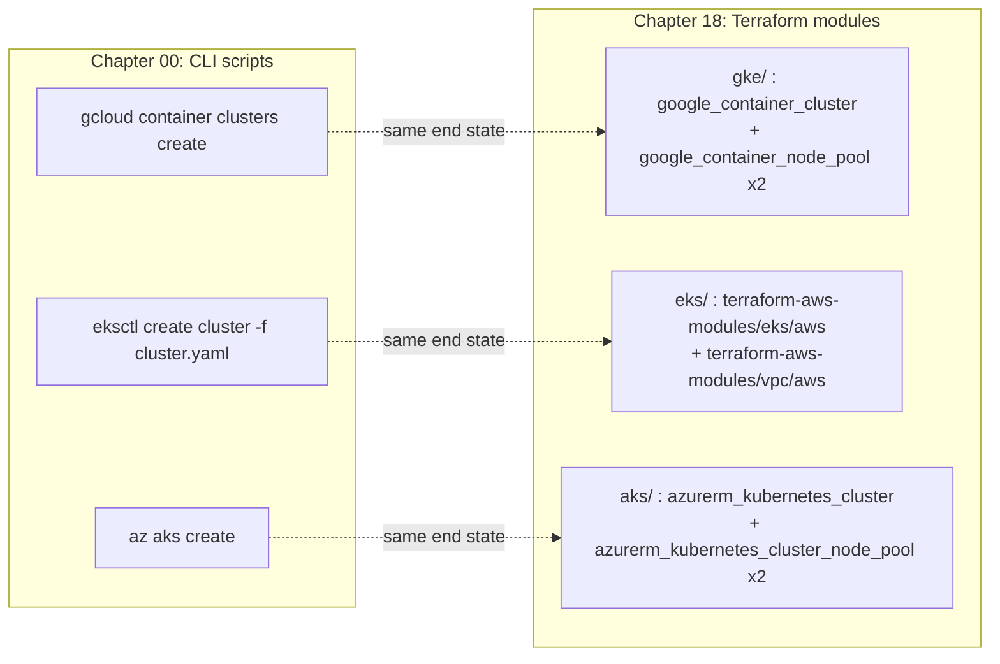

# 18 · Infrastructure as Code for Cluster Provisioning

> Terraform equivalents of chapter 00's `gcloud`/`eksctl`/`az` cluster + spot-node-pool creation, so
> cluster state is reviewable, diffable, and reproducible instead of hand-run.

## A note on layout: this chapter breaks the kustomize convention on purpose

Every other chapter in this course follows [CONVENTIONS.md](../CONVENTIONS.md)'s layout: `common/`
holds cloud-agnostic Kubernetes manifests, `gke/` / `eks/` / `aks/` hold kustomize overlays + shell
scripts that call `gcloud` / `eksctl` / `az` directly. **This chapter is the one exception.** `gke/`,
`eks/` and `aks/` here each hold a **Terraform module**, not a kustomize overlay, and there is no
`common/` (there's no Kubernetes manifest to be cloud-agnostic about — this chapter provisions the
cluster itself, before anything is applied to it) or `cpu-lab/` (nothing here needs a GPU to run; the
whole point is that `terraform validate` never touches a cloud account).

**Why this is the one chapter that gets IaC instead of a script**, and the other 17 don't: a shell
script calling `gcloud container clusters create` is fine for a one-off lab cluster you'll delete in
an afternoon — that's what chapters 00–17 are, disposable teaching environments. But **cluster and
node-pool provisioning is different from applying a Kueue `ClusterQueue` or a Helm chart**: it's the
one resource in this whole course that a real platform team stands up once, keeps for months, and
changes rarely and carefully — exactly the profile where a script's problems (no diff before you run
it, no record of who changed what, no plan to review in a PR, drift nobody notices until an audit)
actually hurt. A `terraform plan` on a cluster resize is something a second engineer can read and
approve before it runs; a `gcloud container node-pools update` command in a Slack message is not. Kueue
queues, Helm values, and namespace-scoped Kubernetes objects don't have that problem to the same
degree — they're already declarative, already diffable with `kubectl diff`, and already fast enough to
recreate that a script suffices. So: kustomize + shell everywhere else, Terraform here.

## Before you start

- Read [chapter 00](../00-prerequisites-and-cluster-setup/README.md) first — this chapter's modules
  are a Terraform rewrite of exactly what chapter 00's `gke/create-cluster.sh`, `eks/create-cluster.sh`
  + `eks/cluster.yaml`, and `aks/create-cluster.sh` do. Read those scripts alongside the `.tf` files
  here to see the CLI-to-Terraform mapping directly.
- Terraform CLI installed (`terraform version`) — this README's validation steps were run against
  **v1.16.3**; any release satisfying each module's `required_version` (`>= 1.5.7` to `>= 1.9.0`,
  see each `versions.tf`) works. No local Terraform install? Every command below also works via
  `docker run --rm -v "$(pwd):/work" -w /work hashicorp/terraform:1.16 <command>`.
- This chapter does **not** create anything — every command below is either read-only
  (`fmt -check`, `validate`, `init -backend=false`) or requires you to explicitly run `terraform plan`
  / `apply` yourself with real credentials, which this README never asks you to do.

## 1. Why this matters

Chapter 00 taught you to create a cluster with `gcloud container clusters create ...` / `eksctl create
cluster -f cluster.yaml` / `az aks create ...`. That's the right way to *learn* GKE/EKS/AKS APIs — you
see every flag. It is not how a platform team runs it in production:

- **No diff before it runs.** `gcloud container node-pools update spot-cpu --max-nodes=10` either
  succeeds or fails; nobody sees what else changed until after. `terraform plan` shows the full diff
  first.
- **No review.** A CLI command run from someone's laptop leaves no PR to approve, no commit to blame,
  no CI to gate it. A `.tf` change goes through the same review your application code does.
- **Drift is invisible.** Someone clicks a button in the GKE console to bump a node pool's max size;
  the shell script that "creates" the cluster has no idea. `terraform plan` on the existing state
  shows it immediately.
- **Reproducibility.** Standing up a second cluster (new region, DR, a second team) from a script means
  re-running commands by hand and hoping you remember every flag. Standing it up from Terraform means
  `terraform apply -var-file=team-b.tfvars`.

This is deliberately narrow: it reproduces chapter 00's cluster + spot CPU pool + spot GPU pool
(scaled to 0) on each cloud, with remote state guidance, and a pointer to where a platform team goes
next (Crossplane/ArgoCD-managed infra for self-service) — it does not re-implement every kustomize
overlay from chapters 01–17 in Terraform. Everything after the cluster exists stays kubectl-applied,
same as the rest of the course.

## 2. Learning objectives and time plan (~2 h)

By the end you can:

1. Explain what changes when cluster provisioning moves from a CLI script to Terraform (diff-before-
   apply, state, review, drift detection) and what stays the same (the underlying cloud API calls).
2. Read and adapt a `google_container_cluster` + `google_container_node_pool`, a
   `terraform-aws-modules/eks/aws`-based, and an `azurerm_kubernetes_cluster` +
   `azurerm_kubernetes_cluster_node_pool` module, each reproducing chapter 00's spot CPU pool + spot
   GPU pool (scaled to 0).
3. Configure a remote state backend (GCS / S3 with native locking / Azure Storage) for each cloud.
4. Run `terraform fmt -check`, `terraform init -backend=false`, and `terraform validate` — enough to
   confirm a module is syntactically and referentially sound without touching a cloud account.
5. Explain why this chapter recommends `terraform-aws-modules/eks/aws` over hand-rolled `aws_eks_*`
   resources but hand-rolled resources for GKE/AKS, and where Crossplane/ArgoCD fit as the next step
   up from "an engineer runs `terraform apply`."

| Time | Activity |
|---|---|
| 0:00–0:20 | Read §3 (concepts), compare a `.tf` module here to chapter 00's matching shell script |
| 0:20–0:40 | Lab steps 1–2: `fmt -check` + `init -backend=false` on all three modules |
| 0:40–1:10 | Lab step 3: `terraform validate` on all three, read the plan-equivalent reasoning in §4.4 |
| 1:10–1:30 | Lab step 4: wire up a remote state backend block (no real bucket needed to read it) |
| 1:30–1:50 | §6 troubleshooting + §8 checkpoint questions |
| 1:50–2:00 | §7 "next step up" — skim what Crossplane/ArgoCD change |

## 3. Concepts

### 3.1 What each module reproduces



| | GKE (`gke/`) | EKS (`eks/`) | AKS (`aks/`) |
|---|---|---|---|
| Resources used | `google_container_cluster`, `google_container_node_pool` (raw resources) | `terraform-aws-modules/eks/aws` v21.x (module), `terraform-aws-modules/vpc/aws` v6.x | `azurerm_kubernetes_cluster`, `azurerm_kubernetes_cluster_node_pool` (raw resources) |
| Provider / floor | `hashicorp/google` `~> 8.3` | `hashicorp/aws` `>= 6.59` (module's own floor) | `hashicorp/azurerm` `~> 5.5` |
| CPU pool | `spot-cpu`, e2-standard-4, `spot = true`, autoscaling 1–3 | `spot-cpu`, 6 diversified instance types, `capacity_type = "SPOT"`, 1–4 | `spotcpu`, Standard_D4s_v5, `priority = "Spot"`, 0–3 |
| GPU pool | `spot-gpu`, g2-standard-4 + 1×L4, `spot = true`, autoscaling **0–1** | `spot-gpu`, g6.xlarge/g4dn.xlarge, `capacity_type = "SPOT"`, **0–1**, tainted | `gpuspot`, Standard_NC4as_T4_v3, `priority = "Spot"`, **0–1**, tainted |
| Why a module vs. raw resources on EKS | — | Unlike GKE/AKS, a bare `aws_eks_cluster` also needs you to hand-wire the OIDC provider, the `aws-auth`/access-entry dance, node IAM roles + policies, and security groups correctly — the module gets this right and keeps it current across EKS API changes. Raw `aws_eks_cluster` + `aws_eks_node_group` is documented as a "next step down" in `eks/main.tf`'s comments if you want to see it without the module. | — |

### 3.2 Why raw resources for GKE/AKS but a module for EKS

GKE and AKS cluster + node pool creation is two or three resource blocks with mostly first-class
provider fields (`spot = true`, `priority = "Spot"`) — writing it by hand is not meaningfully harder
than reading a module's abstraction over it, and you see exactly what's being created. EKS is
different: a working cluster also needs a VPC with correctly tagged subnets, an OIDC provider for IRSA
/ Pod Identity, node IAM roles with the right managed policies attached, and (historically) `aws-auth`
ConfigMap wiring now replaced by access entries — all easy to get subtly wrong by hand and a common
source of "the cluster applies but pods can't pull images / assume roles" bugs. `gke/main.tf` and
`aks/main.tf` both include a commented block showing the community-module alternative
(`terraform-google-modules/kubernetes-engine/google` v45.x) if you want the same trade-off on GKE once
you're running more than a lab cluster.

### 3.3 Remote state backends

| Cloud | Backend | Locking |
|---|---|---|
| GKE | `backend "gcs"` — a bucket with object versioning enabled | Built into the GCS backend since Terraform 1.10 (uses a lock object); no separate lock table needed, unlike the historical S3+DynamoDB pattern |
| EKS | `backend "s3"` — a bucket with versioning + encryption | `use_lockfile = true` (Terraform ≥ 1.10, GA in 1.11) — **not** DynamoDB. DynamoDB-based S3 locking is deprecated as of Terraform 1.11 and `dynamodb_table` is slated for removal in a future minor version. If you're pinned to Terraform < 1.10, use `dynamodb_table` instead; don't mix both. |
| AKS | `backend "azurerm"` — a Storage Account + blob container | Native blob lease locking, `use_azuread_auth = true` preferred over storage account keys |

Each module's `versions.tf` has the exact commented-out `backend` block — uncomment, fill in your
bucket/storage account, and run `terraform init` for real (not done in this chapter's lab: it would
either require a real bucket or fail, and this chapter's validation is deliberately backend-free).

### 3.4 What every module keeps from chapter 00's spot-first defaults

- **GPU pools always start at `min = 0` / `desired = 0`.** Terraform won't change this default; you'd
  have to explicitly raise it, same discipline as chapter 00's cost guardrails.
- **AKS's default/system pool stays Regular priority.** AKS does not allow the default node pool to be
  Spot ([AKS spot limitations](https://learn.microsoft.com/azure/aks/spot-node-pool#limitations)) — the
  Terraform module encodes this the same way the CLI script does: a separate `spotcpu` **user** pool.
  `deletion_protection = false` is set explicitly on the GKE cluster resource (provider ≥ 5.0 blocks
  deletes otherwise) so a stray `terraform destroy` doesn't silently protect (or unexpectedly fail to
  destroy) a shared lab cluster — flip it to `true` once this is a real cluster you don't want deleted
  by accident.

## 4. Lab

All four steps are read-only: nothing here calls a cloud API, creates a bucket, or costs money. Run
every command from `18-infrastructure-as-code/`.

### Step 1: Format check

What you're about to do: confirm every `.tf` file in this chapter is canonically formatted —
`terraform fmt -check` is the same gate CI would run before any plan.

```bash
cd 18-infrastructure-as-code
terraform fmt -check -recursive -diff
```

Expected output: **nothing** (a clean exit with no output means every file is already formatted; a
nonzero exit with a diff means a file needs `terraform fmt -recursive` run on it, no diff needed).

How to tell this worked: `echo $?` prints `0`. If you don't have Terraform installed locally, run the
same check via Docker:
```bash
docker run --rm -v "$(pwd):/work" -w /work hashicorp/terraform:1.16 fmt -check -recursive -diff
```

### Step 2: Init without a backend

What you're about to do: download each module's providers (and, for `eks/`, its nested VPC/EKS
modules) into `.terraform/` without configuring any backend — `-backend=false` means Terraform never
tries to reach a GCS/S3/Azure Storage bucket, so this is safe to run with zero cloud credentials.

<details><summary>GKE</summary>

```bash
cd gke && terraform init -backend=false -input=false && cd ..
```
Expected output (trimmed):
```
Initializing provider plugins...
- Installing hashicorp/google v8.3.0...
Terraform has been successfully initialized!
```
How to tell this worked: a `.terraform.lock.hcl` file appears in `gke/` and the command exits 0. No
`Error: Failed to query available provider packages` (that means no network access, not a config bug).

</details>

<details><summary>EKS</summary>

```bash
cd eks && terraform init -backend=false -input=false && cd ..
```
Expected output (trimmed):
```
Initializing modules...
Downloading terraform-aws-modules/vpc/aws 6.7.2 for vpc...
Downloading terraform-aws-modules/eks/aws 21.25.0 for eks...
Initializing provider plugins...
- Installing hashicorp/aws v6.65.0...
Terraform has been successfully initialized!
```
How to tell this worked: same as GKE, plus you see both nested modules (`vpc`, `eks`) download under
"Initializing modules...".

</details>

<details><summary>AKS</summary>

```bash
cd aks && terraform init -backend=false -input=false && cd ..
```
Expected output (trimmed):
```
Initializing provider plugins...
- Installing hashicorp/azurerm v5.5.0...
Terraform has been successfully initialized!
```
How to tell this worked: same pattern as GKE/EKS.

</details>

### Step 3: Validate

What you're about to do: ask Terraform to check each module's configuration is internally consistent
(references resolve, required arguments are present, types match) — this is the strongest check that
doesn't need real cloud credentials or state. It is **not** a plan: it can't tell you whether your
`project_id` is real or whether you have quota; it can tell you whether the HCL itself is correct.

```bash
for d in gke eks aks; do
  echo "=== $d ==="
  (cd "$d" && terraform validate)
done
```
Expected output:
```
=== gke ===
Success! The configuration is valid.
=== eks ===
Success! The configuration is valid.
=== aks ===
Success! The configuration is valid.
```
How to tell this worked: all three print `Success!` and the loop's exit code is 0. This repo's own
copy of this chapter was validated exactly this way — including catching that azurerm provider ≥ 5.5
now **requires** a `node_provisioning_profile` block on `azurerm_kubernetes_cluster` (added below;
without it `validate` fails with `Insufficient node_provisioning_profile blocks`). That's a real
example of what live-upstream verification catches that copying an old example wouldn't.

### Step 4: Wire up remote state (read-only — don't actually init against a real bucket in this lab)

What you're about to do: look at the commented `backend` block in each `versions.tf`, understand what
you'd fill in, without running `terraform init` against it (that needs a real bucket/storage account
that this chapter deliberately doesn't create for you, to keep the lab account-free).

```bash
grep -A8 '# backend' gke/versions.tf eks/versions.tf aks/versions.tf
```
Expected output: the three commented backend blocks (`gcs`, `s3`, `azurerm`) from §3.3 above.

How to tell this worked: you can point at the exact field you'd change for your own bucket name /
resource group in each block. When you're ready to use one for real: create the bucket/storage account
first (`gsutil mb`, `aws s3api create-bucket`, `az storage account create` — outside this chapter's
scope), uncomment the block, fill in the name, then run `terraform init` (no `-backend=false`) to
migrate state into it.

## 5. Spot considerations for this chapter

- Every spot/priority field mirrors chapter 00 exactly: `spot = true` (GKE), `capacity_type = "SPOT"`
  (EKS), `priority = "Spot"` + `eviction_policy = "Delete"` + `spot_max_price = -1` (AKS, "never evict
  because of price, pay up to on-demand").
- The GPU pool's `min`/`desired` size is `0` in every module — Terraform doesn't change the cold-start
  trade-off from chapter 00 (§5 there): first GPU pod still means node boot + driver + image pull.
- A `terraform apply` that scales a spot pool's `max` up doesn't guarantee capacity exists — same spot
  capacity caveats as chapter 00 §6 apply regardless of how the pool was created.

## 6. Troubleshooting

| Symptom | Cause | Fix |
|---|---|---|
| `terraform validate` on `aks/`: `Insufficient node_provisioning_profile blocks` | azurerm provider ≥ 5.5 requires this block on `azurerm_kubernetes_cluster` (recently added, verify against current docs if this trips again) | Add `node_provisioning_profile { mode = "Manual" }` — already present in `aks/main.tf` here |
| `terraform init`: `Failed to query available provider packages` | No network access, or a version constraint no release satisfies | Check connectivity; loosen the `~>`/`>=` constraint in `versions.tf` only if you've verified the new floor still has the fields this module uses |
| `terraform fmt -check` exits non-zero with a diff | A file isn't canonically formatted | Run `terraform fmt -recursive` (no `-check`) to fix it in place |
| EKS: `terraform init` fails to download the `vpc` or `eks` submodule | Registry unreachable, or a `~>` pin that no longer resolves (module got yanked or majors moved on) | Check `registry.terraform.io/modules/terraform-aws-modules/eks/aws` for the current latest major before bumping the pin |
| Real `terraform apply` (outside this chapter's read-only lab) fails with a quota error | Same GPU/spot quotas as chapter 00 §3.2 | Do chapter 00 Step 2 (quota requests) first — Terraform doesn't bypass cloud quota, it just applies the same API calls the CLI does |
| Real `terraform apply` on GKE fails to destroy later | `deletion_protection` defaults to `true` on provider ≥ 5.0; this chapter's module sets it `false` deliberately for a disposable lab cluster | Set `deletion_protection = true` once this is infrastructure you don't want destroyed by accident, and unset it deliberately (a reviewed PR) before tearing down |

## 7. Next step up: Crossplane / ArgoCD-managed infra

This chapter's Terraform modules still need an engineer (or a CI pipeline with cloud credentials) to
run `terraform apply`. The next step up for a platform team wanting **self-service** infra — a team
lead requesting "give my team a namespace with a 4-node spot pool" without filing a ticket to the
platform team — is to manage infrastructure as Kubernetes custom resources instead of a separate
`terraform apply` step:

- **[Crossplane](https://www.crossplane.io/)**: install a provider (`provider-gcp`, `provider-aws`,
  `provider-azure`) into the cluster's control plane, then a `GKENodePool`/`NodePool`-shaped custom
  resource becomes something teams `kubectl apply` (or, more often, get from a `Composition` template
  via a much smaller self-service CR) — the actual cloud API calls happen the same way Terraform's
  provider makes them, just reconciled continuously by a controller instead of a one-shot `apply`.
- **ArgoCD** (already used for GitOps in [chapter 15](../15-mlops-gitops-and-pipelines/README.md)) then
  manages those Crossplane CRs the same way it manages any other Kubernetes manifest: a PR merge
  triggers a sync, continuous drift detection comes for free.

This course doesn't build that out — it's a meaningfully larger operational surface (a provider to
keep patched, RBAC on who can create which Composition, cloud credentials living in the cluster
instead of CI) that's worth its own deep dive. If your team is provisioning infrastructure more than a
few times a quarter or wants non-platform engineers self-serving safely, that's the next thing to
evaluate — starting from the Terraform modules in this chapter, since Crossplane Compositions are
often literally translated from an existing Terraform module's shape.

## 8. Checkpoint questions

1. Why does this chapter use Terraform while every other chapter in the course uses kustomize + shell
   scripts? What's different about cluster/node-pool provisioning specifically?
2. Why does `eks/main.tf` use the `terraform-aws-modules/eks/aws` module instead of raw
   `aws_eks_cluster` / `aws_eks_node_group` resources, when `gke/main.tf` and `aks/main.tf` use raw
   resources?
3. What field does `google_container_cluster` need set to `false` to allow `terraform destroy` to
   actually delete a cluster, and why might you flip it to `true` in a real deployment?
4. On EKS, what replaces DynamoDB-based state locking as of Terraform 1.11, and what backend argument
   enables it?
5. Why does `aks/main.tf`'s `azurerm_kubernetes_cluster_node_pool.spot_gpu` set `min_count = 0` and
   `node_count = 0` but the cluster's `default_node_pool` block sets `min_count = 1`?
6. What does `terraform validate` check that it can verify without any cloud credentials, and what
   does it *not* catch that `terraform plan` would?
7. Name one concrete thing Crossplane changes about who can create a node pool, versus this chapter's
   Terraform modules.

<details>
<summary>Answers</summary>

1. Cluster/node-pool provisioning is stood up once, kept for months, and changed rarely but with high
   blast radius if wrong — exactly the case where a reviewable `terraform plan` diff, a PR history, and
   drift detection matter most. The rest of the course's resources (Kueue queues, Helm values,
   namespace-scoped manifests) are already declarative and cheap to recreate, so kustomize + a shell
   script calling `kubectl apply -k` is sufficient there.
2. EKS additionally needs correctly wired OIDC/IRSA, node IAM roles with the right managed policies,
   and (historically) `aws-auth`/access-entry configuration to actually work — easy to get subtly wrong
   by hand. GKE and AKS cluster + node pool creation is a couple of resource blocks with first-class
   spot fields, so raw resources are about as readable as a module wrapping them.
3. `deletion_protection = false`. Provider ≥ 5.0 blocks deletes by default; flip it to `true` once the
   cluster is real infrastructure you don't want destroyed by an accidental `terraform destroy`.
4. `use_lockfile = true` on the `s3` backend (Terraform ≥ 1.10, GA in 1.11) — it creates a lock object
   in the same S3 bucket instead of using a separate DynamoDB table, whose `dynamodb_table` backend
   argument is now deprecated and slated for removal.
5. AKS requires the default/system node pool to have `min_count >= 1` (a system pool can't scale to
   zero — something has to run CoreDNS/metrics-server/etc.), while a separate **user** node pool (like
   `spot_gpu`) is allowed `min_count = 0`, matching chapter 00's "GPU pool starts and can idle at zero
   nodes" default.
6. `terraform validate` checks that the HCL is internally consistent — references resolve, required
   arguments are present, types match, provider schemas are satisfied. It does *not* check whether
   your credentials are valid, whether the named project/subscription/account exists, whether you have
   quota, or what would actually change in real infrastructure — that's what `terraform plan` (against
   real credentials) adds.
7. Crossplane turns "create a node pool" into applying a Kubernetes custom resource (via RBAC the
   platform team controls, often through a much smaller self-service CR backed by a `Composition`),
   so a team lead can request infrastructure without filing a ticket for someone to run
   `terraform apply` on their behalf — the platform team controls the blast radius through
   Composition/RBAC design instead of being the one applying every change.

</details>

## 9. Further reading and versions tested

- Terraform: [S3 backend `use_lockfile`](https://developer.hashicorp.com/terraform/language/backend/s3), [GCS backend](https://developer.hashicorp.com/terraform/language/backend/gcs), [azurerm backend](https://developer.hashicorp.com/terraform/language/backend/azurerm)
- GKE: [`google_container_cluster`](https://registry.terraform.io/providers/hashicorp/google/latest/docs/resources/container_cluster), [`google_container_node_pool`](https://registry.terraform.io/providers/hashicorp/google/latest/docs/resources/container_node_pool), [terraform-google-modules/kubernetes-engine/google](https://registry.terraform.io/modules/terraform-google-modules/kubernetes-engine/google/latest)
- EKS: [terraform-aws-modules/eks/aws](https://registry.terraform.io/modules/terraform-aws-modules/eks/aws/latest), [terraform-aws-modules/vpc/aws](https://registry.terraform.io/modules/terraform-aws-modules/vpc/aws/latest), [EKS Nodegroup API (amiType/capacityType values)](https://docs.aws.amazon.com/eks/latest/APIReference/API_Nodegroup.html)
- AKS: [`azurerm_kubernetes_cluster`](https://registry.terraform.io/providers/hashicorp/azurerm/latest/docs/resources/kubernetes_cluster), [`azurerm_kubernetes_cluster_node_pool`](https://registry.terraform.io/providers/hashicorp/azurerm/latest/docs/resources/kubernetes_cluster_node_pool)
- Next step: [Crossplane](https://www.crossplane.io/), [ArgoCD](https://argo-cd.readthedocs.io/)

**Versions tested** (2026-09-17): Terraform 1.16.3 (each module's `required_version` floor is lower —
see `versions.tf`), `hashicorp/google` 8.3.0, `hashicorp/aws` 6.65.0, `hashicorp/azurerm` 5.5.0,
`terraform-aws-modules/eks/aws` 21.25.0, `terraform-aws-modules/vpc/aws` 6.7.2,
`terraform-google-modules/kubernetes-engine/google` 45.0.0 (referenced in comments only, not
downloaded by this chapter's lab).
