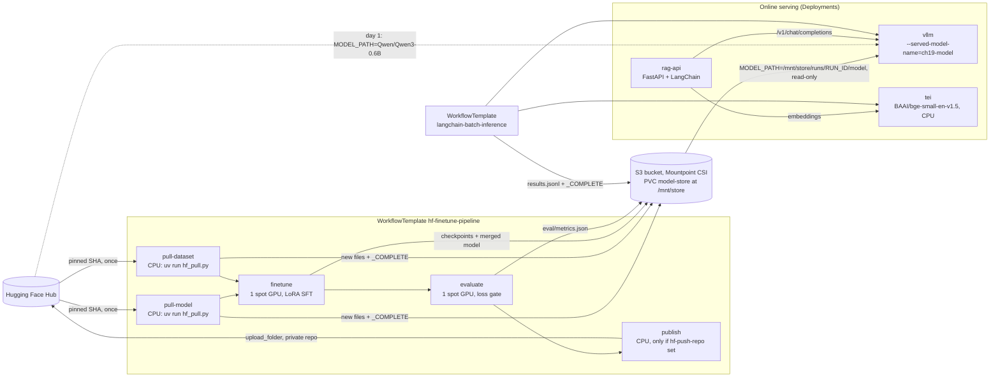
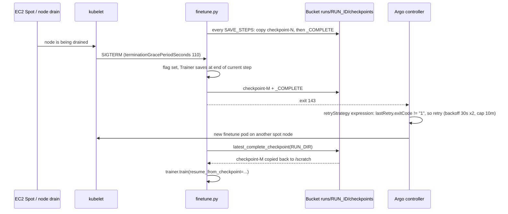
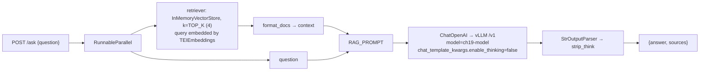

# 19 · LLM Pipelines on EKS: Hugging Face + LangChain

> Wire the whole loop on Kubernetes: pull a **pinned** Hugging Face model and dataset into a bucket
> once, LoRA-fine-tune it on **one spot GPU** in a pipeline that survives preemption, gate it on an
> evaluation, serve it with vLLM, and put a **LangChain** RAG API and a batch-inference pipeline in
> front of it. Everything below runs on **EKS**.

---

## 0. Before you start

This chapter reuses earlier chapters instead of rebuilding them:

- **A cluster** from [00-prerequisites-and-cluster-setup](../00-prerequisites-and-cluster-setup), with
  `env.sh` filled in (`AWS_REGION`, `EKS_CLUSTER`, `AWS_ACCOUNT_ID` for EKS).
- **A spot GPU node pool plus a device plugin** from
  [01-gpu-nodes-and-scheduling](../01-gpu-nodes-and-scheduling) §4, which gives you the `spot-gpu`
  managed node group (`g4dn.xlarge`, taint `nvidia.com/gpu=present:NoSchedule`, nodes
  labelled `nvidia.com/gpu.present=true` by the AL2023 NVIDIA AMI). **That group has `maxSize: 1` and
  no cluster autoscaler**, which matters in this chapter (see the GPU budget note in §3.8).
- **The concepts from [05-model-storage-and-data](../05-model-storage-and-data)**: bucket CSI mounts,
  keyless workload identity, `_COMPLETE` markers. This chapter creates its own bucket and identities.
  It doesn't reuse chapter 05's.
- **[09-llm-inference-with-vllm](../09-llm-inference-with-vllm)** for the vLLM deployment shape (probes,
  `Recreate`, grace period) and its `kubectl create secret generic hf-token` step, which this chapter
  reuses (own namespace).
- **Argo Workflows** from [15-mlops-gitops-and-pipelines](../15-mlops-gitops-and-pipelines) is
  *optional*. Step 1 below installs it if it's missing, or adds `ch19-pipelines` to an existing
  Helm release's `controller.workflowNamespaces`. If chapter 15's Argo CD app-of-apps manages it,
  `install-argo-workflows.sh` prints the GitOps path and doesn't touch it.
- Tools beyond chapter 00's list: the **`argo` CLI** (`brew install argo`), **Docker with buildx**
  (the trainer image is built locally), **`envsubst`** (`brew install gettext`) and `jq`.
- A **Hugging Face token is optional**: every repo used here is ungated. You need a **write** token only
  for the optional publish-to-Hub step.

## 1. Why this matters

Chapters 05, 07 and 09 each solved one piece: getting weights onto a node, training on GPUs, and
serving an OpenAI-compatible endpoint. Real teams have to connect those pieces, and most failures
happen at the joins:

- **Model and dataset versions drift.** `from_pretrained("Qwen/Qwen3-0.6B")` means "whatever `main`
  is today". If a retry lands on a different commit, you have trained on something nobody can
  reproduce.
- **The Hub is pulled again on every pod start.** Every spot reclaim, rollout and retry downloads
  the same gigabytes from the internet again, and eventually hits a rate limit.
- **Spot kills training runs.** A fine-tune that can't resume wastes every GPU-hour since its last
  save. One that retries on *every* failure wastes GPU-hours on a config bug that will never
  succeed.
- **Nobody checks the model before it ships.** Without a gate, a bad run goes straight to serving or
  to the Hub.
- **The application layer is an afterthought.** A RAG API or a nightly batch job needs embeddings, a
  vector index, a stable model name and sensible concurrency. It also must not break when the
  weights behind the endpoint change.

This chapter builds one pipeline where each of those joins has an explicit, testable answer. It uses
tools a DevOps team already knows: an Argo `WorkflowTemplate`, a bucket-backed PVC, three
ServiceAccounts with least-privilege IAM, and three Deployments.

## 2. Learning objectives and time plan (~3 h)

By the end you can:

1. Explain why every Hugging Face repo here is pinned to a **commit SHA**, and trade off "pull once
   into a bucket" against "pull from the Hub on every pod start" (`serving.env`'s two modes).
2. Explain why bucket FUSE mounts force a **write-once** pattern (local scratch → copy new files →
   `_COMPLETE` last), and find that pattern in `hf_pull.py`, `store.py`, `evaluate.py` and
   `batch_infer.py`.
3. Run a LoRA SFT fine-tune that **survives a spot interruption**: bucket checkpoints every
   `SAVE_STEPS`, a SIGTERM save, and an Argo retry expression that never retries exit code 1. Then
   prove it by killing the pod.
4. Use an evaluation step as a **quality gate** that stops the pipeline before publish.
5. Point vLLM at the fine-tuned model in the bucket and put a **LangChain LCEL RAG chain** in front of
   it. The chain uses TEI embeddings and vLLM's OpenAI-compatible API with Qwen3's thinking turned
   off.
6. Run **offline batch inference** with LangChain's `max_concurrency`, and read the results
   through the `_COMPLETE` marker.
7. Fit the pipeline into a one-GPU budget, and say what `cleanup.sh` deletes and what it keeps.

| Block              | Time   | What                                                                                |
| ------------------ | ------ | ----------------------------------------------------------------------------------- |
| Theory             | 35 min | §3: pinning, write-once storage, spot-resumable training, eval gate, RAG/TEI, batch |
| Lab setup (EKS)    | 30 min | Steps 1–4: node group + Argo, bucket + Pod Identity, trainer image, HF secret       |
| Lab: pipeline      | 55 min | Steps 5–9: deploy, free the GPU, run the fine-tune, spot drill, inspect the bucket  |
| Lab: serving + app | 35 min | Steps 10–13: serve the fine-tuned model, RAG API, batch inference, read results     |
| Optional           | 10 min | Step 14: publish to the Hub with a write token                                      |
| Review             | 15 min | Troubleshooting, checkpoint questions, cleanup                                      |


## 3. Concepts

### 3.0 New to LLM pipelines or Kubernetes-native ML? Start here

If chapters 05/07/09/15 are fresh in your memory, skim this and jump to §3.1. If they aren't, or you've
never wired a fine-tune-to-serving pipeline together before, read this first — the rest of the chapter
assumes it.

**3.0.1 The end-to-end shape, in plain English.** This chapter builds one assembly line with six
stations, and every station below maps to one WorkflowTemplate step or one Deployment you'll create in
the Lab:

1. **Pull** — download a specific, frozen version of a base model and a training dataset from the
   Hugging Face Hub (a public catalog of models/datasets, like a package registry for ML) into shared
   storage, once.
2. **Fine-tune** — take that base model, which already "knows" language in general, and nudge it with a
   small, cheap training run (LoRA, explained in §3.0.3) so it's better at *this* task, instead of
   training a model from zero (which would take a data-center, not one GPU).
3. **Evaluate** — automatically score the fine-tuned model against held-out examples it never trained
   on. This is a **quality gate**: if the score is worse than a threshold, the pipeline stops here and
   nothing bad reaches production.
4. **Publish** *(optional)* — if the model passed the gate, optionally upload it back to the Hub as your
   own private model repo, so it can be reused outside this cluster.
5. **Serve** — run the model behind an HTTP API using vLLM (a high-throughput inference server that
   speaks the same API shape as OpenAI's `/v1/chat/completions`), so any HTTP client can ask it
   questions.
6. **Build an application on top** — a RAG API (§3.0.4) that answers questions by first looking up
   relevant text and then asking the LLM to answer *using* that text, plus a batch job that runs many
   questions through the same logic offline.

Steps 1–4 run as one Argo Workflow (`hf-finetune-pipeline`); step 5 is a long-running Deployment, not a
pipeline step, because a model server isn't a job that finishes; step 6 is a second Deployment
(`rag-api`) plus a second, shorter Argo Workflow (`langchain-batch-inference`). §3.1's diagram below
draws all of this as boxes and arrows.

**3.0.2 Argo Workflows: DAG, WorkflowTemplate, `retryStrategy`.** Chapter 15 introduced Argo Workflows
as the pipeline engine for MLOps; here's the vocabulary you need for this chapter specifically:

- A **DAG** (directed acyclic graph) is just "steps, with arrows saying which steps must finish before
  which other steps can start". §3.1's Argo box is a DAG: `pull-model` and `pull-dataset` can run at the
  same time (nothing depends on their order relative to each other), but both must finish before
  `finetune` starts, which must finish before `evaluate`, which must finish before `publish`.
- A **WorkflowTemplate** is a *reusable, saved* DAG definition sitting in the cluster as a Kubernetes
  object (`kubectl get workflowtemplates`). You don't rewrite the DAG every time; you `argo submit
  --from workflowtemplate/<name> -p key=value` to start a new *run* of it with different parameters
  (Step 7 does this with `-p run-id=qwen3-sft-001`). Each run creates its own `Workflow` object, which is
  what actually spawns pods and that you watch with `argo get`/`argo logs`.
- A **`retryStrategy`** tells Argo what to do when a step's pod exits with a failure: retry it (up to a
  `limit`), with what backoff between attempts, and — the part that matters most on spot — an
  `expression` that decides *which* failures are worth retrying at all. §3.4 spells out exactly why this
  chapter's expression treats a spot interruption (exit 143/137/-1) as "try again" and a real bug (exit
  1) as "stop, a retry can't fix a bug".

If you haven't done chapter 15's lab, none of the commands here require it — Step 1 installs Argo
Workflows itself if it's missing.

**3.0.3 LoRA fine-tuning, conceptually: why you don't retrain the whole model.** A modern LLM's weights
are hundreds of millions to hundreds of billions of numbers, arranged in large matrices inside each
transformer layer. Training all of them from scratch needs enormous data and enormous compute — that's
what produced the base model in the first place, and it is *not* what happens in a single GPU-hour lab.

Full **fine-tuning** (updating every one of those numbers, starting from the pretrained weights instead
of random ones) is far cheaper than training from scratch, but for a 0.6B-parameter model it still means
storing and updating ~600M parameters' worth of gradients and optimizer state in GPU memory — that's
what makes fine-tuning some larger models infeasible on one consumer/cloud GPU.

**LoRA** (Low-Rank Adaptation) is a shortcut: instead of updating the big weight matrices directly, it
freezes them completely and adds a small pair of new, much smaller matrices next to each targeted layer
(`target_modules="all-linear"` in this chapter — every linear layer gets one). Only those small "adapter"
matrices are trained. In this chapter's run, that's about **10.1M trainable parameters out of 606M
total** — under 2%. Three consequences that matter for this lab:

- **It fits in far less GPU memory**, because the optimizer only needs state for the small adapter, not
  the full model — this is what makes fine-tuning fit on a single `g4dn.xlarge` spot GPU.
- **The saved checkpoint is tiny** (an adapter, tens of MB) compared to the full model (~1.4 GB of
  `safetensors`). That's why `finetune.py` uploads adapter checkpoints during training and only produces
  a full-size model once, at the end, by **merging** the adapter's numbers back into a copy of the base
  weights (§3.4 point 5) — merging is what makes the result loadable by vLLM like any other model,
  with no LoRA-specific code needed at serving time.
- **The base model is never touched**, so the same pulled-once base weights in the bucket can be reused
  by any number of fine-tunes (different `run-id`s) without re-downloading or risking corruption.

<details>
<summary>Want the one-paragraph math intuition?</summary>

A weight matrix `W` (say 1024×1024) has over a million numbers. LoRA replaces "learn a new 1024×1024
matrix `ΔW`" with "learn two small matrices `A` (1024×r) and `B` (r×1024) and use `A·B` as a low-rank
approximation of `ΔW`", where `r` (`LORA_R` in this chapter) is small — a few to a few dozen. `A·B` has
only `2×1024×r` numbers instead of `1024×1024`, and `lora_alpha` scales how much `A·B` is added to the
frozen `W`. The bet, backed by a lot of empirical results, is that the *useful* adjustment for a
fine-tuning task lives in a much lower-dimensional space than the full weight matrix — you don't need to
touch every one of a million numbers independently to steer a model's behavior on a narrower task.
</details>

**3.0.4 RAG, TEI, and why they show up together with LangChain.** An LLM only knows what was in its
training data, frozen at training time. **RAG (Retrieval-Augmented Generation)** fixes that for
question-answering without retraining: before asking the LLM a question, first *retrieve* the most
relevant chunks of your own documents, then paste them into the prompt so the LLM answers using that
text instead of (or in addition to) what it memorized. This also gives you **citations** ("sources" in
this chapter's `/ask` response) and lets you update the knowledge base by editing documents, not by
retraining a model.

Retrieval needs three pieces, and this chapter uses one component for each:

- **An embedding model** turns text into a vector of numbers (384 numbers here) such that
  semantically-similar text ends up as nearby vectors. **TEI (Text Embeddings Inference)** is a small,
  fast HTTP server whose only job is running an embedding model — here `BAAI/bge-small-en-v1.5` — so
  turning text into vectors is a network call, not something every consumer reimplements. It runs on
  CPU because embedding models are far smaller than the LLM.
- **A vector store** holds those vectors and answers "which stored vectors are closest to this query
  vector?" (nearest-neighbor search). This chapter uses LangChain's `InMemoryVectorStore` — good enough
  for the five-document lab corpus, rebuilt from scratch every time `rag-api` starts. A real deployment
  swaps this for a persistent vector database (pgvector, Qdrant, OpenSearch — §3.6 says so explicitly).
- **LangChain** is the glue: it defines the pipeline ("embed the question → fetch the top-`k` nearest
  chunks → format them into a prompt → call the LLM → parse the answer") as a composable chain (LCEL,
  §3.6's diagram) so each piece (embeddings, vector store, prompt, LLM client) is swappable without
  rewriting the whole flow.

The LLM itself is still served by vLLM exactly as in chapter 09 — RAG doesn't change how the model is
served, only what gets put in the prompt before the request reaches it.

**3.0.5 The `_COMPLETE` marker convention, and why idempotent steps matter on spot.** Every multi-step
write in this chapter (a model pull, a checkpoint, a merged model, a batch of results) follows the same
rule: write everything to a scratch disk first, copy the finished files into a **new** bucket directory,
and only then write a small `_COMPLETE` file as the very last write. Any reader (another pipeline step,
vLLM, you with the AWS CLI) is only allowed to trust a directory if `_COMPLETE` is present in it.

Why this matters specifically because of **spot**: spot nodes can disappear at any moment (§3.4's spot
budget), which means any step can be killed midway through writing its output. Without a marker
convention, "the directory exists" and "the directory is complete and correct" would be indistinguishable
— a reader (or a retry) could pick up a half-written file and either crash or, worse, silently train on
or serve corrupted data. With the marker:

- **A killed step leaves no trace a reader will act on.** A half-copied model directory has files but no
  `_COMPLETE`, so nothing downstream treats it as ready.
- **A retried step is idempotent** — running it again produces the *same* result as if it had succeeded
  the first time, at low cost. On restart, every script in this chapter first checks for `_COMPLETE`
  (or, for a still-in-progress fine-tune, the newest checkpoint that has one) and skips straight to "done"
  or "resume from here" instead of redoing finished work. That's what makes it safe for Argo to retry a
  step automatically instead of you babysitting it, and it's what makes re-submitting the same `run-id`
  cheap (§3.3, §3.4, §3.5 all rely on this one convention for a different kind of file).

Keep this one rule in your head while reading the Lab: **"does this directory have `_COMPLETE`?" is the
answer to almost every "is it safe to read/skip/resume this?" question in the chapter.**

### 3.1 The whole picture



**Reading this diagram if you're new to it:** the top box (`TRAIN`) is the Argo `WorkflowTemplate`
`hf-finetune-pipeline` — it runs once per `run-id` and then exits. The bottom box (`SERVE`) is three
plain Kubernetes `Deployments` — they run forever (until you scale or delete them), which is why serving
is drawn separately from the pipeline. `S3` in the middle is the one shared bucket every piece reads
from or writes to; every arrow into or out of it is a `_COMPLETE`-gated read/write (§3.0.5). The dotted
arrow (`day 1: MODEL_PATH=Qwen/Qwen3-0.6B`) is the *before-you've-trained-anything* path: on day 1 vLLM
serves the stock base model straight from the Hub, and only switches to the bucket path (the solid arrow
from `S3`) after Step 10, once a fine-tune has actually produced a model. `BATCH` at the bottom is the
second, shorter Argo `WorkflowTemplate` (`langchain-batch-inference`) — it's independent of `TRAIN` and
can run at any time once `SERVE` is up.

Everything runs in the namespace `ch19-pipelines` with three ServiceAccounts (`eks/serviceaccounts.yaml`):

| ServiceAccount    | Used by                                                        | Cloud permissions (EKS: Step 2's IAM/Pod Identity block)                                                                                            |
| ----------------- | -------------------------------------------------------------- | --------------------------------------------------------------------------------------------------------------------------------------------------- |
| `pipeline-runner` | every Argo step pod (pull, finetune, evaluate, publish, batch) | `s3:ListBucket`, `s3:GetObject`, `s3:PutObject`, `s3:AbortMultipartUpload`. **No `s3:DeleteObject`**: nothing in this chapter deletes or overwrites |
| `model-reader`    | `vllm`                                                         | `s3:ListBucket`, `s3:GetObject` only                                                                                                                |
| `rag-api`         | `rag-api`                                                      | none. It talks to vLLM/TEI over HTTP (`automountServiceAccountToken: false`)                                                                        |

One PV/PVC (`eks/pv-pvc-mountpoint.yaml`) serves every pod. Mountpoint's `authenticationSource: pod`
means each mounting pod's ServiceAccount, not the volume, decides whether it can write. That is
chapter 05's writer/reader split.

### 3.2 Pinned revisions, and pull-once versus pull-every-start

Every Hub coordinate in this chapter is a commit SHA, never `main` (`eks/configmap-pipeline-params.yaml`,
`eks/tei-deployment.yaml`):

| What                                           | Repo                          | Revision                                   |
| ---------------------------------------------- | ----------------------------- | ------------------------------------------ |
| Base model                                     | `Qwen/Qwen3-0.6B`             | `c1899de289a04d12100db370d81485cdf75e47ca` |
| SFT dataset (conversational `messages` column) | `trl-lib/Capybara` (dataset)  | `e235e846458bff3398a88aed812347f7f0756520` |
| Embeddings (TEI)                               | `BAAI/bge-small-en-v1.5`      | `5c38ec7c405ec4b44b94cc5a9bb96e735b38267a` |

A SHA makes every retry, every resumed checkpoint and every node load the same bytes. It also gives
the bucket an immutable path. `hf_pull.py` writes to `$STORE_ROOT/hf/<REPO_TYPE>s/<REPO_ID>/<REVISION>/`,
so two revisions can never mix in one directory. Once `_COMPLETE` is there, the pull step exits 0
immediately. A second pipeline run, or a retry, costs nothing.

vLLM supports both delivery patterns from chapter 05. `MODEL_PATH` in the `serving-params` ConfigMap
(`eks/configmap-serving-params.yaml`, generated from `eks/serving.env`) chooses between them:

| `MODEL_PATH`                                          | Where weights come from                  | Cost per pod start                                                                                                   | When                                                             |
| ------------------------------------------------------ | ---------------------------------------- | -------------------------------------------------------------------------------------------------------------------- | ---------------------------------------------------------------- |
| `Qwen/Qwen3-0.6B` (the default in `eks/serving.env`)    | The Hub, into an `emptyDir` HF cache     | A full download on every start, reclaim and reschedule. Subject to Hub rate limits                                   | Day 1, before the pipeline has produced anything                 |
| `/mnt/store/runs/<run-id>/model`                        | The bucket, read-only, as `model-reader` | Same-region object reads, no internet. The `wait-for-model` init container refuses to start until `_COMPLETE` exists | After a pipeline run. This is how the fine-tuned model is served |

There's no more kustomize hash suffix to force a rollout when `MODEL_PATH` changes: edit
`serving.env`, regenerate `configmap-serving-params.yaml` (`kubectl create configmap serving-params
--from-env-file=serving.env --dry-run=client -o yaml`), `kubectl apply -f` it, then explicitly
`kubectl -n ch19-pipelines rollout restart deploy/vllm` — Step 10 below does exactly this.

### 3.3 Write-once storage: scratch, copy, `_COMPLETE` last

Bucket FUSE mounts aren't POSIX file systems. By default, Mountpoint for S3 creates **new** files,
written sequentially. It won't overwrite, rename or delete, and it can't change file modes. GCS FUSE
renames by copying and deleting. `snapshot_download` writes `*.incomplete` files and renames them. The
HF `Trainer` also needs a real file system for its checkpoints. So every step in this chapter follows
the same three rules (`eks/src/trainer/store.py`):

1. Build the artifact on **local scratch** (an `emptyDir` at `/scratch`).
2. Copy it into a **fresh** bucket directory, file by file, as new files (`shutil.copyfile`, not
   `copy2`: bucket mounts reject chmod/utime).
3. Write **`_COMPLETE` last**. Readers only trust a directory that has it.

A file already at the destination with identical content is skipped. That covers an earlier attempt
that died before writing the marker. A file with *different* content raises `FileExistsError`,
because the bucket can't replace it and mixing two attempts would be silently wrong. The resulting
layout:

```
/mnt/store/                                   (s3://<account>-ch19-pipelines/)
├── hf/models/Qwen/Qwen3-0.6B/<sha>/          config.json, model.safetensors, tokenizer*, ... + _COMPLETE
├── hf/datasets/trl-lib/Capybara/<sha>/       data/train-*.parquet, data/test-*.parquet + _COMPLETE
├── runs/<run-id>/
│   ├── checkpoints/checkpoint-50/            LoRA adapter + optimizer/scheduler/RNG state + _COMPLETE
│   ├── checkpoints/checkpoint-100/ ...       (only dirs WITH _COMPLETE are resume points)
│   ├── model/                                LoRA merged into the base, safetensors + tokenizer + _COMPLETE
│   └── eval/metrics.json                     written once ("x" mode: create-only)
└── batch/
    ├── inputs/prompts.jsonl                  seeded from ConfigMap ch19-prompts if absent
    └── <workflow-name>/results.jsonl         + _COMPLETE (JSON; its "results_file" key is authoritative)
```

### 3.4 Spot-resumable fine-tuning

`finetune.py` runs TRL's `SFTTrainer` with a PEFT LoRA adapter (`r=LORA_R`, `lora_alpha=2*LORA_R`,
`target_modules="all-linear"`) on `TRAIN_SAMPLES` conversations. The subset uses a fixed seed, so
every retry sees the same samples in the same order. With the defaults (200 steps × 4 per device × 4
accumulation = 3,200 sequences over 2,000 samples), that's about 1.6 epochs. Precision is picked at
runtime: bf16 on Ampere and newer (faster GPU families), fp16 AMP with fp32 master weights on a T4
(`g4dn.xlarge` has no bf16), and fp32 on CPU.

The spot design has five parts. Each has a line of code you can point to:



**Reading this diagram:** time flows top to bottom, and each arrow is one event. Read it as a story: the
training pod (`P`) is periodically saving checkpoints to the bucket (`B`) *before* anything goes wrong.
Then EC2's spot reclamation (`Spot`) notifies the kubelet (`K`), which forwards a SIGTERM to the running
process (`P`) — this is the *only* moment the pod is asked nicely to stop; if it doesn't finish within
its grace period, Kubernetes kills it outright. `P` uses that window to save one more checkpoint, then
exits with a specific failure code. The Argo controller (`A`) is watching the exit code, decides "this
looks like an interruption, not a bug," and schedules a fresh pod — which then rediscovers the last
completed checkpoint in the bucket and picks up training where the dead pod left off. Nothing here is
Kubernetes automatically "resuming" a process; every step of the resume is application code in
`finetune.py` reading `_COMPLETE` markers, which is why §3.0.5's convention is what actually makes this
diagram true.

1. **Bucket checkpoints.** `Trainer` saves to `/scratch/trainer-output` every `SAVE_STEPS` (50). The
   `BucketCheckpointCallback.on_save` hook copies each `checkpoint-N` to
   `$RUN_DIR/checkpoints/checkpoint-N/` and then writes `_COMPLETE`. Scratch keeps only 2 checkpoints
   (`save_total_limit=2`). The bucket keeps all of them.
2. **Resume.** On start, the newest checkpoint *with* `_COMPLETE` is copied back to scratch and passed
   to `resume_from_checkpoint`. That restores the optimizer, LR scheduler, RNG and data position.
3. **SIGTERM save.** The handler only sets a flag. The callback's `on_step_end` then sets
   `control.should_save` and `control.should_training_stop`. The script exits **143**, so Argo sees a
   failure to retry, not a success. Argo's emissary executor signals the step's whole process group,
   and the step `exec`s Python, so finetune.py's own exit code (143) is what the retry rule sees.
4. **Retry only what an interruption could explain.** The retry policy is `limit: "10"`,
   `retryPolicy: Always`, `expression: 'lastRetry.exitCode != "1" && !(lastRetry.message contains
   "OOMKilled")'`. Exit 1 means a Python exception: a bad config, CUDA OOM, a conflicting partial
   upload. That failure is deterministic, and retrying it only burns GPU-hours. A container
   OOMKilled by its memory limit exits 137 just like a spot SIGKILL, so the expression also checks the
   node message Argo sets (`OOMKilled (exit code 137)`). Other 137s, 143 (SIGTERM) and -1 (pod
   deleted) are treated as interruptions. After a SIGTERM, finetune.py turns any exception (e.g. the
   bucket mount going away mid-drain) into 143 so an interruption is never misread as a real failure.
5. **Idempotent completion.** If `$RUN_DIR/model/_COMPLETE` exists, the script exits 0 right away. If
   the newest checkpoint already reached `MAX_STEPS`, meaning the pod died while uploading the merged
   model, training is skipped and that checkpoint is merged directly. The merge is always "fresh base
   + final adapter, on CPU in fp32, saved in the base model's dtype". That keeps it byte-reproducible,
   so a retry finds identical files instead of conflicting ones.

**Grace period versus notice.** EC2 gives a 2-minute spot interruption notice. The finetune pod's
`podSpecPatch` sets `terminationGracePeriodSeconds: 110`, which leaves time to finish the current step
and upload an adapter-sized checkpoint. The periodic
`SAVE_STEPS` checkpoints are the real safety net. The SIGTERM save is a bonus, and it only happens if
something turns the notice into a pod eviction. On EKS, managed node groups use Capacity Rebalancing
and drain the node (chapter 00 §3.3). A hard node loss with no SIGTERM loses at most `SAVE_STEPS` steps.

### 3.5 The evaluation gate

`evaluate.py` loads the merged model and computes the token-weighted mean next-token cross-entropy
over `EVAL_SAMPLES` (200) chat-formatted conversations from the dataset's **test** split. That's the
same objective SFT optimized, and perplexity = exp(loss). It writes `$RUN_DIR/eval/metrics.json`
once (create-only). It exposes `eval_loss` as the workflow output `eval-loss`, and **exits 1 if
`eval_loss > MAX_EVAL_LOSS`** (2.5 by default) **or if the loss is not finite**. `NaN > 2.5` is false
in Python, so a numerically blown-up model would otherwise pass. It scores in bf16 on L4 and in
fp32 on T4, not fp16, because fp16 can overflow to inf/NaN on Qwen-family models. Exit 1 is excluded from the step's retry expression,
so a failed gate ends the DAG before `publish`. A retry *after* metrics exist re-reads the recorded
numbers instead of re-scoring. The gate therefore always judges the same numbers, and re-submitting
the same `run-id` with a different `-p max-eval-loss` re-judges them without retraining.

### 3.6 Serving: vLLM + TEI + a LangChain LCEL RAG chain



**Reading this diagram:** this is a LangChain **LCEL chain** — a pipeline of small, swappable steps
(`Runnable`s) wired together with `|`, similar in spirit to a shell pipe. `RunnableParallel` runs its two
branches (retrieve context, pass the question through unchanged) at the same time and merges their
outputs into one object. Nothing here talks to a database in the traditional sense: `RET` (the
retriever) is a similarity search over vectors already sitting in memory (§3.0.4), and `LLM` is a plain
HTTP call to vLLM's OpenAI-compatible API — from LangChain's point of view, vLLM is indistinguishable
from calling OpenAI itself, which is the whole point of vLLM exposing that API shape.

- **vLLM** (`eks/vllm-deployment.yaml`) has the same shape as chapter 09: `Recreate`, a
  10-minute `startupProbe`, a `preStop` sleep, a 25 s grace period and `--shutdown-timeout=10`. It
  also adds `--served-model-name=ch19-model`. Clients always ask for `ch19-model`, so swapping base
  weights for fine-tuned weights is a server-side change only. `--enable-prefix-caching` helps
  because every RAG prompt shares the same long system prefix.
- **TEI** (Text Embeddings Inference, `cpu-1.9.4`) serves `BAAI/bge-small-en-v1.5`, with 33M params
  and 384 dims. It runs on CPU, so embeddings don't need a GPU.
- **Why the app doesn't use `HuggingFaceEndpointEmbeddings`.** In `langchain-huggingface` 1.2.2 its
  validator rejects any `http(s)://` value ("`model` must be a HuggingFace repo ID, not a URL"), so it
  can't point at a self-hosted TEI Service. `rag_chain.py` defines a small `TEIEmbeddings` class
  instead. It subclasses `langchain_core.embeddings.Embeddings` and calls
  `huggingface_hub.InferenceClient(model=EMBEDDINGS_URL).feature_extraction(batch, truncate=True)`,
  which POSTs `{"inputs": [...], "truncate": true}` to the TEI root URL. It sends batches of 32
  (`TEI_MAX_CLIENT_BATCH`), because that's TEI's default `--max-client-batch-size` and larger requests
  get HTTP 413. So the app doesn't depend on `langchain-huggingface` at all.
- **The corpus** is the five `docs/*.md` files about this course's platform, from the `ch19-rag-docs`
  ConfigMap mounted at `/opt/rag-docs`. They're split with a Markdown-aware
  `RecursiveCharacterTextSplitter` (800 chars, 100 overlap), embedded at startup into an
  `InMemoryVectorStore`, and rebuilt on every start. That's deliberate for a lab-sized corpus. A real
  corpus belongs in pgvector, Qdrant or OpenSearch.
- **Qwen3 thinking.** By default Qwen3 emits `<think>…</think>` before answering, which costs tokens
  and latency. With `DISABLE_THINKING=true`, `build_llm` sends
  `extra_body={"chat_template_kwargs": {"enable_thinking": False}}`. vLLM forwards it to the chat
  template. `REASONING_EFFORT` is left unset for vLLM, which is believed to validate that field (a
  `# VERIFY:` item in `rag_chain.py`) -- leave it unset rather than guessing a value. `strip_think`
  still removes any `<think>` text that gets through, for example from an answer cut off mid-thought
  by `max_tokens`.
- **No image build for the app.** `rag-api` runs the stock uv image with
  `uv run /opt/app/rag_api.py`. The script is PEP 723, so its dependency pins are inline, and uv
  installs them on first start. That's why the `startupProbe` allows 15 minutes. For production,
  bake the dependencies into an image.
- **Probes.** `/healthz` returns 200 while the process is up. It returns 503 only if the index build
  failed permanently, meaning TEI stayed unreachable past `EMBEDDINGS_WAIT_SECONDS` (600). `/readyz`
  returns 200 only once the index is built. **Neither checks vLLM**, on purpose: a vLLM restart
  shouldn't remove the API from its Service. `/ask` returns 502 instead, with the reason.

### 3.7 Batch inference

`langchain-batch-inference` runs three CPU steps: `seed-prompts` → `wait-for-llm` → `batch-infer`.
`batch_infer.py` imports the same `rag_chain.py`, so offline answers come from exactly the same chain
as online answers (`use-rag=false` uses the plain chat chain as a baseline). It calls
`chain.batch(inputs, config={"max_concurrency": CONCURRENCY}, return_exceptions=True)`. The
concurrency parameter is the throughput knob: vLLM's continuous batching turns concurrent requests
into GPU batches, and anything above vLLM's `--max-num-seqs=64` just queues. With
`return_exceptions=True`, one bad item becomes an `error` field on its row instead of aborting the
batch. If **more than 50 % fail**, the script writes **nothing** and exits 1. Writing `_COMPLETE` would
make the retry skip itself and hide the failure.

### 3.8 The GPU budget

Chapter 01's EKS `spot-gpu` node group has **`maxSize: 1`**, and EKS doesn't install a cluster
autoscaler, so you scale it yourself with `eksctl scale nodegroup` (chapter 01 §4, or the one-liner
in Step 5 below). `vllm`,
`finetune` and `evaluate` each request `nvidia.com/gpu: 1`. With one GPU node, they can't run at the
same time. Either **scale vLLM to 0 while the pipeline trains** (what the lab does) or raise the
node group's `maxSize` to 2 and pay for two GPU nodes during training.

## 4. Lab

Layout:

```
19-llm-pipelines-huggingface-langchain/
└── eks/                                      every file below is a standalone `kubectl apply -f`-able manifest
    ├── namespace.yaml                        ch19-pipelines
    ├── serviceaccounts.yaml                  pipeline-runner, model-reader, rag-api
    ├── rbac-argo-executor.yaml               Role + RoleBinding for the Argo emissary executor
    ├── configmap-pipeline-params.yaml        model/dataset coordinates, trainer knobs, chat endpoint (from params.env)
    ├── configmap-serving-params.yaml         MODEL_PATH for vLLM (from serving.env)
    ├── configmap-ch19-scripts.yaml           hf_pull.py (kubectl create configmap --from-file, checked in)
    ├── configmap-ch19-langchain-app.yaml     rag_chain.py, rag_api.py, batch_infer.py (same pattern)
    ├── configmap-ch19-rag-docs.yaml          the RAG corpus (docs/*.md)
    ├── configmap-ch19-prompts.yaml           seed input for the batch pipeline (prompts.jsonl)
    ├── workflowtemplate-hf-finetune.yaml     WorkflowTemplate hf-finetune-pipeline (GPU spot nodeSelector inlined)
    ├── workflowtemplate-langchain-batch.yaml WorkflowTemplate langchain-batch-inference (CPU spot nodeSelector inlined)
    ├── vllm-deployment.yaml                  vLLM Deployment + Service (GPU spot nodeSelector inlined)
    ├── tei-deployment.yaml                   TEI embeddings Deployment + Service (CPU spot nodeSelector inlined)
    ├── rag-api-deployment.yaml               LangChain RAG API Deployment + Service (CPU spot nodeSelector inlined)
    ├── pv-pvc-mountpoint.yaml                S3 Mountpoint PV/PVC (bucket name via envsubst, like chapter 05)
    ├── nodegroup-ch19.yaml                   CPU spot managed node group (cluster/region via envsubst, like chapter 00)
    ├── bucket.env, images.env, serving.env   written/edited by the lab steps below (envsubst / ConfigMap inputs)
    └── src/
        ├── hf_pull.py                        PEP 723 script (huggingface_hub==1.32.0), run with uv in the uv image
        ├── trainer/                          Dockerfile, requirements.txt, store.py, finetune.py, evaluate.py, publish_hf.py
        └── langchain_app/                    rag_chain.py, rag_api.py, batch_infer.py, docs/*.md, prompts.jsonl
```

All commands run from the repo root:

```bash
cp env.sh.example env.sh   # if not already done
source env.sh && source versions.env
```

Read through the manifests before applying anything (every file is plain YAML, no rendering needed):

```bash
${PAGER:-less} 19-llm-pipelines-huggingface-langchain/eks/*.yaml
```

<details open>
<summary><b>EKS (primary): full walkthrough</b></summary>

#### Step 1: CPU spot node group + Argo Workflows

What you're about to do: the block below creates the managed node group `ch19-cpu-spot`
(`nodegroup-ch19.yaml`: spot `m7i.xlarge`/`m6i.xlarge`/`m6a.xlarge`/`m5.xlarge`, `minSize 0`,
`desiredCapacity 2`, `maxSize 3`, 100 GB disks for scratch and uv caches). The pull, publish and
batch steps, TEI and rag-api run on it. It then installs Argo Workflows (chart
`${ARGO_WORKFLOWS_VERSION}` = 2.0.6, app v4.1.3), or, if it's already installed, adds
`ch19-pipelines` to the controller's existing `workflowNamespaces` list instead of replacing it. In
chart 2.0.6 that list does **not** limit what the controller watches: the controller watches all
namespaces through its ClusterRole. The list only decides where the chart creates its default
`argo-workflow` ServiceAccount and executor Role. This chapter's steps run as `pipeline-runner`,
which has its own executor RBAC in `rbac-argo-executor.yaml`, so listing `ch19-pipelines` is
harmless and keeps the Helm path consistent with chapter 15's GitOps values file. If chapter 15's
**Argo CD** already manages Argo Workflows (Application `argocd/ch15-argo-workflows`), the block
below prints GitOps instructions instead of running Helm (set `FORCE_HELM=true` to helm-upgrade
anyway). `INCLUDE=ch19-cpu-ondemand` creates the on-demand fallback group instead of the spot one.

> **New to EKS node groups or `eksctl`?** A **managed node group** is a set of EC2 instances that EKS
> keeps registered as Kubernetes nodes for you (auto-replacing unhealthy ones), as opposed to you
> managing raw EC2 instances by hand. `eksctl` is a CLI wrapper around the underlying CloudFormation
> stacks — `eksctl create nodegroup -f <file>` reads the node group's shape (instance types, sizes,
> spot vs. on-demand, taints) from a YAML file and creates the real AWS resources. `--include` picks
> which named node group(s) in that file to actually create, since one file can define several. This
> step's node group is deliberately CPU-only (no GPU): it hosts the lightweight pipeline steps and
> supporting Deployments, keeping the (expensive, quota-limited) GPU node group from chapter 01 free
> for the one thing that needs a GPU — training and evaluation.

```bash
: "${AWS_REGION:?source env.sh}" "${EKS_CLUSTER:?}"
HERE=19-llm-pipelines-huggingface-langchain/eks
INCLUDE="${INCLUDE:-ch19-cpu-spot}"

if eksctl get nodegroup --cluster "${EKS_CLUSTER}" --region "${AWS_REGION}" --name "${INCLUDE%%,*}" >/dev/null 2>&1; then
  echo "node group ${INCLUDE%%,*} already exists"
  # cleanup scales it to 0 without deleting it, and there is no cluster autoscaler in this lab:
  # bring it back to its working size (2 nodes: parallel hf-pull steps + TEI + rag-api don't fit
  # on one 4 vCPU node).
  eksctl scale nodegroup --cluster "${EKS_CLUSTER}" --region "${AWS_REGION}" --name "${INCLUDE%%,*}" \
    --nodes "${CPU_NODES:-2}" --nodes-min 0 --nodes-max 3
else
  TMP="$(mktemp -d)"
  envsubst '${EKS_CLUSTER} ${AWS_REGION}' < "${HERE}/nodegroup-ch19.yaml" > "${TMP}/nodegroup-ch19.yaml"
  eksctl create nodegroup -f "${TMP}/nodegroup-ch19.yaml" --include "${INCLUDE}"
  rm -rf "${TMP}"
fi

ARGO_NS="${ARGO_NS:-argo}"
ARGO_RELEASE="${ARGO_RELEASE:-argo-workflows}"
WF_NS=ch19-pipelines

if [[ "${FORCE_HELM:-false}" != "true" ]] && \
   kubectl -n argocd get applications.argoproj.io ch15-argo-workflows >/dev/null 2>&1; then
  cat <<MSG
Argo Workflows is managed by Argo CD (Application argocd/ch15-argo-workflows) -- not touching it.
GitOps path: make sure controller.workflowNamespaces in
  15-mlops-gitops-and-pipelines/eks/values-argo-workflows.yaml
lists "- ${WF_NS}" (it does in this repo), commit + push to the repo Argo CD tracks, then:
  argocd app sync ch15-argo-workflows   (or wait for auto-sync)
Re-run with FORCE_HELM=true to helm-upgrade anyway (Argo CD will then show the app OutOfSync).
MSG
else
  # The chart creates RBAC objects in every watched namespace, so it must exist first.
  kubectl create namespace "${WF_NS}" --dry-run=client -o yaml | kubectl apply -f -

  # Union of what the release already watches + ch19-pipelines.
  EXISTING="$(helm get values "${ARGO_RELEASE}" -n "${ARGO_NS}" -o json 2>/dev/null \
    | jq -r '(.controller.workflowNamespaces // [])[]' || true)"
  NAMESPACES="$(printf '%s\n%s\n' "${EXISTING}" "${WF_NS}" | sed '/^$/d' | sort -u | paste -sd, -)"
  echo "Argo Workflows ${ARGO_WORKFLOWS_VERSION}: controller.workflowNamespaces={${NAMESPACES}}"

  helm repo add argo https://argoproj.github.io/argo-helm --force-update >/dev/null
  helm repo update argo >/dev/null

  # --reuse-values keeps whatever else an earlier install set (e.g. ch15's server flags);
  # authModes=server = UI/CLI use the server's own identity: lab only, never expose it.
  helm upgrade --install "${ARGO_RELEASE}" argo/argo-workflows \
    --version "${ARGO_WORKFLOWS_VERSION}" \
    --namespace "${ARGO_NS}" --create-namespace \
    --reuse-values \
    --set "controller.workflowNamespaces={${NAMESPACES}}" \
    --set 'server.authModes={server}'

  kubectl -n "${ARGO_NS}" rollout status "deployment/${ARGO_RELEASE}-workflow-controller" --timeout=180s
  kubectl get crd workflowtemplates.argoproj.io >/dev/null
  echo "Argo Workflows ready. UI: kubectl -n ${ARGO_NS} port-forward svc/${ARGO_RELEASE}-server 2746:2746"
fi
```

Expected output (abridged, the eksctl lines vary):

```
... created 1 managed nodegroup(s) in cluster "eks-ai-lab"
Argo Workflows 2.0.6: controller.workflowNamespaces={ch19-pipelines}
deployment "argo-workflows-workflow-controller" successfully rolled out
Argo Workflows ready. UI: kubectl -n argo port-forward svc/argo-workflows-server 2746:2746

Next: Step 2 (bucket + Pod Identity + Mountpoint CSI add-on -> bucket.env), Step 3 (trainer image
-> ECR -> images.env), then `kubectl apply -f .../eks`.
```

If chapter 15 already installed Argo Workflows with Helm, the namespace list also shows
`ch15-pipelines`. If chapter 15's **Argo CD** manages it (Application `argocd/ch15-argo-workflows`),
the script prints the GitOps instructions and exits without running Helm. Chapter 15's
`values-argo-workflows.yaml` already lists `- ch19-pipelines`, so push your fork and sync.

```bash
kubectl get nodes -l eks.amazonaws.com/nodegroup=ch19-cpu-spot -L eks.amazonaws.com/capacityType
helm get values argo-workflows -n argo -o json | jq '.controller.workflowNamespaces'
```

**How to tell this worked**: one `Ready` node with `CAPACITYTYPE` `SPOT`, the namespace list
contains `"ch19-pipelines"`, and `kubectl get crd workflowtemplates.argoproj.io` succeeds.

#### Step 2: Bucket, Pod Identity, Mountpoint add-on

What you're about to do: the block below creates the bucket `${AWS_ACCOUNT_ID}-ch19-pipelines` in
`$AWS_REGION` with public access blocked. It installs the `eks-pod-identity-agent` and
`aws-mountpoint-s3-csi-driver` add-ons if they're missing. It then creates two IAM roles trusted by
`pods.eks.amazonaws.com`, `ch19-pipeline-runner-${EKS_CLUSTER}` (read/write) and
`ch19-model-reader-${EKS_CLUSTER}` (read-only), each with the inline policy `s3-ch19`, and associates
them with the `pipeline-runner` and `model-reader` ServiceAccounts in `ch19-pipelines`. Last, it
writes `eks/bucket.env`, which `envsubst` renders into the PV's `bucketName` in Step 5. It's
idempotent — safe to re-run.

> **New to IAM roles, trust policies, or Pod Identity?** A pod can't use your personal AWS credentials —
> it needs its own identity in AWS. **Pod Identity** is EKS's mechanism for handing a pod temporary AWS
> credentials based on which Kubernetes `ServiceAccount` it runs as, with no long-lived secret keys
> stored anywhere. Two pieces make that work: an **IAM role** (a named, reusable set of permissions in
> AWS) and a **trust policy** attached to it (`trust.json` below) that says *who* is allowed to assume
> that role — here, `pods.eks.amazonaws.com`, the Pod Identity service itself. The **inline policy**
> (`pipeline-runner.json`/`model-reader.json`) is the actual permission list: which S3 actions the role
> may perform, and on which bucket. `aws eks create-pod-identity-association` is the final link: "pods
> running as ServiceAccount `X` in namespace `Y` may assume role `Z`." This is why `pipeline-runner` and
> `model-reader` get *different* roles with different permissions (read/write vs. read-only, §3.1's
> table) even though they're used by pods in the same namespace — least privilege, applied per workload.

```bash
: "${AWS_REGION:?source env.sh}" "${EKS_CLUSTER:?}" "${AWS_ACCOUNT_ID:?}"
HERE=19-llm-pipelines-huggingface-langchain/eks
NS=ch19-pipelines
BUCKET="${S3_BUCKET:-${AWS_ACCOUNT_ID}-ch19-pipelines}"
TMP="$(mktemp -d)"

if ! aws s3api head-bucket --bucket "${BUCKET}" 2>/dev/null; then
  if [[ "${AWS_REGION}" == "us-east-1" ]]; then
    aws s3api create-bucket --bucket "${BUCKET}" --region "${AWS_REGION}"
  else
    aws s3api create-bucket --bucket "${BUCKET}" --region "${AWS_REGION}" \
      --create-bucket-configuration "LocationConstraint=${AWS_REGION}"
  fi
  aws s3api put-public-access-block --bucket "${BUCKET}" \
    --public-access-block-configuration BlockPublicAcls=true,IgnorePublicAcls=true,BlockPublicPolicy=true,RestrictPublicBuckets=true
fi

for addon in eks-pod-identity-agent aws-mountpoint-s3-csi-driver; do
  if ! aws eks describe-addon --cluster-name "${EKS_CLUSTER}" --addon-name "${addon}" --region "${AWS_REGION}" >/dev/null 2>&1; then
    aws eks create-addon --cluster-name "${EKS_CLUSTER}" --addon-name "${addon}" --region "${AWS_REGION}"
  fi
done

cat > "${TMP}/trust.json" <<JSON
{
  "Version": "2012-10-17",
  "Statement": [{
    "Effect": "Allow",
    "Principal": {"Service": "pods.eks.amazonaws.com"},
    "Action": ["sts:AssumeRole", "sts:TagSession"]
  }]
}
JSON

# Mountpoint's documented least-privilege actions. No s3:DeleteObject anywhere: nothing in this
# chapter deletes or overwrites objects.
cat > "${TMP}/model-reader.json" <<JSON
{
  "Version": "2012-10-17",
  "Statement": [
    {"Effect": "Allow", "Action": ["s3:ListBucket"], "Resource": ["arn:aws:s3:::${BUCKET}"]},
    {"Effect": "Allow", "Action": ["s3:GetObject"], "Resource": ["arn:aws:s3:::${BUCKET}/*"]}
  ]
}
JSON
cat > "${TMP}/pipeline-runner.json" <<JSON
{
  "Version": "2012-10-17",
  "Statement": [
    {"Effect": "Allow", "Action": ["s3:ListBucket"], "Resource": ["arn:aws:s3:::${BUCKET}"]},
    {"Effect": "Allow", "Action": ["s3:GetObject", "s3:PutObject", "s3:AbortMultipartUpload"],
     "Resource": ["arn:aws:s3:::${BUCKET}/*"]}
  ]
}
JSON

for sa in pipeline-runner model-reader; do
  ROLE="ch19-${sa}-${EKS_CLUSTER}"
  if ! aws iam get-role --role-name "${ROLE}" >/dev/null 2>&1; then
    aws iam create-role --role-name "${ROLE}" --assume-role-policy-document "file://${TMP}/trust.json" >/dev/null
  fi
  aws iam put-role-policy --role-name "${ROLE}" --policy-name s3-ch19 \
    --policy-document "file://${TMP}/${sa}.json"
  ROLE_ARN="$(aws iam get-role --role-name "${ROLE}" --query Role.Arn --output text)"

  EXISTING="$(aws eks list-pod-identity-associations --cluster-name "${EKS_CLUSTER}" --region "${AWS_REGION}" \
    --namespace "${NS}" --service-account "${sa}" --query 'associations[0].associationId' --output text)"
  if [[ "${EXISTING}" == "None" || -z "${EXISTING}" ]]; then
    aws eks create-pod-identity-association --cluster-name "${EKS_CLUSTER}" --region "${AWS_REGION}" \
      --namespace "${NS}" --service-account "${sa}" --role-arn "${ROLE_ARN}" >/dev/null
  fi
  echo "role ${ROLE} -> ${NS}/${sa}"
done
rm -rf "${TMP}"

printf '# written by chapter 19 setup\nS3_BUCKET=%s\n' "${BUCKET}" > "${HERE}/bucket.env"
cat "${HERE}/bucket.env"
```

Expected output (abridged, `create-addon` also prints JSON the first time):

```
role ch19-pipeline-runner-eks-ai-lab -> ch19-pipelines/pipeline-runner
role ch19-model-reader-eks-ai-lab -> ch19-pipelines/model-reader
bucket s3://123456789012-ch19-pipelines ready; .../eks/bucket.env updated
# written by chapter 19 setup
S3_BUCKET=123456789012-ch19-pipelines
```

```bash
aws eks list-pod-identity-associations --cluster-name "$EKS_CLUSTER" --region "$AWS_REGION" \
  --namespace ch19-pipelines --query 'associations[].[serviceAccount,associationArn]' --output text
```

**How to tell this worked**: two associations (`pipeline-runner`, `model-reader`), and `bucket.env`
holds your account ID, not the committed `123456789012` placeholder.

#### Step 3: Build and push the trainer image

What you're about to do: build `eks/src/trainer/` for `linux/amd64` with `TORCH_VARIANT=cu129`.
The Dockerfile starts from `python:3.12-slim-trixie` and copies in the uv 0.12.15 binary. It installs
`torch==2.13.0` from the PyTorch cu129 wheel index, then installs `requirements.txt` with a
`torch==2.13.0` constraint so nothing swaps in another torch build. The script pushes the image to the
ECR repo `ch19-trainer`, creating it with scan-on-push if needed and setting a lifecycle policy
that keeps the newest 5 images. It writes `eks/images.env`, which `envsubst` renders into the
`finetune`, `evaluate` and `publish` templates' `${TRAINER_IMAGE}` placeholder in Step 5. The tag defaults to the
current git commit, and `TAG=v2` overrides it. `--platform linux/amd64` matters on Apple silicon: an
arm64 image fails on the GPU node with `exec format error`. The image is large (~6–8 GB of torch +
CUDA libraries), so the first build and push take a while.

> **New to ECR or `docker buildx`?** **ECR** (Elastic Container Registry) is AWS's private Docker image
> registry — like Docker Hub, but access-controlled to your account and colocated with your cluster for
> fast pulls. A Kubernetes pod's `image:` field can only reference an image that's been pushed
> *somewhere* pods can pull from; this step is what gets the trainer code from your laptop into a place
> the GPU node can reach. **`docker buildx build --push`** builds the image and pushes it to that
> registry in one command, and `--platform linux/amd64` controls *which CPU architecture* the image is
> built for — EKS GPU instances are `x86_64` (Intel/AMD), but a laptop with Apple silicon is `arm64` by
> default, so without this flag you'd silently build an image the GPU node can't run at all.

```bash
: "${AWS_REGION:?source env.sh}" "${AWS_ACCOUNT_ID:?}"
HERE=19-llm-pipelines-huggingface-langchain/eks
REPO=ch19-trainer
REGISTRY="${AWS_ACCOUNT_ID}.dkr.ecr.${AWS_REGION}.amazonaws.com"
TAG="${TAG:-$(git rev-parse --short HEAD 2>/dev/null || date -u +%Y%m%d%H%M)}"
IMAGE="${REGISTRY}/${REPO}:${TAG}"
CONTEXT="${HERE}/src/trainer"

if ! aws ecr describe-repositories --repository-names "${REPO}" --region "${AWS_REGION}" >/dev/null 2>&1; then
  aws ecr create-repository --repository-name "${REPO}" --region "${AWS_REGION}" \
    --image-scanning-configuration scanOnPush=true >/dev/null
fi
# Every rebuild pushes another ~6-8 GB image, and ECR bills per GB-month: keep only the newest 5.
aws ecr put-lifecycle-policy --repository-name "${REPO}" --region "${AWS_REGION}" \
  --lifecycle-policy-text '{"rules":[{"rulePriority":1,"description":"keep last 5 images","selection":{"tagStatus":"any","countType":"imageCountMoreThan","countNumber":5},"action":{"type":"expire"}}]}' \
  >/dev/null
aws ecr get-login-password --region "${AWS_REGION}" | docker login --username AWS --password-stdin "${REGISTRY}"

# --platform: EKS GPU nodes are x86_64; building on an Apple-silicon laptop would otherwise
# produce an arm64 image that fails with "exec format error" on the node.
docker buildx build --platform linux/amd64 \
  --build-arg TORCH_VARIANT=cu129 \
  -t "${IMAGE}" --push "${CONTEXT}"

printf '# written by chapter 19 build\nTRAINER_IMAGE=%s\n' "${IMAGE}" > "${HERE}/images.env"
cat "${HERE}/images.env"
```

Expected output (abridged):

```
Login Succeeded
...
pushed 123456789012.dkr.ecr.us-east-1.amazonaws.com/ch19-trainer:02f48c2; .../eks/images.env updated
# written by chapter 19 build
TRAINER_IMAGE=123456789012.dkr.ecr.us-east-1.amazonaws.com/ch19-trainer:02f48c2
```

**How to tell this worked**: `images.env` names your registry and a real tag, and
`aws ecr describe-images --repository-name ch19-trainer --region "$AWS_REGION"` lists that tag.

#### Step 4: Hugging Face token Secret (optional)

What you're about to do: create the Secret `hf-token` (key `HF_TOKEN`) in `ch19-pipelines`, the same
one-line `kubectl create secret` pattern chapter 09 uses. Every pod references it with
`optional: true`, so the lab works without it. A token avoids anonymous Hub rate limits. Put it in
`env.sh`'s `HF_TOKEN`, or export it inline before running the command below; an inline value wins
over `env.sh`.

```bash
NAMESPACE=ch19-pipelines
: "${HF_TOKEN:?export HF_TOKEN=hf_xxx, or skip — optional, see above}"
kubectl create secret generic hf-token \
  --namespace "$NAMESPACE" \
  --from-literal=HF_TOKEN="$HF_TOKEN" \
  --dry-run=client -o yaml | kubectl apply -f -
```

Expected output:

```
namespace/ch19-pipelines created
secret/hf-token created
```

**How to tell this worked**: `kubectl -n ch19-pipelines get secret hf-token` exists. If you skip this
step, everything still runs because the Secret is optional everywhere.

#### Step 5: Deploy the chapter and start a GPU node

What you're about to do: apply every plain manifest under `eks/`. It creates the namespace,
ServiceAccounts, executor RBAC and the ConfigMaps (`pipeline-params`, `serving-params`,
`ch19-scripts`, `ch19-langchain-app`, `ch19-rag-docs`, `ch19-prompts`). Two files carry an
`envsubst` placeholder that needs the values written by Steps 2–3: `pv-pvc-mountpoint.yaml`
(`${S3_BUCKET}`) and `workflowtemplate-hf-finetune.yaml` (`${TRAINER_IMAGE}`, used by the
`finetune`, `evaluate` and `publish` templates) — same pattern as chapter 05's PV and chapter 00's
`cluster.yaml`. Applying then creates the S3-backed PV `ch19-model-store-s3` + PVC `model-store`,
both WorkflowTemplates, and the `vllm`, `tei` and `rag-api` Deployments. On day 1, vLLM serves
`Qwen/Qwen3-0.6B` straight from the Hub. Chapter 01's `spot-gpu` group sits at 0 nodes with no
autoscaler, so start one GPU node.

> **New to `envsubst` placeholders?** A checked-in manifest can't contain a real bucket name or a
> freshly-built image tag — those only exist after you run Steps 2 and 3. `${S3_BUCKET}` and
> `${TRAINER_IMAGE}` are plain shell-style placeholders in the YAML; `envsubst` substitutes them
> from the exported environment variable of the same name, and the result is piped straight into
> `kubectl apply -f -`. Nothing here is a kustomize overlay: every file in `eks/` is a complete,
> standalone manifest — `git diff` on it shows exactly what changed, and there's no separate
> "rendered" version to reconcile except these two small, gitignored `.rendered.yaml` files.

```bash
HERE=19-llm-pipelines-huggingface-langchain/eks

kubectl apply -f "${HERE}/namespace.yaml"
kubectl apply -f "${HERE}/serviceaccounts.yaml"
kubectl apply -f "${HERE}/rbac-argo-executor.yaml"
kubectl apply -f "${HERE}/configmap-pipeline-params.yaml"
kubectl apply -f "${HERE}/configmap-serving-params.yaml"
kubectl apply -f "${HERE}/configmap-ch19-scripts.yaml"
kubectl apply -f "${HERE}/configmap-ch19-langchain-app.yaml"
kubectl apply -f "${HERE}/configmap-ch19-rag-docs.yaml"
kubectl apply -f "${HERE}/configmap-ch19-prompts.yaml"

# shellcheck disable=SC1091
source "${HERE}/bucket.env"; export S3_BUCKET
# shellcheck disable=SC1091
source "${HERE}/images.env"; export TRAINER_IMAGE
envsubst '${S3_BUCKET}' < "${HERE}/pv-pvc-mountpoint.yaml" \
  > "${HERE}/.pv-pvc-mountpoint.rendered.yaml"
envsubst '${TRAINER_IMAGE}' < "${HERE}/workflowtemplate-hf-finetune.yaml" \
  > "${HERE}/.workflowtemplate-hf-finetune.rendered.yaml"
cat "${HERE}/.pv-pvc-mountpoint.rendered.yaml" "${HERE}/.workflowtemplate-hf-finetune.rendered.yaml" | less  # review first
kubectl apply -f "${HERE}/.pv-pvc-mountpoint.rendered.yaml"
kubectl apply -f "${HERE}/.workflowtemplate-hf-finetune.rendered.yaml"

kubectl apply -f "${HERE}/workflowtemplate-langchain-batch.yaml"
kubectl apply -f "${HERE}/vllm-deployment.yaml"
kubectl apply -f "${HERE}/tei-deployment.yaml"
kubectl apply -f "${HERE}/rag-api-deployment.yaml"

eksctl scale nodegroup --cluster "$EKS_CLUSTER" --region "$AWS_REGION" --name spot-gpu \
  --nodes 1 --nodes-min 0 --nodes-max 1
kubectl -n ch19-pipelines get workflowtemplates,pvc
kubectl -n ch19-pipelines get pods -w
```

Expected output (abridged):

```
NAME                                                   AGE
workflowtemplate.argoproj.io/hf-finetune-pipeline       10s
workflowtemplate.argoproj.io/langchain-batch-inference  10s

NAME                                STATUS   VOLUME                CAPACITY   ACCESS MODES
persistentvolumeclaim/model-store   Bound    ch19-model-store-s3   256Gi      RWX

NAME                       READY   STATUS     RESTARTS   AGE
tei-7c9d8b6f5-abcde        1/1     Running    0          2m
rag-api-6b7f9c8d4-fghij    0/1     Running    0          2m     # uv installing deps, then waiting for TEI
vllm-5d4c7b9f8-klmno       0/1     Init:0/1   0          2m     # Pending until the GPU node joins
vllm-5d4c7b9f8-klmno       0/1     Running    0          5m
rag-api-6b7f9c8d4-fghij    1/1     Running    0          4m
vllm-5d4c7b9f8-klmno       1/1     Running    0          8m
```

```bash
kubectl -n ch19-pipelines logs deploy/vllm -c wait-for-model
kubectl -n ch19-pipelines logs deploy/rag-api | grep -E "TEI at|indexed|RAG index ready"
```

Expected output (abridged):

```
serving Hub model Qwen/Qwen3-0.6B
... INFO rag_chain: TEI at http://tei.ch19-pipelines.svc.cluster.local:8080 is up (attempt 3, embedding dim 384)
... INFO rag_chain: indexed 2x chunks into InMemoryVectorStore
... INFO rag_api: RAG index ready -- /readyz now returns 200
```

**How to tell this worked**: all three pods reach `1/1 Running`, the PVC is `Bound`, and rag-api
logs `embedding dim 384` (bge-small's dimension).

#### Step 6: Free the GPU for training

What you're about to do: scale vLLM to 0 so the one GPU node is free for `finetune` and `evaluate`
(§3.8). rag-api stays `Ready`, because readiness doesn't check the LLM. `/ask` returns 502 until vLLM
is back.

```bash
kubectl -n ch19-pipelines scale deploy/vllm --replicas=0
kubectl -n ch19-pipelines get deploy vllm
```

Expected output:

```
deployment.apps/vllm scaled
NAME   READY   UP-TO-DATE   AVAILABLE   AGE
vllm   0/0     0            0           10m
```

**How to tell this worked**: `READY 0/0`, and
`kubectl describe node -l eks.amazonaws.com/nodegroup=spot-gpu | grep -A3 "Allocated resources"`
shows `nvidia.com/gpu` at `0`.

#### Step 7: Submit the fine-tuning pipeline

What you're about to do: start `hf-finetune-pipeline` with an explicit `run-id`. Checkpoints and the
final model go under `/mnt/store/runs/<run-id>/`, and re-submitting the **same** `run-id` resumes or
no-ops (§3.4). Always pass `-p run-id=`. The template's default (`{{workflow.name}}`) is a `# VERIFY:`
item (see Troubleshooting). The other defaults come from `configmap-pipeline-params.yaml` (model and dataset
SHAs, `max-steps=200`, `max-eval-loss=2.5`), and you can override any of them with `-p`
(`-p max-steps=50` gives a quick run).

> **New to `argo submit`?** This is the moment the WorkflowTemplate from §3.0.2 turns into a running
> DAG: `argo submit --from workflowtemplate/<name>` creates one new `Workflow` object with a generated
> name (`hf-finetune-pipeline-x7k2p` below), copies in the template's steps and defaults, and applies
> any `-p key=value` overrides on top. `--watch` streams the live step tree to your terminal (equivalent
> to running `argo get -n ch19-pipelines <name> --watch` yourself right after). Each step in the tree
> below is a Kubernetes pod that Argo created and is tracking; you can `kubectl -n ch19-pipelines get
> pods` at any time to see them directly.

```bash
argo submit -n ch19-pipelines --from workflowtemplate/hf-finetune-pipeline \
  -p run-id=qwen3-sft-001 --watch
```

Expected output when it finishes (abridged; durations depend on GPU type and node boot, and the
retry-wrapped steps show a nested `(0)` attempt node):

```
Name:                hf-finetune-pipeline-x7k2p
Namespace:           ch19-pipelines
ServiceAccount:      pipeline-runner
Status:              Succeeded
Outputs:
  model-path:        /mnt/store/runs/qwen3-sft-001/model
  eval-loss:         <your number, must be <= 2.5>

STEP                           TEMPLATE   PODNAME                                    DURATION
 ✔ hf-finetune-pipeline-x7k2p  pipeline
 ├─✔ pull-dataset              hf-pull    hf-finetune-pipeline-x7k2p-hf-pull-...     1m
 ├─✔ pull-model                hf-pull    hf-finetune-pipeline-x7k2p-hf-pull-...     2m
 ├─✔ finetune                  finetune   hf-finetune-pipeline-x7k2p-finetune-...    2xm
 ├─✔ evaluate                  evaluate   hf-finetune-pipeline-x7k2p-evaluate-...    2m
 └─○ publish                   publish    when ''!='' evaluated false
```

**How to tell this worked**: `Status: Succeeded`, `publish` is skipped (`○`) because `hf-push-repo`
is empty, and `Outputs` shows `model-path: /mnt/store/runs/qwen3-sft-001/model`. The training step
typically takes 15–30 min on a T4 (`g4dn.xlarge`) and longer on higher-end GPUs, plus a few
minutes the first time a GPU node pulls the large trainer image.

#### Step 8: Watch the steps (and run the spot drill)

What you're about to do: read each step's logs while the workflow runs (use a second terminal), then
simulate a spot interruption by deleting the finetune pod mid-training. Deleting the pod sends SIGTERM
with the pod's 110 s grace period, the same path a spot drain takes.

```bash
kubectl -n ch19-pipelines get pods -l workflows.argoproj.io/workflow -o wide
FT_POD=$(kubectl -n ch19-pipelines get pods --no-headers -o custom-columns=:metadata.name | grep -- -finetune- | tail -1)
kubectl -n ch19-pipelines logs -f "$FT_POD" -c main
```

Expected output of the finetune container (abridged; stdout of the pull steps is only the destination
path, and their progress goes to stderr):

```
[finetune] base=/mnt/store/hf/models/Qwen/Qwen3-0.6B/c1899de... precision=bf16 run_dir=/mnt/store/runs/qwen3-sft-001
[finetune] no complete checkpoint under /mnt/store/runs/qwen3-sft-001/checkpoints, starting from scratch
[finetune] train samples: 2000
trainable params: ~10.1M || all params: ~606M || trainable%: ~1.67
{'loss': ..., 'learning_rate': ..., 'epoch': ...}
[finetune] checkpoint uploaded: /mnt/store/runs/qwen3-sft-001/checkpoints/checkpoint-50 (N files)
```

Once at least one checkpoint has been uploaded, run the drill:

```bash
FT_POD=$(kubectl -n ch19-pipelines get pods --no-headers -o custom-columns=:metadata.name | grep -- -finetune- | tail -1)
kubectl -n ch19-pipelines delete pod "$FT_POD" --wait=false
kubectl -n ch19-pipelines logs -f "$FT_POD" -c main
```

Expected output (abridged, the step number is wherever you interrupted):

```
[finetune] SIGTERM received: will checkpoint at the end of the current step and exit
[finetune] checkpoint uploaded: /mnt/store/runs/qwen3-sft-001/checkpoints/checkpoint-73 (N files)
[finetune] stopped at step 73 after SIGTERM; exiting 143 so the step is retried
```

Then Argo waits out the backoff (30 s) and starts a new attempt. Follow it:

```bash
sleep 45
FT_POD=$(kubectl -n ch19-pipelines get pods --no-headers -o custom-columns=:metadata.name | grep -- -finetune- | tail -1)
kubectl -n ch19-pipelines logs -f "$FT_POD" -c main | grep -E "RESUMING|checkpoint uploaded|training complete|merged model"
```

Expected output (abridged):

```
[finetune] RESUMING from /mnt/store/runs/qwen3-sft-001/checkpoints/checkpoint-73
[finetune] checkpoint uploaded: /mnt/store/runs/qwen3-sft-001/checkpoints/checkpoint-100 (N files)
...
[finetune] training complete: step=200 train_loss=...
[finetune] merged model written to /mnt/store/runs/qwen3-sft-001/model (N files)
```

**How to tell this worked**: the second attempt logs `RESUMING from .../checkpoint-<the step you
interrupted>`, not "starting from scratch". `argo get -n ch19-pipelines @latest` shows `finetune` with
two attempts, the first failed with exit 143 and the second succeeded. The evaluate step then prints
its metrics JSON and `[evaluate] gate passed: eval_loss ... <= MAX_EVAL_LOSS 2.5`.

If a whole workflow fails, for example because it ran out of retries while spot capacity was dry, two
recoveries resume the same checkpoints. `argo retry -n ch19-pipelines <wf>` re-runs the failed nodes of
the **same** workflow, with the same parameters and so the same `run-id`. Submitting again with the same
`-p run-id=qwen3-sft-001` works too. Avoid `argo resubmit` unless you also pass `-p run-id=...`: it
creates a new workflow, and a `run-id` that came from the `{{workflow.name}}` default would change,
which means starting from scratch.

#### Step 9: Inspect the bucket

What you're about to do: list what the pipeline actually wrote, using the AWS CLI outside the cluster.
The S3 keys are exactly the paths under `/mnt/store` from §3.3.

```bash
source 19-llm-pipelines-huggingface-langchain/eks/bucket.env
aws s3 ls "s3://${S3_BUCKET}/hf/" --recursive --human-readable | grep -E "_COMPLETE|safetensors|parquet"
aws s3 ls "s3://${S3_BUCKET}/runs/qwen3-sft-001/" --recursive --human-readable | grep -E "_COMPLETE|safetensors|metrics"
aws s3 cp "s3://${S3_BUCKET}/runs/qwen3-sft-001/eval/metrics.json" - | jq
```

Expected output (abridged; sizes approximate, file lists shortened):

```
   1.4 GiB hf/models/Qwen/Qwen3-0.6B/c1899de289a04d12100db370d81485cdf75e47ca/model.safetensors
  30 Bytes hf/models/Qwen/Qwen3-0.6B/c1899de289a04d12100db370d81485cdf75e47ca/_COMPLETE
       ... hf/datasets/trl-lib/Capybara/e235e846458bff3398a88aed812347f7f0756520/data/train-00000-of-00001.parquet
  30 Bytes hf/datasets/trl-lib/Capybara/e235e846458bff3398a88aed812347f7f0756520/_COMPLETE

  ...  MiB runs/qwen3-sft-001/checkpoints/checkpoint-50/adapter_model.safetensors
  30 Bytes runs/qwen3-sft-001/checkpoints/checkpoint-50/_COMPLETE
  ...                                      (checkpoint-73, -100, -150, -200 likewise)
   1.4 GiB runs/qwen3-sft-001/model/model.safetensors
  30 Bytes runs/qwen3-sft-001/model/_COMPLETE
   ... Bytes runs/qwen3-sft-001/eval/metrics.json
{
  "eval_loss": ...,
  "perplexity": ...,
  "eval_samples": 200,
  "eval_tokens": ...,
  "max_length": 1024,
  "model_path": "/mnt/store/runs/qwen3-sft-001/model",
  "dataset_path": "/mnt/store/hf/datasets/trl-lib/Capybara/e235e846458bff3398a88aed812347f7f0756520",
  "evaluated_at": "..."
}
```

**How to tell this worked**: every directory the pipeline finished has a `_COMPLETE` object (a
timestamp, a few dozen bytes), `model/` contains a full merged `model.safetensors` rather than a small
adapter, and `metrics.json` has `eval_samples: 200`. Run Step 7 again with the same `run-id` and every
step finishes in seconds: `already in the store`, `already complete; nothing to do`, and
`already exists (retried step); reusing it`.

#### Step 10: Serve the fine-tuned model from the bucket

What you're about to do: read the workflow's `model-path` output, write it into `eks/serving.env`,
regenerate `configmap-serving-params.yaml` from it, re-apply, and explicitly restart + scale vLLM
back to 1. There's no more kustomize hash suffix to trigger the rollout automatically, so the
restart is a manual step now. The new pod's `wait-for-model` init container checks for
`/mnt/store/runs/qwen3-sft-001/model/_COMPLETE` before vLLM starts, and vLLM then loads the weights
through the read-only Mountpoint mount as `model-reader`. The explicit `scale` is needed because
`kubectl apply` doesn't reset a replica count you changed by hand when the manifest's own value
didn't change.

```bash
HERE=19-llm-pipelines-huggingface-langchain/eks
WF=$(argo list -n ch19-pipelines --prefix hf-finetune-pipeline -o name | head -1)
argo get -n ch19-pipelines "$WF" -o json | jq -r '.status.outputs.parameters[] | select(.name=="model-path").value'
sed -i.bak 's#^MODEL_PATH=.*#MODEL_PATH=/mnt/store/runs/qwen3-sft-001/model#' \
  "${HERE}/serving.env" && rm "${HERE}/serving.env.bak"
kubectl create configmap serving-params -n ch19-pipelines \
  --from-env-file="${HERE}/serving.env" --dry-run=client -o yaml \
  | kubectl apply -f -
kubectl -n ch19-pipelines rollout restart deploy/vllm
kubectl -n ch19-pipelines scale deploy/vllm --replicas=1
kubectl -n ch19-pipelines rollout status deploy/vllm --timeout=15m
kubectl -n ch19-pipelines logs deploy/vllm -c wait-for-model
```

Expected output (abridged):

```
/mnt/store/runs/qwen3-sft-001/model
configmap/serving-params configured
deployment.apps/vllm restarted
deployment.apps/vllm scaled
deployment "vllm" successfully rolled out
```

The `wait-for-model` log is empty when `_COMPLETE` is already there, because the `until` loop never
runs. It prints `waiting for /mnt/store/runs/qwen3-sft-001/model/_COMPLETE` every 10 s if the marker
isn't there.

**How to tell this worked**: the rollout completes, and Step 11's `/v1/models` shows `root` pointing
at the bucket path instead of `Qwen/Qwen3-0.6B`.

#### Step 11: Query vLLM and the RAG API

What you're about to do: port-forward both Services, confirm which weights vLLM is serving, then ask
the RAG API a question answered by the course docs. Also ask the plain `/chat` endpoint, which uses
the same LLM without retrieval, to compare. Call vLLM directly once too, with the same
`chat_template_kwargs` the LangChain app sends.

```bash
kubectl -n ch19-pipelines port-forward svc/vllm 8000:8000 >/dev/null &
kubectl -n ch19-pipelines port-forward svc/rag-api 8080:8080 >/dev/null &
sleep 3
curl -s localhost:8000/v1/models | jq '.data[] | {id, root}'
curl -s localhost:8080/readyz
curl -s localhost:8080/ask -H 'Content-Type: application/json' \
  -d '{"question":"Why is a _COMPLETE marker written last when copying a model to a bucket?"}' | jq
curl -s localhost:8080/chat -H 'Content-Type: application/json' \
  -d '{"message":"Why is a _COMPLETE marker written last when copying a model to a bucket?"}' | jq
curl -s localhost:8000/v1/chat/completions -H 'Content-Type: application/json' -d '{
  "model": "ch19-model",
  "messages": [{"role": "user", "content": "Say hi in 5 words"}],
  "chat_template_kwargs": {"enable_thinking": false}, "max_tokens": 30}' | jq -r '.choices[0].message.content'
```

Expected output (abridged; answers vary):

```
{
  "id": "ch19-model",
  "root": "/mnt/store/runs/qwen3-sft-001/model"
}
{"status":"ready"}
{
  "answer": "Readers only trust a directory that has _COMPLETE ... a copy interrupted by a spot reclaim is never served ...",
  "sources": ["model-storage.md", "spot-gpu-nodes.md", ...]
}
{
  "answer": "..."
}
Hello there, nice to meet!
```

**How to tell this worked**: `/v1/models` reports `id: ch19-model` with the bucket `root`, `/ask`
returns an answer plus a `sources` list of `docs/*.md` file names in retrieval order (usually
`model-storage.md` first for this question), and no answer contains `<think>`. If `/ask` returns
**502**, vLLM isn't reachable (still rolling out, or still scaled to 0).

#### Step 12: Run the LangChain batch-inference pipeline

What you're about to do: submit `langchain-batch-inference`. `seed-prompts` copies the 12 sample
questions from the `ch19-prompts` ConfigMap to `/mnt/store/batch/inputs/prompts.jsonl`, but only if
that file is absent. `wait-for-llm` polls `<openai-base-url>/models` every 10 s for up to 15 min.
`batch-infer` runs every question through the RAG chain with `max_concurrency=8` and writes
`/mnt/store/batch/<workflow-name>/`. Parameters: `use-rag` (`true`), `concurrency` (`8`),
`openai-base-url` and `chat-model` (from `params.env`).

```bash
argo submit -n ch19-pipelines --from workflowtemplate/langchain-batch-inference --watch
```

Expected output (abridged):

```
Name:                langchain-batch-inference-4mzq8
Status:              Succeeded
STEP                                TEMPLATE      PODNAME   DURATION
 ✔ langchain-batch-inference-4mzq8  main
 ├───✔ seed-prompts                 seed-prompts  ...       5s
 ├───✔ wait-for-llm                 wait-for-llm  ...       5s
 └───✔ batch-infer                  batch-infer   ...       1m
```

```bash
argo logs -n ch19-pipelines @latest | grep -E "seeded|LLM endpoint ready|batch:|batch done|results_file"
```

Expected output (abridged):

```
seeded 12 prompts into /mnt/store/batch/inputs
LLM endpoint ready: http://vllm.ch19-pipelines.svc.cluster.local:8000/v1/models
... batch: 12 questions from /mnt/store/batch/inputs/prompts.jsonl, use_rag=True, concurrency=8, llm=http://vllm... model=ch19-model
... batch done in 1x.xs: 12 ok, 0 failed (x.x q/s)
{"results_file": "results.jsonl", "total": 12, "failed": 0, "use_rag": true, "model": "ch19-model", ...}
```

To compare, run the baseline without retrieval: add `-p use-rag=false`. To try a different
concurrency, add `-p concurrency=32`. Each run writes to its own `batch/<workflow-name>/` directory.

**How to tell this worked**: `Status: Succeeded`, and the summary line reports `"failed": 0`.

#### Step 13: Read the results through `_COMPLETE`

What you're about to do: read `_COMPLETE` first. It's a JSON summary, and its `results_file` key names
the file that counts. If an interrupted attempt left a `results.jsonl` behind, the retry writes
`results-<UTC timestamp>.jsonl`, because a bucket mount can't overwrite.

```bash
source 19-llm-pipelines-huggingface-langchain/eks/bucket.env
WF=$(argo list -n ch19-pipelines --prefix langchain-batch-inference -o name | head -1)
aws s3 cp "s3://${S3_BUCKET}/batch/${WF}/_COMPLETE" - | jq
RESULTS=$(aws s3 cp "s3://${S3_BUCKET}/batch/${WF}/_COMPLETE" - | jq -r .results_file)
aws s3 cp "s3://${S3_BUCKET}/batch/${WF}/${RESULTS}" - | jq -c '{id, sources, error, answer: ((.answer // "")[0:90])}'
```

Expected output (abridged):

```
{
  "results_file": "results.jsonl",
  "total": 12,
  "failed": 0,
  "use_rag": true,
  "model": "ch19-model",
  "elapsed_seconds": ...,
  "finished_at": "..."
}
{"id":"q01","sources":["spot-gpu-nodes.md",...],"error":null,"answer":"A pod must tolerate nvidia.com/gpu=present:NoSchedule ..."}
{"id":"q02","sources":[...],"error":null,"answer":"..."}
...
```

**How to tell this worked**: 12 rows, each with `error: null`, a non-empty `answer`, and `sources`
from the docs corpus. If `argo list` returns something unexpected, pick the workflow name from
`argo list -n ch19-pipelines` by hand.

#### Step 14 (optional): Publish the model to the Hugging Face Hub

What you're about to do: re-submit the **same** `run-id` with `hf-push-repo` set. The pull steps,
`finetune` and `evaluate` all find their `_COMPLETE` or `metrics.json` and finish in seconds. Only
`publish` does real work: `create_repo(private=True, exist_ok=True)` (`HF_PRIVATE` is hard-coded to
`"true"` in the template), then `upload_folder` of the merged model, skipping `_COMPLETE`. This needs a
**write** token in the `hf-token` Secret. Put it in `env.sh` and re-run Step 4. `finetune` still
requests a GPU even though it exits immediately, so vLLM must release it first.

```bash
NAMESPACE=ch19-pipelines
: "${HF_TOKEN:?export HF_TOKEN=hf_xxx, a WRITE token this time}"
kubectl create secret generic hf-token \
  --namespace "$NAMESPACE" \
  --from-literal=HF_TOKEN="$HF_TOKEN" \
  --dry-run=client -o yaml | kubectl apply -f -   # HF_TOKEN in env.sh = a WRITE token
kubectl -n ch19-pipelines scale deploy/vllm --replicas=0
argo submit -n ch19-pipelines --from workflowtemplate/hf-finetune-pipeline \
  -p run-id=qwen3-sft-001 -p hf-push-repo=<your-hf-user>/ch19-qwen3-0.6b-sft --watch
argo logs -n ch19-pipelines @latest | grep -E "already|reusing|\[publish\]"
kubectl -n ch19-pipelines scale deploy/vllm --replicas=1
```

Expected output (abridged):

```
... model Qwen/Qwen3-0.6B@c1899de... already in the store
... dataset trl-lib/Capybara@e235e84... already in the store
[finetune] /mnt/store/runs/qwen3-sft-001/model is already complete; nothing to do
[evaluate] /mnt/store/runs/qwen3-sft-001/eval/metrics.json already exists (retried step); reusing it
[publish] uploading /mnt/store/runs/qwen3-sft-001/model -> https://huggingface.co/<you>/ch19-qwen3-0.6b-sft (private=True)
[publish] done: https://huggingface.co/<you>/ch19-qwen3-0.6b-sft/commit/<sha>
```

**How to tell this worked**: `publish` shows `✔` instead of `○`, and the private repo on
huggingface.co contains `model.safetensors`, `config.json` and the tokenizer files, but no
`_COMPLETE`.

</details>

## 5. Spot considerations

- **Training is designed around losing the node.** Checkpoints go to the bucket every `SAVE_STEPS`
  (50), which caps lost work at 50 steps. The SIGTERM path saves the current step when a
  drain gives notice. The retry expression `lastRetry.exitCode != "1"` retries interruptions up to 10
  times with 30 s → 10 min backoff, and never retries a Python exception. `activeDeadlineSeconds`
  caps each attempt (4 h) and the whole workflow (6 h), so a pool with no spot capacity can't retry
  forever.
- **Grace periods match each cloud's notice.** The finetune pod gets 110 s: most of EC2's 2-minute
  notice, enough to finish a step and upload an adapter checkpoint. The evaluate pod gets 30 s, since
  it has nothing to save and a retry re-reads `metrics.json` or re-scores. vLLM keeps chapter 09's 25 s.
- **Pull steps are cheap to retry** (`retryPolicy: Always`, limit 3). A half-copied revision has no
  `_COMPLETE`, and the re-run skips files that are already there and identical.
- **Serving from the bucket makes a reclaim cheaper.** On day 1 (`MODEL_PATH=Qwen/Qwen3-0.6B`), every
  rescheduled vLLM pod downloads from the Hub again into an `emptyDir`. After Step 10, a replacement pod
  reads same-region objects through Mountpoint instead. It's still a single-replica `Recreate`
  Deployment, so a reclaim is still an outage until the new pod passes its startup probe (see chapter
  10 for scaling it).
- **The spot label matches GPU nodes too.** The workflow-level selector
  `eks.amazonaws.com/capacityType: SPOT` also matches the GPU nodes. The `nvidia.com/gpu` taint keeps
  the CPU steps off them. The GPU steps add `nvidia.com/gpu.present: "true"` at template level, which
  *replaces* the workflow-level selector in Argo.
- **On-demand fallback.** `INCLUDE=ch19-cpu-ondemand` in Step 1's node-group commands. The
  manifests still select spot capacity (`eks.amazonaws.com/capacityType: SPOT`), so edit the
  `nodeSelector` in the relevant `eks/*.yaml` file to actually use the fallback. For GPUs, use
  chapter 01's on-demand pool.

## 6. Troubleshooting

**Pod states, if you haven't debugged Kubernetes workloads before:** `Pending` means the pod is
accepted but the scheduler can't yet place it on any node (usually: no node has the resources or
tolerations it needs — see the GPU/CPU rows below). `Init:0/1` means an init container is still
running and the main container hasn't started yet (this chapter's `wait-for-model` init container is
often the one blocking, deliberately, until `_COMPLETE` shows up). `ContainerCreating` means the node
was picked but something before the container starts is still in progress — commonly a volume mount.
`CrashLoopBackOff` means the container starts and exits repeatedly; Kubernetes backs off between
restarts. `kubectl -n ch19-pipelines describe pod <name>` (Events section, at the bottom) almost always
names the exact blocking condition; `kubectl -n ch19-pipelines logs <pod> [-c <container>]` shows what
the process itself printed before it exited.

| Symptom                                                                                                                          | Cause                                                                                                                                                                                                                                        | Fix                                                                                                                                                                                                                 |
| -------------------------------------------------------------------------------------------------------------------------------- | -------------------------------------------------------------------------------------------------------------------------------------------------------------------------------------------------------------------------------------------- | ------------------------------------------------------------------------------------------------------------------------------------------------------------------------------------------------------------------- |
| `finetune`/`evaluate` pod `Pending`: `Insufficient nvidia.com/gpu`                                                               | vLLM holds the only GPU (`spot-gpu` `maxSize: 1`), or the EKS GPU group is at 0 nodes (no autoscaler)                                                                                                                                        | `kubectl -n ch19-pipelines scale deploy/vllm --replicas=0`; `eksctl scale nodegroup --cluster "$EKS_CLUSTER" --region "$AWS_REGION" --name spot-gpu --nodes 1 --nodes-min 0 --nodes-max 1`; or raise `maxSize` to 2 |
| A pull step or TEI `Pending`: `Insufficient cpu` on EKS                                                                          | `ch19-cpu-spot` is below 2 nodes (spot reclaim, or `CPU_NODES=1`) and EKS has no cluster autoscaler. The two parallel pulls (1 CPU each), TEI (1 CPU) and rag-api don't fit on one 4-vCPU node                                               | `eksctl scale nodegroup --cluster "$EKS_CLUSTER" --region "$AWS_REGION" --name ch19-cpu-spot --nodes 2 --nodes-max 3`                                                                                               |
| `argo submit` works but no pods ever start; the workflow has no status                                                           | The workflow controller isn't running, or was installed with `singleNamespace=true` for a different namespace. With chart defaults it watches every namespace, so `workflowNamespaces` isn't the cause                                       | `kubectl -n argo get deploy argo-workflows-workflow-controller`; `kubectl -n argo logs deploy/argo-workflows-workflow-controller \| tail`; re-run Step 1's Argo Workflows block                                |
| Steps "succeed" but the DAG hangs or fails with `failed to create WorkflowTaskResult ... forbidden`                              | Executor RBAC missing (`eks/rbac-argo-executor.yaml`: `workflowtaskresults` create/patch for `pipeline-runner`)                                                                                                                      | `kubectl apply -f eks/rbac-argo-executor.yaml`; check `kubectl -n ch19-pipelines get rolebinding pipeline-runner-argo-executor`                                                                                                       |
| A directory literally named `{{workflow.name}}` appears under `runs/`                                                            | **`# VERIFY:`** in `workflowtemplate-hf-finetune.yaml`: the `run-id` default is itself a tag, which relies on Argo substituting a second time. Not verified against Argo v4.1.3                                                              | Always pass `-p run-id=<name>` (the lab does)                                                                                                                                                                       |
| Step pod stuck `ContainerCreating`, `MountVolume.SetUp failed ... AccessDenied` (EKS)                                            | No Pod Identity association for the pod's ServiceAccount, or the pod started before it existed                                                                                                                                               | Re-run Step 2's IAM/Pod Identity block (it's idempotent); delete the pod; `kubectl -n mount-s3 get pods -o wide` shows the Mountpoint pod for that node                                                             |
| `FileExistsError: ... already exists with different content` / `exists with a different size and the bucket cannot overwrite it` | An earlier attempt left partial files with different bytes (e.g. after you changed `LORA_R`, or a different image tag, for the same `run-id`). `pipeline-runner` has no `s3:DeleteObject` on purpose                                         | Use a new `run-id`, or delete the prefix yourself: `aws s3 rm "s3://${S3_BUCKET}/runs/<run-id>/model/" --recursive`                                                                                                 |
| `evaluate` fails, log `GATE FAILED: eval_loss X > MAX_EVAL_LOSS 2.5`, no retry                                                   | Working as designed: exit 1 is final                                                                                                                                                                                                         | Train more (new `run-id`, higher `-p max-steps`), or re-judge the recorded numbers: same `run-id` with `-p max-eval-loss=<higher>` (no retraining)                                                                  |
| `finetune` Failed after one attempt, message `OOMKilled (exit code 137)`                                                         | Host memory above the 13 Gi limit. The retry expression deliberately doesn't retry OOMKilled (it would OOM again)                                                                                                                            | Lower `PER_DEVICE_BATCH`/`MAX_LENGTH` in `configmap-pipeline-params.yaml`, `kubectl apply -f` it, then resubmit with the same `run-id` to resume from the last checkpoint                                                                  |
| `finetune` fails once with `CUDA out of memory`, no retry                                                                        | Exit 1, deterministic by design                                                                                                                                                                                                              | Lower `PER_DEVICE_BATCH` or `MAX_LENGTH` (T4s have 16 GB and run fp32 master weights)                                                                                                                               |
| Trainer pod `exec format error`                                                                                                  | Image built for arm64 on Apple silicon                                                                                                                                                                                                       | Use Step 3's `docker buildx build --platform linux/amd64` command; don't `docker build` by hand for the GPU clouds                                                                                                  |
| vLLM stuck `Init:0/1`, log `waiting for /mnt/store/runs/.../model/_COMPLETE`                                                     | Typo or wrong `run-id` in `serving.env`, or training hasn't finished                                                                                                                                                                         | Compare with the workflow's `model-path` output (Step 10); `aws s3 ls "s3://${S3_BUCKET}/runs/"`                                                                                                                    |
| rag-api `0/1` for minutes, log `TEI at ... not ready (attempt N)`                                                                | First start: uv installs dependencies from PyPI, then waits for TEI to download bge-small                                                                                                                                                    | Normal for up to ~15 min (`startupProbe` 90 × 10 s). After `EMBEDDINGS_WAIT_SECONDS` (600) `/healthz` returns 503 and the pod restarts; check `kubectl -n ch19-pipelines logs deploy/tei`                           |
| `/ask` or `/chat` returns **502** while `/readyz` is 200                                                                         | vLLM (or Ollama) unreachable: scaled to 0, rolling out, or wrong `OPENAI_BASE_URL`                                                                                                                                                           | Readiness deliberately ignores the LLM; `kubectl -n ch19-pipelines get deploy vllm`; scale it back to 1                                                                                                             |
| HTTP 400 mentioning `reasoning_effort` from vLLM                                                                                 | **`# VERIFY:`** in `rag_chain.py`: vLLM v0.29 is believed to accept only `low\|medium\|high`, not `none`                                                                                                                                     | Leave `REASONING_EFFORT` unset (`configmap-pipeline-params.yaml` doesn't set it)                                                                                                                       |
| `batch-infer` exits 1: `N/12 (>50%) failed -- writing nothing`                                                                   | The LLM went away mid-batch (`wait-for-llm` only checks `/models` once)                                                                                                                                                                      | Fix vLLM, then `argo retry -n ch19-pipelines <wf>` (same workflow name, so the same `batch/<wf>/` output dir) or submit again (new dir); nothing partial was written                                                |

## 7. Cleanup and cost notes

By default: delete all Workflows in `ch19-pipelines`, then every manifest under `eks/` (in reverse
of the apply order, plus the two `.rendered.yaml` files from Step 5 if they're still around). That
includes the namespace (and with it the `hf-token` Secret), the Deployments, the WorkflowTemplates
and the PV/PVC objects. The PV is `Retain`, so the **data stays in the bucket**. Then scale
`ch19-cpu-spot` and `ch19-cpu-ondemand` to 0. This **keeps** the S3 bucket, the IAM roles
`ch19-pipeline-runner-${EKS_CLUSTER}`/`ch19-model-reader-${EKS_CLUSTER}`, the Pod Identity
associations, the ECR repo `ch19-trainer` and the node groups, because the bucket holds your models
and checkpoints:

```bash
: "${AWS_REGION:?source env.sh}" "${EKS_CLUSTER:?}"
HERE=19-llm-pipelines-huggingface-langchain/eks
source "${HERE}/bucket.env"
NS=ch19-pipelines

kubectl -n "${NS}" delete workflows.argoproj.io --all --ignore-not-found
kubectl delete -f "${HERE}/rag-api-deployment.yaml" --ignore-not-found
kubectl delete -f "${HERE}/tei-deployment.yaml" --ignore-not-found
kubectl delete -f "${HERE}/vllm-deployment.yaml" --ignore-not-found
kubectl delete -f "${HERE}/workflowtemplate-langchain-batch.yaml" --ignore-not-found
kubectl delete -f "${HERE}/.workflowtemplate-hf-finetune.rendered.yaml" --ignore-not-found 2>/dev/null || \
  kubectl delete -f "${HERE}/workflowtemplate-hf-finetune.yaml" --ignore-not-found
kubectl delete -f "${HERE}/.pv-pvc-mountpoint.rendered.yaml" --ignore-not-found 2>/dev/null || \
  kubectl delete -f "${HERE}/pv-pvc-mountpoint.yaml" --ignore-not-found
kubectl delete -f "${HERE}/configmap-ch19-prompts.yaml" --ignore-not-found
kubectl delete -f "${HERE}/configmap-ch19-rag-docs.yaml" --ignore-not-found
kubectl delete -f "${HERE}/configmap-ch19-langchain-app.yaml" --ignore-not-found
kubectl delete -f "${HERE}/configmap-ch19-scripts.yaml" --ignore-not-found
kubectl delete -f "${HERE}/configmap-serving-params.yaml" --ignore-not-found
kubectl delete -f "${HERE}/configmap-pipeline-params.yaml" --ignore-not-found
kubectl delete -f "${HERE}/rbac-argo-executor.yaml" --ignore-not-found
kubectl delete -f "${HERE}/serviceaccounts.yaml" --ignore-not-found
kubectl delete -f "${HERE}/namespace.yaml" --ignore-not-found
for ng in ch19-cpu-spot ch19-cpu-ondemand; do
  eksctl scale nodegroup --cluster "${EKS_CLUSTER}" --region "${AWS_REGION}" --name "${ng}" \
    --nodes 0 --nodes-min 0 2>/dev/null || true
done
echo "GPU capacity is chapter 01's spot-gpu group — scale that separately, see below."
```

To also delete the S3 bucket (and everything in it), the IAM roles, the ECR repo and the node
groups themselves — the `eks-pod-identity-agent` and Mountpoint add-ons are left in place because
other chapters use them:

```bash
for id in $(aws eks list-pod-identity-associations --cluster-name "${EKS_CLUSTER}" --region "${AWS_REGION}" \
      --namespace "${NS}" --query 'associations[].associationId' --output text); do
  aws eks delete-pod-identity-association --cluster-name "${EKS_CLUSTER}" --region "${AWS_REGION}" --association-id "${id}"
done
for sa in pipeline-runner model-reader; do
  ROLE="ch19-${sa}-${EKS_CLUSTER}"
  aws iam delete-role-policy --role-name "${ROLE}" --policy-name s3-ch19 2>/dev/null || true
  aws iam delete-role --role-name "${ROLE}" 2>/dev/null || true
done
aws s3 rm "s3://${S3_BUCKET}" --recursive
aws s3api delete-bucket --bucket "${S3_BUCKET}" --region "${AWS_REGION}"
aws ecr delete-repository --repository-name ch19-trainer --region "${AWS_REGION}" --force
for ng in ch19-cpu-spot ch19-cpu-ondemand; do
  eksctl delete nodegroup --cluster "${EKS_CLUSTER}" --region "${AWS_REGION}" --name "${ng}"
done
```

Argo Workflows is left installed, since it's shared with chapter 15
(`helm uninstall argo-workflows -n argo` if nothing else uses it). Also scale down chapter 01's GPU
node group:

```bash
for ng in spot-gpu ondemand-gpu; do
  eksctl scale nodegroup --cluster "${EKS_CLUSTER}" --region "${AWS_REGION}" --name "${ng}" --nodes 0 --nodes-min 0 2>/dev/null || true
done
```

Coming back after a default cleanup: re-run the Step 1 commands above. When `ch19-cpu-spot` already
exists they scale it back to 2 nodes (`CPU_NODES=1` for one) instead of creating it.

Cost notes (EKS, us-east-1 ballpark; check current pricing):

- **GPU is the only large cost.** A `g4dn.xlarge` (1× T4) is the cheapest single-GPU lab choice,
  and spot is usually well under half that. Check with `aws ec2 describe-spot-price-history --instance-types
  g4dn.xlarge --product-descriptions Linux/UNIX --max-items 5`. The pipeline needs the GPU for training
  and evaluation (tens of minutes). vLLM holds it for as long as it runs, because nothing here scales
  it to zero. Scale it to 0 or run chapter 01's cleanup when you stop.
- **CPU nodes:** two spot `m7i.xlarge`-class nodes for as long as `ch19-cpu-spot` is at its
  `desiredCapacity` of 2. The default cleanup scales it to 0.
- **S3:** one run stores roughly 3–4 GB: base model ~1.5 GB, merged model ~1.5 GB, the dataset, and
  adapter checkpoints of tens to low hundreds of MB each. That's cents per month at S3 Standard, and
  it grows with every `run-id` until you delete it. Downloads from the Hub are internet ingress (free),
  but they're billed as NAT gateway data processing if your nodes sit in private subnets. That's
  another reason to pull once into the bucket.
- **ECR:** the trainer image is ~6–8 GB, billed per GB-month. Every rebuild with a new tag adds its
  changed layers, so Step 3's build block sets a lifecycle policy on `ch19-trainer` that keeps only
  the newest 5 images. `DELETE_CLOUD_RESOURCES=true` removes the whole repository.

## 8. Checkpoint questions

<details>
<summary>1. Why does <code>hf_pull.py</code> call <code>snapshot_download</code> into <code>/scratch</code> and then copy, instead of downloading straight into <code>/mnt/store</code>?</summary>

`snapshot_download` writes `*.incomplete` temp files and renames them into place. Mountpoint for S3
can't rename, and GCS FUSE renames by copy+delete. So the download must happen on a real disk (the
`emptyDir`). The copy then writes each file into the bucket as a **new** object, sequentially, with
`shutil.copyfile`, and writes `_COMPLETE` last. A pod killed mid-copy leaves a directory with no
marker. Nothing trusts that directory, and the retry skips identical files and finishes the job.
</details>

<details>
<summary>2. You deleted the finetune pod at step 73 in Step 8. Trace what happened until training continued. What would you have lost on a hard node failure with no SIGTERM?</summary>

The kubelet sent SIGTERM (110 s grace). `on_sigterm` set `STOP_REQUESTED`. At the end of step 73,
`on_step_end` set `should_save` and `should_training_stop`. Trainer saved `checkpoint-73` to scratch,
and `on_save` copied it to `runs/qwen3-sft-001/checkpoints/checkpoint-73/` and wrote `_COMPLETE`. The
script exited 143. Argo evaluated `lastRetry.exitCode != "1"` as true, waited out the backoff and
started a new pod. That pod's `latest_complete_checkpoint` found `checkpoint-73`, copied it back to
scratch and resumed with optimizer, scheduler, RNG and data position intact. On a hard failure there's
no SIGTERM save, so it resumes from the last periodic checkpoint (`checkpoint-50`) and loses at most
`SAVE_STEPS` (50) steps.
</details>

<details>
<summary>3. Why does the finetune retry strategy exclude exit code 1, and why does it need a second check besides the exit code?</summary>

Exit 1 is what Python returns for an unhandled exception or `sys.exit("message")`: a bad config, CUDA
OOM, a conflicting partial upload. It fails the same way every time, so ten retries would only burn
GPU-hours. Everything else (143 SIGTERM, 137 SIGKILL, -1 pod deleted) looks like an interruption. The
catch is that a container **OOMKilled** by its memory limit also exits 137, and it would OOM again on
every retry. Exit codes can't tell the two apart, so the expression also rejects retries whose node
message contains `OOMKilled` (Argo writes `OOMKilled (exit code 137)` there).
</details>

<details>
<summary>4. The gate failed with <code>eval_loss</code> 2.7. You re-submit with the same <code>run-id</code> and <code>-p max-eval-loss=3.0</code>. What runs and what's reused? Why doesn't this re-score the model?</summary>

Both pulls see `_COMPLETE` and exit immediately. `finetune` sees `runs/<run-id>/model/_COMPLETE` and
exits 0 without training. `evaluate` finds `eval/metrics.json` (written once, create-only), reuses the
recorded `eval_loss` of 2.7, and compares it with the new threshold 3.0, so the gate passes and
`publish` becomes eligible. Nothing is re-scored, because the bucket can't overwrite `metrics.json` and
the design makes the gate judge the recorded numbers. Changing the threshold is a human decision, and
the evidence stays the same.
</details>

<details>
<summary>5. How does changing one line in <code>eks/serving.env</code> make vLLM serve the fine-tuned model, and why can't that pod ever load a half-copied model?</summary>

`serving.env` regenerates the `serving-params` ConfigMap (Step 10). Re-applying it changes the
Deployment's `configMapKeyRef` value but not the pod template's hash, so nothing rolls automatically
any more — Step 10's explicit `kubectl rollout restart deploy/vllm` is what actually triggers the
`Recreate` rollout. The pod's `wait-for-model` init container sees a path starting with `/` and
loops until `${MODEL_PATH}/_COMPLETE` exists. `finetune.py` writes that marker only after every
merged-model file has been copied.
</details>

<details>
<summary>6. rag-api and the batch pipeline never changed when vLLM switched from the Hub model to the fine-tuned model. Why not?</summary>

vLLM runs with `--served-model-name=ch19-model`, and clients always request model `ch19-model`
(`CHAT_MODEL` in `configmap-pipeline-params.yaml`) at `OPENAI_BASE_URL`. Which weights sit behind that name is a
server-side setting (`MODEL_PATH`). `/v1/models` shows the real source in `root`.
</details>

<details>
<summary>7. Why does <code>rag_chain.py</code> implement <code>TEIEmbeddings</code> instead of using <code>langchain-huggingface</code>'s <code>HuggingFaceEndpointEmbeddings</code>, and why does it send 32 texts per request?</summary>

In `langchain-huggingface` 1.2.2 that class's validator rejects any URL ("`model` must be a
HuggingFace repo ID, not a URL"), so it can't point at the in-cluster `http://tei...:8080` Service.
Under the hood it only wrapped `huggingface_hub.InferenceClient.feature_extraction`, which
`TEIEmbeddings` calls directly: `POST <url>/` with `{"inputs": [...], "truncate": true}`. It sends 32
per request because that's TEI's default `--max-client-batch-size`. Bigger requests get HTTP 413.
</details>

<details>
<summary>8. What does <code>DISABLE_THINKING=true</code> put on the wire, and why is <code>strip_think</code> still in the chain?</summary>

`build_llm` adds `extra_body={"chat_template_kwargs": {"enable_thinking": False}, "max_tokens": ...}`
to every chat completion. vLLM passes `chat_template_kwargs` to Qwen3's chat template, which then skips
the `<think>` block. `strip_think` is a safety net for anything that still leaks: a dangling
`</think>` whose opening tag was in the prompt, or an answer cut off mid-thought by `max_tokens`.
</details>

<details>
<summary>9. You scaled vLLM to 0 in Step 6. What did rag-api's probes report, what did <code>/ask</code> return, and why is that the intended behaviour?</summary>

`/healthz` returned 200 because the process was up, and `/readyz` returned 200 because the index was
built. The pod stayed `Ready` in the Service. `/ask` and `/chat` returned **502** with the connection
error. Readiness deliberately doesn't check the LLM. If it did, a vLLM restart would pull every rag-api
replica out of the Service and clients would see connection failures instead of an explicit "bad
gateway" with a reason.
</details>

<details>
<summary>10. In the batch pipeline, why does <code>batch_infer.py</code> write nothing when more than half the questions fail, and why do you read <code>_COMPLETE</code> before the results file?</summary>

If it wrote `_COMPLETE` for a mostly failed batch, the next retry would see the marker, exit 0 and hide
the failure. A partial results file would be junk that the bucket can't overwrite later. So it exits 1
and leaves the directory clean for the retry. `_COMPLETE` is written last and names the valid output
in `results_file`. If an interrupted attempt left a `results.jsonl` behind, the retry wrote
`results-<UTC timestamp>.jsonl` instead, and only `_COMPLETE` tells you which one counts.
</details>

<details>
<summary>11. After applying <code>eks/</code>, your first training run sat with <code>finetune</code> Pending. Name the cause and two fixes.</summary>

Chapter 01's EKS `spot-gpu` group has `maxSize: 1` (and no autoscaler), and the day-1 vLLM pod
already held its only GPU. `finetune` requests `nvidia.com/gpu: 1` as well. Fix it by scaling vLLM to 0
while the pipeline trains (Step 6), or by raising the node group's `maxSize` to 2 and paying for a
second GPU node during training.
</details>

## 9. Further reading and versions tested

- Hugging Face: [`snapshot_download` and revisions](https://huggingface.co/docs/huggingface_hub/guides/download), [`HfApi.upload_folder`](https://huggingface.co/docs/huggingface_hub/guides/upload), [`InferenceClient`](https://huggingface.co/docs/huggingface_hub/guides/inference), [TRL `SFTTrainer`](https://huggingface.co/docs/trl/sft_trainer), [PEFT LoRA](https://huggingface.co/docs/peft/developer_guides/lora), [Trainer callbacks](https://huggingface.co/docs/transformers/main_classes/callback), [Text Embeddings Inference](https://huggingface.co/docs/text-embeddings-inference/index)
- LangChain: [LCEL / Runnables](https://python.langchain.com/docs/concepts/lcel/), [`Runnable.batch` and `max_concurrency`](https://python.langchain.com/docs/concepts/runnables/), [`ChatOpenAI`](https://python.langchain.com/docs/integrations/chat/openai/), [Custom embeddings](https://python.langchain.com/docs/how_to/custom_embeddings/)
- vLLM: [OpenAI-compatible server (incl. `chat_template_kwargs`)](https://docs.vllm.ai/en/latest/serving/openai_compatible_server.html); Qwen3 thinking switch: [Qwen/Qwen3-0.6B model card](https://huggingface.co/Qwen/Qwen3-0.6B)
- Argo Workflows: [Retries and `retryStrategy.expression`](https://argo-workflows.readthedocs.io/en/latest/retries/), [WorkflowTemplates](https://argo-workflows.readthedocs.io/en/latest/workflow-templates/), [Workflow RBAC](https://argo-workflows.readthedocs.io/en/latest/workflow-rbac/)
- Storage semantics: [Mountpoint for S3 semantics](https://github.com/awslabs/mountpoint-s3/blob/main/doc/SEMANTICS.md), [Mountpoint S3 CSI driver](https://github.com/awslabs/mountpoint-s3-csi-driver), [EKS Pod Identity](https://docs.aws.amazon.com/eks/latest/userguide/pod-identities.html)
- Spot: [EC2 Spot interruption notices](https://docs.aws.amazon.com/AWSEC2/latest/UserGuide/spot-instance-termination-notices.html), [EKS managed node groups and Spot](https://docs.aws.amazon.com/eks/latest/userguide/managed-node-groups.html#managed-node-group-capacity-types)
- uv: [Running scripts with inline metadata (PEP 723)](https://docs.astral.sh/uv/guides/scripts/)
- Cross-links: `01-gpu-nodes-and-scheduling` (the GPU pool), `05-model-storage-and-data` (bucket CSI + workload identity), `07-distributed-training-kubeflow-trainer` (multi-GPU training), `09-llm-inference-with-vllm` (vLLM shape, `hf-token` Secret pattern), `10-autoscaling-inference` (scaling vLLM, incl. to zero), `15-mlops-gitops-and-pipelines` (Argo Workflows, MLflow, GitOps)

### Versions tested

Tested 2026-09-18 on Kubernetes 1.35. Keep in sync with `versions.env`, `eks/src/trainer/requirements.txt`, the
`Dockerfile`, and the PEP 723 headers in `hf_pull.py`, `rag_api.py` and `batch_infer.py`.

| Component                                                    | Version                                                                                                                                    | Where it's pinned                                                                   |
| ------------------------------------------------------------ | ------------------------------------------------------------------------------------------------------------------------------------------ | ----------------------------------------------------------------------------------- |
| Argo Workflows (Helm chart `argo/argo-workflows`)            | `2.0.6`, app `v4.1.3`                                                                                                                      | `ARGO_WORKFLOWS_VERSION`                                                            |
| vLLM                                                         | `vllm/vllm-openai:v0.29.0-cu129`                                                                                                           | `VLLM_VERSION` (+ `-cu129` suffix in `vllm-deployment.yaml`)                        |
| Text Embeddings Inference                                    | `ghcr.io/huggingface/text-embeddings-inference:cpu-1.9.4`                                                                                  | `TEI_VERSION`                                                                       |
| uv image (pull steps, rag-api, batch)                        | `ghcr.io/astral-sh/uv:0.12.15-python3.12-trixie-slim`                                                                                      | manifests *(not in versions.env)*                                                   |
| Trainer base image / uv binary                               | `python:3.12-slim-trixie` / `ghcr.io/astral-sh/uv:0.12.15`                                                                                 | `Dockerfile`                                                                        |
| torch                                                        | `2.13.0` (`cu129` wheels for GPU)                                                                                                          | `Dockerfile` `TORCH_VERSION` / `TORCH_VARIANT`                                      |
| transformers / peft / trl / datasets / accelerate            | `5.17.0` / `0.21.0` / `1.13.0` / `5.0.1` / `1.15.0`                                                                                        | `requirements.txt` (`TRL_VERSION`)                                                  |
| huggingface_hub                                              | `1.32.0`                                                                                                                                   | `requirements.txt`, `hf_pull.py`, `rag_api.py`, `batch_infer.py` (`HF_HUB_VERSION`) |
| langchain-core / langchain-openai / langchain-text-splitters | `1.6.3` / `1.6.2` / `1.1.2`                                                                                                                | `rag_api.py`, `batch_infer.py` (`LANGCHAIN_CORE_VERSION`)                           |
| numpy / fastapi / uvicorn                                    | `2.5.3` / `0.141.1` / `0.53.0`                                                                                                             | `rag_api.py` (fastapi/uvicorn), both scripts (numpy)                                |
| busybox (`wait-for-model`)                                   | `1.37`                                                                                                                                     | `vllm-deployment.yaml`                                                              |
| Models / dataset                                             | `Qwen/Qwen3-0.6B@c1899de…`, `trl-lib/Capybara@e235e84…`, `BAAI/bge-small-en-v1.5@5c38ec7…`                                                 | `configmap-pipeline-params.yaml`, `tei-deployment.yaml`                            |
| Mountpoint S3 CSI / GCS FUSE CSI / Blob CSI                  | managed add-on versions (depend on cluster version)                                                                                        | installed by Step 2's `eksctl create addon` block                                   |

---

[← Prev: 18-infrastructure-as-code](../18-infrastructure-as-code) | [Course Map](../README.md)