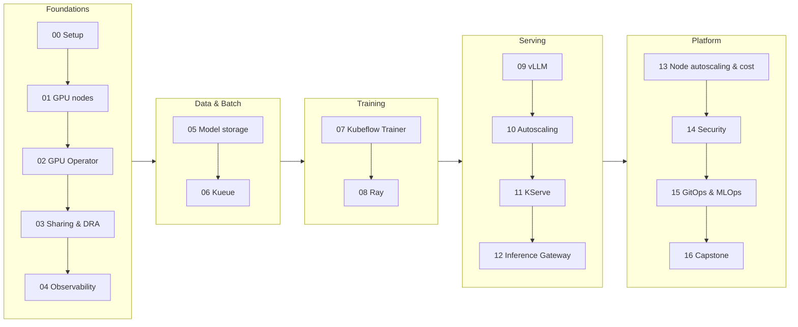

# Kubernetes AI Infrastructure

A hands-on course for DevOps engineers on running AI workloads (GPU scheduling, training, LLM serving,
autoscaling, cost) on Kubernetes. Every lab has variants for **GKE, EKS and AKS**, and runs on **spot
capacity** by default.

Start with [CONVENTIONS.md](CONVENTIONS.md) for folder layout and environment setup.

## How to use this repo

```bash
cp env.sh.example env.sh      # fill in your GCP project / AWS account / Azure subscription
source env.sh && source versions.env
```

Each chapter folder has a `README.md` (theory + lab) plus `common/`, `gke/`, `eks/`, `aks/` and, where
possible, a `cpu-lab/` so you can learn the mechanics before you have GPU quota.

> **Request GPU quota on day 1** (chapter 00). Spot GPU quota approval can take days, and default quota
> for L4/T4 in most regions is 0.

## Course map



| # | Chapter | Core question it answers | Days @3h |
|---|---|---|---|
| 00 | [Prerequisites & cluster setup](00-prerequisites-and-cluster-setup/) | How do I get a spot CPU+GPU cluster on each cloud without surprise bills? | 1 |
| 01 | [GPU nodes & scheduling](01-gpu-nodes-and-scheduling/) | How does a GPU actually get into a pod? | 1 |
| 02 | [NVIDIA GPU Operator](02-nvidia-gpu-operator/) | When should I manage the GPU software stack myself? | 1 |
| 03 | [GPU sharing & DRA](03-gpu-sharing-and-dra/) | How do I avoid wasting a whole GPU on a small workload? | 1–2 |
| 04 | [GPU observability](04-gpu-observability/) | Is my expensive GPU actually doing work? | 1 |
| 05 | [Model storage & data](05-model-storage-and-data/) | How do 10–100 GB of weights get to the pod quickly? | 1–2 |
| 06 | [Batch jobs & Kueue](06-batch-jobs-and-kueue/) | How do teams share scarce GPUs fairly? | 1–2 |
| 07 | [Distributed training](07-distributed-training-kubeflow-trainer/) | How do I train across many pods and survive spot preemption? | 2 |
| 08 | [Ray on Kubernetes](08-ray-on-kubernetes/) | When is Ray a better fit than plain Jobs? | 1–2 |
| 09 | [LLM inference with vLLM](09-llm-inference-with-vllm/) | What does it take to serve an LLM reliably? | 2 |
| 10 | [Autoscaling inference](10-autoscaling-inference/) | Why doesn't CPU-based HPA work, and what does? | 1–2 |
| 11 | [KServe](11-kserve/) | What does a model-serving platform add? | 1–2 |
| 12 | [Inference gateway & multi-node serving](12-inference-gateway-and-multinode-serving/) | How should LLM traffic be routed and big models split? | 2 |
| 13 | [Node autoscaling & cost](13-node-autoscaling-and-cost/) | How do I get GPUs just in time and pay less? | 2 |
| 14 | [Multi-tenancy & security](14-multi-tenancy-and-security/) | How do I safely share the platform? | 1–2 |
| 15 | [GitOps & MLOps pipelines](15-mlops-gitops-and-pipelines/) | How do I manage all this declaratively? | 2 |
| 16 | [Capstone AI platform](16-capstone-ai-platform/) | Can I build and operate the whole thing? | 3 |

**About 25–30 days at 3 hours/day** (roughly 5–6 weeks at 5 days/week).

## Suggested daily rhythm (3 hours)

| Block | Time | What |
|---|---|---|
| Theory | 45 min | Read the chapter "Why" + "Concepts"; sketch the diagram yourself |
| Lab | 1 h 45 min | Do the lab on your primary cloud; skim the other two clouds' diffs |
| Review | 30 min | Answer checkpoint questions without peeking, run cleanup, write notes |

Pick **one primary cloud** (GKE if you're starting from an existing GKE cluster) for full labs, and read
the EKS/AKS overlays to learn the differences. Do the full labs on the other clouds when you revisit.

## Cost safety

- Spot GPU node pools are created with **min nodes = 0**, so they only cost money while a GPU pod is pending or running.
- Every chapter has `cleanup.sh` scripts. Run them at the end of each session.
- Set budget alerts (chapter 00) on all three clouds before creating GPU pools.

## Versions

All pinned in [versions.env](versions.env) (verified 2026-09-16, Kubernetes 1.35).
