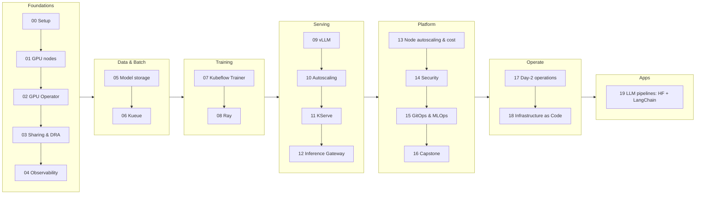

# Kubernetes AI Infrastructure

[](https://github.com/GitOpsHub/kubernetes-ai-infrastructure/actions/workflows/validate.yml)

A hands-on course for DevOps engineers on running AI workloads — GPU scheduling, training, LLM
serving, autoscaling, and cost management — on Kubernetes. Every lab targets **EKS** and runs on
**spot capacity** by default across 20 numbered chapters.

---

## New to Kubernetes, GPUs, or AWS? Start here

This course assumes you're comfortable at a Linux command line and have written some Python — that's
it. It does **not** assume you've used Kubernetes before, touched a GPU or CUDA, or worked in AWS.
Chapter 00 walks through creating your first cluster and AWS account setup from scratch.

In plain English: **Kubernetes** is a system that runs your applications as containers across a group
of machines (a "cluster"), automatically restarting, scaling, and placing them for you instead of you
SSH-ing into servers by hand. **GPU scheduling for AI workloads** is about telling Kubernetes "this
container needs a GPU, not just CPU and memory" so it lands on a machine that has one — and, since GPUs
are scarce and expensive, doing that fairly and efficiently across training jobs and model-serving
requests instead of one team quietly hogging every card. The 20 chapters below build up everything
around that idea: getting GPUs into pods, sharing them, storing and loading multi-gigabyte model
weights, training across many machines, serving models at scale, autoscaling, and keeping the cost of
all this under control.

---

## Quick Start (3 commands)

```bash
# 1. Set up your environment (fill in your AWS account ID, region, and budget email)
cp env.sh.example env.sh
source env.sh && source versions.env

# 2. Verify the repo renders cleanly
./scripts/validate-all.sh

# 3. Open chapter 00 and follow the lab
# -> 00-prerequisites-and-cluster-setup/README.md
```

> **Request GPU quota on day 1** (chapter 00). Spot GPU quota approval can take days, and the
> default quota for L4/T4 in most regions is 0.

---

## What you need before starting

| Requirement | Details |
|---|---|
| **AWS account** | Admin/owner-level IAM access to create EKS clusters, EC2 instances, and IAM roles |
| **Budget** | ~$20-50/month for labs (spot discount applies; run cleanup after every session) |
| **OS** | macOS or Linux (Windows via WSL2) |
| **Tools** | `kubectl`, `helm`, `aws` CLI v2, `eksctl`, `k9s`, `jq` -- chapter 00 installs all of these |
| **Python** | Basic familiarity only (chapter 19 has Python sources) |

---

## How to use this repo

1. **Set up your environment** -- copy `env.sh.example` to `env.sh`, fill in your AWS account ID,
   region, and budget email, then source both files before running any command:
   ```bash
   cp env.sh.example env.sh
   source env.sh && source versions.env
   ```
2. **Work through chapters in order** the first time. Each chapter README is self-contained: it
   explains its concepts before using them and assumes nothing beyond what earlier chapters set up.
   Jumping ahead is fine once you know what a chapter depends on.
3. **Everything is copy-pasteable** -- each chapter README's Lab section inlines every command with
   an explanation before it and an expected output snippet after it. You never need to open a
   separate script file.
4. **Apply manifests directly**: `kubectl apply -f NN-chapter/eks/some-manifest.yaml` -- every
   manifest under a chapter's `eks/` folder is plain, self-contained Kubernetes YAML (node selectors,
   tolerations, and storage classes are written directly into the file); no templating or overlay
   tool needed. (A handful of chapters haven't been converted from the old kustomize layout yet --
   CONVENTIONS.md tracks migration status.)
5. **Clean up after every session.** Each chapter ends with a Cleanup section. Run it. Forgotten
   spot GPU nodes cost real money.

Read [CONVENTIONS.md](CONVENTIONS.md) for the full folder layout and README section contract. Every
manifest and shell script in this repo is checked on every PR by
[`scripts/validate-all.sh`](scripts/validate-all.sh) -- run it locally before you push:

```bash
./scripts/validate-all.sh
```

---

## Course map



| # | Chapter | Core question it answers | Days @3h |
|---|---|---|---|
| 00 | [Prerequisites & cluster setup](00-prerequisites-and-cluster-setup/) | How do I get a spot CPU+GPU EKS cluster without surprise bills? | 1 |
| 01 | [GPU nodes & scheduling](01-gpu-nodes-and-scheduling/) | How does a GPU actually get into a pod? | 1 |
| 02 | [NVIDIA GPU Operator](02-nvidia-gpu-operator/) | When should I manage the GPU software stack myself? | 1 |
| 03 | [GPU sharing & DRA](03-gpu-sharing-and-dra/) | How do I avoid wasting a whole GPU on a small workload? | 1-2 |
| 04 | [GPU observability](04-gpu-observability/) | Is my expensive GPU actually doing work? | 1 |
| 05 | [Model storage & data](05-model-storage-and-data/) | How do 10-100 GB of weights get to the pod quickly? | 1-2 |
| 06 | [Batch jobs & Kueue](06-batch-jobs-and-kueue/) | How do teams share scarce GPUs fairly? | 1-2 |
| 07 | [Distributed training](07-distributed-training-kubeflow-trainer/) | How do I train across many pods and survive spot preemption? | 2 |
| 08 | [Ray on Kubernetes](08-ray-on-kubernetes/) | When is Ray a better fit than plain Jobs? | 1-2 |
| 09 | [LLM inference with vLLM](09-llm-inference-with-vllm/) | What does it take to serve an LLM reliably? | 2 |
| 10 | [Autoscaling inference](10-autoscaling-inference/) | Why doesn't CPU-based HPA work, and what does? | 1-2 |
| 11 | [KServe](11-kserve/) | What does a model-serving platform add? | 1-2 |
| 12 | [Inference gateway & multi-node serving](12-inference-gateway-and-multinode-serving/) | How should LLM traffic be routed and big models split? | 2 |
| 13 | [Node autoscaling & cost](13-node-autoscaling-and-cost/) | How do I get GPUs just in time and pay less? | 2 |
| 14 | [Multi-tenancy & security](14-multi-tenancy-and-security/) | How do I safely share the platform? | 1-2 |
| 15 | [GitOps & MLOps pipelines](15-mlops-gitops-and-pipelines/) | How do I manage all this declaratively? | 2 |
| 16 | [Capstone AI platform](16-capstone-ai-platform/) | Can I build and operate the whole thing? | 3 |
| 17 | [Platform day-2 operations](17-platform-day2-operations/) | How do I keep this running: drains, upgrades, incidents, backup/DR, chargeback? | 2 |
| 18 | [Infrastructure as Code](18-infrastructure-as-code/) | How would a platform team actually provision these clusters (Terraform, not CLI scripts)? | 1-2 |
| 19 | [LLM pipelines on EKS: Hugging Face + LangChain](19-llm-pipelines-huggingface-langchain/) | How do I wire a Hugging Face model -> fine-tune -> serve -> LangChain app pipeline on AWS? | 2 |

**About 29-37 days at 3 hours/day** (roughly 6-8 weeks at 5 days/week).

---

## Beyond the Labs: AI Infrastructure Research & Seminal Papers

Looking to master the frontier systems engineering concepts and research papers behind modern AI platforms?
Check out the companion master guide:

👉 **[AI Infrastructure: Advanced Landscape, Missing Pillars & Curated Research Canon](AI_INFRASTRUCTURE_RESEARCH_AND_ARTICLES.md)**

It covers:
- **The 8 Missing Architectural Pillars**:
  1. *GPU Interconnect & Networking*: RDMA, RoCEv2, AWS EFA, GPUDirect RDMA, and NCCL tuning.
  2. *Disaggregated Prefill & Decode (PD Disaggregation)*: Splitwise, Mooncake, and decoupled compute/memory pools.
  3. *KV-Cache-Aware Routing & Semantic Caching*: `llm-d`, RadixAttention (SGLang), and Gateway API prefix routing.
  4. *Mixture of Experts (MoE) & 4D Parallelism*: Expert Parallelism (EP), All-to-All communication, DeepSeek DualPipe & MLA.
  5. *High-Density Multi-LoRA Serving*: Dynamic adapter swapping (S-LoRA, Punica).
  6. *Agentic Workload Sandboxing*: Model Context Protocol (MCP) in K8s, gVisor, Firecracker microVMs.
  7. *Heterogeneous AI Silicon*: AWS Trainium/Inferentia (Neuron), Google Cloud TPU, and AMD ROCm.
  8. *Extreme Cold-Start Optimization*: P2P model streaming (Dragonfly), SafeTensors mmap, and S3 Express OneZone.
- **The Definitive Research Canon**: Detailed breakdowns and direct links to the seminal papers every AI infra engineer should read (*PagedAttention*, *FlashAttention 1-3*, *Splitwise*, *ZeRO*, *Megatron-LM*, *RingAttention*, *Meta Llama 3 Infrastructure*, *DeepSeek-V3 Report*, *EAGLE*).
- **Essential Industry Engineering Blogs**: Meta Engineering, SemiAnalysis, Tim Dettmers, Eugene Yan, and NVIDIA Tech Blogs.

---

## Suggested daily rhythm (3 hours)

| Block | Time | What |
|---|---|---|
| Theory | 45 min | Read the chapter "Why" + "Concepts"; sketch the diagram yourself |
| Lab | 1 h 45 min | Do the EKS lab |
| Review | 30 min | Answer checkpoint questions without peeking, run cleanup, write notes |

---

## Cost safety

- Spot GPU node groups are created with **min nodes = 0**, so they only cost money while a GPU pod is pending or running.
- Every chapter's README ends with a Cleanup section. Run it at the end of each session.
- Set a budget alert (chapter 00) on your AWS account before creating GPU node groups.
- Check for leftover EBS volumes and load balancers after deleting a cluster -- they are **not** automatically removed and will continue billing.

---

## Versions

All component versions are pinned in [versions.env](versions.env) (verified 2026-09-16/18,
Kubernetes 1.35). Environment variables (AWS account ID, region, etc.) go in `env.sh` -- copy
[env.sh.example](env.sh.example) and fill it in before running any command.
